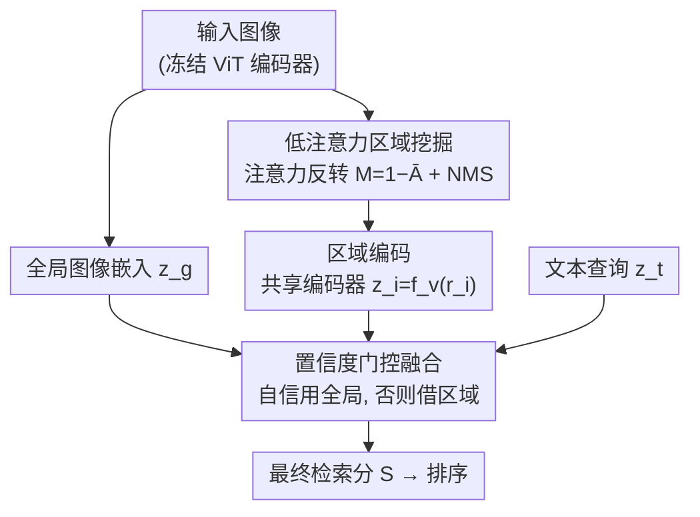

# LARE: Low-Attention Region Encoding for Text–Image Retrieval

**会议**: ICML2026  
**arXiv**: [2606.18885](https://arxiv.org/abs/2606.18885)  
**代码**: https://github.com/AbdulmalikDS/LARE  
**领域**: 信息检索 / 多模态VLM  
**关键词**: 文本-图像检索, 低注意力区域, 免训练, 注意力反转, 密集场景

## 一句话总结
LARE 是一个**免训练**的文本-图像检索框架：它把视觉编码器内部「低注意力」的区域单独抠出来再编码，用置信度门控的方式补进全局相似度里，从而在拥挤、含小目标/稀有目标的密集场景里把 CLIP/SigLIP 这类双编码器的检索召回明显拉高，而在常规数据集上几乎不掉点。

## 研究背景与动机

**领域现状**：文本-图像检索的主流是 CLIP、ALIGN、SigLIP 这类双编码器（dual-encoder）模型——图像编码器和文本编码器各自把输入投到一个共享语义空间，检索时直接算文本向量与图像向量的相似度排序。这套范式高效、可零样本迁移，已经是跨模态检索的事实标准。

**现有痛点**：双编码器把整张图压成**一个全局向量**。这个全局表示天然偏向画面里最显著的主体或场景语境，而把占比小、不突出的元素「平均掉」了。后果是：当一条查询的关键线索恰好落在某个非主导的小目标上（比如「拥挤街道里推婴儿车的人」中的婴儿车），检索模型往往只匹配到「整体也很拥挤」的图，却丢掉了真正决定相关性的局部线索。

**核心矛盾**：全局池化带来的**显著性偏置（salience bias）**和细粒度检索所需的局部证据之间存在根本张力——越是把图概括成一个向量，越容易抹掉稀有/小目标。作者指出这是全局嵌入的固有特性，连 SigLIP 2 这种强编码器也没能靠规模消除。

**本文目标**：在**不重新训练、不加参数、不改架构**的前提下，把被全局表示忽略掉的区域级证据找回来，并且只在「该用的时候」用，避免污染本来就对的常规查询。

**切入角度**：作者的关键观察是——基于 Transformer 的视觉编码器的自注意力其实**隐式编码了空间注意力信号**，能告诉你哪些 patch 对最终嵌入贡献很小。既然如此，就不必只信全局向量，而可以反过来利用这些信号去定位「欠关注」的区域。

**核心 idea**：把注意力图**反转**，挖出低注意力区域，用同一个冻结编码器单独编码这些区域，再用一个置信度门控机制决定要不要把区域证据融进检索分数——即「用低注意力区域编码补全显著性偏置」。

## 方法详解

### 整体框架

LARE 是挂在现成双编码器（CLIP/SigLIP/SigLIP 2）之上的**推理期增强**，一次前向就能跑完，分三步：(1) 低注意力区域检测——从冻结编码器的自注意力反推出被忽略的区域；(2) 区域编码——用同一个编码器把这些区域单独编码进同一语义空间；(3) 置信度门控打分——把全局相似度和区域相似度按「全局有多自信」融合成最终检索分。除了检索框架，作者还配套构建了 **Dense-Set** 评测集，专门暴露密集场景下的显著性偏置问题（见关键设计 4）。

### 关键设计

**1. 低注意力区域挖掘：把注意力图反过来用，定位被全局表示忽略的区域**

痛点是全局向量抹掉了小/稀有目标，而这些目标恰恰落在编码器「不怎么看」的地方。LARE 从中间层 $\ell$ 取出每个注意力头的 patch-to-patch 注意力矩阵 $\mathbf{A}^{(h)}\in\mathbb{R}^{HW\times HW}$，用**列求和**度量每个 patch $i$ 收到的总注意力 $a_i^{(h)}=\sum_j A_{j,i}^{(h)}$；把各头的注意力图 reshape 成空间网格、min-max 归一化，再按空间方差选 top-$k$ 个头取平均，得到平均注意力图 $\bar{\mathbf{A}}$。关键一步是**反转**：$\mathbf{M}=\mathbf{1}-\bar{\mathbf{A}}$，于是 $\mathbf{M}$ 里数值高的地方正是长期没被关注的 patch。最后在 $\mathbf{M}$ 上做滑窗 + 非极大值抑制（NMS）得到 $N$ 个候选区域 $\mathcal{R}=\{r_1,\dots,r_N\}$。和那些需要额外检测器或显著性模型的做法不同，这里的「区域信号」完全来自编码器自己已经算好的注意力，零额外训练。

**2. 共享编码器的区域编码：免训练复用同一特征空间**

挖出区域后还要让它们能直接和文本比相似度。LARE 用**同一个冻结编码器** $f_v$ 单独编码每个候选区域：$\mathbf{z}_i=f_v(r_i),\ i=1,\dots,N$，得到一组区域特征 $\{\mathbf{z}_1,\dots,\mathbf{z}_N\}$。因为编码器权重共享，这些区域嵌入和全局嵌入天然处在**同一特征空间**，可以不加任何投影/对齐就和文本嵌入直接算相似度。这正是「免训练、即插即用」的关键——不像 RegionCLIP、ELIP 那样需要重训或引入查询条件化的编码器，LARE 只是在推理时多跑几次同一个编码器。

**3. 置信度门控融合：全局自信时不动，只在不自信时才借区域证据**

有了区域分数还要决定怎么和全局分数合并。先前的视频检索工作用**硬最大值**直接取全局与区域的较大者，但当全局嵌入本来就对得很准时，硬 max 会放大虚假的区域匹配。LARE 改用**置信度门控融合**：记全局相似度 $s_g=\text{sim}(\mathbf{z}_t,\mathbf{z}_g)$、最强区域匹配 $s_r=\max_i \text{sim}(\mathbf{z}_t,\mathbf{z}_i)$。若 $s_g$ 超过置信阈值 $\tau$，最终分就**完全沿用全局** $S=s_g$；只有当 $s_g<\tau$ 且某区域比全局更匹配（$s_r>s_g$）时，才向区域分数插值：

$$\alpha=\min\bigl(2(s_r-s_g),\,0.5\bigr),\qquad S=(1-\alpha)\,s_g+\alpha\,s_r$$

其中 $\tau=0.25$，插值系数 $\alpha$ 上限 0.5 保证全局分始终占主导。这套门控带来的好处是**「常规查询不回退、密集查询被救回」**：绝大多数标准数据集查询描述的是主导内容、全局已经自信，于是门控直接放行全局分（保证 no-regression）；区域证据只在全局不够用时被激活，正好对应 Dense-Set 想隔离的细粒度场景。

**4. Dense-Set 评测集：用密度排序 + 稀有类过滤 + 重写描述逼出显著性偏置**

要验证「找回低注意力区域」有没有用，得有一个真正考验细粒度检索的评测集，而 COCO/Flickr30K 原始 caption 多在描述主导场景。作者据此构建 **Dense-Set**：先用 YOLO 检测器跑 COCO 与 Flickr30K 测试集，统计每张图的总目标数、类别数、各类实例频次，按总目标数降序取**前 10%** 作为高密度候选池（平均目标数从约 6.7 飙到 ~20）；再在候选池里筛出**至少含一个「稀有类」**（在该图里只出现一次的单实例类别）的图——这些单实例小目标最容易被全局表示忽略。最后用 BLIP-2 做**重写描述**：过滤掉占图面积过大（>15%）的稀有类框（避免又是显著主体），用类感知模板（如「a photo of a [class]」）提示模型，把 caption 的焦点从场景语境转到这些被忽视的物体上，生成更难的查询。这样得到的 Dense-Set 目标密度和类别多样性都远高于原 split，是专门暴露显著性偏置的检索基准。

### 损失函数 / 训练策略
LARE **完全不训练**：所有编码器权重冻结，方法只在推理期工作，无额外参数、无架构改动。可调超参主要是候选区域数 $N$ 和置信阈值 $\tau=0.25$（论文在附录做了敏感性分析）。

## 实验关键数据

### 主实验
在零样本检索设置下评测（不在目标基准上做任何微调），指标用 Recall@K。下表节选 R@1（%），可见 LARE 在标准 split 上与骨干几乎持平，而在 Dense-Set 上大幅提升：

| 骨干 / 方法 | COCO R@1 | Flickr30K R@1 | COCO-Dense R@1 | Flickr30K-Dense R@1 |
|------|------|------|------|------|
| CLIP (L/14) | 36.10 | 65.00 | 17.79 | 3.48 |
| **LARE (CLIP)** | 36.10 | 65.00 | **22.97** (+5.18) | **9.73** (+6.25) |
| SigLIP (So/14) | 54.24 | 82.94 | 26.61 | 5.05 |
| **LARE (SigLIP)** | 54.26 | 82.94 | **29.94** (+3.33) | **12.33** (+7.28) |
| SigLIP 2 (So/16) | 56.55 | 83.72 | 27.56 | 5.12 |
| **LARE (SigLIP 2)** | 56.56 | 83.76 | **31.00** (+3.44) | **13.28** (+8.16) |

在 COCO-Dense 上 CLIP 的 R@1 相对提升约 29%；在更稀疏标注的 Flickr30K-Dense 上提升尤其夸张——CLIP +6.25 点（相对 +180%）、SigLIP +7.28（+144%）、SigLIP 2 +8.16（+159%）。三个骨干一致受益，说明「显著性偏置」是全局嵌入的共性问题，且 LARE 作为即插即用的推理增强可以叠加在最强编码器上。

### Dense-Set 构建统计
Dense-Set 的密度远高于原始 split，这正是它能暴露问题的原因：

| 数据集 | 阶段 | 图片数 | 平均目标数 | 平均类别数 |
|------|------|------|------|------|
| COCO | 原始测试集 | 40,504 | 6.71 | 2.85 |
| COCO | 高密度子集 (top 10%) | 4,050 | 21.63 | 4.82 |
| COCO | **Dense-Set** | 3,089 | 21.63 | 5.47 |
| Flickr30K | 原始测试集 | 31,783 | 6.73 | 2.48 |
| Flickr30K | **Dense-Set** | 2,477 | 19.55 | 4.85 |

### 关键发现
- **「不掉点」是设计出来的，不是没效果**：标准 split 上几乎零变化，是因为置信门控对全局已自信的查询直接放行；增益只在 Dense-Set 这种细粒度场景被激活，证明收益来自编码器的显著性偏置而非某个 split 的偶然性。
- **越稀疏标注、增益越大**：Flickr30K-Dense 基线 R@1 极低（3–5），LARE 把它翻了 2–3 倍，说明低注意力区域里确实藏着决定相关性的关键线索。
- **跨骨干一致**：从 CLIP 到 SigLIP 2 都稳定提升，方法对骨干不敏感，可作为通用的检索后处理。

## 亮点与洞察
- **「反转注意力」这一招很巧**：大多数工作盯着「编码器在看哪」，LARE 偏偏去看「编码器没在看哪」，把被忽略的区域当成检索证据的来源——同一份注意力，换个方向用就成了新信号。
- **置信度门控比硬 max 更稳**：用一个简单阈值 + 受限插值，既保证常规查询零回退、又能在密集场景救回排名，是「只在该用时才用」的优雅工程实现，可迁移到任何「全局+局部双路打分」的检索/重排任务。
- **免训练、零参数、即插即用**：不动骨干、不加模块，纯推理期增强，落地成本极低，对已部署的 CLIP/SigLIP 检索系统几乎可以白嫖。
- **配套基准补齐了评测缺口**：Dense-Set 的密度排序 + 稀有单实例过滤 + VLM 重写描述这套流水线，本身就是研究密集场景细粒度检索的可复用工具。

## 局限与展望
- **额外推理开销**：每张图要多编码 $N$ 个区域，候选数 $N$ 越大开销越高，大规模索引下需要权衡。
- **依赖注意力质量**：低注意力区域的可靠性取决于骨干注意力图是否真的反映语义重要性；若编码器注意力本身有偏，反转也会带偏。
- **Dense-Set 由自动流水线 + BLIP-2 重写生成**：稀有类定义为「单实例类别」、面积阈值 15%、重写 caption 都是启发式，可能引入数据偏差；重写质量也受 BLIP-2 能力约束。
- **门控超参固定**：$\tau=0.25$、$\alpha$ 上限 0.5 等为经验值，跨域迁移时可能需要重新校准。

## 相关工作与启发
- **vs CLIP / SigLIP / ALIGN（全局双编码器）**：它们只给一个全局向量、受显著性偏置困扰；LARE 在其之上补区域证据，标准集不回退、密集集大幅提升，且无需重训。
- **vs FILIP / RegionCLIP / ELIP（细粒度/区域对齐）**：这些方法多需额外训练、改架构或查询条件化编码器；LARE 完全在推理期工作、零训练零参数。
- **vs 视频检索中的逆注意力 + 硬 max 融合（Alhajari et al., 2026）**：思路相关但 LARE 面向图像检索，并用置信度门控融合替代硬最大值，避免在全局已对齐时放大虚假区域匹配，同时贡献了 Dense-Set 基准。

## 评分
- 新颖性: ⭐⭐⭐⭐ 「反转注意力挖低注意力区域 + 置信门控融合」组合新颖，但单项技术（区域编码、晚期融合）有先例。
- 实验充分度: ⭐⭐⭐⭐ 三骨干 × 两数据集 × 标准/密集四档对比 + 配套基准，较扎实；但仅 Recall@K、未含更大规模检索库。
- 写作质量: ⭐⭐⭐⭐ 动机清晰、no-regression 论证到位，流水线与公式表述明确。
- 价值: ⭐⭐⭐⭐ 免训练即插即用、对已部署系统几乎零成本，密集场景实用价值高。

<!-- RELATED:START -->

## 相关论文

- [\[ICLR 2026\] Bayesian Attention Mechanism: A Probabilistic Framework for Positional Encoding and Context Length Extrapolation](../../ICLR2026/information_retrieval/bayesian_attention_mechanism_a_probabilistic_framework_for_positional_encoding_a.md)
- [\[ACL 2026\] VisRet: Visualization Improves Knowledge-Intensive Text-to-Image Retrieval](../../ACL2026/information_retrieval/visret_visualization_improves_knowledge-intensive_text-to-image_retrieval.md)
- [\[ICML 2026\] LazyAttention: Efficient Retrieval-Augmented Generation with Deferred Positional Encoding](lazyattention_efficient_retrieval-augmented_generation_with_deferred_positional_.md)
- [\[ACL 2026\] Reliable Evaluation Protocol for Low-Precision Retrieval](../../ACL2026/information_retrieval/reliable_evaluation_protocol_for_low-precision_retrieval.md)
- [\[ACL 2025\] LDIR: Low-Dimensional Dense and Interpretable Text Embeddings with Relative Representations](../../ACL2025/information_retrieval/ldir_low-dimensional_dense_and_interpretable_text_embeddings_with_relative_repre.md)

<!-- RELATED:END -->
