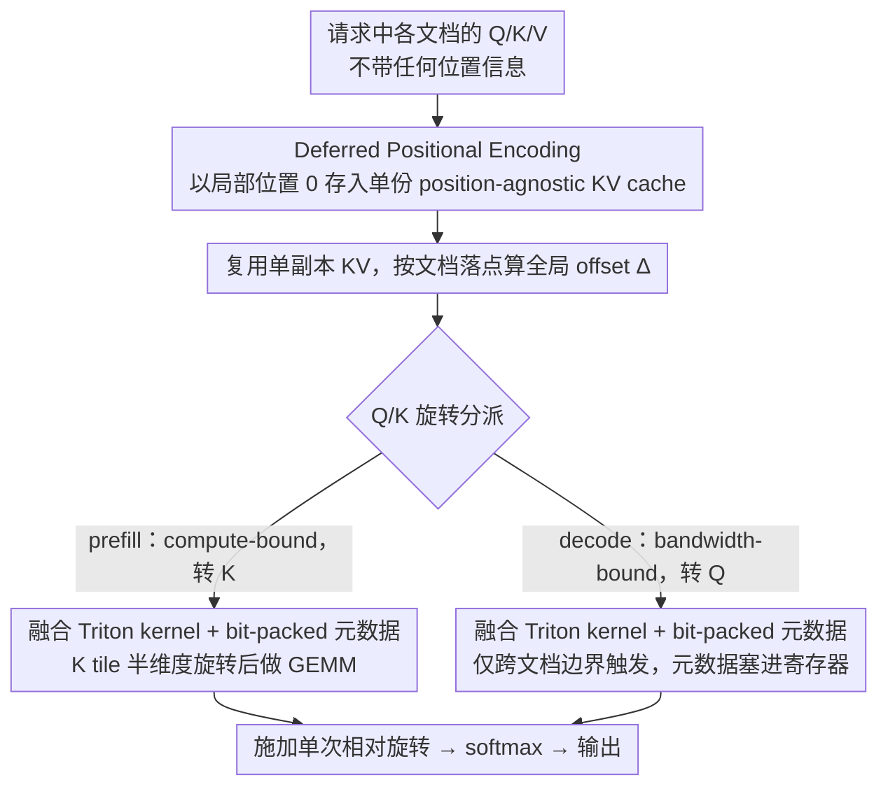

# LazyAttention: Efficient Retrieval-Augmented Generation with Deferred Positional Encoding

**会议**: ICML 2026  
**arXiv**: [2606.04302](https://arxiv.org/abs/2606.04302)  
**代码**: https://github.com/illinoisdata/lazy-attention  
**领域**: LLM 推理效率 / RAG / KV Cache  
**关键词**: KV 缓存复用, RoPE 解耦, 融合 attention kernel, 位置无关缓存, vLLM

## 一句话总结
LazyAttention 把 RoPE 位置编码从 KV 缓存写入阶段推迟到 attention kernel 内部 on-the-fly 完成，让同一份物理 KV 副本可以被任意 logical 位置复用，在 skewed RAG 工作负载上比 SOTA Block-Attention 减少 1.37× TTFT、提升 1.40× 吞吐，且生成质量基本无损。

## 研究背景与动机
**领域现状**：RAG / ICL 这类长上下文场景里，prefill 是延迟瓶颈，KV cache 复用是降本主线。Prompt Cache、CacheBlend、TurboRAG、Block-Attention 等一系列方法都在尝试跨请求复用 KV，让前面算过的文档不必再算一遍。

**现有痛点**：现有方案的 KV cache 都是 **position-aware** 的——位置信息在写入缓存前就被 eagerly 编码进了 K（典型如 RoPE 直接转过的 K），导致同一个文档出现在不同 prompt 位置时必须存多份 KV 副本。Block-Attention/TurboRAG 选择再编码（re-encode）位置，但需要复制 KV 或者只能复用 prefix；in-place 更新又会引入同一 batch 内 race condition。

**核心矛盾**：cache 复用率受限于 GPU HBM 容量，而 position-aware 设计强制把宝贵容量花在"同一文档不同位置变体"上。作者给出了量化分析：在 Zipf 流行度 + D 个可能位置 + C 个 KV 条目预算下，position-agnostic 缓存可放 top-C 个文档，position-aware 只能放 ⌊C/D⌋ 个，命中率比是 $\sum_{i=1}^{C} i^{-\alpha} / \sum_{i=1}^{\lfloor C/D \rfloor} i^{-\alpha}$，在 D=20、C=100、moderate Zipf 下能达到 2.86×。

**本文目标**：让 KV cache 真正做到 position-agnostic，同时既不增加 HBM 复制开销，也不显著增加 attention kernel 的计算/带宽成本。

**切入角度**：RoPE 的核心 fact —— 注意力分数只依赖 query/key 的**相对**位置 $n-m$，即 $(R_m q)^\top (R_n k) = q^\top R_{n-m} k$。这意味着位置编码理论上可以在 attention 计算时再"现场"施加，而不必预先烘焙进 K。

**核心 idea**：把 RoPE-decoupling 这件事**核函数化**（kernelize），让 deferred positional encoding 在 fused Triton attention kernel 的内层循环里 transient 完成，零拷贝、零额外 HBM 写入，单份 KV 副本即可服务任意 logical 位置的请求。

## 方法详解

### 整体框架
LazyAttention 要解决的是 KV cache 因 position-aware 而被位置变体撑爆的问题，做法是把同一个 Transformer block 的位置编码"时机"挪后：写缓存时 Q/K/V 都不带任何位置信息，每个文档都以局部位置 0 开始当作"纯内容键值对"存进 KV cache；用缓存时再在 fused attention kernel 内部，根据该文档在当前请求里落到的全局 offset $\Delta$，on-the-fly 给 Q 或 K 施加一次相对旋转 $R_\Delta$ 后才算 softmax。由于 RoPE 注意力分数只依赖相对位置（$(R_m q)^\top(R_n k)=q^\top R_{n-m}k$），这套"现场补位置"的算法和"预先把 K 旋转到目标位置"的标准 RoPE 完全等价，但物理上 KV cache 只需存一份。直观上（Example 3.1），文档 $d_1,d_2$ 各自缓存为从位置 0 起算的 $C_1,C_2$，当请求是 $d_1\mathbin\Vert d_2\mathbin\Vert Q$ 时，复用 $C_2$ 只需把 $Q$ 反向旋转 $|d_1|$ 步，就能与"$C_2$ 仍假装自己在位置 0..|d_2|"的缓存状态对齐。

### 关键设计

**1. Deferred Positional Encoding：把 RoPE 从写缓存推迟到算 attention**

position-aware 缓存把位置 eagerly 烘焙进 K，于是同一文档每出现在一个新位置就得另存一份 KV，宝贵的 HBM 全花在"同文档不同位置变体"上。LazyAttention 抓住 RoPE 的相对性 $q^\top R_{n-m}k$，让 Q/K/V 入缓存时不带位置，attention 时只用一个 offset $\Delta$ 把 K（或 Q）的 RoPE 半维度旋转一次：$k'_1 = k_1\cos\Delta - k_2\sin\Delta,\; k'_2 = k_1\sin\Delta + k_2\cos\Delta$。关键是这是**单次相对旋转**而非 naive 的"先转回位置 0、再转到目标"——后者要旋转两次，会把 decoding 的 FLOPs/IO 抬到 ~100%–150% 的不可承受区间。由此 KV cache 变成 position-agnostic 的内容键值对，同一文档不再占多个位置 entry，固定 HBM 预算下能覆盖更多文档，命中率按前述 Zipf 公式提升。

**2. Tiling 感知的 Q/K 旋转分派：prefill 转 K、decode 转 Q**

deferred RoPE 听上去"每个 token 都要多算位置"，能否上线全看额外开销压不压得住，而 prefill 与 decode 的瓶颈截然不同，所以该转哪一侧也不同。prefill 是 compute-bound，PagedAttention 默认 $M=128,N=16$，Q tile 远大于 K tile，于是转 K 更便宜：每个 K scalar 仅加 3 FLOPs，相对开销 $\epsilon_{\text{prefill}}=\tfrac{3}{4M}\approx 0.59\%$，再算上每文档加载一次 D 长 cos/sin 向量的查表带宽 $\le\tfrac{1}{2N}$。decode 是 bandwidth-bound 且 $M=1$，此时转 K 会扫一整 tile、转 Q 只是 3D 个固定 FLOPs，故改转 Q，并且只在 KV tile 跨文档边界换 offset 时才触发，触发率 $r=1/B$（$B$ 为文档块数），平均开销 $\epsilon_{\text{decode}}=r\cdot\tfrac{3}{4N}=\tfrac{3}{4BN}$，文档 >1600 token 时 $\epsilon_{\text{decode}}\le 0.01\%$。这套分派把"额外工作"分别塞进 compute-bound 阶段的廉价槽位和 bandwidth-bound 阶段的极稀疏触发点，把 deferred rotation 的代价从理论上的 ~100% 压回到 ~0.2%，让算法节省不被 kernel 常数项吃光。

**3. 融合 Triton kernel + bit-packed 元数据：把节省落到端到端**

算法再漂亮，只要在 inner-loop 引入额外 HBM 访存或寄存器溢出，前面省下的 cache 红利就会被吐回去，所以 deferred rotation 必须在 vLLM/FlashAttention 风格的 fused kernel 里零额外访存地落地。作者基于 vLLM v0.8.5 + Triton 写了两套独立 kernel：prefill kernel 把每个 K tile 切两半做半维度 rotation 后再 GEMM（Figure 3b）；decode kernel 则把 (block id, offset, mask) **bit-pack 进单个 64-bit 寄存器**，inner loop 用寄存器移位拆出元数据，完全 bypass global load，极端 IO-bound 时甚至可以 on-the-fly 算 cos/sin 不读表。整套实现约 5K 行 Python/Triton，端到端 runtime 额外开销实测 ~0.2%，是把"算法节省"翻译成"上线节省"的最后一公里。

机制本身也不绑死原版 RoPE：interleaved RoPE、NTK/YaRN scaled RoPE 只是换 metadata；GQA/MQA 不动 score 计算所以零修改；连 score-space 的相对位置方法 ALiBi 也能套用（Falcon-7B 上 decode 额外开销 <0.06%）。唯一例外是 linear attention——它把序列汇总放进 attention state 而非只在 score 注入位置，故 lazy 思想暂时搬不过去。

## 实验关键数据

### 主实验
模型 Tulu3-Block-FT（Llama-3.1-8B 衍生），H100 96GB，QA benchmark：2WikiMQA / HotpotQA / TriviaQA / NarrativeQA。

**TTFT 与吞吐**：在 Zipf $\alpha=2.1$ 的 skewed 流量下，相对 Block-Attention（vLLM）减少 1.37× TTFT、提升 1.40× 吞吐；uniform 流量下与 Block-Attn 持平、明显优于 Prefix Caching / Prompt Cache / CacheBlend。

**KV 缓存命中率**（VRAM hit ratio %，trace-driven，Zipf $\alpha = 1.1/1.5/2.1$）：

| KV 预算 | Skew | Prefix | CacheBlend | Block-Attn (vLLM) | LazyAttn (本文) |
|--------|------|--------|------------|-------------------|-----------------|
| 1 GB | High (α=2.1) | 0.00 | 5.96 | 7.27 | **13.57** |
| 1 GB | Low (α=1.1) | 0.00 | 1.51 | 1.84 | **3.47** |
| 10 GB | Mid | 0.55 | 17.33 | 21.13 | **23.89** |
| 50 GB | Mid | 1.95 | 21.87 | 26.67 | **28.44** |
| No-limit (~66 GB) | Mid | 2.16 | 22.45 | 27.38 | **29.09** |

紧约束下接近翻倍，宽松预算下也稳定领先，说明单副本设计在整个内存谱上都有用。

**生成质量**（Exact Match）：

| 数据集 | Full-Attn | Block-Attn (vLLM) | LazyAttn |
|--------|-----------|-------------------|----------|
| 2WikiMQA | 73.6 | 71.4 | 70.7 |
| TriviaQA | 75.2 | 72.1 | 73.0 |
| NarrativeQA | 62.2 | 61.0 | 59.7 |
| HotpotQA | 76.2 | 72.5 | 73.3 |
| Average | 71.8 | 69.3 | 69.2 |

LazyAttention 与 Block-Attention 计算上数学等价，分数差异仅来自 tokenization 与浮点精度抖动。

### 消融 / kernel 开销
单条 RAG 请求（5 个 4096-token 文档 + 64-token query，3 个文档预热为 hot）对比"无 deferred rotation"与"含 deferred rotation"：

| 阶段 | 关键发现 |
|------|----------|
| Document processing | hot 文档延迟降到接近零（复用免重算）；baseline 被重算成本主导 |
| Query prefilling | 与 baseline 持平，K tile 单次相对旋转额外 FLOPs 仅 $3/(4M)$ |
| Decoding | 每 token 额外开销 0.13%，与理论 $r \cdot 3/(4N)$ 一致 |
| 长上下文 | 文档长度到 16K、context 长度到 128K 仍维持以上结论（Appendix C.4） |

### 关键发现
- 收益的根源是**容量乘数**而非"算得更快"：position-agnostic 让相同 HBM 装下更多文档，命中率提升直接转化为 TTFT/吞吐改善，尤其在小预算 + skewed 流量下增益最大。
- decode 阶段额外开销 ≤0.2% 是关键工程结果——deferred rotation 听起来"每个 token 都要多算位置"，但通过 (a) 只转 Q 不转 K、(b) 仅在文档边界触发、(c) 元数据 bit-pack 进寄存器，三招把理论 ~100% IO 增量压回到几乎不可测。
- 不同 GPU（A100/A40）与更大模型（Llama-3.1-70B、Qwen3-8B）上趋势一致，说明性能来自机制本身而非某代硬件的特殊性。

## 亮点与洞察
- **把"复用"问题归约到"位置依赖"上**：作者用一个清晰的 Zipf 命中率公式 $H_{\text{agnostic}}/H_{\text{aware}} = \sum_{i=1}^{C} i^{-\alpha} / \sum_{i=1}^{\lfloor C/D \rfloor} i^{-\alpha}$ 把 KV cache 复用率瓶颈的根因点穿——不是缓存策略不够聪明，而是 position-aware 这个 representation 选错了。后续所有设计都顺着这条线展开。
- **kernel-aware 的算法设计**：prefill 转 K、decode 转 Q 不是事后调优，而是直接从 roofline 模型推出来的最优选择，体现"算法-系统协同设计"的范式——脱离 attention kernel 的 tiling 形态去谈 deferred RoPE 是失真的。
- **可迁移的 idea**：deferred encoding 的思路（"只要 attention score 计算时位置正确，就不必预先烘焙到 state"）可以推广到其他 score-space 位置编码（ALiBi 已验证），也可以启发"延迟物化 metadata"在 MoE routing、speculative decoding 缓存等场景下的应用。

## 局限与展望
- 不适用于 linear attention：其 state 表示就承担了序列汇总，并不是只在 score 上注入位置，所以 lazy 思想暂时无法直接搬过去。
- 不能处理"内容确实被改写"的复用：本方法假设 cached chunk 在不同请求里逐 token 相同，只是位置不同；prefix-conditioned 编码漂移（如 cross-document attention 在重新组合时的语义差异）不是本文的关注点，仍依赖 Tulu3-Block-FT 这类 block-FT 模型来缓解。
- 评测主要在 H100/A100/A40 GPU 上 + vLLM 框架——不同 attention kernel 实现（SGLang、TensorRT-LLM）下 bit-pack 与 fused 路径需要重写，迁移成本不可忽略。
- 自承的开放方向：与 KV 压缩、grouped-query attention、latent KV 等 orthogonal 路线的组合收益尚未系统化。

## 相关工作与启发
- **vs Block-Attention / TurboRAG（Ma 2025；Lu 2025）**：同样意识到 RoPE 与 KV 解耦的价值，但实现路线是"物化位置调整后的 KV 副本"，要么吃 HBM 要么只能 prefix 复用；LazyAttention 用 fused kernel 内的相对旋转打掉了这个 trade-off，是直接的能力超集。
- **vs CacheBlend（Yao 2025）**：CacheBlend 通过 mask 重建提升精度，但仍处于 position-aware 框架内、且引入了非平凡的重构开销；LazyAttention 在 skewed 流量下 TTFT 和命中率都明显更优。
- **vs Prompt Cache / Prefix Caching**：只能复用严格前缀，命中率受限于 prompt 模板重叠；本方法跨任意 offset 复用，覆盖了"文档级"而非"前缀级"的复用空间。
- **启发**：对任意"计算依赖于元数据但元数据可以延迟注入"的场景（如多租户共享 embedding、共享 LoRA delta），都可以套用"物理上单份共享 + kernel 内 transient 注入"的 pattern。

## 评分
- 新颖性: ⭐⭐⭐⭐ 解耦 RoPE 的想法此前已有，但把它真正 kernelize 成零拷贝、零额外 HBM 的 fused Triton 实现是首次。
- 实验充分度: ⭐⭐⭐⭐ 多模型、多 GPU、多流量分布、生成质量 + 命中率 + kernel 微观分解齐全，附录还覆盖到 16K 文档 / 128K context。
- 写作质量: ⭐⭐⭐⭐ 用 Zipf 公式把动机量化、用 roofline 把开销解析、用 prefill/decode 双 kernel 把工程落地讲透，逻辑链非常顺。
- 价值: ⭐⭐⭐⭐⭐ 对长上下文 RAG 服务的成本/延迟是直接可上线的改进，且 idea 可迁移到其他位置编码与 serving 系统。

<!-- RELATED:START -->

## 相关论文

- [\[ICLR 2026\] Bayesian Attention Mechanism: A Probabilistic Framework for Positional Encoding and Context Length Extrapolation](../../ICLR2026/information_retrieval/bayesian_attention_mechanism_a_probabilistic_framework_for_positional_encoding_a.md)
- [\[ICML 2026\] Hierarchical Abstract Tree for Cross-Document Retrieval-Augmented Generation](hierarchical_abstract_tree_for_cross-document_retrieval-augmented_generation.md)
- [\[ICML 2026\] ML-Embed: Inclusive and Efficient Embeddings for a Multilingual World](ml-embed_inclusive_and_efficient_embeddings_for_a_multilingual_world.md)
- [\[ICML 2026\] Predictive Prefetching for Retrieval-Augmented Generation](predictive_prefetching_for_retrieval-augmented_generation.md)
- [\[ICML 2026\] LARE: Low-Attention Region Encoding for Text–Image Retrieval](lare_low-attention_region_encoding_for_text-image_retrieval.md)

<!-- RELATED:END -->
