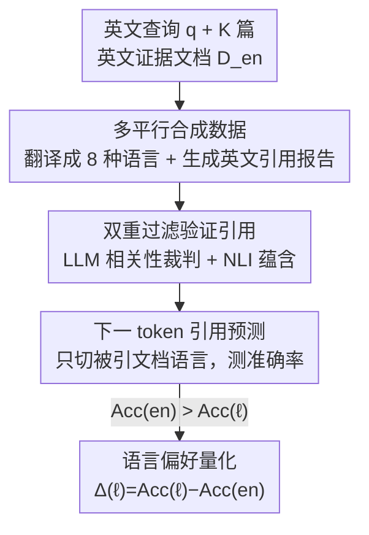

# Linguistic Nepotism: Trading-off Quality for Language Preference in Multilingual RAG

**会议**: ICML 2026  
**arXiv**: [2509.13930](https://arxiv.org/abs/2509.13930)  
**代码**: https://github.com/dayeonki/lang_preference  
**领域**: 信息检索 / 多语言 RAG / 模型可解释性分析  
**关键词**: 多语言 RAG、引用偏好、语言偏见、下一 token 预测、logit lens

## 一句话总结
这篇论文设计了一套用模型内部信号（下一 token 引用预测概率）来测量多语言 RAG 中"语言偏好"的可控方法，发现六个开源大模型在长文生成时系统性地偏爱引用英文文档，并且在英文文档不相关时也照引不误——语言本身比文档相关性更能左右模型的引用选择。

## 研究背景与动机
**领域现状**：检索增强生成（RAG）已经是现代 LLM 流水线的核心，把外部知识喂给模型来回答知识密集型问题。随着超过一半的数字内容是非英文的，RAG 被扩展到多语言场景（mRAG），让查询和证据文档可以跨语言。在长文 mRAG 里，模型输出是带行内引用（in-line citation）的报告，而不是一句话短答案。

**现有痛点**：之前的工作已经观察到模型有"语言偏好"——系统性地偏向引用某些语言的文档。但现有测量方法有两个硬伤。其一（C1），在长文 mRAG 里，大家通过比较"引用频率 vs 文档语言分布"来估计偏好，但这个信号很粗糙，被文档的相关性和信息量严重混淆——你分不清模型多引英文是因为偏爱英文，还是因为英文文档恰好更相关。其二（C2），行内引用本身容易幻觉，模型可能引了一个根本不支持该论断的文档，所以观察到的"偏好"可能只是虚假引用（spurious citation），而非真实归因。

**核心矛盾**：要干净地测语言偏好，必须把"语言"这个变量从"相关性/信息量"和"引用正确性"里剥离出来——但真实数据里这几个因素是缠在一起的。

**本文目标**：构造一个控制变量的测量框架，回答三个问题：(i) 什么因素会放大语言偏好？(ii) 查询语言起什么作用？(iii) 引用行为到底是被文档相关性还是语言驱动？

**切入角度**：与其看模型最终生成的引用（会被幻觉污染），不如直接看模型内部的"下一 token 引用预测"——固定其他一切变量，只切换被引文档的语言，看模型预测正确引用 ID 的准确率变化。准确率差异就是纯净的语言偏好信号。

**核心 idea**：用"多平行（multi-parallel）合成数据 + 经过双重过滤验证的引用 + 下一 token 引用预测准确率"三件套，把语言这一个变量单独拎出来测量，从而干净地量化语言偏好。

## 方法详解

### 整体框架
整个方法分四步：先把同一份英文证据文档翻译成多种语言（保证内容/相关性完全一致，只有语言不同），再用强模型生成一份带引用的英文参考报告，然后用两道过滤器只保留"引用真的被支持"的论断，最后在固定所有其他变量、只切换被引文档语言的对照上下文里，测量模型预测正确引用 ID 的下一 token 准确率。准确率随语言切换而下降，就说明模型偏好那个更高准确率的语言。

### 关键设计

**1. 多平行合成数据：把语言从相关性里剥出来**

要测"纯语言偏好"，最大的障碍是英文文档往往本身就更相关、信息更全，导致你没法判断模型多引英文到底是偏爱英文还是偏爱信息。本文的做法是从一份英文证据文档集 $D_{en}=\{d_1,\dots,d_K\}$ 出发，用机器翻译（Google Translate API）把每篇文档翻成 8 种目标语言，得到 $D_{\ell}=\{\mathrm{MT}_{\ell}(d_1),\dots,\mathrm{MT}_{\ell}(d_K)\}$。这样同一篇文档的英文版和斯瓦希里语版**内容完全平行、相关性恒定**，唯一区别就是语言。翻译质量用 COMET 估计平均 0.541（逐语言分数在附录）。之后用强模型 OpenAI o3（在 SciArena 长文报告基准上人评最高）基于英文文档生成参考报告 $r=M_{gen}(q,D_{en})$，并切成句级"论断+引用 ID"对 $(s_i,[c_i])$。这一步直接对症 C1。

**2. 双重过滤验证引用：只留真正被支持的论断**

行内引用容易幻觉，模型可能把信息归因到错误文档，所以不能直接拿生成的引用当 ground truth。本文对每个只带单一引用（$|c_i|=1$）的论断过两道关。第一道是 **LLM-as-Relevance-Judge**：用 SciArena 排名最高的三个裁判模型（o4-mini、QWEN-3 32B、Gemini 2.5 Pro），每个裁判在整个文档集里选出"最支持该论断"的那篇，采用相对选择（哪篇最支持）而非绝对二分判断（这篇支不支持），因为对比式 framing 提升 LLM 评估准确率。统计票数 $\text{votes}(s_i,c_i)=\sum_{m}\mathbb{1}(j_m(s_i,D_{en})=c_i)$，多数同意（$\geq 2$ 票）才保留。第二道是 **NLI 蕴含检查**：用现成 NLI 分类器 $\phi(\text{premise},\text{hypothesis})$，以被引文档 $d_{c_i}$ 为前提、论断 $s_i$ 为假设，蕴含才保留，对应 AIS（Attributable to Identified Sources）框架。两道过滤的保留率分别为 90.35% 和 96.12%，最终留下 792 条双过滤通过的论断。这一步对症 C2，保证拿来测量的每一条引用其正确性都被可靠验证。

**3. 下一 token 引用预测：固定一切，只切语言**

有了验证过的论断后，就能测纯语言偏好了。对每条 $(s_i,c_i)$，构造一个以 $s_i[$ 结尾的提示（$[$ 表示引用开始），然后造一组**对照上下文**：只把要引用的那篇文档 $d_{c_i}$ 换成语言 $\ell$，其余所有文档统统保持英文，记作 $\text{Context}(d_{c_i}\to\ell, d_{\neg c_i}\to en)$。测模型把正确引用 ID 当作 top-1 下一 token 的概率 $p_\theta^{(\ell)}(c_i)=P_\theta(t=c_i\mid x_i,q,\text{Context})$，并算语言 $\ell$ 下的引用准确率：

$$\text{Acc}(\ell)=\frac{1}{n}\sum_{i=1}^{n}\mathbb{1}(\hat{c}_i^{(\ell)}=c_i),\quad \hat{c}_i^{(\ell)}=\arg\max_t p_\theta^{(\ell)}$$

语言偏好用准确率差距量化：$\Delta(\ell_{target})=\text{Acc}(\ell_{target})-\text{Acc}(en)$。$\Delta<0$ 就说明模型引英文比引该目标语言更准——也就是偏爱英文。为保证差异显著，做配对双侧 t 检验并加 Bonferroni 校正。妙处在于：因为内容、相关性、文档位置、其余文档语言、查询语言全部被固定，准确率的任何变化都**只能归因于被引文档的语言**，这就是干净的偏好信号。

**4. logit lens 层级分析：偏好在哪一层定型**

为了搞清"英文偏好在生成过程中如何形成"——是模型先选英文再纠正，还是一选定就不改——本文用 logit lens 把中间层表示投影回词表空间，逐层追踪 top-1 引用 token 预测属于哪类：正确目标语言 ID、错误英文 ID、还是非法引用 token。因为引用格式是单个数字（单 token），logit lens 这种只能探一个 token 的工具恰好适用。这给出了偏好的"时间线"，是纯机制分析。

### 损失函数 / 训练策略
本文不训练模型、不做参数更新，是纯粹的"测量+诊断"研究。所有信号都来自冻结开源权重的前向推理：合成数据生成（翻译+报告生成）、双重过滤、下一 token 预测概率、以及 logit lens 投影。

## 实验关键数据

### 实验设置
- **数据集**：ELI5 长文问答（WebGPT 测试集 270 个查询，人工标注的相关证据文档），只用证据文档数 $K<10$ 的查询保证引用 ID 是单 token；相关性 vs 语言实验额外用带不相关文档的 MIRACL。
- **语言**：8 种覆盖不同资源等级/语系/文字的目标语言——阿拉伯语、孟加拉语、西班牙语、法语、韩语、俄语、斯瓦希里语、中文。
- **模型**：6 个开源权重 LLM——LLAMA-3.1 8B、LLAMA-3.3 70B、QWEN-3 8B/14B、GEMMA-3 27B、AYA23 8B。

### 主实验：各语言引用准确率

| 语言 | LLAMA-3.1 8B | QWEN-3 8B | AYA23 8B | GEMMA-3 27B | LLAMA-3.3 70B |
|------|------|------|------|------|------|
| English | 67.4 | 62.6 | 60.0 | 86.2 | 85.9 |
| French | 62.9 (-4.5) | 48.4 (-14.2) | 48.5 (-11.5) | 79.0 (-7.2) | 77.4 (-8.5) |
| Korean | 61.7 (-5.7) | 49.7 (-12.9) | 42.2 (-17.8) | 77.5 (-8.7) | 69.2 (-16.7) |
| Bengali | 56.6 (-10.8) | 41.3 (-21.3) | 27.2 (-32.8) | 77.9 (-8.3) | 68.8 (-17.1) |
| Swahili | 53.0 (-14.4) | 30.4 (-32.2) | 22.4 (-37.6) | 74.0 (-12.2) | 67.3 (-18.6) |

所有模型、所有目标语言都呈现一致的英文偏好（$\Delta<0$）。即便是专门为多语言训练的 AYA23 8B 也不例外，而且它在低资源语言上掉得最狠（斯瓦希里 -37.6）。

### 放大因素与对照分析

| 分析维度 | 关键发现 |
|---------|---------|
| 语言资源等级 | 资源越低偏好越强：斯瓦希里平均 -23.9%、孟加拉 -18.0%，而法语/西语仅 -8.8%/-8.1% |
| 文档位置 | 被引文档在上下文中间时 $\Delta$ 最大，"lost in the middle" 进一步放大英文偏好 |
| 层级（logit lens） | LLAMA-3.1 8B 前 17 层无有效预测，层 18-20 出现正/误引用，层 22 急剧定型，之后一旦选错很少改 |
| 查询语言（§6） | 48 个模型-语言组合中有 28 个在"被引文档=查询语言、其余=英文"时准确率最高，说明模型偏爱查询语言、且受益于语言对比 |
| 相关性 vs 语言（§7） | 模型常引用与查询不相关的英文文档，说明语言比相关性更能左右引用 |

### 关键发现
- **英文偏好是普遍且系统的**：6 个模型 × 8 种语言全部 $\Delta<0$，不是个别模型的怪癖。
- **越弱势越吃亏**：低资源语言（斯瓦希里、孟加拉）偏好最强，意味着 mRAG 会进一步边缘化本就缺乏代表性的语言。
- **偏好一旦定型就不纠**：logit lens 显示模型不是"先偏英文再纠正"，而是在某个过渡层（LLAMA-3.1 8B 约 20-22 层）一次性定型，错了也不改。
- **语言压过相关性**：最严重的发现是模型会为了语言偏好牺牲相关性——英文文档不相关也照引，引用选择并非完全由信息量驱动。

## 亮点与洞察
- **用内部信号绕开幻觉**：直接测下一 token 引用预测概率，而不是看模型最终生成的（可能幻觉的）引用，这是把"测量"从"被污染的输出"挪到"干净的内部信号"，方法论上很巧。
- **多平行数据是控制变量的关键**：同一文档翻成多语言保证相关性恒定，是整个干净测量的地基；这套"造平行对照"的思路可迁移到任何想剥离单一变量（位置、风格、长度）的诊断研究。
- **"linguistic nepotism"（语言裙带）这个命名很传神**：模型像人一样偏爱"自己人语言"，§6 还呼应了文献计量学里人类作者的"own-language preference"，把机器偏见和人类偏见对照起来。
- **双过滤 + 显著性检验的严谨度**：LLM 裁判用相对选择而非二分判断、加 NLI 双保险、配对 t 检验 + Bonferroni 校正，把"偏好"做成了可信的统计结论而非轶事观察。

## 局限与展望
- **依赖机器翻译质量**：目标语言文档全靠 Google Translate，COMET 平均仅 0.541，低资源语言的翻译噪声可能与"低资源偏好更强"的结论混淆——准确率掉得多，到底是模型歧视还是译文质量差，难完全分清（作者用 embedding 相似度分析部分缓解，但未根除）。
- **引用 ID 必须是单 token**：方法要求 $K<10$ 且 ID 单 token，限制了能测的文档规模，长候选集场景未覆盖。
- **只测下一 token 而非端到端生成**：测量发生在受控的引用预测点，与真实长文自由生成时的引用行为可能有差距（作者用 contributive attribution 做了部分鲁棒性验证）。
- **诊断而非解法**：本文揭示了问题但没给缓解方案——如何让 mRAG 系统在引用时对语言公平，是留给后续工作的空白。

## 相关工作与启发
- **vs 短文 mRAG 偏好测量（Sharma 2025、Park & Lee 2025）**：他们用信息重叠或 embedding 相似度测短答案偏好，无法捕捉引用正确性；本文聚焦长文带引用报告，用内部 token 信号同时控制相关性和正确性，测量更干净。
- **vs 长文引用频率法（Li 2025）**：他们用"引用率 vs 文档语言分布"近似偏好，被相关性混淆（C1）；本文用多平行数据固定相关性，直接隔离语言变量。
- **vs 多语言内部表示研究（Wendler 2024、Zhong 2025）**：他们发现多语言 LLM 早期层对齐英文、末层才转向目标语言；本文用 logit lens 把这套"英文中转"分析扩展到长文引用生成，发现引用在某过渡层一次性定型。

## 评分
- 新颖性: ⭐⭐⭐⭐⭐ 用内部 token 信号 + 多平行数据干净测量语言偏好，方法论是真创新
- 实验充分度: ⭐⭐⭐⭐⭐ 6 模型 × 8 语言 + 位置/层级/查询语言/相关性四维分析 + 显著性检验
- 写作质量: ⭐⭐⭐⭐ 逻辑链清晰、命名传神，但部分结论依赖附录支撑
- 价值: ⭐⭐⭐⭐⭐ 揭示 mRAG 系统性边缘化低资源语言，对多语言知识公平性有现实意义

<!-- RELATED:START -->

## 相关论文

- [\[ACL 2025\] Investigating Language Preference of Multilingual RAG Systems](../../ACL2025/information_retrieval/investigating_language_preference_of_multilingual_rag_systems.md)
- [\[ACL 2026\] Enhancing Multilingual RAG Systems with Debiased Language Preference-Guided Query Fusion](../../ACL2026/information_retrieval/enhancing_multilingual_rag_systems_with_debiased_language_preference-guided_quer.md)
- [\[NeurIPS 2025\] MuRating: A High Quality Data Selecting Approach to Multilingual Large Language Model Pretraining](../../NeurIPS2025/information_retrieval/murating_a_high_quality_data_selecting_approach_to_multilingual_large_language_m.md)
- [\[ACL 2026\] All Languages Matter: Understanding and Mitigating Language Bias in Multilingual RAG](../../ACL2026/information_retrieval/all_languages_matter_understanding_and_mitigating_language_bias_in_multilingual_.md)
- [\[ICML 2026\] Temporal Preference Optimization for Unsupervised Retrieval](temporal_preference_optimization_for_unsupervised_retrieval.md)

<!-- RELATED:END -->
