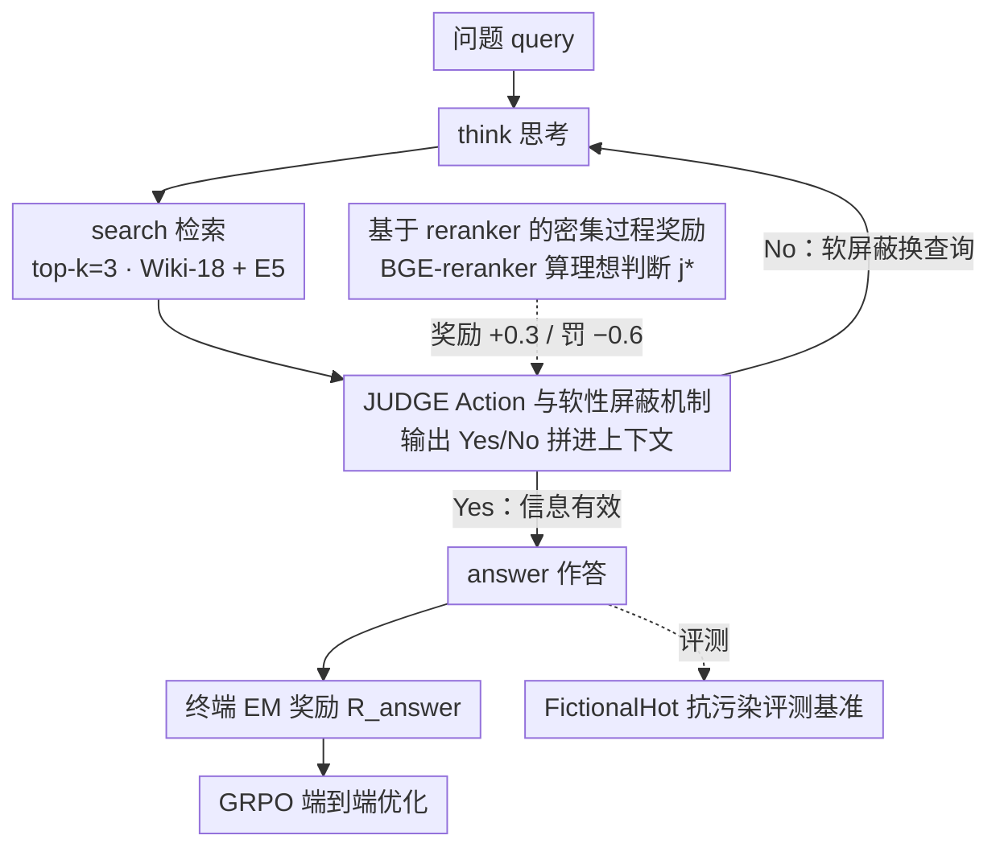

# ReSeek: A Self-Correcting Framework for Search Agents with Instructive Rewards

**会议**: ICML 2026  
**arXiv**: [2510.00568](https://arxiv.org/abs/2510.00568)  
**代码**: https://github.com/TencentBAC/ReSeek (有)  
**领域**: 信息检索 / 搜索 Agent / 强化学习  
**关键词**: 搜索 Agent, 自纠错, JUDGE action, 过程奖励, 数据污染评测

## 一句话总结
ReSeek 给 RL-trained 搜索 agent 增加一个 JUDGE 动作 + 用 BGE-reranker 计算"理想判断"作为过程奖励,使 agent 能在每次检索后软性"屏蔽"无效信息并重新查询;同时提出 FictionalHot 这一基于虚构实体的抗污染评测,Qwen2.5-7B 上平均 EM 达到 0.377,比 ZeroSearch 高 +3.1。

## 研究背景与动机

**领域现状**:LLM 搜索 agent (Search-R1、ZeroSearch、DeepResearcher、WebThinker 等) 用 RL 训练让 LLM 学会多步"思考-搜索-推理"循环,在知识密集任务上显著超越单步 RAG。主流做法是把任务建模为 MDP,用 GRPO/PPO 等 RL 算法优化策略。

**现有痛点**:**(1) 奖励信号过于稀疏**——绝大多数方法只在最后一步给"答案对不对"的 EM 奖励 (Search-R1、ZeroSearch),中间步骤无任何反馈,导致 credit assignment 困难;**(2) 没有自纠错机制**——一旦早期搜索查询不好 (比如 "creator of Saddle Rash" 只返回了节目描述但没生日信息),agent 会"咬住"这条死路链式产生错误答案;**(3) 评测污染**——主流 benchmark (NQ、TriviaQA、HotpotQA) 内容大量出现在 LLM 预训练语料里,高分可能反映记忆而非真实推理。

**核心矛盾**:RL agent 需要密集、指导性的中间反馈来学会"评估这条线索是否有用、要不要换查询",但这种反馈传统上需要昂贵的人工标注或专门训练的 PRM (process reward model);如何在不引入额外训练成本的前提下给出可靠过程奖励,是个公开问题。

**本文目标**:让搜索 agent 在 episode 中段就能"自我评估"刚检索到的信息是否有用,如果无用就 re-plan 而不是硬着头皮答;同时给出干净不污染的评测床。

**切入角度**:作者观察到,人类做 web research 时会自然地"读完每条搜索结果停一下、判断有没有用、决定接下来要不要换关键词";这个判断动作恰好可以用一个 reranker 模型 (bge-reranker-large) 计算"observation 与 ground truth 之间的语义相似度"作为客观参考——agent 的判断对了就奖、错了就罚,而且 reranker 是预训练的,不用额外训练。

**核心 idea**:把"自我判断"显式做成 agent 的一个 action (<judge>Yes/No</judge>),用 reranker 算"理想判断"作为过程奖励,密集监督这个能力;同时构造完全虚构的 FictionalHot 数据集逼 agent 必须依赖检索而不是记忆。

## 方法详解

### 整体框架
Agent 用 GRPO 优化的 LLM 策略 $\pi_\theta$,action space 在标准的 `<search>` / `<answer>` 之外加入 `<judge>` 动作。每一轮:agent 思考 → 决定是否搜索 → 搜索完成后必须执行 judge → 根据 judge 结果决定下一步 (再搜 / 答题)。reward 由两部分组成:(1) 终端 EM 奖励 $R_{\text{answer}}$,(2) 每次 judge 时用 BGE-reranker 算"理想判断"作为参考给出的过程奖励 $R_{\text{judge}}$。整套 pipeline 用 169k 个 NQ + HotpotQA 样本训练,部署在 Qwen2.5-3B/7B-Instruct 上,检索语料是 Wiki-18 + E5 embedding。

### 关键设计

1. **JUDGE Action 与软性屏蔽机制**:

    - 功能:让 agent 拥有"评估刚拿到的检索结果是否有用"的元认知能力,把推理链从静态线性变成动态自纠错循环。
    - 核心思路:每次 `<search>` 之后强制 agent 输出 `<judge>Yes</judge>` 或 `<judge>No</judge>`,这个 label $j_t$ 直接拼接到上下文中:$\mathcal{C}_t = \tau_{t-1} \oplus a_t \oplus o_t \oplus j_t$,然后 agent 基于这个被打了标的上下文采下一个 action。"No" 不是物理删除 observation,而是"软屏蔽"——把这条不相关信息标记出来,policy 在后续生成时会"注意到这条被否决",从而倾向于换查询而不是基于错误信息继续;同时这条 observation 仍在 context 中,可以为下一次查询提供"我已经尝试过这条路"的反思。Prompt 用严格的 if-then rule (Table 1) 强制约束:"如果 judge=No,你必须再搜索而不能直接给答案",在未训练的 LLM 上也能立即产生结构化轨迹,为 RL 训练提供干净起点。
    - 设计动机:物理删除 observation 会导致同样错误重复发生;软屏蔽既阻止错误传播,又保留"已探索失败路径"的元信息;让 judge 作为内部 action 而不是外挂模块,policy 端到端学习"何时该重新评估"。

2. **基于 reranker 的密集过程奖励**:

    - 功能:把稀疏的 EM 信号变成每步都有反馈的密集信号,具体奖励 agent "判断对了 observation 是否有用"。
    - 核心思路:定义"理想判断" $j^*_t$ 为:如果 BGE-reranker 算出 observation $o_t$ 与 ground truth gt 的语义相似度 $> 0.7$,则 $j^*_t = \text{Yes}$,否则 No (阈值 0.7 经过 grid search 验证)。agent 每次执行 judge action 时,根据其 $j_t$ 与 $j^*_t$ 是否一致给出 $R_{\text{judge}}$:**正确**时奖励 +0.3 (无论是正确接受 Yes=Yes 还是正确拒绝 No=No),**错误**时不对称惩罚——"错误接受无用信息"罚 -0.6 (双倍力度),"错误丢弃有用信息"罚 -0.3。完整训练目标 $R(\tau) = \sum_t \gamma^{t-1} r_t$,$r_{t<T} = R_{\text{judge}}$ 用于中间步,$r_T = R_{\text{answer}} = \text{EM}(A_p, A_g)$ 用于终端,GRPO 优化。
    - 设计动机:为什么用 reranker 不是用 LLM-as-judge?reranker 更轻量、判断稳定、不引入新偏见;为什么不对称惩罚?接受无用信息会把整个轨迹带偏 (代价大),丢弃有用信息只是浪费一次查询 (代价小)——这种不对称匹配实际任务的错误代价分布。

3. **FictionalHot 抗污染评测基准**:

    - 功能:剥离 LLM 记忆带来的"伪高分",真正测试推理与检索能力。
    - 核心思路:从 6 个主流 QA 数据集 (NQ/TriviaQA/PopQA/HotpotQA/2Wiki/Musique,共 51,588 样本) 中随机抽 10% (5,116 个) 作 seed,用 GPT-5 改写——把真实实体 (如 Taylor Swift) 替换为虚构实体 (Lila Starling),保留原问题的推理结构;同时让 GPT-5 为这些虚构实体生成 Wiki 风格的支持文档,设定新的虚构事实 (如专辑发行年份 2007) 作为新 GT。最后把这些虚构样本插入 2018 Wikipedia corpus 形成 closed-world 评测床。任何"靠记忆"的方法在 FictionalHot 上必然崩盘 (Direct Inference 接近 0.001),只有真正会查、会推理的方法能拿分。
    - 设计动机:Table 2 对比 7 个 prior work 的评测设置,发现 corpus (静态 wiki vs live internet)、test set、训练集、指标都不统一,作者认为这种碎片化掩盖了真实能力差异;FictionalHot 不仅抗污染还可复现,为搜索 agent 社区提供标准床。

### 损失函数 / 训练策略
- **RL 算法**:GRPO 为默认,Search-R1 同款 unified NQ+HotpotQA 训练集 (169,615 pairs)。
- **超参**:retrieval top-k=3,最多 4 turn,16×H20 GPU,E5 embedding + Wiki-18。
- **奖励参数**:reranker 阈值 0.7,$R_{\text{match}} = +0.3$,$R_{\text{mismatch}}^{\text{accept-wrong}} = -0.6$,$R_{\text{mismatch}}^{\text{reject-right}} = -0.3$。
- **结构化 prompt**:强制 `<think>` → `<search>` → `<judge>` → 条件分支 → `<answer>` 的流程 (Table 1),保证 trajectory 可解析。

## 实验关键数据

### 主实验

| 方法 (Qwen2.5-7B-Instruct) | NQ | TriviaQA | PopQA | HotpotQA | 2Wiki | Musique | Bamboogle | FictionalHot | Avg |
|---|---|---|---|---|---|---|---|---|---|
| Direct Inference | 0.134 | 0.408 | 0.140 | 0.183 | 0.250 | 0.031 | 0.120 | 0.001 | 0.158 |
| CoT | 0.048 | 0.185 | 0.054 | 0.092 | 0.111 | 0.022 | 0.232 | 0.001 | 0.093 |
| RAG | 0.349 | 0.585 | 0.392 | 0.299 | 0.235 | 0.058 | 0.208 | 0.012 | 0.267 |
| Search-o1 | 0.151 | 0.443 | 0.131 | 0.187 | 0.176 | 0.058 | 0.296 | 0.020 | 0.183 |
| Search-R1 | 0.393 | 0.610 | 0.397 | 0.370 | 0.414 | 0.146 | 0.368 | 0.034 | 0.342 |
| ZeroSearch | 0.436 | 0.652 | 0.488 | 0.346 | 0.352 | 0.184 | 0.278 | 0.031 | 0.346 |
| **ReSeek** | **0.469** | 0.640 | **0.501** | **0.389** | 0.382 | **0.185** | **0.392** | **0.061** | **0.377** |

### 消融实验

| 组件 (Qwen2.5-7B) | Avg EM | 提升 | 说明 |
|---|---|---|---|
| $R_{\text{answer}}$ only (=Search-R1) | 0.288 | baseline | 只有终端 EM 奖励 |
| + judge Action (rule only) | 0.297 | +3.1% | 仅加 judge 动作 + 强制 prompt |
| + $R_{\text{judge}}$ (full ReSeek) | **0.312** | **+8.3%** | 加上 reranker 过程奖励 |
| Reranker 类型: None | 0.259 | - | 完全无 reranker |
| Regex-based | 0.301 | - | 关键词匹配启发式 |
| Qwen-Reranker | 0.311 | - | 替换为 Qwen reranker |
| BGE-Reranker (ReSeek) | **0.312** | - | 默认选择 |

| Reranker-only vs RL-trained (Qwen2.5-7B) | Avg EM |
|---|---|
| Search-R1 baseline | 0.342 |
| + Reranker-only intervention (no RL) | 0.354 (+1.2) |
| + Prompt-only judge (no RL) | 0.349 (+0.7) |
| **ReSeek (GRPO full)** | **0.377 (+3.5)** |

### 关键发现
- **多跳任务收益更大**:HotpotQA、Bamboogle、Musique 这类需要 2-3 跳的任务 ReSeek 提升明显 (+5-12%),单跳任务 (TriviaQA) 偶尔略输给 ZeroSearch——印证 self-correction 价值主要在长推理链。
- **FictionalHot 把所有方法都打回原形**:Direct Inference 几乎 0、最好的 ReSeek 也只有 0.061;TriviaQA 上 7B vs 3B 差距 0.408 vs 0.288 (+12%),FictionalHot 上几乎一致 (0.061 vs 0.059),验证 FictionalHot 真正在测推理而非记忆能力。
- **Turn 预算分析 (Figure 4)**:其他 baseline 从 1→2 turn 收益最大,3-4 turn 饱和;ReSeek 单调递增到 4 turn,说明额外预算被它用于"重新查询",其他方法只会浪费。
- **不对称惩罚很关键**:作者经验性地发现"错误接受 (-0.6) > 错误丢弃 (-0.3)" 的设置比对称惩罚效果更好——agent 学会"宁可多查也别瞎答"。
- **Reranker vs RL 解耦验证**:Reranker-only 拿到 +1.2,但加 RL 训练能额外再涨 +2.3,说明 RL 不只是放大 reranker 信号,而是教 agent 在 context 中**合理使用** judgement,这是个有意义的解耦实验。

## 亮点与洞察
- **用预训练 reranker 当 PRM (Process Reward Model)**:传统做法是单独训一个 PRM,代价高且不稳定;作者把现成的 bge-reranker-large 作为"理想判断"参考,即开即用、不引入新偏见——这思路可推广到任何"中间步骤可被某个预训练判别器评估"的 RL 任务。
- **JUDGE 作为内部 action 而非外挂模块**:跟 ReAct 那种"Thought → Action → Observation"循环不同,ReSeek 把 judge 设计为 policy 的一部分,RL 端到端学会"何时该停下来评估、什么样的 evidence 才算 useful",这种"显式元认知动作"是当前 agentic LLM 设计的可复用范式。
- **不对称奖励设计**:错误接受 vs 错误拒绝惩罚差倍数,匹配真实任务的代价不对称——很多 RL 工作都用对称 reward,这点细致设计值得学习。
- **FictionalHot 的构造方法本身就是贡献**:把"用 LLM 改写 + 合成虚构 Wikipedia 条目"做成标准化 pipeline,任何子领域都可以仿造一份"抗污染"版本——比单纯抱怨数据污染要建设性得多。
- **"软屏蔽" 而非 "硬删除"**:被 judge=No 的 observation 仍在 context 中作为"已探索失败"的记忆,避免 agent 反复尝试同一条死路——这种"显式失败痕迹"的设计很巧妙。

## 局限与展望
- 用 ground truth 计算"理想判断"训练,但部署时 agent 没有 GT 可参考——好在 agent 已经学会判断,不需要在线再算 reranker;不过 reranker 阈值 0.7 是否在不同领域稳健、是否需要自适应没讨论。
- 只在 QA benchmark 上验证,对开放式任务 (如写综述、做研究) 的 judge 能力是否能泛化没测。
- FictionalHot 用 GPT-5 改写,改写质量本身依赖 GPT-5 表现;长期看可能需要人工 sanity check 防止改写引入新偏差。
- 训练数据只用 NQ + HotpotQA,在领域差异更大的 corpus 上是否还能转移、是否需要 in-domain training 数据没讨论。
- BGE-reranker 与 Qwen-reranker 差异极小 (0.312 vs 0.311),没用 ablation 说明 reranker 强弱对 ceiling 影响——可能 reranker 不是瓶颈,judge 学习本身才是。
- 只比到 Qwen2.5,与最新 R1/o1 类 reasoning model 集成是否能进一步起飞没提。

## 相关工作与启发
- **vs Search-R1 (Jin 2025)**:Search-R1 用 sparse EM 奖励训 GRPO,容易陷入早期错误链;ReSeek 加 judge action 和 reranker 过程奖励,直接提升 +3.5 EM——同 baseline 下证明过程奖励的价值。
- **vs ReAct (Yao 2022)**:ReAct 用 Thought/Action/Observation 循环,但 thought 是 free-form 无奖励监督;ReSeek 把 self-evaluation 显式做成 typed action 并给奖励,RL 端到端学习,更结构化也更可训。
- **vs AgentPRM (Xi 2026)**:AgentPRM 单独训一个 PRM 给 agent 打分,ReSeek 用 reranker 替代 PRM 训练成本,且 judge 内嵌为 action 而非外部评分——成本更低、集成更紧。
- **vs Reflexion / Self-Refine**:这些方法做"事后反思"修正下一次 trajectory,ReSeek 是"事中纠错"在同一 episode 内换查询,响应更及时。
- **vs S2R (Ma 2025)**:S2R 训自我验证用于数学推理,ReSeek 把这种思路专门用于搜索 (reranker 信号 + judge action) 而非通用推理,更对症。

## 评分
- 新颖性: ⭐⭐⭐⭐ judge action + reranker 当 PRM + FictionalHot 三件套都比较新,虽然每件单独都有前驱
- 实验充分度: ⭐⭐⭐⭐⭐ 8 个数据集 + 4 类 baseline + 6 项 ablation + turn 预算分析,非常完整
- 写作质量: ⭐⭐⭐⭐ Figure 1 的对比例子直观,Table 2 用来说明评测碎片化很有说服力
- 价值: ⭐⭐⭐⭐⭐ 既给方法 (judge action + 过程奖励) 又给评测床 (FictionalHot),后者对社区可能贡献更大

<!-- RELATED:START -->

## 相关论文

- [\[ACL 2026\] Multi-Faceted Self-Consistent Preference Alignment for Query Rewriting in Conversational Search](../../ACL2026/information_retrieval/multi-faceted_self-consistent_preference_alignment_for_query_rewriting_in_conver.md)
- [\[ACL 2026\] Enhancing LLM-based Search Agents via Contribution Weighted Group Relative Policy Optimization](../../ACL2026/information_retrieval/enhancing_llm-based_search_agents_via_contribution_weighted_group_relative_polic.md)
- [\[ACL 2025\] SGIC: A Self-Guided Iterative Calibration Framework for RAG](../../ACL2025/information_retrieval/sgic_a_self-guided_iterative_calibration_framework_for_rag.md)
- [\[ACL 2026\] Rerank Before You Reason: Analyzing Reranking Tradeoffs through Effective Token Cost in Deep Search Agents](../../ACL2026/information_retrieval/rerank_before_you_reason_analyzing_reranking_tradeoffs_through_effective_token_c.md)
- [\[ACL 2026\] Can Compact Language Models Search Like Agents? Distillation-Guided Policy Optimization for Preserving Agentic RAG Capabilities](../../ACL2026/information_retrieval/can_compact_language_models_search_like_agents_distillation-guided_policy_optimi.md)

<!-- RELATED:END -->
