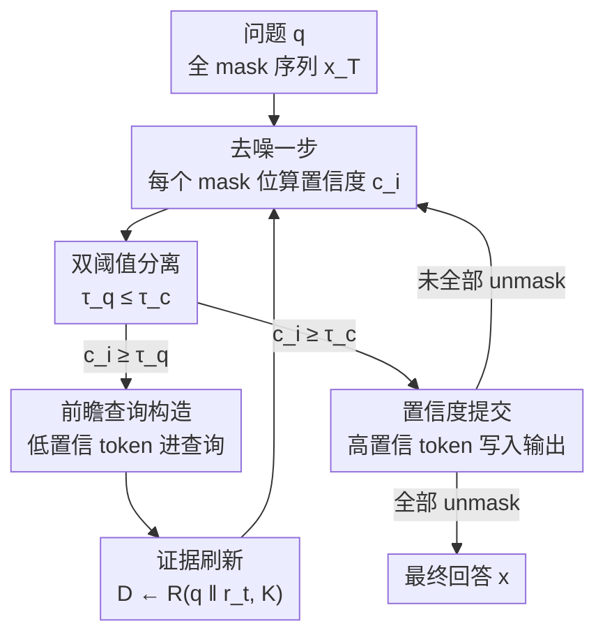

# Self-Augmenting Retrieval for Diffusion Language Models

**会议**: ICML2026  
**arXiv**: [2606.06474](https://arxiv.org/abs/2606.06474)  
**代码**: https://github.com/pauljngr/SARDI  
**领域**: 信息检索 / RAG / 扩散语言模型  
**关键词**: 扩散语言模型, 动态检索, 多跳问答, 并行解码, 训练无关

## 一句话总结
利用扩散语言模型在去噪过程中对所有位置同时给出的"暂定预测"作为前瞻信号，在每一步去噪时用这些尚未提交的 token 重新检索证据，提出训练无关、检索器无关的动态 RAG 框架 SARDI，在 5 个多跳 QA 基准上同时打败扩散和自回归的训练无关检索基线，且吞吐量最高快 8 倍。

## 研究背景与动机

**领域现状**：检索增强生成（RAG）已经是把大模型接到外部知识的主流范式。但当前几乎所有 RAG 系统都建立在自回归（AR）逐 token 解码之上：检索只能基于"已经提交的左侧前缀"来构造查询，而且生成延迟和输出长度线性绑定。扩散语言模型（DLM，如 DREAM-7B、LLaDA）是另一条路线——它从全 mask 序列出发，每一步对**所有位置并行去噪**，迭代次数在推理时可调。

**现有痛点**：多跳问答里，后续推理步骤需要的证据依赖于问题本身没有点名的"桥接实体"（bridge entity）。例如问"展出《蒙娜丽莎》的博物馆所在的城市"，静态检索器在没先识别出"卢浮宫"这个桥接实体之前，根本检索不到"卢浮宫位于巴黎"这条二跳证据。现有面向扩散模型的 RAG 全部是单次检索（single-shot），证据一次定死；而自回归这边虽然有 FLARE 这类前瞻检索，但它的暂定句子是从左到右生成的，一个早期错误会级联放大，产生幻觉查询、检到无关文档。

**核心矛盾**：检索需要"尽早看到未来的实体"，而生成需要"等到足够确定才提交"——这两件事对错误的容忍度完全不同：提交一个错 token 会直接污染输出，但检索对噪声查询相当鲁棒。自回归把这两件事强行绑在一根从左到右的链上，无法解耦。

**本文目标**：把"用于检索的置信度"和"用于提交的置信度"在非自回归解码器里分离开，让投机性的未来 token 在还不够稳定到能提交输出时，就先去指导检索。

**切入角度**：作者观察到扩散去噪轨迹 $\{x_t\}_{t=0}^T$ 在每一步都对每个位置持有暂定预测，这些中间状态会**提前浮现桥接实体**。同时作者还发现：一旦生成被检索到的强证据 grounding 住，很多输出 token 是从上下文直接抄/改写的，给定证据 $D$ 后相邻 token 近似条件独立，这恰好让并行解码更安全。

**核心 idea**：把检索条件在中间扩散状态上——每步去噪用部分去噪序列构造查询、刷新证据，并把"检索阈值 $\tau_q$"设得远低于"提交阈值 $\tau_c$"，让低置信 token 先喂检索器、高置信 token 才提交输出。

## 方法详解

### 整体框架
SARDI（Self-Augmenting Retrieval for Diffusion）把检索和去噪交织在一起。输入是一个问题 $q$，输出是最终回答序列 $x$。流程从全 mask 序列 $x_T$ 出发，迭代到 $x_0$：每一步去噪器对每个 mask 位置给出预测和置信度 $c_i = \max_{v\in V} p_\theta(v\mid x_t, q, D_t)$，然后这个置信度同时决定两件互相独立的事——是否把该 token 放进检索查询、是否把它提交到输出。检索来的新证据完全替换旧上下文，喂给下一步去噪。整个过程训练无关、检索器无关，对任何能产生推理痕迹的离散扩散模型即插即用。

### 关键设计

**1. 检索/提交双阈值分离：让投机 token 先服务检索**

这是 SARDI 最核心的设计，直接针对"检索要早看实体、生成要晚提交"的矛盾。作者给每个位置的置信度 $c_i$ 配两个阈值：查询阈值 $\tau_q$ 和提交阈值 $\tau_c$，且强制 $\tau_q \le \tau_c$。一个位置满足 $c_i \ge \tau_q$ 就被纳入检索查询，满足 $c_i \ge \tau_c$ 才真正提交到输出。因为 $\tau_q$ 可以压得比 $\tau_c$ 低很多，那些还不够稳定、不敢写进答案的暂定 token，就能提前把桥接实体暴露给检索器。这之所以安全，是因为提交一个错 token 会直接污染输出，而检索对噪声查询天然鲁棒——检错了下一轮还能纠回来。这与自回归前瞻（FLARE）的根本区别在于：SARDI 的暂定 token 是**所有位置并行**预测的，单个早期错误不会像左到右生成那样级联放大成幻觉查询。

**2. 前瞻查询构造：用部分去噪序列拼出动态查询**

随着去噪推进，正在成形的回答会浮现问题里没有的中间实体（人名、日期、关系），SARDI 要尽早把它们喂给检索器。具体做法是构造一个代理序列 $\tilde{x}_t$：已提交位置保留原 token；未提交但置信度 $c_i \ge \tau_q$ 的位置填入 argmax 预测；其余仍为 mask。

$$\tilde{x}_i^t = \begin{cases} x_i^t, & x_i^t \neq [\text{MASK}] \\ \arg\max_v p_\theta(v\mid x_t,q,D_t), & c_i \ge \tau_q \\ [\text{MASK}], & \text{otherwise} \end{cases}$$

把 $\tilde{x}_t$ 去 token 化（丢掉剩余 mask）得到 $r_t$，再和问题拼成查询 $s_t = q \,\Vert\, r_t$。固定的 $q$ 在早期预测还很噪时充当锚点，演化的 $r_t$ 则逐步把检索专门化。$\tau_q=0$ 时每个位置都进查询（最大前瞻），调高 $\tau_q$ 则只保留更自信的 token。实验证明 $\tau_q\approx 0$（最激进前瞻）效果最好——这直接验证了"投机 token 对检索有用"的核心假设。

**3. 证据刷新：每步整体替换检索上下文**

用上面构造的查询 $s_t$，SARDI 每步检索 $K$ 篇新证据 $D_{t-1} \leftarrow R(s_t, K)$，新证据**完全替换**旧上下文来 condition 下一步去噪。作者实验用 BM25（出于效率），但框架对检索器无关，稀疏/稠密都行（消融里换成 E5-base-v2 稠密检索器照样领先）。这一步让证据随着回答成形而不断刷新，而不是像静态 RAG 那样一次定死。

**4. 置信度驱动的 unmask：制造"先易后难"的检索课程**

因为 SARDI 每步都刷新证据，token 被提交的**顺序**直接塑造了后续检索。作者采用阈值式 unmask：所有置信度超过 $\tau_c$ 的位置一次性揭示，$U_t = \{i \mid x_i^t=[\text{MASK}] \wedge c_i \ge \tau_c\}$，各自提交到 argmax；若没有位置过 $\tau_c$，就强制 unmask 当前最自信的那个位置以保证进度。这天然形成一个课程：高置信 token（往往是已能被当前证据 grounding 的片段）先提交并指导下一轮检索，不确定的片段则等更精炼的证据到来。提交阈值 $\tau_c$ 因此同时控制解码并行度和检索刷新粒度，成为一个在准确率和吞吐量之间权衡的单一旋钮——调高 $\tau_c$ 每步提交更少 token、触发更多检索轮（更准更慢），调低则相反。

### 一个完整示例
问"展出《蒙娜丽莎》的博物馆所在的城市"。第 0 步：序列全 mask，只能用问题做静态检索，检到"《蒙娜丽莎》展于卢浮宫"。第 1 步去噪：模型在某些位置给出暂定预测"卢浮宫"（置信度可能只够 $\tau_q$、不够 $\tau_c$），SARDI 把"卢浮宫"拼进查询 $q\,\Vert\,$"...卢浮宫..."，检到二跳证据"卢浮宫位于巴黎"。下一步在这条新证据 grounding 下，"巴黎"这个 token 置信度飙升、越过 $\tau_c$ 被提交。整个过程里"卢浮宫"作为桥接实体在还没被写进答案前就已经把二跳证据拉了进来——这正是静态问题查询做不到的。

### 损失函数 / 训练策略
SARDI 本身训练无关，没有可学习的检索控制器或查询生成器。唯一的训练只是为了"诱导模型产生推理痕迹"：现成指令微调的扩散模型（如 DREAM-7B）在 RAG 设定下几乎不产生推理 trace，所以作者用 gpt-4o-mini 合成的链式思维 trace 做轻量监督微调。为公平对比，对 DREAM-7B 和自回归基线 Qwen2.5-7B 施加**完全相同**的微调——微调后两者在 2WikiMultiHopQA 静态检索下 EM 几乎一致（43.7% vs 44.5%），保证增益来自检索机制而非记忆。

## 实验关键数据

### 主实验
5 个多跳 QA 基准（2WikiMultiHopQA、HotpotQA、CofCA、MuSiQue、SynthWorlds-RM），指标 Exact Match（×100），延迟为单 B200 GPU 不分批的 wall-clock 秒/样本。其中 CofCA 和 SynthWorlds-RM 用反事实语料（编造事实）防数据泄漏。

| 方法 | 2Wiki EM | Hotpot EM | CofCA EM | MuSiQue EM | 2Wiki 时延 |
|------|---------|----------|---------|-----------|-----------|
| DLM w/ RET@STATIC ($\tau_c$=0.9) | 43.7 | 39.9 | 43.4 | 11.1 | 0.46 |
| AR w/ RET@1（最强 AR 训练无关） | 58.8 | 47.4 | 41.2 | 19.8 | 1.26 |
| ReAct（agentic） | 42.7 | 40.1 | 42.9 | 20.9 | 2.15 |
| **DLM w/ SARDI ($\tau_c$=0.9)** | **57.8** | **48.5** | **45.3** | **20.5** | **0.39** |
| **DLM w/ SARDI ($\tau_c$=0.95)** | **59.1** | **48.7** | 44.9 | 20.6 | 0.56 |
| AR (Search-R1, 需 RL 训练) | 52.4 | 50.3 | 44.4 | 26.4 | 3.36 |

SARDI 相对静态扩散检索在每个基准都大幅提升（2Wiki 44→59、Hotpot 40→49、MuSiQue 11→21），且匹配或打败所有训练无关 AR 基线，延迟却低得多——扫 $\tau_c$ 可在质量-延迟前沿上占优，比 AR 迭代检索基线最高快 8 倍，比 RL 训练的 Search-R1 快 3–8 倍而准确率相当。

### 消融实验

| 配置 / 分析 | 关键指标 | 说明 |
|------|---------|------|
| $\tau_q$ 扫描 | EM 在 $\tau_q\approx 0$ 达峰 | 越激进前瞻越好，验证投机 token 有用 |
| 早期文档召回（生成 25% 处） | +19 点 recall | SARDI 远超 AR 基线，强证据来得早 |
| 换稠密检索器 E5-base-v2 | 仍超最强 AR 基线 | 检索器无关，不依赖词法检索 |
| 问题类型拆分（2Wiki） | 组合/推理题 +28.7 / +23.5 | 增益集中在需多跳推理的题型 |

### 关键发现
- **前瞻越激进越好**：$\tau_q$ 越低（越多投机 token 进查询）EM 越高，直接支撑"低置信 token 是有用前瞻信号"的核心假设。
- **增益集中在多跳推理**：单跳比较题（静态检索已够用）基本不变甚至略降（−1.0），组合题 +28.7、推理题 +23.5——SARDI 的价值就在于解开桥接实体。
- **RAG grounding 促进并行解码**：作者用相邻 token 条件互信息（CMI）衡量依赖。全部金标文档在场时实体对 CMI 仅 0.060（可并行解码），逐步移除金标文档后实体对 CMI 升到 0.588（近 10 倍），非实体对仅从 0.136 升到 0.264。证据 grounding 恰好消除了对并行解码最有害的紧耦合实体跨度依赖。

## 亮点与洞察
- **"检索置信度"和"提交置信度"解耦**是真正巧妙的点：它抓住了非自回归解码器独有的结构——所有位置同时持有暂定预测，所以可以让一个 token 在还不敢写进答案时就先去拉证据。自回归把这两件事绑死在一根链上，结构上做不到。
- **把扩散轨迹当"前瞻信号"**而非单纯加速手段，是对 DLM 非自回归结构的新颖再利用——以往大家只盯着它的吞吐量。
- **CMI 分析**把"为什么 RAG 让并行解码更安全"量化了：grounding 让 token 从上下文直接抄，相邻位置近似条件独立。这个洞察可迁移到任何想用并行解码的 grounding 任务。
- **单旋钮权衡**：$\tau_c$ 一个超参同时控制解码并行度和检索刷新粒度，部署时调一个数就能在准确率和吞吐间滑动，工程上很实用。

## 局限与展望
- **依赖推理痕迹**：SARDI 需要模型产生包含中间实体的推理 trace，而现成扩散模型在 RAG 下几乎不产生，作者只能靠轻量合成 CoT 微调诱导。作者类比三年前自回归小模型也缺 CoT 能力、后来随规模成熟，预期 DLM 也会，但当前这是个前提门槛。
- **每步都全量替换证据**且每步都检索，虽然 BM25 便宜，但检索调用次数随去噪步数增加，稠密检索器下的成本未充分讨论。
- **与 RL 搜索 agent 互补而非超越**：在 MuSiQue 上 Search-R1（RL 训练）EM 26.4 仍明显高于 SARDI 的 20.6，说明在最难的题型上学习型查询生成还有优势。作者也指出把扩散轨迹和轻量 RL 查询监督结合是自然的未来方向。

## 相关工作与启发
- **vs FLARE (Jiang et al., 2023)**: FLARE 也做前瞻检索——先生成暂定下一句、若含低置信 token 就用它查询再重写。但它的暂定句是左到右生成的，单个早期错误会级联成幻觉查询；SARDI 所有位置并行预测，错误不级联，且把查询/提交阈值显式分离。
- **vs 现有扩散 RAG (Yu et al., 2026; Fang et al., 2026)**: 它们全是单次检索、证据定死；SARDI 是首个在中间扩散状态上 condition 检索、整条去噪轨迹持续刷新证据的框架。
- **vs Search-R1 (Jin et al., 2025)**: Search-R1 用 RL 学习显式发搜索查询，准但需训练、有奖励设计开销；SARDI 训练无关、即插即用，是不同的设计点，二者互补。

## 评分
- 新颖性: ⭐⭐⭐⭐⭐ 首次把检索条件在中间扩散状态上，检索/提交双阈值分离抓住了非自回归独有结构
- 实验充分度: ⭐⭐⭐⭐ 5 个基准 + 反事实语料防泄漏 + CMI 机制分析，但最难题型仍逊于 RL 基线
- 写作质量: ⭐⭐⭐⭐⭐ 动机推导清晰，两个核心假设都有专门实验验证
- 价值: ⭐⭐⭐⭐ 训练无关、检索器无关、即插即用，质量-延迟前沿占优，落地友好

<!-- RELATED:START -->

## 相关论文

- [\[ICLR 2026\] Query-Level Uncertainty in Large Language Models](../../ICLR2026/information_retrieval/query-level_uncertainty_in_large_language_models.md)
- [\[ICML 2026\] ReSeek: A Self-Correcting Framework for Search Agents with Instructive Rewards](reseek_a_self-correcting_framework_for_search_agents_with_instructive_rewards.md)
- [\[ICLR 2026\] AtlasKV: Augmenting LLMs with Billion-Scale Knowledge Graphs in 20GB VRAM](../../ICLR2026/information_retrieval/atlaskv_augmenting_llms_with_billion-scale_knowledge_graphs_in_20gb_vram.md)
- [\[AAAI 2026\] Do Retrieval Augmented Language Models Know When They Don't Know?](../../AAAI2026/information_retrieval/do_retrieval_augmented_language_models_know_when_they_dont_know.md)
- [\[ACL 2025\] RARE: Retrieval-Augmented Reasoning Enhancement for Large Language Models](../../ACL2025/information_retrieval/rare_retrieval_augmented_reasoning.md)

<!-- RELATED:END -->
