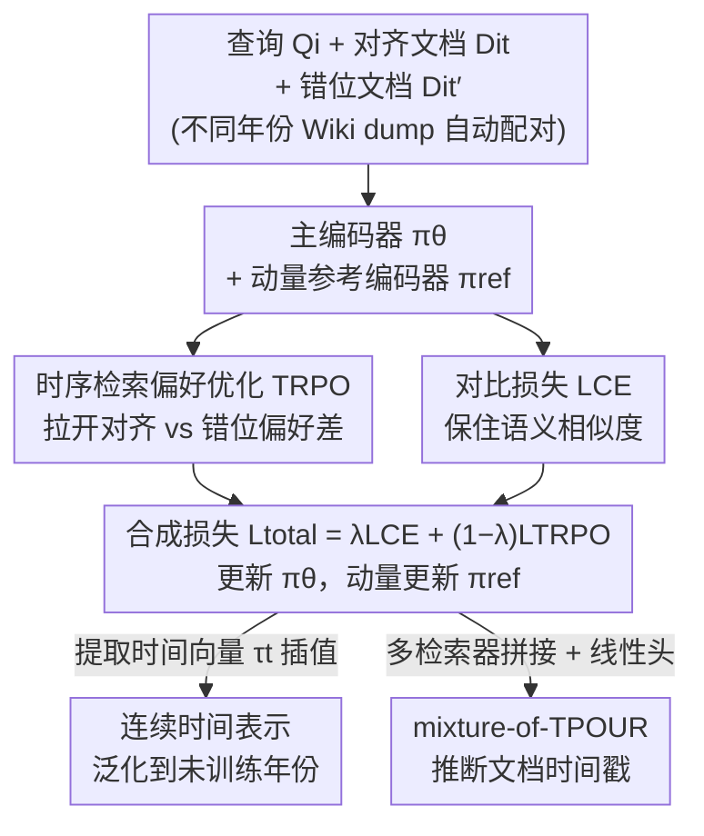

# Temporal Preference Optimization for Unsupervised Retrieval

**会议**: ICML 2026  
**arXiv**: [2606.17664](https://arxiv.org/abs/2606.17664)  
**代码**: https://github.com/agwaBom/TPOUR  
**领域**: 信息检索 / 时序检索  
**关键词**: 无监督密集检索, 时序对齐, 偏好优化, 时间向量, 对比学习

## 一句话总结
本文提出 TPOUR，把 DPO 式偏好学习搬到检索的**时间维度**上，让无监督密集检索器在语义相近但时间错位的文档里优先选出"时间对齐"的那一篇，并用时间向量插值零成本泛化到没训练过的年份。

## 研究背景与动机

**领域现状**：无监督密集检索器（如 Contriever）靠对比学习从海量无标注文档里学语义相似度，可扩展性极强，是大规模检索与 RAG 的主力。

**现有痛点**：这些检索器**只优化语义相似度，完全无视时间**。当文档集横跨多个年份时，对"2019 年谁是总统？"这种查询，检索器会把 2018–2025 各年的"总统"文档都排在前面——它们语义都高度相关，但只有 2019 年那篇才是对的。作者在混合时间戳的文档集上实测：Contriever 在 2018 年查询上 nDCG@5 只有 29.30，明显被时间错位文档拖累。

**核心矛盾**：要捕捉时间相关性，监督方法（带显式时间戳标注）做得到，但需要大量带时间标签的 query-document 对，规模上不现实；无监督方法可扩展，却又只会语义匹配。**可扩展性和时间感知之间存在矛盾**。此外查询里的时间信号常常是**隐式**的（"今年""现任总统"），连显式时间戳都没有，更难处理。

**本文目标**：在不需要任何显式时间戳标注的前提下，让无监督检索器学会：(1) 在混合时间戳文档集里优先选时间对齐文档；(2) 把隐式时间查询解释到训练所在的时间段；(3) 泛化到训练时没见过的中间/未来年份。

**切入角度**：作者观察到——不同年份采集的 Wikipedia dump 本身就是天然的"时间偏好信号"。同一个文档在 2018 dump 和 2021 dump 里的版本，构成了一对"哪个更符合目标年份"的偏好对，**无需人工标注**。

**核心 idea**：把 DPO（Direct Preference Optimization）从"对齐生成策略"重新诠释为"对齐检索的时间偏好"——用嵌入相似度替换 DPO 里的对数似然，让检索器偏好时间对齐文档（preferred）而非错位文档（less preferred），这就是 TRPO（Temporal Retrieval Preference Optimization）。

## 方法详解

### 整体框架

TPOUR 在 MoCo 对比学习框架上叠加一个时序偏好目标。训练时每个样本是一个三元组：查询 $Q_i$、时间对齐文档 $D_i^{t}$（preferred）、时间错位文档 $D_i^{t'}$（less preferred）。主编码器 $\pi_\theta$ 和动量参考编码器 $\pi_{\text{ref}}$ 分别编码这些输入，参考编码器维护一个负样本队列。整体损失由两部分组成：对比损失 $\mathcal{L}_{\text{CE}}$ 负责保住语义相似度，TRPO 损失 $\mathcal{L}_{\text{TRPO}}$ 负责拉开"对齐 vs 错位"的偏好差距。$\pi_\theta$ 用合成损失更新，$\pi_{\text{ref}}$ 用动量从 $\pi_\theta$ 缓慢更新。训练完成后，检索器既能当通用检索器用，又能通过时间向量插值零成本切换到任意年份，还能反过来推断文档的时间戳。

### 关键设计

**1. TRPO：把偏好优化搬到时间维度**

这是全文的核心。DPO 原本用于对齐生成模型，目标函数里比较的是策略模型对 preferred/less-preferred 回答的对数似然之比（Eq. 2）。TRPO 把这套机制原封不动地搬到检索：把"对数似然"换成"查询-文档嵌入相似度"。定义 $S_\theta(y_i^w)=S(\pi_\theta(Q_i),\pi_\theta(D_i^{t}))$ 为查询与对齐文档（preferred）的相似度，$S_\theta(y_i^l)=S(\pi_\theta(Q_i),\pi_\theta(D_i^{t'}))$ 为与错位文档（less preferred）的相似度，参考模型给出对应的 $S_{\text{ref}}$。TRPO 损失为：

$$\mathcal{L}_{\text{TRPO}}=-\log\sigma\Big(\beta\big[\,S_\theta(y_i^w)-S_\theta(y_i^l)-\big(S_{\text{ref}}(y_i^w)-S_{\text{ref}}(y_i^l)\big)\big]\Big)$$

它逼着当前模型把"对齐 - 错位"的相似度差，拉得比参考模型更大，从而在语义之外注入时间偏好。关键巧妙之处在于：**偏好对的监督信号完全来自无标注语料**——同一篇文档在不同年份 dump 里的版本天然构成时间偏好对，不需要任何人工时间戳标注。这正是它区别于"监督式时间检索"的地方。

**2. 对比损失 + TRPO 联合训练，互不拆台**

如果只用 TRPO，模型可能为了时间偏好牺牲基本的语义检索能力。所以 TPOUR 保留 MoCo 风格的对比损失 $\mathcal{L}_{\text{CE}}$（Eq. 3），它把查询拉近对齐文档、推开队列里上一批的负样本（错位与对齐文档都进队列当负例）。总损失用一个标量 $\lambda$ 平衡两者：

$$\mathcal{L}_{\text{total}}=\lambda\mathcal{L}_{\text{CE}}+(1-\lambda)\mathcal{L}_{\text{TRPO}},\quad \lambda\in[0,1]$$

$\lambda$ 越大越偏语义、越小越偏时间。这样 TPOUR **同时保住语义相似度并学到时间相关性**，即便查询或文档里根本没有显式时间词也能工作。作者还设了一个消融对照"Temporal Contrastive"——直接把对齐文档当正例、错位文档当负例做对比学习（即把上式里的 TRPO 换成 $\mathcal{L}_{\text{TempCE}}$），用来验证"偏好式优化"本身是否比"硬正负例对比"更有效。

**3. 时间向量插值：零重训泛化到未见年份**

离散地为每个年份单独训一个检索器，没法覆盖连续时间。本文借用 Nylund 等人在生成模型上提出的"时间向量"，并验证它在 encoder 检索器上同样成立。设基座权重为 $\theta_{\text{base}}$，在年份 $t$ 上微调得到 $\theta_t$，则时间向量定义为差值 $\tau_t=\theta_t-\theta_{\text{base}}$，它捕捉了"从基座漂移到年份 $t$"的方向。要得到中间年份 $t_{\text{mid}}$ 的检索器，只需在两个端点时间向量间线性插值：

$$\theta^{t_{\text{mid}}}=\theta_{\text{base}}+(1-\alpha)\tau_{t_{\text{start}}}+\alpha\tau_{t_{\text{end}}},\quad t_{\text{start}}\le t_{\text{mid}}\le t_{\text{end}}$$

例如在 2018 与 2021 的时间向量间插值，就能直接服务 2019、2020 的查询，**完全不用重训**。作者还表明外推（extrapolation）能泛化到未来时间。这把"时间维度"变成了可连续调节的旋钮。

**4. mixture-of-TPOUR：反过来推断文档时间戳**

时间感知是双向的：既能按时间检索，也能反推文档属于哪个年份。作者把时间戳推断建模成分类任务，用一组各自专精于不同年份的冻结检索器 $\{\pi_\theta^{t_1},\dots,\pi_\theta^{t_n}\}$ 分别编码同一文档，把这些时序感知嵌入**拼接**后送进一个共享的可训练线性分类头预测年份。对照基线是用单个在全时间段上训练的检索器、靠堆叠多层线性层来匹配参数量。结果显示 mixture-of-TPOUR 的时间戳预测显著更好，说明各专精检索器确实把不同年份的时序信息编码进了嵌入。

### 损失函数 / 训练策略

训练语料来自不同时间采集的英文 Wikipedia dump：年度语料用 2018 与 2021 的 12 月 dump（对应 SituatedQA），月度语料用 2023 年 1 月与 12 月 dump（对应 RealTimeQA）。为防数据泄漏，过滤掉了在评测集中作为 gold 文档的内容。参考编码器按 $\theta_{\text{ref}}\leftarrow m\,\theta_{\text{ref}}+(1-m)\,\theta$ 动量更新，$m$ 为动量系数。

## 实验关键数据

### 主实验

在 SituatedQA（年度）和 RealTimeQA（月度）的混合时间戳文档集上评测，指标为 nDCG@5 / @10（N@k）。TPOUR Contriever 在显式与隐式时间查询、训练年份与中间年份上都超越无监督和监督基线。下表摘显式时间查询的 N@5（2019、2020 为**未训练的中间年份**，靠插值得到）：

| 检索器 | 参数量 | 2018 | 2019(插值) | 2020(插值) | 2021 |
|--------|--------|------|------|------|------|
| Contriever（无监督） | 110M | 29.30 | 29.67 | 31.25 | 37.85 |
| DPR（监督） | 110M | 28.67 | 27.58 | 27.91 | 32.76 |
| Temporal Contrastive | 110M | 35.00 | 29.03 | 29.21 | 35.97 |
| TimeR4（时间感知） | 113M | 33.65 | 27.62 | 31.09 | 31.33 |
| Qwen3-Embedding-8B | 8B | 30.45 | 32.77 | 36.31 | 35.17 |
| **TPOUR Contriever (2018)** | 110M | **43.93** | — | — | — |

相比 8B 的 Qwen3-Embedding，TPOUR Contriever **小约 72.7×**，却在显式查询平均 nDCG@5 上 +4.04（+12.15%）、隐式查询 +4.98（+15.21%）。值得注意的是 TPOUR 在 2019/2020/六月等中间时段无需重训就有强表现。

### 消融实验

| 配置 | 关键含义 | 结论 |
|------|---------|------|
| Full TPOUR (CE + TRPO) | 完整模型 | 时序检索最优 |
| Temporal Contrastive（CE + 硬正负例对比） | 用对比替代 TRPO | 弱于偏好式 TRPO，验证"偏好优化"本身的价值 |
| 时间向量插值 (2019/2020) | 零重训中间年份 | 插值即可逼近专训性能（Tab. 4 / Fig. 3-4） |
| mixture-of-TPOUR vs 单检索器分类头 | 时间戳预测 | mixture 在匹配参数量下显著更优 |

### 关键发现
- **偏好式优于硬对比**：把时间对齐当 DPO 风格的偏好（TRPO）比直接当对比学习正负例（Temporal Contrastive）效果更好，说明"相对偏好差"比"绝对正负"更适合注入时间信号。
- **小模型靠时间感知打赢大模型**：110M 的 TPOUR Contriever 在时序检索上压过 8B 的通用 embedding，说明在时序场景里"时间对齐"比"模型规模"更关键。
- **时间向量在 encoder 上成立**：原本为生成模型提出的时间向量插值，迁移到 encoder 检索器同样有效，且支持外推到未来。
- **BEIR 上的副产物洞察**：在通用检索基准 BEIR 上，TPOUR 揭示了"数据集发布年份与最优检索性能存在对齐"，暗示时间建模对一般检索任务也有帮助。

## 亮点与洞察
- **把 DPO 跨域搬运**：DPO 是 RLHF 里对齐生成的工具，本文把它从"语言生成的人类偏好"迁移到"检索的时间偏好"，用嵌入相似度替换对数似然——这种"重新诠释偏好维度"的思路可复用到其他需要相对排序的检索/排序任务。
- **无标注监督信号的妙用**：不同年份的 Wikipedia dump 天然构成偏好对，把"需要时间戳标注"的难题转化为"零标注"，这是让方法可扩展的关键。
- **一次训练、三种能力**：同一框架既能时序检索、又能连续时间泛化、还能反推时间戳，时间向量这个"差值即方向"的几何视角很优雅。

## 局限与展望
- **依赖多年份语料可获得**：方法成立的前提是能拿到同一语料在不同时间点的多个快照（如 Wikipedia dump），对于没有历史版本的文档集难以构造偏好对。
- **时间粒度受训练端点约束**：插值/外推质量取决于端点年份的选取与间隔，跨度太大时中间年份的插值精度可能下降。
- **评测集自建**：SituatedQA/RealTimeQA 原本不含检索所需的多时间戳重复文档，作者用 Contriever 检索 + 过滤自建了 gold 文档集，虽做了换检索器的偏置测试（Tab. 1），但自建流程仍可能引入偏差。
- **隐式时间的解释是"绑定训练期"**：把"今年"解释为训练所在年份，这对静态文档集合理，但对实时更新场景，"当前"会随时间漂移，需要持续更新时间向量。

## 相关工作与启发
- **vs Contriever / DPR**：它们只优化语义相似度（无监督对比 / 监督正负例），在混合时间戳集合里无法区分时间错位文档；TPOUR 在保留语义的同时注入时间偏好。
- **vs TimeR4 / 监督时间检索**：它们靠显式时间标注或时间知识图谱做时间感知，需要标注且难扩展；TPOUR 完全无监督，靠多年份语料自动构造偏好。
- **vs 时间向量原作（Nylund et al.）**：原作在生成语言模型上提出时间向量，本文验证其在 encoder 检索器上同样可插值/外推，是一次跨架构的扩展。
- **vs Temporal Contrastive（自设消融）**：直接把对齐/错位当对比正负例不如 TRPO 的偏好式优化，凸显"相对偏好差"建模时间的优势。

## 评分
- 新颖性: ⭐⭐⭐⭐⭐ 把 DPO 偏好优化重新诠释到检索的时间维度，并用多年份语料实现零标注监督，角度新颖
- 实验充分度: ⭐⭐⭐⭐ 覆盖年度/月度、显式/隐式、插值/外推、时间戳预测与 BEIR，较全面，但评测集为自建
- 写作质量: ⭐⭐⭐⭐ 动机与方法清晰，公式完整；部分细节（自建基准）需查附录
- 价值: ⭐⭐⭐⭐ 小模型靠时间感知超大模型，对时序敏感的检索/RAG 有实用价值

<!-- RELATED:START -->

## 相关论文

- [\[ACL 2026\] ChunQiuTR: Time-Keyed Temporal Retrieval in Classical Chinese Annals](../../ACL2026/information_retrieval/chunqiutr_time-keyed_temporal_retrieval_in_classical_chinese_annals.md)
- [\[ICML 2026\] Linguistic Nepotism: Trading-off Quality for Language Preference in Multilingual RAG](linguistic_nepotism_trading-off_quality_for_language_preference_in_multilingual_.md)
- [\[CVPR 2025\] Preserving Clusters in Prompt Learning for Unsupervised Domain Adaptation](../../CVPR2025/information_retrieval/preserving_clusters_in_prompt_learning_for_unsupervised_domain_adaptation.md)
- [\[ACL 2026\] Conjecture and Inquiry: Quantifying Software Performance Requirements via Interactive Retrieval-Augmented Preference Elicitation](../../ACL2026/information_retrieval/conjecture_and_inquiry_quantifying_software_performance_requirements_via_interac.md)
- [\[ACL 2026\] Context Attribution with Multi-Armed Bandit Optimization](../../ACL2026/information_retrieval/context_attribution_with_multi-armed_bandit_optimization.md)

<!-- RELATED:END -->
