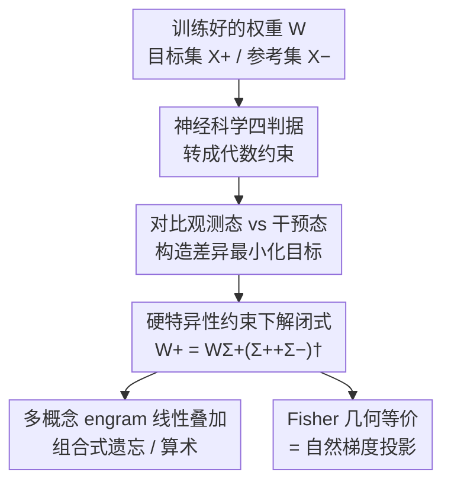

# AI Engram: In Search of Memory Traces in Artificial Intelligence

**会议**: ICML2026  
**arXiv**: [2606.14997](https://arxiv.org/abs/2606.14997)  
**代码**: https://github.com/jeakwon/ai-engram  
**领域**: 可解释性 / 知识编辑 / 机器遗忘  
**关键词**: 记忆痕迹, 神经科学约束, 闭式解, Fisher 信息几何, 组合式遗忘  

## 一句话总结
把神经科学里"engram（记忆痕迹）"的四条经典判据（特异性、再激活、充分性、必要性）翻译成参数空间上的代数约束，从而推出一个**只需输入统计量、一次前向就能算出**的闭式估计器，把某个概念在网络权重里对应的因果子成分单独"抠"出来，使得任意知识可以通过简单的线性加减被注入或抹除——并证明这个生物学动机的解恰好等价于 Fisher 度量下的自然梯度投影。

## 研究背景与动机

**领域现状**：神经科学几十年来一直在找"记忆的物理载体"——大脑里到底是哪一簇突触在编码某段具体记忆，这就是 engram。深度网络里也有类似的诉求：我们想知道某个概念（比如"猫"这一类、某个名人的事实）到底落在哪些权重上，这样才能做精准的知识删除、行为插入、模型审计。

**现有痛点**：训练后的权重是**高度纠缠**的——同一个权重矩阵同时支撑成百上千个概念，参数到记忆没有任何显式映射。现有方法要么靠启发式归因（gradient attribution，对超参极其敏感、不可扩展），要么像机器遗忘那样靠对目标数据迭代微调，要么像模型编辑（ROME / MEMIT / UCE）那样做闭式更新但需要算激活的协方差矩阵且没有生物学的"记忆"定义支撑。稀疏自编码器之类的分解只作用在激活上，并不给出**参数本身**的功能分解。

**核心矛盾**：记忆在参数空间里是**分布式且叠加**的，多个记忆痕迹在重叠的方向上互相干涉，导致"想动一个不碰其它"几乎不可能；而要做组合式遗忘（删除任意子集的概念），迭代方法面对的是 $\mathcal{O}(2^n)$ 的组合爆炸。

**本文目标**：在训练好的权重里，找到某个概念 $\mathcal{C}$ 的因果载体——抹掉它该概念消失、注入它该概念出现，且不动其它知识；并把这件事做成可扩展、一次性、可组合的运算。

**切入角度**：作者直接借神经科学的四条 engram 判据当"约束"——既然生物学已经定义清楚什么才算一个真正的记忆痕迹，就把这些定义**翻译成线性代数约束**，让满足约束的唯一最优解自动浮现，而不是再设计一个启发式打分。

**核心 idea**：把 engram 识别写成一个**带零空间约束的逆问题**，在硬特异性约束下推出最小范数闭式解 $\bm{W}^{+}=\Delta\bm{W}\,\bm{\Sigma}^{+}(\bm{\Sigma}^{+}+\bm{\Sigma}^{-})^{\dagger}$，并发现它就是 Fisher 度量下的自然梯度方向。

## 方法详解

### 整体框架
方法的目标输入是一个训练好的网络权重 $\bm{W}$、目标概念的输入集合 $\bm{X}^{+}$ 和参考集合 $\bm{X}^{-}$（其余所有不该被动的输入），输出是该概念对应的"synaptic engram" $\bm{W}^{+}$——它是 $\Delta\bm{W}$ 里专门负责该记忆、且对参考子空间完全不起作用的那一部分。整条管线是：先用神经科学四判据给 $\bm{W}^{+}$ 立约束（特异性/再激活/充分性/必要性），把约束写成观测状态 vs 干预状态的差异最小化目标，在硬特异性约束下解出闭式 $\bm{W}^{+}$，再把多个概念的 engram 线性叠加，实现零优化的组合式遗忘。整个过程没有反向传播、没有迭代，只在一次前向里累加协方差就能算完。

### 关键设计

**1. 四条神经科学判据 → 代数约束：把"什么算记忆痕迹"形式化**

痛点是过去识别记忆痕迹没有公认的"判据"，只能靠启发式归因。作者借用记忆研究里的四条经典判据并逐一翻译成参数空间的线性代数条件（见原文 Table 1 的"观测态 vs 干预态"对照）：**特异性**要求 $\bm{W}^{+}$ 对参考输入 $\bm{X}^{-}$ 完全惰性（注入或抹除都不扰动它们的自然状态）；**再激活**要求在前激活空间 $\bm{Z}=\bm{W}\bm{X}$ 上复现学到的内部表征；**充分性**要求把 $\bm{W}^{+}$ 注入朴素模型（$\bm{W}_{0}+\bm{W}^{+}$）能让目标态 $\bar{\bm{Z}}_{1}^{+}\approx\bm{Z}_{1}^{+}$ 出现（gain-of-function）；**必要性**要求从学好的模型里消融 $\bm{W}^{+}$（$\bm{W}_{1}-\bm{W}^{+}$）能让目标态退回学习前的 $\bar{\bm{Z}}_{0}^{+}\approx\bm{Z}_{0}^{+}$（loss-of-function）。在 $\bm{Z}$ 空间（而非输出 $\bm{Y}$）上立约束的好处是：激活函数 $\sigma$ 固定，匹配 $\bm{Z}$ 是复现功能输出的更严格的充分条件，且避免了非线性扭曲。

**2. 双形式损失与最小范数闭式解：把逆问题压成一次前向**

把四判据的状态差异写成 Frobenius 范数平方和后，目标函数会塌缩成一个干净的对偶形式：

$$\mathcal{L}(\bm{W}^{+}) = 2\|(\bm{W}^{+}-\Delta\bm{W})\bm{X}^{+}\|_{F}^{2} + 2\|\bm{W}^{+}\bm{X}^{-}\|_{F}^{2}.$$

第一项是"在目标上要复现更新 $\Delta\bm{W}$ 的效果"，第二项是"在参考上要彻底惰性"。这说明 engram 识别本质上就是**把层级更新 $\Delta\bm{W}$ 里负责目标、且与参考子空间正交的那个分量隔离出来**。在硬特异性约束 $\bm{W}^{+}\bm{X}^{-}=\bm{0}$ 下用 KKT 条件求解，得到最小范数闭式估计器

$$\bm{W}^{+}=\Delta\bm{W}\,\bm{\Sigma}^{+}(\bm{\Sigma}^{+}+\bm{\Sigma}^{-})^{\dagger},$$

其中 $\bm{\Sigma}^{+}=\bm{X}^{+}\bm{X}^{+\top}$、$\bm{\Sigma}^{-}=\bm{X}^{-}\bm{X}^{-\top}$ 是未中心化协方差。借助伪逆性质 $\bm{\mathcal{X}}^{\dagger}=\bm{\mathcal{X}}^{\top}(\bm{\mathcal{X}}\bm{\mathcal{X}}^{\top})^{\dagger}$，可把空间复杂度从随样本数线性增长的 $\mathcal{O}(Nd)$ 降到常数 $\mathcal{O}(d^{2})$，这对 $N\gg d$ 的大模型至关重要。投影算子 $\bm{P}^{+}=\bm{\Sigma}^{+}(\bm{\Sigma}^{+}+\bm{\Sigma}^{-})^{\dagger}$ 不是硬投影（$\bm{P}^{2}\neq\bm{P}$），而是按谱信噪比加权的**软投影**——这恰好对应"生物 engram 是重叠而非严格切分"的现代神经科学证据。

**3. 回溯式实例化（tabula rasa）：让各层解耦、一次性并行求解**

实际中 $\Delta\bm{W}=\bm{W}_{1}-\bm{W}_{0}$ 需要初始权重 $\bm{W}_{0}$。作者援引"白板假设"（随机初始化是高熵基线、几乎不贡献结构信息），把更新回溯式地近似为 $\Delta\bm{W}\approx\bm{W}-\bm{0}$，于是最终估计器变成只依赖收敛权重的

$$\bm{W}^{+}=\bm{W}\,\bm{\Sigma}^{+}(\bm{\Sigma}^{+}+\bm{\Sigma}^{-})^{\dagger}.$$

这个近似的结构性后果是：层级子问题被**解耦**，所有层可以在一次前向里并行解出，全局 engram $\bm{\mu}^{+}=\bm{\mu}\bm{P}^{+}$ 由块对角谱投影器统一刻画。这意味着尽管前向是非线性的，记忆的功能拓扑却落在权重空间一个**可线性化的子空间**里——这正是后面"组合式算术"得以成立的代数基础。

**4. 组合式遗忘与 engram 算术：把记忆当成可加单元**

对编码了 $n$ 个概念 $\{c_1,\dots,c_n\}$ 的权重，单个 engram 按协方差空间划分定义为 $\bm{W}_{i}^{+}=\bm{W}\bm{\Sigma}_{i}(\sum_{j}\bm{\Sigma}_{j})^{\dagger}$。由于每个 $\bm{\Sigma}_i$ 独立计算且固定，这些谱子空间具有线性可加性，于是从 $n$ 个 engram 就能零样本合成 $2^{n}-1$ 个去学习状态。对任意子集 $\mathcal{U}$，遗忘后的权重直接由线性算术给出：

$$\text{Engram}(\alpha):=\bm{W}-\alpha\sum_{c_k\in\mathcal{U}}\bm{W}_{k}^{+},$$

$\alpha$ 控制编辑强度。这把迭代遗忘的 $\mathcal{O}(2^n\cdot\mathcal{T}_{\text{unlearn}})$ 复杂度降成线性 $\mathcal{O}(n\cdot\mathcal{T}_{\text{stat}})$ 的预计算。作者还验证这些 engram 像词向量一样支持向量算术（如 $\bm{\mu}\pm\bm{\mu}^{+}_{\text{Glasses}}\mp\bm{\mu}^{+}_{\text{Goatee}}$ 同时操控多个属性），且标量缩放可做连续语义插值。

### 损失函数 / 训练策略
本方法**无需训练**：核心就是上面的闭式估计器，只需在一次前向里累加目标/参考的协方差矩阵 $\bm{\Sigma}^{+},\bm{\Sigma}^{-}$，再做一次伪逆即可得到 $\bm{W}^{+}$。遗忘强度由单一标量 $\alpha$ 控制（在 LLM 实验里用按各层权重范数比 $\|W^{+}\|/\|W\|$ 自适应缩放到 $[0,1]$ 的 $\alpha_{\text{W-Norm}}$）。

## 实验关键数据

作者从三个角度验证：跨架构/数据集的通用性与可扩展性、与 SOTA 遗忘方法的定量对比、engram 算术的定性演示。

### 主实验

类别级遗忘对比（CIFAR-10 / ResNet-18，目标遗忘 Class 0），指标 ToW↑、DA↑、NMI↓（括号内为与重训模型的差距）：

| 方法 | ToW↑ | DA↑ | NMI↓ |
|------|------|-----|------|
| Retrain（金标准） | 0.999 | 0.987 | 0.410 |
| Fine-tune | 0.952 | 0.973 | 0.547 |
| NegGrad+ | 0.936 | 0.942 | 0.244 |
| $l_1$-Sparse | 0.956 | 0.975 | 0.515 |
| SalUn | 0.878 | 0.833 | 0.911 |
| **Engram ($\alpha=1$)** | 0.930 | **0.992** | 0.379 |
| **Engram ($\alpha_{\text{best}}$)** | **0.984** | 0.958 | 0.611 |

Engram 在 ToW（输出级遗忘）上取得最好成绩，且表征级指标 DA / NMI 也确认它是真把遗忘集的结构痕迹"溶解"掉，而非仅在输出层遮盖。CKA 分析进一步显示带最优 $\alpha$ 的 Engram 最接近重训模型（落在"与重训高相似、与原模型低相似"的理想区）。

LLM 上的验证（Llama-3.2-1B + TOFU 遗忘基准），指标 Mem.↑ / Util.↑ / Priv.↑ / EM↓ / FQ↑：

| 方法 | Mem.↑ | Util.↑ | Priv.↑ | EM↓ | FQ↑ |
|------|-------|--------|--------|-----|-----|
| Retain（保留上限） | 1.0000 | 0.9933 | 1.0000 | 0.0000 | 0.0000 |
| RMU | 0.8660 | 0.7471 | 0.6799 | 0.2953 | -0.2357 |
| NPO | 0.9339 | 0.9501 | 0.9484 | 0.0948 | -1.9986 |
| SimNPO | 0.9435 | 0.9706 | 0.9232 | 0.1035 | -0.0897 |

> ⚠️ 表中 Engram 在 LLM 上的具体行因缓存截断未完整取到，但作者主张其闭式估计器能在十亿参数模型上做到外科手术式的记忆隔离；具体数值以原文 Table 3 为准。

### 消融 / 通用性

| 配置 / 场景 | 现象 | 说明 |
|------|------|------|
| ResNet-18 / CIFAR-10 | 对角掉点、非对角稳定 | 消融某 engram 只抹目标类，参考类保持 |
| ConvAE / MNIST（无监督） | 目标数字重建 MSE 选择性升高 | 无显式标签下也能选择性损伤特定形态特征 |
| WAE / CelebA | 滑动 $\alpha$ 连续控制属性强度 | engram 是稳定可线性化的语义方向 |
| 架构谱（MLP→CNN→ViT→ConvAE） | 均有效 | engram 是架构无关的记忆单元 |
| 规模（CIFAR-100 100类 / ImageNet-1k 1000类） | 单次线性分解合成所有去学习态 | 化解组合爆炸 |

### 关键发现
- **生物约束 = 几何最优**：从神经科学判据独立推出的闭式解，恰好等价于 K-FAC 近似 + 各向同性输出曲率假设下、Fisher 度量上的最小范数投影（定理 6.1）；消融 engram 等价于在遗忘目标上走一步自然梯度（推论 6.3）。这把"生物启发"从启发式提升为捕捉了神经表征的根本几何性质。
- **软投影对应记忆重叠**：$\bm{P}^{+}$ 非幂等，对概念间共享的协方差方向是"衰减加权"而非"二元排除"，与"生物 engram 重叠而非切分"吻合；补空间 $Q=I-\sum P_i$ 上的扰动零代价，伪逆隐式选最小范数解，避免在信息零方向上漂移。
- **最优 $\alpha$ 很关键**：$\alpha=1$ 已具竞争力，但网格搜索的 $\alpha_{\text{best}}$ 才把 ToW 推到 0.984、最贴近重训模型。

## 亮点与洞察
- 把"神经科学判据 → 代数约束 → 闭式解"这条链路走通，最让人"啊哈"的是**两条独立推导（生物约束 vs Fisher 投影）收敛到同一个解**——这把一个看似领域跨界的隐喻坐实成了严格几何结论。
- $\mathcal{O}(Nd)\to\mathcal{O}(d^2)$ 的空间复杂度降维 + 各层解耦并行，是它敢声称能上十亿参数 LLM 的工程根基；记忆识别从"随机搜索"变成"确定性一次前向谱估计"。
- "记忆当可加单元"的 engram 算术（类比 King−Man+Woman≈Queen 与 Task Arithmetic）可直接迁移到：可控属性编辑、按需隐私删除、模型审计——只要能定义目标/参考划分，就能闭式抠出对应方向。

## 局限与展望
- **白板假设是近似**：用 $\Delta\bm{W}\approx\bm{W}-\bm{0}$ 忽略了初始化与预训练的结构贡献，对"从预训练权重微调"的场景（$\Delta\bm{W}=\bm{W}_{\text{ft}}-\bm{W}_{\text{pt}}$）只在附录里讨论，回溯式实例化是否总成立存疑。
- **Fisher 等价依赖强假设**：K-FAC 的层独立 + 各向同性输出曲率 $G_l\approx\sigma^2 I$ 是为"揭示结构等价"而非操作必需；放松到各向异性曲率会引入输出侧加权，真实模型偏离该假设时几何解读会打折。
- **软投影 ≠ 完全隔离**：概念高度重叠时共享方向只是被衰减而非剔除，强行大 $\alpha$ 可能误伤相关知识；最优 $\alpha$ 仍需网格搜索，缺乏免调参的自适应保证。
- LLM 上仅在 1B 规模 + TOFU 验证，能否扩到更大模型与更复杂的纠缠知识仍待检验。

## 相关工作与启发
- **vs UCE / MEMIT / ROME（模型编辑）**：它们同样给闭式更新且避免梯度，但需算隐藏激活的协方差、缺乏"记忆痕迹"的原则性定义；本文同样闭式，却由神经科学四判据约束定义记忆，给出唯一最优子成分。
- **vs Task Arithmetic（Ilharco 2023）**：Task Arithmetic 把模型权重当向量做线性分离，但停在粗粒度全局层面；本文在参数空间给出按概念划分的细粒度、唯一可加 engram。
- **vs APD / SPD（线性参数分解）**：APD 靠梯度归因、对超参敏感且不可扩展，SPD 用可学习秩一子成分仍需迭代；本文在单次前向里给出唯一子成分，不依赖迭代优化。
- **vs 稀疏自编码器（SAE）**：SAE 分解的是激活、恢复单义字典元，但不给参数本身的功能分解；本文直接在参数空间隔离因果载体。

## 评分
- 新颖性: ⭐⭐⭐⭐⭐ 把神经科学判据严格翻译成闭式可解的逆问题，并证明与 Fisher 自然梯度等价，跨界且坐实。
- 实验充分度: ⭐⭐⭐⭐ 覆盖 MLP→ViT→ConvAE、监督/生成、CIFAR→ImageNet→LLM，但 LLM 仅 1B 规模。
- 写作质量: ⭐⭐⭐⭐ 理论链条清晰、动机叙事到位；符号密集，部分关键数值需查附录。
- 价值: ⭐⭐⭐⭐⭐ 为可解释性、知识编辑、机器遗忘提供了统一、可扩展、免训练的工具与几何视角。

<!-- RELATED:START -->

## 相关论文

- [\[ICML 2026\] Grokking: From Abstraction to Intelligence](grokking_from_abstraction_to_intelligence.md)
- [\[ICML 2026\] Adaptive Querying with AI Persona Priors](adaptive_querying_with_ai_persona_priors.md)
- [\[ICML 2026\] Position: Stop Anthropomorphizing Intermediate Tokens as Reasoning/Thinking Traces!](position_stop_anthropomorphizing_intermediate_tokens_as_reasoningthinking_traces.md)
- [\[ICML 2025\] Towards Flexible Perception with Visual Memory](../../ICML2025/interpretability/towards_flexible_perception_with_visual_memory.md)
- [\[AAAI 2026\] ToC: Tree-of-Claims Search with Multi-Agent Language Models](../../AAAI2026/interpretability/toc_tree-of-claims_search_with_multi-agent_language_models.md)

<!-- RELATED:END -->
