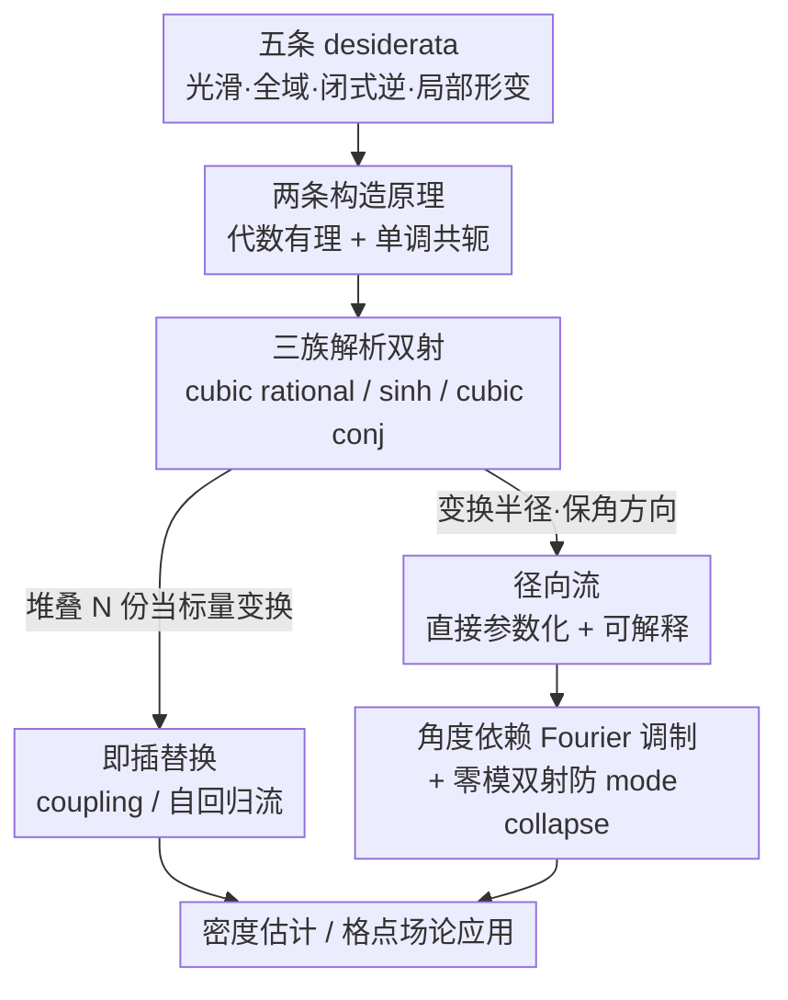

# Analytic Bijections for Smooth and Interpretable Normalizing Flows

**会议**: ICML2026  
**arXiv**: [2601.10774](https://arxiv.org/abs/2601.10774)  
**代码**: 待确认  
**领域**: 归一化流 / 生成模型 / 密度估计 / 可解释性  
**关键词**: 归一化流, 解析双射, 闭式可逆, 径向流, 格点场论

## 一句话总结
本文构造了三族"全局光滑（$C^\infty$）、定义在整个 $\mathbb{R}$ 上、且有闭式解析逆"的标量双射，既能当 coupling flow 里 spline/affine 的即插替换，又催生出一种直接参数化、变换半径而保角方向的**径向流（radial flow）**——后者训练极稳、几何可解释，在有径向结构的目标上能用比 coupling flow 少三个数量级的参数达到相当质量。

## 研究背景与动机
**领域现状**：归一化流（normalizing flow）通过一串可逆映射把简单基分布（通常高斯）变换到目标分布，密度由变量替换公式 $q_\theta(x)=\rho(f_\theta^{-1}(x))|\det J_{f_\theta}(f_\theta^{-1}(x))|^{-1}$ 给出。在 coupling 与自回归架构里，把坐标分成 passive/active 两组，对 active 坐标逐元素施加一个**标量双射** $h$，这个标量双射的选择从根本上决定了模型的表达力与训练稳定性。

**现有痛点**：现有标量双射各有硬伤、互相 trade-off——
- **仿射变换**（Real NVP）光滑且解析可逆，但只能整体平移缩放，缺乏局部表达力，要靠堆很多层才能拟合多峰/重尾结构；
- **单调样条**（neural spline）有 learnable knots、能做细粒度局部控制，但只是分段光滑（有限阶 $C^k$，非 $C^\infty$），且只在一个**有界区间**内真正起变换作用；
- **残差流 / Gaussianization 流**等能做到全局光滑，但**求逆要数值求根**（无闭式逆）；连续归一化流更要数值解 ODE。

**核心矛盾**：没有一族标量双射能**同时**满足"全局 $C^\infty$ 光滑 + 定义在整个 $\mathbb{R}$ 上 + 闭式解析可逆 + 雅可比可算 + 既支持局部形变又支持全局重分布"这五条性质——光滑的要么不可解析求逆，可解析求逆的（仿射）又没局部表达力，有局部表达力的（样条）又不全局光滑、域还有界。

**本文目标**：构造满足全部五条 desiderata 的标量双射族；并探索能直接利用这种双射表达力、且本身可解释的新流架构。

**切入角度**：作者从两个数学原理切入——(i) 取**代数有理函数**形式的扰动 $h(x)=x+g(x)$，让"求逆"恰好化归为可解的三次方程（Cardano 公式）；(ii) 用**单调函数共轭** $h(x)=g^{-1}(g(x)+\delta)$，借已知逆的单调 $g$ 把可逆性"搭"出来。

**核心 idea**：用上面两条原理造出三族解析双射，既即插替换 coupling flow 里的标量变换，又用它直接参数化"只变半径、不变方向"的径向流，把光滑性、闭式逆和几何可解释性一次性拿到手。

## 方法详解

### 整体框架
方法分两层。**底层**是标量双射的构造：先列出双射要满足的五条性质（全局光滑、全局定义域、闭式解析逆、雅可比可算、支持局部形变），再用两条构造原理（代数有理化归三次方程、单调函数共轭）造出三个具体家族——cubic rational、sinh conjugation、cubic conjugation。**上层**是这些双射的两种用法：一是作为 coupling/autoregressive 流里 spline/affine 的**即插替换**（靠把多份独立参数化的同族双射"堆叠"成深度 $N$ 来加表达力）；二是催生**径向流**这一新架构——用一个标量双射变换半径 $r=\|x\|$ 而保持角方向不变，参数可直接学习（无需 conditioner 网络），还能引入角度依赖与问题特定设计。

### 关键设计

**1. 两条构造原理 → 三族解析双射：一次满足五条性质**

痛点是没有双射能同时满足全部五条。第一条原理是**代数有理函数**：取 $h(x)=x+g(x)$ 且 $g(x)=n(x)/d(x)$，要求 $|x|\to\infty$ 时 $g\to0$（保留尾部、继承基分布的支撑与尾，利于稳定训练）。约束推导很漂亮：$d$ 不能有实根故须偶次；$\deg n<\deg d$；而 $\deg d\ge4$ 清分母会得到五次及以上方程、按 Abel–Ruffini 定理无闭式解，$\deg d=0$ 又退化成仿射——于是 $\deg d=2$ 是**唯一**非平凡选择，清分母恰好得到三次方程、可用 Cardano 公式闭式求逆，这就是 **cubic rational** 双射

$$h(x)=x+\frac{\lambda(x-\gamma)}{1+(x-\gamma)^2/\sigma^2},\quad -1<\lambda<8,\ \sigma>0.$$

第二条原理是**单调函数共轭**：给定严格单调、逆已知的 $g$，定义 $h(x)=g^{-1}(g(x)+\delta)$ 对任意 $\delta$ 都可逆，导数 $h'(x)=g'(x)/g'(h(x))$；要让 $h(x)\to x$ 需 $g$ 超线性（$g'(x)\to\infty$）。据此取 $g=\sinh$ 得 **sinh conjugation**（带 $\mu,\nu$ 还能做全局平移），取 $g(x)=ax+bx^3$ 得 **cubic conjugation**。三族都同时满足"光滑/全域/闭式逆/可算雅可比/局部形变"五条，正是表 1 里别人都缺一两项、本文全勾的来源。

**2. 径向流：直接参数化、变换半径而保角方向**

这是本文最有"画面感"的新架构。把任意点 $x=r\hat{x}$（$r=\|x\|$，$\hat{x}=x/r$）做极分解，只对半径施加标量双射 $f$、方向 $\hat{x}$ 不动：$g(x)=\frac{f(\|x\|)}{\|x\|}x$，其 log-雅可比有简单闭式

$$\log|\det J_g|=\log|f'(r)|+(n-1)\log\Big|\frac{f(r)}{r}\Big|.$$

通过 $f(r)=\tilde{f}(r)-\tilde{f}(0)$ 强制 $f(0)=0$ 保可逆与光滑。和 coupling flow 用神经网络 conditioner 不同，径向流的参数（中心 $c$、各维缩放 $s$、双射 $f$）**可直接学习**，由此带来三个好处：训练极稳（学习率能开到 $10^{-2}$，比 coupling flow 高一个数量级，因几何简单避免了让 coupling 层失稳的极端雅可比）；几何可解释（每层就是绕某中心的"径向拉伸/压缩"）；在有径向结构的目标上参数效率极高。代价是几何约束——单层径向流"保 ray"（质量只能沿从中心出发的射线重分布、不能在射线间转移），需用**多中心堆叠**缓解。

**3. 角度依赖的 Fourier 调制 + 零模双射：把表达力与问题结构对齐**

单纯保角的径向流拟合不了违反角向均匀的目标（如螺旋）。本文让半径双射依赖角度 $r'=f(r,\hat{x})$：2D 下把双射参数用**截断 Fourier 级数**沿角度 $\phi=\mathrm{atan2}(x_2,x_1)$ 展开，$\theta_j(\phi)=a_{j,0}+\sum_{k=1}^K[a_{j,k}\cos k\phi+b_{j,k}\sin k\phi]$，仅几十到几百个参数就能逐步拟合出螺旋细节，且整个变换仍是一个可视化、可检视的 $f(r,\phi)$（远比 coupling 层可解释）。原点处 $\hat{x}$ 无定义会引入坐标奇点，需 $\partial_r f(0,\hat{x})$ 与方向无关才在原点可微，可用一个固定参数的补正双射强制（实测少层流不强制反而更利于训练与可视化）。这套思路还能做**问题特定设计**：在 $\phi^4$ 格点场论的双峰相，标准 reverse-KL 训练会 mode collapse（只覆盖一个峰），作者对零频 Fourier 模（即 $\mathbb{Z}_2$ 序参量、平均磁化 $M$）的幅值 $|\tilde{\phi}_0|$ 施加一个 $f(0)=0$ 的**零模双射**——只变幅值故精确保对称，先冻结 coupling 层预训练它，再解冻全训，就能均衡覆盖两个峰。

### 损失函数 / 训练策略
有目标样本时用前向 KL，等价于最小化负对数似然 $\mathcal{L}=-\mathbb{E}_{x\sim p}\log q_\theta(x)$；科学场景目标只给出非归一化密度 $\tilde{p}=pZ_p$ 时用反向 KL，丢掉未知配分函数后最小化 $\mathcal{L}=\mathbb{E}_{x\sim q_\theta}[\log q_\theta(x)-\log\tilde{p}(x)]$。表达力旋钮是**堆叠数 $N$**（把同族双射堆 $N$ 份）；约束参数用 softplus（保正 $\sigma,a,b>0$）/sigmoid（限区间 $\lambda$）可微地施加；深 coupling 流里压低 conditioner 末层初始化尺度可显著稳住训练。

## 实验关键数据

### 主实验
覆盖 1D 密度估计、2D coupling/radial 流、标准密度估计基准（CIFAR10 图像 + UCI 表格）、以及 $\phi^4$ 格点场论。先看标量双射性质对照（表 1）：本文三族在五条性质上全勾，而已有方法都缺项。

| 方法 | 光滑 | 全域 ℝ | 闭式逆 | 局部形变 |
|------|------|--------|--------|----------|
| Affine | ✓ | ✓ | ✓ | ✗ |
| Splines | 仅 $C^k$ | ✗ | ✓ | ✓ |
| Residual | ✓ | ✓ | ✗ | ✓ |
| 本文（cubic rational / sinh / cubic conj） | ✓ | ✓ | ✓ | ✓ |

作为 coupling 层的即插替换，在 CIFAR10（多尺度 RealNVP 架构，仅换标量双射）上三种解析变体相对原版仿射 RealNVP 各降约 0.12 bpd：

| 模型（RealNVP+，仅标量双射不同） | 测试 BPD（越低越好） |
|------|------|
| RealNVP（Dinh et al., 2017） | 3.49 |
| RealNVP+（cubic rational） | **3.36** |
| RealNVP+（sinh conjugation） | 3.37 |
| RealNVP+（cubic conjugation） | 3.37 |

UCI 表格基准（RQ-NSF(C) coupling 架构，仅换标量变换；测试 log-likelihood 越高越好）上，**spline+**（sinh 共轭后接有理二次样条）在 POWER/BSDS300 上常超过纯 spline，匹配或超过已发表 RQ-NSF(C)；在小数据、易过拟合的 HEPMASS/MINIBOONE 上加表达力反而无益（MINIBOONE 上纯 sinh 反而最强）——说明样条与解析双射捕捉互补结构、spline+ 把两者结合。

### 消融 / 分析

| 设置 | 关键结果 | 说明 |
|------|---------|------|
| 1D 堆叠 $N=27$（cubic conj） | ESS $\approx99\%$，前向 $D_{\mathrm{KL}}\approx3.5\times10^{-3}$ | 三族随深度 $N$ 单调变好，cubic conj 最佳 |
| 2D coupling 流 $N=9$（cubic） | $D_{\mathrm{KL}}\approx0.35$ | 优于 affine（$\approx0.8$）与 spline（$\approx0.45$）；$N$ 过大稳定性下降、方差增大 |
| Fourier 径向流 $K=3$ | 319 参数，test NLL $-0.74$ | $K=0/1/2/3$ 的 NLL 为 $-0.09/-0.61/-0.69/-0.74$，少量角向模即高保真 |
| 径向 vs coupling（螺旋） | NLL $-0.79$ vs $-0.52$ | 径向流参数少约三个数量级，且无 coupling 的轴对齐"折叠"伪影 |
| $\phi^4$（$20\times20$，单峰相） | ESS：cubic rational 39.66% > cubic 38.85% > sinh 38.51% > spline 34.34% > affine 31.85% | 400 维真实物理结构下仍优于样条/仿射 |
| $\phi^4$ 双峰相 + 零模双射 | 预训练零模双射后均衡覆盖两峰 | 朴素训练 ESS 90% 但塌成单峰，零模双射防 mode collapse |

### 关键发现
- **径向流的参数效率最惊艳**：在 5 分量环形高斯混合上，纯径向流（1.6k 参数）视觉保真最好，而 coupling flow（2,311k 参数）出现尖刺伪影——三个数量级的参数差距下质量反超，是"架构与目标几何对齐"的直接证据。
- **光滑性优势随维度放大依然成立**：从 2D toy 到 400 维 $\phi^4$，解析双射相对样条/仿射的 ESS 优势一致存在，说明 $C^\infty$ 光滑不是只在玩具问题上好看。
- **表达力不是越多越好**：堆叠数 $N$ 过大、或在小数据集上加表达力都会因训练不稳/过拟合掉点，需按数据规模与目标结构权衡。

## 亮点与洞察
- **用 Abel–Ruffini 定理"卡"出唯一可解构造**：从"求逆要可闭式解"出发反推 $\deg d=2$ 是唯一非平凡选择，把"为什么是三次有理而非更高次"讲得有理有据，这种"用代数可解性约束架构设计"的思路很可迁移。
- **径向流把'保角方向'变成可解释性与稳定性的来源**：只动半径不动方向，既让每层有清晰几何意义（绕中心拉伸/压缩），又避免了 coupling 层交替轴对齐变换造成的折叠伪影——可解释性与质量在这里不是 trade-off 而是同源。
- **零模双射示范了'问题特定双射'**：把对称性（$\mathbb{Z}_2$ 序参量）直接编进一个只变幅值的双射来防 mode collapse，展示了表达力双射如何使"为目标分布量身定制架构"成为可能。

## 局限与展望
- **径向流仍局限于低维**：作者承认径向流目前只在低维（1D/2D）验证好用，高维下单中心"保 ray"约束需要的层数可能随维度恶化，$\phi^4$ 实验仍是靠 coupling 流而非径向流 scale 上去的。
- **深堆叠的稳定性—表达力 trade-off 未根治**：$N$ 过大时训练不稳、最终性能方差大，论文归因于学习率等超参固定，但没给出系统的稳定化方案。
- **闭式逆依赖 Cardano 公式**：cubic 系双射求逆要解三次方程，虽闭式但相对仿射仍有常数开销，且数值实现中近退化情形的稳健性论文未充分讨论。

## 相关工作与启发
- **vs 仿射（Real NVP）**：仿射光滑可逆但只能全局平移缩放、无局部形变；本文双射在保持光滑闭式逆的同时拿到局部形变，CIFAR10 上即插替换降约 0.12 bpd。
- **vs 单调样条（neural spline flow）**：样条有局部控制但仅分段 $C^k$、域有界；本文双射全局 $C^\infty$、定义在整个 $\mathbb{R}$，且 spline+ 混合还能超过纯样条。
- **vs Rezende & Mohamed (2015) 的径向变换**：早期径向变换是单个简单映射 $r'=r+r\beta/(\alpha+r)$；本文用解析双射替换之、引入多个可学习中心与基缩放、并加上角度依赖，表达力与可解释性都大幅提升。
- **vs 残差/连续归一化流**：它们能全局光滑但求逆/采样要数值求根或解 ODE；本文坚持闭式逆，落在不同的 trade-off 点上。

## 评分
- 新颖性: ⭐⭐⭐⭐⭐ "唯一可解三次有理 + 共轭"两条原理凑齐五条性质，径向流是真正的新架构。
- 实验充分度: ⭐⭐⭐⭐ 从 1D 到 400 维 $\phi^4$、含图像/表格/物理多场景，径向流高维验证略欠。
- 写作质量: ⭐⭐⭐⭐⭐ 数学动机—构造—性质对照层层递进，图示直观。
- 价值: ⭐⭐⭐⭐ 即插替换 + 可解释新架构，对科学计算（格点场论等）尤其有用。

<!-- RELATED:START -->

## 相关论文

- [\[NeurIPS 2025\] Partial Information Decomposition via Normalizing Flows in Latent Gaussian Distributions](../../NeurIPS2025/interpretability/partial_information_decomposition_via_normalizing_flows_in_latent_gaussian_distr.md)
- [\[ICML 2026\] Learn from A Rationalist: Distilling Intermediate Interpretable Rationales](learn_from_a_rationalist_distilling_intermediate_interpretable_rationales.md)
- [\[ICML 2026\] Discovering Interpretable Algorithms by Decompiling Transformers to RASP](discovering_interpretable_algorithms_by_decompiling_transformers_to_rasp.md)
- [\[ICML 2026\] CB-SLICE: Concept-Based Interpretable Error Slice Discovery](cb-slice_concept-based_interpretable_error_slice_discovery.md)
- [\[ICML 2026\] Prototype Transformer: Towards Language Model Architectures Interpretable by Design](prototype_transformer_towards_language_model_architectures_interpretable_by_desi.md)

<!-- RELATED:END -->
