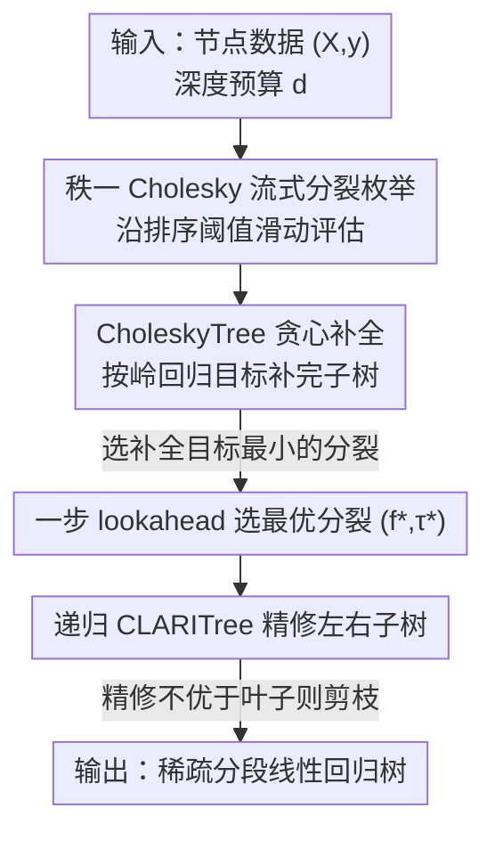

# CLARITree: Cholesky and Lookahead Accelerations for Regression with Interpretable Piecewise Linear Trees

**会议**: ICML 2026  
**arXiv**: [2606.12840](https://arxiv.org/abs/2606.12840)  
**代码**: https://github.com/Yixiao-Wang-Stats/CLARITree  
**领域**: 可解释性 / 决策树回归  
**关键词**: 回归树, 分段线性, lookahead 搜索, Cholesky 秩一更新, 近优树

## 一句话总结
针对"贪心回归树快但不准、最优回归树准但慢得跑不动"的两难，CLARITree 把一步 lookahead 搜索和岭回归 Gram 矩阵的秩一 Cholesky 更新结合起来，学出近优、稀疏、叶子带线性模型的回归树，在精度逼近最优解的同时把可扩展性拉到比现有最优方法高一个量级。

## 研究背景与动机

**领域现状**：回归树是机器学习里少有的"既可解释又有表达力"的模型类。叶子放常数的 CART/C4.5 训练快但建模能力弱；叶子放线性模型（M5、GUIDE、PILOT）表达力强，但每个节点都要解一次最小二乘，训练代价高。要逼近最优，主流是用动态规划 + 分支定界（STreeD 等）在树空间里搜索并用上下界剪枝。

**现有痛点**：贪心法每一步只看当前最优分裂，和真正的最优解之间可能差很远（文献里记录过任意大的 gap）；而最优 DP 方法一旦叶子换成线性回归、特征又是连续值，搜索代价就会爆炸——解线性回归本身是 $O(k^3)$，乘上海量候选阈值和指数级的树空间，现有最优实现要么只能退化到常数叶子或单特征线性，要么在中大规模数据上直接超时。

**核心矛盾**：可扩展性和最优性之间存在硬性 trade-off。最优方法的开销主要压在两件事上——一是反复在每个候选分裂处重新拟合线性回归，二是把连续特征二值化后候选阈值数量暴涨。

**本文目标**：要一个既保留贪心法效率、又逼近最优精度的算法，且能直接处理连续特征、数值稳定。

**切入角度**：作者受 SPLIT（Babbar et al., 2025，分类树的 lookahead 框架）启发——不必全局搜索整棵树，只把前若干层"看远一点"（lookahead），剩下用贪心补全，往往就能逼近最优。难点在于：分类树没有"在叶子里解线性回归"这件事，把 lookahead 搬到连续特征 + 线性叶子的回归树上，最小二乘的代价和数值稳定性是全新的算法挑战。

**核心 idea**：用"一步 lookahead 选分裂 + 递归精修"控制搜索预算，用"秩一 Cholesky 更新岭回归 Gram 分解"把每个候选分裂的评估代价从 $O(k^3)$ 压到 $O(k^2)$，让连续特征上的近优线性回归树第一次变得实际可跑。

## 方法详解

### 整体框架

CLARITree 要最小化的目标是"预测损失 + 结构复杂度惩罚"：

$$L^*(D, d, \lambda, \kappa) = \min_{T_d \in \mathcal{T}} \Big( R_\kappa(T_d, D) + \lambda S(T_d) \Big)$$

其中每个叶子拟合一个岭正则线性预测器 $\hat{y}_i = \beta_0 + x_i^\top \beta$（正则系数 $\kappa$），$S(T_d)$ 是叶子数，$\lambda$ 控制树规模。直接求这个最优解是组合爆炸，CLARITree 用 $L_{\text{CLARITree}}$ 来逼近它。

流程是这样的：对当前节点，先用一步 lookahead 枚举"这一层所有可能的分裂"，每个候选分裂用一个贪心子程序（CholeskyTree）把剩下的子树补全，比较补全后的整体目标，选出最优分裂 $(f^\star, \tau^\star)$；选定后，再用 CLARITree 自身递归地去精修左右子树（而不是直接采纳贪心补全的结果）；最后把精修出来的子树目标和"直接当叶子"的目标比较，如果精修没有变好就剪枝退化成叶子。整个搜索-评估循环的算力都压在"评估海量候选分裂"上，而这正是秩一 Cholesky 更新要解决的瓶颈。

### 关键设计

**1. 一步 lookahead 选分裂 + 递归精修：用有限前瞻逼近全局最优**

贪心法的病根是"只看当前一步"，最优法的病根是"看全部步、代价爆炸"。CLARITree 取折中：在每个节点只对"当前这一层"的所有候选分裂做穷举（一步 lookahead），每个候选都用贪心补全估出"如果就这么分下去，整棵子树会有多好"，再选补全目标最小的那个分裂。形式上目标递归定义为：先用贪心 CholeskyTree 选出 $(f^\star, \tau^\star) = \arg\min_{f,\tau}\big(L_g(D_{f\le\tau}, d{-}1) + L_g(D_{f>\tau}, d{-}1)\big)$，再用 CLARITree 自身去精修这两个子节点。关键在于"选分裂"用一步前瞻而非纯贪心，所以理论上能证明它的目标值恒 $\le$ 贪心 CholeskyTree（Theorem 5.3），且在某些分布上 MSE 改进可以任意大（$\text{MSE}_{\text{Greedy}}/\text{MSE}_{\text{CLARITree}} \ge \frac{1}{4\varepsilon}$，Theorem 5.4）——这就是它能"近优"的来源。

**2. CholeskyTree 贪心补全子程序：用下游岭回归目标来选分裂**

lookahead 需要一个快速的补全器把子树填完以便评估，这就是 CholeskyTree（也可单独当 baseline 用）。它表面像经典的 M5 模型树，但有本质区别：M5 这类方法用节点均值/方差缩减来评估分裂，叶子却放线性模型，导致"评估准则和最终预测不匹配"，分裂选得次优；CholeskyTree 直接用**下游的岭正则线性回归损失**来选分裂，让评估和预测对齐。它同样全程用秩一 Cholesky 更新维护叶子统计量，所以补全一棵子树也很快——这正是 lookahead 能负担得起"对每个候选分裂都补全一遍"的前提。

**3. 秩一 Cholesky 流式分裂枚举：把每个候选分裂的评估压到 $O(k^2)$**

这是整篇的效率核心。评估一个分裂要重解左右两个子节点的岭回归，从头解是 $O(k^3)$。CLARITree 不重解，而是维护正则 Gram 矩阵的 Cholesky 分解 $A = X^\top X + \kappa I = LL^\top$ 和矩向量 $b = X^\top y$。沿某个特征把样本按排序值从左到右扫描时，每移动一个样本就对左右子节点各做一次秩一 Cholesky 更新/降秩（cholupdate $\pm$），单次 $O(k^2)$（Theorem 4.1）；同时维护 $\|y_{I_L}\|^2, \|y_{I_R}\|^2$。岭损失则**不必显式解出系数**，直接从 Cholesky 因子读出：

$$\min_\beta \|X\beta - y\|^2 + \kappa\|\beta\|^2 = \|y\|^2 - \|L^{-1}b\|^2$$

也是 $O(k^2)$（Theorem 4.2）。用 Cholesky 而非直接更新逆矩阵，是为了无需 pivoting 也能数值稳定。这一招把评估单次分裂的代价砍掉一个 $O(k)$ 因子，是 CLARITree 总运行时 $O(kn\log n + d^2 n k^4 T)$ 中那个能跑得动的关键。

**4. 直接处理连续特征：免二值化，再省一个 $O(n)$ 因子**

现有最优方法常把连续特征二值化（每个特征生成 $T$ 个阈值谓词），候选数量随之膨胀。因为秩一 Cholesky 更新本就是"样本在左右子节点间增量搬移"的形式，CLARITree 能在排序后的连续特征上一路滑动扫描、增量更新，不需要预先二值化。相比按 $T$ 个阈值枚举的二值化方案，直接操作连续特征把分裂评估复杂度再降一个 $T$ 因子（相对全二值化回归则降 $T^3$，Theorem 5.5）。这也是它在高维连续数据上能扩展的原因。

## 实验关键数据

实验设置：深度 4、每特征 20 个候选阈值，报告 Test $R^2$（均值 ± 标准差），括号里是相对 CLARITree 的 Test MSE 比值，训练时间上限 600s（超时记 `*`）。对比对象覆盖最优 DP（STreeD、STreeD-S）和一众贪心法（GUIDE、PILOT、M5、CholeskyTree）。

### 主实验

| 数据集 | 规模 | CLARITree | STreeD(最优DP) | GUIDE | PILOT | M5 |
|--------|------|-----------|----------------|-------|-------|-----|
| Airfoil | 1503 | 0.88 | 0.89 | 0.84 | 0.51 | 0.54 |
| Optical Net | 630 | **0.92** | 0.88 | 0.80 | 0.71 | 0.74 |
| California Housing | 20433 | **0.75** | 0.70* (超时) | 0.73 | 0.64 | 0.60 |
| Seoul Bike | 8760 | **0.72** | 0.69* | 0.68 | 0.54 | 0.60 |
| Temperature(Max) | 7590 | **0.88** | 0.82* | 0.84 | 0.78 | 0.72 |

小/中规模上 CLARITree 与最优 DP 几乎并列（如 Airfoil 0.88 vs STreeD 0.89），且常优于所有贪心 baseline；大规模上最优 DP 普遍超过 600s 时间上限（带 `*`），精度反而被 CLARITree 反超（California Housing 0.75 vs 0.70*）——印证了"近优 + 可扩展"的卖点。

### 消融 / 方法对比

| 配置 | 角色 | 说明 |
|------|------|------|
| CLARITree(完整) | 一步 lookahead + 递归精修 | 近优解，理论上 $\le$ 贪心目标 |
| CholeskyTree | 去掉 lookahead，纯贪心补全 | 同框架的贪心 baseline，精度普遍低于 CLARITree |
| 无 Cholesky 秩一更新 | 每个分裂从头解 $O(k^3)$ | 评估代价升一个 $O(k)$ 因子，大规模不可行 |
| 二值化连续特征 | 不直接处理连续值 | 分裂评估复杂度多一个 $T$（全二值化为 $T^3$） |

### 关键发现
- lookahead 是精度来源：CholeskyTree（去掉前瞻）在多数数据集上掉到 CLARITree 之下，且理论保证 CLARITree 目标恒 $\le$ 贪心。
- Cholesky 秩一更新是可扩展性来源：把单次分裂评估从 $O(k^3)$ 降到 $O(k^2)$，否则大规模数据根本跑不完。
- 最优 DP 在大数据上"准但跑不动"——多个大规模数据集触发 600s 超时，CLARITree 在同等时间内反而拿到更高 $R^2$。

## 亮点与洞察
- 把"组合优化里的 rollout / pilot 思想"和"数值线性代数的秩一 Cholesky 更新"缝在一起：前者控制搜索预算，后者把每步评估变廉价，两者缺一这套就跑不起来。
- 用 $\|y\|^2 - \|L^{-1}b\|^2$ 直接从 Cholesky 因子读岭损失，**绕过显式求解系数**，是个很可复用的 trick——任何需要在大量候选切分点上反复评估线性回归损失的场景都能借。
- 评估准则和叶子预测对齐（都用岭回归目标），避免了 M5 那种"按方差选分裂、按线性模型预测"的错配——一个常被忽略但影响很大的设计点。
- "直接吃连续特征、免二值化"既是效率优化也是精度优化：二值化本身会丢信息，省掉它一举两得。

## 局限与展望
- 主文聚焦"一步 lookahead"这个多项式时间特例；多步 lookahead 虽更接近最优，但代价更高，附录才讨论，主文未充分展开。
- 运行时 $O(d^2 n k^4 T)$ 对特征维度 $k$ 是四次方依赖，特征极高维时仍可能吃力。
- 标准分裂准则限定为 MSE 缩减，框架虽声称可容纳其他贪心启发式，但论文未实证其他准则的效果。
- 近优而非最优：有理论保证 $\le$ 贪心，但和真正最优解的 gap 没有上界，极端分布下可能仍有差距。

## 相关工作与启发
- **vs STreeD（最优 DP，Van Den Bos et al. 2024）**: 他们用 DP + 分支定界 + 专用 depth-2 求解器求最优，准但在大规模线性叶子 + 连续特征上超时；CLARITree 牺牲一点最优性换可扩展性，大数据上反而精度更高。
- **vs SPLIT（Babbar et al. 2025）**: SPLIT 把 lookahead 用在分类树，CLARITree 第一次把它落到连续特征 + 线性叶子的回归树，难点是最小二乘代价与数值稳定，靠秩一 Cholesky 解决。
- **vs PILOT（Raymaekers et al. 2024）**: PILOT 也用 Gram 矩阵的秩一更新做贪心线性模型树，但聚焦极小回归模型、在每个节点局部重算并求逆设计矩阵、不跨树共享状态；CLARITree 全程共享 Cholesky 状态并配合 lookahead。
- **vs M5（Quinlan 1992）**: M5 按方差缩减选分裂、叶子放线性模型，评估与预测错配；CholeskyTree/CLARITree 直接用下游岭回归目标选分裂，准则对齐。

## 评分
- 新颖性: ⭐⭐⭐⭐ 把 lookahead 与秩一 Cholesky 更新结合用于线性叶子回归树是首次，trick 扎实但属"组合已有思想"。
- 实验充分度: ⭐⭐⭐⭐ 覆盖小/中/大规模数据，最优与贪心 baseline 齐全，并有运行时-精度权衡曲线。
- 写作质量: ⭐⭐⭐⭐ 算法与定理清晰，伪代码完整；部分关键运行时数据放在图里、正文偏理论。
- 价值: ⭐⭐⭐⭐ 提供了实际可跑的近优线性回归树，含开源代码，对可解释回归建模有直接应用价值。

<!-- RELATED:START -->

## 相关论文

- [\[NeurIPS 2025\] Are Greedy Task Orderings Better Than Random in Continual Linear Regression?](../../NeurIPS2025/interpretability/are_greedy_task_orderings_better_than_random_in_continual_linear_regression.md)
- [\[ICML 2026\] Breaking the Simplification Bottleneck in Amortized Neural Symbolic Regression](breaking_the_simplification_bottleneck_in_amortized_neural_symbolic_regression.md)
- [\[ICML 2026\] Why Linear Interpretability Works: Invariant Subspaces as a Result of Architectural Constraints](why_linear_interpretability_works_invariant_subspaces_as_a_result_of_architectur.md)
- [\[ICLR 2026\] PolySHAP: Extending KernelSHAP with Interaction-Informed Polynomial Regression](../../ICLR2026/interpretability/polyshap_extending_kernelshap_with_interaction-informed_polynomial_regression.md)
- [\[ICML 2026\] What Linear Probes Miss: Multi-View Probing for Weight-Space Learning](what_linear_probes_miss_multi-view_probing_for_weight-space_learning.md)

<!-- RELATED:END -->
