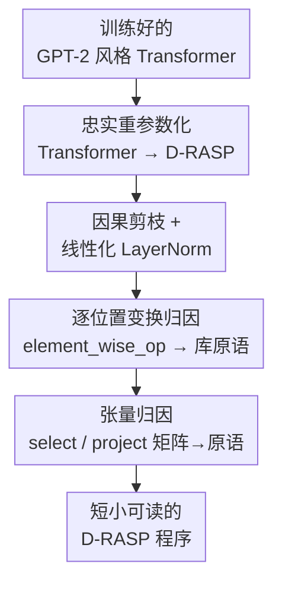

# Discovering Interpretable Algorithms by Decompiling Transformers to RASP

**会议**: ICML2026  
**arXiv**: [2602.08857](https://arxiv.org/abs/2602.08857)  
**代码**: https://github.com/lacoco-lab/decompiling_transformers  
**领域**: 可解释性 / 机制可解释性  
**关键词**: RASP, 反编译, 因果干预, 长度泛化, Transformer 机制

## 一句话总结
本文提出一套「反编译」流水线，先把训练好的 GPT-2 风格 Transformer **忠实地**改写成一个等价的 RASP 程序（D-RASP），再用因果干预把它剪枝成一段**短小可读的符号算法**；实验表明能从「会长度泛化」的小模型里自动恢复出诸如直方图取众数、归纳头复制、括号计数这类已知算法，给出了「Transformer 内部确实实现了简单 RASP 程序」迄今最直接的证据。

## 研究背景与动机

**领域现状**：近年理论工作（Weiss et al. 的 RASP 语言及其方言）证明 Transformer 的计算可以被 RASP 家族语言模拟，并据此提出一个核心命题——「短程序蕴含稳健泛化」：如果一个任务存在简短的 RASP 程序，那么在短输入上训练的 Transformer 就能长度泛化到更长输入（RASP 长度泛化猜想）。

**现有痛点**：理论只证明了 Transformer **能够**实现 RASP 式计算（存在性、可表达性），却没证明**训练出来的模型真的以人类可读的方式这么做**。已有的可解释性手段（如 circuit discovery）能找到支撑某种行为的稀疏计算图，但产出的是「电路」而非「程序」：电路通常绑定到特定输入长度和输入模板，无法直接给出一个**对所有长度统一适用**的算法。Lindner et al.（2023）做了 RASP→Transformer 的正向编译，但**反向问题**（从训练好的 Transformer 恢复出紧凑符号程序）一直是开放的。

**核心矛盾**：长度泛化猜想最想验证的恰恰是这个缺口——如果长度泛化的模型之所以成功，是因为它内部实现了某段短 RASP 程序，那我们就应该能**把这段程序提取出来读一读**。可表达性证明给出的「天然」翻译程序规模随深度**指数膨胀**（残差流里路径太多），根本没法读。

**本文目标**：给出一个通用方法，从训练好的 Transformer 中抽取出真正可读的 RASP 式算法，并验证「长度泛化 ⇔ 内部存在简单程序」这一关联。

**切入角度**：把可解释性问题重构成一个**程序反编译**问题——先无损翻译成程序（保证行为完全一致），再用因果干预找到一个**最小充分子程序**。

**核心 idea**：reparameterize-and-simplify（先忠实改写、再化简）：定义一个其原语镜像 Transformer 计算、但中间变量落在 token / position 这类**可解释基**上的方言 D-RASP，先把模型无损翻译过去，再剪枝替换成库里的简单原语。

## 方法详解

### 整体框架
方法接收一个带绝对位置编码的 GPT-2 风格 Transformer（视为把长度 $N$ 的输入序列映射到下一 token logits 的保长函数），输出一段短小可读的 D-RASP 程序，且该程序与原模型在所有训练有信号的位置上**预测一致**。整条流水线分两步：Step 1 把 Transformer **忠实翻译**成一个行为完全等价（但指数级庞大）的 D-RASP 程序；Step 2 用因果干预对这个庞大程序**剪枝 + 化简**，在保持「匹配准确率（match accuracy，与原模型预测一致的输入占比）≥ 90%」的前提下，把它压成几行可读代码。

D-RASP 本身是 RASP 的一个方言：以 `select`（选择子，捕获自注意力）、`aggregate`（聚合，对应注意力加权求和，用 softmax 归一以贴合 Transformer）、`element_wise_op`（逐位置算子，捕获 MLP）、`project`（投影到下一 token logits）四类原语为核心。关键在于它的变量落在**可解释维度**上：程序自带两个初始变量 `token`（token 的 one-hot，维度 $|\Sigma|$）和 `pos`（位置的 one-hot，维度 $T$），后续变量都由算子产生，因此每个中间变量都能按「哪个 token / 哪个位置」读出来。

### 关键设计

**1. D-RASP 方言：让中间变量天生可读，并与 C-RASP 对齐**

痛点是原始 RASP 方言与 Transformer 的语义并不完全对齐，且变量在抽象空间里无从解释。D-RASP 用 softmax 做聚合（与 Transformer 一致），从而既支持非均匀注意力、也支持对无界位置数的注意力；同时强制 `token`、`pos` 这类初始变量落在 one-hot 基上，使任何由它们派生的变量都能按 token / 位置维度直接读图。聚合算子的语义为

$$v(i)=\sum_{j\le i} a_{i,j}\,w(j),\qquad a_{i,s}=\frac{\exp\big(\sum_p \alpha_p(i,s)\big)}{\sum_{s'\le i}\exp\big(\sum_p \alpha_p(i,s')\big)}$$

而选择子打分 $\alpha(i,s)=v_q(i)^\top A\,v_k(s)$。作者进一步证明（Theorem 2.1）：若禁用 `pos`、对张量参数加有理性约束、并对算子输出做 $p$-bit 精度舍入（这在真实硬件上本就发生），则 D-RASP 的一个片段与 **C-RASP 严格等价**——而 C-RASP 正是被大量工作关联到「长度泛化」的方言。这就把「可读程序」和「长度泛化理论」接到了同一根线上。

**2. 忠实重参数化（Step 1）：把残差流逐层展开成程序变量**

痛点是要在不改变任何输入-输出行为的前提下，把连续的张量计算翻译成符号程序。本文依赖一个**线性 LayerNorm 假设（LLNA）**：每个 LayerNorm 可用某常数参数 $\gamma'$ 的线性映射近似替换，$\dfrac{x-\bar x}{\sqrt{\sigma^2(x)+\epsilon}}\gamma+\beta \Rightarrow (x-\bar x)\gamma'+\beta$；该假设对长度泛化的模型经验上成立（也可微调使其成立而几乎不掉点）。在 LLNA 下（Theorem 3.2），GPT-2 风格 Transformer 存在一个定义同一映射、且可由参数显式构造的 D-RASP 程序：输入层写成 $E\,\text{token}+P\,\text{pos}$；每个注意力头按 token/pos 的四种 key-query 组合定义四个选择子 $\alpha_{1,h},\alpha'_{1,h},\alpha''_{1,h},\alpha'''_{1,h}$，聚合出 $v_{\langle\text{pos}\rangle},v_{\langle\text{tok}\rangle}$ 两个变量，头输出可线性恢复为 $V_{1,h}P\,v_{\langle\text{pos}\rangle}+V_{1,h}E\,v_{\langle\text{tok}\rangle}$；逐层归纳即可把任意层残差流写成变量的线性组合 $\sum_i C_i v_i$，LayerNorm 的 $\gamma',\beta$ 被吸收进 `op=` 张量。代价是：这样得到的程序规模随深度**指数膨胀**（残差流路径数爆炸），所以必须有 Step 2。

**3. 因果剪枝 + 逐位置变换归因（Step 2）：把指数级程序压成几行**

这是把「忠实但不可读」变成「可读」的核心。化简分三小步并交织进行：(2.1) **因果剪枝**——对每个 `aggregate` 尝试把选择子替换成 0 或仅 key 的选择子，对每个 `element_wise_op` 尝试删输入（删掉的输入折成常数吸收进 $f$），用可训练门 + KL 散度 + 稀疏惩罚的目标（基于 Li & Janson 2024）删掉因果无关的边；同时为每层训练 $\gamma'$ 并把 LayerNorm 真正线性化为 $L x+\beta$，$L=\big(I-\tfrac{1}{d}\mathbf{1}\mathbf{1}^\top\big)\gamma'$。由于程序指数大，作者用**多阶段展开-剪枝**避免一次性铺开整段程序。(2.2) **逐位置变换归因**——先把多输入 `element_wise_op` 拆成若干单输入算子之和（单输入更易解释），再尝试用库中原语（如恒等 `no-op`、hard-max 等）替换，闭式拟合 $C$ 最小化 $\lVert v-Cw\rVert_F^2$ 并把 $C$ 吸收进下游；若没有原语达标，则用一种「升级版 LogitLens」检查输入输出配对来人工解释。(2.3) **张量归因**——把 `select`/`project` 里的 $A,b$ 矩阵尽量替换成库原语（如「k==q」「k==q-1」恒等/移位单位阵），不行就优化成稀疏整数矩阵。判定标准始终是匹配准确率 ≥ 90%。

### 一个例子：从真实模型恢复「归纳头复制」程序
以「复制无重复字符串」任务（UNIQUE COPY）为例，输入 `BOS 1 3 4 2 SEP`，模型需补全 `1 3 4 2 EOS`。反编译产出的程序只有 6 行：① `s1 = select(q=pos, k=pos, op=(k==q-1))` 用移位单位阵选「前一个位置」；② `a1 = aggregate(s1, token)` 在每个位置存下「前一个 token」的 one-hot；③ `s2 = select(q=token, k=a1, op=(k==q), special=(k==BOS))` 找到「前一个 token 等于当前 token」的位置；④ `a2 = aggregate(s2, token)` 取出该位置的 token 作为「下一个要输出的 token」；⑤⑥ 投影成 logits，并用偏置在无其他输出时偏向 `EOS`。这恰好复现了著名的 **induction head（归纳头）** 模式——`token` 与 `a1` 联合编码了字符串里的 bigram，对无重复串足以完成复制；而整段程序是流水线**全自动**抽取出来的，无需人工搭电路。

## 实验关键数据

### 主实验
在算法与形式语言基准上训练的小型 GPT-2 风格模型（1 层 4 头到 4 层 4 头等）上做反编译，核心结论是「会长度泛化 ⇔ 能恢复出简单程序」。

| 任务 | 恢复出的算法（程序母题） | 对应已知假设 |
|------|--------------------------|--------------|
| MOST FREQUENT（取众数） | 直方图式多数计算（聚合 token 频率→取频率最高者） | cf. Weiss et al. 2021 |
| UNIQUE COPY（无重复复制） | induction head 复制（bigram→检索下一 token） | Olsson 2022 / Zhou 2024 |
| SORT（排序） | 按 token 大小选择再聚合输出 | — |
| Bounded-depth Dyck（有界括号匹配） | 括号计数 | Yao 2021 / Wen 2023 |

### 消融 / 对照

| 模型类别 | 是否满足 LLNA | 反编译是否成功（匹配准确率 ≥ 90%，程序短小可读） |
|----------|----------------|-----------------------------------------------|
| 会长度泛化的模型 | 倾向成立 | 成功——恢复出与理论假设吻合的紧凑程序 |
| 不长度泛化的模型 | 倾向不成立 | 失败——无法压成可读程序 |

### 关键发现
- **长度泛化是「能否反编译」的分水岭**：长度泛化的模型能被压成短程序，且恢复出的算法与机制可解释性文献里的已知母题（直方图、归纳头、括号计数）对得上；不长度泛化的模型则化简失败，提示它们依赖更纠缠、非程序式的机制。
- **匹配准确率 ≥ 90% 是化简的硬约束**：剪枝/替换都以「与原模型预测一致」为前提，因此恢复出的不是事后编出来的故事，而是因果上充分的子程序。
- **D-RASP↔C-RASP 等价（在舍入语义下）**把可读程序直接接到了长度泛化理论上，让「短程序⇒泛化」从猜想侧得到了从模型反向的实证支持。

## 亮点与洞察
- **把可解释性变成「反编译」**：先无损翻译再因果剪枝的两步法，绕开了 circuit discovery「只得到电路、绑死输入长度」的局限——输出是对所有长度统一的算法，而非某长度下的电路。
- **变量住在可解释基上**：D-RASP 强制中间变量落在 token / position one-hot 上，使每个变量都能「读图」，这是「可读」相比一般 RASP 方言的根本来源。
- **LLNA 作为枢纽假设很巧**：它既是无损翻译的技术前提，又恰好在长度泛化的模型上成立，于是「可反编译性」自然成了「是否长度泛化」的代理信号。
- 升级版 LogitLens 的思路可迁移：在归因逐位置算子时，不只看残差流方向，还把残差流之外的下游路径效应一并算进来，避免 LogitLens 经典的「忽略侧路径」偏差。

## 局限与展望
- **架构受限**：方法只针对带绝对位置编码的 GPT-2 风格模型，现代 LLM 常用的 RoPE 等位置编码暂不覆盖。
- **规模受限**：实验是在小模型 + 形式/算法任务的受控设定下完成的，能否扩展到大模型与自然语言任务尚待验证；Step 1 程序指数膨胀，剪枝靠多阶段展开缓解但仍是可扩展性瓶颈。
- **依赖 LLNA**：线性 LayerNorm 假设只是近似（需训练 $\gamma'$ 或微调），对不满足该假设的模型方法会退化；不长度泛化模型「反编译失败」本身也说明覆盖面有边界。
- 展望：把 D-RASP 扩展到相对位置编码、把因果剪枝做得更可扩展，是把这条路线推向真实 LLM 的关键。

## 相关工作与启发
- **vs Circuit Discovery（如 ACDC, Conmy et al. 2023）**：他们找稀疏计算图（电路），绑定特定输入长度与模板；本文找的是跨长度统一的符号程序，且用因果剪枝保证充分性。本文借用了其因果消融工具，但产出物从「电路」升级为「程序」。
- **vs Tracr / Lindner et al. 2023**：他们做 RASP→Transformer 的正向编译（手写程序生成权重）；本文做反向（从权重恢复程序），填补了开放问题。
- **vs C-RASP 长度泛化理论（Yang & Chiang 2024 等）**：他们从理论侧论证「短程序⇒长度泛化」；本文从训练好的模型反向提取程序、并证明 D-RASP 片段与 C-RASP 等价，给该理论补上了实证一环。

## 评分
- 新颖性: ⭐⭐⭐⭐⭐ 首个把训练 Transformer 反编译成可读 RASP 程序的通用方法，填补正向编译的反问题。
- 实验充分度: ⭐⭐⭐⭐ 受控形式任务上证据扎实，但限于小模型，缺自然语言/大模型验证。
- 写作质量: ⭐⭐⭐⭐⭐ 理论（定理）与方法（两步流水线）讲得清晰，配大量程序与可视化。
- 价值: ⭐⭐⭐⭐⭐ 为「长度泛化⇔内部简单程序」给出最直接证据，机制可解释性的重要进展。

<!-- RELATED:START -->

## 相关论文

- [\[ICML 2026\] Discovering Differences in Strategic Behavior Between Humans and LLMs](discovering_differences_in_strategic_behavior_between_humans_and_llms.md)
- [\[ICML 2026\] Discovering Implicit Large Language Model Alignment Objectives](discovering_implicit_large_language_model_alignment_objectives.md)
- [\[CVPR 2025\] Prompt-CAM: Making Vision Transformers Interpretable for Fine-Grained Analysis](../../CVPR2025/interpretability/prompt-cam_making_vision_transformers_interpretable_for_fine-grained_analysis.md)
- [\[ICML 2026\] Cognitive Fatigue in Autoregressive Transformers: Formalization and Measurement](cognitive_fatigue_in_autoregressive_transformers_formalization_and_measurement.md)
- [\[AAAI 2026\] Finding the Translation Switch: Discovering and Exploiting the Task-Initiation Features in LLMs](../../AAAI2026/interpretability/finding_the_translation_switch_discovering_and_exploiting_the_task-initiation_fe.md)

<!-- RELATED:END -->
