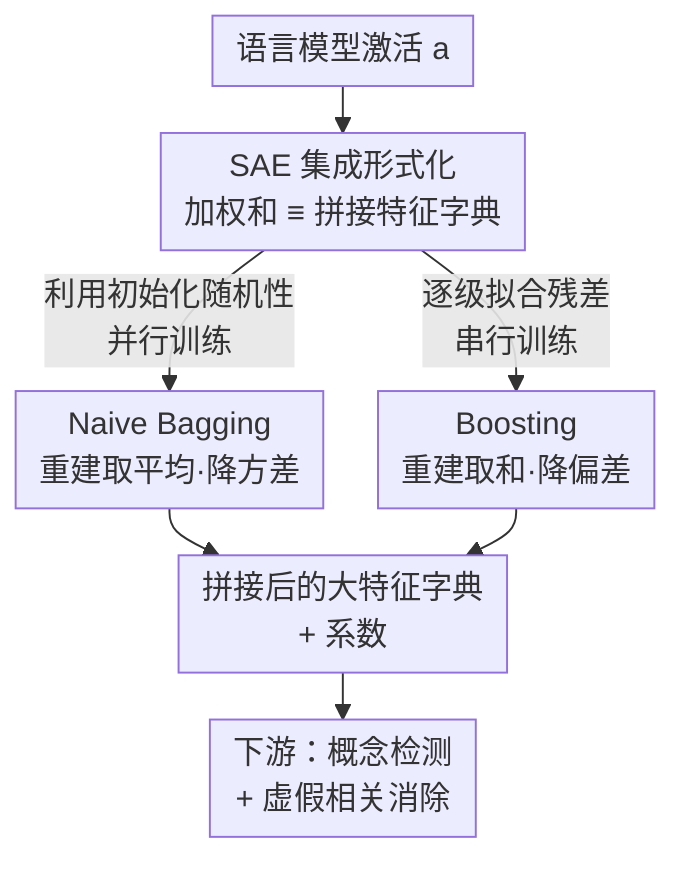

# Ensembling Sparse Autoencoders

**会议**: ICML2026  
**arXiv**: [2505.16077](https://arxiv.org/abs/2505.16077)  
**代码**: 随补充材料提交（论文脚注说明）  
**领域**: 可解释性 / 机制可解释性  
**关键词**: 稀疏自编码器, 集成学习, Bagging, Boosting, 特征可解释性

## 一句话总结
单个稀疏自编码器（SAE）只能捕获激活空间里有限的一部分特征，这篇论文把监督学习里的 bagging 和 boosting 搬到 SAE 上，证明「集成多个 SAE 的重建」在数学上等价于「拼接它们的特征字典」，并用 naive bagging 和 boosting 两种实现同时改善了重建质量、特征稳定性与下游任务表现。

## 研究背景与动机
**领域现状**：SAE 已经成为机制可解释性的主力工具——它把神经网络（尤其是语言模型）某一层的激活分解成一个高维、稀疏、且每个维度往往能对应人类可读概念的特征空间，被广泛用于概念检测、电路分析和行为操控（steering）。实践中，大家通常训练好一个 SAE 就直接拿它的特征去做下游分析。

**现有痛点**：最近的工作发现，同一份激活上训练出来的单个 SAE 只能「捞」到激活空间里全部可提取特征的一个有限子集（Fel et al. 2025；Paulo & Belrose 2025）。换句话说，哪怕架构和超参完全一样，仅仅初始权重不同，两个 SAE 学到的特征都会不一样、且都不完整。这意味着你选哪个 SAE 在某种程度上是「碰运气」，特征也不稳定。

**核心矛盾**：要捞更多特征，一个自然的想法是直接把 SAE 做大（扩大字典维度 $k$）。但论文后面的实验显示，更大的 SAE 虽然单次重建可能更好，特征**稳定性**却很差——大 SAE 在多次重训之间学到的特征相似度往往不到小 SAE 集成的一半，这对需要「可靠特征」的可解释性应用是致命的。于是出现了「重建质量 ↔ 特征稳定性」的权衡。

**本文目标**：能不能像监督学习里集成多个弱模型那样，把多个 SAE 组合起来，同时拿到更好的重建、更稳的特征、以及更强的下游可用性？

**切入角度**：监督学习里 bagging 利用「随机性带来的模型差异」降方差，boosting 利用「不同优化目标带来的差异」降偏差。SAE 之间天然存在这两类差异（初始化随机性 + 可以让后续 SAE 专门拟合残差），所以集成思路在 SAE 上是有理论依据的。

**核心 idea**：先把「SAE 集成」形式化，证明集成多个 SAE 的输出（激活空间里的加权和）等价于把它们的解码矩阵（特征字典）和特征系数**拼接**起来；再用 naive bagging（并行训练、平均重建）和 boosting（串行训练、逐级拟合残差）两种元算法去实例化它。

## 方法详解

### 整体框架
一个 SAE 是形如 $g(\mathbf{a};\theta)=\mathbf{W}_{\text{dec}}\,h(\mathbf{W}_{\text{enc}}\mathbf{a}+\mathbf{b}_{\text{enc}})+\mathbf{b}_{\text{dec}}$ 的自编码器，把 $d$ 维激活 $\mathbf{a}$ 编码成 $k$ 维稀疏系数（$k>d$）再解码回去。关键观察是：解码矩阵 $\mathbf{W}_{\text{dec}}$ 的每一列就是一个「特征」$\mathbf{f}_i$，于是重建可以写成特征的稀疏线性组合 $g(\mathbf{a};\theta)=\sum_{i=1}^{k}\mathbf{c}_i\mathbf{f}_i+\mathbf{b}_{\text{dec}}$。

论文的整体逻辑分三步：（1）**形式化**——把 $J$ 个 SAE 的集成定义为激活空间里的加权和 $\sum_j \alpha^{(j)}g(\cdot;\theta^{(j)})$，并证明这等价于拼接所有 SAE 的特征字典与系数（Proposition 3.1），从而集成体本身仍是一个「更大的 SAE」，可以无缝接入既有的下游分析流程；（2）**两种实例化**——naive bagging 让多个 SAE 只在初始化上不同、并行训练、重建取平均，目标是**降方差**换稳定性；boosting 让每个后续 SAE 专门去拟合前面所有 SAE 留下的**残差**、串行训练、重建取和，目标是**降偏差**换重建精度；（3）**评估**——用内在指标（重建、连通性、稳定性）+ 自动可解释性 + 两个下游任务验证。

### 关键设计

**1. SAE 集成的形式化：把「集成重建」等价转化为「拼接特征字典」**

集成最朴素的写法是对 $J$ 个 SAE 的输出做加权和 $\sum_{j=1}^{J}\alpha^{(j)}g(\cdot;\theta^{(j)})$。但 SAE 的价值不只在重建，更在于它产出的**特征**和**系数**要能拿去做下游分析，单纯写成输出加权和并没有告诉你集成体的「特征字典」长什么样。论文的 Proposition 3.1 给出了关键桥梁：因为每个 SAE 的输出都是其特征的线性组合，集成它们的重建恰好等价于把所有解码矩阵横向拼接 $\mathbf{W}_{\text{dec}}=[\mathbf{W}_{\text{dec}}^{(1)}\cdots\mathbf{W}_{\text{dec}}^{(J)}]\in\mathbb{R}^{d\times kJ}$、把系数纵向拼接并乘上集成权重 $\mathbf{c}=[\alpha^{(1)}\mathbf{c}^{(1)};\cdots;\alpha^{(J)}\mathbf{c}^{(J)}]$，偏置取加权和。重建写成 $\hat{\mathbf{a}}=\sum_{i'=1}^{kJ}\mathbf{c}_{i'}\mathbf{f}_{i'}+\mathbf{b}_{\text{dec}}$。

这一步的意义在于：集成体在数学上就是一个有 $kJ$ 个特征的「大 SAE」，所有为单个 SAE 设计的下游工具（概念检测、电路分析、steering）都能原封不动地用。论文还指出（Remark 3.2），由于特征向量常被约束成单位范数以解释为「方向」，集成权重 $\alpha^{(j)}$ 应该折进系数 $\mathbf{c}$ 而非字典，以保持特征范数不变。

**2. Naive Bagging：用初始化随机性换特征稳定性**

针对「单个 SAE 特征不稳定、重训一次就变样」的痛点，naive bagging 训练 $J$ 个**只有初始权重不同**、其余架构超参完全一致的 SAE，并行训练后把重建取平均：

$$g_{\text{NB}}(\mathbf{a};\{\theta^{(j)}\})=\frac{1}{J}\sum_{j=1}^{J}g(\mathbf{a};\theta^{(j)})$$

这里特意叫「naive」，是因为它**不做经典 bagging 的数据自助采样（bootstrap）**——一是要隔离「初始化差异」这一单一变量，二是 SAE 常在数亿乃至数十亿 token 上训练，对这么大的数据做自助采样在内存/存储上不现实。均匀权重 $\alpha^{(j)}=1/J$ 的选择对应偏差-方差分解里的「降方差」视角（附录 Proposition A.2）：多个独立初始化的 SAE 各自捕到的特征子集不同但都不完整，平均它们能压低重建的方差项，从而让「跨多次重训仍能找到相似特征」的稳定性大幅提升。代价是单纯重建精度反而可能不如同等规模的扩大 SAE，这正是论文反复强调的「稳定性-重建权衡」。

**3. Boosting：让后续 SAE 专攻残差，换重建精度**

naive bagging 的隐患是不同初始化的 SAE 仍会学到大量**重叠**的特征，集成里有冗余。boosting 直接针对这一点：从一个初始 SAE 出发，第 $j$ 个 SAE 不再去拟合原始激活，而是去重建前 $j-1$ 个 SAE 留下的**残差**。第 $j$ 个 SAE 的输入定义为

$$\mathbf{a}^{(n,j)}=\mathbf{a}^{(n)}-\sum_{\ell=1}^{j-1}g(\mathbf{a}^{(n,\ell)};\theta^{(\ell)})\quad(j>1)$$

最终集成重建是所有 SAE 重建之和 $g_{\text{Boost}}=\sum_{j=1}^{J}g(\mathbf{a}^{(*,j)};\theta^{(j)})$。直觉上，每个新 SAE 被迫去捕前面没捕到的成分，特征冗余大幅下降；理论上对应「降偏差」视角（附录 Proposition A.8 给出偏差项的界）。论文特意区分了它与 MP-SAE：MP-SAE 虽然也用残差迭代，但所有迭代**共享同一套特征**，因此不是集成；boosting 的每一轮都学一套**独立**特征。代价是 boosting 必须串行训练、推理时也要串行前向，且后期 SAE 倾向学很具体、很低层的特征，导致稳定性略逊于 bagging。

### 损失函数 / 训练策略
单个 SAE 的训练目标是重建损失 + 稀疏惩罚 $\mathcal{L}_{\text{SAE}}=\frac{1}{N}\sum_n[\|\mathbf{a}^{(n)}-g(\mathbf{a}^{(n)};\theta)\|_2^2+\lambda\|\mathbf{c}^{(n)}\|_p]$，其中 TopK SAE 因为靠激活函数强制稀疏，$\lambda=0$。Boosting 在每一轮沿用相同的 $\lambda,p$，只是把输入换成上一轮的残差（公式同上）。所有 SAE 用 Adam 训练，在三种语言模型上分别采用 ReLU / TopK / JumpReLU 架构，超参扫描后选「解释方差最接近 90%」的配置，保证被集成的基 SAE 本身就实用。

## 实验关键数据

### 主实验
在三种语言模型（GELU-1L、Pythia-160M、Gemma 2-2B）上各集成 8 个 SAE（多数指标到 8 个就趋于饱和），与「特征数相同的扩大 SAE（Expanded SAE）」对比四个内在指标。解释方差（EV）、连通性（Connectivity）越高越好，MSE 越低越好，稳定性（Stability）越高越好。

| 模型 | 方法 | 解释方差↑ | MSE↓ | 连通性↑ | 稳定性↑ |
|------|------|----------|------|--------|--------|
| GELU-1L | Expanded SAE | 0.946 | 17.893 | 0.959 | 0.372 |
| GELU-1L | Naive Bagging | 0.895 | 35.147 | 0.307 | **0.745** |
| GELU-1L | Boosting | **0.961** | **12.542** | 0.945 | 0.707 |
| Pythia-160M | Expanded SAE | 0.987 | 4.387 | 0.978 | 0.204 |
| Pythia-160M | Naive Bagging | 0.929 | 24.704 | 0.912 | **0.731** |
| Pythia-160M | Boosting | **0.998** | **0.845** | **0.986** | 0.680 |
| Gemma 2-2B | Expanded SAE | 0.948 | 472.330 | 0.993 | 0.268 |
| Gemma 2-2B | Naive Bagging | 0.974 | 234.128 | 0.769 | 0.633 |
| Gemma 2-2B | Boosting | **0.995** | **46.538** | 0.989 | **0.583** |

可以看到：**boosting 在重建（EV/MSE）上几乎全面碾压扩大 SAE**，Gemma 2-2B 上 MSE 从 472 降到 47，且稳定性也更高；**naive bagging 牺牲重建换来最高的稳定性**，GELU-1L 上稳定性从 0.372 翻到 0.745。这说明集成的增益**不是单纯靠特征更多**——扩大 SAE 特征数一样多，但稳定性常不到集成的一半，意味着大 SAE 的特征不可靠。

### 自动可解释性与下游任务
一个反直觉的担忧是：集成把所有 SAE 的系数拼接起来，整体 $L_0$（聚合稀疏度）变大，会不会损害可解释性？用 AutoInterp 自动打分（语言模型给特征写解释并评估），结论是**不会**：

| 方法 | GELU-1L | Pythia-160M | Gemma 2-2B |
|------|---------|-------------|-----------|
| Expanded SAE | 0.714 | 0.852 | 0.805 |
| Naive Bagging | 0.738 | 0.857 | 0.799 |
| Boosting | **0.863** | 0.852 | **0.814** |

集成 SAE 的 AutoInterp 分数不低于扩大 SAE，尽管聚合 $L_0$ 更大——说明「聚合稀疏度」不是可解释性的可靠代理。下游两个任务上：**概念检测**（Amazon 情感 / GitHub 代码语言 / AG News 主题 / 欧洲议会语言）里 naive bagging 在「每个概念只映射到一个特征」时表现更好，而 boosting 在「每个概念允许用多个特征（top-2 起）」时反超；**虚假相关消除**任务也验证集成优于单个 SAE。

### 关键发现
- **boosting 主攻重建、bagging 主攻稳定性**，二者分别对应偏差/方差两条理论线，实验完美吻合：boosting 在除稳定性外的所有指标上胜过 bagging。
- **集成的收益不来自「特征更多」**：与特征数相同的扩大 SAE 比，集成仍在稳定性上压倒性领先，说明大 SAE 特征不可靠。
- **聚合 $L_0$ 不是可解释性的好代理**：拼接后稀疏度变差，AutoInterp 反而持平或更好。
- **boosting 的后期 SAE 学更具体的特征**：例如 Pythia-160M 上第一个 SAE 学「编程概念」泛化特征，最后一个 SAE 学「tokens / syntax error / Java」这类具体词。

## 亮点与洞察
- **一个简洁而有用的等价定理**：把「集成 SAE 重建」证明成「拼接特征字典」，让集成体直接复用所有现成的 SAE 分析工具，是把集成思想引入可解释性的关键粘合剂——没有它，集成就只是 ad-hoc 的求平均。
- **把偏差-方差分解讲透了 bagging 与 boosting 的分工**：bagging 降方差→稳定性，boosting 降偏差→重建精度，并且实验各项指标几乎一一对应理论预测，难得地做到了「理论说什么、实验就是什么」。
- **「稳定性也是一等公民」的视角**：作者反复强调可解释性应用需要**可靠**特征，而单纯把 SAE 做大会牺牲稳定性，这个 trade-off 对实践者选型很有指导价值。
- 元算法属性强：集成是 meta-algorithm，与任意 SAE 架构（ReLU/TopK/JumpReLU）和超参兼容，可即插即用。

## 局限与展望
- **boosting 的串行代价**：训练和推理都必须串行跑 $J$ 个 SAE，相比并行的 bagging 在大模型上开销更高；论文把训练/推理时间放在附录，正文未深入讨论实际成本。
- **只研究「同架构同超参」的集成**：论文明确把范围限定在仅初始化不同的 SAE，未探索跨架构/跨超参（类 stacking）的集成，而那可能带来更丰富的特征多样性。
- **下游任务结论需分情形看**：bagging 与 boosting 谁更好取决于「概念映射到几个特征」，没有一个一刀切的赢家，使用时需要按任务选择。
- **集成规模选择偏经验**：选 8 个 SAE 是基于「指标趋于饱和」的观察，缺少更系统的规模-收益分析。

## 相关工作与启发
- **vs Switch SAE（Mudide et al. 2024）**：Switch SAE 联合训练多个专家 SAE 但推理时只**选一个**专家（为了省算力）；本文的集成是多个 SAE 联合训练且**联合使用**，目标是更全的特征覆盖而非效率。
- **vs SAE Boost（Koriagin et al. 2025）**：SAE Boost 也用残差思路，但只做**一次**残差修正以适配域；本文的 boosting 是可迭代多轮的通用 boosting，每轮学独立特征。
- **vs MP-SAE（Costa et al. 2025）**：MP-SAE 用匹配追踪做多轮残差，但所有迭代**共享同一套特征**，因此本质不是集成；本文 boosting 每轮学一套独立特征，是真正的集成。
- **vs 经典监督集成（Breiman；Friedman；Chen & Guestrin）**：本文把 bagging/boosting 从有监督预测搬到无监督的激活分解，并补上「集成 ≡ 拼接字典」这块缺失的理论。

## 评分
- 新颖性: ⭐⭐⭐⭐ 把成熟的集成思想首次系统、带理论地引入 SAE 可解释性，等价定理是亮点。
- 实验充分度: ⭐⭐⭐⭐ 覆盖三种模型/三种架构、四个内在指标 + AutoInterp + 两个下游任务，理论与实验对应紧密。
- 写作质量: ⭐⭐⭐⭐ 形式化清晰、偏差-方差视角讲得透，部分细节（成本/规模选择）压在附录。
- 价值: ⭐⭐⭐⭐ 给 SAE 实践者一个即插即用、可靠提升稳定性与重建的元方法，实用性强。

<!-- RELATED:START -->

## 相关论文

- [\[ICML 2026\] Sparse Autoencoders are Topic Models](sparse_autoencoders_are_topic_models.md)
- [\[ICML 2026\] On the Relationship Between Activation Outliers and Feature Death in Sparse Autoencoders](on_the_relationship_between_activation_outliers_and_feature_death_in_sparse_auto.md)
- [\[ICML 2026\] PolySAE: Modeling Feature Interactions in Sparse Autoencoders via Polynomial Decoding](polysae_modeling_feature_interactions_in_sparse_autoencoders_via_polynomial_deco.md)
- [\[ICLR 2026\] Toward Faithful Retrieval-Augmented Generation with Sparse Autoencoders](../../ICLR2026/interpretability/toward_faithful_retrieval-augmented_generation_with_sparse_autoencoders.md)
- [\[ICLR 2026\] Temporal Sparse Autoencoders: Leveraging the Sequential Nature of Language for Interpretability](../../ICLR2026/interpretability/temporal_sparse_autoencoders_leveraging_the_sequential_nature_of_language_for_in.md)

<!-- RELATED:END -->
