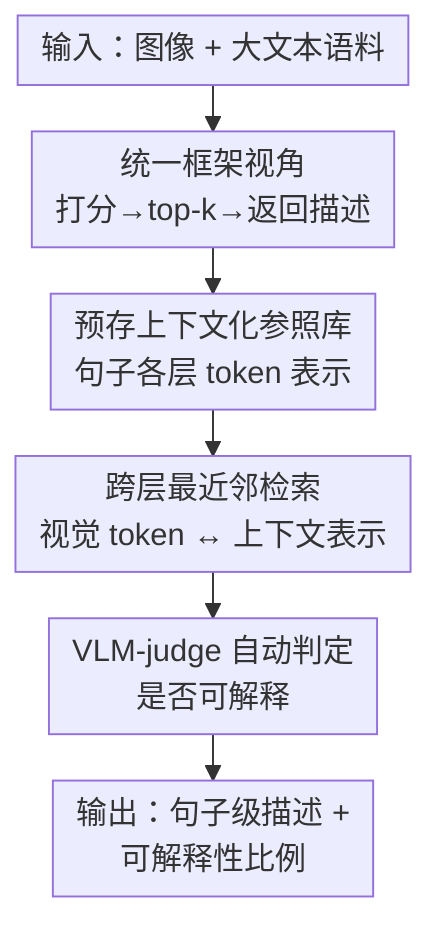

# LatentLens: Revealing Highly Interpretable Visual Tokens in LLMs

**会议**: ICML 2026  
**arXiv**: [2602.00462](https://arxiv.org/abs/2602.00462)  
**代码**: 有（论文提供 Demo 与 pip 包）  
**领域**: 可解释性 / 多模态VLM  
**关键词**: 视觉 token, 可解释性, VLM, 上下文化表示, 最近邻检索

## 一句话总结
本文提出 LatentLens——一种无需训练的可解释性方法，用大语料库的**上下文化文本 token 表示**作为参照、对 VLM 中每层视觉 token 做最近邻检索并返回句子级描述，证明此前常用的 LogitLens/EmbeddingLens 严重低估了视觉 token 的可解释性（平均 68% vs 24%/32% 可解释），并揭示出"中层跃迁"现象。

## 研究背景与动机
**领域现状**：把 LLM 改造成 VLM 可以非常简单——只需训练一个浅层 MLP（甚至线性层），把视觉编码器输出的图像表示投影到冻结 LLM 的嵌入空间，拼接进文本 token 序列即可。这种"冻结 LLM 也能处理非语言输入"的成功引出一个根本问题：**为什么 LLM 这么容易适配其他模态？**

**现有痛点**：一种流行假说是 LLM 是"通用计算引擎"、视觉与语言表示会收敛到共享结构。但这些假说**无法解释视觉表示在 LLM 内部如何被整合**——视觉 token 在 LLM 处理时，其表示到底对不对应语义上有意义的语言？现有无需训练的探查方法给出了矛盾甚至否定的答案：EmbeddingLens（比对输入嵌入矩阵）和 LogitLens（投影到输出反嵌入矩阵得词表分布）都暗示视觉 token 很少可解释，训练类方法（SAE、监督探针）则各执一词，整体上"视觉 token 是否可解释"悬而未决。

**核心矛盾**：作者把前人方法统一到同一框架后发现两个共同缺陷——(1) 描述集被限死在模型词表 $V$ 内，只能返回（子词）token；(2) 不同层的潜表示 $h^{(\ell)}_i$ 总是被拿去和**同一组**参照向量（输入或输出嵌入）比较，但输入/输出嵌入空间未必是最自然的比较空间。LogitLens 在靠近输出的后层才好用、且跨模型可靠性差，正是这个问题的体现。

**切入角度**：作者的关键洞察是——视觉 token 表示最自然的比较对象，**不是 LLM 的输入/输出嵌入矩阵，而是其他上下文化的 LLM 表示**，即"某个句子语境中的某个 token"。而且把描述限制在单个子词上没必要，用句子语料能提供语义更丰富的描述。

**核心 idea**：用"句子语境中 token 的中间层表示"构成参照池，对视觉 token 做跨层最近邻检索——用对的"镜头"去看，视觉 token 其实高度可解释。

## 方法详解
LatentLens 是一个无需训练、可作用于 LLM 任意层、返回句子级描述的可解释性方法。核心是把"潜表示 → 自然语言描述"这件事，从"比对静态嵌入矩阵"换成"在海量上下文化表示里做最近邻检索"。

### 整体框架
方法分三步：先用一个大语料库把每个句子喂进 LLM、**预存**所有 token 在多层的上下文化表示作为参照库（一次性成本）；再从 VLM 各层抽取视觉 token 的潜表示；最后用余弦相似度在参照库里检索 top-k 最近邻，把它们对应的句子作为该视觉 token 的描述。可解释性由一个 VLM-judge（GPT-5）自动判定。

### 关键设计

**1. 统一视角：把现有 lens 都化归为"打分→选 top-k→返回描述"**

针对"前人方法各说各话、缺陷不明"的问题，作者先建一个统一框架：给定候选描述集 $C$，每个描述 $d_j$ 关联一个向量 $r_j$，把潜表示 $h^{(\ell)}_i$ 映射到描述只需三步——对每个 $r_j$ 算相似度 $s_j = f(h^{(\ell)}_i, r_j)$、取 $\arg\text{top-}k$、返回对应描述。EmbeddingLens 和 LogitLens 都是这个框架的特例：二者的 $C=V$（词表），相似函数分别是与嵌入矩阵 $W_{emb}$ 的余弦相似、与反嵌入矩阵 $W_{unemb}$ 的内积。这个统一视角的价值在于它**让两个共同缺陷一目了然**——描述集困在词表内、且所有层共用同一组参照向量——从而精确定位了改进方向，也为 LatentLens 的设计提供了对照系。

**2. 上下文化参照库：用"句子语境中的 token 表示"取代静态嵌入矩阵**

针对"输入/输出嵌入未必是最自然比较空间"这一痛点，LatentLens 把参照集换成上下文化表示。给定句子语料 $C$ 和有 $L$ 层的 LLM $M$，对每个句子 $d_j$ 用 $M$ 编码、存下每个 token 在位置 $t$、每层 $\ell$ 的上下文化表示 $r^{(\ell)}_{j,t}$，构成参照库 $R$。要分析层 $\ell'$ 的视觉 token $h^{(\ell')}_i$，就计算它与 $R$ 中所有 $r^{(\ell)}_{j,t}$ 的余弦相似、取 top-k、返回对应句子作描述。与前人的本质区别有二：描述不再是孤立子词而是**整句**（如视觉 token"建筑"命中的是"stone tower with gold clocks"里的 *clocks*），且 $\ell$ 与 $\ell'$ 可不相等——某层视觉 token 的最近邻可来自**另一层**的文本表示，这正是后面"中层跃迁"得以被观测的前提。实现上语料用 299 万条 Visual Genome 标注，存 $\ell\in\{1,2,4,8,16,24,L\text{-}2,L\text{-}1\}$ 八层表示，单 backbone 编码约 2h GPU、约 26GB 存储（float8），加载后单图检索约 29ms。

**3. VLM-judge 自动评判：把"语义匹配"这件主观事交给可验证的裁判**

针对"视觉 token 的描述是否真的语义匹配图像 patch"难以人工大规模判定的问题，作者用 GPT-5 当裁判：给它一张带红框标出目标视觉 token 区域（外加周围 8 个视觉 token）的图，以及某 lens 返回的 top-5 描述，让它判定描述是否可解释，并归类为 concrete（直接可见）、abstract（概念相关）、global（出现在图中别处）。**一个视觉 token 只要 top-5 描述里至少一条被判可解释，就算可解释**。为公平起见，即便 LatentLens 能给整句，喂给裁判时也只给 top-5 对应的词（与另两个 lens 一致），这反而可能低估 LatentLens。作者用 1020 个实例做人工校验，裁判与人类一致性达 Cohen's $\kappa=0.68$（实质性一致）。这一设计让"可解释性"从模糊概念变成可复现、可比较的量化指标。

### 损失函数 / 训练策略
LatentLens 本身**无需训练**。被解释的 VLM 在受控实验里按 Molmo 配方训练：投影器 proj 是 3 层 MLP，视觉编码器与 LLM 冻结，仅训 proj，用 PixMo-Cap 数据集（平均每条 167 词、9 句）跨熵损失训练 12K 步、有效 batch size 8。

## 实验关键数据

### 主实验
受控实验跨 3 个 LLM（OLMo-7B、Qwen2-7B、LLaMA3-8B）× 3 个视觉编码器（CLIP-ViT-L/14、DINOv2-L、SigLIP）共 9 种组合，随机采 100 图各 100 patch，用 VLM-judge 评判逐层可解释性。

| 方法 | 平均可解释 token 比例 | 特点 |
|------|----------------------|------|
| LogitLens | 24% | 早层极低，仅靠近输出层才升高（OLMo 后层 60–80%） |
| EmbeddingLens | 32% | 强烈依赖模型：OLMo 系 34–62%，Qwen2 系 <20% |
| **LatentLens（本文）** | **68%** | 跨所有模型、所有层稳定在 60–85% |

在 6 个现成 VLM（Molmo-7B-D、Molmo-72B、LLaVA-1.5-7B、LLaVA-NeXT-34B、Qwen2-VL-7B、Qwen2.5-VL-32B）上结论同样成立——LatentLens 在全部 6 个模型上可解释性最高，且越接近受控设置（OLMo backbone）越好。

| 现成 VLM | LatentLens 平均可解释比例 |
|----------|--------------------------|
| Molmo-7B-D | 86% |
| Molmo-72B | 78% |
| Qwen2-VL-7B / LLaVA-1.5-7B | 55–62% |
| Qwen2.5-VL-32B / LLaVA-NeXT-34B | 33–35%（仍显著高于基线） |

### 消融实验

| 配置 | 关键结果 | 说明 |
|------|---------|------|
| 完整 LatentLens | 68% 平均可解释 | 句子语料 + 上下文化参照 + 跨层检索 |
| 投影器降为线性 | 无明显变化 | 可解释性不依赖映射的表达力 |
| 用更短标注训练 | 无明显变化 | 结论不绑定特定训练设置 |
| 语料仅用 1% | 可解释性相当 | 存储从约 26GB 降到约 250MB |
| DINOv2（无语言监督）| 三种 lens 下均高可解释 | 视觉表示无需语言预训练也可解释 |

### 关键发现
- **用对镜头是关键**：LogitLens/EmbeddingLens 的低可解释性是方法假象而非事实——换成上下文化参照后，绝大多数视觉 token 在所有层都可解释，前人系统性低估了视觉 token 的可解释性。
- **中层跃迁（Mid-Layer Leap）**：早层（甚至输入层）的视觉 token 表示，其最近邻不是同层文本表示，而是**更后/更中间层**（如第 8、16 层）的上下文化文本表示。这说明学到的投影瞄准的是**语义而非词汇级**表示。作者进一步分析发现视觉 token 表示在各层间变化很小，且无证据表明"流氓维度"主导了余弦相似。
- **DINOv2 的反直觉表现**：完全没有语言监督预训练的 DINOv2，其视觉 token 在三种 lens 下都高度可解释，进一步支持视觉与语言表示存在深层对齐。
- **句子级描述更丰富**：定性看 LatentLens 给出"stone tower with gold clocks"这类完整句子描述，而 LogitLens 常返回子词或下一 token 预测。

## 亮点与洞察
- **统一框架先行**：先把 EmbeddingLens/LogitLens 化归为"打分→top-k→返回描述"的三步范式，再精准点出两个共同缺陷，这种"先统一再突破"的写法让 LatentLens 的动机无可辩驳，是非常值得借鉴的方法论叙事。
- **"参照空间选错了"是核心洞察**：把比较对象从静态嵌入矩阵换成上下文化表示，是一个简单却根本的视角转换——它直接把可解释率从 24% 拉到 68%，提示我们解释潜表示时"拿什么当参照"比"用什么相似度"更要紧。
- **跨层检索揭示中层跃迁**：允许 $\ell\neq\ell'$ 的设计意外解锁了一个新现象（早层视觉 token 对齐到中层文本表示），说明好的探查工具不仅能测量、还能发现机制，这个跨层比较思路可迁移到任何想分析"表示在哪一层成熟"的场景。

## 局限与展望
- **依赖 VLM-judge**：可解释性判定建立在 GPT-5 裁判上，$\kappa=0.68$ 虽属实质性一致但非完美，裁判的偏好可能系统性影响绝对数值；且作者发现裁判会被句子级上下文干扰，被迫只喂词级描述，未能充分利用 LatentLens 句子级描述的全部信息。
- **大模型趋势不一致**：Qwen2.5-VL-32B、LLaVA-NeXT-34B 等更大模型的逐层可解释性明显更低（33–35%）且跨层趋势不稳定，作者自己也将其列为未来工作，方法在大模型上的解释力存疑。
- **一次性成本与存储**：虽证明 1% 语料即可，但每个 backbone 仍需约 2h GPU 编码、建索引约 13h 墙钟时间，换 LLM 就要重建参照库。
- **改进方向**：可探索更鲁棒的裁判（多裁判投票/人类对齐微调）、把句子级描述真正用起来（而非退化为词级比较），以及解释大模型可解释性下降的机制。

## 相关工作与启发
- **vs LogitLens（nostalgebraist 2020）**：它把潜表示乘反嵌入矩阵得词表分布、取 top-k 词，只在靠近输出的后层好用且跨模型可靠性差；LatentLens 用上下文化表示作参照，可作用于任意层并给整句描述。
- **vs EmbeddingLens（Mokady 2021 等）**：它比对输入嵌入矩阵，描述困在词表内、且强烈依赖模型（Qwen2 系 <20%）；LatentLens 描述集是句子语料、跨模型稳定在 60–85%。
- **vs Tuned Lens（Belrose 2023）**：在 LogitLens 解码步上学每层仿射探针，本文实验证明它**并不改善**视觉 token 的可解释性，说明问题不在解码变换而在"参照空间"本身。
- **vs SAE / 监督探针（Cunningham 2023 / Fu 2025）**：这些是训练类方法，结论各执一词；LatentLens 走无需训练、直接利用 LLM 表示空间的路线，部署更轻、结论更一致。

## 评分
- 新颖性: ⭐⭐⭐⭐⭐ "用上下文化表示作参照 + 跨层检索"是简单而根本的视角转换，还顺带发现中层跃迁新现象
- 实验充分度: ⭐⭐⭐⭐⭐ 9 种受控组合 + 6 个现成 VLM + 多项消融（线性投影/短标注/1% 语料）+ 人类校验，覆盖全面
- 写作质量: ⭐⭐⭐⭐⭐ 先统一框架再突破、动机环环相扣，叙事干净有说服力
- 价值: ⭐⭐⭐⭐⭐ 纠正了"视觉 token 不可解释"的领域误判，提供可复用工具与 pip 包，对 VLM 可解释性研究影响直接

<!-- RELATED:START -->

## 相关论文

- [\[ICML 2026\] Position: Stop Anthropomorphizing Intermediate Tokens as Reasoning/Thinking Traces!](position_stop_anthropomorphizing_intermediate_tokens_as_reasoningthinking_traces.md)
- [\[NeurIPS 2025\] TangledFeatures: Robust Feature Selection in Highly Correlated Spaces](../../NeurIPS2025/interpretability/tangledfeatures_robust_feature_selection_in_highly_correlated_spaces.md)
- [\[ICML 2026\] Circuit Fingerprints: How Answer Tokens Encode Their Geometrical Path](circuit_fingerprints_how_answer_tokens_encode_their_geometrical_path.md)
- [\[CVPR 2026\] Where Culture Fades: Revealing the Cultural Gap in Text-to-Image Generation](../../CVPR2026/interpretability/where_culture_fades_revealing_the_cultural_gap_in_text-to-image_generation.md)
- [\[ACL 2026\] IDEA: An Interpretable and Editable Decision-Making Framework for LLMs via Verbal-to-Numeric Calibration](../../ACL2026/interpretability/idea_an_interpretable_and_editable_decision-making_framework_for_llms_via_verbal.md)

<!-- RELATED:END -->
