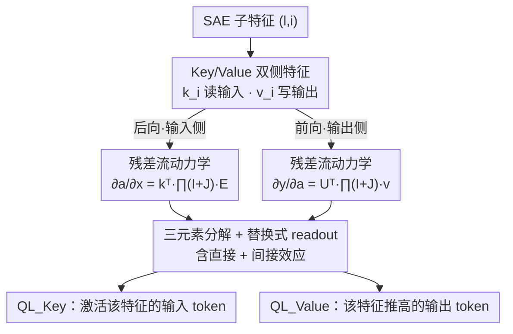

# Query Lens: Interpreting Sparse Key-Value Features with Indirect Effects

**会议**: ICML 2026  
**arXiv**: [2606.07617](https://arxiv.org/abs/2606.07617)  
**代码**: https://github.com/HYU-NLP/query-lens  
**领域**: 机制可解释性 / 稀疏自编码器  
**关键词**: 稀疏自编码器, Logit Lens, 间接效应, key-value 记忆, 残差流

## 一句话总结
针对 Logit Lens 只看"直接效应"、对大量 SAE 特征解释失败的问题，本文提出 Query Lens：同时利用编码器侧的 key 特征和解码器侧的 value 特征，并把特征经下游模块产生的**间接效应**（残差流雅可比乘积）纳入投影，从而对此前"不可解释"的特征也能给出连贯的输入/输出 token 解释。

## 研究背景与动机

**领域现状**：机制可解释性的核心目标是给 LLM 内部表示（feature）赋予人类可读的语义。稀疏自编码器（SAE）通过过完备字典把残差流激活分解成稀疏组合，得到比单个神经元更"单义"的特征，是当前主流分析对象。解释 SAE 特征有两条路线：一是数据驱动，跑大语料找强激活样本；二是把特征方向用 **Logit Lens** 直接投影到词表空间（$y^l = U^\top h^l_{\text{post}}$），看它推高哪些 token。

**现有痛点**：数据驱动法需要穷举大语料、有时还受隐私限制无法访问数据，且只刻画"什么激活了特征"、说不清特征对生成的因果作用。Logit Lens 虽然免去采样，但有两个硬伤——**完整性**：它只投影解码器侧的 value 特征、解释"特征推高什么输出"，却完全不管"什么输入激活了特征"（编码器侧 key 几乎被忽视）；**忠实性**：很大一部分 SAE 特征（尤其浅层）在 Logit Lens 下呈现弥散或被无意义 token 主导，根本收敛不出连贯概念。

**核心矛盾**：作者指出，一个特征方向被加进残差流后，它对输出分布的影响可分解成**直接效应**（沿残差流直达输出 logits）和**间接效应**（被下游 attention/MLP 模块读取、再反过来改写残差流）。Logit Lens 本质上只保留了直接效应，把间接效应一笔勾销——这正是大量特征"看不懂"的根源。

**核心 idea**：用 key-value 记忆视角把 SAE 拆成 key 特征（输入侧因果）和 value 特征（输出侧因果），并用残差流的一阶线性化把直接+间接效应一起算进投影——即用真实（而非被恒等近似的）stream transition 的切线来解释特征。

## 方法详解

### 整体框架

Query Lens 把一个 SAE 子特征 $(l,i)$ 的因果角色拆到残差流两端来读：往**输入端**回溯看"什么 token 最能激活它"（后向动力学，用 key 特征 $k_i^l$），往**输出端**前推看"激活后它推高什么 token"（前向动力学，用 value 特征 $v_i^l$）。两条路径的共同结构都可因子化成三件事——**特征向量**（写入/读出残差流的局部方向）、**stream transition**（信号如何跨层传输）、**readout**（如何在词表空间表达）。Logit Lens 的失败被归结为：它把 stream transition 简单取成恒等矩阵 $I$，只留直接效应；Query Lens 则把 transition 展开成下游所有残差块的雅可比乘积 $\prod_k (I+J^k)$，间接效应自然包含其中。

### 关键设计

**1. Key 特征 + Value 特征：从输入和输出两侧补全因果刻画**

Logit Lens 只看解码器，等于只回答了"特征推高什么"，丢掉了"什么激活特征"这半边。本文借 Geva 等人的 key-value 记忆视角，把 SAE 重构写成子更新之和：$\hat h_{\text{post}}=\sum_i a_i(h_{\text{post}})\,v_i$，其中激活 $a_i(h_{\text{post}})=f(\langle h_{\text{post}},k_i\rangle)$。这天然给出"注意力式"类比——编码器列向量 $\{k_i\}$ 是 **key 特征**，负责从输入产生稀疏激活；解码器列向量 $\{v_i\}$ 是 **value 特征**，被这些激活加权写回残差流。于是 key 特征对应"哪些输入激活该特征"的输入侧因果，value 特征对应"它推高哪些输出"的输出侧因果，两者合起来才是一个特征完整的因果足迹。

**2. 前向/后向动力学：用雅可比乘积把间接效应算进来**

这是全文的核心。作者对激活做一阶线性化：扰动 value 激活 $a_i^l$ 看输出 logits 怎么变（前向），扰动输入 token $x$ 看激活怎么变（后向）。链式法则给出

$$\frac{\partial y}{\partial a_i^l}=U^\top\Big[\prod_{k=l+1}^{L}(I+J_M^k)(I+J_A^k)\Big]v_i^l,\qquad \frac{\partial a_i^l}{\partial x}=(k_i^l)^\top\Big[\prod_{k=1}^{l}(I+J_M^k)(I+J_A^k)\Big]E,$$

其中 $J_A^k,J_M^k$ 分别是第 $k$ 层 attention/MLP 块对其输入残差的雅可比。关键观察是：把乘积 $\prod_k(I+J^k)$ 展开，恒等项 $I$ 就是 Logit Lens 的直接效应，而每个含 $J$ 的交叉项（如 $J_M^5$）对应"扰动被第 5 层 MLP 消费、再改写后续残差流"的一条间接计算路径。Logit Lens 只保留恒等项，Query Lens 保留全部项，因此能更忠实地把局部读写传输到端点。

**3. 三元素分解 + 替换式 readout：让局部效应在词表空间正确落地**

前/后向动力学被统一因子化成三块：**特征向量**（$\partial h_{\text{post}}^l/\partial a_i^l=v_i^l$ 与 $\partial a_i^l/\partial h_{\text{post}}^l=(k_i^l)^\top$，即字典本身的局部读写方向）、**stream transition**（上面的雅可比乘积）、**readout**（端点的 $U^\top$ 和 $E$）。输出端 readout 直接用反嵌入 $U^\top$；但输入端不能简单用 $E$——目标不是解释 $h_{\text{pre}}^1$ 处的方向本身，而是"把当前 token 换成哪个 token 最能实现这个方向"。为此作者构造**中心化-归一化嵌入** $\widehat E$：先做 $\widetilde E=E-e_x\mathbf 1^\top$（每列 $\tilde e_t=e_t-e_x$ 是"把输入换成 $t$"的嵌入变化），再逐列单位归一化。用 $\widehat E$ 读出，得到的就是"哪个候选 token 替换 $x$ 后最匹配被传输的方向 $\Delta h_{\text{pre}}^1$"。

**4. Query Lens 的两个变体：Key 解释输入、Value 解释输出**

把三元素装配起来，得到两个打分函数。Value 变体把 value 特征经完整 transition 传到输出端、用 $U^\top$ 读出：$s_{\textsc{Value}}=U^\top\big[\prod_{k>l}(I+J^k)\big]v_i^l$，取 top-$k$ token 作为"激活时该特征推高的输出"。Key 变体把 key 特征经完整 transition 传到输入端、用替换式 $\widehat E$ 读出：$s_{\textsc{Key}}^\top=(k_i^l)^\top\big[\prod_{k\le l}(I+J^k)\big]\widehat E$，取 top-$k$ token 作为"最能增大该特征激活的输入"。全程 $k=25$。两个变体共享同一套动力学，只是方向相反、readout 不同，从而把一个特征的输入侧和输出侧因果分别讲清。

### 一个完整示例

以一个浅层 GPT-2 特征为例：在 Logit Lens 下，$\text{LL}_{\textsc{Value}}$ 把 value 特征直接乘 $U^\top$，因为忽略了该特征会被后续多层 MLP/attention 二次消费，投出来的 top-25 token 弥散、看不出概念。换成 $\text{QL}_{\textsc{Value}}$ 后，stream transition 由 $I$ 换成 $\prod_{k>l}(I+J^k)$，间接路径被加回，token 签名收敛成连贯主题；同时 $\text{QL}_{\textsc{Key}}$ 用 $\widehat E$ 回读，告诉你"把当前位置换成哪些词最能点亮这个特征"，输入侧解释也对得上。这就是表 1 中 $\text{QL}_{\textsc{Key}}$ 在 GPT-2 上把 Input 分数从 Logit Lens 的 7.84% 抬到 39.32% 的直观来源。

## 实验关键数据

实验在 4 个模型/SAE 配置上做：GPT-2 Small（OpenAI Top-K SAE, 32K）、Gemma-3-270M、Gemma-3-1B（Gemma Scope 2 JumpReLU, 65K）、Qwen-3-1.7B（Qwen-Scope Top-K, 32K）。每层随机采 100 个特征。用两个指标：**Input 分数 $I(T)$**=方法给出的 top-25 token 中、落在"自然语料里真正强激活该特征的 token 集合 $A$"里的比例；**Output 分数 $O(T)$**=top-25 token 中、落在"clamp 该特征后被 steering 推高最多的 top-25 token 集合 $S$"里的比例。

### 主实验

| 模型 / 指标 | $\text{LL}_{\textsc{Key}}$ | $\text{LL}_{\textsc{Value}}$ | TC$_{a=5}$ | $\text{QL}_{\textsc{Key}}$ | $\text{QL}_{\textsc{Value}}$ |
|---|---|---|---|---|---|
| GPT-2 · Input(%) | 7.84 | 11.74 | 31.47 | **39.32** | 26.43 |
| GPT-2 · Output(%) | 4.32 | 12.57 | 13.11 | 1.97 | **15.24** |
| Gemma-3-1B · Input(%) | 1.74 | 1.03 | 9.25 | **14.14** | 8.61 |
| Gemma-3-1B · Output(%) | 3.25 | 7.84 | 8.09 | 1.45 | **9.26** |
| Qwen-3-1.7B · Input(%) | 1.91 | 3.56 | 14.45 | **21.69** | 11.65 |
| Qwen-3-1.7B · Output(%) | 4.43 | 8.31 | 8.77 | 0.55 | **9.36** |

结论很干净：解释**输入侧**时 $\text{QL}_{\textsc{Key}}$ 全面最优（GPT-2 上 39.32% vs Logit Lens 7.84%），解释**输出侧**时 $\text{QL}_{\textsc{Value}}$ 全面最优（始终压过 LL 与 Token Change 等基线）。

### 基线对比与消融

| 基线 | stream transition | 打分方式 | 本质 |
|---|---|---|---|
| $\text{LL}_{\textsc{Key/Value}}$ | 恒等 $I$ | 切线 | 只有直接效应 |
| Tuned Lens (TL) | 每层学习仿射 $(A^l,b^l)$ | 切线 | 线性化近似 transition |
| Zero-Out / Token Change | — | 两点 $y(a^+)-y(a^-)$ 割线 | 有限差分 |
| **Query Lens** | 真实 $\prod_k(I+J^k)$ | 切线 | 直接 + 间接效应 |

### 关键发现
- **间接效应是忠实性的来源**：把 transition 从 $I$ 换成完整雅可比乘积，是 Logit Lens 失败特征"复活"的直接原因；TL 用学习仿射近似 transition，仍不如直接取真实雅可比的切线。
- **方向不能混用**：$\text{QL}_{\textsc{Key}}$ 的 Output 分数极低（GPT-2 仅 1.97%）、$\text{QL}_{\textsc{Value}}$ 的 Input 分数也偏低——这恰恰说明 key/value 各司其职、对应不同因果侧，不是冗余。
- **Subspace Channel Hypothesis**：同一个静态特征向量被不同 Transformer 组件读出后影响差异巨大；作者用低秩线性映射拟合"特征→模块响应"，发现 readout 由**层特定的低维子空间（channel）**中介，即下游模块只从特征的某个低维子空间选择性读取信息。

## 亮点与洞察
- **把"间接效应"形式化为雅可比乘积的展开项**，让 Logit Lens 的局限从"经验现象"变成"丢掉了 $\prod(I+J)$ 里所有非恒等项"的精确陈述——这是最漂亮的一步，可解释性社区一直缺这种把直接/间接拆干净的工具。
- **切线 vs 割线的视角**：把 LL/TL 归为切线、ZO/TC 归为割线、QL 是"真实 transition 的切线"，给一堆零散方法找到了统一坐标系。
- **替换式 readout $\widehat E$** 是个可复用的小 trick：解释输入侧时，关心的不是绝对方向而是"换成哪个 token"，中心化-归一化把它变成对齐问题，值得迁移到任何 input-attribution 场景。
- **Subspace Channel Hypothesis** 给后续工作留了口子：如果每个模块只从层特定子空间读特征，那么 steering/编辑特征时也许只需要操作对应 channel 而非整条向量。

## 局限与展望
- **一阶线性化的有效半径未充分讨论**：雅可比在参考输入处求值，扰动较大时切线近似会失真，论文主要靠经验验证特征确实在某些 token 上激活来规避（脚注），但定量误差界缺失。
- **预激活作为后激活的代理**：后向动力学里用预激活（非线性前的标量）当代理，因为 SAE 常用激活函数不可微；这一替换的合理性放在附录，正文未量化其影响。
- **计算成本**：完整 $\prod_k(I+J^k)$ 是 $d_m\times d_m$ 矩阵跨层连乘，论文称在附录给出高效实现，但大模型/长前缀下的可扩展性仍待验证。
- **Output 分数绝对值偏低**：即使 $\text{QL}_{\textsc{Value}}$ 在多数配置下也只有 9%–15%，说明"特征→生成"的因果解释整体仍困难，离实用 steering 还有距离。

## 相关工作与启发
- **vs Logit Lens**：LL 只投影 value 特征、transition 取恒等、只有直接效应；QL 同时用 key/value、transition 取真实雅可比乘积、含间接效应，因此能解释 LL 下不可解释的特征。
- **vs Tuned Lens**：TL 用每层学习的仿射映射近似 transition，仍是"线性化的简化模型"；QL 直接对真实 transition 取切线，无需训练且更忠实。
- **vs Zero-Out / Token Change**：它们在两个工作点间取有限差分（割线），依赖 clamp 强度选择；QL 是解析切线，不引入 clamp 超参。
- **vs 数据驱动解释（Bills/Bricken/Choi 等）**：数据驱动需穷举语料找激活样本、受隐私限制；QL 直接在参数空间投影，免采样且输出侧有因果接地。

## 评分
- 新颖性: ⭐⭐⭐⭐⭐ 把 Logit Lens 的盲点精确归结为"丢掉间接效应"，并给出 key/value 双侧 + 雅可比展开的统一框架。
- 实验充分度: ⭐⭐⭐⭐ 4 模型 3 家族 + Input/Output 双指标 + 多基线对比，但 Output 绝对分数偏低、缺大模型可扩展性验证。
- 写作质量: ⭐⭐⭐⭐⭐ 残差流动力学的推导清晰，三元素分解把方法讲得很透。
- 价值: ⭐⭐⭐⭐ 给 SAE 特征解释提供了直接可用的更忠实工具，Subspace Channel Hypothesis 还开了新方向。

<!-- RELATED:START -->

## 相关论文

- [\[NeurIPS 2025\] Transformer Key-Value Memories Are Nearly as Interpretable as Sparse Autoencoders](../../NeurIPS2025/interpretability/transformer_key-value_memories_are_nearly_as_interpretable_as_sparse_autoencoder.md)
- [\[ICML 2026\] CorrSteer: Generation-Time LLM Steering via Correlated Sparse Autoencoder Features](corrsteer_generation-time_llm_steering_via_correlated_sparse_autoencoder_feature.md)
- [\[ICLR 2026\] Semantic Regexes: Auto-Interpreting LLM Features with a Structured Language](../../ICLR2026/interpretability/semantic_regexes_auto-interpreting_llm_features_with_a_structured_language_of_re.md)
- [\[ICML 2026\] Query Circuits: Explaining How Language Models Answer User Prompts](query_circuits_explaining_how_language_models_answer_user_prompts.md)
- [\[NeurIPS 2025\] Steering Information Utility in Key-Value Memory for Language Model Post-Training](../../NeurIPS2025/interpretability/steering_information_utility_in_key-value_memory_for_language_model_post-trainin.md)

<!-- RELATED:END -->
