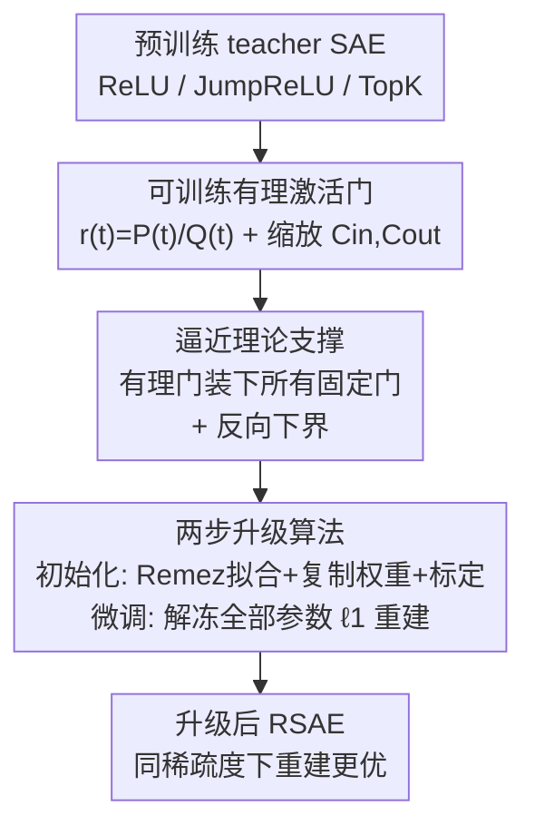

# Rational Sparse Autoencoder

**会议**: ICML2026  
**arXiv**: [2606.14990](https://arxiv.org/abs/2606.14990)  
**代码**: 待确认  
**领域**: 机制可解释性 / 稀疏自编码器  
**关键词**: 稀疏自编码器, 可训练激活, 有理函数, 逼近理论, 机制可解释性

## 一句话总结
把稀疏自编码器（SAE）里写死的 ReLU/JumpReLU/TopK 编码门换成一个**逐元素可训练的有理函数** $r(t)=P(t)/Q(t)$，再配上"复制 teacher 权重 + Remez 拟合系数 → 解冻微调"的两步升级流程，让任意预训练 SAE 在不牺牲稀疏度与可解释性的前提下、只多几个标量参数就把重建保真度严格提升一档。

## 研究背景与动机
**领域现状**：SAE 已经是机制可解释性的标准工具——把 transformer 残差流激活 $\bm{x}\in\mathbb{R}^{d_{\mathrm{in}}}$ 分解成一个过完备字典（$d_{\mathrm{sae}}\gg d_{\mathrm{in}}$）上稀疏的单义特征方向。所有主流 SAE 共用同一个"仿射预激活层 + 稀疏激活块"的浅层编码器骨架，区别只在编码器激活 $\phi$ 与稀疏机制 $S$：ReLU SAE 用 $\ell_1$ 软惩罚，TopK SAE 用硬基数约束，JumpReLU SAE 用逐特征可学阈值。

**现有痛点**：这三种激活原语各有公认的病灶。$\ell_1$-ReLU 会让激活特征**幅度缩水**（magnitude shrinkage），还留一大票"死特征"（dead latents）；TopK 用硬 top-$k$ 选择换来精确的 $\ell_0=k$，但**切断了未激活特征的梯度流**，必须靠辅助 revival loss 救场；JumpReLU 插入可学阈值 $\theta_j$，可它的指示门 $H(\bm{h}-\bm{\theta})$ 不可微，反向传播得靠连续松弛代理。

**核心矛盾**：三者都把**某一种特定的稀疏机制硬编码进了模型**——激活函数的形状是固定的函数族，只能靠惩罚系数 / 阈值 / 基数预算去调，没法去适配某个宿主模型残差流真实呈现出来的预激活几何。固定门因此扭曲了"重建 vs 稀疏"的权衡曲线。

**本文目标**：能不能不重新训练、不改线性骨架，只把那个写死的标量门换成一个**表达力更强、还能反过来覆盖所有现有门**的可训练激活，从而在同等稀疏度下拿到更低的重建误差和更少的死特征？

**切入角度**：作者从逼近理论切入——有理函数（多项式之比）在逼近**非光滑函数**上有经典优势，Zolotarev 符号函数能在带间隙的区间上几何收敛地逼近 $\mathrm{sign}(x)$。既然 ReLU/JumpReLU/TopK 门本质都能写成 $\bm{h}\odot\frac{\mathrm{sign}(\cdot)+1}{2}$ 的形式，一个低次有理函数就足以把它们全装进同一个族里。

**核心 idea**：用**可训练有理激活**替换 SAE 的固定门，先在合成数据上用 Remez 把有理系数拟合成"等价于 teacher 门"，复制 teacher 的全部权重后再解冻微调——把固定门当成有理族里的一个特例，然后让它朝着降低重建损失的方向自由偏离。

## 方法详解

### 整体框架
RSAE 保留标准 SAE 骨架（编码器 $\bm{z}=\phi(\bm{W}_{\text{enc}}(\bm{x}-\bm{b}_{\text{dec}})+\bm{b}_{\text{enc}})$、线性解码器 $\hat{\bm{x}}=\bm{W}_{\text{dec}}\bm{z}+\bm{b}_{\text{dec}}$），**只改编码器激活 $\phi$ 一处**。记预激活 $\bm{h}=\bm{W}_{\text{enc}}(\bm{x}-\bm{b}_{\text{dec}})+\bm{b}_{\text{enc}}$，新激活逐元素作用为

$$\phi(\bm{h})=C_{\mathrm{out}}\cdot r_{(\bm{a},\bm{b})}\!\Big(\frac{\bm{h}}{C_{\mathrm{in}}}\Big),\qquad r_{(\bm{a},\bm{b})}(t)=\frac{P(t)}{Q(t)}=\frac{\sum_{i=0}^{p}a_i t^i}{\sum_{j=0}^{q}b_j t^j},\;t\in[-1,1].$$

其中 $C_{\mathrm{in}},C_{\mathrm{out}}>0$ 是可学的输入/输出缩放，作用是把每个特征的预激活分布映进有理函数的设计区间 $[-1,1]$、再把输出映回解码器期望的特征幅度。整条 pipeline 是一个"先用理论证明有理门能装下所有 teacher 门、再用两步算法把任意预训练 SAE 升级过去"的过程：teacher SAE（ReLU/JumpReLU/TopK 之一）→ 初始化（合成数据 Remez 拟合系数 + 复制 teacher 权重 + 标定缩放）→ 微调（解冻全部参数，标准 $\ell_1$ 正则重建目标）→ 升级后的 RSAE。

### 关键设计

**1. 可训练有理激活：用一个低次有理函数装下所有固定 SAE 门**

痛点是 ReLU/JumpReLU/TopK 各自把一种稀疏机制写死，形状不可调。RSAE 把编码门换成有理函数 $r_{(\bm{a},\bm{b})}(t)=P(t)/Q(t)$，系数 $(\bm{a},\bm{b})$ 可训练。直接学分母 $Q$ 会在 $Q\to 0$ 时冒出发散极点，作者沿用 safe-Padé 参数化把分母写成 $Q(t)=1+|\sum_j b_j t^j|$，保证无极点、Lipschitz。关键观察是三种门都能统一成 $\bm{h}\odot\frac{\mathrm{sign}(\cdot)+1}{2}$：ReLU 是 $\mathrm{sign}(\bm{h})$，JumpReLU 是 $\mathrm{sign}(\bm{h}-\bm{\theta})$，TopK（在给定分离阈值 $\tau_k$ 时）是 $\mathrm{sign}(\bm{h}-\tau_k)$。因此只要有理函数能逼近 $\mathrm{sign}$，它就能在同一族内复现全部三种门——固定门成了有理族里的特例，而有理族还有富余的自由度去贴合真实预激活几何。

**2. 逼近理论：正向"有理门很省"，反向"分段仿射门很贵"的表达力不对称**

作者证明这种替换不是经验上的碰运气，而是有表达力不对称撑腰。**正向**（Lemma 1 + Theorem 2–4）：基于 Zolotarev 符号函数，对带间隙集 $E_\delta=[-1,-\delta]\cup[\delta,1]$ 上的 $\mathrm{sign}$，存在大小 $\mathcal{O}(\log(1/\varepsilon)\log(1/\delta))$ 的有理函数逼到 $\varepsilon$ 精度；据此 ReLU 门可用 $\mathcal{O}(\log^2(1/\varepsilon))$、JumpReLU 与 supplied-threshold TopK 门可用 $\mathcal{O}(\log(1/\varepsilon)\log(1/\delta))$ 大小的有理门复现（不连续门需在离跳变 $\delta$ 的紧域上）。**反向**（Theorem 5）：构造一个只需 $\mathcal{O}(1)$ 个有理参数的目标 $\mathcal{R}^\star_\eta(x)=\frac{\eta^2}{x^2+\eta^2}$，任何标量输出的单层 ReLU/JumpReLU/TopK 编码器要逼到 $\varepsilon$ 精度，必须激活 $N=\Omega(\varepsilon^{-1/2})$ 个坐标。两边合起来：有理门能紧凑地装下所有固定门，反过来分段仿射门对简单有理目标却要多项式级的激活坐标——这解释了为什么换门能在同稀疏度下提升保真度。（深层网络上还有一个互补结论：常宽有理网络深度上界 $\mathcal{O}(\log\log(1/\varepsilon)+\log\log(1/\delta))$，分段仿射网络参数下界 $\Omega(\log(1/\varepsilon))$。）

**3. 两步升级算法：把 teacher 当起点，先"初始化对齐"再"解冻微调"**

有了表达力保证，剩下的问题是怎么把一个已有的预训练 SAE 升级过去、而不是从零训。**Step 1 初始化**分两小步：先在 $[-1,1]$ 上对 teacher 激活原语 $\phi^{\text{teacher}}$ 取稠密网格（$N=4001$ 点），用 Chen et al. 的 relaxed Remez exchange 解 min–max 拟合 $(\bm{a}^*,\bm{b}^*)=\arg\min_{\bm{a},\bm{b}}\max_{t}|r_{(\bm{a},\bm{b})}(t)-\phi^{\text{teacher}}(t)|$（这步每种 teacher 激活只跑一次，系数可制表复用）；然后复制 teacher 的 $\{\bm{W}_{\text{enc}},\bm{b}_{\text{enc}},\bm{W}_{\text{dec}},\bm{b}_{\text{dec}}\}$ 一字不改，再用 $\ell_2$ 目标把 $(\bm{a},\bm{b},C_{\mathrm{in}},C_{\mathrm{out}})$ 标定到 teacher 真实预激活分布上。此时 RSAE 已能近似复现 teacher 输出。**Step 2 微调**：解冻全部参数 $\Theta=\{\bm{W}_{\text{enc}},\bm{b}_{\text{enc}},\bm{W}_{\text{dec}},\bm{b}_{\text{dec}},\bm{a},\bm{b},C_{\mathrm{in}},C_{\mathrm{out}}\}$，最小化标准 $\ell_1$ 正则重建目标 $\min_\Theta\mathbb{E}_{\bm{x}}[\|\bm{x}-\hat{\bm{x}}\|_2^2+\lambda\|\bm{z}\|_1]$。"初始化对齐到 teacher、再放开往降损失方向走"正是它能严格不输 teacher 的原因：起点不差于 teacher，微调只会更好。

### 损失函数 / 训练策略
初始化阶段用两个独立目标：合成数据上的 min–max（Remez 等振荡解）拟合有理系数，以及 teacher 预激活分布上的 $\ell_2$ 标定缩放。微调阶段用标准 $\ell_1$ 正则重建目标，全参数解冻、Adam 跑 22K 步。低次有理函数足够：ReLU 用 type $(3,2)$，JumpReLU 与 TopK 用 $(9,8)$ 即可逼到数值精度。整条升级"每个自编码器只多几个标量参数、单张消费级 GPU 几分钟跑完"。

## 实验关键数据

### 主实验
在 GPT-2 small、Pythia-160m、Gemma-2-2B 三个开源模型的残差流激活上，对 ReLU/JumpReLU/TopK 三种 teacher 各做升级。重建侧 24 个格子里 RSAE 严格胜出 22 个，下游侧 16 个格子里胜 13 个。代表性数字（重建 MSE $\|\bm{x}-\hat{\bm{x}}\|_F^2$，越低越好；alive 越高越好）：

| 模型 / teacher | 指标 | teacher | RSAE init | RSAE |
|---|---|---|---|---|
| GPT-2 small / ReLU | MSE↓ | 0.597 | 0.597 | **0.530** |
| Pythia-160m / JumpReLU | MSE↓ | 0.268 | 0.268 | **0.0320** |
| Gemma-2-2B / JumpReLU | MSE↓ | 3.8397 | 3.8230 | **1.7887** |
| Pythia-160m / TopK | MSE↓ | 0.0299 | 0.0316 | **0.0273** |
| Pythia-160m / ReLU | alive↑ | 72.9% | 72.9% | **74.5%** |

下游侧（残差流被 SAE 截断后的交叉熵退化 $\Delta\mathrm{CE}$↓、loss recovered LR↑）：

| 模型 / teacher | $\Delta\mathrm{CE}$↓ teacher | $\Delta\mathrm{CE}$↓ RSAE | LR↑ teacher | LR↑ RSAE |
|---|---|---|---|---|
| GPT-2 small / ReLU | 0.180 | **0.123** | 97.17% | **98.07%** |
| Gemma-2-2B / JumpReLU | 0.682 | **0.118** | 88.86% | **98.10%** |
| GPT-2 small / TopK | 0.136 | **0.092** | 97.89% | **98.55%** |

JumpReLU teacher 上的提升最夸张（Gemma-2-2B 的 MSE 从 3.84 砍到 1.79、$\Delta\mathrm{CE}$ 从 0.682 降到 0.118），因为公开 JumpReLU 检查点的死特征本就多、留给有理门的改进空间最大。

### 消融实验

| 配置 | 关键结论 | 说明 |
|---|---|---|
| RSAE init vs teacher | 各格子紧贴 teacher | 验证 (C1)：初始化即近似复现 teacher 行为 |
| RSAE（微调后）vs teacher | 重建 22/24、下游 13/16 严格胜 | 验证 (C2)：跨 3 模型 × 3 teacher 一致提升 |
| 有理次数 $(p,q)$ | ReLU 用 $(3,2)$、JumpReLU/TopK 用 $(9,8)$ 即够 | Remez 先近指数衰减、后被数值条件数主导而趋平 |
| 合成拟合精度 | ReLU MSE $3.8\times10^{-7}$、JumpReLU $2.4\times10^{-6}$ | 有理拟合在 kink/jump 处与 teacher 视觉无法区分 |

### 关键发现
- **初始化几乎零损耗**：RSAE init 行各项指标紧贴 teacher，说明 Remez 系数 + 标定确实把有理门校准成了"等价 teacher 门"，给微调一个不差于 teacher 的起点。
- **唯一两处没赢**也只是打平或微退：ReLU/GPT-2 small 的 $\ell_0$ 退了 1.6 个 token、TopK/Gemma-2-2B 的 alive 与 $\Delta\mathrm{CE}$ 打平，无一处实质变差。
- **稀疏探测可解释性不掉**：在 sparse probing 下特征级可解释性保持，说明提升不是靠牺牲单义性换来的。
- **极轻量**：每个 SAE 只加几个标量参数，单张 RTX 5090 几分钟跑完整条 pipeline，是真正的"drop-in 升级"。

## 亮点与洞察
- **把"换激活"从经验技巧抬成有定理护栏的升级**：正向逼近 + 反向下界共同说明有理门相对分段仿射门有表达力不对称，这比单纯"换个激活试试效果好"扎实得多。
- **统一视角很漂亮**：把 ReLU/JumpReLU/TopK 全写成 $\bm{h}\odot\frac{\mathrm{sign}(\cdot)+1}{2}$，于是"逼近三种门"塌缩成"逼近一个 $\mathrm{sign}$"，理论一下子干净了。
- **"复制 teacher 再微调"的升级范式可迁移**：任何带固定非线性的预训练模块，只要能写出 teacher 行为，都能照此"有理化 + 标定 + 解冻"地原地升级，而非推倒重训。
- **safe-Padé 防极点**是落地关键 trick：分母取 $1+|\cdot|$ 形式根除发散极点，让有理激活训练稳定。

## 局限与展望
- **TopK 只处理了"给定分离阈值"的门**：理论与算法假设阈值 $\tau_k$ 由 teacher 提供，不含从 $\bm{h}$ 求 $k$ 阶顺序统计量这一步，严格 TopK 算子并未完全覆盖。
- **不连续门的逼近需要 margin $\delta$**：JumpReLU/TopK 的一致逼近只在离跳变 $\delta$ 的紧域上成立，跳变邻域被排除，实务中 $\delta$ 要理解成预激活阈值 margin 的下界。
- **只测了 ≤2B 的小模型**：GPT-2 small / Pythia-160m / Gemma-2-2B 规模偏小，更大宿主模型上的增益是否同样稳定待验。
- **深层结论是附带的**：核心定理针对浅层 SAE 编码器，深层有理网络的优势只作互补扩展，没在 SAE 主线实验里直接落地。

## 相关工作与启发
- **vs ReLU / JumpReLU / TopK SAE**：它们各把一种固定稀疏机制写死、靠惩罚/阈值/基数调节；RSAE 把门换成可训练有理族，把这三者都当特例装下后再自由偏离，同稀疏度下重建更优。
- **vs Rational Neural Networks（Boullé et al. 2020 / PAU / safe-Padé）**：前者主要把有理函数当 ReLU/GeLU/tanh 等**连续**激活的替代、且面向较深前馈网络；本文首次把有理激活对准 SAE 的**不连续**门，并把主分离结论放在单层浅编码器上。
- **vs Gated SAE / ProLU / BatchTopK / e2e SAE**：那些改阈值、门控、batch 级稀疏或训练目标；RSAE 正交地只改激活的函数形式本身，是对预训练 SAE 的 drop-in 修改。

## 评分
- 新颖性: ⭐⭐⭐⭐⭐ 把"可训练有理激活"引入 SAE 不连续门并配上正反双向逼近理论，角度新且扎实
- 实验充分度: ⭐⭐⭐⭐ 3 模型 × 3 teacher × 多稀疏度系统验证，但宿主模型规模偏小
- 写作质量: ⭐⭐⭐⭐ 理论与算法衔接清楚，(C1)(C2) 拆分讲得明白
- 价值: ⭐⭐⭐⭐⭐ 极轻量、drop-in、跨家族一致提升，对 SAE 可解释性社区实用性高

<!-- RELATED:START -->

## 相关论文

- [\[CVPR 2026\] Improving Sparse Autoencoder with Dynamic Attention](../../CVPR2026/interpretability/improving_sparse_autoencoder_with_dynamic_attention.md)
- [\[AAAI 2026\] SparseRM: A Lightweight Preference Modeling with Sparse Autoencoder](../../AAAI2026/interpretability/sparserm_a_lightweight_preference_modeling_with_sparse_autoencoder.md)
- [\[AAAI 2026\] Data Whitening Improves Sparse Autoencoder Learning](../../AAAI2026/interpretability/data_whitening_improves_sparse_autoencoder_learning.md)
- [\[ICML 2026\] CorrSteer: Generation-Time LLM Steering via Correlated Sparse Autoencoder Features](corrsteer_generation-time_llm_steering_via_correlated_sparse_autoencoder_feature.md)
- [\[ICLR 2026\] SALVE: Sparse Autoencoder-Latent Vector Editing for Mechanistic Control of Neural Networks](../../ICLR2026/interpretability/salve_sparse_autoencoder-latent_vector_editing_for_mechanistic_control_of_neural.md)

<!-- RELATED:END -->
