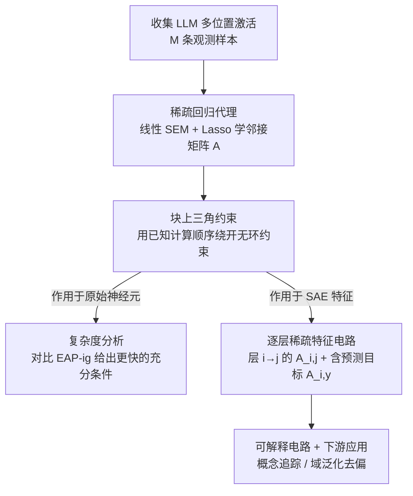

# Scalable Circuit Learning for Interpreting Large Language Models

**会议**: ICML2026  
**arXiv**: [2606.16939](https://arxiv.org/abs/2606.16939)  
**代码**: 待确认  
**领域**: 可解释性 / 机制可解释性  
**关键词**: 机制可解释性, 电路发现, 稀疏自编码器, 稀疏回归, Lasso

## 一句话总结
CircuitLasso 把"机制可解释性里发现电路"这件事，从昂贵的干预式（intervention-based）方法换成一个**稀疏线性回归（Lasso）代理**：只用观测数据、靠 $\ell_1$ 惩罚 + 块上三角约束在组件间找稀疏依赖骨架，从而第一次能直接在高维 SAE 特征空间上跑通电路发现，在 InterpBench 上以约 SOTA 的结构准确度换来 2–3 倍提速，并把学到的电路用于下游域泛化去偏。

## 研究背景与动机
**领域现状**：机制可解释性的核心任务是发现**电路**——连接模型内部关键组件（注意力头、神经元等）、共同驱动某个行为的紧凑子图。主流做法是干预式方法：因果中介分析、因果追踪、归因 patching（如 EAP、EAP-ig），通过反事实干预来量化组件间影响。

**现有痛点**：① 原始神经元是**多义的**（polysemantic）——单个神经元会被多个看似无关的概念激活，导致学出来的电路稠密、嘈杂、人类难读，反而背离了可解释的初衷。② 稀疏自编码器（SAE）特征能缓解多义性（每个特征单义、对应一个人类可懂概念，如"和体育相关""某种情绪"），但 SAE 特征**维度极高**（$D\gg d$），干预式方法的计算成本随之爆炸，且容易找到虚假相关——现有为低维原始神经元设计的方法**根本扩不到 SAE 特征空间**。

**核心矛盾**：可解释性想要的是 SAE 这种单义、干净的特征，但越想要可解释（高维单义特征），干预式电路发现就越跑不动——**可解释性与可扩展性在干预范式下天然冲突**。

**本文目标**：找一种**不依赖干预、只用观测数据、且对高维友好**的电路发现方法，让它既能匹配 SOTA 的结构准确度，又能真正在 SAE 特征上跑通。

**切入角度**：作者借鉴**连续因果发现**（continuous causal discovery）的思路——把电路发现看成在组件间学一个稀疏加权邻接矩阵。线性 SEM + Lasso 天生适合高维数据：计算高效、稀疏性直接翻译成可解释的电路。

**核心 idea**：用**稀疏线性回归（Lasso）作为 LLM 非线性计算图的可处理代理**，目标不是恢复细粒度逐边因果效应，而是高效地找出**依赖骨架**（哪些组件影响哪些组件）；再用 LLM 已知的前向计算顺序构造**块上三角约束**，绕开因果发现里最贵的无环性约束，把问题降成纯 Lasso。

## 方法详解

### 整体框架
CircuitLasso 把电路发现统一表述成"学一个稀疏加权邻接矩阵 $A$"的回归问题。给定从 LLM 多个位置抽出的 $N$ 个组件激活拼成向量 $\boldsymbol{x}\in\mathbb{R}^N$，假设组件间是线性结构关系 $\boldsymbol{X}=A^\top\boldsymbol{X}+\boldsymbol{\varepsilon}$，则求解
$$\widehat{A}=\arg\min_A\|\boldsymbol{X}-A^\top\boldsymbol{X}\|_F^2+\lambda\|A\|_1,\quad \text{s.t. } \mathcal{G}(A)\in\mathbb{D}$$
其中 $A[i,j]\neq 0$ 表示有向依赖 $x_i\to x_j$，$\lambda\|A\|_1$ 是稀疏惩罚，$\mathbb{D}$ 是无环图空间。关键难点是无环约束最贵，框架用"模型已知计算顺序"把它替换成块上三角结构，于是整个问题塌缩成可扩展的 Lasso。这套框架可以**同时**作用在原始神经元（验证准确度）和 SAE 特征（实现可解释），最后还能把预测目标 $y$ 一起纳入回归来解释模型的预测行为。

### 关键设计

**1. 稀疏回归代理：把电路发现从"逐边因果干预"换成"一次性回归出依赖骨架"**

这是全文立论根基，针对"干预式方法成本随 LLM 规模爆炸、扩不到高维"的痛点。作者明确声明这是一个**代理（surrogate）而非严格 SEM**：不去主张可识别性定理（因果充分性、独立噪声、正确线性形式在 transformer 里都只近似成立），$\boldsymbol{\varepsilon}$ 被解释成**线性化误差**而非外生噪声（因为 LLM 激活是确定性的）。目标只是高效恢复被建模组件间的**依赖骨架**——一个对最强依赖的稀疏、保守的总结，$\ell_1$ 惩罚把弱依赖（无论来自遗漏父节点还是真实但微小的效应）过滤掉。最大优势是**只用观测数据**：不需要任何前向/反向干预，适用面更广、成本不随 LLM 规模线性增长。

**2. 块上三角约束：用 LLM 已知的前向计算顺序，免费换来无环性**

连续因果发现里最贵的就是强制无环（acyclicity），稠密枚举很快就不可行。作者的巧思是——LLM 的计算顺序是**人为设计、已知的**：层 $i$ 的神经元在 $i<j$ 时先于层 $j$，层内注意力激活先于 MLP 激活。据此把激活重排成 $\tilde{\boldsymbol{H}}\in\mathbb{R}^{N\times M}$（$N=Ld$），再要求 $A$ 为**块上三角**：
$$\widehat{A}=\arg\min_A\|\tilde{\boldsymbol{H}}-A^\top\tilde{\boldsymbol{H}}\|_F^2+\lambda\|A\|_1,\quad \text{s.t. } A \text{ 块上三角}$$
每个块 $A[i,j]$ 是 $d\times d$ 方阵，且 $i\ge j$ 时整块置零。这保证"后面的层不能影响前面的层"，从而**不写显式无环约束就天然无环**——实现上只要把下三角块初始化为零并冻结即可。这把一个 NP-hard 味道的约束优化降成纯 Lasso，是可扩展性的真正来源。作者还给出复杂度命题：FISTA 在 $\mathcal{O}(1/\sqrt{\epsilon})$ 步达到 $\epsilon$-次优，总成本 $\mathcal{O}\!\left(\frac{ML(L-1)d^2}{2\sqrt{\epsilon}}\right)$，并证明在若干关于 $n_{\text{token}}$ 与 $d$ 的条件下**可证比 EAP-ig 更快**（EAP-ig 的瓶颈是每条观测要 2 次前向 + 1 次反向，而 CircuitLasso 零反向、只共享一次前向收集激活）。

**3. 逐层稀疏特征电路：把回归直接搬到高维 SAE 特征上，并把预测目标纳入**

干预式方法在 SAE 维度 $D$ 下成本越界，而本文的回归代理对高维友好，于是顺势扩展到 SAE 特征。对计算上 $i$ 先于 $j$ 的两个位置，用预训练 SAE 编码出特征 $\boldsymbol{z}_i,\boldsymbol{z}_j\in\mathbb{R}^D$，把依赖方向限定为 $i\to j$，逐对求解
$$\widehat{A}_{i,j}=\arg\min_{A_{i,j}}\|\boldsymbol{Z}_j-A_{i,j}^\top\boldsymbol{Z}_i\|_F^2+\lambda\|A_{i,j}\|_1$$
成本仅 $\mathcal{O}(MD^2/\sqrt{\epsilon})$。学相邻层所有块输出的 $A_{i,j}$，就能看清**语义概念如何在层间传递、传播、演化**。更进一步，把下游预测目标 $y$ 纳入回归 $\widehat{A}_{i,y}=\arg\min_{A_{i,y}}\mathcal{L}_{\text{pred}}(y,A_{i,y}^\top\boldsymbol{Z}_i)+\lambda\|A_{i,y}\|_1$（成本 $\mathcal{O}(MD/\sqrt{\epsilon})$），就能既解释模型的预测行为、又能据此**矫正预测以缓解虚假/偏见行为**。要解释整个数据集就用数据集级系数 $|A_{L,y}|$ 排特征；要解释单条预测就用 prompt 专属的 Hadamard 积 $\boldsymbol{s}=|A_{L,y}|\odot|\boldsymbol{z}_L|$ 重加权——两种粒度回答不同问题。

### 损失函数 / 训练策略
所有子问题都是带 $\ell_1$ 惩罚的最小二乘（分类下游任务用交叉熵、回归用 MSE），用 FISTA 求解。SAE 直接用预训练好的（OpenAI 为 GPT-2 small 训的 SAE 等），本文不训练新 SAE。无环性靠冻结下三角块实现而非优化进损失。

## 实验关键数据

### 主实验
在 InterpBench（86 个已知 ground-truth 电路的半合成 transformer）上，按协议评 16 个合成案例 + 真实 IOI 案例，准确度用结构汉明距离（SHD，越低越好），效率用单卡 A100 的运行秒数（3 次试验均值）。

| 方法 | 平均 SHD ↓ | 平均运行时间 (s) ↓ | 相对提速 |
|------|-----------|-------------------|---------|
| EAP | 3.61 | 33.7 | — |
| EAP-ig (SOTA) | **2.98** | 49.1 | 1× |
| CircuitLasso-linear | 3.16 | **16.3** | 3.0× vs EAP-ig |
| CircuitLasso-nonlinear | 2.84 | ≈60 (3.7×) | 比 EAP-ig 还慢 |

CircuitLasso-linear 的 SHD 3.16 与 EAP-ig 的 2.98 统计上无显著差异、优于 EAP 的 3.61，运行时间却只要 16.3 s——比 EAP-ig 快 3.0 倍、比 EAP 快 2.1 倍，直接支撑"准确度持平、成本骤降"的核心主张。

SAE 特征上对比 SHIFT（不含手动解释时间）：

| 模型 | SHIFT 时间 (s) | CircuitLasso 时间 (s) | SHIFT 特征数 | CircuitLasso 特征数 |
|------|----------------|------------------------|--------------|----------------------|
| Pythia-70M | 257.6 | **36.5** | 49 | 41 |
| Gemma-2-2B | 371.2 | **47.2** | 65 | 55 |
| Gemma-2-9B | 908.4 | **107.4** | 71 | 59 |

### 消融实验

| 配置 | 关键指标 | 说明 |
|------|---------|------|
| CircuitLasso-linear | SHD 3.16 / 16.3 s | 完整方法，性价比最高 |
| CircuitLasso-nonlinear | SHD 2.84 / ≈60 s | 非线性变体仅微降 SHD、却 3.7 倍耗时，收益递减 |
| 下游域泛化（Bias-in-Bios, Gemma-2-9B） | Prof. 91.5 / Gender≈50 | 用电路洞察去偏，以低成本接近 oracle |

### 关键发现
- **效率持平准确度**：CircuitLasso-linear 在结构准确度与 SOTA 干预法持平的同时提速 2–3 倍；非线性变体说明线性边重要性已足够刻画依赖结构，额外非线性容量被浪费。
- **可解释洞察**：在此前从未用于机制可解释性的 CoLA 任务上，对 GPT-2 small 的 SAE 特征电路呈现出三类现象——**持久性**（某概念如"-self"沿多层电路路径延续）、**合并与丢弃**（后层特征合并多个父特征的概念，或丢弃部分概念）。
- **下游去偏**：在 Bias-in-Bios 上，利用学到的电路洞察可在大幅更低成本下取得与 SOTA 去偏方法可比、有时略好的职业预测精度，同时把性别可预测性压到接近 50%（即不再依赖虚假性别信号）。

## 亮点与洞察
- **把昂贵的因果干预换成便宜的回归代理**：最关键的认知是——电路发现的目标若只是"依赖骨架"而非"逐边因果效应"，那就没必要付干预的代价，一个诚实标注为"代理"的 Lasso 就够了。这种"想清楚到底要什么、再选最省的工具"的思路很值得借鉴。
- **用架构先验换无环性**：LLM 的前向计算顺序是免费的、可靠的无环先验，块上三角约束把因果发现里最贵的部分一笔勾销——这是让方法可扩展的真正杠杆。
- **诚实的假设讨论**：作者主动声明不诉诸可识别性定理、把 $\varepsilon$ 解释为线性化误差、把骨架定位成"保守的最强依赖地图"，避免了过度声称，是值得学习的科研写作态度。
- **可迁移性**：这套"线性 SEM 代理 + 计算顺序换无环 + 把预测目标纳入回归"的范式，可迁移到任何"想在高维特征间找稀疏依赖、又有已知拓扑顺序"的可解释性场景（如视觉模型、多模态模型的特征电路）。

## 局限与展望
- **只恢复骨架、非真因果**：方法明确不保证可识别性、不恢复逐边因果效应，对需要精确因果归因的场景不够。
- **线性假设的近似性**：transformer 的注意力、LayerNorm、MLP 本质非线性，线性 SEM 只是近似；非线性变体虽更准但提速优势尽失。
- **依赖预训练 SAE**：电路质量受限于所用 SAE 的保真度-稀疏度权衡，SAE 本身的重构误差会被吸进残差。
- **群体级 vs 单条 prompt**：本文聚焦数据集级骨架，与逐 prompt 的归因图（如 attribution graphs）互补但不替代；何时该用哪种粒度仍需经验判断。

## 相关工作与启发
- **vs EAP / EAP-ig（干预式 SOTA）**：它们靠反事实干预量化逐边影响、每条观测要前向+反向、成本随规模与维度爆炸；CircuitLasso 只用观测数据 + Lasso，零反向，结构准确度持平却快 2–3 倍且能扩到 SAE 维度。
- **vs Marks et al. 2025（SAE 特征近似）**：他们为 SAE 特征做高效近似但依赖聚类等启发式预处理；本文直接把稀疏回归搬上 SAE 特征，无需启发式预处理。
- **vs Conmy et al. 2023（ACDC，迭代剪边）**：ACDC 像约束式因果发现的 PC 算法那样迭代剪计算图的边；CircuitLasso 走连续优化路线，一次性回归出加权邻接，借块上三角免去显式无环搜索。
- **vs 逐 prompt 归因图（Ameisen/Lindsey 2025）**：它们在 transcoder 特征上构造单 prompt 归因图；CircuitLasso 聚合多 prompt 的观测系数得到群体级依赖骨架——两种粒度回答"何时/对哪些输入/经哪些特征"的不同侧面，可三角互证。

## 评分
- 新颖性: ⭐⭐⭐⭐⭐ 首次把连续因果发现的稀疏回归 + 计算顺序换无环带进电路发现，解锁 SAE 高维特征
- 实验充分度: ⭐⭐⭐⭐ InterpBench + 多规模 LLM + 真实可解释案例 + 下游去偏，覆盖到 9B
- 写作质量: ⭐⭐⭐⭐⭐ 假设讨论诚实、复杂度命题清晰、把"代理"定位说得很透
- 价值: ⭐⭐⭐⭐⭐ 让机制可解释性真正能在 SAE 特征上规模化，并打通到下游去偏应用

<!-- RELATED:START -->

## 相关论文

- [\[ICML 2025\] Inference-Time Decomposition of Activations (ITDA): A Scalable Approach to Interpreting Large Language Models](../../ICML2025/interpretability/inference-time_decomposition_of_activations_itda_a_scalable_approach_to_interpre.md)
- [\[ICML 2026\] Towards Atoms of Large Language Models](towards_atoms_of_large_language_models.md)
- [\[ICML 2026\] Equilibrium Reasoners: Learning Attractors Enables Scalable Reasoning](equilibrium_reasoners_learning_attractors_enables_scalable_reasoning.md)
- [\[ICML 2026\] The Expert Strikes Back: Interpreting Mixture-of-Experts Language Models at Expert Level](the_expert_strikes_back_interpreting_mixture-of-experts_language_models_at_exper.md)
- [\[ICML 2026\] Dissecting Multimodal In-Context Learning: Modality Asymmetries and Circuit Dynamics in modern Transformers](dissecting_multimodal_in-context_learning_modality_asymmetries_and_circuit_dynam.md)

<!-- RELATED:END -->
