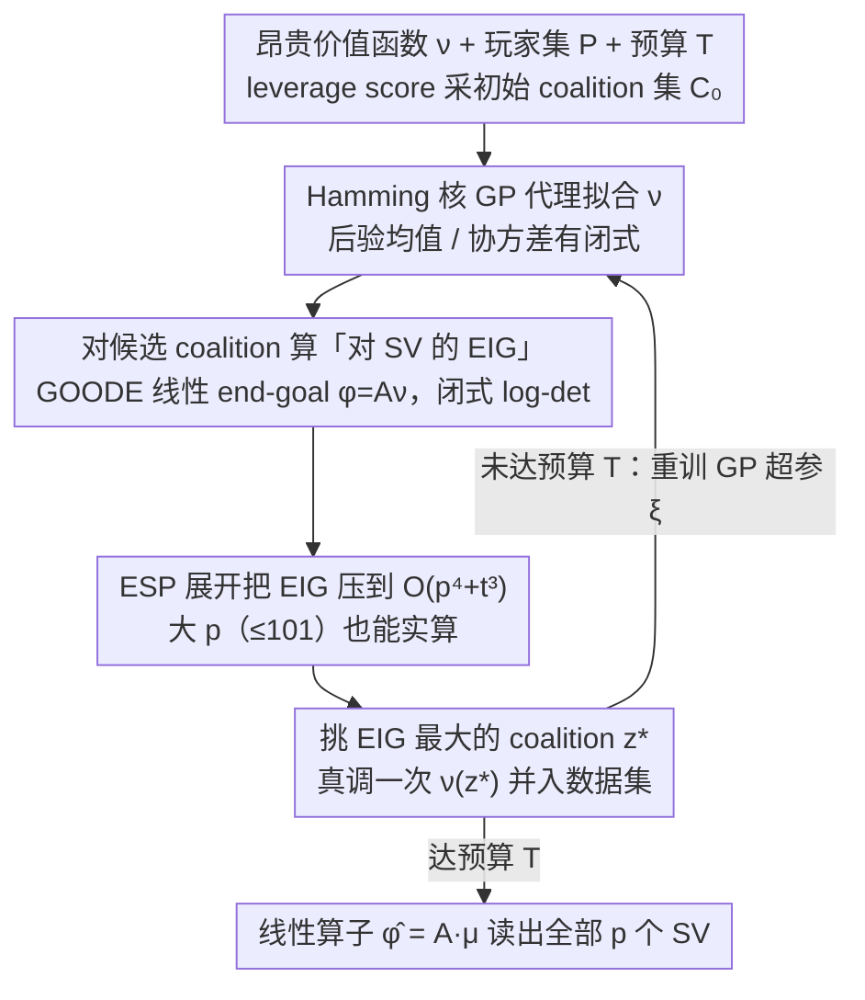

# ShaplEIG: Bayesian Experimental Design for Shapley Value Estimation

**会议**: ICML 2026  
**arXiv**: [2606.02247](https://arxiv.org/abs/2606.02247)  
**代码**: 有（论文附 Appendix D.1.5 公开仓库）  
**领域**: 可解释机器学习 / Shapley 值估计 / 贝叶斯实验设计  
**关键词**: Shapley 值, 贝叶斯实验设计, EIG, 高斯过程, 汉明核

## 一句话总结
在评估预算极度受限（如需要重训模型）的代价昂贵游戏上，用带 Hamming 核的 GP 作为价值函数代理、按"对 Shapley 值的期望信息增益（EIG）"自适应挑下一个 coalition，并把 EIG 计算从 $O(4^p t)$ 压到 $O(p^4 + t^3)$。

## 研究背景与动机

**领域现状**：Shapley 值（SV）是可解释 ML 中最常用的公理化归因度量，但精确计算需要枚举 $2^p$ 个 coalition 并对每个调用价值函数 $\nu(S)$。现有方法大体分两支：(1) 蒙特卡洛类（permutation sampling、MSR、SVARM）从一个**固定预设分布**采 coalition；(2) 代理回归类（Kernel SHAP、Leverage SHAP、Regression MSR）拟一个 surrogate 再读 SV，coalition 也是按固定分布采的。

**现有痛点**：当价值函数本身昂贵——例如 TabPFN 特征重要性（每次要重跑 in-context 推理）、Ghorbani-Zou 式 data valuation（每次重训一个 RF/GB）、HyperSHAP 超参重要性（每次跑一轮 HPO）、大视觉模型的局部解释（每次 API 调用花钱）——预算可能只有几百次，固定分布采样把宝贵的 query budget 浪费在"和之前 coalition 提供同质信息"的样本上。

**核心矛盾**：自然想做"自适应挑 coalition"，但 BED 框架下的 EIG 通常没有闭式，常用的 GP 上 EIG 也只是对 surrogate **本身** 的不确定性下手（如 uncertainty sampling，US），并不直接对准 SV 这个下游量；而且即便有了准则，对 $2^p$ 个 coalition 暴力遍历也是指数级。

**本文目标**：(i) 给"对 SV 的 EIG"找出一个 closed-form；(ii) 把 EIG 计算从 $O(4^p t)$ 降到关于 $p$ 多项式；(iii) 在低预算区间真正打过 SOTA 采样/代理方法。

**切入角度**：SV 是价值函数的**线性变换** $\phi=A\nu$（Shapley 公理之 linearity）。把"挑 coalition + 关心 SV"这件事重新装进**贝叶斯线性逆问题 + 目标导向 OED（GOODE）** 的框架里，EIG 就只依赖 GP 后验协方差而非具体观测值，从而有闭式 $-\tfrac12 \log\det(A\Sigma_{\theta\mid y}A^\top)+C$。

**核心 idea**：用 Hamming 核 GP 当 surrogate + 把 SV 当线性 end-goal 写出闭式 EIG + 用初等对称多项式（ESP）展开 Hamming 核乘性结构，使 EIG 多项式时间可算。

## 方法详解

### 整体框架
ShaplEIG 把"精确算 Shapley 值要枚举 $2^p$ 个 coalition"的难题，重铸成一个贪婪的贝叶斯自适应设计（BAD）循环：用一个概率化代理拟合昂贵的价值函数 $\nu$，每一轮只问"评估哪个 coalition 最能减少对 SV 的不确定性"，把有限预算精确地花在刀刃上。给定玩家集 $P=\{1,\dots,p\}$、价值函数 $\nu:2^P\to\mathbb{R}$、按 leverage score 采的初始集合 $\mathcal{C}_0$（$T_0=p+1$ 个）和预算 $T$（论文 $\le 512$），每轮先在候选池里挑出期望信息增益 $\mathrm{EIG}^{(t)}_\phi$ 最大的 coalition，真去调一次 $\nu$、把 $(z,\nu(z))$ 并入数据集、再重训代理超参；终止后用一个线性算子 $\hat\phi = A\mu_{\nu\mid\mathcal{D}_{T+1}}$ 从后验均值直接读出全部 $p$ 个 SV。整套方法的三块拼图——代理选什么、准则对准谁、复杂度怎么压下来——正好对应下面三个关键设计。

### 关键设计

**1. Hamming 核 GP 代理：让设计真正随观测自适应**

痛点在于经典的 Kernel SHAP 用线性 surrogate 加固定权重，它的后验不确定性只取决于"已经选了哪些 coalition"、和实际观测到的 $\nu$ 值无关，于是设计天生非自适应——观测结果再奇怪也改不了下一步选谁。ShaplEIG 改用定义在二元 coalition 空间 $\{0,1\}^p$ 上的高斯过程：把 coalition 写成指示向量 $z$，核取加权 Hamming 形式 $k_\xi(z,z')=\prod_{j=1}^p \xi_j^{\mathbb{1}[z_j\ne z'_j]}$，每个 player 配一个可学权重 $\xi_j$。固定 $\xi$ 时 $\nu(Z)\mid\mathcal{D}_t,\xi$ 是一个 $2^p$ 维多元高斯，后验均值与协方差都有闭式，低数据下仍能给出良校准的不确定性。关键是 $\xi$ 会随每轮观测重训，于是历史 $\nu$ 值经由核超参渗进后续的 EIG，设计才真正 outcome-adaptive；而 Hamming 核的乘性结构又恰好是后面 ESP 展开能成立、复杂度能压到 $O(p^4)$ 的前提，一举两得。

**2. 把 SV 当 GOODE 的线性 end-goal，写出 EIG 闭式**

如果直接对未变换的 $\nu$ 算 EIG（信息论里的 ITL），在 GP 上会退化成纯 uncertainty sampling——只挑"代理自己最没把握"的 coalition，完全不管这次评估对真正关心的 $\phi$ 减了多少不确定性；而 EPIG 又因要对 $2^p$ 个目标分布积分而算不动。ShaplEIG 抓住 Shapley 公理里的线性性 $\phi=A\nu$（$A\in\mathbb{R}^{p\times 2^p}$，元素为 $\frac{\mathbb{1}_S}{p}\binom{p-1}{|S|-1}^{-1} - \frac{1-\mathbb{1}_S}{p}\binom{p-1}{|S|}^{-1}$），把"挑 coalition + 关心 SV"装进贝叶斯线性逆问题的目标导向最优设计（GOODE）框架里：SV 只是参数 $\nu$ 的一个线性投影 end-goal。这样 EIG 就只依赖 GP 后验协方差、与具体观测值无关，得到一行闭式 $\mathrm{EIG}_\phi(z^{(i)}) \propto C' + \log[e_i^\top(\Sigma_{\nu\mid\mathcal{D}_t}+\sigma_\epsilon^2 I)e_i] - \log[e_i^\top(\Sigma_{\nu\mid\mathcal{D}_t}+\sigma_\epsilon^2 I - Q)e_i]$，其中 $Q_{i,i}=(A\Sigma_{\nu\mid\mathcal{D}_t}e_i)^\top (A\Sigma_{\nu\mid\mathcal{D}_t}A^\top)^{-1}(A\Sigma_{\nu\mid\mathcal{D}_t}e_i)$。这是 Attia 2018 的 GOODE 结果在 SV 设定下的具体化，把原本需要嵌套 MC 估计的 EIG 化成一个 log-det，也正是把 $A$ 嵌进去、让准则对准 SV 而非 surrogate 的核心一步。

**3. 用初等对称多项式把 EIG 从 $O(4^p t)$ 压到 $O(p^4 + t^3)$**

闭式 EIG 看着漂亮，但 naive 算法要先构出 $2^p\times 2^p$ 的协方差 $\Sigma_{\nu\mid\mathcal{D}_t}$ 再做 $A$、$e_i$ 投影，主项是 $O(4^p t)$——$p=10$ 就已是 $4^{10}\approx10^6$ 维矩阵，根本算不动。论文的 Theorem B.1/B.2 把线性项 $AK_\xi(Z,z^{(i)})\in\mathbb{R}^p$ 和二次项 $AK_\xi(Z,Z)A^\top\in\mathbb{R}^{p\times p}$ 都改写成"跨 coalition 的加权核值求和"，注意到大量 kernel evaluation 共享权重，再把同权重的求和与一元/二元的初等对称多项式（ESP）一一对应，两项分别落到 $O(p^2)$ 和 $O(p^4)$，整批候选 vectorize 后总复杂度是 $O(p^4+t^3+|W|t^2)$（SV 估计顺带 $O(t^3)$，SV 后验协方差 $\Sigma_\phi$ 为 $O(p^4+t^2 p)$）。这一刀把方法从"理论上好看"推到 $p=101$（LE on Crime）也能实跑的尺度，而它能成立完全靠 Hamming 核 $k(z,z')=\prod_j\xi_j^{\mathbb{1}[\cdot]}$ 的乘性结构——换成 categorical RBF 之类的核就拿不到这个红利。

### 损失函数 / 训练策略
GP 超参 $\xi$ 每一轮（大 $p$ 时改按 refit schedule）用后验 $p(\xi\mid\mathcal{D}_{t+1})$ 的 MAP 重训，这是唯一让历史观测值反馈进设计的渠道。价值函数评估默认带高斯噪声 $\epsilon\sim\mathcal{N}(0,\sigma_\epsilon^2)$，但论文也讨论了 noiseless GP 下的一致性：当全部 $2^p$ 个 coalition 都被评估时，GP 的插值性 $\mu_{\nu(z)\mid\mathcal{D}_{2^p+1}}=\nu(z)$ 自动给出 $\mu_\phi=\phi(\nu)$，即估计**构造上一致**——这点优于 Regression MSR（树代理默认不一致，要额外做残差校正）。

## 实验关键数据

实验设计成 4 类任务共 15 个 game，玩家数 $p\in[8,101]$，每个 game 跑 30 或 100 个 seed。所有 baseline 在每一轮使用与 ShaplEIG 等量的 $\nu$ 评估预算，公平对比。

### 主实验

| 任务类别 | 代表 game | $p$ | ShaplEIG vs SOTA (低预算 MSE) |
|----------|-----------|-----|-------------------------------|
| FI（TabPFN）| Diabetes Reg. | 10 | 全程严格优于 Kernel/Leverage SHAP、Perm. Sampling、Reg. MSR |
| DV（RF on Bike Sharing）| Bike Sharing | 10 | 大幅领先所有 baseline 多个数量级 |
| HPI（XGBoost on Chess）| Chess | 16 | 早期与 Reg. MSR 接近，后续低 MSE 区间领先 |
| LE（ViT 16-patch）| ImageNet | 16 | 全程优于所有竞争者 |
| LE（RF on Crime, 大 $p$）| Crime | 101 | 尽管 GP 超参按 schedule 重训，仍跑通且最终领先 |

文中描述：在大多数 game 上 ShaplEIG 跨所有预算严格 dominant；只有 Regression MSR 偶尔在窄区间打平；其它 baseline 在低预算区基本被甩开。

### 消融实验

| 配置 | 关键发现 |
|------|---------|
| Full ShaplEIG | 最佳整体性能 |
| GP + Random sampling | 多数 game 被 ShaplEIG 大幅领先 |
| GP + Leverage Score Sampling | 偶尔接近 ShaplEIG，但仍被持续超过 |
| GP + Uncertainty Sampling (US) | **比 GP+Random 还差**，说明 BED 经典 US 准则不适合 SV |
| ShaplEIG（大 $p\ge 60$，超参定期重训） | 早期 100 轮被弱 baseline 略胜，之后反超 |

### 关键发现
- "强性能并不主要来自 GP surrogate 本身"——GP+Random、GP+Leverage、GP+US 都被 ShaplEIG 打败，说明 EIG-based 选 coalition 才是核心贡献。
- US 在 SV 估计上反直觉地比 random 还差，因为 US 只挑 surrogate 自己最不确定的 coalition，完全忽略"对 SV 下游影响有多大"；这反过来印证了"对 SV 直接写 EIG"的必要性。
- 计算开销：$p\le 16$ 时，GP 超参重训每轮 ≤2 分钟，EIG 算 <1 秒；$p\le 100$ 时超参重训 ≤25 分钟/轮，EIG ≤30 秒/轮。**超参重训才是 bottleneck**，所以 GP-based 但非 EIG 的 ablation 并不更便宜——这点对反驳"为了 EIG 多花了算力"很关键。
- 因此 ShaplEIG 的甜区是"$\nu$ 真昂贵（动辄重训/调 API）+ $p$ 中等（$\le \sim 16$ 是绝佳，$\sim 100$ 仍可接受）"。

## 亮点与洞察
- **把 SV 当"end-goal"而非把 $\nu$ 当目标**：直接拒绝了"先把 surrogate 学准、SV 自然就准"的朴素观点。证明在 GP 上 EIG 对 $\nu$ 退化成 US，但对线性投影 $A\nu$ 是有效准则，这个 framing 转换是真正的 idea 核心。
- **Hamming 核 + ESP 是一对天作之合**：乘性结构 $\prod_j \xi_j^{\mathbb{1}[\cdot]}$ 让"按 player 子集求和的核加权和"恰好对应初等对称多项式；这把指数复杂度压成多项式，几乎是为这个问题量身定做的——其他常见类别核（如 categorical RBF）拿不到这个红利。
- **可一致性 + closed-form** 是相对于 Regression MSR 的工程级优势：MSR 的树代理默认不一致，需要在残差上额外跑 MSR 校正；ShaplEIG 在 noiseless GP 下"全 coalition 评估 → 精确 SV"自动成立。
- **可迁移设计**：对任何"关心 $\nu$ 的线性 functional"的代价昂贵 game（不仅 SV，还能是 Sobol indices、其它 fANOVA 分解），GOODE + Hamming-GP + ESP 这一套都能复用，只要换 $A$。

## 局限与展望
- 作者承认：GP 超参重训才是大头，$p>100$ 时单轮分钟级到小时级开销使方法只在"$\nu$ 真的更贵"时才划算；当 $\nu$ 廉价（如普通 SHAP 解释）时 ShaplEIG 的 overhead 不值。
- 评估全部依赖**预计算 game**（除 LE-RF 外都是 cached value table）以方便算 ground-truth；论文没在真正 in-the-loop 重训 LLM/扩散模型这种"价值函数动辄数小时"的场景上端到端跑过，工程极限未充分压测。
- 噪声 GP 下的偏差/一致性、贪心 BAD 的次优性都被推到 Appendix；纯探索 US 表现奇差也提示这一族 BED 准则对游戏的"对称性/异构性"敏感，作者的"asymmetric game ShaplEIG 红利更大"猜想缺乏量化指标。
- 可改进方向：(i) 摊销/lazy 超参重训（如 lazy GP、structured kernel learning）以打破 bottleneck；(ii) batch BED 一次挑多个 coalition；(iii) 把 Hamming 核换成可同样 ESP 化的更表达性核以处理交互更强的 game；(iv) 把框架推广到带交互的高阶 Shapley interaction indices。

## 相关工作与启发
- **vs Kernel SHAP / Leverage SHAP / Regression MSR**：它们用固定预设分布采 coalition、surrogate 不感知历史观测；ShaplEIG 用 GP 的 outcome-adaptive 设计直接对准 SV，且天生一致无需残差校正。
- **vs BayesSHAP（Slack 2021）**：BayesSHAP 用贝叶斯线性模型 + US 选 query；ShaplEIG 同样思路但 (a) 换成 GP 拿到 outcome-adaptivity，(b) 把准则从 US 升级到对 SV 的 EIG，实验显示这个组合在 SV 任务上比单纯 GP+US 强不止一档。
- **vs Mitchell 2022 / Nguyen 2025（GP+BQ for SV）**：他们的 GP/核定义在**排列**或**数据分布**上、且通常一次只减一个 player 的不确定性、kernel 固定→ 非自适应；ShaplEIG 的核在 coalition 空间、目标是**所有 player 的 SV 联合不确定性**、超参随数据重训→ 真正自适应。
- **vs Active learning / ITL / EPIG**：ITL 在本设定下塌缩成 US；EPIG 因要对 $2^p$ 目标分布积分而算不动；ShaplEIG 借 SV 的线性可达到 closed-form，回避了 BED 经典的 nested MC 痛点。

## 评分
- 新颖性: ⭐⭐⭐⭐⭐ 把 GOODE 视角引进 Shapley 估计，理论与算法两端都给出原创结果（闭式 EIG + ESP 化的 $O(p^4)$ 计算），不是把已有 BED 套壳。
- 实验充分度: ⭐⭐⭐⭐ 跨 FI/DV/HPI/LE 四类共 15 个 game、$p\in[8,101]$、强 baseline 与 4 种 ablation 都覆盖；但全部用预计算 game，缺少端到端"真昂贵 $\nu$ 在线运行"的工程验证。
- 写作质量: ⭐⭐⭐⭐ 把 BED 术语、Shapley 公理与 GP 推导串成一条清晰主线；只是核心公式与 ESP 证明都被放进 appendix，正文读起来略抽象。
- 价值: ⭐⭐⭐⭐ 在"$\nu$ 真昂贵 + 预算极低"这个明确的子场景里给出可直接采用的 SOTA 估计器；对 fANOVA、Sobol、超参重要性等同构问题有清晰的复用接口。

<!-- RELATED:START -->

## 相关论文

- [\[ICLR 2026\] SEED-SET: Scalable Evolving Experimental Design for System-level Ethical Testing](../../ICLR2026/interpretability/seed-set_scalable_evolving_experimental_design_for_system-level_ethical_testing.md)
- [\[ICML 2026\] Verified SHAP: 神经网络精确 Shapley 值的可证明界](verified_shap_provable_bounds_for_exact_shapley_values_of_neural_networks.md)
- [\[ICML 2026\] Prototype Transformer: Towards Language Model Architectures Interpretable by Design](prototype_transformer_towards_language_model_architectures_interpretable_by_desi.md)
- [\[ICML 2026\] Neural Collapse by Design: Learning Class Prototypes on the Hypersphere](neural_collapse_by_design_learning_class_prototypes_on_the_hypersphere.md)
- [\[ICML 2026\] Dual Mechanisms of Value Expression: Intrinsic vs. Prompted Values in Large Language Models](dual_mechanisms_of_value_expression_intrinsic_vs_prompted_values_in_large_langua.md)

<!-- RELATED:END -->
