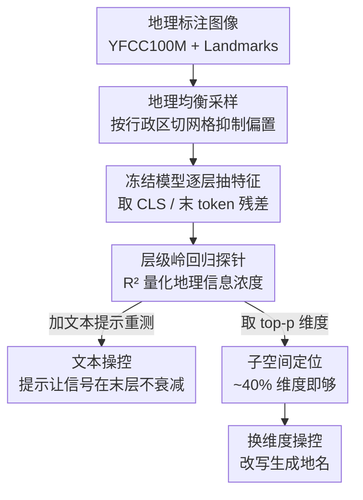

# Textual Supervision Enhances Geospatial Representations in Vision-Language Models

**会议**: ICML2026  
**arXiv**: [2606.07172](https://arxiv.org/abs/2606.07172)  
**代码**: https://github.com/marceloslo/Textual-Supervision-Enhances-Geospatial-Representations  
**领域**: 可解释性 / 多模态VLM  
**关键词**: 地理空间表征, 线性探针, 机制可解释性, 文本监督, 模型操控

## 一句话总结
作者用**层级线性探针**去问一个问题——视觉/多模态模型在没有任何地理监督的情况下，隐藏层里到底有没有"这张图拍在地球哪儿"的信息；结论是**带文本监督的 VLM（CLIP、LLaVA、Qwen、Gemma）远比纯视觉模型（ViT、DINOv2）更会编码经纬度**，而且这种地理信息集中在很少的几个维度里、甚至可以被"换维度"操控来改写模型生成的地名。

## 研究背景与动机
**领域现状**：图像地理定位（image geolocation）传统上是个**有监督**任务——PlaNet 把地球切成网格做分类，GeoCLIP 把 CLIP 图像特征对齐到一个位置编码器，PIGEON 在 CLIP 特征上做层级定位。这些工作证明"只要专门训练，视觉模型能定位"，但它们都在训练一个定位模型。

**现有痛点**：没人系统回答过一个更基础的问题——那些**没为定位训练过**的通用视觉/多模态基础模型，在预训练时是不是已经"顺手"学到了地理空间信息？文本侧 LLM 那边已有证据（Gurnee & Tegmark 发现 LLM 的特定神经元隐式编码经纬度），但视觉/多模态这边的隐式地理表征几乎是空白。

**核心矛盾**：模型内部表征由架构、预训练数据、微调共同塑造，本身极难解释；VLM 的多模态复杂度进一步遮蔽了"知识到底存在哪、怎么存"。而这件事不只是好奇——如果模型隐式地记住了地理信息，就意味着**隐私风险**（恶意者从照片反推位置）和**公平性问题**（对欠发达地区定位精度系统性偏低）。

**本文目标**：拆成三个子问题——(1) 哪类模型（纯视觉 / VLM / 大规模多模态）地理表征最强？(2) 地理信息在网络的**哪一层**最浓？(3) 这些信息是弥散在整个表征里、还是集中在少数维度、能不能被操控？

**切入角度**：作者不去训练定位模型，而是借用**线性探针（linear probing）**——这是 Transformer 机制可解释性的标准工具。思路很直接：如果能从某层的隐藏向量**线性地**回归出经纬度，就说明这层确实编码了地理信息，且回归的 $R^2$ 就是信息浓度的量化指标。

**核心 idea**：用"冻结模型 + 逐层岭回归探针"把不可见的地理表征量化出来，并据此论证**文本监督是学好地理表征的关键因素，比单纯放大视觉模型规模更高效**。

## 方法详解

### 整体框架
整篇文章的"方法"其实是一套**探针式分析流水线**：把一批训练好、参数冻结的模型当黑箱，喂入地理标注图片，逐层抽出 summary token 的残差流向量，用岭回归探针去预测经纬度，再用 $R^2$ 横向比较不同模型族、不同层、不同维度子集，最后做一个"换维度改写生成"的操控实验来验证地理信息确实是因果可干预的。整个分析的输入是图像（可选附带文本提示），输出是"某模型某层的地理表征强度 $R^2$"以及一个被改写了地名的生成结果。

### 关键设计

**1. 层级线性探针：用岭回归 $R^2$ 把"地理信息浓度"变成可比的数字**

痛点是地理表征看不见摸不着、跨模型无法比较。作者把每个 Transformer block 的残差流写成 $x^{(l+1)}=h^{(l)}_{\mathrm{attn}}+h^{(l)}_{\mathrm{mlp}}$，对每一层 $l$ 取 summary 表征（视觉模型用 `[CLS]`、VLM 用最后一个 token），然后拟合一个岭回归把这个向量映到二维目标（纬度、经度）：

$$\hat{\mathbf{W}}=\arg\min_{\mathbf{W}}\bigl\|\bm{Y}-\bm{A}^{(l)}\mathbf{W}\bigr\|_{F}^{2}+\lambda\bigl\|\mathbf{W}\bigr\|_{F}^{2}.$$

正则强度 $\lambda$ 用留一交叉验证逐探针选取。关键在于用**决定系数 $R^2$** 作为统一标尺——$R^2$ 越高说明该层残差里"能被线性读出的地理信息"越多。这样一来，不同架构、不同维度、不同层就被放进了同一个可比的坐标系，"哪个模型更会编码地理"这个含糊问题就有了硬指标。之所以用 MSE 而非更符合球面距离的 haversine 做探针损失，是因为 MSE 凸、平滑、好训浅探针，作者把它当作信号密度的透明度量（这也是后文承认的一个 setup 局限）。

**2. 地理均衡采样：先把数据集的"欧美偏置"压下去，再谈表征**

如果不处理，YFCC100M 和 Landmarks 的图片严重偏向欧美大城市，探针会被数据分布带跑、$R^2$ 反映的是采样偏置而非真实表征。作者按全球行政区边界（GID）把地球切成不重叠的 geocell，对样本不足的区域**层级合并**（先在 GID_1 区域内合，再跨同国 GID_0 合），并规定每个 geocell 至少含一个完整的 GID_2 城市单元以防过采样。最终每个数据源选 5,000 张、每个 geocell 至多 5 张，Landmarks 还去重同一地标。这一步保证了后面"VLM 比纯视觉强"的结论不是采样假象——附录里在"所有模型同源数据"设定下该结论依然成立。

**3. 子空间定位与换维度操控：证明地理信息既集中又可因果干预**

仅有"探针读得出"还不够，作者要进一步说明地理信息**集中在哪、能不能动**。先做子空间分析：只保留按探针系数绝对值排序的 top-$p$ 维度重训探针，发现 $p\approx0.4$（约 40% 维度）就能逼近满 $R^2$，Qwen2.5-VL 更极端——top 10% 维度就拿到 90% 的最佳性能，说明地理信息是**压缩在一小簇维度里**的而非均匀弥散。在此基础上做"换维度操控"：取源图与目标图在第 1 层 summary token 的残差，把源向量在地理相关维度集合 $g$ 上替换成目标的值：

$$\tilde{\bm{A}}^{(1)}_{\mathrm{source},t^{\star}}=\bm{A}^{(1)}_{\mathrm{source},t^{\star}}\odot\mathbbm{1}_{g^{C}}+\bm{A}^{(1)}_{\mathrm{target},t^{\star}}\odot\mathbbm{1}_{g},$$

然后从第 2 层继续前向解码。结果是把"萨卡拉的阶梯金字塔"的地理维度换成"特雷维喷泉"后，Qwen2.5-VL-3B 真的生成了"The image depicts the Step Pyramid, Rome, Italy"——地名被改写、其余语义大体保留。这把前面的相关性结论升级成了**因果可干预**的证据（虽然作者也坦承：生成越长越不稳定，会出现重复或源/目标地点混杂）。

### 损失函数 / 训练策略
本文不训练大模型，只训练浅层探针（岭回归，闭式 + 留一 CV 选 $\lambda$）。唯一的微调实验是下游"国家识别"任务：在 Landmarks 上每国至多取 100 张，对每个视觉族各取一个 large 模型 + CLIP-large + DINOv2-giant 做微调，输入与规模对齐以保证可比。

## 实验关键数据

### 主实验
横向探针结果（Figure 2 文字描述）显示文本监督模型整体碾压纯视觉模型：

| 模型族 | 代表模型 | 探针 $R^2$ 表现 | 解读 |
|--------|----------|-----------------|------|
| 纯视觉 | ViT / DINOv2 | 平均多在 0.3 以下 | 仅靠图像也能学地理，但弱 |
| 纯视觉(放大) | DINOv2-giant(1B) / Web-SSL DINO-7B | 同族最好 | 规模有帮助，仍被小 VLM 反超 |
| VLM | CLIP-base | 平均 > 0.4，Landmarks/街道达 ~0.8 | 小模型却赢过 DINOv2-giant |
| VLM(放大) | MetaCLIP-huge(600M) | 同源数据下胜过 Web-SSL DINO-7B | 文本监督 > 单纯放大视觉 |

最有说服力的两条对比：(1) 体量大得多的 DINOv2-giant 平均被小得多的 CLIP-base 反超；(2) 同样训练数据下 Web-SSL DINO-7B 被 MetaCLIP-huge 反超——都指向"语言监督在隐式学地理表征上更高效"。cluster 维度上，街道/建筑/地标 cluster 跨模型一致高 $R^2$，物体/食物特写最低；signs/text cluster 只在 VLM 上显出可定位性。

下游国家识别微调验证了探针结论的实用价值：

| 模型 | 测试准确率 | 验证损失 | 训练损失 |
|------|-----------|---------|---------|
| ViT-MAE-large | 0.15 | 3.35 | 2.344 |
| ViT-large | 0.23 | 3.17 | 1.346 |
| DINOv2-large | 0.29 | 2.55 | 0.009 |
| DINOv2-giant | 0.32 | 2.78 | 0.001 |
| CLIP-large | **0.36** | **2.39** | 0.009 |

下游准确率的排序**完全跟随探针 $R^2$ 的排序**（ViT-MAE 最差、CLIP 最好），佐证"隐式地理表征强 → 下游地理任务好"。

### 消融 / 分析实验

| 分析维度 | 关键发现 | 说明 |
|----------|---------|------|
| 逐层（无提示） | 纯视觉随深度单调升、VLM 升到某层后停滞甚至回落（Gemma 末层 $R^2$ 转负） | 无文本提示时 VLM 倾向"丢弃"对生成无用的地理信号 |
| 逐层（加提示） | 加 "Guess the latitude and longitude…" 提示后，末层 $R^2$ 不再骤降；Qwen 上 Landmarks 飙到 0.88 | 文本与图像的地理表征在隐空间纠缠，文本提示能把信号"唤回"末层 |
| 维度子集 $p$ | $p\approx0.4$ 即逼近满 $R^2$；Qwen top 10% 维度拿 90% 性能 | 地理信息集中在紧凑子空间 |
| 换维度操控 | 换 50% 地理维度即可改写生成地名 | 信息可因果干预，但长生成不稳定 |

### 关键发现
- **文本监督 > 视觉规模**：放大纯视觉模型有用但边际有限，引入语言监督才是学好地理表征的主因；作者将其与 Platonic Representation Hypothesis 联系——文本监督提升了学习地理表征的**效率**。
- **最优层依赖模型族与是否给提示**：无提示时纯视觉用最深层最好，VLM 则在"刚进语言模块后的几层"最好；加提示后 VLM 后段层更稳定。
- **隐私/公平双刃**：表征越强，从照片反推位置的能力越强；同时对欠表征地区定位更差，存在地理性能不均衡。

## 亮点与洞察
- **把"地理表征"做成可量化、可比较的探针实验**：用单一 $R^2$ 标尺统一横扫三大模型族 × 多层 × 多 cluster，是这篇最干净利落的地方——含糊的"模型懂不懂地理"被压成一张热力图。
- **"加一句提示就把信号唤回末层"非常有画面**：说明 VLM 不是没学到地理，而是无提示时主动"不优先"它；这个观察对所有想从 VLM 抽隐式知识的人都有迁移价值——别只看末层，要么探早层、要么用任务相关提示激活。
- **换维度改写地名**把相关性证据升级成因果干预，且只动第 1 层 summary token 就生效，提示地理信息在很早就被编码进 summary 表征。

## 局限与展望
- **探针损失用 MSE 而非 haversine**：作者承认 MSE 不符合球面距离几何，是为可训性做的妥协，可能低估/扭曲真实定位误差。
- **无法控制各模型预训练数据**：不同模型架构/数据选择混杂，"VLM 更强"可能部分受数据影响（作者用同源数据子实验缓解，但非根除）。
- **记忆混淆**：YFCC100M 早于所有模型发布，性能差异可能部分来自记忆；作者用无 caption 的 Landmarks + 过滤含坐标 caption 的实验缓解，结论基本不变。
- **操控不稳定 + 仅做 Qwen-3B**：长生成会混location；换维度实验只在一个开权重模型上验证。
- 展望：扩展到卫星图等其他图像类型，研究从零预训练时地理表征何时如何涌现。

## 相关工作与启发
- **vs GeoCLIP / PIGEON / PlaNet**：它们都**训练**一个定位模型；本文不训练，只**探测**通用模型里已隐式存在的地理结构——目标是理解"哪种架构选择催生了它"，而非刷定位 SOTA。
- **vs Gurnee & Tegmark（LLM 地理神经元）**：他们在纯文本 LLM 里发现隐式经纬度神经元；本文把这条"隐式地理表征"的线索延伸到视觉与多模态，并补上"文本监督是关键因素"的横向证据。
- **vs 一般机制可解释性探针工作**：本文把标准线性探针 + 子空间分析 + 残差换维度操控这套组合拳，用在了"地理空间"这个具体且有隐私后果的语义维度上。

## 评分
- 新颖性: ⭐⭐⭐⭐ 不发明新方法，但首次系统量化 VLM 隐式地理表征并指认"文本监督是关键"
- 实验充分度: ⭐⭐⭐⭐ 三大模型族 × 多层 × 多数据集横扫，含下游微调与操控验证；操控仅单模型略单薄
- 写作质量: ⭐⭐⭐⭐ 问题—探针—结论链条清晰，热力图与逐层曲线很直观
- 价值: ⭐⭐⭐⭐ 对地理 AI、隐私治理、VLM 表征理解都有现实启发

<!-- RELATED:START -->

## 相关论文

- [\[ICML 2026\] Vision-Language Asymmetry in Bistable Image Captioning](vision-language_asymmetry_in_bistable_image_captioning.md)
- [\[ACL 2026\] Follow the Flow: On Information Flow Across Textual Tokens in Text-to-Image Models](../../ACL2026/interpretability/follow_the_flow_on_information_flow_across_textual_tokens_in_text-to-image_model.md)
- [\[AAAI 2026\] Concepts from Representations: Post-hoc Concept Bottleneck Models via Sparse Decomposition of Visual Representations](../../AAAI2026/interpretability/concepts_from_representations_post-hoc_concept_bottleneck_models_via_sparse_deco.md)
- [\[ICML 2026\] Towards Atoms of Large Language Models](towards_atoms_of_large_language_models.md)
- [\[ICLR 2026\] Cross-Modal Redundancy and the Geometry of Vision-Language Embeddings](../../ICLR2026/interpretability/cross-modal_redundancy_and_the_geometry_of_vision-language_embeddings.md)

<!-- RELATED:END -->
