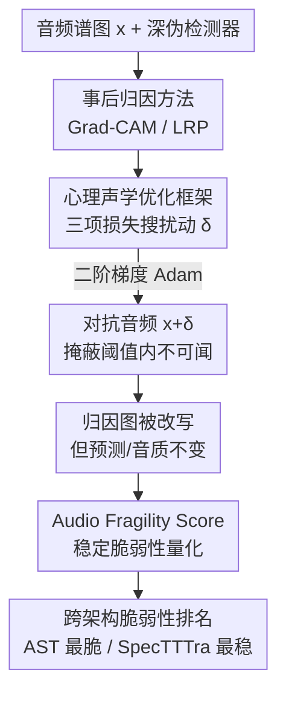

# The Perceived Fragility of Explanations in Audio Models: Manipulation of Attribution with Unchanged Predictions

**会议**: ICML2026  
**arXiv**: [2606.14466](https://arxiv.org/abs/2606.14466)  
**代码**: https://github.com/cncPomper/Audio-XAI  
**领域**: 可解释性 / XAI 安全 / 音频深伪检测  
**关键词**: 归因图操纵, 心理声学掩蔽, 对抗扰动, 音频深伪, 可解释性脆弱性

## 一句话总结
作者把"解释操纵攻击"从视觉迁移到音频深伪检测，提出一个**用心理声学掩蔽阈值约束的优化框架**，能在**完全听不见、且不改变模型最终判定**的前提下系统性地篡改 Grad-CAM / LRP 的归因热力图，证明音频模型的"解释"在安全意义上是脆弱的。

## 研究背景与动机
**领域现状**：生成模型让合成音频泛滥，音频深伪检测变得关键。为了让人信任这些检测器，XAI（Grad-CAM、LRP 等事后归因方法）被用来高亮"驱动判定的声学伪迹"，给出可视化解释。

**现有痛点**：归因图的脆弱性在视觉领域已被反复证明（解释可被操纵），但**音频领域几乎没人研究**。更糟的是，视觉攻击用 $L_p$ 范数衡量扰动代价，而 $L_p$ 与人耳听觉感知根本不相关——一个 $L_p$ 很小的扰动在音频里可能清晰可闻，攻击就失去意义。

**核心矛盾**：音频上一次"有效"的解释操纵攻击，必须同时满足三个互相拉扯的约束——(1) 把归因图改得面目全非；(2) 扰动对人耳**不可闻**；(3) 模型最终的深伪判定**不变**。三者缺一，攻击要么无意义、要么暴露、要么改变了语义。现有工作没有把这三者用领域专属的感知约束统一起来。

**本文目标**：检验音频事后解释方法在"听不见的掩蔽扰动"下是否稳定——XAI 给出的解释到底是对数据的稳健诠释，还是能被从分类决策边界上**解耦**出去。

**切入角度**：作者引入心理声学掩蔽（psychoacoustic masking）——人耳在强信号附近存在掩蔽效应，某些频段的能量低于掩蔽阈值就听不见。把这个阈值作为扰动预算，就能在"听不见"的硬约束下尽量扰乱归因。

**核心 idea**：设计一个三项损失的优化框架，用动态心理声学掩蔽阈值替代 $L_p$ 约束，在保持预测、保持音质的同时最大化归因图位移；并提出一个连续的 Audio Fragility Score 来量化这种"稳定条件下的脆弱性"。

## 方法详解

### 整体框架
输入是一段音频（时频谱图表示）和一个待解释的深伪检测器；输出是一个加了不可闻扰动 $\delta$ 的对抗音频，使其归因热力图被大幅改写、但分类标签和音质都不变。整条流程是：选定要攻击的事后解释方法（Grad-CAM / LRP）→ 在三种目标模型（VGGish / AST / SpecTTTra）上 → 用三项损失的优化器搜出扰动 $\delta$ → 用一组领域专属感知指标和归因对齐指标评估"攻击是否既隐蔽又成功"，并用 Audio Fragility Score 汇总。

### 关键设计

**1. 心理声学掩蔽损失：用"听不见"替代 $L_p$ 作为扰动预算**

针对"$L_p$ 与听觉感知脱节"这个痛点，作者把扰动约束直接建在人耳掩蔽阈值上。总损失为三项加权：

$$\mathcal{L}(\delta)=\mathcal{L}_{explain}(\delta)+\lambda_{aud}\mathcal{L}_{audibility}(\delta)+\lambda_{pred}\mathcal{L}_{pred\_preserve}(\delta)$$

其中可闻度惩罚项是核心创新：

$$\mathcal{L}_{audibility}(\delta)=\mathbb{E}\big[\max(0,\,20\log_{10}|\mathcal{F}(\delta)|-T(x))^2\big]$$

$T(x)$ 是从干净输入预先算好的静态掩蔽阈值。这一项**只惩罚超出人耳感知阈值的那部分扰动频谱能量**——低于阈值的扰动"白送"，不计代价。这样优化器就被引导去那些"听不见"的频段塞扰动，从机制上保证隐蔽性。配合波形幅度硬约束 $\delta\in[-\varepsilon,\varepsilon]$ 双重兜底。

**2. 解释位移项 + 预测保持项：在"改解释"和"不改判定"之间硬拉开**

$\mathcal{L}_{explain}$ 最小化原始与扰动后归因图的余弦相似度，逼着热力图发生大位移；$\mathcal{L}_{pred\_preserve}$ 是一个 margin-based hinge loss，惩罚任何改变原始预测的扰动。这两项一推一拉，正是攻击的本质——**把解释从决策边界上解耦**：让模型"还是判它是深伪"，但"给出的理由"已经被改写。由于攻击归因机制需要对梯度再求导（二阶导），作者用 Adam 优化整个损失，而非标准的 sign-based PGD。论文还把这套框架与两个 baseline 对比：标准 $L_\infty$-PGD（只压归因相似度、不管音质）和从视觉-语言模型迁移来的 X-Shift（把相关性强行推到一个无关目标区 $M_{target}$）。

**3. Audio Fragility Score：连续度量"稳定条件下的可操纵性"**

二值的攻击成功率说不清"在保持预测+保持音质的前提下，解释被挪动了多少"。作者定义连续指标 $AFS^{stable}$：

$$AFS^{stable}_i=\Big(1-\frac{C_i+T_i}{2}\Big)\mathbf{1}[\hat{y}^{orig}_i=\hat{y}^{adv}_i]\,Q_i$$

第一项 $1-\frac{C_i+T_i}{2}$ 用余弦相似度 $C_i$ 和 Top-10 重叠 $T_i$ 的均值衡量归因位移幅度（挪得越多越大）；指示函数 $\mathbf{1}[\cdot]$ 是硬闸门——**一旦预测类别变了就直接归零**；$Q_i\in[0,1]$ 是归一化的感知音质分。三者相乘：$AFS^{stable}\to 1$ 表示"既隐蔽又成功"的攻击，$\to 0$ 表示要么没挪动解释、要么改了预测、要么音质崩了。这个指标把"攻击有效"的三个条件压进一个连续数，使跨模型/跨攻击的脆弱性可以统一排名。

## 实验关键数据

### 主实验
在 SONICS 深伪数据集、随机采 100 条音频上，对比三种攻击的感知音质（中位数，越高越隐蔽）：

| 模型 | 攻击 | PESQ ↑ | ViSQOL ↑ | CDPAM ↑ |
|------|------|--------|----------|---------|
| AST | Psychoacoustic（本文） | 4.06 | 4.64 | 0.989 |
| AST | PGD | 2.77 | 3.80 | 0.858 |
| AST | X-Shift | 3.87 | 4.46 | 0.950 |
| VGGish | Psychoacoustic（本文） | 4.43 | 4.89 | 0.995 |
| VGGish | PGD | 2.84 | 3.86 | 0.842 |

无约束的 PGD 把音质打到 PESQ≈2.8、引入明显可闻伪迹；本文心理声学框架把噪声压在掩蔽阈值内，保持 ViSQOL>4.1、CDPAM≥0.98，**在听不见的前提下仍能大幅改写解释**。

### 消融 / 鲁棒性排名
按 $AFS^{stable}$ 把"模型×攻击"组合排名（rank 越低越易被操纵，即越脆弱）：

| 配置 | 中位 Rank | 平均 Rank (±SD) | 含义 |
|------|-----------|------------------|------|
| SpecTTTra | 8.0 | 7.83 ± 0.48 | 最抗操纵 |
| VGGish | 4.5 | 4.17 ± 0.95 | 中等 |
| AST | 3.0 | 3.00 ± 0.58 | 最脆弱 |
| Psychoacoustic（本文攻击） | 3.0 | 4.17 ± 1.28 | 攻击侧 |
| PGD | 5.5 | 5.00 ± 0.68 | 攻击侧 |

### 关键发现
- **架构决定脆弱性**：基于 token 的 AST 最易被操纵（attention 图容易被定向引导），而 SpecTTTra 靠建模长程时序依赖"稀释"了受约束的对抗噪声，最抗操纵；PCA 分析显示注意力模型在归因空间里呈**有方向的平滑位移**，卷积模型则更多是方差收缩/聚类压缩而非被定向引导。
- **声学纹理决定攻击预算**：把样本按 $AFS^{stable}$ 排出最易/最难攻击的 Top-10，发现"易攻击"样本谱带宽、过零率、高频能量都更高（摇滚/电子乐这类"密集嘈杂"纹理给优化器更大的掩蔽预算）；"难攻击"样本是高动态范围、频繁静默的稀疏音频（古典/原声乐），严格的感知约束严重限制了可用扰动。
- **Grad-CAM 与 LRP 互补且都被攻破**：LRP 给出高分辨率逐帧归因（集中在低频声学特征），Grad-CAM 把这些特征聚合成宏观时间窗；攻击同时利用两层抽象——在时间线上注入周期性像素级扰动（影响 LRP），从而平移模型的全局注意力窗口（影响 Grad-CAM）。

## 亮点与洞察
- **把 $L_p$ 换成心理声学掩蔽阈值**是本文最关键的"啊哈"点：它让攻击的"隐蔽性"对齐到真正的人耳感知，而不是数学范数，使"听不见的解释操纵"在音频域第一次落地。
- **$AFS^{stable}$ 的硬闸门设计**很巧：用指示函数把"预测一变就归零"写进指标，强制只奖励"判定不变下的解释位移"，干净地刻画了"稳定脆弱性"这个概念。
- **可迁移的诊断视角**：把"解释能否被从决策边界解耦"作为衡量可解释方法可信度的探针——这个思路可迁移到任何高风险检测系统（语音反欺诈、医疗音频等）。
- **安全警示有实操价值**：作者直接给出"哪类架构（attention）/哪类音频（密集宽带）更危险"的可操作结论，对部署方做风险评估有用。

## 局限与展望
- **掩蔽阈值是静态的**：$T(x)$ 从干净输入预算且固定，未随扰动动态更新，可能高估或低估真实可闻度。
- **评估规模有限**：每模型仅随机采 100 条样本，且只在 SONICS 一个数据集、三个模型上验证，结论的普适性需更大规模检验。
- **只攻两类事后方法**：Grad-CAM 和 LRP，未覆盖 SHAP、积分梯度等其它归因家族，"脆弱性是否普遍"仍待补全。
- **缺防御侧**：论文只证明了攻击可行，没给出与分类器决策边界"数学绑定"的稳健解释方法——这正是作者点名的未来方向。
- **双刃剑**：攻击机制本身可被滥用来掩盖模型行为，作者在 Impact Statement 里明确呼吁配套防御性使用规范。

## 相关工作与启发
- **vs 视觉域解释操纵（Ghorbani / Dombrowski / Heo 等）**：他们证明图像归因可被操纵，但用 $L_p$ 度量代价；本文指出 $L_p$ 与听觉无关，改用心理声学约束，把攻击迁移到音频且保证不可闻。
- **vs X-Shift（视觉-语言模型解释攻击）**：X-Shift 把相关性强推到无关目标区，本文将其适配到音频作为 baseline，但 X-Shift 不带感知约束，隐蔽性弱于本文。
- **vs 音频解释稳健性的早期工作（Prinz et al. 2023 / Grinberg et al. 2025）**：前者指出需要领域专属、感知约束的攻击，后者揭示 LRP 等事后方法的结构性局限；本文进一步证明这些局限不只是"天生不准"，而是能被对手**系统性、不可闻地主动操纵**。

## 评分
- 新颖性: ⭐⭐⭐⭐⭐ 首次把感知约束的解释操纵攻击落地到音频深伪检测，心理声学掩蔽损失 + AFS 指标都是新设计
- 实验充分度: ⭐⭐⭐ 覆盖 3 架构 × 3 攻击 + 多个感知指标，但每模型仅 100 样本、单数据集，规模偏小
- 写作质量: ⭐⭐⭐⭐ 动机清晰、指标定义严谨，攻击机制与架构/声学依赖分析到位
- 价值: ⭐⭐⭐⭐ 给"用归因图审计音频检测器"敲了警钟，安全与可解释性社区都该重视

<!-- RELATED:START -->

## 相关论文

- [\[AAAI 2026\] Distribution-Based Feature Attribution for Explaining the Predictions of Any Classifier](../../AAAI2026/interpretability/distribution-based_feature_attribution_for_explaining_the_predictions_of_any_cla.md)
- [\[ICML 2026\] Manifold-Aligned Guided Integrated Gradients for Reliable Feature Attribution](manifold-aligned_guided_integrated_gradients_for_reliable_feature_attribution.md)
- [\[ICML 2026\] ExPLAIND: Unifying Model, Data, and Training Attribution to Study Model Behavior](explaind_unifying_model_data_and_training_attribution_to_study_model_behavior.md)
- [\[ICML 2026\] Towards Long-Horizon Interpretability: Efficient and Faithful Multi-Token Attribution for Reasoning LLMs](towards_long-horizon_interpretability_efficient_and_faithful_multi-token_attribu.md)
- [\[CVPR 2026\] Measuring the (Un)Faithfulness of Concept-Based Explanations](../../CVPR2026/interpretability/measuring_the_unfaithfulness_of_concept-based_explanations.md)

<!-- RELATED:END -->
