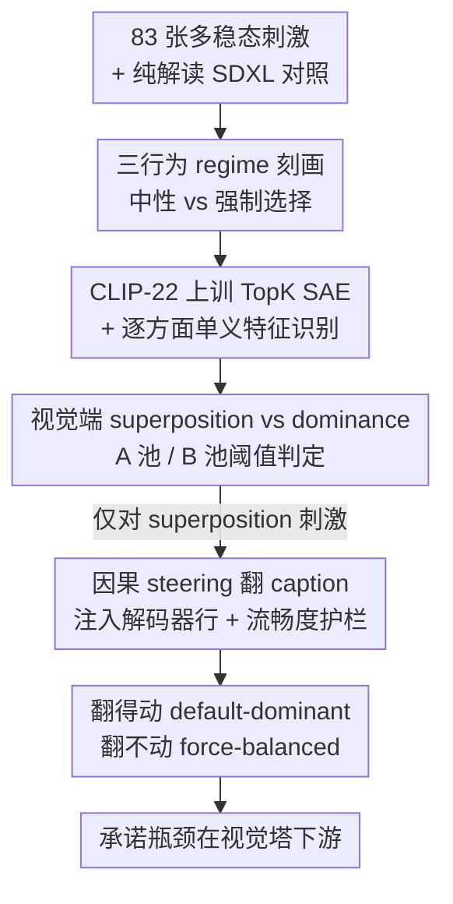

# Vision-Language Asymmetry in Bistable Image Captioning

**会议**: ICML 2026  
**arXiv**: [2606.08031](https://arxiv.org/abs/2606.08031)  
**代码**: 有（作者承诺录用后释出代码/配置/逐刺激结果表）  
**领域**: 可解释性 / 多模态VLM  
**关键词**: 多稳态图像, 视觉-语言不对称, 稀疏自编码器, 因果干预, 看与看作

## 一句话总结
这篇论文用维特根斯坦"鸭兔图"式的多稳态图像当探针，先用 3320 次生成刻画出 LLaVA 的三种行为 regime，再在它实际消费的 CLIP 层训一个 TopK 稀疏自编码器，发现 72% 的多稳态刺激在视觉端会**同时激活两种解读的特征池**（superposition），但因果 steering 只能翻转"默认主导"类刺激、翻不动"强制平衡"的少女/老妇——证明"承诺看作哪一面"的瓶颈不在视觉塔，而在下游的语言解码器。

## 研究背景与动机
**领域现状**：把多稳态/歧义图像（鸭兔、脸-花瓶、少女-老妇、Necker 立方体）喂给 VLM 已有行为基准，普遍发现模型有强烈的"语言先验主导"——同一张图它倾向只报一种解读。但这些工作纯属行为层面：拿生成的 caption 对照标准答案打分，不做任何表示层断言。

**现有痛点**：行为基准告诉你"模型偏向哪一面"，却没法回答**"对某一面的承诺到底在模型的哪一层做出"**。最接近机制的近期工作（AmbiBench）做到注意力头粒度的干预、能提升任务准确率，但它度量的是"干预后准确率涨了多少"，而非"表示承诺定位在哪"。

**核心矛盾**：维特根斯坦在《哲学研究》里区分了"看见一张图（seeing）"和"看作某物（seeing-as）"。一个 Necker 立方体在中性提问"图里是什么"下，LLaVA 40/40 次都给"既不朝上也不朝下"的中性描述；换成"是从上往下看还是从下往上看"的强制选择提问，同一张图却近五五开地承诺到某一面。**同样的输入、不同的提问 → 不同的报告**——这道"看 vs 看作"的缝隙在 VLM 里究竟实现在哪？

**本文目标**：把"中性 vs 强制选择"的提问对比当成一个可控的实验抓手，定位 VLM 里"两种报告之间那道缝隙"的实现位置——是视觉编码器没表示出两种解读，还是表示了但语言端没承诺？

**切入角度**：作者认为多稳态图像是研究"特征竞争"（而非"特征检测"）的最小实验条件——只有能同时支持两种解读的刺激，才谈得上比较"视觉端的叠加"与"语言端的承诺"。

**核心 idea**：在 LLaVA 真正消费的 CLIP 层上训稀疏自编码器，把每种解读拆成可解释的特征池，再用"视觉端是否同时激活两池"对比"语言端能否被 steering 翻转"，从而把"承诺瓶颈"定位到视觉塔下游。

## 方法详解

### 整体框架
目标 VLM 是 LLaVA-1.6-Vicuna-7B（CLIP ViT-L/14-336 + Vicuna 7B），表示分析发生在 LLaVA 实际消费的 **CLIP 第 22 层** patch token 上（丢弃 CLS）。整条流水线分四相串行：Phase 1 用大量采样生成刻画**行为 regime**（中性 vs 强制选择提问），把刺激分成 default-dominant / force-dominant / force-balanced 三类；Phase 2 在 CLIP-22 激活上训 TopK SAE，并为每个解读方面识别出一组**单义特征**；Phase 3 在每张多稳态图上算两个解读的"特征池"激活，判定是 superposition（两池都点火）还是 dominance；Phase 4 把目标解读的 SAE 解码器行当 steering 向量注入 CLIP-22，扫系数看 caption 能否翻转，并用流畅度护栏过滤。caption 一律由 Qwen3-8B 判读（与人工一致率 ≥95%）。

### 关键设计

**1. 三行为 regime：用提问对比把"行为缺席"和"表示缺席"分开**

直接看"模型偏哪面"没法回答机制问题，作者先建一个 3320 次生成（83 张刺激 × 40 次）的行为基线把刺激分层。在中性提问（"图里是什么/描述这张图"）下，平均主导分 $|P(A)-P(B)|=0.558$，38/83 张呈现"主导分 >0.5 且 $P(\text{neither})<0.2$"的经典 **default-dominant**（复现了语言先验偏置）；另有 10 张落在对角——中性提问下 $P(\text{neither})\geq 0.95$，模型拒绝承诺任何一面，只给"一幅黑白线描人像"这种解读无关描述。对这 10 张换成二元强制选择提问（"这是 X 还是 Y"），10/10 全都承诺到某面：7 张非对称承诺（≥70/30，记 **force-dominant**），3 张近五五开（Necker 立方体，记 **force-balanced**）。这个对比的要害是：**行为上的弃权不等于表示上的不可得**——模型其实有解读特异的信息，只是中性提问下不浮现。三类 regime 各自给出一个对 SAE 特征层的不同机制预测，供后两相检验。

**2. CLIP 端 TopK SAE + 逐方面单义特征识别：把每种解读拆成可读特征池**

要在表示层比较"两种解读"，需要把解读落到可解释单元上。作者在 CC3M 的 20 万张图、CLIP 第 22 层 patch 激活上训一个 **TopK SAE**（$k=32$，65536 个特征，验证可解释方差 EV=0.93），并特意自训而非复用预训练 CLIP-Scope——因为后者在 LAION-CLIP 激活上训，在本文多稳态刺激上重建误差比自身 MSE 基线高约 40%，而 LLaVA 消费的是 OpenAI-CLIP，必须分布匹配。识别特征时，对每个分组、每个解读方面 $X\in\{A,B\}$，用**留一法、平局校正**的 AUROC 衡量每个 SAE 特征把"该方面纯解读对照"与"对侧对照"分开的能力，保留留一 AUROC $\geq0.85$ 且 mean-match 激活 $>0.005$（稀疏下限）的特征，再用对 1 万张随机 CC3M patch 的第二个 AUROC 做干扰特异性筛选，按干扰 AUROC 排序、每方面封顶 15 个。这里有个易被忽视的方法学坑：TopK SAE 输出 >99% 稀疏，大量特征列在 0 处平局，`numpy.argsort` 是稳定排序、会按输入行序解平局，从而**悄悄把任何基于秩的统计偏向占据矩阵前排的那一类**——作者改用 `scipy.stats.rankdata(method="average")` 做平局校正，否则一次早期跑会返回约 1.4 万个全部聚在同一特征索引段的"幽灵 B 偏好特征"。

**3. 视觉端 superposition vs dominance：判定两种解读是否在视觉塔同时被表示**

有了特征池后，对每张多稳态刺激算它的 15 个 A 特征与 15 个 B 特征的平均激活（称 A 池、B 池）。"X 池点火"的阈值取**对侧解读对照上观察到的 X 池中位激活**——即对侧类图像凭偶然能产生的激活水平。当两池都超阈值，判为 **superposition**（视觉端叠加）；只有一池超，判为 dominance_X；都不超为 neither。结果是 superposition 成为**主导 regime**：69 张两池都可用的刺激中 50 张（72%）是 superposition，且与行为结果无关——对默认主导的鸭兔 12/12 全是叠加（行为上却全偏"鸭"），对强制平衡的 Necker 13/14、对强制主导的少女-老妇 7/8。这直接说明：**区分三种行为 regime 的东西，不发生在 CLIP-22 的 SAE 特征层**——视觉端早就同时表示了两种解读。

**4. 因果 steering 暴露视觉/语言不对称：把承诺瓶颈定位到视觉塔下游**

最后一相做因果检验。对每张 Phase 3 判为 superposition 的刺激，取目标（非默认）解读 15 个特征的 SAE **解码器行均值**当 steering 向量 $v_X$，在 CLIP-22 patch 残差上加 $\alpha v_X$（前向 hook），扫 $\alpha\in\{2^{-1},\dots,2^4\}$，每个 $\alpha$ 生成一条 caption，成功率 = Qwen3 判为目标解读的比例；只接受困惑度比（相对未 steering caption）$\leq 1.2$ 的 $\alpha$（**流畅度护栏**，防止靠把句子说崩来"翻转"）。三组各对应一种 regime：default-dominant 的鸭兔（基线 91.7% 鸭），朝"兔"steering 在 $\alpha=16$ 达 33.3% 兔、困惑度比 1.06，干净翻转；混合的 hidden_face 双向都能推到 50–60%；但 **force-balanced 的少女-老妇（基线 0%/0%/100% neither），任何 $\alpha$ 都翻不出哪怕一条承诺解读的 caption**——尽管 Phase 3 里它们 7/8 都是视觉端叠加。更关键的是 steering 方向**确实到达了语言模型**（$\alpha=16$ 时 caption 里的发型、帽子、光照等低层视觉描述明显被改写），但语言模型**就是拒绝承诺"年轻"或"年老"**，caption 在整个 $\alpha$ 范围保持解读无关、且在翻转前就先丧失流畅度。结论：**承诺瓶颈位于视觉塔下游的语言解码器**——视觉端的叠加表示与语言端的承诺之间存在一道经验可测的缝隙，正对应"看 vs 看作"的区分。

### 一个完整示例
拿 Necker 立方体（force-balanced 的代表）走一遍：Phase 1 中性提问 40/40 次给"立方体线框图"，零承诺；换强制选择"从上看还是从下看"则近五五开承诺，被归为 force-balanced。Phase 3 在视觉端发现它 13/14 是 superposition——face-up 池和 face-down 池同时点火。Phase 4 把"非默认面"的解码器行注入 CLIP-22、扫 $\alpha$ 到 16，caption 里的线条/视角描述被改写（说明信号确实传到了语言端），但模型始终不肯承诺"朝上/朝下"，且翻转前就先把流畅度护栏顶破。整条链清晰展示：视觉表示有两面、语言承诺翻不动——瓶颈在语言端。

## 实验关键数据

### 主实验
视觉端 superposition 是模态主导 regime（Phase 3，69 张两池可用刺激）：

| 分组 | superposition 比例 | 备注 |
|------|-------------------|------|
| duck_rabbit | 12/12 | 全叠加，行为却全偏"鸭" |
| necker_cube | 13/14 | force-balanced 仍叠加 |
| young_old_woman | 7/8 | force-dominant |
| hidden_face | 10/15 | 混合 |
| face_vase | 7/16 | — |
| schroeder_stairs | 1/4 | 纯 B 对照样本偏少（n=8），最弱情形 |
| **总计** | **50/69（72%）** | superposition 为模态 regime |

### 因果 steering（Phase 4，仅 superposition 刺激）

| 分组（regime） | 基线 | steering 最佳结果 | 困惑度比 | 能否翻转 |
|---------------|------|------------------|---------|---------|
| duck_rabbit（default-dominant） | 91.7% 鸭 | 朝兔 33.3% @α=16 | 1.06 | 能（护栏内） |
| hidden_face（混合） | 30%A/50%B/10%neither | A→60% @α=16 / B→50% @α=8 | 0.99 / 1.04 | 能 |
| young_old_woman（force-balanced） | 0%/0%/100% neither | 任何 α 均 0 承诺 | — | **不能** |

### 关键发现
- **视觉端叠加是常态**：72% 多稳态刺激两个解读特征池同时点火，且与行为 regime 无关——三种行为差异不源自 CLIP-22 特征层。
- **承诺瓶颈在语言端**：能翻 default-dominant、翻不动 force-balanced，且 steering 方向已改写 caption 的低层视觉描述（信号到达语言模型）却换不来解读承诺。
- **流畅度护栏区分"真翻转 vs 说崩"**：只接受困惑度比 ≤1.2 的 α，force-balanced 在翻转前就先破护栏，说明不是没推够力，而是语言端结构性拒绝承诺。
- **平局校正不是细节**：不做 tie-corrected ranking 会凭空冒出约 1.4 万个聚在单一索引段的"幽灵特征"，任何基于秩的 SAE 统计都该警惕这一静默行序偏置。

## 亮点与洞察
- **把哲学命题做成可测实验**：用"中性 vs 强制选择"提问对比，把维特根斯坦"看 vs 看作"的区分变成 100% 弃权→100% 承诺的可测行为缝隙，并落到机制定位上——这是把哲学文献真正机制化的少见尝试。
- **在"模型实际消费的层"上训 SAE**：强调 LLaVA 消费 OpenAI-CLIP 第 22 层、必须分布匹配自训 SAE（复用 LAION 训的会高 40% 重建误差），是一个容易被忽略但决定结论可信度的工程细节。
- **superposition vs dominance 的阈值定义巧妙**：用"对侧解读对照的中位激活"当点火阈值，等于让"偶然可达的激活"成为基准线，比拍脑袋设阈值更有据。
- **方法学警示可复用**：TopK SAE 高稀疏 + `argsort` 稳定排序导致的行序偏置，对所有做 SAE 秩统计的人都是一个该默认开启平局校正的实战教训。

## 局限与展望
- 作者明确 caveat：定位只在**一个 VLM、单次 SAE 训练**上验证，跨模型/跨 SAE 泛化、以及随机特征基线、置换解读基线都留给扩展工作。
- 自己观察：schroeder_stairs 纯 B 对照仅 8 张、superposition 只 1/4，是最弱证据，作者也承认仅为图的完整性而报；样本量小处结论应谨慎。
- 规模偏小：83 张刺激、六个分组，统计功效有限；Qwen3 判读虽与人工 ≥95% 一致，仍是 LLM-as-judge。
- 展望：把"视觉叠加 vs 语言承诺"的缝隙度量推广到更多 VLM 架构，并补上随机/置换基线，才能判断"承诺瓶颈在语言端"是 LLaVA 的特例还是 VLM 的普遍属性。

## 相关工作与启发
- **vs Panagopoulou et al.（多稳态行为基准）**: 他们建 29 图基准、纯行为地证明 12 个 VLM 有语言先验主导，但不做任何表示断言；本文复现其行为偏置后再往下挖一层，给出"叠加在视觉、承诺在语言"的机制定位。
- **vs AmbiBench（Ma et al. 2026）**: 他们用注意力头粒度干预、把 InternVL3-2B 准确率从 29% 提到 42%，度量的是任务准确率提升；本文用 SAE 特征粒度（带逐特征最大激活图证据），度量的是表示承诺定位在哪，关注点不同。
- **vs Pach et al. / Joseph et al.（CLIP-SAE→LLaVA 流水线）**: 他们建立并量化了 SAE 特征可 steering 性（约 10–15% 特征可靠可控）；本文不创新流水线，而是把它用到"表示竞争"——多稳态刺激是研究特征竞争而非特征检测的最小条件。

## 评分
- 新颖性: ⭐⭐⭐⭐⭐ 用多稳态图像把"看 vs 看作"做成机制实验，并把承诺瓶颈干净定位到语言端，视角独到。
- 实验充分度: ⭐⭐⭐ 行为/表示/因果三层闭环且自带平局校正护栏，但只一个 VLM、单次 SAE、刺激规模偏小、缺随机/置换基线。
- 写作质量: ⭐⭐⭐⭐⭐ 哲学动机与机制证据衔接自然，三 regime → 四相结构清晰，caveat 诚实。
- 价值: ⭐⭐⭐⭐ 给"VLM 在哪承诺解读"提供可测抓手，并留下一个可复用的 SAE 秩统计警示。

<!-- RELATED:START -->

## 相关论文

- [\[ACL 2025\] EXPERT: An Explainable Image Captioning Evaluation Metric with Structured Explanations](../../ACL2025/interpretability/expert_an_explainable_image_captioning_evaluation_metric_with_structured_explana.md)
- [\[ICML 2026\] Textual Supervision Enhances Geospatial Representations in Vision-Language Models](textual_supervision_enhances_geospatial_representations_in_vision-language_model.md)
- [\[ICLR 2026\] Cross-Modal Redundancy and the Geometry of Vision-Language Embeddings](../../ICLR2026/interpretability/cross-modal_redundancy_and_the_geometry_of_vision-language_embeddings.md)
- [\[NeurIPS 2025\] Efficient Vision-Language Reasoning via Adaptive Token Pruning](../../NeurIPS2025/interpretability/efficient_vision-language_reasoning_via_adaptive_token_pruning.md)
- [\[ACL 2026\] Learning What Matters: Dynamic Dimension Selection and Aggregation for Interpretable Vision-Language Reward Modeling](../../ACL2026/interpretability/learning_what_matters_dynamic_dimension_selection_and_aggregation_for_interpreta.md)

<!-- RELATED:END -->
