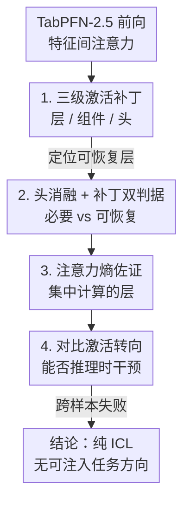

# Where Computation Lives Inside TabPFN: Causal Localisation of Attention Head Function

**会议**: ICML 2026  
**arXiv**: [2606.12917](https://arxiv.org/abs/2606.12917)  
**代码**: 待确认  
**领域**: 机制可解释性 / 表格基础模型  
**关键词**: TabPFN, 激活补丁, 注意力头消融, 注意力熵, 上下文学习

## 一句话总结
本文用激活补丁、消融和注意力熵，第一次对表格基础模型 TabPFN-2.5 做因果级机制分析，发现它三个特征注意力头中有一个头（Head 2）的因果必要性在峰值层比其余头大 2–5×，且峰值层会随任务复杂度迁移，而另两个头则呈对称的晚层模式；同时对比激活转向无法跨样本迁移，揭示纯上下文学习架构里"没有可注入的稳定任务方向"。

## 研究背景与动机
**领域现状**：TabPFN-2.5 在合成的结构因果模型上预训练，靠**上下文学习（in-context learning, ICL）**把预测能力迁移到新的表格任务上，单次前向就能给出预测，性能已能和树模型掰手腕。但它"怎么算出预测的"几乎是黑箱。

**现有痛点**：现有对 TabPFN 的可解释性工作都停留在**事后归因**（post-hoc attribution）——告诉你哪个特征重要，却说不清模型内部哪个组件、在哪一层真正承担了计算。最近虽有工作发现单个神经元对高层概念有选择性响应，但那只是**相关性**证据，不是因果证据。

**核心矛盾**：语言模型和时序 Transformer 上的机制可解释性已经相当成熟（归纳头、函数向量等），但**表格架构上没有任何可比的因果分析**。相关 vs 因果、"信息被编码"vs"信息被使用"这两组区分，在表格基础模型上从没被严格拆开过。

**本文目标**：回答一个具体问题——TabPFN-2.5 的哪些组件对特定计算负有**因果责任**，它们又在哪一层涌现？

**切入角度**：TabPFN 每层有两个串行自注意力——`self_attn_between_items`（跨样本）和 `self_attn_between_features`（跨特征块）。作者只盯**特征间注意力**，因为它是唯一跨特征表示运算的模块，是回归任务里跨特征计算的天然落点。

**核心 idea**：把语言模型机制可解释性的因果工具箱（激活补丁 + 消融 + 注意力熵 + 对比转向）整套搬到表格基础模型上，用"扰动—恢复"的因果干预精确定位每个注意力头的功能和深度。

## 方法详解

### 整体框架
研究对象是 `TabPFNRegressor`：18 层 Transformer，每层 $H=3$ 个注意力头，头维 $d_h=64$，模型维 $d_{\text{model}}=192$。输入是一个带标签的训练集加一个测试样本，标签 $y_i$ 被嵌成最后一个 token，单次前向输出测试标签。作者在两个**合成回归数据集**上，对特征间注意力施加一套自上而下的因果干预，并用多种证据交叉验证。整套分析像一条流水线：先在不同**粒度**（整层 → 组件 → 单个头）做激活补丁定位"信息存在哪"，再用消融测"哪个头去掉就坏"，用注意力熵佐证"哪层在做集中计算"，最后用对比转向测"能不能在推理时干预"。

### 关键设计

**1. 因果激活补丁：从整层到单个头的三级定位**

事后归因说不清"哪个组件因果负责"，本文用**激活补丁**（activation patching）解决：在一次"被污染"的前向里，把某个隐藏激活替换成"干净"前向里对应位置的值，再测输出恢复了多少——恢复得越多，说明这个位置对正确预测越关键。作者按三级粒度扫描：**整层**（替换深度 $\ell$ 处的整条残差流）、**组件**（特征块级，投影后输出）、**注意力头**（在输出投影 $W_O$ 之前替换单个头）。头级补丁的形式是：设 $\hat{V}_\ell\in\mathbb{R}^{B\cdot N\times F\times H\times d_h}$ 为投影前的逐头输出（$F=\lceil d'/3\rceil+1$ 是特征块数），补丁头 $h^*$ 即令 $\hat{V}_\ell[:,:,h^*,:]=\hat{V}_\ell^{\text{clean}}[:,:,h^*,:]$，再过 $W_O$，从而把单个头的因果贡献孤立出来。一个关键的负面发现：**整层补丁在每一层都能恢复约 100%**，说明信息在网络里高度分布式冗余，所以必须下沉到头级才能看出差异。

**2. 消融 + 补丁的双重判据：分清"必要"与"可恢复"**

光看补丁恢复率会被冗余掩盖，所以作者再加一把**消融**（ablation，直接把某头清零看损失变多少）。两者测的是不同的东西：补丁测"信息可恢复性"，消融测"因果必要性"，两者峰值层不一定重合。在乘法数据集上这个区分极其鲜明——Head 2 的消融在第 0 层达到 $0.076\sigma$，比任何其它"头×层"组合大约 $5\times$；而它的补丁峰值却在第 6 层。**"最被需要的层"和"最可恢复的层"是分开的**。相比之下 Head 0、Head 1 的消融效应只有 $0.015\sigma$、$0.016\sigma$，集中在第 12–13 层，呈对称的晚层模式。这种"一个早层主导头 + 两个晚层对称头"的功能分类，正是双判据交叉才能看清的。

**3. 注意力熵作为收敛证据：选择性 ≠ 因果必要性**

为了独立佐证"哪层在做集中计算"，作者算逐头的**归一化注意力熵**——熵越低代表注意力越集中。结果与补丁/消融收敛：Head 2 在第 6 层熵最低（两数据集都是 0.21），在 Pairwise-50 的第 13 层也低（0.31），恰好对应它补丁偏差最大的层。最有意思的反例是：在第 0 层 Head 0 和 Head 2 **同样集中**（熵都约 0.22），但只有 Head 2 有大消融效应，Head 0 的消融效应近乎为零。这直接证明了**"注意力选择性"不等于"因果必要性"**——一个头看起来盯着某些特征，不代表它真在做关键计算，必须靠因果干预而非注意力图来下结论。

**4. 对比激活转向失败：纯 ICL 没有可注入的任务方向**

最后作者测**推理时可操控性**：用对比激活转向（contrastive activation steering，在留出训练划分上算一个方向向量，注入到测试样本看能否改善预测）。结果是该方向**无法跨样本迁移**，在所有钩子位置上对测试 MSE 几乎零改善。作者把这归因于纯 ICL 架构的结构性质：语言模型里 few-shot ICL 由"函数向量头"中介，产生稳定可迁移的任务表示，所以转向有效；而 TabPFN **完全靠上下文依赖的注意力**编码任务关系，没有留下任何可注入的稳定参数方向。这条负结果反过来加深了对前面机制的理解——任务结构是"关系式"地、随上下文动态计算的，不是固化在某个方向里的。

### 损失函数 / 训练策略
本文不训练新模型，是对预训练好的 TabPFN-2.5 做事后机制分析。两个合成数据集：**乘法数据集**每样本三特征 $a,b,c\sim\mathcal{N}(0,1)$，目标 $y=a\cdot b+c$（非线性交互 + 加性项，$d=3$ 便于逐特征观察）；**Pairwise-50 数据集**每样本 50 个特征，目标 $y=\sum_{i=1}^{50}\sum_{j=1}^{50}x_i x_j=\big(\sum_{i=1}^{50}x_i\big)^2$，共 2500 个成对项。补丁主要用 `mean_shift` 污染模式，样本量 $n=512$（部分实验 $n=64$ 验证稳定性）。

## 实验关键数据

### 主实验
两数据集上的头消融效应（$\sigma$，下标为层）与最小注意力熵：

| 头 | 消融·乘法 | 消融·Pair-50 | 熵min·乘法 | 熵min·Pair-50 |
|------|------|------|------|------|
| Head 0 | 0.015 (L13) | 0.023 (L15) | 0.220 | 0.220 |
| Head 1 | 0.016 (L12) | 0.035 (L17) | 0.610 | 0.636 |
| **Head 2** | **0.076 (L0)** | **0.074 (L16)** | **0.216 (L6)** | **0.216 (L6)** |

补丁恢复（signed）关键数据：

| 数据集 | 头 | 峰值层 | 恢复率 | 说明 |
|--------|----|--------|--------|------|
| 乘法 | Head 0 / 1 / 2 | L13 / L12 / L6 | 0.228 / 0.196 / 0.228$\sigma$ | 三头补丁恢复相近 |
| Pair-50 | Head 0 | L5 | +13.2% | 正号恢复 |
| Pair-50 | Head 1 | L17 | −25.5%（绝对值） | 负号，干扰而非恢复 |
| Pair-50 | Head 2 | L13 | −18.5%（绝对值） | 负号，但 L13 熵最低仍是活跃层 |

### 消融实验

| 配置 / 观察 | 关键指标 | 说明 |
|------|---------|------|
| Head 2 消融 @ L0（乘法） | 0.076$\sigma$ | 比任何头×层大约 5× |
| Head 2 消融 @ L0，$n=64$ vs $512$ | 0.078 vs 0.076$\sigma$ | 峰值稳定，非单批次假象 |
| Head 0 @ L0 选择性 vs 因果 | 熵 0.22 / 消融≈0 | 选择性不蕴含因果必要性 |
| Head 2 跨任务峰值幅度 | 0.074–0.076$\sigma$ | 幅度一致，但峰值层 L0→L16 迁移 |

### 关键发现
- **功能定位最强证据是 Head 2**：它的峰值消融幅度跨任务高度一致（0.074–0.076$\sigma$），但峰值层从乘法的 L0 漂到 Pairwise-50 的 L16，作者审慎地把它归因于任务复杂度，但强调"两个数据集不足以确立为普遍性质"。
- **负号恢复要小心解读**：Head 1@L17、Head 2@L13 虽绝对偏差大却是负号——把干净激活替进去反而**打乱**了被污染前向的计算，说明这些深度前向已经发散；但 Head 2 在 L13 的熵最小值仍标出它是计算活跃层。
- **转向跨样本零改善**：是本文最有思想性的发现——它把 TabPFN 的 ICL 机制和 LLM 的函数向量机制对立起来，解释了为何表格基础模型不像 LLM 那样好"操控"。

## 亮点与洞察
- **第一次把因果机制工具箱搬上表格基础模型**：补丁、消融、熵、转向四件套整套迁移，填了"LLM/时序有、表格没有"的空白，方法论上是开创性的。
- **"选择性 ≠ 因果必要性"的干净反例**：Head 0 和 Head 2 在 L0 注意力同样集中，但只有 Head 2 消融掉点——这是对"用注意力图当解释"这一常见做法的有力警告，可迁移到任何注意力架构的解释工作。
- **补丁峰值层 ≠ 消融峰值层**：明确区分"可恢复性"和"必要性"两种因果量，提醒读者单看一种干预会被分布式冗余误导（整层补丁 100% 恢复就是陷阱）。
- **负结果当正结果用**：转向失败被升华成对 ICL 架构本质的洞察，而不是被藏起来。

## 局限与展望
- **作者承认的核心局限**：只有两个合成数据集，不足以把观察到的"头功能分类"确立为 TabPFN-2.5 的普遍性质；Head 2 峰值层 L0 vs L16 的迁移究竟是真·任务复杂度依赖还是这两个任务的假象，需要扩到更广的合成函数族（正弦、多项式、指数）才能判定。
- **缺直接注意力权重可视化**：L6、L13 上 Head 2 到底注意哪些特征块对，文中只给了逐层选择性证据，没给出注意力权重图，机制账还不够细。
- **未覆盖真实数据与分类任务**：全部是合成回归，泛化到真实表格和分类是重要的后续方向。
- **自己的观察**：$\sigma$ 量级（0.07 左右）本身偏小，"5×"是相对其它头而言；绝对效应是否在更难任务上仍显著、会不会被噪声淹没，值得追问。

## 相关工作与启发
- **vs LLM 机制可解释性（归纳头 / 函数向量 Todd et al.）**：他们在语言模型里找到稳定可迁移的任务方向使转向可行；本文证明 TabPFN 因纯 ICL 没有这种方向，转向失效——这是表格架构和 LLM 的本质差异。
- **vs TabPFN 事后归因（Grinsztajn et al. / Rundel et al.）**：他们做特征重要性等相关性归因；本文用因果干预定位组件和层，回答"哪里、怎么算"。
- **vs Knauer & Rodner (2026)**：他们发现神经元对高层概念有选择性的相关证据，正是本文"做因果调查"的动机来源。
- **vs 时序 Transformer 可解释性**：方法工具同源（补丁/消融），但本文是首个把它落到表格基础模型的工作。

## 评分
- 新颖性: ⭐⭐⭐⭐⭐ 首个表格基础模型的因果机制分析，填补明确空白。
- 实验充分度: ⭐⭐⭐ 工具交叉验证扎实，但仅两个合成数据集、效应量级偏小，作者也坦承不足以确立普遍性。
- 写作质量: ⭐⭐⭐⭐⭐ 对"相关 vs 因果""必要 vs 可恢复"的区分极其清晰，负结果诚实且有洞察。
- 价值: ⭐⭐⭐⭐ 方法论可直接复用，"选择性≠因果必要性"和 ICL 不可转向是有传播价值的结论。

<!-- RELATED:START -->

## 相关论文

- [\[NeurIPS 2025\] Causal Head Gating: A Framework for Interpreting Roles of Attention Heads in Transformers](../../NeurIPS2025/interpretability/causal_head_gating_a_framework_for_interpreting_roles_of_attention_heads_in_tran.md)
- [\[ICML 2026\] How Few-Shot Examples Add Up: A Causal Decomposition of Function Vectors in In-Context Learning](how_few-shot_examples_add_up_a_causal_decomposition_of_function_vectors_in_in-co.md)
- [\[CVPR 2026\] CIGMA: Causal Information-Gain Mechanistic Attribution of Attention Heads in Vision Transformers](../../CVPR2026/interpretability/cigma_causal_information-gain_mechanistic_attribution_of_attention_heads_in_visi.md)
- [\[AAAI 2026\] Attention Gathers, MLPs Compose: A Causal Analysis of an Action-Outcome Circuit in VideoViT](../../AAAI2026/interpretability/attention_gathers_mlps_compose_a_causal_analysis_of_an_action-outcome_circuit_in.md)
- [\[ICLR 2026\] Decomposing LLM Computation with Jets](../../ICLR2026/interpretability/decomposing_llm_computation_with_jets.md)

<!-- RELATED:END -->
