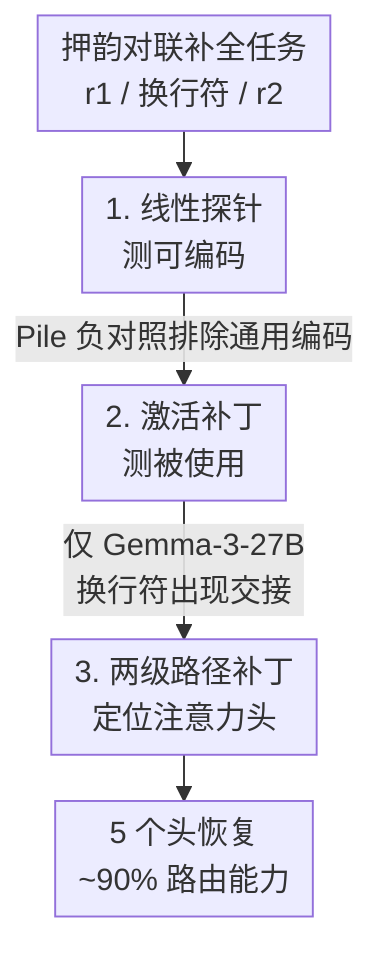

# Where's the Plan? Locating Latent Planning in Language Models with Lightweight Mechanistic Interventions

**会议**: ICML 2026  
**arXiv**: [2605.07984](https://arxiv.org/abs/2605.07984)  
**代码**: 待确认  
**领域**: 机制可解释性 / 大语言模型 / 潜在规划  
**关键词**: 潜在规划, 激活补丁, 线性探针, 路径补丁, 注意力头定位

## 一句话总结
本文用"押韵对联补全"作为前瞻性约束的干净测试，只靠线性探针和激活补丁这两个轻量工具，在 Qwen3 / Gemma-3 / Llama-3 三大模型族十余个尺度上研究"规划点形成"：探针发现关于未来韵脚的信息在换行符处线性可解码且随规模增强，但激活补丁显示**只有 Gemma-3-27B 才真正因果依赖这个编码**——它在约第 30 层出现因果驱动从韵词向换行符迁移的"交接"，其余模型全程只依赖韵词；最终把这个交接定位到 5 个注意力头，恢复了换行符处约 90% 的韵脚路由能力。

## 研究背景与动机
**领域现状**：自回归语言模型逐 token 生成，却能产出需要长程结构一致性的文本（如押韵对联：第二行末词要和第一行末词押韵）。一个自然的问题是——模型是否在内部形成了关于**未来输出**的表示，并因果地驱动了生成，而这一切对行为评测完全不可见？作者把它叫做**潜在规划（latent planning）**。

**现有痛点**：与思维链不同（中间步骤可观察），潜在规划完全藏在隐藏激活里。已有工作证明"规划兼容的信息"存在于某些模型中，但都没回答更具体的问题——规划信息在前向过程中**究竟住在哪个位置**，它会不会**迁移**？作者称之为**规划点形成（planning site formation）**。

**核心矛盾**：要严格研究规划点，必须同时给出**编码证据**（什么信息在场）和**因果证据**（什么信息被用上）。探针能测"编码了什么"，但足够灵活的探针会靠记标签作弊，达到高准确率却不反映真实表示；而真正能确立因果的工具——训练 transcoder 建特征电路——计算昂贵（等于第二次训练），且只在 Claude 这类闭源模型上做过，难以扩到新的开源架构。

**本文目标**：定义两个层次的证据——较弱的**规划兼容表示**（探针可测）和较严的**因果活跃规划点**（激活补丁确立），用最轻量的工具在多个开源模型族、多个尺度（最大 70B）上系统刻画规划点形成。

**切入角度**：押韵对联是前瞻性约束的"干净测试"——第二行的韵脚 $r_2$ 必须和第一行末词 $r_1$ 押韵，这个约束在生成 $r_2$ 之前很久就已确定，是观察"未来 token 表示何时何地形成"的理想探针。

**核心 idea**：用"线性探针 + 激活补丁"替代昂贵的 transcoder，把"信息被编码"和"信息被使用"严格拆开，揭示二者**可解离**——探针有信号 ≠ 存在真正的规划点。

## 方法详解

### 整体框架
作者把换行符 token（第一行结尾的 `\n`）设为相对位置 0，位置 $i$ 表示换行符前（负）或后（正）第 $i$ 个 token。$r_1$ 是第一行末词，$r_2$ 是待生成的第二行韵脚。整套方法是一条"从弱到强"的证据链：先用**线性探针**测某位置 $(i,\ell)$ 能否解码出未来韵脚 $r_2$（规划兼容表示），再用**激活补丁**测该位置的隐藏态是否因果驱动生成（因果活跃规划点），一旦发现 Gemma-3-27B 存在换行符规划点，就用**两级路径补丁**把它定位到稀疏的几个注意力头。

### 关键设计

**1. 押韵对联：把"前瞻性约束"做成可测的潜在规划探针**

潜在规划最难的是没有干净的观测信号，作者用押韵对联巧妙解决：给定含 $r_1$ 的上文，模型要生成一个 $r_2$ 与 $r_1$ 押韵的第二行。$r_2$ 平均在换行符后 8 个 token 才出现，这个"先确定约束、很久后才落地"的结构正好暴露"未来表示何时形成"。作者据此给出两个层次的定义：若 $r_2$ 能从 $\mathbf{h}_{\ell,i}$ 通过探针在位置 $i$ 比别处**显著更好地解码**，则 $(i,\ell)$ 含**规划兼容表示**；若在生成时把 $\mathbf{h}_{\ell,i}$ 替换成针对另一韵族的运行结果，能**显著把输出重定向**到那个韵族，则 $(i,\ell)$ 是**因果活跃规划点**。两个定义一弱一强，是全文的判据基石。

**2. 线性探针测"可编码"：带负对照，区分主动规划与被动累积**

探针是参数化函数 $f_{(W,b)}(\mathbf{h})=\text{softmax}(W\mathbf{h}+\mathbf{b})$，交叉熵训练（AdamW，lr $10^{-4}$，weight decay $10^{-3}$，batch 32，10 epoch），并报告 Wilson 95% 置信区间防止过解读。关键是**负对照**：先在 The Pile 通用文本上训探针预测 $k$ 步后的 token，发现准确率随 $k$ 单调下降、$k=8$ 时与 unigram 基线重合——证明规划兼容表示不是残差流的通用特征。再在对联上训探针预测 $r_2$，发现换行符（$i=0$）和末词（$i\le -1$）处的探针**远超** $i>0$ 处，且与 $k=8$ 的 Pile 探针拉开巨大差距。这个对照排除了"探针只是记 token 频率"的平凡解释，把信号坐实为任务特异的。

**3. 激活补丁测"被使用"：发现 Gemma-3-27B 的"表示交接"**

探针的根本局限是"线性可解码 ≠ 因果驱动生成"。激活补丁直接解决：给一个自然导向干净韵族 $\mathcal{R}^{(c)}$ 的提示，把某位置激活替换成针对污染韵族 $\mathcal{R}^{(r)}$ 的运行值，看生成是否被推向 $\mathcal{R}^{(r)}$。作者在末词位（Qwen/Llama 的 $i=-1$、Gemma 因逗号分词在 $i=-2$）和换行符位（$i=0$）逐层扫描。结果出人意料地分裂：**只有 Gemma-3-27B** 在约第 30 层出现**表示交接（representational handoff）**——末词补丁在早层极有效但 L30 附近骤降，换行符补丁同时升起，在 L33 达到污染韵脚率峰值 0.63；而 Qwen3-32B 和 Llama-3.1-70B **全程**只在末词有效、换行符近乎为零，尽管它们在换行符也有强探针信号。换转向向量干预也得同样三模型画面。这就是全文最重要的结论：**编码与使用可解离，探针有信号不等于存在规划点**。

**4. 两级路径补丁：把交接定位到 5 个稀疏注意力头**

确认 Gemma-3-27B 在换行符成点后，作者追问能否归到少数头。单头补丁对任何单个头都无可测信号，说明表示不在单一电路元件。于是用**注意力权重当代理**：抽取换行符（$i=0$）到末词（$i=-2$）的注意力权重，在 L27–45 排序，发现极度集中在三个头——L30H4（权重≈0.99）、L28H14（≈0.97）、L28H15（≈0.95）。**简单 top-$k$ 补丁**：$k=5$ 时污染韵脚率跳到 46%（满残差参考 63% 的 73%）。但简单补丁会注入冲突上下文，于是用更严的**两级路径补丁**只孤立 $i{=}-2\to\text{头}\to i{=}0\to\text{输出}$ 这条路径：第一阶段只替换 $i=-2$ 残差并缓存候选头在 $i=0$ 的输出，第二阶段把这些缓存输出替进未修改的干净前向。这样 5 个头在 $k=5$ 恢复 57%，达满残差参考的 **90%**——几乎全部韵脚路由能力集中在这 5 个头；而对应的 MLP 补丁在每个 $k$ 都是零，证明交接由注意力而非前馈中介。

### 损失函数 / 训练策略
不训练模型本体，只训轻量线性探针（见设计 2 超参）。数据：Pile 负对照 1200 条序列（1000 训 / 200 验）；押韵对联用 Claude Sonnet 4.6 合成 1200 条（1000 训 / 200 验），策略性提示多样化主题与韵式。补丁每层每提示对取 $N=20$ 随机样本，主图按 5 个提示对平均（$N=100$），以提示对为独立单元报告 95% cluster bootstrap 区间（10000 次对级重采样）。

## 实验关键数据

### 主实验
换行符 vs 首生成位探针的最大准确率差（随规模增长）：

| 模型族 | 小尺度 gap | 大尺度 gap | 趋势 |
|--------|-----------|-----------|------|
| Gemma-3 | 0.11 (1B) | 0.38 (27B) | 每个尺度都 >0，最干净的单调上升 |
| Qwen3 | 0.6B–8B 的 CI 含 0 | 最大尺度明显非零 | 随规模涌现 |
| Llama-3 | 1B–8B 的 CI 含 0 | 70B 明显非零 | 随规模涌现 |

激活补丁——三模型的因果画面：

| 模型 | 末词补丁 | 换行符补丁 | 结论 |
|------|---------|-----------|------|
| **Gemma-3-27B** | 早层高，L30 骤降 | L30 升起，L33 峰值 **0.63** [0.48, 0.78] | 出现 L30 表示交接 |
| Qwen3-32B | 全层高 | 近零 | 全程依赖末词 |
| Llama-3.1-70B | 全层高 | 近零 | 全程依赖末词 |

### 消融实验
Gemma-3-27B 注意力头定位（满残差参考 = 63%）：

| 干预 | $k=5$ 污染韵脚率 | 占满残差参考 | 说明 |
|------|------|------|------|
| 简单 top-$k$ 补丁 | 46% | 73% | $k=1,2,3$ 近零，$k=5$ 起跳 |
| 两级路径补丁 | 57% | **90%** | 孤立 $i{=}-2\to$头$\to i{=}0$ 路径 |
| 随机 / 逗号对照头 | 0% | 0 | 所有 $k$ 均为零 |
| MLP top-$k$ 补丁 | 0% | 0 | 上界 ≤0.04，交接由注意力中介 |

### 关键发现
- **5 个头是**：(L30,H4)、(L28,H14)、(L28,H15)、(L30,H5)、(L28,H29)；路径补丁在 $k=5$ 取峰值，$k=10/15$ 反降到 47%/32%，说明能力精确集中在这 5 个，多加反而稀释。
- **负号补丁的物理意义**：把干净激活替进去反而打乱了被污染前向（参看姊妹工作的发散），但熵/补丁仍能标出活跃层。
- **架构之谜**：所有 Qwen3 和 Llama-3 即便有强探针信号也不出现交接——是什么让 Gemma-3-27B 在架构或训练上与众不同，是开放问题。

## 亮点与洞察
- **"编码 ≠ 使用"的干净拆解**：探针有信号但补丁零因果，是对"用探针准确率当解释"这一普遍做法的有力警告——可直接迁移到任何探针式可解释性研究。
- **轻量工具撬动大模型**：只用线性探针 + 激活补丁，不训 transcoder、比转向向量省得多的数据，就在 70B 级模型上做出电路级定位，方法可扩展性强。
- **"表示交接"是个新原语**：因果驱动从韵词向换行符迁移，且只在特定规模/架构涌现，把"规划点形成"刻画成一个结构化、可定位的涌现现象，而非弥散属性。
- **押韵对联当探针很巧**：用一个语言学上干净、约束明确的任务，把抽象的"潜在规划"变成可补丁、可定位的可测对象。

## 局限与展望
- **作者承认的局限**：只在三个模型族、单一结构化生成任务上做；推广到散文、代码补全、多步推理才能判断"表示交接"是通用规划原语还是窄的语音学现象。
- **统计区间偏宽**：路径补丁定位的 5 头恢复比例上界越过 1.0，反映提示对太少；更大更多样的对联集才能收紧并看头集是否随韵族变化。
- **架构差异未解释**：为何只有 Gemma-3-27B 成点，缺乏机制性回答。
- **自己的观察**：换行符依赖逗号分词放在 $i=-2$，这种对分词的敏感性提示结论可能部分依赖具体 tokenizer；另外"因果活跃"是通过补丁注入测的，自然生成时这 5 个头是否真被读取（vs 仅人为注入才显效），作者也列为待解。

## 相关工作与启发
- **vs transcoder / 特征电路（Lindsey et al. on Claude 3.5 Haiku）**：他们做细粒度电路但需第二次训练、只在闭源模型上；本文用轻量补丁在多开源模型上达到电路级定位，且独立复现了"规划点迁移到换行符"。
- **vs 转向向量（Maar et al. 2026）**：他们发现 30B 以内多数开源模型规划点停在末词；本文用更省数据的补丁得同结论，并进一步定位到 5 个头。
- **vs 棋类/Othello 内部表示（Li / Nanda / Jenner）**：他们在结构化棋盘域证明可线性操控的内部规划表示；本文把这类问题迁移到开放式语言生成。
- **vs 探针式可解释性（Hewitt & Liang）**：继承其"探针会作弊"的警惕，用因果补丁补足探针测不到的"是否被使用"。

## 评分
- 新颖性: ⭐⭐⭐⭐⭐ 首次系统刻画"规划点形成"并发现"表示交接"涌现现象。
- 实验充分度: ⭐⭐⭐⭐ 三族十余尺度 + 负对照 + 路径补丁，扎实；但提示对少、CI 偏宽，任务单一。
- 写作质量: ⭐⭐⭐⭐⭐ "编码 vs 使用""弱/强定义"区分清晰，负结果诚实有洞察。
- 价值: ⭐⭐⭐⭐⭐ 方法轻量可扩展，"探针有信号≠有规划点"对可解释性与 AI 安全都有传播价值。

<!-- RELATED:START -->

## 相关论文

- [\[ICLR 2026\] Internal Planning in Language Models: Characterizing Horizon and Branch Awareness](../../ICLR2026/interpretability/internal_planning_in_language_models_characterizing_horizon_and_branch_awareness.md)
- [\[ACL 2026\] Preference Heads in Large Language Models: A Mechanistic Framework for Interpretable Personalization](../../ACL2026/interpretability/preference_heads_in_large_language_models_a_mechanistic_framework_for_interpreta.md)
- [\[ICLR 2026\] SALVE: Sparse Autoencoder-Latent Vector Editing for Mechanistic Control of Neural Networks](../../ICLR2026/interpretability/salve_sparse_autoencoder-latent_vector_editing_for_mechanistic_control_of_neural.md)
- [\[AAAI 2026\] SparseRM: A Lightweight Preference Modeling with Sparse Autoencoder](../../AAAI2026/interpretability/sparserm_a_lightweight_preference_modeling_with_sparse_autoencoder.md)
- [\[ACL 2025\] Mechanistic Interpretability of Emotion Inference in Large Language Models](../../ACL2025/interpretability/mechanistic_interpretability_of_emotion_inference_in_large_language_models.md)

<!-- RELATED:END -->
