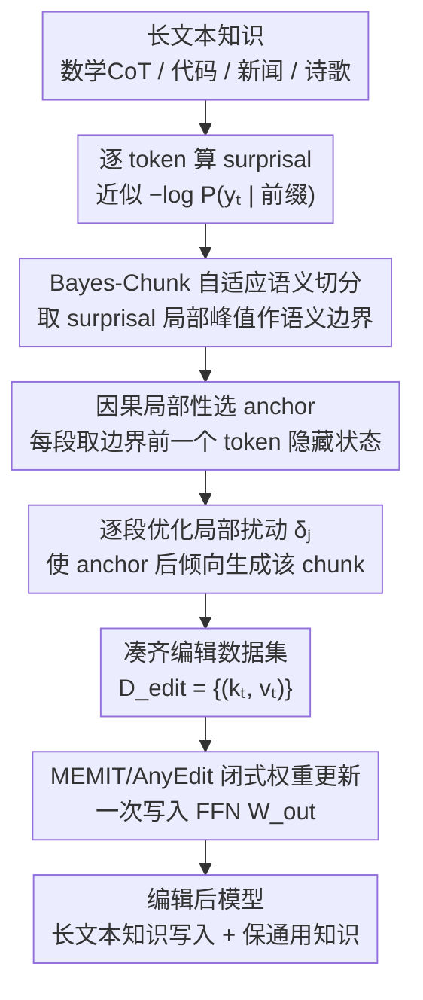

# AnyEdit++: Adaptive Long-Form Knowledge Editing via Bayesian Surprise

**会议**: ICML 2026  
**arXiv**: [2606.01053](https://arxiv.org/abs/2606.01053)  
**代码**: 论文称 GitHub 可用，但本地缓存未包含具体 URL  
**领域**: 知识编辑 / 长文本知识编辑  
**关键词**: 贝叶斯惊讶, 自适应分块, 长文本知识编辑, 结构独立性, 因果局部性  

## 一句话总结
AnyEdit++ 用 token 级 Bayesian Surprise 找到长文本中的语义转折点，把 AnyEdit 的固定窗口切分改成结构感知的 Bayes-Chunk，并在数学、代码、新闻、诗歌等长文本知识编辑任务上稳定提升 BLEU 与 BERT Score。

## 研究背景与动机
**领域现状**：知识编辑希望在不重新训练整个大模型的前提下，把某条事实或一段知识写入模型参数，同时尽量不破坏无关知识。ROME、MEMIT、AlphaEdit 这类 locate-and-edit 方法通常把编辑定位到若干关键层的 FFN 输出矩阵，通过优化一个局部扰动或目标 value，让模型在看到特定 subject / relation 时生成新的 object。

**现有痛点**：这套范式在三元组事实上很自然，但面对数学推导、代码片段、新闻叙事、诗歌等长文本知识时会遇到容量瓶颈。长文本不是一个单点事实，而是一串有内部依赖的语义单元；如果仍然把整段知识压进一个扰动向量，模型很容易出现生成坍塌、逻辑链断裂或只记住局部片段。

**核心矛盾**：AnyEdit 已经把长文本编辑拆成自回归的多段编辑，用多个 anchor key 和扰动共同写入模型权重，缓解了单点编辑的长度限制。但 AnyEdit 的分段方式是固定窗口切分，窗口边界不理解语义结构，可能把函数定义、数学条件、结论或叙事转折硬切开。这样得到的 anchor key 既可能语义含混，也可能与相邻片段高度相关，导致多个编辑在同一个权重更新里互相干扰。

**本文目标**：作者要解决的不是重新设计整套知识编辑算法，而是回答长文本编辑中的两个更细的问题：第一，长文本应该在哪里切分，才能让每个片段更独立；第二，切分之后应该把编辑控制信号注入到哪个位置，才能更有效地影响后续生成。

**切入角度**：论文观察到，语言模型读一段文本时，内部信念状态并非平滑移动；在新论点、新事件、代码结构切换或推理跳步处，模型对下一个 token 的预期会发生明显变化。Bayesian Surprise 正好可以量化这种“信念被改写”的强度，因此高惊讶点天然适合作为语义边界。

**核心 idea**：用模型自身的 token 级惊讶值替代固定窗口长度，把长文本切成更符合语义转折的片段，并把编辑扰动放在高惊讶片段的前一个 token 上，从而降低跨片段 crosstalk、增强局部控制。

## 方法详解

### 整体框架
AnyEdit++ 要解决的是“长文本到底应该在哪切、编辑信号又该注入到哪”，但它没有重写整套编辑器，而是保留 AnyEdit 的自回归编辑和 MEMIT 式闭式权重更新，只把“如何切段”和“如何选 anchor”换成结构感知的版本，像一个 plug-and-play 的分段模块。具体流程是：模型先在原始长文本（数学 CoT、代码、新闻或诗歌）上逐 token 算 surprisal，得到一条信息密度曲线，Bayes-Chunk 取曲线局部峰值作为语义边界把文本切成若干 chunk；对第 $j$ 个 chunk，系统用边界前一个 token 的隐藏状态当 anchor，在目标层优化局部扰动 $\delta_j$ 让模型在该 anchor 后倾向生成当前 chunk；所有 chunk 的 key-value 目标对凑齐后，再用 MEMIT/AnyEdit 的多编辑闭式更新一次性写进权重矩阵。

放回 locate-and-edit 的语境看：标准方法构造一个 key $k$ 和目标 value $v^*$，更新 FFN 输出矩阵 $W_{out}$ 让 $W_{out}k$ 逼近 $v^*$；AnyEdit 把它扩展成多段，第 $t$ 段有各自的 anchor key $k_t$ 和扰动 $\delta_t$，最终形成编辑数据集 $D_{edit}=\{(k_t,v_t)\}_{t=1}^{M}$。AnyEdit++ 不动这个求解器，只让 $k_t$ 来自语义边界而非固定窗口末端。

### 关键设计

**1. Bayes-Chunk 自适应语义切分：让边界长在信息跃迁处**

固定窗口只保证每段长度相近，却会把函数定义、数学条件、结论或叙事转折硬生生切断，这是 AnyEdit 的薄弱环节。Bayes-Chunk 的做法是把切分权交给模型自己的信念变化：模型处理前缀 $y_{<t}$ 时持有先验信念分布 $\pi_t$，看到 $y_t$ 后更新为 $\pi_{t+1}$，理论上的 Bayesian Surprise 即 $D_{KL}(\pi_{t+1}\|\pi_t)$，实践中用信息惊讶值 $S(y_t)\approx -\log P(y_t|y_{<t};\theta)$ 近似。论证转折、代码结构切换、叙事新事件这类位置往往对应 surprisal 曲线的高峰，于是 Bayes-Chunk 取这些局部峰值并按位置排序形成边界集合 $B=\{b_1,\ldots,b_M\}$，切出的片段内部更一致、彼此更可区分，而且不需要额外训练边界检测器，只靠目标模型的一次概率扫描即可。

**2. 结构独立性：让多段 anchor key 趋于正交以压低 crosstalk**

多段编辑的闭式更新本质是多个 rank-1 更新叠加，片段之间会互相干扰。论文给出的 crosstalk bound 表明，第 $j$ 个片段受其他片段干扰的上界正比于 $\sum_{t\neq j}\|\delta_t\|_2\cdot |k_t^T A k_j|$，其中 $A$ 是预训练统计对应的 precision matrix——一旦两个片段的 key 相似度高，求解器就难以区分它们，导致覆盖或串扰。Bayes-Chunk 恰好让片段在语义 embedding 和真实 anchor key 空间里都更分散，论文在 EditEverything 上测得平均跨片段相似度从固定窗口的 0.594 降到 0.509，并用 key heatmap 展示了更弱的 off-diagonal 相关性，从机理上解释了语义边界为何能让长文本多段编辑更稳。

**3. 因果局部性：把扰动放在高惊讶片段的前驱 token**

切好段之后还要决定编辑信号注入哪个位置。论文定义位置可控性 $\kappa(i\to t)=\|\nabla_{h_i}L(y_t)\|_2$ 来衡量位置 $i$ 对目标 token $y_t$ 的影响：在 Transformer 残差流里，从 $t-1$ 向上反传是近似保幅的“垂直通道”，而从更早的 $t-k$ 影响目标 token 必须穿过 attention 的权重分配、信号会被上下文稀释，因此对任意 $k>1$ 有 $\Delta\kappa_k=\kappa(t-1\to t)-\kappa(t-k\to t)>0$。高 surprisal token 正是语义轨迹即将转弯的点，它前一个 hidden state 就是最直接的控制入口，把扰动放在这里比在远处历史 token 上施力更省参数、副作用更小，也契合 AnyEdit“上一段末尾控制下一段生成”的逻辑。

### 损失函数 / 训练策略
优化分两层。局部层面，对每个 Bayes-Chunk 片段优化扰动 $\delta_t$，使加扰后的 FFN 输出在条件化前序片段和已优化历史扰动的前提下，最大化当前 chunk 的生成概率。全局层面，把所有 $(k_t,v_t)$ 目标对塞进 MEMIT 式最小二乘更新，一边满足编辑片段，一边用协方差统计 $C$ 约束保持通用知识。为公平比较，AnyEdit 和 AnyEdit++ 都以 MEMIT 作基础编辑算法；作者还把 Bayes segmentation 接到 FT-UKE 上，验证它不只服务于 MEMIT 路线。

## 实验关键数据

### 主实验
论文主要使用 EditEverything、UnKE、CounterFact 三类数据集。EditEverything 覆盖数学、代码、物理、化学、生物、新闻、诗歌七个长文本领域；UnKE 和 CounterFact 则用于检验方法在传统非结构化问答和事实编辑 benchmark 上是否仍然有效。指标采用 BLEU 和基于 all-MiniLM-L6-v2 的 BERT Score，前者偏重表面匹配，后者偏重语义相似度。

| 模型 | 方法 | EditEverything 平均 BLEU | EditEverything 平均 BS | 相对 AnyEdit 的主要变化 |
|------|------|--------------------------|-------------------------|--------------------------|
| Llama-3.1-8B-Instruct | MEMIT | 42.61 | 82.74 | 传统三元组编辑器明显不足 |
| Llama-3.1-8B-Instruct | AnyEdit | 72.64 | 94.23 | 固定窗口长文本编辑已经显著提升 |
| Llama-3.1-8B-Instruct | AnyEdit++ | 75.00 | 94.50 | BLEU +2.36，BS +0.27 |
| Llama-2-7B | AnyEdit | 42.30 | 86.33 | 较弱模型上固定窗口更脆弱 |
| Llama-2-7B | AnyEdit++ | 50.13 | 87.66 | BLEU 接近 +8，BS +1.33 |
| Qwen-2.5-7B-Instruct | AnyEdit | 81.81 | 95.28 | 强推理模型上 baseline 已较强 |
| Qwen-2.5-7B-Instruct | AnyEdit++ | 85.33 | 96.29 | BLEU +3.52，BS +1.01 |

这张表最重要的信息不是单个数字，而是提升模式：AnyEdit++ 在三个模型上都超过 AnyEdit，且在 Llama-2-7B 这种更容易被长文本编辑压垮的模型上收益最大。论文还特别指出，Math 和 Code 类别的收益更明显；例如 Code 类别中，Llama-2-7B 上 AnyEdit++ 比 AnyEdit 高将近 20 个 BLEU 点，说明结构化、强逻辑文本更需要语义感知分块。

| 方法 | UnKE BLEU | UnKE BS | CounterFact BLEU | CounterFact BS | 平均 BLEU | 平均 BS |
|------|-----------|---------|------------------|----------------|-----------|---------|
| MEMIT | 24.76 | 76.50 | 32.21 | 75.79 | 28.49 | 76.15 |
| AlphaEdit | 21.34 | 73.86 | 23.51 | 72.42 | 22.43 | 73.14 |
| AnyEdit | 79.02 | 95.88 | 86.27 | 97.85 | 82.65 | 96.87 |
| AnyEdit++ | 81.57 | 96.03 | 90.69 | 98.29 | 86.13 | 97.16 |

Reference benchmarks 说明 AnyEdit++ 不只是针对 EditEverything 调参。即便在更接近传统知识编辑的数据上，Bayes-Chunk 也没有损害基础编辑能力，平均 BLEU 从 AnyEdit 的 82.65 提升到 86.13，BERT Score 也小幅上升到 97.16。

### 消融实验
论文没有把 Bayes-Chunk 的每个内部步骤做成标准 w/o 表，但提供了两类很关键的分析：结构独立性分析和把 Bayes segmentation 接到 FT-UKE 的 plug-and-play 验证。

| 分析项 | 固定窗口 / 原方法 | Bayes-Chunk / 加入 Bayes 后 | 说明 |
|--------|-------------------|------------------------------|------|
| EditEverything 跨片段平均语义相似度 | 0.594 | 0.509 | Bayes-Chunk 切出的片段更独立，理论上更少 crosstalk |
| Llama-3.1-8B 上 FT-UKE 平均 BLEU / BS | 99.90 / 99.99 | 99.95 / 99.99 | 原方法已接近饱和，Bayes segmentation 仍有微小增益 |
| Qwen-2.5-7B 上 FT-UKE 平均 BLEU / BS | 99.52 / 99.93 | 99.57 / 99.96 | 表明分段策略可迁移到 fine-tuning-based editing |
| QwQ-Edit 长 CoT 数学数据 | AnyEdit 作为对照 | AnyEdit++ 在长度和逻辑密度分组上均更高 | 越长、越强逻辑的数据越能体现结构切分价值 |

### 关键发现
- Bayes-Chunk 的收益与文本结构强度相关。数学推导和代码生成中，固定窗口更容易切断条件、缩进、函数定义或结论，因此自适应边界带来的提升更大。
- BERT Score 的提升普遍小于 BLEU，因为 AnyEdit 已经能保持相当高的语义相似度；AnyEdit++ 更明显改善的是精确生成和结构细节。
- 结构独立性实验为方法提供了比普通 case study 更强的证据：如果 anchor key 的相似度降低，多段编辑的闭式更新确实更不容易互相覆盖。
- QwQ-Edit 的额外实验很有价值。作者构造了 300 条长 CoT 数学样本，并按长度和逻辑密度分组，展示 AnyEdit++ 在所有分组上都压过 AnyEdit，说明它不是只在中等长度样本上有效。

## 亮点与洞察
- 最巧妙的地方是把“文本切分”从工程超参变成模型内部状态的读数。固定窗口长度很难跨任务调好，而 surprisal 曲线直接反映当前模型觉得哪里出现了信息跃迁。
- 理论部分和方法部分咬合得比较紧。结构独立性解释为什么要切在语义边界，因果局部性解释为什么编辑要放在边界前驱位置，两者分别对应“切哪里”和“改哪里”。
- 方法的增量成本相对可控。它不需要额外训练一个边界检测器，也不引入检索库或外部记忆，只要用目标 LLM 计算 token 概率即可得到 surprisal。
- 对其他任务也有启发：凡是需要把长序列拆成多个可控单元的场景，例如长 CoT 蒸馏、长文档 preference editing、代码补丁学习，都可以考虑用模型 surprisal 来替换固定长度 chunk。

## 局限与展望
- 论文没有专门展开失败案例或负面结果，更多强调 Bayes-Chunk 的稳定收益。对于哪些类型的文本会让 surprisal 峰值误判边界，例如高频格式符号、公式噪声或 tokenization 异常，文中讨论还不够充分。
- 计算 surprisal 需要额外前向过程。相对完整编辑成本这可能不大，但在超长文档或大规模批量编辑中，分段前的概率扫描仍然会增加时间和显存开销。
- 方法默认目标模型自己的惊讶值能反映有用的语义边界。如果模型本身对某个领域不熟，或者在代码、数学符号上 token 概率校准较差，Bayes-Chunk 可能切到表面稀有 token，而不是真正的结构转折。
- 实验指标以 BLEU 和 BERT Score 为主，能反映生成相似度，但对知识编辑更关心的 locality、portability、多跳一致性和长期副作用还可以做更细粒度评估。
- 未来可以把 Bayes-Chunk 与层选择、动态 chunk 数量、编辑后验证器结合起来，让系统不只决定边界，还能根据每个片段的难度分配不同的编辑强度。

## 相关工作与启发
- **vs ROME / MEMIT**: ROME 和 MEMIT 主要面向短事实，把 subject 对应的 key 映射到新 object 的 value。AnyEdit++ 继承 MEMIT 的闭式权重更新，但把编辑对象扩展为多个长文本片段，重点解决多段 key 之间的干扰。
- **vs AlphaEdit**: AlphaEdit 强调在 null-space 中约束编辑，减少对无关知识的破坏；AnyEdit++ 关注的是长文本分段拓扑，让编辑目标本身更容易被求解器区分。两者的问题层级不同，潜在上可以组合。
- **vs AnyEdit**: AnyEdit 的贡献是把任意长度知识拆成自回归编辑序列，AnyEdit++ 的贡献是指出固定窗口是该框架的薄弱环节，并用 Bayes-Chunk 让 chunk 边界与语义转折对齐。
- **vs FT-UKE**: FT-UKE 走 fine-tuning-based editing 路线，但仍可能使用固定长度或简单切分。论文把 Bayes segmentation 接上 FT-UKE 后也有提升，说明“结构感知切分”可以作为更通用的长文本编辑组件。
- **启发**: 长文本知识编辑的核心难点不只是“写入更多 token”，而是“把一段知识拆成对参数更新友好的控制单元”。这篇论文的价值在于把 chunking 从外围预处理提升成了影响编辑稳定性的关键建模选择。

## 评分
- 新颖性: ⭐⭐⭐⭐☆ 用 Bayesian Surprise 做长文本编辑分段并不复杂，但和结构独立性、因果局部性结合后形成了清晰的新问题定义。
- 实验充分度: ⭐⭐⭐⭐☆ 覆盖三种 LLM、EditEverything、UnKE、CounterFact、QwQ-Edit 和 FT-UKE 迁移实验，缺少更细的失败案例与 locality 评估。
- 写作质量: ⭐⭐⭐⭐☆ 方法主线清楚，理论动机完整，但部分公式和表格排版在缓存文本中较拥挤，局限讨论偏少。
- 价值: ⭐⭐⭐⭐☆ 对长文本知识编辑很实用，也给长序列切分提供了可复用思路；真正落地时还需要评估额外 surprisal 计算和边界误判成本。

<!-- RELATED:START -->

## 相关论文

- [\[ACL 2025\] ToxEdit: Adaptive Detoxification Safeguarding General Capabilities of LLMs through Toxicity-Aware Knowledge Editing](../../ACL2025/knowledge_editing/adaptive_detoxification_safeguarding_general_capabilities_of_llms_through_toxici.md)
- [\[ICML 2026\] Do Text Edits Generalize to Visual Generation? Benchmarking Cross-Modal Knowledge Editing in UMMs](do_text_edits_generalize_to_visual_generation_benchmarking_cross-modal_knowledge.md)
- [\[ICML 2026\] The Labyrinth and the Thread: Rethinking Regularizations in Sequential Knowledge Editing for Large Language Models](the_labyrinth_and_the_thread_rethinking_regularizations_in_sequential_knowledge_.md)
- [\[ICML 2026\] KORE: Enhancing Knowledge Injection for Large Multimodal Models via Knowledge-Oriented Controls](kore_enhancing_knowledge_injection_for_large_multimodal_models_via_knowledge-ori.md)
- [\[ICML 2026\] Revisiting Parameter-Based Knowledge Editing in Large Language Models: Theoretical Limits and Empirical Evidence](revisiting_parameter-based_knowledge_editing_in_large_language_models_theoretica.md)

<!-- RELATED:END -->
