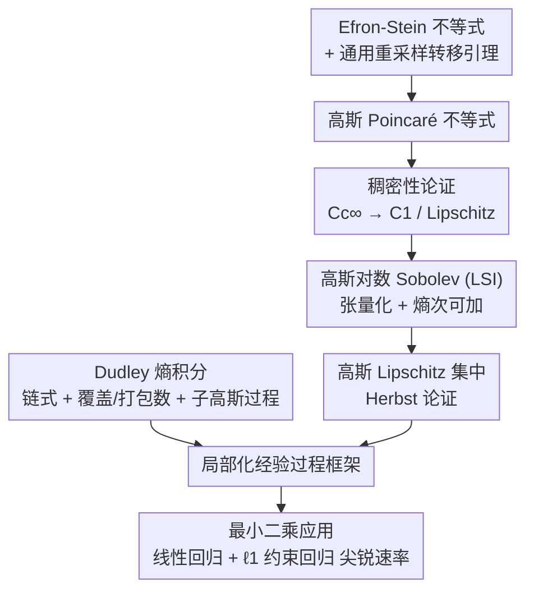

# AI4SLT: Empirical Processes in Lean 4 for Formal Statistical Learning Theory

**会议**: ICML 2026  
**arXiv**: [2602.02285](https://arxiv.org/abs/2602.02285)  
**代码**: https://github.com/YuanheZ/lean-stat-learning-theory  
**领域**: 学习理论 / 形式化验证  
**关键词**: 统计学习理论, Lean 4, 经验过程, 集中不等式, 人机协作形式化

## 一句话总结
这篇工作把"基于经验过程的统计学习理论（SLT）"第一次系统地在 Lean 4 里从零形式化：补齐了 Mathlib 缺失的高斯 Lipschitz 集中、Dudley 熵积分定理、以及最小二乘（含 $\ell_1$ 约束）回归的尖锐速率，约 3 万行 Lean 代码、无 `sorry`/`axiom`，并且全程用"人定证明策略、AI（Claude Code + Opus-4.5）写战术证明"的人机协作完成。

## 研究背景与动机
**领域现状**：统计学习理论支撑了过去二十年机器学习的发展（偏差-方差权衡、正则化、交叉验证），如今还在尝试解释深度网络与大模型的双下降、良性过拟合、单/多指标模型等现象。

**现有痛点**：模型越复杂，理论证明越长越绕，常常借助一大堆高级数学工具甚至统计物理直觉。这给"大规模人工审阅"带来巨大压力——中间引理难验证、逻辑依赖难追踪、每一步该用哪个技术也不清晰。更糟的是，SLT 的核心技术（集中不等式、覆盖数等）**没有结构化、机器可读的库**，复用性几乎为零。

**核心矛盾**：交互式定理证明器（如 Lean 4）本可同时解决"可验证性"和"可复用性"两个问题——把证明编码成形式语言就有机器可检的正确性保证，还顺带得到一个可查询的结果库。但 SLT 不像数论/代数那样有干净的公理基础：它横跨多个学科，**根植于经验过程理论**。具体说，学习算法的超额风险被一个由损失类索引的**经验过程的上确界**所控制；要控住这个上确界需要两块咬合的部件——**集中不等式**（把高概率界接到复杂度度量上）和**容量控制**（用复杂度度量与度量熵刻画局部函数类的有效大小）。每块都涉及可测性、可积性、拓扑假设，而教科书往往把这些默认略过；更要命的是这些工具在 Lean 4 里几乎全是空白。

**本文目标**：从基础测度论概率与分析出发，把现代泛化分析所需的全栈工具在 Lean 4 里从零搭起来，覆盖 Wainwright《High-Dimensional Statistics》与 Boucheron 等《Concentration Inequalities》两本代表作的若干关键章节。

**切入角度**：不做"机械翻译"，而是借形式化倒逼出教科书隐藏的假设——自然语言证明常压掉可测性/拓扑假设、混淆几乎处处与逐点、把多步论证缩成一句话，形式化逼你把这些洞全部显式化并解决。

**核心 idea**：以"局部化经验过程框架"为骨架，自底向上形式化两条技术主线（高斯集中 + Dudley 熵积分）并落到最小二乘应用，同时把整个工程做成可被复现的**人机协作范式**。

## 方法详解

### 整体框架
整个项目就是一张"依赖图"（论文 Figure 1/2）：超额风险 $R(\hat f)-R(f^\star)\lesssim \sup_{f\in\mathcal{F}}|(\hat{\mathbb{P}}-\mathbb{P})(\ell_f-\ell_{f^\star})|+(\text{confidence})$ 被经验过程波动主导；控住它需要"集中"（红色部件，给出临界半径 $\delta_\star$）和"容量控制/局部化"（蓝色部件，用度量熵 + Dudley 链式把局部高斯复杂度接到覆盖数）两块。本文就把这两块所需的全部 Lean 基础设施从零建起，并用最小二乘回归把它们串成一个端到端可用的框架。下图是几大形式化模块的依赖关系（全部此前 Lean 4 中不存在）：

### 关键设计

**1. 高斯 Lipschitz 集中的端到端工具链：从 Efron-Stein 一路接到 Herbst 论证**

局部化分析要求的不是 McDiarmid 这种有界假设下的简单集中，而是**高斯 Lipschitz 集中**，其证明是一长串异质方法的链条，每一环都不平凡。作者把它从零搭成一条可复用流水线：①**Efron-Stein 不等式** $\operatorname{Var}(Z)\le\sum_i\mathbb{E}[(Z-\mathbb{E}^{(i)}[Z])^2]$，难点是定理允许每个 $X_i$ 分布不同，作者为此形式化了一条**通用转移引理**（用一个独立新样本重采某坐标不改变联合分布），它在塔性质、Fubini 式交换、切片可积性等处被复用 20+ 次。②**高斯 Poincaré 不等式**，由 Efron-Stein 基础设施 + Taylor 展开界 + Rademacher 和弱收敛到高斯推出。③**稠密性论证**：$C_c^\infty$ 在高斯 Sobolev 空间 $\mathcal{W}^{1,2}$ 中稠密，靠 Lipschitz 磨光（mollification）$f_\epsilon=f\ast\rho_\epsilon$ 把一般 Lipschitz 函数光滑逼近且保 Lipschitz 常数，从而把结论从 $C_c^\infty$ 扩到 $C^1$/一般 Lipschitz 类——这步教科书因为复杂常常跳过。④**高斯对数 Sobolev 不等式（LSI）** $\operatorname{Ent}(f^2)\le 2\mathbb{E}[\|\nabla f\|_2^2]$，先证一维（Rademacher 和 + CLT + Bernoulli LSI 取极限），再靠**熵的次可加性**张量化到无关维数。⑤最终用 **Herbst 论证**：对 $e^{\lambda f_\epsilon/2}$ 套 LSI 得到 $\operatorname{Ent}(e^{\lambda f_\epsilon})\le\frac{\lambda^2 L^2}{2}\mathbb{E}[e^{\lambda f_\epsilon}]$，化成微分不等式（形式化为 Gronwall 型比值界）解出对数矩母函数界 $\log\mathbb{E}\exp(\lambda(f-\mathbb{E}f))\le\frac{\lambda^2}{2}L^2$，再用 Chernoff 界收尾，得到 $\mathbb{P}(|f(\bm X)-\mathbb{E}f(\bm X)|\ge t)\le 2\exp(-t^2/2L^2)$。据作者所知这是**任何定理证明器里第一次完整形式化高斯分析工具链**。

**2. Dudley 熵积分定理：完全从零的链式论证 + 两套积分形式的协调**

Dudley 界是"覆盖数 → 复杂度度量"的标准桥梁，是大量理论结果的可复用基石，但教科书陈述常常假设不全（略掉可积性、藏掉常数）。作者给出完整版：对伪度量空间上、直径 $\le D$ 的全有界集 $s$ 与子高斯过程 $\{X_t\}$，$\mathbb{E}[\sup_{t\in s}X_t]\le 12\sqrt{2}\,\sigma\int_0^D\sqrt{\log N(\varepsilon,s,d)}\,d\varepsilon$。整套从 $\epsilon$-网、覆盖数（最小 $\epsilon$-网基数）、度量熵到熵积分逐层定义，把子高斯过程用矩母函数界刻画，再做**链式论证**：在二进尺度 $\varepsilon_k=D\cdot 2^{-k}$ 上建一族 $\epsilon$-网，把 $X_u-X_{t_0}$ 写成最粗网的基项加一串通过逐次投影 $\pi_k$ 得到的增量望远镜和，对每个增量套子高斯有限极大界再求和。随后两次取极限：先用 Fatou 引理从有限网扩到可数稠密序列（因 Fatou 要非负被积、而上确界可能为负，引入一个期望里抵消的平移函数），再靠路径连续性扩到不可数集 $s$。一个很实在的工程难点是 Lean 有**两套积分**——非负反常积分 $\int^-$（值域 $\mathbb{R}_{\ge0}^\infty$，对 Fubini 等测度论操作方便）和实值区间积分（取极限、做不等式更顺）；作者把熵积分**正典地定义在 ENNReal**，但对外的 Dudley 界用实值 `entropyIntegral` 陈述，下游使用更友好。

**3. 局部化经验过程 → 最小二乘框架：用线性与 $\ell_1$ 回归验证可用性并立"覆盖演算"标准**

光有工具还不够，作者用最小二乘回归把它们串成统一框架并跑通尖锐速率。设 $y_i=f^*(\bm x_i)+\sigma w_i$、ERM 为 $\hat f$，目标是控住预测误差 $\|\hat f-f^*\|_n^2$。关键是**局部化**：不在整个 $\mathcal{F}$ 上控经验过程，而只看 $\mathcal{F}(\delta)=\{f:d(f,f^\star)\le\delta\}$，其有效大小由局部高斯复杂度 $\mathcal{G}_n(\mathcal{F}(\delta))$ 度量。借**临界不等式** $\mathcal{G}_n(\mathcal{F}(\delta))/\delta\le\delta/2\sigma$ 的最小正解定义临界半径 $\delta_\star$，再用主误差界（Wainwright Thm 13.5）把预测误差接上去。要解 $\delta_\star$ 就得用 Dudley（设计 2）把 $\mathcal{G}_n$ 上界成熵积分，问题归约为界覆盖数。两个应用各自给出尖锐速率：**线性回归**（$n\ge d$）把覆盖数欧氏化约到 $\ell_2$ 球覆盖 $N(\epsilon,\mathcal{B}_2^\iota(R))\le(1+2R/\epsilon)^\iota$，得 $\delta_\star=\mathcal{O}(\sqrt{r/n})$（$r$ 为设计矩阵秩），从而 $\|\hat f-f^*\|_n^2\lesssim \sigma^2 r/n$ 高概率成立；**高维 $\ell_1$ 约束回归**（等价 Lasso，允许 $d>n$）靠 Maurey 论证界 $\ell_1$ 凸包的欧氏覆盖 $N\le(2d+1)^{\lceil R^2/\epsilon^2\rceil}$，得 $\log N\lesssim \frac{R^2}{\epsilon^2}\log d$，最终 $\mathcal{O}(R\sqrt{\log d/n})$ 速率——这两例不仅验证框架可用，也为社区立下"覆盖演算"的形式化标准。

**4. 人机协作形式化范式：人定策略、AI 写战术，结构化 TASK.md 把首试失败率从 70% 压到 15%**

约 3 万行、约 500 小时监督开发全程靠人与 Claude Code（Opus-4.5）协作完成：人分析 Mathlib 基础设施、设计证明策略、把复杂定理拆成可管理的引理；AI 执行计划、构造形式证明；所有结果编译通过且无 `sorry`/`axiom`。作者实证发现，没有明确基础设施指针的非结构化指令大约 **70% 的时间首试失败**，而用一份四要素的**结构化 TASK.md**（① 目标陈述：精确 Lean 签名 + 自洽自然语言；② 基础设施指针：本地可用引理的名字与文件路径；③ 面向形式化的证明计划：用战术级而非纯非形式数学的分步计划；④ 硬边界），能把首试失败率降到约 **15%**。这把"如何让 agent 高效产出形式证明"从玄学变成可复制的配方，是论文超出"又一个形式化"的方法论贡献。

## 实验关键数据

这是形式化工程而非传统 benchmark，"结果"是被验证的定理与工程规模。

### 形式化贡献与规模

| 贡献模块 | 关键内容 | 此前 Lean 4 状态 |
|----------|----------|------------------|
| 高斯 Lipschitz 集中 | Efron-Stein→Poincaré→稠密性→LSI→集中 全链条 | 完全空白（首个定理证明器实现） |
| Dudley 熵积分 | 子高斯过程链式 + 覆盖/打包数 | 首次形式化 |
| 最小二乘框架 | 局部化经验过程 + 线性 / $\ell_1$ 回归尖锐速率 | 无 |
| 工程规模 | 约 30,000 行 Lean 4，无 `sorry`/`axiom` | — |

### 两个应用的尖锐速率

| 设置 | 覆盖数界 | 得到的速率 | 备注 |
|------|----------|------------|------|
| 线性回归（$n\ge d$） | $N(\epsilon,\mathcal{B}_2^r(R))\le(1+2R/\epsilon)^r$ | $\|\hat f-f^*\|_n^2\lesssim\sigma^2 r/n$ | $r=\operatorname{rank}(\bm X)$，达 minimax 级 |
| $\ell_1$ 约束回归（可 $d>n$） | $N\le(2d+1)^{\lceil R^2/\epsilon^2\rceil}$（Maurey） | $\mathcal{O}(R\sqrt{\log d/n})$ | 等价 Lasso，对标 Raskutti 等 |

### 人机协作效率

| 配置 | 首试失败率 |
|------|-----------|
| 非结构化指令（无基础设施指针） | ~70% |
| 结构化 TASK.md（四要素） | ~15% |

### 关键发现
- **vs Sonoda et al. (2025)**：此前最接近的工作只用 Rademacher 复杂度在**整个**函数类上控经验过程（McDiarmid / Hoeffding 这类有界工具），速率松、应用窄；本文走更尖锐的**局部化**路线，集中机制（高斯 Lipschitz 集中）和容量控制（覆盖数 + Dudley 链式 + 临界半径不动点）都实质更深。
- **形式化暴露教科书漏洞**：稠密性论证、Dudley 的可积性与常数、不同积分概念（Bochner vs 区间积分）的协调，都是自然语言证明里被略过、却必须在 Lean 里显式解决的"隐藏假设"。
- **协作范式可量化**：基础设施指针 + 战术级证明计划是把 agent 首试成功率拉高的主因。

## 亮点与洞察
- **"通用转移引理"一处投资、20+ 处复用**：为处理坐标分布各异，先形式化"重采一坐标不改联合分布"，成了整个高斯工具链的承重墙——这种"先建可复用基础设施再证定理"的工程观，正是形式化区别于纸面证明的价值所在。
- **两套积分形式的取舍很务实**：把熵积分正典定义在 ENNReal（利于 Fubini），对外却用实值版陈述（利于取极限/不等式），兼顾内部证明方便与下游易用，是值得借鉴的形式化设计模式。
- **把"怎么用 AI 做形式化"沉淀成配方**：70%→15% 的首试失败率对比，给后续大规模形式化项目一个可直接照搬的 TASK.md 模板，价值不亚于定理本身。

## 局限与展望
- **覆盖范围仍是 SLT 的经典核心**（高斯集中 + Dudley + 最小二乘），尚未触及双下降、良性过拟合等现代现象的形式化——那是引言里画的远景，本文只打地基。
- **强依赖人工策略设计**：约 500 小时监督开发、约 60 份任务规格说明，AI 负责战术执行但策略与拆解仍靠人，距"自动形式化"尚远；TASK.md 失败率统计也未给出样本量与置信区间。
- **应用只验证了线性与 $\ell_1$ 回归两例**，非参数/核方法/神经网络类的速率尚未在此框架内跑通，框架的"普适可用性"仍待更多实例检验。

## 相关工作与启发
- **vs Sonoda et al. (2025)**：他们形式化 Rademacher 复杂度下的全局泛化界，本文做局部化经验过程，更尖锐、应用更广，但工程量也大得多。
- **vs Lean 在 RL/优化理论的形式化（Zhang 2025；Li et al. 2024-2025）**：那些聚焦 RL 理论或优化，本文补的是 SLT 经验过程这条此前空白的主线。
- **vs 数论/代数的形式化繁荣**：后者有干净公理基础，SLT 横跨测度论、概率、泛函分析，可测性/可积性/拓扑假设处处要显式处理，这也是本文工作量集中之处。

## 评分
- 新颖性: ⭐⭐⭐⭐⭐ 首个基于经验过程的 SLT 全栈 Lean 4 形式化，多个定理是定理证明器里首次实现
- 实验充分度: ⭐⭐⭐⭐ 3 万行无 sorry + 两个应用跑通尖锐速率，但应用实例偏少
- 写作质量: ⭐⭐⭐⭐⭐ 自然语言定理 + Lean 代码对照清晰，工程难点交代到位
- 价值: ⭐⭐⭐⭐⭐ 可复用形式库 + 人机协作配方，为 ML 理论的可验证化打开门

<!-- RELATED:START -->

## 相关论文

- [\[ICLR 2026\] A Statistical Theory of Overfitting for Imbalanced Classification](../../ICLR2026/learning_theory/a_statistical_theory_of_overfitting_for_imbalanced_classification.md)
- [\[ICML 2026\] Performative Learning Theory](performative_learning_theory.md)
- [\[ICML 2026\] Catastrophic Forgetting is Low-Rank: A Function-Space Theory for Continual Adaptation](catastrophic_forgetting_is_low-rank_a_function-space_theory_for_continual_adapta.md)
- [\[ICLR 2026\] A Statistical Learning Perspective on Semi-dual Adversarial Neural Optimal Transport Solvers](../../ICLR2026/learning_theory/a_statistical_learning_perspective_on_semi-dual_adversarial_neural_optimal_trans.md)
- [\[ICML 2026\] Towards Optimal Robustness in Learning-Augmented Paging](towards_optimal_robustness_in_learning-augmented_paging.md)

<!-- RELATED:END -->
