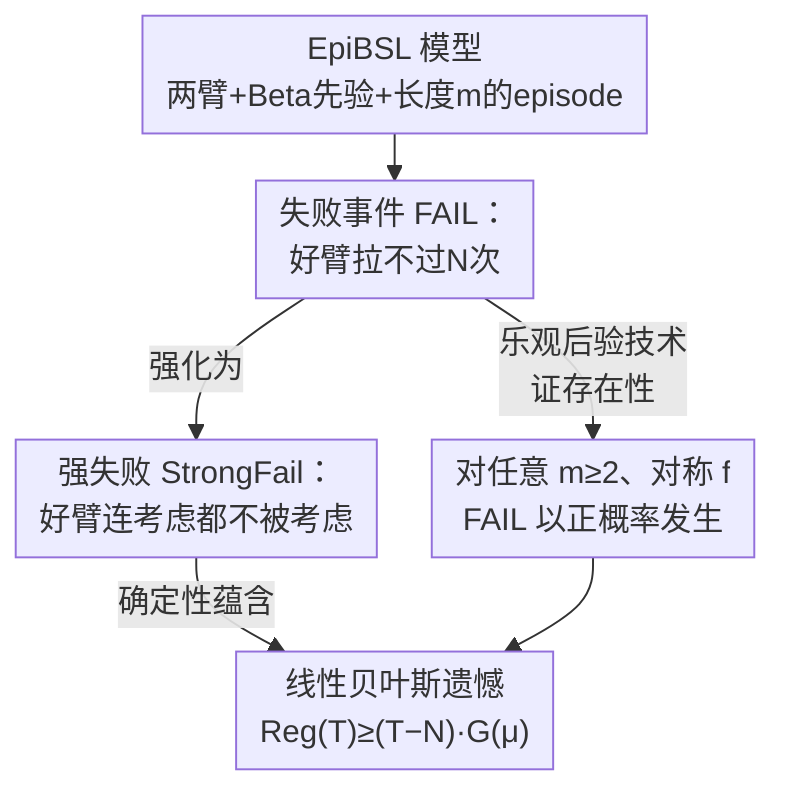

# Bandit Social Learning with Exploration Episodes

**会议**: ICML2026  
**arXiv**: [2602.05835](https://arxiv.org/abs/2602.05835)  
**代码**: 无（纯理论）  
**领域**: 学习理论 / 多臂老虎机 / 社会学习  
**关键词**: 社会学习, 多臂老虎机, 贪心算法, 探索失败, 贝叶斯遗憾

## 一句话总结
本文研究"每个自私 agent 控制一小段连续决策（episode）"的老虎机式社会学习动态，证明即便 agent 在自己的 episode 内会自发探索，**聚合层面的探索仍会失败**——对任意 episode 长度 $m\geq 2$、任意聚合效用函数 $f$（sum/max/min 等），学习失败都以正概率发生，导致贝叶斯遗憾随时间**线性增长**。

## 研究背景与动机

**领域现状**：很多在线平台上的学习是"社会学习动态"——一群自私用户在质量未知的若干选项里做选择，把体验反馈给平台，平台聚合后服务给后来者。这本质上是一个**只利用、不探索**的"贪心"老虎机算法（$\mathtt{Greedy}$）：每个用户都想吃当下后验最优的臂，没人愿意为后人去试错。

**现有痛点**：贪心动态会卡死。经典反例：两臂 0-1 收益，各采样一次，若真正的好臂初始返回 0、坏臂返回 1，贪心就永久卡在坏臂上——这类"学习失败"在理论上是 $K$ 臂老虎机的**典型情形**（以正概率发生），不是最坏情形。Banihashem et al. (2023)、Slivkins et al. (2025) 把这一结论推广到了带行为偏差、带结构、贝叶斯先验等多种设定。

**核心矛盾**：以往工作几乎都假设"每个 agent 只做一次决策"（即 $m=1$，纯贪心）。但现实中一个用户往往会**连续做好几次决策**：用 AI 多试几个 prompt 选最好的、连刷一批同类任务、连续购物。此时 agent 有动机在自己这段时间内**为自己**探索——哪怕每人只探一点点，长期累加起来似乎就能避开学习失败。

**本文目标**：正面回答问题 (Q) ——*当自私 agent 每人做几次决策时，学习失败能否被避免？* 一个直觉上支持"能避免"的例子：两臂确定性收益、每 agent 连做两次、效用取两次中的 $\max$，那么第一个 agent 会把两臂都试一遍（反正取 max 不亏），从此两臂全知。

**切入角度**：作者构造了极简但可严格分析的模型 **Episodic Bandit Social Learning（$\mathtt{EpiBSL}$）**——两个 Bernoulli 臂 + Beta 共轭先验、时间切成长度 $m$ 的 episode、每个 episode 由一个贝叶斯最优的自私 agent 控制、引入很小的选择成本 $c_{\text{sel}}$ 和"跳过"选项以防退化。

**核心 idea**：与上面那个乐观直觉相反，作者证明 **episode 内的自发探索救不了聚合探索**——对**任意固定** $m\geq 2$ 和满足温和条件（非常值、各坐标非降、对称）的 $f$，"好臂被放弃"这一失败事件都以正概率出现，因此 $\mathtt{BReg}(T)$ 线性增长。结论是：即便有机化探索存在，**外部驱动的探索仍然不可或缺**。

## 方法详解

### 整体框架

这是一篇**纯理论**论文，"方法"即模型设定 + 一套把"局部探索失败"逐级放大到"全局线性遗憾"的证明链条。整体逻辑可以这样鸟瞰：先定义一个可严格刻画的失败事件 $\mathtt{FAIL}_{c,N}$（好臂几乎不被拉），证明它在任意实例上以正概率发生；再把它强化成 $\mathtt{StrongFail}$（好臂连"被考虑"都不被考虑），并证明强失败**确定性地**蕴含线性遗憾；最后用"乐观后验"这一新分析工具，把上述失败概率的存在性推广到任意 $m\geq 2$ 和一般的 $f$。

**模型设定（$\mathtt{EpiBSL}$）**：两个非跳过臂 $i\in\{1,2\}$，均值 $\mu_i$ 独立采自已知先验 $\mathrm{Beta}(\alpha_i,\beta_i)$；第三个"跳过臂"恒返回 0。时间分成长度 $m$ 的 episode，每个 episode 来一个新 agent，它在观察到**全部历史**（平台聚合的所有过往拉臂与收益）后，选一个贝叶斯最优的 per-episode 策略 $\pi_e$ 来最大化自己的期望效用 $\mathbb{E}[U(\pi_e)\mid \widetilde H_e]$。agent 这段 episode 的得分是 $f(\vec r_e)$，效用 $U_e=f(\vec r_e)-\text{总选择成本}$。$f$ 满足：各坐标非降、非常值（$f(\vec 0)<f(\vec 1)$）、对称（主结果），paradigm 是 sum / max / min。

**遗憾定义**：以"已知 $\vec\mu$ 时的最优 per-episode 策略价值 $U^*(\vec\mu)$"为基准，$T$ 个 episode 后的伪遗憾

$$\mathtt{Reg}(T\mid\vec\mu):=T\cdot U^*(\vec\mu)-\sum_{e\in[T]}V(\pi_e\mid\vec\mu),\qquad \mathtt{BReg}(T):=\mathbb{E}[\mathtt{Reg}(T\mid\vec\mu)].$$

亚线性遗憾是"有用的老虎机算法"的最低要求；本文要证的恰恰是它做不到。

### 关键设计

**1. EpiBSL 模型：用"成本 + 跳过 + 聚合函数"把社会学习钉成可分析的老虎机**

痛点是：要研究"agent 自发探索能否救场"，必须有个既能容纳"episode 内探索"、又能避免"反正白探也无所谓就乱探"这种退化的模型。作者的做法是给每个 agent 一段长度 $m$ 的连续决策，得分是这 $m$ 次收益经一个**聚合函数** $f$ 压成的标量——$f=\text{sum}$ 对应"每次都算数"，$f=\max$ 对应"试几次取最好一次"（多 prompt 选最优），$f=\min$ 对应"一次都不能错"（自动驾驶不能撞）。同时加一个很小的**选择成本** $c_{\text{sel}}$ 和**跳过臂**：成本保证"拉一个收益极小的臂应严格差于什么都不做"，于是 agent 在没激励时不会一直瞎探。这个设计的关键在于：它让"episode 内自利探索"成为模型自带的内生行为（$m\geq 2$ 时 agent 有动机为自己试错），从而能干净地检验问题 (Q)；而 $m=1$ 恰好退化回已知会失败的纯贪心。

**2. 三级失败事件：从"好臂少拉"到"好臂不被考虑"再到"线性遗憾"**

直接证"遗憾线性"很难，作者拆成一条可传递的链。最弱的 $\mathtt{FAIL}_{c,N}$（定义 3.1）要求：两臂均值都在 $(c,1-c)$ 内、好臂 2 比坏臂 1 至少好 $c$（reward-gap，$\mu_2\geq\mu_1+c$）、且**坏方向的好臂 2 最多被拉 $N$ 次**。但"少拉"不够直接推遗憾，于是引入更强的 $\mathtt{StrongFail}_{c,N}$（定义 3.3）：好臂 2 满足 reward-gap，且**最多 $N$ 个 episode "考虑"过它**（"考虑"=以正概率选它）。引理 3.4 证明：只要 $\Pr[\mathtt{FAIL}_{c,N}]>0$，就有 $\Pr[\mathtt{StrongFail}_{c,N'}\mid\mathtt{FAIL}_{c,N}]\geq 1/2$（用 Azuma-Hoeffding 控制"足够多好 episode 必然把好臂拉过 $N$ 次"的矛盾）。最后定理 3.6 给出关键的**确定性**结论：

$$\mathtt{StrongFail}_{c,N}\ \Rightarrow\ \mathtt{Reg}(T)\geq (T-N)\cdot G(\vec\mu),\quad\forall T,$$

其中 $G(\vec\mu)=U^*(\vec\mu)-\sup_{\pi\in\Pi_{\mathtt{bad}}}V(\pi\mid\vec\mu)$ 是"用不用好臂"的效用差。引理 3.8 进一步证明：只要 $c_{\text{sel}}\leq c'/2m$，就有 $G(\vec\mu)\geq c'/2$ 与时间无关地为正——于是只要强失败以正概率发生，$\mathtt{BReg}(T)$ 就线性。对 $f=\min$、$\max$ 还能给出更显式的下界，如 $f=\min$ 时 $G(\vec\mu)\geq\max\{0,|\mu_2^m-\mu_1^m|-m\,c_{\text{sel}}\}$。

**3. 乐观后验（optimistic posterior）：处理"agent 会理性地拉当前后验差的臂"这一新难点**

这是本文区别于 $m=1$ 旧分析的技术核心。$m=1$ 时只需比较"当前后验均值"谁大谁小即可断言贪心永不选某臂；但 $m\geq 2$ 时一个 agent **可能理性地选一个当前后验差的臂**——因为这一 episode 早期若中了个 1，会显著抬高它的后验，使它在本 episode 后续轮次反而更优。于是不能简单说"坏臂永不被选"。作者改为推理臂的**乐观后验**：假想该臂在本 episode 内未来若干次都出正样本会induced出的后验。核心引理证明：若臂 2 是"强后验差"（strongly posterior-bad，即当前后验差、且再来 $m-1$ 个正样本后仍后验差），它就构成一个 **bad-start 条件**，迫使 agent 在 episode 第一轮不用好臂；再配合 **arm1-stability** 事件（用停时 + 鞅论证臂 1 后验均值不会跌太多，以常数概率成立），可保证只要臂 2 前几次采样全是 0，它的乐观后验就被永久压到臂 1 之下，从此再不被拉。对更长 episode 用**对 $m$ 的归纳**处理：若臂 2 对长度 $m$ 强后验差且 agent 仍拉它，即便中 1，剩下就是长度 $m-1$ 的子问题、臂 2 对 $m-1$ 仍强后验差，归纳假设矛盾；对非对称 $f$（定理 4.3，限 $m=2$）则需额外用成本上界排除"先试臂 1、若得 0 再补救"这类风险型策略。

### 损失函数 / 训练策略
无（纯理论，无训练）。

## 实验关键数据

本文是理论论文，没有数值实验；"结果"是一组定理，按覆盖范围递进。下表汇总核心结论与适用条件（$\text{(P1)}$ 指"存在依赖先验的常数使 $\Pr[\mathtt{FAIL}]\geq q_{\mathcal P}^m>0$"）：

### 主结果（失败结论）

| 定理 | episode 长度 | 聚合函数 $f$ | 成本约束 | 结论 |
|------|--------------|--------------|----------|------|
| Thm 4.1 | 任意 $m\geq 2$ | 对称 | $c_{\text{sel}}<c_{\max}$ | (P1) 成立，$N_{\mathcal P}=1+\lfloor (m-1)\beta_2/\alpha_2\rfloor$ |
| Thm 4.3 | $m=2$ | 非对称 | $c_{\text{sel}}<c_{\max}$ | (P1) 成立 |
| Thm 4.6 | (a) $m=2$ 对称 / (b) $f=\max$ 或 $\min$ | — | **无上界** $c_{\max}=1$ | (P1) 成立 |
| Cor 4.5 | $m=2$ 或对称 $f$ | — | $c_{\text{sel}}<c_{\max}$ | 线性遗憾 $\mathtt{BReg}(T)\geq c_0(T-N_0)$ |

### 失败概率下界与放大链

| 引理/定理 | 作用 | 关键量 |
|-----------|------|--------|
| Lemma 3.4 | $\mathtt{FAIL}\Rightarrow\mathtt{StrongFail}$（概率 $\geq 1/2$） | Azuma-Hoeffding |
| Thm 3.6 | 强失败 ⇒ 线性遗憾（**确定性**） | $\mathtt{Reg}(T)\geq(T-N)G(\vec\mu)$ |
| Lemma 3.8 | 效用差为正 | $c_{\text{sel}}\leq c'/2m\Rightarrow G(\vec\mu)\geq c'/2$ |
| Thm 4.1 | 失败概率正下界 | $\Pr[\mathtt{FAIL}]\geq q_{\mathcal P}^m$ |

### 关键发现
- **核心反直觉**：把"每人多决策几次"当成救命稻草是错的。失败概率正下界 $q_{\mathcal P}^m$ 虽然随 $m$ 指数衰减，但**只要为正就蕴含线性遗憾**——而小 $m$（试几个 prompt / 产品）恰恰是最现实的场景，此时衰减无关紧要。
- **结论对效用模型稳健**：sum / max / min 乃至任意非常值、坐标非降、对称的 $f$ 都失败；非对称 $f$ 在 $m=2$ 也失败。
- **成本的作用是边界情形的分水岭**：$f=\max/\min$ 即便去掉成本上界也失败（Thm 4.6）；但**没有跳过、$c_{\text{sel}}=0$** 时分析会崩——此时 $f=\max$（或 $\min$）反而"学习成功"，因为第一轮若出 1（或 0）后续轮次不影响效用，形成平局、每臂都有概率被选。
- **可推广性**：结论易扩展到 $K>2$ 臂中"两臂按先验远好于其余"的实例族；"学习成功"若存在，只能落在完全排除 2-臂情形的奇异 regime。

## 亮点与洞察
- **把"乐观后验"作为新分析原语**：$m\geq 2$ 打破了贪心分析里"只比当前后验均值"的便利，作者用"假想未来正样本 induced 的后验"来刻画 agent 何时**绝不会**选某臂，这是把单轮失败论证推广到多轮的关键齿轮，可迁移到其他"agent 会前瞻地暂时选次优臂"的序贯决策分析。
- **三级失败事件 + 确定性遗憾下界**：把概率性的"好臂少拉"逐级强化到"好臂不被考虑"，再用一个**确定性**不等式（Thm 3.6）锁死线性遗憾，绕开了对遗憾直接做概率界的麻烦——这种"先存在一个常数概率坏事件，再让坏事件确定性放大成线性损失"的模板很值得复用。
- **对 $c_{\text{sel}}=0$ 的诚实讨论**很有洞察：它点明了"成功 vs 失败"的真正开关不是探索量，而是 max/min 这类效用在边界收益上制造的**平局**让随机 tie-breaking 重新注入了探索。

## 局限与展望
- **强 stylized**：只两个 Bernoulli 臂、Beta 共轭先验、全历史可观测。作者自己指出共轭先验对显式后验更新是必需的，放宽到一般有界收益/先验只是猜想；部分可观测历史即便 $m=1$ 也是未解难题。
- **失败概率下界随 $m$ 指数衰减**：$q_{\mathcal P}^m$ 在大 $m$ 时极小，真实失败概率如何随 $m$ scale 仍是 open question——论文只论证"正即够"（蕴含线性遗憾），没给出量化强下界（这类强下界目前只在 $m=1$ 已知）。
- **$K>2$ 与 $c_{\text{sel}}=0$ 仅部分覆盖**：$K>2$ 需"两臂远好于其余"的条件，一般 $K$ 臂、无成本无跳过的完整刻画留待后续。
- **改进方向**：把全历史放宽到聚合统计已经够用，下一步可探部分可观测、非共轭先验，以及把"需要外部探索激励"与 incentivized exploration 文献正式对接。

## 相关工作与启发
- **vs Banihashem et al. (2023)（$m=1$ 贪心失败）**：他们处理单轮 episode（纯贪心），论证靠比较当前后验/样本均值；本文是其严格推广，难点在于 $m\geq 2$ 时 agent 会理性地暂时选后验差的臂，必须引入乔乐观后验与对 $m$ 的归纳。结论一致：失败是典型情形、蕴含线性遗憾。
- **vs Slivkins et al. (2025)（带结构的贪心刻画）**：他们刻画了带任意已知结构的贪心何时失败/成功（含 contextual bandit 的渐近成功）；本文聚焦无结构两臂、但引入 episode 内探索这一新维度，证明"自发探索"并不能把失败变成功。
- **vs 激励探索 / incentivized exploration（Kremer et al. 2014; Che & Hörner 2018; Slivkins 2023）**：他们**设计干预**去改变动态、诱导 agent 探索；本文不干预，只**分析**自私行为诱导的动态本身，恰好为"为什么需要外部探索激励"提供了更强的反面证据（连自发探索都不够）。
- **vs 策略性实验 / strategic experimentation（Bolton & Harris 1999; Keller et al. 2005）**：那里 agent 长生不老、并行行动、可互相搭便车，单个 agent 最终能学到最优臂故不会失败；本文 agent 短命、串行、且失败恰恰能发生，技术与结论都不同。

## 评分
- 新颖性: ⭐⭐⭐⭐⭐ 把"多次决策的自发探索能否救场"这一自然问题钉成可分析模型并给出反直觉的否定回答，乐观后验是真新工具。
- 实验充分度: ⭐⭐⭐⭐ 纯理论无实验，但定理覆盖 sum/max/min、对称/非对称、有无成本上界、$K>2$ 等多个维度，论证体系完整。
- 写作质量: ⭐⭐⭐⭐⭐ 失败事件三级递进、证明 sketch 清晰，对 $c_{\text{sel}}=0$ 等边界情形坦诚讨论。
- 价值: ⭐⭐⭐⭐ 对社会学习/平台机制设计有清晰的政策含义——有机化探索不足恃，外部探索激励仍是刚需。

<!-- RELATED:START -->

## 相关论文

- [\[ICLR 2026\] Bandit Learning in Matching Markets Robust to Adversarial Corruptions](../../ICLR2026/learning_theory/bandit_learning_in_matching_markets_robust_to_adversarial_corruptions.md)
- [\[NeurIPS 2025\] Infrequent Exploration in Linear Bandits](../../NeurIPS2025/learning_theory/infrequent_exploration_in_linear_bandits.md)
- [\[ICML 2025\] Learning-Augmented Algorithms for MTS with Bandit Access to Multiple Predictors](../../ICML2025/learning_theory/learning-augmented_algorithms_for_mts_with_bandit_access_to_multiple_predictors.md)
- [\[ICML 2026\] Cutting LLM Evaluation Costs with SySRs: A Bandit Algorithm that Provably Exploits Model Similarity](cutting_llm_evaluation_costs_with_sysrs_a_bandit_algorithm_that_provably_exploit.md)
- [\[ICML 2026\] Performative Learning Theory](performative_learning_theory.md)

<!-- RELATED:END -->
