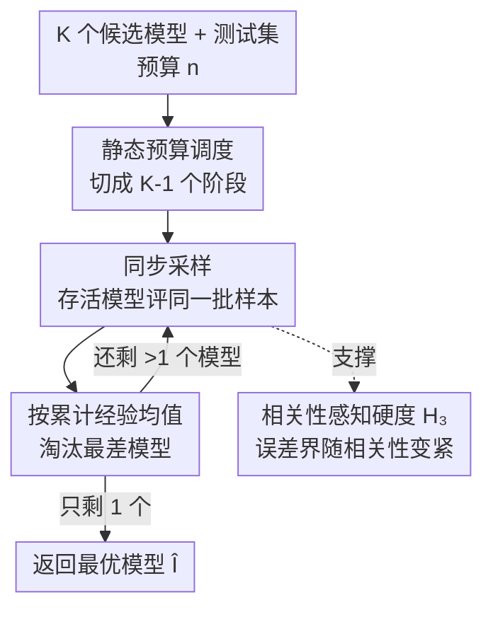

# Cutting LLM Evaluation Costs with SySRs: A Bandit Algorithm that Provably Exploits Model Similarity

**会议**: ICML 2026  
**arXiv**: [2606.07726](https://arxiv.org/abs/2606.07726)  
**代码**: llm-bandits-sysrs（论文标注，待确认完整链接）  
**领域**: 学习理论 / 多臂老虎机 / LLM评测  
**关键词**: 最优臂识别, 多臂老虎机, 模型相似性, LLM评测, 同步采样

## 一句话总结
为了在"挑选最优模型"时少花评测预算，作者把经典 Successive Rejects 老虎机算法改造成"同步版"SySRs——每阶段让所有存活模型在同一批测试样本上评测，从而像配对检验那样利用模型间相关性，得到一个无超参、且误差上界随模型相关性变紧的最优臂识别算法，在 15 个标准基准上用 ≤35% 的模型×样本对就能可靠选出最优模型、全面超越已有方法。

## 研究背景与动机

**领域现状**：评测大模型的标准做法是"每个模型都跑完每条测试样本"。对于只想挑一个最好模型来部署的实践者来说，这极其浪费——一个明显更差的模型，根本不需要把它的分数估到很准。Zhou et al. (2025) 提出一个干净的视角：把模型当作老虎机的"臂"、每条 query 上的准确率当作"奖励"，于是可以用最优臂识别（best-arm identification）算法在线决定下一步评测哪个模型，差模型早早淘汰、预算集中到难分辨的几个顶尖模型上。

**现有痛点**：现有降本路线各有硬伤。(1) 用 LLM 当裁判替代专家——省标注但不省推理、且可靠性差，相似模型互评会看不出对方的错。(2) 子集选择——挑一小批"有信息量"的子任务，但缺理论保证、不一定比随机子采样好，而且需要该基准上的大量历史评测数据，新基准用不了。(3) 通用最优臂识别（UCB-E、SR）虽有理论保证，却完全没利用 LLM 评测特有的结构：跨任务上，不同模型的表现往往高度相关——简单题大多数模型都对、难题大多数都错。

**核心矛盾**：理论上成熟的最优臂识别算法假设各臂独立采样，浪费了"模型相关性"这一免费信息；而想利用相关性的方法（Zhou et al. 的 UCB-E-LRF 用低秩分解预测未观测分数）既没理论保证、实验上也不稳定超过普通 UCB-E。相关臂老虎机的文献很稀少，且 Gupta et al. (2021) 那条线需要事先知道相关强度的上界，现实中拿不到。

**本文目标**：设计一个既无超参、又能自动利用模型相关性、且误差界随相关性变紧的最优臂识别算法。

**切入角度**：作者盯上经典 Successive Rejects（SR）——它分阶段逐个淘汰最差臂、预算调度无超参。关键观察是：SR 天然适合改造成"同步"版，因为它本来就是按"阶段"成块评测，只要让所有存活模型在同一批样本上评测，就能像配对差异检验那样把"两模型分差的方差"压低。

**核心 idea**：把 SR 的"每臂独立采样"换成"每阶段所有存活模型评同一批样本"（synchronization），用配对比较降低分差方差，从而无需先验相关强度就自动吃到相关性红利。

## 方法详解

### 整体框架
问题设定：在 $K$ 个候选模型 $f_1,\dots,f_K$、测试集 $\mathcal{X}=\{x_1,\dots,x_L\}$、固定预算 $n$ 次评测下，找出平均表现最高的模型 $i^\star=\arg\max_i \mu_i$，其中 $\mu_i=\frac{1}{L}\sum_j \mathbb{E}[S_{ij}]$，$S_{ij}\in[0,1]$ 是模型 $j$ 在样本 $i$ 上的（可随机的）得分。算法每步选一个模型 $i_t$ 和一个样本 $j_t$、观测 $S_{i_t j_t}$，$n$ 步后给出对最优臂的猜测 $\widehat I$，目标是最小化错误概率 $e_n=\mathbb{P}(\widehat I\neq i^\star)$。

SySRs 的整条流程沿用 SR 的"静态预算调度 + 逐阶段淘汰最差"骨架，但把采样方式从"每臂各自随机抽样"改成"全体存活模型同步评同一批样本"，并据此换用一个相关性感知的硬度度量 $H_3$ 来给出更紧的误差界。

### 关键设计

**1. 静态预算调度：无超参地把预算切成 K−1 个递增阶段**

UCB-E 这类算法要调探索超参 $a$——调小了没保证、调大了指数项不够小，用户被夹在中间很难选。SySRs 继承 SR 的无超参调度：把预算 $n$ 切成 $K-1$ 个不等长阶段，第 $k$ 阶段每个存活模型累计被评 $n_k$ 次，其中

$$n_k=\Big\lceil\frac{1}{\overline{\log}(K)}\frac{n-K}{K+1-k}\Big\rceil,\quad \overline{\log}(K)=\frac{1}{2}+\sum_{i=2}^{K}\frac{1}{i}$$

这个调度是精心设计的：越往后存活模型越少、越需要把预算压到难分辨的顶尖几个上，所以每阶段分配的预算（$n_k-n_{k-1}$）递增，且总预算不超过 $n$。无超参意味着用户不需要任何先验调参，这正是它能"自动适应相关性"的前提。

**2. 同步采样：所有存活模型评同一批样本，把分差方差压下去**

这是 SySRs 区别于经典 SR 的唯一、也是最关键的改动。经典 SR 给每个臂独立随机抽样本，于是估计两模型的分差时，两边的随机性互不抵消。SySRs 在第 $k$ 阶段从未用过的样本里无放回地抽一批 $\widetilde{\mathcal{J}}_k$，让**所有 $K+1-k$ 个存活模型都在这同一批样本上评测**，然后按累计经验均值 $\widehat\mu_{i,n_k}=\frac{1}{n_k}\sum_{j\in\mathcal{J}_k}S_{ij}$ 淘汰最差的一个。这等价于把"两样本检验"换成"配对差异检验"：当两个模型在样本上正相关时（简单题都对、难题都错），它们分差 $S_{i^\star j}-S_{(i)j}$ 的方差 $V_{\star,i}=\mathrm{Var}(S_{i^\star J})+\mathrm{Var}(S_{(i)J})-2\,\mathrm{Cov}(S_{i^\star J},S_{(i)J})$ 会因协方差项而显著变小，于是"把最优臂误判为更差"的概率更低。同步还有个工程红利：它天然按样本块批量评测，比 UCB 那种每步切换模型更适合 LLM 的批量推理。

**3. 相关性感知硬度 H₃：让误差上界随模型相似度自动变紧**

要证明同步真的有用，得有个能"装下相关性"的硬度度量。作者把经典 $H_2=\max_i \frac{i}{\Delta_i^2}$ 里的逐臂硬度 $1/\Delta_i^2$ 换成相关性感知版 $H_{3,i}=\frac{2V_{\star,i}+\frac{2}{3}(1+\Delta_i)\Delta_i}{\Delta_i^2}$，定义 $H_3=\max_{i\geq 2} i\,H_{3,i}$，得到（Theorem 5.1）：

$$e_n\leq\frac{K(K-1)}{2}\exp\left(-\frac{n-K}{\overline{\log}(K)\,H_3}\right)$$

证明沿用 Audibert et al. (2010) 的 SR 分析框架，关键替换是用 Bernstein 不等式（依赖方差 $V_{\star,i}$）取代 Hoeffding 不等式来界定每对臂的均值比较误差。直觉上，$V_{\star,i}$ 越小界越紧，而同步采样正是通过让所有模型见同一批样本来压低 $V_{\star,i}$。这种改进在"分差 $\Delta_i$ 很小、最难分辨"的硬区间尤其决定性。作者还把 $H_3$ 拆成两个独立增益来源：**更好的分析**（即便普通 SR 也能用方差版 $H_3'$ 替换，在某些区间已比 $H_2$ 紧）+ **更好的算法**（同步让 $H_3$ 随相关性 $\theta_i$ 变紧，而 $H_3'$ 不受相关性影响），实测在 15 个数据集上通常 $H_3<H_3'<H_2$，证明两者都在起作用。Corollary 5.2 给出简洁充分条件：只要每个次优臂满足 $\theta_i>2\Delta_i$ 或 $\Delta_i<\frac{3}{2}\mu^\star-1$，就有 $H_3<H_2$——这意味着即便相关性不强，$H_3$ 也常常更小。

### 损失函数 / 训练策略
本文是纯算法/理论工作，无训练损失。值得点出的是两臂极端情形的"快率"现象：当奖励无相关（$\theta=0$）时 $H_3=\Theta(1/\Delta^2)$，退回经典硬度；当最大相关（$\theta=1$，即最优模型对的题次优模型一定也对的点态支配情形）时 $V_{\star,2}=\Delta-\Delta^2$，硬度降到 $H_3=\Theta(1/\Delta)$。这恰似统计学习里 Bernstein 条件带来的从慢率 $1/\varepsilon^2$ 到快率 $1/\varepsilon$ 的插值——分差方差随 gap 线性收缩，因而样本复杂度从 $1/\Delta^2$ 改善到 $1/\Delta$。作者还在附录给出匹配的下界（Theorem 5.3），说明在两模型 i.i.d. 设定下 $H_3$ 在极小极大意义上刻画了最优样本复杂度，SySRs 达到该复杂度（差常数因子）。

## 实验关键数据

### 实验设置
基于 HELM Lite 与 OpenLLM Leaderboard 在 2025 年 12 月的公开逐题结果，取 15 个标准基准、对每个基准纳入所有有完整评测结果的模型。因所有基准用贪心解码，得分 $S_{ij}$ 确定（但奖励 $R_i=S_{iJ}$ 仍随机，因样本索引 $J$ 随机）。数据集规模与难度差异很大：任务数 $L$ 从 437 到 12032（均值 2298）、模型数 $K$ 从 39 到 450（均值 158）。基线包括均匀采样 US、同步均匀采样 SyUS、UCB-E（$a\in\{0.1,1,10\}$）、UCB-E-LRF（含/不含 warm-up）、SR，以及作者新造的同步 UCB-E（SyUCB-E）。指标为错误概率 $e_n$，每算法跑 1000 次（LRF 因开销大只跑 100 次），预算用占满评测的百分比 $b=n/(K_D L_D)$ 表示以跨数据集可比。

### 主实验：识别准确率（15 基准平均）

| 预算占比 | US | SyUS | SR | UCB-E (a=1.0) | **SySRs** |
|---------|-----|------|-----|---------------|-----------|
| 8% | 30.2 | 39.1 | 72.4 | 80.9 | **83.5** |
| 12% | 36.7 | 46.8 | 89.7 | 86.8 | **95.1** |
| 16% | 42.0 | 52.0 | 95.9 | 89.9 | **98.5** |
| 20% | 45.3 | 56.5 | 98.2 | 95.3 | **99.6** |
| 25% | 50.5 | 61.0 | 99.3 | 97.5 | **99.9** |
| 35% | 58.0 | 68.7 | 99.9 | 98.3 | **100.0** |

SySRs 在每个预算档位都是最高，且是无超参的——UCB-E 的数字还是在每个 $x$ 点上取最优超参后的结果。在 35% 预算时 SySRs 已 100% 选对。

### 硬度统计（量化两层增益）

| 度量 | Min | Max | Mean |
|------|-----|-----|------|
| $H_2$（经典） | $1.7\times10^3$ | $5.0\times10^5$ | $8.7\times10^4$ |
| $H_3'$（仅更紧分析） | $1.0\times10^3$ | $8.7\times10^4$ | $2.5\times10^4$ |
| $H_3$（分析+相关性） | $1.0\times10^3$ | $4.3\times10^4$ | $1.0\times10^4$ |
| $H_3'/H_2$ 比值 | 0.11 | 1.08 | 0.61 |
| $H_3/H_3'$ 比值 | 0.07 | 1.04 | 0.56 |

### 关键发现
- **同步是主要功臣**：从 SR→SySRs 在低预算（8%）档位识别准确率从 72.4 跳到 83.5，且 SyUS 全面优于 US、SyUCB-E 也优于 UCB-E，说明"让所有模型见同一批样本"这一同步机制在多种算法上都带来稳定增益。
- **两层增益缺一不可**：$H_3'/H_2$ 均值 0.61（更紧分析贡献），$H_3/H_3'$ 均值 0.56（利用相关性贡献），两者相乘说明 $H_3$ 相对 $H_2$ 平均降到约三分之一，分析与算法各占一半。
- **最坏情形预算最稳**：SySRs 在全部 15 个基准上用至多 35% 的模型×样本对就能可靠选出最优模型，而其他方法至少在一个基准上需要更多数据才能达到同样可靠性。
- **无超参却赢了调过参的对手**：UCB-E 各档位都用了最优超参，仍被无超参的 SySRs 压住，凸显"省去调参"在实践中既省事又不掉性能。

## 亮点与洞察
- **"配对检验"思想搬进老虎机**：把"同步评同一批样本"类比成配对差异检验，用协方差抵消把分差方差压低——这个直觉简单却威力大，是整篇的灵魂，且天然契合 LLM 批量推理。
- **快率现象很优雅**：在最大相关情形把硬度从 $\Theta(1/\Delta^2)$ 改善到 $\Theta(1/\Delta)$，并点明这正是统计学习里 Bernstein 条件的对应物——把"模型相似性"和"快率"两个看似无关的概念接上了。
- **无超参 + 随相关性变紧的保证**：相比 Zhou et al. 的 UCB-E-LRF（无保证、不稳定）和 Gupta et al. 的相关臂方法（需先验相关强度），SySRs 是少见的"既要又要"——不用调参、不用先验，却自动吃相关性红利。
- **与子集选择互补**：SySRs 能用在任意新基准（无需历史数据），且可叠加在子集选择之上进一步加速，迁移性强。

## 局限与展望
- **目标限于 top-1 识别**：只解决"选最好的那个模型"，不直接给完整排序或绝对分数估计；很多场景需要 top-k 或精确评分。
- **无放回采样的下界尚未闭合**：匹配下界是在两模型 i.i.d.（有放回）设定证的，推广到无放回需要类似 Bernstein-Serfling 的有限样本修正，作者只论证当 $L\gg n$ 时修正很小。
- **依赖正相关**：增益主要来自模型间正相关（简单题都对、难题都错）；若模型间近乎独立或负相关，$H_3$ 退回经典 $H_2$，同步不再有红利。
- **确定性得分假设**：实验基于贪心解码的确定性 $S_{ij}$，对采样温度高、回答高度随机的生成式评测，方差结构会变，效果待验证。
- **改进方向**：把同步思想推广到 top-k 识别与固定置信度设定、给无放回情形补上紧的有限样本分析。

## 相关工作与启发
- **vs Successive Rejects (Audibert et al. 2010)**：经典 SR 每臂独立采样、误差界依赖 $H_2$ 不含相关性；SySRs 仅改成同步采样就让界依赖更紧的 $H_3$，无超参优势完全继承，是本文的直接母体。
- **vs UCB-E / UCB-E-LRF (Zhou et al. 2025)**：UCB-E 要调探索超参 $a$、UCB-E-LRF 用低秩分解预测未观测分数但无保证且实验上不稳超过普通 UCB-E；SySRs 无超参、有随相关性变紧的保证，且平均准确率全面更高。
- **vs 相关臂老虎机 (Gupta et al. 2021)**：他们把臂间相关建模成"已知的条件期望上界"，需先验相关强度；SySRs 不需要任何相关强度的先验知识就能自动利用相关性。
- **vs 子集选择 (Maia Polo et al. 2024 / Vivek et al. 2024)**：子集选择需大量历史评测数据、缺保证、不一定胜过随机子采样；SySRs 适用于任意新基准，且二者互补可叠加。

## 评分
- 新颖性: ⭐⭐⭐⭐⭐ 把配对检验直觉、相关性感知硬度 $H_3$、快率现象一线串起，理论增量扎实。
- 实验充分度: ⭐⭐⭐⭐ 15 个真实基准 + 多基线 + 1000 次重复，硬度统计佐证两层增益；惜乎只测确定性得分。
- 写作质量: ⭐⭐⭐⭐⭐ 设定—算法—保证—实验层层递进，$H_3$ 与 $H_2$ 的对比讲得透。
- 价值: ⭐⭐⭐⭐ 直接降低 LLM 选型评测成本、无超参易落地，对实践者很实用。

<!-- RELATED:START -->

## 相关论文

- [\[ICLR 2026\] An Efficient, Provably Optimal Algorithm for the 0-1 Loss Linear Classification Problem](../../ICLR2026/learning_theory/an_efficient_provably_optimal_algorithm_for_the_0-1_loss_linear_classification_p.md)
- [\[ICML 2026\] Enhancing Conformal Prediction via Class Similarity](enhancing_conformal_prediction_via_class_similarity.md)
- [\[ICML 2026\] Bandit Social Learning with Exploration Episodes](bandit_social_learning_with_exploration_episodes.md)
- [\[ICML 2025\] Provably Efficient Algorithm for Best Scoring Rule Identification in Online Principal-Agent Information Acquisition](../../ICML2025/learning_theory/provably_efficient_algorithm_for_best_scoring_rule_identification_in_online_prin.md)
- [\[ICML 2026\] When Sample Selection Bias Precipitates Model Collapse](when_sample_selection_bias_precipitates_model_collapse.md)

<!-- RELATED:END -->
