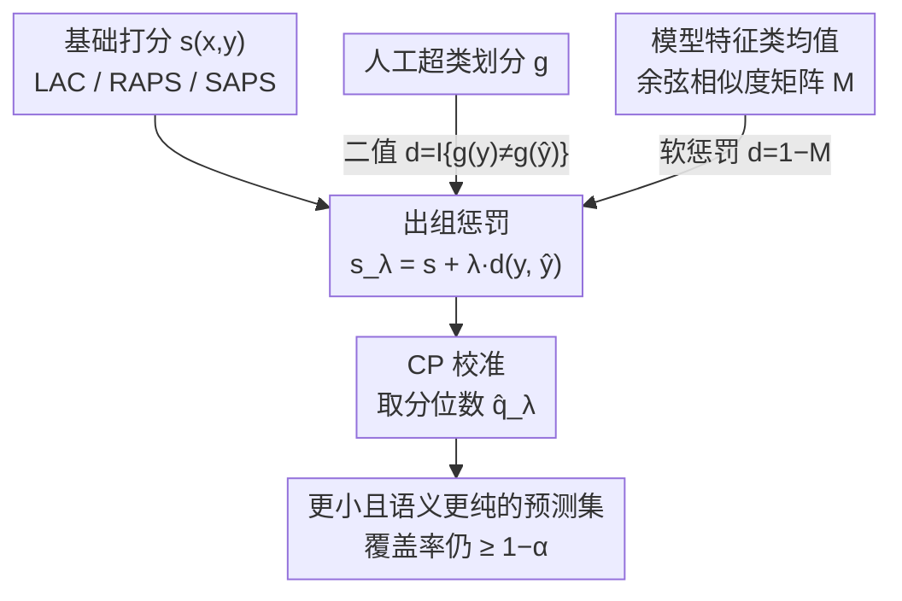

# Enhancing Conformal Prediction via Class Similarity

**会议**: ICML2026  
**arXiv**: [2511.19359](https://arxiv.org/abs/2511.19359)  
**代码**: 论文未给出公开仓库链接  
**领域**: 学习理论 / 不确定性量化 / 共形预测  
**关键词**: 共形预测, 预测集大小, 类相似度, 覆盖保证, 神经坍缩

## 一句话总结
本文给任意共形预测（CP）打分函数加一个"出组惩罚"项，惩罚那些与 top-1 预测类不同语义组的候选标签；理论证明该惩罚在保持覆盖率的前提下既能减少预测集里的语义组数、又能**意外地缩小平均预测集大小**，并进一步提出一个无需人工语义划分、直接用模型特征构造类相似度矩阵的自适应变体。

## 研究背景与动机
**领域现状**：共形预测（Conformal Prediction, CP）是高风险分类（医疗诊断、自动驾驶决策）里的可靠性框架：它不输出单个标签，而是输出一个候选标签集 $C(X)$，并在校准集与测试样本可交换的假设下提供**边际覆盖保证** $P(Y\in C(X))\ge 1-\alpha$。衡量不同 CP 方法优劣的关键指标是平均预测集大小 $\mathbb{E}[|C(X)|]$，文献称之为 efficiency（效率）。

**现有痛点**：很多实际场景里类别天然能归入语义"超类"（superclass），比如疾病按治疗方案分组、物种按科属分组。用户往往更希望预测集里的标签**只来自少数几个组**——把同组物种搞混（麻雀 A vs 麻雀 B）远不如跨组搞混（麻雀 vs 鹰）后果严重。但现有 CP 方法只保证含真标签，**完全不管集合内标签的语义一致性**；而近期那些显式引入标签结构（层次/分组）的方法，虽然改善了组条件覆盖，却普遍让预测集**比基线更大**——以牺牲效率为代价换结构。

**核心矛盾**：语义一致性（少几个组）和效率（集合小）被看成此消彼长——想让集合语义更纯，似乎就得往里塞更多同组标签把集合撑大。

**本文目标**：（1）在不破坏覆盖、不牺牲效率的前提下减少预测集里的语义组数；（2）搞清楚这种结构利用对平均集合大小到底是利是弊；（3）把方法推广到没有人工语义划分的任意数据集。

**切入角度**：注意到所有常见 CP 方法都**保留 softmax 排序**、且一定先把 top-1 预测类 $\hat{y}(x)$ 放进集合。那么只要对"离 $\hat{y}(x)$ 语义远"的候选额外加惩罚，就能在不动覆盖机制的前提下挤掉跨组标签。

**核心 idea**：给任意打分函数 $s(x,y)$ 加一个出组惩罚 $\lambda\,d(y,\hat{y}(x))$，用一个标量 $\lambda$ 同时收紧"组数"和"集合大小"。

## 方法详解

### 整体框架
CP 的标准流程是：定义打分函数 $s(x,y)$（分数越高表示 $x$ 与 $y$ 越不匹配）→ 在校准集上取 $\lceil(n+1)(1-\alpha)\rceil/n$ 分位数 $\hat{q}$ → 测试时输出 $C(x)=\{y:s(x,y)\le\hat{q}\}$。本文不替换任何一步，而是在打分函数上**外挂一个惩罚项**，得到 $s_\lambda(x,y)=s(x,y)+\lambda\,d(y,\hat{y}(x))$，再原封不动地走 CP 流程。这个改造对底层打分函数完全不可知（LAC/RAPS/SAPS 都能套），所以是个"即插即用的增强器"。

惩罚距离 $d$ 有两种构造方式，构成两条分支：**模型无关（MA）**用人工超类划分给出 0/1 二值惩罚；**模型自适应（MS）**用模型自己的特征构造软相似度、无需人工划分。两条分支都送回同一个 CP 校准流程，输出更小、语义更纯的预测集。

### 关键设计

**1. 出组惩罚项：给任意打分函数挂一个"跨组就加分"的正则项**

针对"现有结构化 CP 把集合撑大"的痛点，作者定义类到组的映射 $g:[C]\to[G]$ 和二值距离 $d(y,y'):=\mathbb{I}\{g(y)\neq g(y')\}$（同组为 0、跨组为 1），把惩罚加到任意基础分上：

$$s_\lambda(x,y):=s(x,y)+\lambda\,d(y,\hat{y}(x)),\quad \lambda>0.$$

含义是：与 top-1 预测类 $\hat{y}(x)$ 不同组的候选 $y$，分数被抬高 $\lambda$，更难进入集合。由于 $s_\lambda$ 仍是一个合法打分函数、不破坏校准集与测试样本的可交换性，**覆盖保证 $P(Y\in C_\lambda(X))\ge 1-\alpha$ 直接继承**——这是该设计能"白嫖"理论保证的关键：它没碰 CP 的覆盖机制，只换了打分。和那些重做覆盖流程的层次化 CP 不同，这里覆盖是免费送的。

**2. 三重理论保证：覆盖不变、组数不增，以及"集合反而更小"的反直觉结论**

作者先证阈值受控的引理 $\hat{q}\le\hat{q}_\lambda\le\hat{q}+\lambda$，再证核心命题 4.2：惩罚**只能移除、绝不会新增**跨组标签（$C_\lambda(x)\cap Y_1(x)\subseteq C(x)\cap Y_1(x)$，其中 $Y_1(x)$ 是出组类集合）。由此推论 $\mathbb{E}[|G_\lambda(X)|]\le\mathbb{E}[|G(X)|]$——预测集里的组数期望不增。

真正出人意料的是定理 4.5：在小 $\lambda$ 下平均集合大小的导数符号为

$$\operatorname{sign}\!\Big(\tfrac{d}{d\lambda}\mathbb{E}[|C_\lambda(X)|]\Big|_{\lambda=0}\Big)=\operatorname{sign}\big(a\,p_1 n_0 - b\,p_0 n_1\big),$$

其中 $n_0,n_1$ 是组内/组外平均类数，$p_0$ 是真标签落在预测组内的概率（即组级准确率）、$p_1=1-p_0$，$a,b$ 是两个密度因子（等大小组且条件标签均匀时 $a=b$）。作者论证实践中几乎总有 $p_1 n_0\ll p_0 n_1$：一方面组内类数远少于组外（CIFAR-100 的 20 等分组里 $n_1/n_0=19$），另一方面只要 top-1 准确率超过 0.5 就有 $p_0/p_1>1$。两个因素叠加使导数为负——**小 $\lambda$ 不仅减组数，还顺带缩小了平均集合**。这解释了一个先前无人达到的现象：作为后处理方法在平均集合大小上稳定击败标准 LAC。定理也诚实地指出失效情形（极端主导组 + 极弱模型，导数转正），但在所有 benchmark 里都没遇到。

**3. 模型自适应变体（MS）：用特征空间类均值替代人工划分**

定理 4.5 暴露了一个深层洞察：要缩小集合，根本不需要"人类意义上"的语义相似，只要分组让 $n_0$ 小、$n_1$ 大、且出组错误概率 $p_1$ 低即可。于是作者提出无需人工超类的 MS 变体：给定预训练分类器（末层 $f(x)=Wh_\theta(x)+b$），用最深特征空间里**类均值**的关系构造 $C\times C$ 相似度矩阵。具体地，类均值 $h_c=\frac{1}{n_c}\sum_{i}h_\theta(x_{c,i})$、全局均值 $h_G=\frac{1}{C}\sum_c h_c$，相似度取**中心化类均值的余弦**：

$$M_{c,c'}=\frac{\langle h_c-h_G,\,h_{c'}-h_G\rangle}{\|h_c-h_G\|\,\|h_{c'}-h_G\|}.$$

为避免二值化调阈值，惩罚改成软形式 $d_{MS}(y,y'):=1-M_{y,y'}$，得 $s_\lambda^{MS}(x,y)=s(x,y)+\lambda\,d_{MS}(y,\hat{y}(x))$。这个选择由**神经坍缩**（neural collapse）现象支撑：训练良好的分类器里同类样本在特征空间向类均值聚拢、类均值间又保持可泛化的相对关系，因此类均值的相似度天然给出"小而准"的有效分组。MS 变体不需要外部语义知识，因而能用于任何数据集；代价是它把二值惩罚换成连续惩罚后，定理 4.5 的严格证明尚未覆盖（作者列为开放问题）。

### 何时用哪个变体

| 变体 | 依赖 | 适用 | 优势 |
|------|------|------|------|
| MA-CS（模型无关） | 已知人工超类划分 | 有可靠分组结构、黑盒模型 | 理论支持更完整（尤其减组数），无需访问训练数据 |
| MS-CS（模型自适应） | 模型特征 + 训练样本 | 无人工划分的任意数据集 | 集合更小，自动贴合模型表征 |

## 实验关键数据

### 主结果（LAC 打分，$\alpha=0.05$，↓ 越小越好）

| 数据集/模型 | 指标 | Standard | Clustered | AIR | MA-CS | MS-CS |
|-------------|------|----------|-----------|-----|-------|-------|
| CIFAR100, RN50 | 集合大小 | 3.68 | 3.70 | 6.80 | 3.17 | **2.92** |
| CIFAR100, RN50 | 超类数 | 2.27 | 2.28 | **1.36** | 1.85 | 1.83 |
| CIFAR100, RN34 | 集合大小 | 3.82 | 3.62 | 7.15 | 3.51 | **2.94** |
| Living-17, RN50 | 集合大小 | 1.77 | 1.69 | 5.80 | 1.71 | **1.70** |

### 关键发现
- **MS-CS 是唯一"两头都赢"的方法**：在 CIFAR100-RN50 上把 LAC 平均集合从 3.68 压到 2.92（约 −21%），同时超类数从 2.27 降到 1.83；而 AIR 虽把超类数压到最低 1.36，却把集合撑到 6.80（几乎翻倍），印证了"现有结构化方法以效率换结构"的痛点。
- **后处理首次稳定击败标准 LAC**：作者强调据其所知，此前没有任何后处理方法能在平均集合大小上持续优于标准 LAC，本文做到了，呼应定理 4.5 的反直觉结论。
- **跨打分函数普适**：在 LAC / RAPS / SAPS 三种主流打分上一致增强，说明惩罚项与底层分数解耦、确为即插即用增强器（RAPS 下 AIR 集合膨胀到 9.75 更凸显对比）。

## 亮点与洞察
- **"减组数顺带减集合"的反直觉定理**：直觉上加惩罚抬高分数应让阈值变松、集合变大，但定理 4.5 用 $p_1 n_0\ll p_0 n_1$ 这个在真实 benchmark 里几乎恒成立的不等式，证明小 $\lambda$ 反而缩小集合——是本文最"啊哈"的地方。
- **把"语义相似"解耦成"统计有效分组"**：定理揭示缩小集合根本不需要人类语义，只要 $n_0$ 小、$p_1$ 低，这一步直接催生了无需人工划分的 MS 变体，是从理论洞察反推方法的漂亮范例。
- **可迁移到任意带特征的分类器**：用中心化类均值余弦 + 神经坍缩做相似度的思路，可迁移到任何需要"模型自身视角下类间关系"的后处理任务（如重排序、拒识、分组评估）。

## 局限与展望
- **定理 4.5 只是 $\lambda\to 0$ 的局部结果**：严格保证只在 $\lambda$ 近 0 成立，虽实验显示有效 $\lambda$ 区间并不窄，但缺乏全局刻画。
- **MS 变体缺理论覆盖**：把二值惩罚换成连续软相似度后，定理 4.5 的证明尚未推广，作者承认这是技术难点和开放方向。
- **失效情形虽罕见但真实存在**：极端主导组 + 极弱模型时导数转正、惩罚反而增大集合；论文靠"benchmark 里没遇到"经验性回避，未给出事前判据。
- **依赖 top-1 预测的稳定性**：惩罚锚定在 $\hat{y}(x)$ 上，若模型 top-1 本身不可靠，分组惩罚可能把惩罚加错方向。

## 相关工作与启发
- **vs 聚类/组条件覆盖 CP（Vovk 2012, Ding 2023 等）**：他们在每个组内单独跑 CP 以改善组条件覆盖，代价是集合比基线更大；本文反其道，既减组数又减集合大小。
- **vs 层次化 / 结构化 CP（Hengst 2025, Zhang 2025, Goren 2024）**：这些方法控制层次预测的特异性、需要已知标签层次图，且产物集合更大；本文不需层次结构、且 MS 变体连人工划分都不要。
- **vs 标准 LAC（Sadinle 2019）**：LAC 是公认最小集合的强基线；本文作为后处理增强器在多数据集上稳定把 LAC 进一步压小，这是先前后处理方法未能做到的。

## 评分
- 新颖性: ⭐⭐⭐⭐⭐ "出组惩罚顺带缩小集合"的反直觉定理 + 由理论反推的模型自适应变体，思路新颖。
- 实验充分度: ⭐⭐⭐⭐ 覆盖四数据集、多模型、三种主流打分，对比充分；但多为图像分类，缺其他模态验证。
- 写作质量: ⭐⭐⭐⭐⭐ 从直觉痛点到定理到方法层层递进，定理失效情形也诚实交代。
- 价值: ⭐⭐⭐⭐⭐ 即插即用、不破坏覆盖、还能同时改善语义一致性与效率，实用价值高。

<!-- RELATED:START -->

## 相关论文

- [\[ICLR 2026\] Efficient Credal Prediction through Decalibration](../../ICLR2026/learning_theory/efficient_credal_prediction_through_decalibration.md)
- [\[ICML 2026\] Cutting LLM Evaluation Costs with SySRs: A Bandit Algorithm that Provably Exploits Model Similarity](cutting_llm_evaluation_costs_with_sysrs_a_bandit_algorithm_that_provably_exploit.md)
- [\[NeurIPS 2025\] Conformal Online Learning of Deep Koopman Linear Embeddings](../../NeurIPS2025/learning_theory/conformal_online_learning_of_deep_koopman_linear_embeddings.md)
- [\[NeurIPS 2025\] Prediction-Powered Semi-Supervised Learning with Online Power Tuning](../../NeurIPS2025/learning_theory/prediction-powered_semi-supervised_learning_with_online_power_tuning.md)
- [\[ICML 2026\] Quantum Algorithms for Triangle Cut Sparsification](quantum_algorithms_for_triangle_cut_sparsification.md)

<!-- RELATED:END -->
