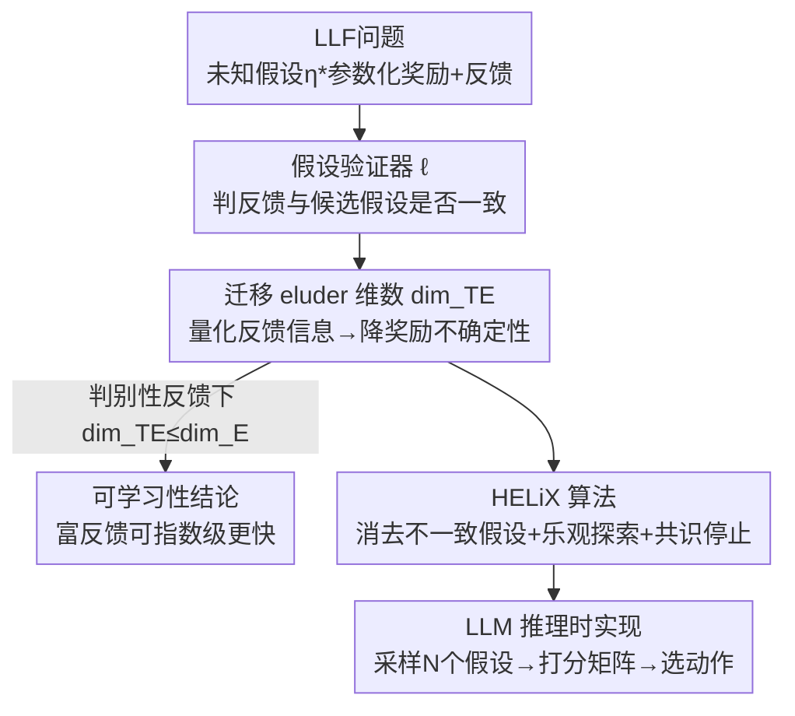

# Formalizing Learning from Language Feedback with Provable Guarantees

**会议**: ICML 2026  
**arXiv**: [2506.10341](https://arxiv.org/abs/2506.10341)  
**代码**: 待确认  
**领域**: 学习理论 / 无悔学习 / LLM智能体  
**关键词**: 语言反馈学习, 无悔算法, 迁移 eluder 维数, 假设验证器, 推理时探索

## 一句话总结
本文为"从语言反馈中学习"（Learning from Language Feedback, LLF）这一 LLM 智能体常见但缺乏理论的决策范式建立了第一个形式化框架：在奖励潜在不可见的设定下给出可学习的充分假设、提出"迁移 eluder 维数"刻画其难度、证明信息丰富的语言反馈能比奖励学习指数级更快，并给出有理论保证的无悔算法 HELiX（在 Battleship、Minesweeper 上稳定胜过 CoT 提示基线）。

## 研究背景与动机

**领域现状**：LLM 智能体越来越多地从自然语言反馈（批评、指导、解释）中学习，比如"摘要大体准确，但漏掉了主角的动机"这种反馈，比单一标量奖励信息量大得多——它同时指出"哪里错了"和"往哪改"。实证上语言反馈能大幅提升学习效率、且常比精心设计奖励更便宜。

**现有痛点**：尽管实证结果亮眼，这类决策问题**至今没有一个有原则的理论框架**。自然语言的复杂性与歧义性让"反馈到底值多少信息"难以量化，于是没人说得清：LLF 什么时候可行？它比经典的"能观测奖励"的 bandit 难还是易？反复提示 LLM 在简单任务上都可能不可靠，却缺乏理论解释。

**核心矛盾**：在 LLF 里，奖励是**潜在的、智能体观测不到**的——智能体只能看到语言反馈。没有反馈与奖励之间的任何联系，从反馈最小化遗憾在理论上根本不可能。所以关键问题是：在什么条件下、语言反馈携带多少信息，才能让"看不到奖励"的学习依然可行甚至高效？

**本文目标**：(1) 把 LLF 形式化为严格的数学决策问题；(2) 给出潜在奖励下仍可学习的充分假设；(3) 用一个复杂度度量刻画 LLF 难度，并说明"反馈信息量决定学习复杂度"；(4) 设计有遗憾保证的无悔算法。

**切入角度**：作者把 LLF 接到经典 bandit / 无悔学习的脉络上——用"假设检验与消去"的视角建模：环境由一个未知文本"假设" $\eta^*$ 参数化，奖励和反馈都是 $\eta^*$ 的函数；智能体不看奖励，只能靠一个"假设验证器"判断候选假设是否与观测到的反馈一致，从而逐步消去不一致的假设。

**核心 idea**：引入**假设验证器**（hypothesis verifier）抽取反馈中的信息、用**迁移 eluder 维数**（transfer eluder dimension）量化这些信息对降低奖励不确定性的效力，并证明只要反馈能判别奖励，LLF 就不比纯奖励学习更难。

## 方法详解

### 整体框架
本文是理论框架 + 算法，整体分三块。第一块是**形式化 LLF 与可学习性度量**：把 LLF 建成一个类 bandit 协议——每步智能体执行动作 $A_t\in\mathcal{A}$、观测反馈 $O_t\in\mathcal{O}\sim f^*(A_t)$，潜在奖励 $R_t=r^*(A_t)$ 产生但不被揭示；环境由未知假设 $\eta^*$ 参数化，奖励映射 $\eta\mapsto r_\eta$ 已知、反馈映射 $\eta\mapsto f_\eta$ 未知；用遗憾 $\mathrm{Regret}(T)=\sum_t R^*_{\max}-\mathbb{E}_{\pi_t}[R_t]$ 衡量性能。第二块是**理论结论**：定义假设验证器与迁移 eluder 维数 $\dim_{TE}$，证明信息量更大的反馈让 $\dim_{TE}$ 指数级变小、且在"判别性反馈"下 $\dim_{TE}\le\dim_E$（不比奖励学习难）。第三块是**HELiX 算法**：一个 UCB 风格的无悔算法，维护与反馈一致的假设置信集、按乐观原则探索、带共识停止准则，并给出可用 LLM 实例化的推理时实现。

### 关键设计

**1. 假设验证器：把"反馈含多少信息"变成可操作的可学习性接口**

直接枚举所有可能的自然语言反馈不现实，作者需要一个"只暴露智能体能提取到的信息"的弱定义。假设验证器是一个损失 $\ell:\mathcal{A}\times\mathcal{O}\times\mathcal{H}\to[0,1]$：给定动作 $a$、观测反馈 $o$、候选假设 $\eta$，$\ell(a,o,\eta)$ 衡量 $\eta$ 与该反馈有多一致——若一致则 $\ell=0$，否则给非零罚。它**刻意区别于奖励模型或正确性预言机**：它不证明假设为真，只判断假设"有没有被观测到的东西证伪"，作用类似单元测试。作者举的硬币例子很说明问题：抛硬币头概率 $\eta\in\{0,0.1,0.5\}$，定义 $\ell(a,o,\eta)=\mathbb{1}[(a,o)\text{ 在 }\eta\text{ 下概率为零}]$——若把反馈从"match/miss"丰富成"miss——你太乐观了，硬币偏反面"，同一个 $\ell$ 就能从语言里榨出远超 1 比特的信息、更快消去假设。基于 $\ell$ 还定义了假设等价（$d_\mathcal{H}(\eta,\eta')=\sup_{a,o}|\ell(a,o,\eta)-\ell(a,o,\eta')|$，距离为 0 即语义等价），让框架对"同义不同词"的自然语言天然鲁棒。

为保证可学习，作者用比"自洽"更弱的**无偏反馈**假设（Assumption 3）：即便反馈有噪，每个假设在其诱导分布下仍最小化期望验证器损失，$\eta\in\arg\min_{\eta'}\mathbb{E}_{O\sim f_\eta(a)}[\ell(a,O,\eta')]$。再加上奖励映射已知（Assumption 1，可用 LLM-as-Judge 实现）和验证器可访问（Assumption 2），三条假设共同支撑可学习性。

**2. 迁移 eluder 维数：量化反馈信息对降低奖励不确定性的效力**

经典 eluder 维数只看奖励函数类的复杂度，无法刻画"反馈带来的额外信息"。作者把它推广为迁移 eluder 维数 $\dim_{TE}(\mathcal{H},\ell,\epsilon)$：动作 $a$ 对 $\{a_1,\dots,a_n\}$ 是 $\epsilon$-迁移**独立**的，当存在两个假设在历史动作上的验证器损失都很小（$\sum_i(\mathbb{E}_{O\sim f_{\eta'}(a_i)}[\ell(a_i,O,\eta)]-\ell^{\min}_{\eta'}(a_i))\le\epsilon^2$）、却在 $a$ 上奖励预测差很大（$|r_\eta(a)-r_{\eta'}(a)|>\epsilon$）。$\dim_{TE}$ 是这种独立序列的最长长度。直觉是：$\dim_{TE}$ 越小，单条反馈对未知奖励的信息越多，LLF 就越能比奖励学习高效。它同时依赖**验证器损失和奖励函数**两个量，这正是它能捕捉"反馈里与奖励相关的信息"的关键。

在一个 $L$ 步数学推理的样例上，作者算出四种反馈对应的 $\dim_{TE}$，清晰展示"反馈越有建设性、复杂度越低"：

| 反馈类型 | $\dim_{TE}$ |
|----------|-------------|
| 奖励（是否所有步都对） | $O(\|\mathbb{S}\|^L)$ |
| 解释（第一个错步的位置） | $O(\|\mathbb{S}\|L)$ |
| 建议（如何改正第一个错误） | $O(L)$ |
| 示范（给出所有正确步） | $O(1)$ |

可见纯奖励需指数级枚举所有序列；指出首个错步就能分阶段分解、在 $L$ 上指数改进；进一步给出改正方法则复杂度不再依赖步集大小 $|\mathbb{S}|$；直接给答案则复杂度变常数。

**3. 判别性反馈下 $\dim_{TE}\le\dim_E$：证明 LLF 不比奖励学习难**

为给出一般性结论，作者定义**判别性反馈**（Definition 5）：存在 $C_F>0$ 使 $|r_\eta(a)-r_{\eta'}(a)|^2\le C_F\,\mathbb{E}_{o\sim f_\eta(a)}[\ell(a,o,\eta')-\ell^{\min}_\eta(a)]$，即验证器能按奖励差的程度区分假设。Proposition 1 证明：判别性 LLF 满足 $\dim_{TE}(\mathcal{H},C_F\ell,\epsilon)\le\dim_E(\mathcal{R}_\mathcal{H},\epsilon)$，所以判别性 LLF 不比其纯奖励对应物更难（经典 RL 是其特例）。但作者强调一般 LLF **不必是判别性**的——这正是 LLF 框架区别于 IGL 等已有工作的地方：当反馈不判别奖励、却揭示了最优动作信息时，LLF 能反映出更低的学习复杂度，而纯奖励formulation会丢掉这部分信息。

**4. HELiX 算法：UCB 风格无悔算法 + 共识停止 + LLM 推理时实现**

HELiX（Hypothesis Elimination using Language-informed eXploration）按乐观原则用反馈引导探索。每步维护一个置信集 $\mathcal{H}_t$，只保留经验验证器损失接近最小的假设（$\frac{1}{t}\sum_i\ell(A_i,O_i,\eta)-\min_{\eta'}\frac{1}{t}\sum_i\ell(A_i,O_i,\eta')\le\epsilon_t$）；然后找乐观最优假设、跟随其最优策略探索。相比标准 UCB，HELiX 多了一个**共识停止准则**（line 7）：若极小极大遗憾 $\min_\pi\max_{\eta\in\bar{\mathcal{H}}}r_\eta(\pi_\eta)-r_\eta(\pi)=0$，说明存在对所有候选假设都最优的共识动作，此时直接利用、不再过度探索——这对"反馈直接揭示最优动作但不含奖励信息"的非判别性平凡问题尤其重要。

理论保证（Theorem 1）：在三条假设下，HELiX 遗憾被界为 $\tilde{O}(T^{3/4}(\log N(\mathcal{H},\epsilon^\mathcal{H}_T,d_\mathcal{H}))^{1/4}\sqrt{\dim_{TE}(\mathcal{H},\ell,\epsilon^\mathcal{H}_T)})$，与迁移 eluder 维数次线性相关。$T^{3/4}$ 看似劣于经典 $\sqrt{T}$，但这是"对 $\ell$ 只假设有界"这一最小假设的必然代价；若已知 $\ell$ 是平方损失等结构，可收紧到 $\tilde{O}(\sqrt{T})$。

实用层面，作者用 LLM 近似算法三步：(1) **维护一致假设集**——提示 LLM 采样 $N$ 条思维 token 流作为与反馈一致的假设（LLM 隐式扮演验证器，过滤掉高损失假设，省 LLM 调用）；(2) **极小极大利用步**——为每个假设生成对应最优动作，构造打分矩阵 $S_t\in[0,1]^{N\times N}$（提示 LLM 给"假设-动作"对打分，相当于奖励映射 $r_\eta$），取对所有假设都最优的共识动作；(3) **乐观探索步**——用同一 $S_t$ 选得分最高的动作，实现"面对不确定性时乐观"。这给了 LLM 一个区别于单链 CoT 的推理时探索-利用策略：采样多假设并自我验证，而非沿单条思维链走到底。

## 实验关键数据

### 主实验
在两个需要从语言反馈学习的自然语言任务 Battleship、Minesweeper 上对比累计奖励（用 Claude-Sonnet-3.5 v2 作底座 LLM）：

| 智能体 | 机制 | 表现 |
|--------|------|------|
| CoT | 生成一个假设+一个动作立即返回 | 基线，普遍最差 |
| HELiX (无利用步) | 只做乐观探索、去掉共识利用步 | 优于 CoT，但不及完整版 |
| **HELiX** | 探索 + 共识利用 | 在两个任务上稳定最好 |

### 消融实验（共识利用步的作用）

| 配置 | 关键结果 | 说明 |
|------|---------|------|
| HELiX（完整） | 累计奖励最高 | 探索 + 利用共识动作 |
| w/o 利用步 | 落后于完整版 | 仅乐观探索不足以达到最优 |
| CoT 基线 | 最低，尤其 Minesweeper 差距大 | 单链推理在需信息搜集的任务上失灵 |

### 关键发现
- 在 Minesweeper 这类**信息搜集至关重要**的环境，会做策略性探索-利用的 HELiX 大幅领先 CoT——说明 LLM 的内在 CoT 能力不足以替代有原则的探索。
- 消融显示**只做乐观探索还不够**：去掉共识利用步后表现下降，证明共识停止准则是有效达到最优的关键组件，而非冗余。
- 即使反复提示 LLM（CoT）在简单语言任务上都不可靠时，HELiX 仍稳定可用——为"理论指导的算法 > 朴素提示"提供了初步实证。

## 亮点与洞察
- **把"语言反馈值多少"变成可算的复杂度**：迁移 eluder 维数第一次把"反馈信息量决定学习难度"这一直觉量化，且能在样例上算出奖励/解释/建议/示范四档反馈的指数级递降，极具解释力。
- **假设验证器 ≠ 奖励模型**的设计很关键：它只判"是否被证伪"（像单元测试）而非"是否为真"，这层抽象既容纳了自然语言的歧义/同义，又把"看不到奖励"的学习接回了经典消去式 bandit 理论。
- **理论直接反哺算法**：HELiX 不是空中楼阁，三步 LLM 近似（采样假设、打分矩阵、选共识/乐观动作）给出了一个可落地、区别于 CoT 的推理时探索策略，是"理论 → 实用 inference-time 方法"的范例。
- 共识停止准则是巧思：它专门处理"反馈揭示最优动作却不含奖励信息"的非判别性情形，避免在已能确定最优动作后还过度探索。

## 局限与展望
- 实用实现高度依赖几条对 LLM 的强假设：LLM 能在给定假设下选出最优动作、能跨假设对动作公平打分、能采样既多样又忠于历史的假设——作者明确承认这些假设未必对所有 LLM 成立，需进一步验证。
- $T^{3/4}$ 的遗憾率在最小假设下是合理的，但比经典 $\sqrt{T}$ 慢；要拿到 $\sqrt{T}$ 需对 $\ell$ 加结构假设（如平方损失）。
- 迁移 eluder 维数只是分析工具，算法实际运行时**无法估计**它（尤其用 LLM 时），所以理论难度刻画与实际部署之间仍有 gap。
- 实验仅在 Battleship、Minesweeper 两个任务、单一 LLM 上做，规模偏小，作者自称"初步证据"；更广任务与更多 LLM 上的稳健性待验证。

## 相关工作与启发
- **vs IGL（Interaction-Grounded Learning）**：IGL 也处理无显式奖励的反馈学习，但 LLF 更一般——当反馈非判别性却揭示最优动作信息时，LLF 能反映更低复杂度，而 IGL 对应的纯奖励视角会丢掉这部分信息。
- **vs 直接把 LLM 当智能体/把反馈塞进提示或记忆（ReAct、Reflexion 等）**：这些是纯实证、无统一框架与保证；本文提供形式化框架与遗憾界，并把朴素 CoT 提示对应到"从一致假设集随机采一个假设的贪心算法"，解释了它为何可能不探索、无低遗憾保证。
- **vs 经典 UCB / bandit**：HELiX 沿用乐观原则，但关键差别是**不观测奖励**——它通过假设验证器损失从反馈解码信息来构造置信集，而非直接用奖励；也区别于假设访问真值奖励或把假设当 MDP 代码的近期 LLM-agent UCB 启发式。

<!-- RELATED:START -->

## 相关论文

- [\[ICML 2026\] Unraveling Syntax: Language Modeling and the Substructure of Grammars](unraveling_syntax_language_modeling_and_the_substructure_of_grammars.md)
- [\[ICLR 2026\] Lipschitz Bandits with Stochastic Delayed Feedback](../../ICLR2026/learning_theory/lipschitz_bandits_with_stochastic_delayed_feedback.md)
- [\[ICML 2026\] Revenue Guarantees of No-Swap-Regret Dynamics in First Price Auctions](revenue_guarantees_of_no-swap-regret_dynamics_in_first_price_auctions.md)
- [\[ICLR 2026\] Algorithmic Guarantees for Distilling Supervised and Offline RL Datasets](../../ICLR2026/learning_theory/algorithmic_guarantees_for_distilling_supervised_and_offline_rl_datasets.md)
- [\[ICLR 2026\] Scalable Random Wavelet Features: Efficient Non-Stationary Kernel Approximation with Convergence Guarantees](../../ICLR2026/learning_theory/scalable_random_wavelet_features_efficient_non-stationary_kernel_approximation_w.md)

<!-- RELATED:END -->
