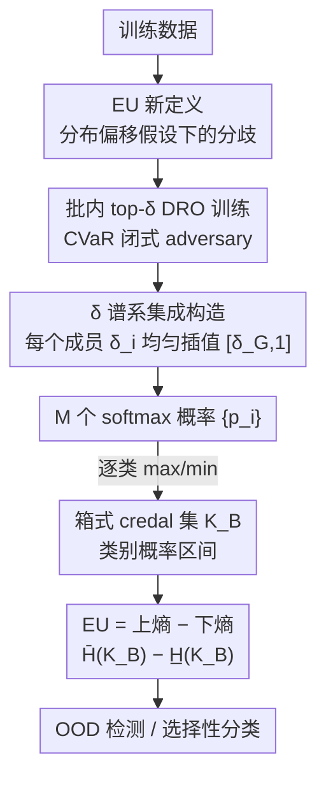

# Learning Credal Ensembles via Distributionally Robust Optimization

**会议**: ICML2026  
**arXiv**: [2602.08470](https://arxiv.org/abs/2602.08470)  
**代码**: https://github.com/Kaizheng-WANG/Learning-Credal-Ensembles-via-Distributionally-Robust-Optimization  
**领域**: 学习理论 / 不确定性量化  
**关键词**: 认知不确定性, credal集, 分布鲁棒优化, 深度集成, OOD检测

## 一句话总结
CreDRO 把「认知不确定性」重新定义为**不同训练-测试分布偏移假设下模型之间的分歧**，用分布鲁棒优化（DRO）给集成中每个成员分配不同的偏移强度来训练，再把它们的 softmax 转成类别概率区间、构成一个箱式 credal 集来量化不确定性，从而在 OOD 检测和医疗选择性分类上稳定超过现有 credal 方法。

## 研究背景与动机

**领域现状**：在安全攸关场景里，可靠的不确定性量化（UQ）很关键，而其中要把**偶然不确定性 AU**（数据本身的随机性）和**认知不确定性 EU**（模型对真实输入-输出关系认识不足）分开。AU 通常用单个概率分布（如 softmax）就够，但 EU 需要「二阶」表示——对预测分布本身的不确定性。**Credal 集**（概率分布的凸集）正是这种二阶表示，近年被用来改进深度学习里的 EU 量化。

**现有痛点**：当前 SOTA 的 credal 预测器（credal wrapper、credal ensembling、relative-likelihood 等）几乎都把 EU 定义成**随机初始化带来的集成分歧**。但这种分歧主要反映的是「优化随机性」——同一份数据换个随机种子训练出来的抖动，而不是来自更实质的不确定性来源（比如训练/测试分布可能不一致）。换句话说，它们量化的 EU 很大程度上只是「优化噪声」。

**核心矛盾**：EU 本应刻画「模型在部署时面对未知分布的无知」，而随机初始化分歧和真正的「分布偏移无知」之间是错位的——再多的随机种子也模拟不出训练分布与测试分布的系统性差异。

**本文目标**：找到一个能反映「实质性不确定性来源」的 EU 定义，并据此训练集成，使得量化出的 EU 在 OOD 检测、选择性分类这类下游任务上更有判别力。

**切入角度**：作者从分布鲁棒优化（DRO）出发——DRO 本来就假设测试分布落在训练分布的某个邻域内、去最小化最坏情况风险。如果让不同成员在**不同松弛程度的 i.i.d. 假设**下训练（即假设不同强度的训练-测试偏移），它们之间的分歧就自然编码了「对分布偏移的无知」。

**核心 idea**：把 EU 定义为「不同分布偏移假设下训练出的模型之间的分歧」，用 DRO 训练一组成员、每个成员对应一个偏移强度，分歧既包含训练随机性、也包含更有信息量的分布偏移分歧——即 **CreDRO**。

## 方法详解

### 整体框架

CreDRO 分训练和推理两段。**训练**：基于群体 DRO 的对抗重加权学习（ARL），给集成中第 $i$ 个成员分配一个不同的鲁棒性水平 $\delta_i$（由一个全局超参 $\delta_G$ 均匀插值生成），每个成员只在自己那档「最难样本」上训练，从而模拟不同程度的分布偏移、产生结构化的成员分歧。**推理**：把各成员的 softmax 概率逐类取 max/min 得到类别概率区间，构成一个**箱式 credal 集** $\mathcal{K}_B$，再用该集合上的**上熵 − 下熵**之差作为 EU 估计。整个方法不改网络架构、不加输出神经元。

### 关键设计

**1. 认知不确定性的重新定义：从「随机初始化分歧」到「分布偏移假设下的分歧」**

这是全文的立足点。已有 credal 方法把 EU 当成同一数据、不同随机种子训出来的抖动，只反映优化随机性。CreDRO 把 EU 重新定义为：**在训练-测试 i.i.d. 假设被松弛到不同程度时，模型之间产生的分歧**。直观上，如果你假设测试分布可能偏离训练分布到不同强度，并据此训练出一组模型，它们在某个输入上越不一致，说明对该输入的「分布偏移无知」越大。这样得到的 EU 既包含训练随机性、又包含更有信息量的偏移分歧，比纯随机初始化更贴近 EU 的本意。后续整套训练与集成构造都是为了把这个定义落地。

**2. 基于 CVaR 的批内 top-δ DRO 训练：用闭式 adversary 只在最难样本上学**

要让单个模型体现「某种分布偏移假设」，作者采用群体 DRO 家族里的对抗重加权学习（ARL）：学习者最小化、对抗者通过给样本加权 $w_n$ 最大化期望损失。关键是把不确定性集合 $\mathbb{W}$ 实例化为 level 为 $\delta$ 的 **CVaR 集**：

$$\mathbb{W}=\Big\{\mathbf{w}\ge 0 \mid \textstyle\sum_{n=1}^N w_n=N,\ w_n\le\delta^{-1},\ \forall n\Big\}$$

$\delta$ 越小，集合越保守（$\delta_1<\delta_2\Rightarrow\mathbb{W}(\delta_1)\supseteq\mathbb{W}(\delta_2)$）。这个内层最大化有**闭式解**：最优对抗者把权重 $\delta^{-1}$ 全压在损失最高的 top-$\lfloor\delta N\rfloor$ 个样本上、其余为零。于是训练落地成一个朴素操作——**每个 batch 只用损失最高的 top-$\delta$ 比例样本做反向传播**。这些「难学」样本往往对应训练数据里的少数群体，等价于在训练时模拟了潜在的域偏移。这一步把抽象的 DRO 目标变成了几乎零成本的批内排序选样。

**3. δ 谱系的集成构造：给每个成员不同的偏移假设，制造结构化分歧**

单个 $\delta$ 只代表一种偏移假设；要让集成覆盖「不同程度的偏移」，CreDRO 引入一个全局超参 $\delta_G\in[0.5,1)$ 表示假设的最坏散度，再给第 $i$ 个成员分配

$$\delta_i=\frac{1-\delta_G}{M-1}\cdot(i-1)+\delta_G$$

即在 $[\delta_G,1]$ 上**均匀插值**。均匀插值是无额外假设的自然选择（没有领域先验时，所有 $\delta$ 同等可信）。$\delta_G$ 下界设为 0.5：太小会让最低档成员只在极少高损样本上训练（如 $\delta_G=0.3$、batch=128 时每批仅 38 个样本），梯度大且不稳；当 $\delta_G\to 1$，所有样本都参与反传，DRO 损失退化为 ERM，CreDRO 也就退回成标准集成。因此 $\delta$ 谱系正是「随机初始化分歧 + 分布偏移分歧」的来源——成员之间不再只差一个随机种子，而是差在对分布偏移的假设强度上。

**4. 箱式 credal 集 + 上下熵差量化 EU：把成员分歧转成可比的不确定性数值**

有了一组成员的 softmax 概率 $\{\boldsymbol{p}_i\}_{i=1}^M$，CreDRO 在推理时逐类取上下界 $\overline{p}_k=\max_i p_{i,k}$、$\underline{p}_k=\min_i p_{i,k}$，构成**箱式 credal 集**：

$$\mathcal{K}_B=\Big\{\boldsymbol{p}\mid p_k\in[\underline{p}_k,\overline{p}_k]\ \forall k,\ \textstyle\sum_{k=1}^C p_k=1\Big\}$$

另一种构造是成员概率的凸包 $\mathcal{K}_C$，但 $\mathcal{K}_C\subseteq\mathcal{K}_B$，且 $\mathcal{K}_B$ 计算 EU 更高效，故采用 $\mathcal{K}_B$。EU 取该集合上的**上熵减下熵** $\overline{H}(\mathcal{K}_B)-\underline{H}(\mathcal{K}_B)$，其中上/下熵分别是在区间约束下最大化/最小化香农熵的优化问题（用 SciPy 求解，开销很小）。和最接近的 CreDE 相比，CreDRO 有三点不同：① 不需把输出神经元翻倍（CreDE 要为每类预测上下界）；② 对经典 NN 直接施加 DRO、不受 one-hot 标签限制；③ 给各成员一个 $\delta$ **范围**而非单一固定值，让分歧来自偏移假设而非仅随机初始化。

### 损失函数 / 训练策略
损失用标准交叉熵（CE，也可换 focal loss），训练即 Algorithm 1：每个成员每个 batch 按损失降序排，取 top-$\delta_i$ 比例样本反向传播。主实验用 ResNet18、$M=20$、$\delta_G=0.5$ 在 CIFAR10 上续训。

## 实验关键数据

### 主实验
OOD 检测作为评估 EU 质量的代理任务（CIFAR10 为 ID，用 EU 当判别分数算 AUROC）。下表为 $M=20$、3 次平均的 AUROC（%），CreDRO 在全部 OOD 集上最优：

| 方法 | SVHN | Places | CIFAR100 | FMNIST | ImageNet |
|------|------|------|------|------|------|
| DE（深度集成） | 94.8 | 90.0 | 90.6 | 92.9 | 88.9 |
| EN-DRO（DRO 但不出 credal） | 95.7 | 91.1 | 91.6 | 94.0 | 90.0 |
| CreWra | 95.7 | 91.6 | 91.6 | 95.2 | 89.0 |
| CreDE | 94.3 | 91.8 | 91.2 | 95.1 | 88.4 |
| CreBNN | 90.7 | 88.5 | 88.0 | 93.5 | 85.9 |
| **CreDRO** | **97.4** | **92.7** | **92.5** | **96.4** | **91.1** |

EN-DRO 已经普遍优于 DE，说明 DRO 训练本身就有帮助；而 CreDRO 在 EN-DRO 之上再用 credal 表示，进一步拉开差距，印证「DRO 偏移分歧 + credal 量化」组合的有效性。

### 消融与分析
作者还从多个角度验证设计选择：

| 分析 | 配置 | 关键结果 | 说明 |
|------|------|------|------|
| 点预测质量 (Table 2) | DE / **CreDRO** | 准确率 0.9569 / **0.9637**；ECE 0.0051 / **0.0038** | 即使只取平均概率，CreDRO 也更准更校准 |
| credal 集构造 (Table 5) | $\mathcal{K}_C$ / $\mathcal{K}_B$ | $\mathcal{K}_B$ 全面胜出（如 SVHN 96.0→96.6, M=5） | $\mathcal{K}_B$ 放大 OOD 的 EU、ID 的 EU 几乎不涨 |
| 超参 $\delta_G$ (Table 4) | 0.5–0.9 | AUROC 波动 <1 点 | $\delta$ 谱系抵消了单一 $\delta_G$ 的主观性 |
| 标签噪声 (Table 6) | CreRAM / **CreDRO** | 10%/20% 噪声下 CreDRO 仍最优 | top-loss 选样选的是结构性难样本，非随机重加权 |
| 运行时 (Table 3) | CreDRO vs CreDE | 训练 6568 vs 6760 s、推理 1.89 vs 2.03 s | 比 CreDE 轻（后者输出翻倍）；UQ 用 $\mathcal{K}_B$ 远快于凸包的 CreEns（116 vs 308 s） |

### 关键发现
- **DRO 偏移分歧 > 随机初始化分歧**：CreDRO 一致超过把随机种子当 EU 来源的 credal 方法，说明 EU 的来源选对了比表示形式更关键。
- **$\mathcal{K}_B$ 比 $\mathcal{K}_C$ 好的根因**：OOD 检测靠 ID/OOD 的 EU 相对差，$\mathcal{K}_C\subseteq\mathcal{K}_B$ 使 $\mathcal{K}_B$ 在 OOD 上 EU 更大、ID 上几乎不增，从而拉大 EU gap。
- **对标签噪声鲁棒**：噪声标签的高损是「飘忽」的，少数群体样本的高损是「系统性」的，top-loss 选样更稳定地选中后者，所以即便有噪声 CreDRO 仍稳。

## 亮点与洞察
- **重新定义 EU 来源是真正的「啊哈」点**：大家都在改 credal 集的表示/聚合，CreDRO 退一步问「分歧该来自哪」，把随机初始化换成分布偏移假设，从源头改进 EU 质量——这种「换问题而非换技巧」的思路很可迁移。
- **CVaR 的闭式 top-δ 让 DRO 几乎零成本**：内层最大化有解析解，落地成「每 batch 只用最难的 top-δ 样本反传」，无需解优化子问题，工程上极简。
- **用一个 $\delta$ 谱系把「随机性 + 偏移」两类不确定性合到一个集成里**，且 $\delta_G\to1$ 平滑退化为标准集成，设计自洽。
- **不改架构、不翻倍输出神经元**：相比 CreDE 更轻、且不被 one-hot 标签限制，兼容现有训练范式。

## 局限与展望
- **额外训练开销**：批内按损失排序选样比普通集成训练略重（Table 3 中训练时间高于 CreWra/CreEns）。
- **$\delta_G$ 仍是主观先验**：虽证明对其鲁棒，但下界 0.5、均匀插值都是设计选择，缺乏从数据自适应确定偏移强度的机制。
- **credal 集 EU 度量仍是开放问题**：作者也承认从 credal 集导出单一代表概率、以及把 ECE 严格推广到 credal 集都尚未解决。
- **评测以 CIFAR10 + 图像分类为主**：虽含医疗选择性分类，但更大规模/更多模态下的表现仍待验证。

## 相关工作与启发
- **vs 深度集成 DE（Lakshminarayanan 2017）**：DE 用随机初始化分歧近似 EU；CreDRO 把分歧来源换成分布偏移假设，AUROC 一致更高，且点预测也更准更校准。
- **vs CreDE（credal deep ensemble, Wang 2024）**：最接近的工作，也用 DRO，但要翻倍输出神经元预测上下界、用单一固定 $\delta$、受 one-hot 限制；CreDRO 不改架构、给 $\delta$ 谱系、不限标签形式。
- **vs credal wrapper / credal ensembling / relative-likelihood**：这些是后处理把集成映成 credal 集，分歧仍系于随机初始化；CreDRO 在训练阶段就注入偏移分歧。
- **vs 贝叶斯神经网络 / 证据深度学习（EDL）**：BNN 需多次前向且难扩展，EDL 近期被指 EU 表示不忠实；CreDRO 走集成 + DRO 路线规避这些问题。

## 评分
- 新颖性: ⭐⭐⭐⭐⭐ 把 EU 来源从随机初始化重定义为分布偏移分歧，是概念层面的实质创新。
- 实验充分度: ⭐⭐⭐⭐ 多 OOD 基准 + 准确率/校准/运行时/噪声/credal 构造多维消融较全；但任务以图像分类为主。
- 写作质量: ⭐⭐⭐⭐⭐ 从动机到 CVaR 闭式推导、与 CreDE 的三点区分都讲得清楚。
- 价值: ⭐⭐⭐⭐ 免架构改动、即插即用于安全攸关 UQ，OOD/选择性分类实用价值高。

<!-- RELATED:START -->

## 相关论文

- [\[ICLR 2026\] Bandit Learning in Matching Markets Robust to Adversarial Corruptions](../../ICLR2026/learning_theory/bandit_learning_in_matching_markets_robust_to_adversarial_corruptions.md)
- [\[ICML 2026\] On Regret Bounds of Thompson Sampling for Bayesian Optimization](on_regret_bounds_of_thompson_sampling_for_bayesian_optimization.md)
- [\[ICLR 2026\] Efficient Credal Prediction through Decalibration](../../ICLR2026/learning_theory/efficient_credal_prediction_through_decalibration.md)
- [\[ICLR 2026\] Adversarially Pretrained Transformers May Be Universally Robust In-Context Learners](../../ICLR2026/learning_theory/adversarially_pretrained_transformers_may_be_universally_robust_in-context_learn.md)
- [\[ICML 2026\] MMD-Balls as Credal Sets: A PAC-Bayesian Framework for Epistemic Uncertainty in Test-Time Adaptation](mmd-balls_as_credal_sets_a_pac-bayesian_framework_for_epistemic_uncertainty_in_t.md)

<!-- RELATED:END -->
