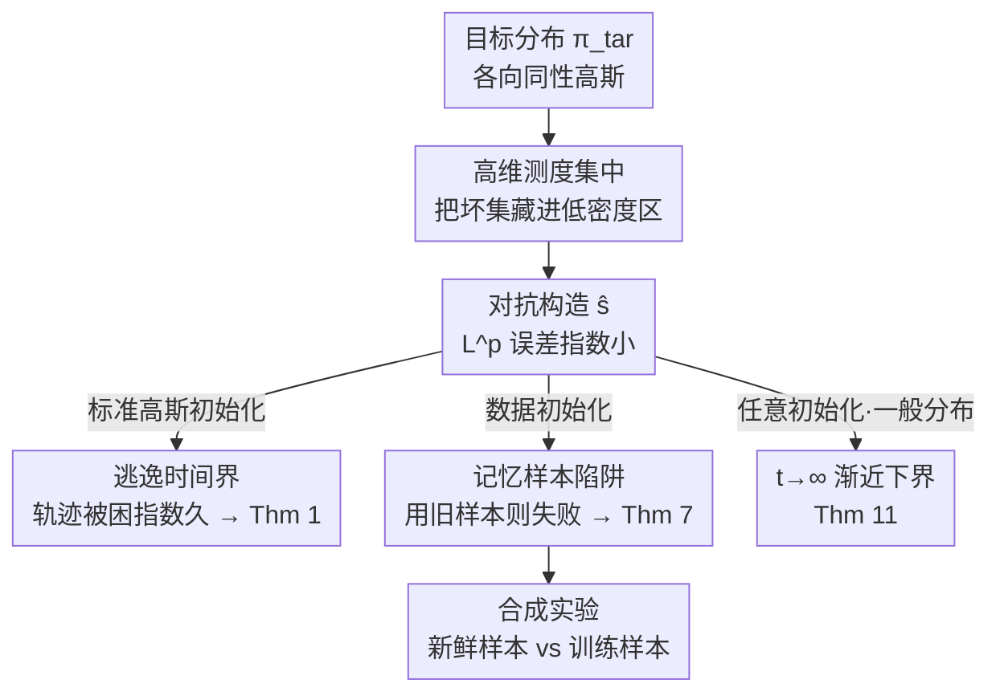

# On the Robustness of Langevin Dynamics to Score Function Error

**会议**: ICML 2026  
**arXiv**: [2603.11319](https://arxiv.org/abs/2603.11319)  
**代码**: 无（理论 + 合成实验）  
**领域**: 学习理论 / 生成模型 / 基于分数的采样  
**关键词**: Langevin 动力学, 扩散模型, 分数估计误差, 总变差距离, 数据初始化

## 一句话总结
这篇论文证明了一个反直觉的负面结果：即使分数函数的 $L^2$（乃至 $L^p$）估计误差任意小，Langevin 动力学在高维下仍可能在任何多项式时间内都采不出接近目标分布的样本（总变差距离高达 $1-e^{-\Omega(d)}$）；而同样条件下扩散模型却能多项式时间成功——这从一个新角度论证了「扩散模型比 Langevin 动力学更可靠」，并给出一条实用警告：用数据初始化时必须用没参与训练分数的新鲜样本。

## 研究背景与动机
**领域现状**：统计与机器学习里大量采样算法是「基于分数」的——它们靠分数函数 $\nabla\log\pi_{\rm tar}$ 驱动一个随机过程来逼近目标分布 $\pi_{\rm tar}$。两个代表：Langevin 动力学（经典 SDE $\mathrm dX_t=\nabla\log\pi_{\rm tar}(X_t)\mathrm dt+\sqrt2\,\mathrm dB_t$，连续时间下温和条件即收敛到 $\pi_{\rm tar}$）和扩散模型（用一串退火分数 $\nabla\log\pi_0,\dots,\nabla\log\pi_k$ 做时间反演）。

**现有痛点**：实践中分数函数并不已知，必须用 score matching 从数据里学一个估计 $\hat s$，学出来的 $\hat s$ 只保证在 $L^2$（或 $L^p$）意义下准确。对扩散模型，这个问题已被解决得很漂亮：只要所有退火分数的 $L^2$ 误差的某个加权平均 $\varepsilon_{\rm score}$ 小，就有 $\mathrm{TV}(\pi_{\rm tar},\widehat{\pi_{\rm tar}})\lesssim\varepsilon_{\rm score}$，多项式时间成功。但对 Langevin 动力学，「小 $L^2$ 分数误差是否足够保证成功」这个**核心问题一直没有答案**。已有工作要么研究 $L^\infty$ 误差（比 $L^2$ 苛刻得多、不符合 score matching 实际），要么（Lee et al. 2022）给出的 $L^2$ 误差界往往要求维度上指数级小。

**核心矛盾**：扩散模型成功靠的是「**所有退火分数**都准」，而 Langevin 动力学只用「**目标分数本身** $\nabla\log\pi_{\rm tar}$ 准」。后者在某些分布上甚至更容易学。问题是：只有 $\nabla\log\pi_{\rm tar}$ 的 $L^2/L^p$ 准确估计，够不够让 Langevin 动力学成功采样？

**本文目标**：回答这个核心问题——并且是**强烈否定**的回答。证明哪怕目标分布简单到各向同性高斯、$\hat s$ 还是 Lipschitz 的、初始化也很自然，Langevin 动力学仍会失败。

**核心 idea**：用高维测度集中现象「藏坏集」——把 $\hat s$ 在一个 $\pi_{\rm tar}$ 下质量指数小的区域里做手脚（让梯度场指向错误的吸引子），这样 $L^p$ 误差（按 $\pi_{\rm tar}$ 加权）任意小，但从自然初始化出发的 Langevin 轨迹会被困在错误区域指数久，从而在 TV 上离 $\pi_{\rm tar}$ 极远。

## 方法详解

### 整体框架
本文是一篇构造性下界论文：核心手段是**对抗式地构造一个分数估计 $\hat s$**，让它同时满足两件看似矛盾的事——(a) 相对 $\pi_{\rm tar}$ 的 $L^p$ 误差指数小 $e^{-\Omega(d)}$；(b) 用它跑的 Langevin SDE 在任何 $\mathrm{poly}(d)$ 时间内 TV 距离 $\geq 1-e^{-\Omega(d)}$。整套论证由「高维测度集中」这一把钥匙贯穿：在高维下，目标分布 $\pi_{\rm tar}=N(\mu,I_d)$ 的几乎全部质量集中在半径 $\sqrt d$ 的薄球壳上，于是一个落在「内部低密度区」的坏集对 $L^p$ 误差几乎无贡献，却能成为困住轨迹的陷阱。

论文按「初始化方式」递进给出三个下界：**标准高斯初始化（Thm 1）** 是最干净的反例；**数据初始化（Thm 7）** 是最具实践意义的主结果，揭示「记忆训练样本」的危险；**任意初始化 + 一般目标分布（Thm 11）** 把负面结论推广到 $t\to\infty$ 渐近极限。最后用合成实验（Section 4）验证主结果的实用处方。三个定理的证明骨架一致，差别只在「坏集」长什么样、以及如何论证 $L^p$ 误差小。

### 关键设计

**1. 高维「藏坏集」构造：让 $L^p$ 误差指数小却仍失败（Thm 1）**

针对「小 $L^2$ 误差是否足够」这个问题，作者在标准高斯初始化下给出最干净的反例。取 $\pi_{\rm tar}=N(\mu,I_d)$ 且 $\|\mu\|=7\sqrt d$，把分数估计 $\hat s$ 定义成分区函数：在 $\|x\|\leq 4\sqrt d$ 处 $\hat s(x)=-\alpha x$（指向原点的错误吸引子，$\alpha$ 是大常数），在 $\|x\|\geq 5\sqrt d$ 处 $\hat s(x)=-(x-\mu)$（正确分数），中间用 Lipschitz 的 bump 函数 $\psi$ 平滑过渡。关键洞察是：在 $\pi_{\rm tar}$ 下，集合 $\{x:\|x\|\leq 5\sqrt d\}$ 的质量**指数小**（因为 $\pi_{\rm tar}$ 的质量集中在 $\|x\|\approx 7\sqrt d$ 的球壳），而在这个坏集里 $\|\hat s-\nabla\log\pi_{\rm tar}\|$ 至多多项式大，于是 $L^p$ 误差 $\mathbb E_{\pi_{\rm tar}}[\|\hat s-\nabla\log\pi_{\rm tar}\|^p]^{1/p}\leq e^{-\Omega(d)}$ 任意小。但从 $X_0\sim N(0,I_d)$ 出发（以指数高的概率 $\|x_0\|\leq 1.1\sqrt d$，落在内部坏集），在逃离 $A=\{\|x\|\geq 4\sqrt d\}$ 之前 $\hat s(x)=-\alpha x$，轨迹等价于一个缩放的 OU 过程 $\mathrm d\bar X_t=-\alpha\bar X_t\mathrm dt+\sqrt2\mathrm dB_t$，其平稳分布是 $N(0,\frac1\alpha I_d)$。由于 $\alpha$ 足够大，逃逸时间 $\tau(x_0)$ 是 $d$ 的指数量（Lemma 4），于是对任何 $T\leq e^{c\,d/2}$ 都有 $\mathrm{TV}(\mathcal L(X_T),\pi_{\rm tar})\geq 1-e^{-\Omega(d)}$。直观上：$\pi_{\rm tar}$ 几乎全部质量在 $A$ 上，而 $X_T$ 几乎进不了 $A$，两者自然在 TV 上几乎正交。失败机制就在于**从低密度区初始化**——那里小 $L^2$ 误差对 $\hat s$ 几乎没有约束力。

**2. 数据初始化的「记忆陷阱」：必须用新鲜样本（Thm 7，主结果）**

第一个反例的初始化 $N(0,I_d)$ 可能被吐槽「不自然」。实践中更自然的做法是**数据初始化**：从 $\pi_{\rm tar}$ 抽 $n=\mathrm{poly}(d)$ 个 i.i.d. 样本 $x_1,\dots,x_n$，用经验分布 $\frac1n\sum_i\delta_{x_i}$ 当起点（Koehler & Vuong 2024 证明这种初始化对 $L^2$ 误差鲁棒、还能缓解指数混合时间）。本文的主结果 Thm 7 指出：这个鲁棒性**只在用「新鲜」样本（不参与学 $\hat s$ 的样本）初始化时才成立**。作者构造一个「记忆了训练样本」的 $\hat s$：当 $x$ 离所有 $x_i$ 都远（$\|x-x_i\|\geq 0.16\sqrt d$）时 $\hat s(x)=-x$（指向原点的错误吸引子）；当 $x$ 落进某个 $x_i$ 的小球内时 $\hat s(x)=-\alpha(x-x_i)$（把 $x$ 吸向训练点 $x_i$，相当于记住了 $N(x_i,\frac1\alpha I_d)$ 的分数）。由于 $n$ 个样本以指数高概率处于「一般位置」（Definition 6：两两间距 $\geq 0.4\sqrt d$、范数在 $[0.5\sqrt d,2\sqrt d]$），这些小球互不重叠且都落在 $\pi_{\rm tar}$ 的低密度内部区，于是 $L^p$ 误差仍 $\leq e^{-\Omega(d)}$。但若从训练样本 $x_i$ 自己出发，轨迹一开始就被困在 $x_i$ 的小球里（指向 $x_i$ 的吸引子），逃逸时间指数久，TV 距离 $\geq 1-e^{-\Omega(d)}$。这个构造对应过参数化神经网络「记忆训练样本」的真实现象（score matching 正是其典型应用），所以警告很实在：**别用学分数时用过的样本来初始化 Langevin**。

**3. 一般目标分布的渐近下界：负面结论不限于高斯（Thm 11）**

为了说明前两个结果不是高斯特例，作者把负面结论推广到一大类满足 Assumption 10 的目标分布（$\nabla\log\pi_{\rm tar}$ 几乎处处存在且 Lipschitz、二阶矩有限、密度严格正、满足耗散性条件）和**任意初始化**。Thm 11 证明：对任意 $\varepsilon_{\rm score},\varepsilon_{\rm TV}>0$，都存在一个分片 Lipschitz 的 $\hat s$，使 $\mathbb E_{\pi_{\rm tar}}[\|\hat s-\nabla\log\pi_{\rm tar}\|^2]\leq\varepsilon_{\rm score}^2$，但对任何初始分布 $\pi_0$，跑出来的轨迹满足 $\liminf_{t\to\infty}\mathrm{TV}(\pi_{\rm tar},\pi_t)\geq 1-\varepsilon_{\rm TV}$。与前两个「多项式时间内失败」不同，这是个 $t\to\infty$ 的**渐近**下界，且不依赖具体初始化，说明对足够广的目标分布，小 $L^2$ 误差本身从根本上不足以保证 Langevin 动力学成功。证明用 Zvonkin 定理保证分片 Lipschitz 的 SDE 有唯一强解。

### 一个例子：为什么「记忆」会害死采样
设 $\pi_{\rm tar}=N(0,I_d)$，先抽 1000 个训练样本去学分数 $\hat s$，$\hat s$ 严重过拟合、记住了每个训练点。现在要产生新样本：(a) 若从 30 个**新鲜**样本（没参与训练）出发——这些点散落在 $\sqrt d$ 球壳上的「好区」，$\hat s$ 在那里 $\approx -x$ 正确，Langevin 正常扩散，采样成功；(b) 若从 30 个**训练**样本出发——每个点恰好落在自己那个「记忆小球」的中心，$\hat s$ 把它死死吸住，轨迹指数久跳不出来，采出的样本严重偏离 $\pi_{\rm tar}$。同一个 $\hat s$、$L^2$ 误差同样小，只因初始化用了旧样本 vs 新样本，结果天差地别——这就是 Thm 7 的处方在实践中长什么样。

## 实验关键数据

合成实验只为验证 Thm 7 的定性预测，不追求严格满足定理假设。目标分布取 $N(\mathbf 1,2I_d)$（$d=50$）和高斯混合 $\frac12N(-\mathbf1,2I_d)+\frac12N(4\mathbf1,2I_d)$（$d=25$）。用 3 隐层全连接网络 + Adam 训 150,000 epoch、对 1000 个样本各复制 10 次（共 10,000）刻意诱导过拟合/记忆，用 DDPM 低噪声层做 score matching 学 $\hat s$。采样跑 1000 步定步长 Langevin，三种初始化各产 $n\in\{1500,7500,13500,16250\}$ 个样本，10 次试验取平均。

### 三种初始化对比

| 算法 | 初始化方式 | 高斯 $\pi_{\rm tar}$（KL）| GMM $\pi_{\rm tar}$（Wasserstein）|
|------|-----------|----------------------|------------------------------|
| vanilla（Alg.1）| $N(0,I_d)$ 标准高斯 | 与 fresh 相近 | 三者中最差（GMM 谱隙差）|
| fresh（Alg.2）| 30 个新鲜 i.i.d. 样本 | 最好 | 最好 |
| train（Alg.3）| 30 个训练样本 | 显著差于 fresh | 仍差于 fresh（差距较小）|

### 关键发现
- **新鲜样本 vs 训练样本是分水岭**：如 Thm 7 所料，从训练集采样初始化（Alg.3）普遍比新鲜样本（Alg.2）差，高斯目标下差距尤其显著；这与 Koehler & Vuong (2024) 一致——他们的成功结论恰恰建立在「用新鲜样本初始化」上。
- **失败由「记忆」触发**：过拟合的 $\hat s$ 把训练点变成吸引子，所以只有从这些点出发才会被困；这解释了为何实践中「整个数据集训练分数」需要警惕。
- **GMM 上 vanilla 最差**：标准高斯初始化在高斯目标上还行，但在 GMM 上因谱隙差表现最糟，说明初始化与目标几何强相关。
- **结论对离散化稳健**：Thm 1、7 经 Girsanov 定理可推广到 ULA 等离散算法（Remark 3、8），也适用于强对数凹目标（Remark 5、9），说明负面结论不是连续时间理想化的特例。
- **混合时间也被堵死**：Corollary 2 指出，对任何 $\|x_0\|\leq 1.1\sqrt d$ 的初始化，Langevin SDE 收敛到 $\pi_{\rm tar}$ 的混合时间至少 $e^{c\,d/2}$，即超过任何多项式——失败不是「跑得慢一点」，而是多项式时间内根本到不了。
- **误差「藏」得有多深可量化**：坏集 $\{\|x\|\leq 5\sqrt d\}$ 在 $\pi_{\rm tar}$（质量集中在 $\|x\|\approx 7\sqrt d$）下的质量是 $e^{-\Omega(d)}$，而该区内分数误差至多多项式，二者相乘即得 $L^p$ 误差的指数小上界——这把「为什么误差能任意小」算成了一道高斯尾概率题。

## 亮点与洞察
- **「藏坏集」是高维下的通用攻击模板**：利用测度集中把误差藏进低密度区，让按 $\pi_{\rm tar}$ 加权的 $L^p$ 误差任意小却仍困住轨迹——这个思路可复用于分析其他基于分数 / 马尔可夫链算法的鲁棒性。
- **把理论 bug 翻译成实践处方**：Thm 7 不止是反例，还给出可操作建议（用新鲜样本初始化数据初始化），并对应了过参数化网络「记忆训练样本」的真实现象，理论与实践扣得很紧。
- **从新角度替扩散模型背书**：同样是小 $L^2$ 误差 + 多项式时间，扩散模型成功而 Langevin 失败，根因在于扩散模型要求「所有退火分数都准」而 Langevin 只用目标分数——这把两类算法的可靠性差异讲清楚了。
- **负面结论层层加固**：从标准高斯初始化 → 数据初始化 → 任意初始化 + 一般分布，三个定理逐步堵死「换个初始化或换个分布就能避开」的退路。

## 局限与展望
- **构造是对抗 / 最坏情形**：$\hat s$ 是人为设计的，不代表实际 score matching 学出来的估计一定这么坏；作者也强调实验只验证定性预测、并非字面满足定理假设。
- **主要针对连续时间理想化**：核心定理是连续时间 Langevin SDE，虽用 Girsanov 论证可推到 ULA，但「许多离散化都 TV-接近 SDE」更多是 evidence 而非对所有离散器的严格证明。
- **维度门槛偏理论**：定理要求 $d\geq d_0(p)$ 足够大（作者未显式给出 $d_0$），实验中 $d=50,200$ 已能看到效应，但理论与实验之间的维度量化关系仍粗。
- **忽略学分数本身的统计/计算难度**：本文聚焦「给定一个小 $L^2$ 误差的 $\hat s$ 会怎样」，没回答「实际能否学到这样的 $\hat s$」；与之相关的 score matching 可学性是另一条线。

## 相关工作与启发
- **vs 扩散模型收敛理论（Chen 2023b / Benton 2024 等）**：他们证明只要退火分数加权 $L^2$ 误差 $\varepsilon_{\rm score}$ 小，扩散模型多项式时间成功 $\mathrm{TV}\lesssim\varepsilon_{\rm score}$。本文给出 Langevin 在「只有目标分数准」时的反面结论，凸显两者所需条件的本质差异。
- **vs Lee et al. (2022)**：他们研究 $L^2$ 误差下 Langevin 的鲁棒性，但要求的误差界往往维度指数小。本文 Thm 1 证实了他们的直觉，并说明其结果在指数常数意义下是紧的。
- **vs Das et al. (2023) / Huang et al. (2024)**：他们研究 $L^\infty$ 误差界下的鲁棒性；本文论证 $L^2/L^p$（更贴合 score matching 实际）误差下 Langevin 不鲁棒。
- **vs Koehler & Vuong (2024) / Koehler et al. (2025)**：他们证明数据初始化对 $L^2$ 误差鲁棒；本文 Thm 7 补充了关键限定——这种鲁棒性只在用**新鲜**样本时成立，用训练样本则失败，两者结论自洽且互补。

## 评分
- 新颖性: ⭐⭐⭐⭐⭐ 首次强烈否定回答「小 $L^2$ 误差对 Langevin 是否足够」，并揭示数据初始化的记忆陷阱
- 实验充分度: ⭐⭐⭐⭐ 合成实验切中主结果定性预测，覆盖高斯/GMM 与多种初始化（理论文按此已足）
- 写作质量: ⭐⭐⭐⭐⭐ 三层递进的负面结论 + 清晰的失败机制解释，叙事有力
- 价值: ⭐⭐⭐⭐⭐ 既从新角度为扩散模型背书，又给出可操作的实践警告

<!-- RELATED:START -->

## 相关论文

- [\[ICML 2026\] Revenue Guarantees of No-Swap-Regret Dynamics in First Price Auctions](revenue_guarantees_of_no-swap-regret_dynamics_in_first_price_auctions.md)
- [\[ICML 2026\] Robustness of Mixtures of Experts to Feature Noise](robustness_of_mixtures_of_experts_to_feature_noise.md)
- [\[ICML 2026\] Towards Optimal Robustness in Learning-Augmented Paging](towards_optimal_robustness_in_learning-augmented_paging.md)
- [\[NeurIPS 2025\] On Agnostic PAC Learning in the Small Error Regime](../../NeurIPS2025/learning_theory/on_agnostic_pac_learning_in_the_small_error_regime.md)
- [\[ICML 2026\] Catastrophic Forgetting is Low-Rank: A Function-Space Theory for Continual Adaptation](catastrophic_forgetting_is_low-rank_a_function-space_theory_for_continual_adapta.md)

<!-- RELATED:END -->
