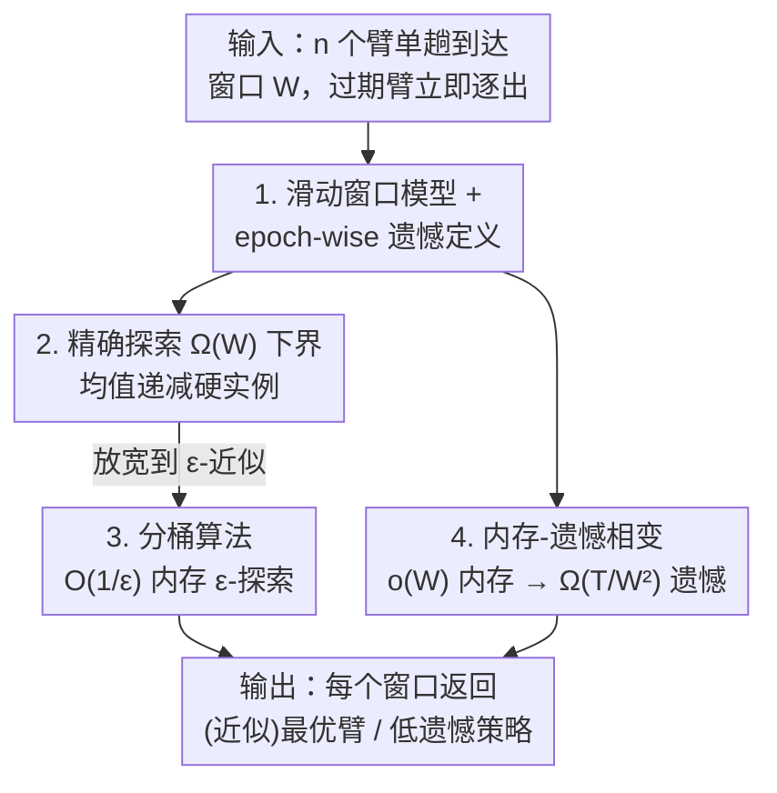

# Online Learning with Recency: Algorithms for Sliding-window Streaming Multi-armed Bandits

**会议**: ICML 2026  
**arXiv**: [2606.08977](https://arxiv.org/abs/2606.08977)  
**代码**: https://github.com/jhwjhw0123/sliding-window-streaming-MABs  
**领域**: 学习理论 / 在线学习 / 流式算法  
**关键词**: 多臂赌博机, 滑动窗口, 流式算法, 内存-遗憾权衡, 纯探索

## 一句话总结
本文把"近因效应"引入流式多臂赌博机，提出**滑动窗口流式 MAB** 模型——只有最近 $W$ 个臂有效——并系统刻画了纯探索与遗憾最小化在该模型下的内存复杂度边界：精确找最优臂需要 $\Omega(W)$ 内存（几乎得存下整个窗口），但找 $\varepsilon$-近似最优臂只需 $O(1/\varepsilon)$ 内存，且遗憾最小化在 $\Theta(W)$ 内存处出现尖锐相变。

## 研究背景与动机

**领域现状**：流式多臂赌博机（streaming MAB）是近年的热点——$n$ 个臂以单趟数据流的形式依次到达，算法的内存（能同时存住的臂数）远小于 $n$，要在此约束下做纯探索（找最优臂）或遗憾最小化。已有大量工作给出了内存-样本、内存-遗憾的近紧权衡。

**现有痛点**：现有流式 MAB 几乎都瞄准"全局目标"——在整条流里找全局最优臂。但很多真实场景有强烈的**近因效应**：最近到达的臂才重要。比如电影推荐要快速跟上潮流；又比如隐私合规（GDPR 要求数据只保留"必要时长"、Apple 留存用户数据 6 个月、Google 把匿名广告数据限制在 9 个月）逼着系统主动丢弃过期数据。在这些场景里，已有流式纯探索算法可能输出一个很早到达、早已"过气"的臂，遗憾最小化算法也可能锁定在已经滑出窗口的臂上。

**核心矛盾**：要刻画近因效应，最自然的模型是**滑动窗口流**——只有最近 $W$ 个数据项有效，过期项立即逐出内存。但已有流式 MAB 技术大多无法平移到滑动窗口：基于"摊销采样复杂度"的算法（如 AW20、JHT+21）只对全局最优臂给保证，一旦窗口移动导致最优臂改变，分析就崩了；消除式算法（elimination-based）在流式下根本没有高效版本。换句话说，滑动窗口与普通流式之间存在本质分离。

**本文目标**：为滑动窗口流式 MAB 建立完整理论：(1) 纯探索能不能在亚线性内存下做？(2) 遗憾在滑动窗口下该怎么定义、内存与遗憾如何权衡？

**切入角度**：作者观察到流式 MAB 算法分两派——"摊销采样"派和"按经验均值分桶"派。前者对窗口移动脆弱，后者天然兼容滑动窗口（过期臂直接丢、桶不变式仍维持 $\varepsilon$-最优）。于是分桶思想成为正面结果的支点，而"均值递减"的对抗构造成为下界的支点。

**核心 idea**：把滑动窗口流的"近因"约束注入 MAB，用**分桶 + 只留每桶最新臂**得到 $O(1/\varepsilon)$ 内存的近似纯探索算法；用**均值单调递减的硬实例**证明精确探索和低遗憾都逃不掉 $\Omega(W)$ 内存。

## 方法详解

### 整体框架

本文不是"一个算法"而是"一套理论刻画"，由四块组成：① 形式化滑动窗口流式 MAB 模型（含纯探索与新提出的 **epoch-wise 遗憾**定义）；② 精确纯探索的 $\Omega(W)$ 内存下界；③ $\varepsilon$-纯探索的高效算法（上界）与配套样本下界；④ 遗憾最小化的内存-遗憾相变。输入是 $n$ 个臂以单趟、对抗顺序到达的流加上窗口大小 $W$（$W,n$ 由实例给定、不可调），算法只能访问内存里的臂和当前到达臂，过期臂立即删除；输出是"在每个窗口位置返回（近似）最优臂"或"低遗憾的采样策略"。

整条逻辑链是这样转的：先证明精确探索几乎无望（必须存满窗口），由此**放宽**到 $\varepsilon$-近似，得到正面算法；再把视线转向遗憾，先解决"遗憾该怎么定义"这个棘手问题（epoch-wise 遗憾），再给出 $\Theta(W)$ 处的尖锐相变。

### 关键设计

**1. 数据到达与采样解耦：把"环境变化"从赌博机里剥离出来**

这是本模型相比已有"演化型"赌博机（非平稳赌博机 non-stationary bandits、致命赌博机 mortal bandits）最关键的概念区别。在那些模型里，环境只因"拉臂"这个动作而改变；而本文里，**环境变化由数据流控制、与拉臂无关**。形式上，第 $t$ 个臂到达时有效臂集合是 $\{\texttt{arm}_i\}_{i=t-W+1}^{t}$，窗口随到达推进，与算法拉了多少次臂毫无关系。这个解耦贴合现实——热门电影在屏幕上挂固定时长，不会因为你"采样"它而提前下线；同时它让"空间复杂度"成为一等公民，对隐私留存场景至关重要。正是这个解耦让滑动窗口与普通流式产生本质分离：普通流式纯探索可以单臂内存解决，滑动窗口却需要 $\Omega(W)$。

**2. 均值单调递减硬实例：逼算法存满整个窗口**

精确纯探索下界的核心是一个巧妙的对抗构造。取 $n=2W$，令臂的均值 $\mu_i = 1 - \frac{i}{3W}$ 单调递减。在均值递减的实例里，窗口内最优臂永远是**最老的未过期臂** $\texttt{arm}_{t-W+1}$。关键困境是：当窗口在位置 $t$ 时某个臂"没用"，窗口移到 $t+1$ 时它却变成了最优——于是为了在每个时刻都能返回正确答案，算法必须把窗口里几乎所有臂都留在内存。论文用 Yao 极小极大原理把它落地：要在流后半段 $\{W+1,\dots,2W\}$ 以 $99/100$ 概率答对，至少要正确识别 $\frac{49}{50}$ 比例的窗口最优臂，而这些最优臂在 $t=W+1$ 时就都已到达，必须被同时存住，于是 $|A|-1 = \frac{49}{50}W - 1$ 个臂得驻留内存，得到 $\Omega(W)$ 下界——即便允许无限次拉臂也无济于事。遗憾下界沿用同一思路，只是把分布加厚以防算法"撞大运"。

**3. 分桶 + 每桶留最新臂：用 $O(1/\varepsilon)$ 内存换 $\varepsilon$-近似（弱探索）**

既然精确探索无望，就放宽到 $(\varepsilon,\delta)$-PAC：只要返回均值 $\mu \geq \mu^\ast - \varepsilon$ 的臂即可。算法把 $[0,1]$ 划成 $N = 3/\varepsilon$ 个等长桶，每个到达臂拉 $s = \frac{9}{2\varepsilon^2}\ln\frac{6W}{\delta}$ 次估出经验均值 $\widehat{\mu}_i$，按 $(j-1)\frac{\varepsilon}{3} < \widehat{\mu}_i \leq j\frac{\varepsilon}{3}$ 落入第 $j$ 桶。**为省内存，每个桶只保留最新到达的那个臂**（顺带丢掉过期臂），返回时取非空最高桶里的臂。这一招恰好绕开"摊销采样"对窗口移动的脆弱性：分桶不变式与滑动窗口天然相容——过期臂一删，最高非空桶的臂仍是 $\varepsilon$-最优。最终弱 $\varepsilon$-探索用 $O(\frac{n}{\varepsilon^2}\log\frac{W}{\delta})$ 样本、$O(\frac{1}{\varepsilon})$ 内存达成；每个臂的采样数 $O(\frac{1}{\varepsilon^2}\log\frac{W}{\delta})$ 与 $n$ 无关，所以算法无需预先知道 $n$。

**4. Epoch-wise 遗憾 + $\Theta(W)$ 相变：让遗憾在滑动窗口下"可定义"且给出尖锐边界**

滑动窗口下定义遗憾有个致命陷阱：若按"窗口最优臂均值 $\mu^\ast(t,W)$ 与所拉臂均值之差"累加，由于**算法自己控制窗口移动前拉多少次臂**，遗憾就变成了算法的函数，根本无法良定义。作者的解法是把总拉臂数 $T$ 切成 $n-W+1$ 个 epoch，每个 epoch $j$ 对应一个窗口位置、预先固定（非自适应）分配 $T_j$ 次拉臂且 $\sum_j T_j = T$；第 $j$ 个 epoch 遗憾 $R^E(j) = \sum_{\tau=1}^{T_j}(\mu^\ast(W,j) - \mu_{i(\tau)})$，总遗憾是各 epoch 之和。这样最优奖励序列独立于算法的拉臂决策，遗憾才良定义，且贴合"每 1-2 个月推荐当期最热电影"这类场景。在此定义下，作者证明了尖锐的内存-遗憾相变：$o(W)$ 内存下任何算法遗憾至少 $\Omega(T/W^2)$；而 $O(W)$ 内存可达 $O(\sum_j \sqrt{W T_j})$ 遗憾。对特定拉臂预算这能到 $O(\sqrt{WT})$，**优于**集中式无限内存下的 $O(\sqrt{nT})$——因为只跟窗口内 $W$ 个臂比、而非全部 $n$ 个。

### 损失函数 / 训练策略
本文是纯理论工作，无训练。核心"算法"是 Algorithm 1（bucket 分桶探索），其样本预算在弱探索取 $s = \frac{9}{2\varepsilon^2}\ln\frac{6W}{\delta}$、强探索取 $s = \frac{9}{2\varepsilon^2}\ln\frac{6n}{\delta}$，区别只在置信项里 $W$ 换成 $n$，这也正是弱/强探索 $\log W$ vs $\log n$ 样本分离的来源。

## 实验关键数据

实验只为印证理论权衡（非追 SOTA），分纯探索与遗憾最小化两组。

### 主实验

| 任务 | 配置 | 关键现象 | 对应理论 |
|------|------|----------|----------|
| 纯探索 | $n\in\{1000,2000,5000\}$，$W\in\{10,20,50\}$ | 内存 $0.05W$ 时误差 $>0.6$；内存 $0.3W$ 时误差 $<0.3$ | $O(1/\varepsilon)$ 内存随内存增大平滑改善 |
| 遗憾最小化 | $n\in\{500,1000,2000\}$，$W\in\{10,20,50\}$，每 epoch $T_j=1000$ | 内存从 $0.05W$ 升到 $W$，多数配置总遗憾下降 $>50\%$ | $\Theta(W)$ 处尖锐相变 |

### 关键发现
- **纯探索内存-质量平滑权衡**：内存从 $0.05W$ 增到 $0.3W$，误差从 $>0.6$ 降到 $<0.3$，相当于用 $0.3W$ 内存把误差砍掉约 $50\%$；而已有（非滑动窗口）算法在此设置下可达 $0.6$ 误差（Appendix E），凸显近因感知的必要。
- **遗憾在 $W$ 处相变**：遗憾随内存的下降在内存 $\approx W$ 附近出现尖锐变化，正面印证 $\Omega(W)$ 是低遗憾的临界内存——少于它遗憾爆炸（$\Omega(T/W^2)$），到达它遗憾骤降。
- **精确 vs 近似的二分**：精确探索几乎只能存满窗口（$\Omega(W)$），而常数 $\varepsilon$ 下近似探索只需常数内存，这是全文最强的概念对比。

## 亮点与洞察
- **"数据到达 / 拉臂解耦"是真正的新意**：它把环境演化从赌博机动作里抽离，既贴合"内容挂固定时长"的现实，又制造了与普通流式的本质分离——这个建模视角可迁移到任何"环境自己变、与你的决策无关"的在线学习场景。
- **均值单调递减的硬实例极简却极强**：一句"窗口最优臂永远是最老未过期臂"就逼出存满窗口的必要性，是理解整篇下界的钥匙，也是教学上很好的反直觉例子。
- **分桶 + 每桶留最新臂**：一个小工程技巧（只留最新）让分桶法天然兼容滑动窗口，绕开摊销采样的脆弱性，是正面结果能成立的关键。
- **$O(\sqrt{WT}) < O(\sqrt{nT})$ 的反直觉**：受限于窗口反而能拿到比无限内存集中式更小的遗憾，因为竞争对手只是窗口内 $W$ 个臂——提醒我们"近因约束"既是限制也是红利。

## 局限与展望
- **对抗最坏顺序假设较强**：下界建立在对抗指定到达顺序上，随机/良性顺序下是否仍需 $\Omega(W)$ 未充分探讨，实践中顺序常没这么坏。
- **epoch 拉臂预算 $\{T_j\}$ 须预先固定且非自适应**：这是让遗憾可定义的代价，但现实中预算往往想随观测自适应调整，自适应版本仍是开放问题。
- **奖励须 sub-Gaussian / $[0,1]$ 支撑**：重尾奖励、非平稳窗口内分布漂移等更复杂情形未覆盖。
- **强 $\varepsilon$-探索仅近紧**：弱/强探索之间 $\log W$ vs $\log n$ 的样本分离给出了，但强探索上界（$O(\frac{n}{\varepsilon^2}\log\frac{n}{\delta})$）与下界之间是否完全闭合仍可推进。

## 相关工作与启发
- **vs 普通流式 MAB（AW20 / JHT+21 / MPK21）**: 他们做全局最优臂、可单臂内存精确探索；本文加上滑动窗口的近因约束后，精确探索骤升到 $\Omega(W)$ 内存，证明滑动窗口是本质更难的设置，二者不可互相平移。
- **vs 非平稳赌博机 / 致命赌博机（WHI88 / CKR+08）**: 它们的环境变化由拉臂触发、且不考虑内存约束；本文的环境变化由数据流独立驱动（解耦），并把空间复杂度作为核心目标，二者不可直接比较。
- **vs 滑动窗口流式算法（频率估计 / 聚类等）**: 本文把成熟的滑动窗口流范式首次系统引入 MAB，借用其"过期即删"的内存模型，并贡献了 MAB 特有的 epoch-wise 遗憾定义。

## 评分
- 新颖性: ⭐⭐⭐⭐⭐ 首次把滑动窗口近因效应系统引入流式 MAB，数据到达/拉臂解耦与 epoch-wise 遗憾都是原创概念。
- 实验充分度: ⭐⭐⭐ 理论工作，实验仅印证内存-遗憾权衡与相变，规模有限但目的明确。
- 写作质量: ⭐⭐⭐⭐ 上下界配对清晰、硬实例直觉讲得透，Table 1 一图总览全部结果。
- 价值: ⭐⭐⭐⭐ 为隐私留存、潮流推荐等近因敏感的在线学习场景奠定理论基线与算法指南。

<!-- RELATED:START -->

## 相关论文

- [\[NeurIPS 2025\] Learning-Augmented Streaming Algorithms for Correlation Clustering](../../NeurIPS2025/learning_theory/learning-augmented_streaming_algorithms_for_correlation_clustering.md)
- [\[AAAI 2026\] Streaming Generated Gaussian Process Experts for Online Learning and Control: Extended Version](../../AAAI2026/learning_theory/streaming_generated_gaussian_process_experts_for_online_learning_and_control_ext.md)
- [\[ICML 2026\] Parsimonious Learning-Augmented Online Metric Matching](parsimonious_learning-augmented_online_metric_matching.md)
- [\[ICML 2026\] A Perturbation Approach to Unconstrained Linear Bandits](a_perturbation_approach_to_unconstrained_linear_bandits.md)
- [\[ICML 2026\] Quantum Algorithms for Triangle Cut Sparsification](quantum_algorithms_for_triangle_cut_sparsification.md)

<!-- RELATED:END -->
