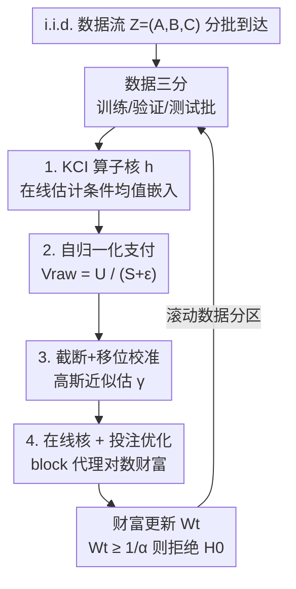

# Sequential Kernel-based Conditional Independence Testing via Adaptive Betting

**会议**: ICML 2026  
**arXiv**: [2606.18993](https://arxiv.org/abs/2606.18993)  
**代码**: [github.com/he-zh/SKCI](https://github.com/he-zh/SKCI)  
**领域**: 学习理论 / 序贯假设检验  
**关键词**: 条件独立性检验, testing-by-betting, anytime-valid, 核方法, Model-X

## 一句话总结
SKCI 提出一个序贯（可随时停止）的条件独立性检验：它把"投注式检验（testing-by-betting）"用在一个**自归一化的核条件独立统计量**上，再配一套"截断 + 移位"的高斯近似校准，使得即便 Model-X 假设里的条件分布 $P_{A\mid C}$ 必须在线估计（而非精确已知）、估计有误差时，Type I error 也只轻微膨胀、同时保持高检验功效——在高维合成基准和真实公平性审计任务上都优于现有序贯 Model-X 方法。

## 研究背景与动机

**领域现状**：条件独立性检验（CI testing，问 $A\perp\!\!\!\perp B\mid C$）是因果发现、公平性审计、稳健性诊断的基础工具。经典 p 值检验在"可选停止、多重检验、数据边到边分析"下很脆弱（复现性危机）。anytime-valid 检验（基于 e-value 和 testing-by-betting）提供了一个原则性的替代：把检验重构成一场"对赌"，玩家从初始财富 $W_0=1$ 开始，每轮挑一个支付函数 $f_t$ 下注，财富 $W_t=W_{t-1}(1+\lambda_t f_t(Z_t))$，只要 $f_t$ 在零假设下条件期望 $\le 0$，财富过程就是 $H_0$ 下的非负上鞅，由 Ville 不等式 $\Pr_{H_0}(\exists t: W_t\ge 1/\alpha)\le\alpha$ 即得一个水平 $\alpha$ 的随时有效检验，在 $\tau=\inf\{t:W_t\ge 1/\alpha\}$ 处拒绝。

**现有痛点**：CI 检验天生困难——Shah & Peters (2020) 证明，**不加额外假设，没有任何检验能在控制 Type I error 的同时有非平凡功效**；Waudby-Smith & Ramdas (2023) 把这个不可能性推广到序贯设定。为绕开它，主流靠 **Model-X 假设**：假设条件律 $P_{A\mid C}$ 精确已知，于是可以采 $\tilde A\sim P_{A\mid C}$ 造出零假设校准样本 $\tilde Z=(\tilde A,B,C)$。但现有序贯 CI 检验（e-CRT、DAVT 等）几乎都**要求 $P_{A\mid C}$ 精确已知**。

**核心矛盾**：现实中我们几乎拿不到精确的 $P_{A\mid C}$，只能从辅助数据在线估计。而一旦 $\tilde Z$ 只是近似服从零假设，一个足够强的检验（样本多、或统计量 $g$ 太利）就会**侦测到 $Z$ 与错误生成的 $\tilde Z$ 之间的失配**，从而在真实满足 $A\perp\!\!\!\perp B\mid C$ 时也错误拒绝。序贯设定更苛刻：有效性必须在无界多个停止时机上同时成立，近似误差不能随观测增多而被放大成可侦测的信号。

**本文目标**：造一个序贯 CI 检验，在 $P_{A\mid C}$ 已知时工作良好，更重要的是在它必须**在线估计**时仍能保住合理的 Type I 控制与功效。

**切入角度**：作者干脆**不显式构造零校准样本 $\tilde Z$**，而是用形如 $f_t(Z_t)=g_t(Z_t;\gamma_t)$ 的支付函数——其中 $\gamma_t$ 是一个数据相关的"移位量"，被选来让财富过程在零假设下近似为上鞅。再配一个原则：选能在弱信号下快速累积证据的统计量。

**核心 idea**：把"投注式检验"作用在一个**自归一化的核条件独立（KCI）统计量**上，用"截断 + 移位"的高斯近似校准吸收条件分布估计误差，从而在估计条件分布的体制下大幅压低 Type I error 膨胀、同时不牺牲功效。

## 方法详解

### 整体框架

SKCI 处理一条 i.i.d. 数据流 $Z_t=(A_t,B_t,C_t)$，分批（batch 大小 $b$）到达，检验可在任意数据相关时刻停止。为保证支付函数和投注比例对历史可测（$\mathcal{F}_{t-1}$-measurable），每轮把已观测数据切成三块互不相交的子集：**训练集** $\mathcal{X}^{tr}_{t-1}$（估计统计量里的数据相关量，随时间单调增长）、**验证集** $\mathcal{X}^{val}_{t-1}$（估计校准量）、**测试批** $\mathcal{Y}_t$（更新财富 $W_t$）。三者按"测试批 → 下一轮验证集 → 之后并入训练集"的方式滚动。

整套统计量由几个零件叠成：先用 KCI 算子核 $h$ 度量"扣除 $C$ 后 $A$ 与 $B$ 的残差关联"，其中条件均值嵌入在线估计；再把新批与历史的核交互做**自归一化**得到原始支付 $V^{raw}_t$，解决弱信号下财富增长慢的问题；接着用"截断 + 移位" $V_t=\max\{V^{raw}_t-\gamma_t,-1\}$ 保证支付 $\ge -1$ 且零假设下条件均值 $\le 0$，移位量 $\gamma_t$ 用高斯近似估出；最后用一个 block 代理的对数财富目标在线优化条件核 $k_C$ 与投注比例 $\lambda_t$。每轮更新财富，$W_t\ge 1/\alpha$ 即拒绝 $H_0$。

### 关键设计

**1. KCI 算子核：把"扣除 C 后的残差关联"写成可投注的核**

CI 检验难在 $C$ 连续时，给定一个 $C$ 值往往只观测到一对 $(A,B)$，无法像无条件检验那样靠置换造零样本。SKCI 不造样本，而是借 Zhang et al. (2011) 的核条件独立框架直接构造一个度量条件依赖的对称核 $h$。把 $A,B,C$ 映进各自的 RKHS（特征映射 $\phi_A,\phi_B,\phi_C$），条件均值嵌入 $\mu_{A\mid C}(c)=\mathbb{E}[\phi_A(A)\mid C=c]$、$\mu_{B\mid C}(c)$ 表示"$A、B$ 中能被 $C$ 解释的部分"。KCI 算子取**残差的张量积**：

$$\psi(z)=\bigl(\phi_A(a)-\mu_{A\mid C}(c)\bigr)\otimes\bigl(\phi_B(b)-\mu_{B\mid C}(c)\bigr)\otimes\phi_C(c)$$

它编码"扣掉 $C$ 的影响后 $A$ 与 $B$ 残差之间的依赖"。零假设下残差条件不相关，故 $\mathbb{E}_{H_0}[\psi(Z)]=0$；在核满足泛性条件时，任何条件独立性的违背都会让 $\mathbb{E}[\psi(Z)]\neq0$。于是定义核 $h(Z,Z')=\langle\psi(Z),\psi(Z')\rangle$，它满足 $\mathbb{E}_{H_0}[h(Z,Z')\mid Z]=\langle\psi(Z),\mathbb{E}_{H_0}[\psi(Z')]\rangle=0$，正好是投注支付要的"零假设下条件均值为零"。关键的现实考量是：$\mu_{A\mid C}、\mu_{B\mid C}$ 在 Model-X 之外**未知**，必须从历史训练数据 $\mathcal{X}^{tr}_{t-1}$ 用核岭回归在线估计，因此每轮的核 $h^{(t)}$ 依赖全部过去信息、但仍保持 $\mathcal{F}_{t-1}$-可测。

**2. 自归一化支付：让弱信号也能稳定累积财富**

当 $H_0$ 与 $H_1$ 的差异很弱（或核 $h$ 选得不好）时，核交互的幅度很小，财富增长极慢；而且不能靠任意放大函数类来救——Ville 不等式要求支付 $\ge -1$。作者的解法是用一个**自归一化**的横向 U 统计量。给训练历史 $\mathcal{X}^{tr}_{t-1}=\{x_i\}_{i=1}^n$ 和新批 $\mathcal{Y}_t=\{y_j\}_{j=1}^b$，定义横向 U 统计量 $U_{n,b}=\frac{1}{nb}\sum_i\sum_j h(x_i,y_j)$（这个"横向"结构便于取条件期望：历史点固定、新批独立于 $\mathcal{F}_{t-1}$），以及完全由历史算出的 V 统计量 $S_n=\frac{1}{n^2}\sum_i\sum_j h(x_i,x_j)$。原始支付定义为二者之比：

$$V^{raw}_t\coloneq\frac{U_{n,b}(\mathcal{X}^{tr}_{t-1},\mathcal{Y}_t)}{S_n(\mathcal{X}^{tr}_{t-1})+\varepsilon},\quad\varepsilon>0$$

巧在哪里：当 $n,b$ 大时 $U_{n,b}$ 和 $S_n$ 都收敛到 $\mathbb{E}h(X,Y)$，于是在备择分布下 $V^{raw}_t\approx 1$，**与核 $h$ 的尺度无关**——不管信号强弱，财富增量都被拉到一个可用的量级。同时，分母 $S_n$ 是 $\mathcal{F}_{t-1}$-可测的，零假设下分子条件均值为零，归一化后 $V^{raw}_t$ 仍条件均值为零，财富过程在零假设下保持鞅。正则项 $\varepsilon$ 防分母趋零时数值不稳，但要远小于 $\mathbb{E}_{H_1}h(X,Y)$ 以免损功效。

**3. 截断 + 移位校准：用高斯近似吸收估计误差、压低 Type I 膨胀**

要用 Ville 不等式，支付必须 $V_t\ge -1$ 且 $\mathbb{E}_{H_0}[V_t\mid\mathcal{F}_{t-1}]\le 0$。但归一化项的波动会让 $V^{raw}_t$ 跌破 $-1$。作者先做**单边截断**再配一个**可预测移位** $\gamma_t$：$V_t\coloneq\max\{V^{raw}_t-\gamma_t,-1\}$。截断保证非负财富，但截断会抬高支付的条件均值；为补回来，取满足零假设期望 $\le 0$ 的**最小非负移位** $\gamma_t\coloneq\min_{\gamma\ge0}\{\gamma:\mathbb{E}_{H_0}[\max\{V^{raw}_t-\gamma,-1\}\mid\mathcal{F}_{t-1}]\le 0\}$。

理想 $\gamma_t$ 依赖 $V^{raw}_t$ 的条件零分布，一般拿不到，于是**用高斯近似**：由于 $V^{raw}_t=\frac1b\sum_j g^{(t)}(y_j)$ 是独立测试样本贡献的归一化平均，$b$ 大时由 CLT 有 $\mathrm{Law}(V^{raw}_t\mid\mathcal{F}_{t-1})\approx\mathcal{N}(\mu_t,\sigma_t^2)$。在高斯下零假设期望有闭式 $f(\gamma;\mu,\sigma)=\sigma[\phi(\xi)-\xi\Phi(-\xi)]-1$（$\xi=\frac{\gamma-\mu-1}{\sigma}$）。实践中取 $\hat\mu_t=0$（估计的条件均值嵌入使居中只是近似，真实零均值难估），并用**验证集**估方差 $\hat\sigma_t^2=\frac{1}{b^2}\sum_j(g^{(t)}(v_j))^2$——把"优化统计量"和"估其零尺度"放在不同样本上，减小同源偏差。最终移位 $\hat\gamma_t\coloneq\min\{\gamma\ge0:f(\gamma;0,\hat\sigma_t)\le0\}$ 因 $f$ 关于 $\gamma$ 单调，可二分高效求解。这套校准正是把"条件分布估计误差"转化为可控的 Type I 漂移、而非直接错误拒绝的关键。

**4. 在线核 + 投注优化：让检验自适应到难以察觉的相关子空间**

KCI 的核选择有两重角色：回归核管条件均值嵌入估得好不好，条件变量 $C$ 上的核 $k_C$ 则决定统计量对条件依赖的敏感度（难题里信号常被不当的 $k_C$ 淹没）。回归核按 Pogodin et al. (2024) 用留一预测误差选；$k_C$ 和投注比例 $\lambda_t$ 则联合优化，目标是期望对数财富增量 $\arg\max_{\lambda,k_C}\mathbb{E}_{H_1}[\log(1+\lambda V_t)]$（最大化渐近财富增长的标准准则）。备择分布未知，故用历史数据的**经验代理**：把 $n$ 个历史训练样本切成大小 $b$ 的块，对每块用"留块外"构造代理支付 $\tilde V_i^{(t)}$（避免自交互项），再最大化经验对数财富 $\sum_i\log(1+\sigma(\eta_t)\max\{\tilde V_i^{(t)}-\gamma^{(t)},-1\})$，其中 $\lambda_t=\sigma(\eta_t)$ 用 sigmoid 参数化以落在 $(0,1)$。这一步让 SKCI 能**在线把核调到相关信号所在的子空间**，正是它在最难的"3D 分离坐标"设定下仍有功效的原因。

### 损失函数 / 训练策略
整体流程见 Algorithm 1，每轮三阶段：Phase 1 在 $\mathcal{X}^{tr}_{t-1}$ 上核岭回归拟合 $\mu_{A\mid C}^{(t)}、\mu_{B\mid C}^{(t)}$；Phase 2 用 $S$ 步梯度更新 $\eta_t$ 与 $k_C$、并二分选移位 $\hat\gamma_t$；Phase 3 收到测试批后算 $V^{raw}_t$、截断移位得 $V_t$、更新 $W_t=W_{t-1}(1+\sigma(\eta_t)V_t)$，$W_t\ge1/\alpha$ 则拒绝并终止。理论上（Thm 4.2）一步漂移上界 $\delta_t\le U_t=\frac{C_1\rho}{b\varepsilon}+\frac{\sqrt\kappa}{\varepsilon}\|\delta_{A\mid C}^{(t)}\|\|\delta_{B\mid C}^{(t)}\|+\frac{2C_2\kappa^2}{b\varepsilon^2}$，三项分别来自高斯近似间隙、条件均值嵌入估计误差、方差失配；再由 Prop 4.3 把一步漂移转成有限样本 Type I 上界 $\Pr_{H_0}(\exists t\le T:W_t\ge\frac1\alpha)\le\alpha\exp(\sum_t\lambda_t U_t)$。

## 实验关键数据

### 主实验
在合成与真实基准上评估 anytime Type I 控制与功效，统一 batch 大小 $b=20$、100 次独立重复。对比 e-CRT、DAVT、EC2ST 三个序贯 Model-X 方法，并分三种体制：**Oracle**（$P_{A\mid C}$ 精确已知，仅合成可行）、**Pretrained**（用 3000 样本离线估）、**Online**（无先验侧数据，条件均值嵌入随数据序贯更新）。下表定性汇总各基准下 SKCI 的表现：

| 基准 | 任务难点 | SKCI 表现 | baseline 失效情况 |
|------|---------|-----------|------------------|
| 线性依赖高斯（19 维 $C$） | $C$ 上强非线性、$A$ 上线性信号 | 三体制下 Type I 稳、功效快速攀高 | 部分 baseline 在 Pretrained/Online 下 Type I 恶化 |
| CI 难例 1D / 3D 共享坐标 | $C$ 变化的依赖、难察觉 | 功效持平或超越、Type I 紧 | 多数方法在 Pretrained/Online 下 Type I 或功效崩 |
| CI 难例 3D 分离坐标 | 依赖信号与边缘结构解耦 | 在线核优化适配子空间，功效与控制兼得 | 其它方法普遍检不出或 Type I 严重膨胀 |
| RatInABox 神经数据（100 维 $A,B$） | 高维生物信号 | 强功效 + 紧 Type I | EC2ST Type I 极高；DAVT online 失控、pretrained 几无功效；e-CRT 慢 |
| dSprites 图像 | 裁剪视图下的形状依赖 | Type I 显著优于 baseline | baseline 即便裁剪含全物体仍快速拒绝（≈1） |
| 车险歧视审计（真实） | 仅 Online、样本不足以分裂 | 四个州 Type I 保守、功效有竞争力/更优 | DAVT、EC2ST Type I 近 1；e-CRT 受控但欠功效 |

### 方法/基线对照

| 方法 | 统计量 / 函数类 | 主要软肋 |
|------|----------------|----------|
| e-CRT (Shaer 2023) | 过去数据训练模型的预测误差 | Type I 控制好但检测慢、欠功效 |
| DAVT (Pandeva 2024b) | 神经网络函数类 | Online 下 Type I 失控、Pretrained 几无功效 |
| EC2ST (Pandeva 2024a) | 区分真三元组与 knockoff | Type I 严重膨胀（多基准近 1） |
| **SKCI（本文）** | 自归一化 KCI 算子核 + 截断移位 | 估计条件分布下 Type I 仅轻微膨胀、功效高 |

### 关键发现
- **主战场是"零校准"而非"对备择的敏感度"**：在 dSprites 上，备择设定里所有方法都能高功效拒绝，差距全在零假设下要不要错误拒绝——SKCI 的截断移位校准正是赢在这里。
- **在线核优化决定最难设定的成败**：3D 分离坐标里，依赖信号和边缘结构解耦，只有 SKCI 靠在线调 $k_C$ 找到相关子空间，其它方法要么检不出、要么 Type I 爆。
- **理论与消融一致**：Figure 12 的消融显示，增大 batch $b$ 与正则 $\varepsilon$ 会降低零假设错误拒绝率，正对应漂移上界 $U_t$ 里 $\frac{1}{b\varepsilon}$、$\frac{1}{b\varepsilon^2}$ 两项。

## 亮点与洞察
- **"不造零样本、只算移位"是关键转向**：现有序贯 CI 检验都要显式造零校准样本 $\tilde Z$，一旦 $P_{A\mid C}$ 估不准就会被强检验侦测出失配而误拒；SKCI 改用数据相关移位 $\gamma_t$ 把支付校准成近似上鞅，从根上回避了"造错样本"的脆弱性。
- **自归一化让支付"尺度无关"**：$V^{raw}\approx1$ 在备择下与核尺度无关，既解决弱信号财富慢增、又不破坏零假设鞅性——这个"用历史 V 统计量做分母"的技巧可迁移到其它 testing-by-betting 统计量设计。
- **把估计误差量化进 Type I 上界**：Thm 4.2 把条件均值嵌入回归误差 $\|\delta_{A\mid C}\|\|\delta_{B\mid C}\|$ 显式写进漂移上界，给"估计越准、膨胀越小"提供了可证保证，而非只靠经验。
- **理论指导调参**：漂移上界直接告诉你"调大 $b$、$\varepsilon$ 更保守"，把超参选择从玄学变成有依据的取舍。

## 局限与展望
- **没有无假设的精确控制**：作者明说在不加假设下精确均匀 Type I 控制不可能，SKCI 给的是"估计体制下轻微膨胀 + 有限样本上界"，并非精确水平 $\alpha$。
- **高斯近似依赖 batch 够大**：移位估计建立在 CLT 上，小 $b$ 时高斯近似间隙（$U_t$ 第一项）变大，校准可能不准。
- **$\hat\mu_t=0$ 是近似**：估计的条件均值嵌入下真实零均值非零却被设为 0，残留偏差靠移位吸收，极端估计误差下仍可能膨胀。
- **计算开销**：每轮要核岭回归拟合 CME、$S$ 步在线优化核与投注、block 代理求对数财富，序贯长跑下成本不低；高维核方法的可扩展性是潜在瓶颈。

## 相关工作与启发
- **vs e-CRT (Shaer 2023)**：e-CRT 用过去数据训练模型的预测误差当统计量、且依赖 Model-X 精确条件分布；SKCI 用自归一化 KCI 核并显式处理估计误差，实验中功效远快于 e-CRT（后者 Type I 受控但检测慢）。
- **vs DAVT (Pandeva 2024b)**：DAVT 用神经网络函数类，灵活但在 Online 估计条件分布下 Type I 失控；SKCI 的截断移位校准让它在同样 Online 体制下保持稳健。
- **vs EC2ST (Pandeva 2024a)**：EC2ST 假设 $P_{A,C}$ 在零/备择间不变、区分真三元组与 knockoff；该假设受冲击时 Type I 严重膨胀（多基准近 1），凸显 SKCI"对估计误差鲁棒"的核心卖点。
- **vs 批处理 KCI 校准失败研究（Pogodin 2024 / He 2025）**：它们在批设定下研究条件检验的校准失败；SKCI 把问题搬到更苛刻的在线设定（有效性须在无界停止时机上成立），并复用 He et al. (2025) 的 KCI 算子构造。

## 评分
- 新颖性: ⭐⭐⭐⭐⭐ "不造零样本、用自归一化核 + 截断移位校准"把序贯 CI 检验从"要求精确 Model-X"解放到"容忍在线估计误差"
- 实验充分度: ⭐⭐⭐⭐⭐ 合成（含高维/难例）+ 神经数据 + 图像 + 真实公平性审计，三体制系统对比三个强 baseline
- 写作质量: ⭐⭐⭐⭐ 理论与方法严谨，公式密集、对新读者门槛偏高
- 价值: ⭐⭐⭐⭐⭐ 给在线、估计条件分布下的 anytime-valid CI 检验提供了既鲁棒又有理论保证的方案

<!-- RELATED:START -->

## 相关论文

- [\[ICML 2026\] Conditional KRR: Injecting Unpenalized Features into Kernel Methods with Applications to Kernel Thresholding](conditional_krr_injecting_unpenalized_features_into_kernel_methods_with_applicat.md)
- [\[NeurIPS 2025\] Kernel Conditional Tests from Learning-Theoretic Bounds](../../NeurIPS2025/learning_theory/kernel_conditional_tests_from_learning-theoretic_bounds.md)
- [\[ICML 2026\] Matroid Algorithms Under Size-Sensitive Independence Oracles](matroid_algorithms_under_size-sensitive_independence_oracles.md)
- [\[NeurIPS 2025\] Adaptive Data Analysis for Growing Data](../../NeurIPS2025/learning_theory/adaptive_data_analysis_for_growing_data.md)
- [\[ICLR 2026\] Scalable Random Wavelet Features: Efficient Non-Stationary Kernel Approximation with Convergence Guarantees](../../ICLR2026/learning_theory/scalable_random_wavelet_features_efficient_non-stationary_kernel_approximation_w.md)

<!-- RELATED:END -->
