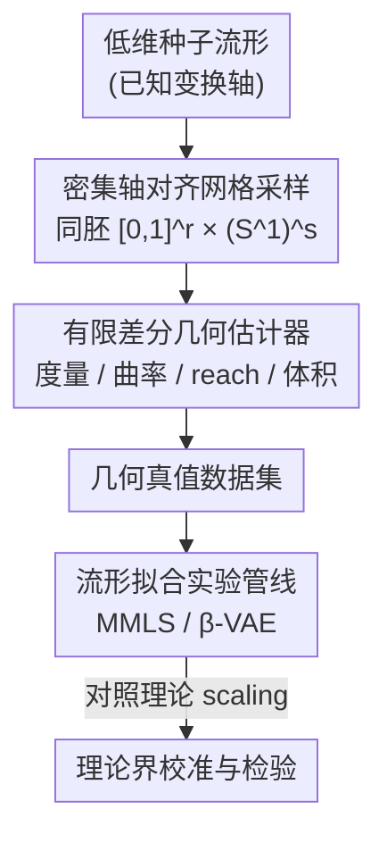

# The Data Manifold under the Microscope

**会议**: ICML 2026  
**arXiv**: [2606.15760](https://arxiv.org/abs/2606.15760)  
**代码**: https://github.com/koulakis/manifold-microscope (有)  
**领域**: 学习理论 / 流形几何 / 表示分析  
**关键词**: 流形假设, 内蕴维度, 曲率, reach, 有限差分估计

## 一句话总结
针对"流形拟合理论给的泛化/逼近界几乎无法在真实数据上验证"这个理论与实践的鸿沟，本文造了一个**可控的几何基准框架**：把 dSprites、COIL-20 这类数据集重做成沿变换轴**密集规则网格采样**的低维流形，再配上**有限差分几何估计器**，能在低内蕴维度下以接近真值的精度算出曲率、reach、体积，从而把 Genovese、Fefferman 等人的流形拟合界拿到"已知真值"的沙盒里做实测校准。

## 研究背景与动机

**领域现状**：深度学习尤其是生成模型（VAE、扩散、MAE）的成功常被用**流形假设**解释——高维数据集中在低维流形附近，学习就是给这些流形找好的参数化。围绕这个假设，理论界给出了一批流形拟合的极小极大率（Genovese et al. 2012）、依赖光滑度的非渐近率（Aamari & Levrard 2019）、基于 reach 的结构化复杂度（Fefferman et al. 2018）等结果，里面的关键量是**曲率、reach、采样密度、内蕴维度**。

**现有痛点**：这些理论界在真实数据上几乎"用不起来"。真实数据的生成过程未知，内蕴维度只能粗估，采样还不规则，于是界里那些常数（如随 $\tau^{-2}$ 放大的项）根本无法直接测量或核对——理论给的保证悬在空中，没人知道它在具体数据上到底紧不紧、informative 不 informative。

**核心矛盾**：现有的几何基准是**两极分化**的。一极是解析流形（球面、环面），几何已知但太简单、不像真实数据；另一极是真实数据集，够现实但几何只能被粗略估计、没有真值。缺一个**既有几何真值、又有一定现实感**的中间地带，理论和经验就接不上。

**本文目标**：造一个可控测试平台，让人能（1）校准/单元测试各种几何估计器，（2）把现有理论界放进"几何真值已知"的环境里观察它们的 scaling 行为是否吻合实测误差。

**切入角度**：作者发现，只要把数据限制在**低内蕴维度（$d=1\text{–}4$）、且变换因子显式已知**的设定，就能用**密集规则网格采样 + 有限差分**把几何量算到接近真值——而通用估计器在这个 regime 反而不可靠或难部署。

**核心 idea**：用"沿已知变换轴密集网格采样的低维流形 + 有限差分几何估计器"造一个几何真值已知的沙盒，把流形拟合理论从纸上搬到可实测的显微镜下。

## 方法详解

### 整体框架
框架做的事是：从一个低维"种子"流形出发，沿已知的变换轴（旋转、平移、缩放等）做**密集、轴对齐**的规则网格采样，得到离散数据集；在这个网格上用**中心有限差分**逐点估计诱导度量、体积元、曲率张量和 reach；再把这些几何真值喂给一条**流形拟合实验管线**，去检验理论界与实测误差是否对得上。整条链路是"数据集构造 → 几何测量 → 理论检验"三段。

每个数据集被建模成嵌入在 $\mathbb{R}^D$ 中的若干光滑 $d$ 维流形之并，且限制为简单拓扑——每个流形同胚于 $[0,1]^r\times(S^1)^s$（$r+s=d$），即一部分坐标在区间上变化、一部分绕圆周缠绕。dSprites 一个类就同胚于 $[0,1]^3\times S^1$ 并嵌入 $\mathbb{R}^{4096}$。网格定义为

$$G=\left\{\left(\tfrac{j_1}{n_1-1},\dots,\tfrac{j_r}{n_r-1},\,2\pi\tfrac{j_{r+1}}{n_{r+1}},\dots,2\pi\tfrac{j_d}{n_d}\right)\right\}$$

前 $r$ 维等距采 $[0,1]$、后 $s$ 维等距采 $S^1$；每个类用映射 $u_i:G\to M_i$ 把网格点映成数据元素，离散数据集即 $X_G=\bigcup_{i\le k}u_i[G]$。

### 关键设计

**1. 密集轴对齐网格采样：把"几何真值未知"变成"已知"**

理论界要验证，前提是手上得有几何真值，可真实数据没有。作者的做法是把数据限制在低内蕴维度、变换因子显式可控的设定，然后沿每根变换轴**等距密集采样所有组合**。对解析流形直接用已知参数化生成规则网格；对图像数据集（dSprites、COIL-20）则系统地施加平移/旋转/缩放并采样全部组合，并在非循环维度做**边缘过采样**，给后面有限差分留出边界余量。由于网格足够密，偏导数可以稳定地用差分逼近——这正是通用估计器在低维 regime 反而做不好的地方（它们要从无结构点云里用复杂插值反推导数）。为了得到内蕴几何上更均匀的子集，框架还提供**最远点迭代采样**和**按体积形式重加权采样**两种手段。

**2. 有限差分几何估计器：用网格结构换近最优精度**

有了密集网格，框架用**二阶中心差分**估各阶偏导：$f'(x)=\frac{f(x+h)-f(x-h)}{2h}+O(h^2)$，逐坐标推广后得到度量 $g_{ij}=\langle u_{,i},u_{,j}\rangle+O(h^2)$，进而算出体积元、Christoffel 符号、Riemann/Ricci 张量、标量曲率，以及 reach。精度上，体积与曲率满足 $|\hat v-v|=O(h^2)$、$|\hat R-R|=O(h^2)$；在拟均匀 $d$ 维网格上每轴间距 $h\asymp n^{-1/d}$，于是标量曲率误差 $O(h^2)=O((1/n)^{2/d})$。reach 用 Aamari et al. (2019) 的插件估计器，但因为它是逐点对取最小、不只由局部导数精度决定，作者区分**全局瓶颈 regime**（$O(n^{-1/d})$）与较慢的**局部曲率 regime**（逆 reach 上界 $O(n^{-2/(3d-1)})$）。关键是：这里假设 $C^3$（reach/体积）、$C^5$（标量曲率）光滑度，配合网格结构，几何量能算到**接近最优精度**，从而当"单元测试"用。

**3. 把理论界放进沙盒做 scaling 检验**

有了几何真值，框架就能把两类经典界拿来实测对照。Genovese et al. (2012) 的极小极大率 $C_1(1/n)^{2/(2+d)}\le R_n(Q)\le C_2(\log n/n)^{2/(2+d)}$ 说明样本复杂度**只随内蕴维度 $d$ 指数增长、与环境维度 $D$ 无关**；Fefferman et al. (2018) 在低噪声下给 Hausdorff 误差 $H(M_o,M)<C_1(\log n/n)^{1/d}$；Aamari & Levrard (2019) 进一步把指数和**局部拟合阶数**挂钩（线性/PCA 拟合对应 $1/d$，二次局部拟合对应 $2/d$）。作者用框架里几何已知的数据集，对 MMLS（几何法）和 β-VAE（深度法）做流形拟合，画出 Hausdorff 距离随样本量的曲线，去看实测误差的 scaling 是否与这些界吻合——这把"界紧不紧、何时 informative"从纸面推断变成可观测的实验。

### 损失函数 / 训练策略
本文不是训练新模型而是分析框架，没有自定义损失。拟合侧用两种现成方法：几何法 **Manifold Moving Least Squares (MMLS)** 与深度法 **β-VAE 自编码器**。评估用固定的均匀测试子集近似 Hausdorff/平均距离，几何测量在全数据集上算。

## 实验关键数据

### 主实验：估计器精度 vs 理论 scaling

| 任务 | 估计量 | 本文有限差分 | 对照 | 结论 |
|------|--------|--------------|------|------|
| 标量曲率（$S^2,S^3,S^4,H^2_2,T^2$） | RMSE vs 真值 | $O(h^2)=O((1/n)^{2/d})$ | Sritharan et al. 2021（含逐点 oracle 半径） | 有限差分**显著更准**，即便对手用了最优半径 |
| 标量曲率理论率 | sample complexity | $O((1/n)^{2/d})$ | Aamari & Levrard $O((\log n/n)^{3/d})$ | 理论略紧，差距源于本文内蕴算 Riemann 张量需三阶导 |
| 流形拟合 | Hausdorff vs 样本量 | MMLS / β-VAE 实测曲线 | Genovese / Fefferman scaling | 在已知几何上实测 scaling 行为 |

### 数据集与几何参数

| 数据集 | $d$ | $D$ | 变换因子 | 连通分量 |
|--------|-----|-----|----------|----------|
| $S^1$ / Two moons | 1 | 2 | $\phi_1$ | 1 / 2 |
| $S^2$ / $T^2$ | 2 | 3 | $\phi_1,\phi_2$ | 1 |
| dSprites | 4 | 4096 | scale, orientation, pos.x, pos.y | 3 |
| COIL-20 | 3 | 4096 | 水平朝向, 缩放, 图像朝向 | 20 |

### 关键发现
- **网格结构是精度来源**：有限差分估计器"知道网格"，在低维 regime 比通用点云估计器准得多，即使后者用了逐点 oracle 半径——说明在这个受控设定里几何量可被算到接近真值。
- **指数随内蕴维度爆炸、与环境维度无关**：Genovese 的率显示样本复杂度只看 $d$ 不看 $D$，dSprites（$d=4,D=4096$）正是检验这一点的高维嵌入低维流形例子。
- **理论与实践仍有可测的差距**：本文 $O((1/n)^{2/d})$ 与 Aamari & Levrard 的 $O((\log n/n)^{3/d})$ 之间的 gap，被归因于内蕴 vs 外蕴（第二基本形式）算曲率的光滑度需求不同——这种"差在哪"的诊断正是沙盒的价值。
- **β-VAE 逐层重塑几何**：作为案例研究，框架还能逐层追踪 β-VAE 怎么改变流形曲率等几何量，展示它不止能验界、也能当表示分析工具。

## 亮点与洞察
- **把"无法验证的理论"变成"可单元测试的对象"**：最巧的地方是意识到——与其在真实数据上估几何（必然不准），不如反过来构造几何已知的数据，让几何估计器和理论界都能被"对答案"。这是把问题倒过来想。
- **低维 + 网格结构 = 通用估计器的反面优势**：通用估计器为了适配无结构点云背了一身复杂插值和大常数；本文主动放弃通用性、换来近最优精度，明确定位成"基准与单元测试"而非"竞争通用估计器"，定位清醒。
- **可迁移**：这套"密集网格 + 有限差分几何量"的校准环境可直接拿去给任何新提出的曲率/reach 估计器当 benchmark，或给任何依赖几何常数的新理论界做 scaling 体检。

## 局限与展望
- 作者承认：只覆盖**低内蕴维度、简单拓扑**（$[0,1]^r\times(S^1)^s$），更复杂拓扑虽说可用 chart 覆盖处理，但密集网格采样的代价随 $d$ 指数上升，按体积形式做均匀采样在高维尤其昂贵。
- 内蕴算标量曲率需三阶导（$C^5$ 光滑度），比外蕴用第二基本形式（$C^4$）要求更高，导致理论率上有可见 gap；改用外蕴公式可能改进。
- reach 是逐点对取最小，收敛不只由局部差分精度控制，全局瓶颈 vs 局部曲率两 regime 的实际归属在更复杂数据上未必清晰。
- 框架主要服务"校准/沙盒"，并非真实大规模数据集的几何分析工具，结论能否外推到自然图像流形需谨慎。

## 相关工作与启发
- **vs 解析流形基准（球面/环面）**: 它们几何已知但太简单、缺现实感；本文把 dSprites/COIL-20 改造成网格化版本，在保留几何真值的同时更接近真实数据。
- **vs 真实数据集几何估计**: 真实数据几何只能粗估、无真值；本文用密集采样换来真值，代价是限制在低维受控设定。
- **vs 通用几何估计器（Aamari et al. 2023 的 reach、Sritharan et al. 2021 的曲率）**: 它们在无结构点云上通用但常数大、实现少、精度受限；本文不与其竞争，而是给它们提供"对答案"的校准环境与单元测试。
- **vs 神经几何估计器（Yao et al. 2023/2024b）**: 可扩展但保证较弱；本文的真值沙盒可用来检验这类估计器的实际误差。

## 评分
- 新颖性: ⭐⭐⭐⭐ 把"造几何已知数据来验理论"这个反向视角做成可复现框架，切口新颖
- 实验充分度: ⭐⭐⭐⭐ 覆盖多解析流形 + 两个图像数据集、两类拟合方法，但都在低维受控设定
- 写作质量: ⭐⭐⭐⭐ 定义严谨、定位清醒（明确不与通用估计器竞争）
- 价值: ⭐⭐⭐⭐ 给几何估计器和流形拟合理论提供了急需的校准基准与单元测试平台

<!-- RELATED:START -->

## 相关论文

- [\[NeurIPS 2025\] Adaptive Data Analysis for Growing Data](../../NeurIPS2025/learning_theory/adaptive_data_analysis_for_growing_data.md)
- [\[ICML 2026\] Matroid Algorithms Under Size-Sensitive Independence Oracles](matroid_algorithms_under_size-sensitive_independence_oracles.md)
- [\[ICML 2026\] Active Learning with Low-Rank Structure for Data Selection](active_learning_with_low-rank_structure_for_data_selection.md)
- [\[ICML 2026\] Expectation Consistency Loss: Rethink Confidence Calibration under Covariate Shift](expectation_consistency_loss_rethink_confidence_calibration_under_covariate_shif.md)
- [\[ICML 2026\] Provably Data-driven Multiple Hyper-parameter Tuning with Structured Loss Function](provably_data-driven_multiple_hyper-parameter_tuning_with_structured_loss_functi.md)

<!-- RELATED:END -->
