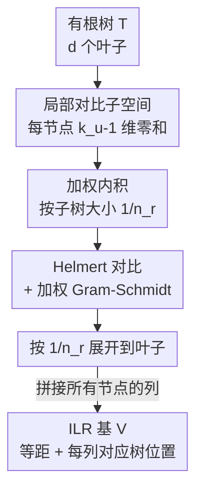

# Tree-Structured Orthonormal Decomposition of the Aitchison Simplex

**会议**: ICML2026  
**arXiv**: [2606.11646](https://arxiv.org/abs/2606.11646)  
**代码**: https://github.com/vsingh-group/polyilr  
**领域**: 学习理论 / 成分数据分析  
**关键词**: Aitchison 几何, ILR 坐标, 正交分解, 多分叉树, 等距同构  

## 一句话总结
PolyILR 给任意（含多分叉）树结构构造出一组**典范、完备、正交**的 Aitchison 单纯形坐标系：每个内部节点贡献 $k_u-1$ 个对比坐标，通过加权内积 + Helmert 对比 + 按子树大小展开，保证整体仍是合法的等距 ILR 基，让成分数据的每个坐标都对应树上一个具体位置。

## 研究背景与动机
**领域现状**：成分数据（compositional data）——只有相对比例有意义、总量无意义的非负向量——遍布微生物组、单细胞细胞类型占比、地球化学、softmax 概率输出等场景。分析它们的标准工具是 **Aitchison 几何**：它形式化了"只有比值 $x_i/x_j$ 携带信息"，并通过**等距对数比（ILR）**把单纯形 $\Delta^{d-1}$ 等距嵌入欧氏空间。

**现有痛点**：ILR 基不是唯一的——任意一组 $\mathcal{H}=\{z:\mathbf{1}^\top z=0\}$ 的正交基都给出合法 ILR 坐标，它们诱导相同几何但**不同的分解**，而基的选择直接决定可解释性。很多领域的成分天然带有已知**层级结构**（系统发育树、分类学、基因本体），这棵树规定了"哪些比较有意义、在什么分辨率上有意义"。但现有方法要么忽略树结构、要么丢掉 Aitchison 几何、要么只为**二叉树**设计、要么只给出孤立的对比而非完整坐标系。

**核心矛盾**：二叉树之所以简单，是因为每个内部节点只有两个孩子、只需一个对比（两个后代簇几何均值的对数比），内部节点与基向量一一对应（这正是 PhILR 的做法）。但现实里**多分叉（polytomy）极常见**——NCBI 分类学约 64% 的分叉点有三个及以上孩子。一个有 $k_u>2$ 个孩子的节点需要 $k_u-1$ 个正交对比，是一个**子空间**而非单个向量，于是三个难题同时冒出来：(i) 怎么在节点上定义典范的局部对比；(ii) 怎么把局部对比展开成叶子上的全局向量；(iii) 怎么保证所有节点间的正交性。根本障碍是**结构不兼容**：Aitchison 几何要求全局零和的 $(d-1)$ 维切空间，而树施加的是局部、嵌套的约束。

**本文目标**：能否构造一个**对任意树都成立、几何上有原则、且典范（canonical/可复现）**的 Aitchison 切空间正交分解，既不牺牲等距、也不引入任意的二叉化选择。

**核心 idea**：在每个内部节点上挂一个编码"所有孩子间相对比较"的**局部几何结构**，用一个**按子树大小加权的内积**度量它，再把局部正交基**按 $1/n_r$ 展开**到叶子上——关键定理是：在加权内积下的局部正交，等价于展开后在 $\mathbb{R}^d$ 里的全局正交。

## 方法详解

### 整体框架
PolyILR 的输入是一棵有 $d$ 个叶子的有根树 $\mathcal{T}$（每个叶子对应成分的一维），输出是一个 ILR 基矩阵 $V\in\mathbb{R}^{d\times(d-1)}$，使 $\varphi(x)=V^\top\log x$ 成为从 Aitchison 单纯形到欧氏空间的等距同构，且 $V$ 的每一列都对应树上一个具体内部节点的某个对比。

整条构造按 DFS 遍历每个内部节点 $u$，对每个 $u$ 依次做四件事：先定义局部对比子空间 $S_u$（捕获 $u$ 的 $k_u$ 个孩子间的全部相对比较），再给 $S_u$ 配一个加权内积（按各孩子子树叶子数 $n_r$ 加权），然后取 Helmert 对比并在加权内积下做 Gram-Schmidt 得局部正交基，最后把每个局部基向量按 $1/n_r$ 展开成叶子上的全局列向量、塞进 $V$。把所有节点的列拼起来就是完整的 PolyILR 基。

### 关键设计

**1. 局部对比子空间 $S_u$：把"零和约束"从 ILR 要求里逼出来，而非人为规定**

对有 $k_u$ 个孩子的节点 $u$，定义局部对比子空间

$$S_u=\Big\{h\in\mathbb{R}^{k_u}:\textstyle\sum_{r=1}^{k_u}h_r=0\Big\}.$$

这是与 $\mathbf{1}$ 正交的 $(k_u-1)$ 维子空间，恰好捕获 $k_u$ 个孩子簇间的全部相对比较——一个对比区分两个孩子、两个对比区分三个，依此类推。关键洞察是：这个零和约束**不是随手加的**，而是被 ILR 的硬要求 $V^\top\mathbf{1}=0$ 逼出来的。因为 $V$ 的每一列由某节点 $u$ 的局部向量 $\mathbf{h}$ 展开而来，要让该列与 $\mathbf{1}$ 正交，就必须局部满足 $\mathbf{h}^\top\mathbf{1}=0$。这一步把"多分叉节点需要一个子空间而非单向量"这件事干净地形式化了。

**2. 按子树大小加权的内积：让局部正交能升级成全局正交**

直接在标准内积下取局部正交基、再均匀展开到叶子，会破坏全局正交——因为不同孩子的子树大小不同，对全局内积的贡献不对等。本文给 $S_u$ 配加权内积

$$\langle h,h'\rangle_w=\sum_{r=1}^{k_u}\frac{h_r h'_r}{n_r},$$

其中 $n_r$ 是第 $r$ 个孩子的后代叶子数。配套地，把局部向量按 $1/n_r$ 展开到叶子：叶子 $i$ 若属于孩子 $r$ 则 $v_i=\widetilde H^{(u)}_{r,m}/n_r$，否则为 0。除以 $n_r$ 是命门——它保证加权内积下的局部正交 $\sum_r h_r h'_r/n_r=\delta$ 在展开后正好等于全局内积 $\langle\mathbf{v},\mathbf{v}'\rangle=\sum_i v_i v'_i=\delta$（因为孩子 $r$ 贡献 $n_r$ 个叶子、每个系数 $h_r/n_r$，求和后 $n_r$ 恰好约掉一个）。论文用一个 $n_1=1,n_2=3$ 的小例子说明：均匀展开会让范数变成 2，而加权归一 + $\div n_r$ 展开后范数恰为 1。

**3. Helmert 对比 + 加权 Gram-Schmidt：给"局部基怎么选"一个典范答案**

$S_u$ 的正交基有无穷多组，要让整个构造**可复现（典范）**，必须钉死一个确定性选择。本文用 **Helmert 对比**：$k\times(k-1)$ 的 Helmert 矩阵第 $m$ 列把"第 $m+1$ 个孩子"与"前 $m$ 个孩子的平均"作对比，

$$H_{r,m}=\begin{cases}\sqrt{1/(m(m+1))}&r\le m,\\ -\sqrt{m/(m+1)}&r=m+1,\\ 0&r>m+1.\end{cases}$$

给定孩子的一个顺序，Helmert 基是确定的（这正是"典范"的来源；QR 等其他正交基也行但缺这种顺序可解释性）。但 Helmert 列只在标准内积下正交，所以再对它在加权内积 $\langle\cdot,\cdot\rangle_w$ 下做 Gram-Schmidt，得 $\widetilde H^{(u)}$——这样在固定树和孩子顺序后，局部基唯一确定。最终定理 4.1 保证拼出的 $V$ 满足 $V^\top\mathbf{1}=0$（对比性）和 $V^\top V=I_{d-1}$（正交性），因此 $\varphi(x)=V^\top\log x$ 是等距：同节点的列由构造正交、不相交节点支撑不交、嵌套节点因后代展开向量在每个孩子簇上零和而正交。当树退化为二叉时（$k_u=2$），每节点恰好一个对比，PolyILR 退回 PhILR。

**4. 树对齐坐标 → 多尺度结构化分析**

构造出的每个坐标 $z_j=z_{(u,m)}=v_j^\top\log x$ 是一个 **balance**：比较节点 $u$ 处"孩子 $m+1$ 的几何均值"与"孩子 $1..m$ 的几何均值"的对数比。由于坐标索引 $j$ 与"(节点 $u$, 对比 $m$)"双射，且不同节点的坐标张成正交子空间，整个 $\mathbb{R}^{d-1}$ 被树节点**不相交地划分**。这带来三种聚合分析（见下表）：按**节点**问"哪个分叉驱动信号"、按**深度**问"哪个分辨率重要"、按**子树**问"整个 clade 是否有信息"。由于 $\varphi$ 是等距、保全几何，可以在 $z$ 上套任何下游模型而不损失信息。论文还指出一个理论彩蛋：softmax 输出也是单纯形值、共享同样的不变性结构，因此这套树对齐坐标可能延伸到带类别层级的概率建模。

## 实验关键数据

### 主实验
论文明确"目标是表示本身的可解释性，而非下游性能"，因此实验重点在两件事：(1) 表示是否保等距（与 CLR/PhILR 性能持平即合格），(2) 特征是否稳定可解释。在微生物组（HMP、cMD3、DISCO）和单细胞数据上，用 RF/SVM/LR 三种分类器比较 CLR、PhILR、PolyILR。

| 数据集 / 任务 | 指标 | CLR (RF) | PhILR (RF) | PolyILR (RF) |
|---|---|---|---|---|
| HMP body sites (5) | Acc | .956 | .961 | .963 |
| HMP body subsites (18) | Acc | .597 | .608 | .622 |
| DISCO leukemia (2) | Acc | .925 | .940 | .935 |
| HMP body sites (5) | AUROC | .987 | .992 | .992 |
| DISCO leukemia (2) | AUROC | .968 | .984 | .984 |

如等距理论所预期，SVM 和 LR 在三种 ILR 表示间结果完全一致（只是基的正交变换），差异只出现在 RF 上且很小——这正好佐证 PolyILR 没破坏几何。

### 特征稳定性（关键差异点）
真正拉开差距的是特征稳定性：用交叉验证各折 top-$K$ 特征的 Jaccard 重叠衡量，PolyILR 因坐标典范地绑定到树节点而高度稳定，PhILR 因任意二叉化（index / semantic 两种排序）而极不稳定。

| 任务 | PolyILR ($K$=5/10/50) | PhILR index/semantic ($K$=50) |
|---|---|---|
| HMP body sites (5) | .66 / .65 / .84 | .07 / .05 |
| HMP body subsites (18) | .71 / .72 / .88 | .07 / .04 |
| cMD3 westernized (2) | .43 / .69 / .81 | .01 / .02 |
| DISCO leukemia (2) | .75 / .81 / .92 | .73 / .12 |

### 关键发现
- **可解释性不靠牺牲性能换来**：分类性能与 CLR/PhILR 持平（等距使然），但特征稳定性碾压 PhILR——PolyILR 的 top-$K$ Jaccard 普遍 0.6–0.9，PhILR 常掉到 0.01–0.1，因为后者的对比依赖任意二叉化、换个排序就全变。
- **坐标自带语义**：每个 balance 直接读作"某菌属 vs 一组菌属"的对数比（如 HMP 里"Streptococcaceae vs Lactobacillus + Leuconostocaceae"），可按 RF 重要性排序定位"哪个分叉驱动信号"，这是 CLR 扁平坐标给不了的。
- **退化一致性**：二叉树时严格退回 PhILR，说明 PolyILR 是 PhILR 向多分叉的真正推广，而非另起炉灶。

## 亮点与洞察
- **"零和约束是被 ILR 逼出来的、不是人为设的"**这个论证很漂亮：它把整套构造的每一步都锚定到"必须是合法等距 ILR 基"这一硬约束上，从而获得典范性，而不是堆砌设计选择。
- **$1/n_r$ 加权展开**是全文技术核心——一行除法就把"局部加权正交"和"全局标准正交"焊死，让多分叉节点的子空间能无缝拼进全局基，可复用到任何"局部结构升全局"的正交构造问题。
- **与 Fourier/wavelet 的类比**点题精准：正如 Fourier 基从平移对称性、wavelet 从二分分割得到可解释分量，PolyILR 从树结构得到树对齐分量——把"选基 = 对齐领域结构"这件事讲透了。
- **softmax 连接**是个有潜力的伏笔：softmax 输出本是单纯形值却常用扁平概率坐标表示，PolyILR 提供了一套树对齐坐标，可能用于分析概率质量/误差/学习信号在类别层级上的集中位置。

## 局限与展望
- 典范性依赖两个结构约定——每个节点的**孩子顺序**和 Helmert 列的**符号约定**；不同顺序给出的基相差一个节点内的正交变换，几何不变但具体坐标会变，实践中靠"沿用输入树的顺序"来固定。
- 实验是表示导向的，下游性能与 CLR/PhILR 基本持平、并无性能优势；其价值主要体现在可解释性与稳定性，对只看准确率的场景吸引力有限。
- softmax/概率建模的连接只在理论层面提出，没有给出概率建模上的实证落地。
- 需要一棵**已知且可信**的树作为输入；当树本身有噪声、低支持度或错误时，坐标的可解释性会被这棵树的质量上限锁死，论文未充分讨论树误差的鲁棒性。

## 相关工作与启发
- **vs PhILR / 序列二叉分割（SBP）**：它们只处理二叉树、每节点一个对比；多分叉时必须任意二叉化、引入原树没有的人工分裂，导致坐标和解释依赖二叉化。PolyILR 直接在多分叉节点上给 $k_u-1$ 维子空间，不引入人工节点，二叉退化时严格等于 PhILR。
- **vs 贪心 balance 选择 / 边选择型 ILR 因子（如 PhyloFactor）**：它们只挑出孤立的、有预测力的对比，不构成完备的、按节点分组的正交坐标系；PolyILR 给的是与整棵树典范绑定的**完整**正交基。
- **vs CLR**：CLR 保等距但坐标扁平、对称、无树结构，特征不稳定且不可按层级解读；PolyILR 在同样等距的前提下让每个坐标对应树上一个具体位置。

## 评分
- 新颖性: ⭐⭐⭐⭐⭐ 首次给任意多分叉树构造典范、完备、等距的 Aitchison 正交分解，填了 PhILR 只能二叉的空白。
- 实验充分度: ⭐⭐⭐⭐ 微生物组+单细胞多数据集验证等距与稳定性，但纯表示导向、缺下游性能增益与树误差鲁棒性分析。
- 写作质量: ⭐⭐⭐⭐⭐ 从"零和约束被逼出"到"$1/n_r$ 展开"的推导逻辑环环相扣，类比清晰。
- 价值: ⭐⭐⭐⭐ 对成分数据分析（微生物组/单细胞/概率建模）是扎实的基础工具，可解释性与稳定性收益明确。

<!-- RELATED:START -->

## 相关论文

- [\[ICML 2026\] Provably Data-driven Multiple Hyper-parameter Tuning with Structured Loss Function](provably_data-driven_multiple_hyper-parameter_tuning_with_structured_loss_functi.md)
- [\[ICLR 2026\] Better Learning-Augmented Spanning Tree Algorithms via Metric Forest Completion](../../ICLR2026/learning_theory/better_learning-augmented_spanning_tree_algorithms_via_metric_forest_completion.md)
- [\[ICML 2026\] Finite-Width Neural Tangent Kernels from Feynman Diagrams](finite-width_neural_tangent_kernels_from_feynman_diagrams.md)
- [\[ICML 2026\] When Sample Selection Bias Precipitates Model Collapse](when_sample_selection_bias_precipitates_model_collapse.md)
- [\[ICML 2026\] Geometric and Stochastic Analysis of Discontinuities in Sparse Mixture-of-Experts](geometric_and_stochastic_analysis_of_discontinuities_in_sparse_mixture-of-expert.md)

<!-- RELATED:END -->
