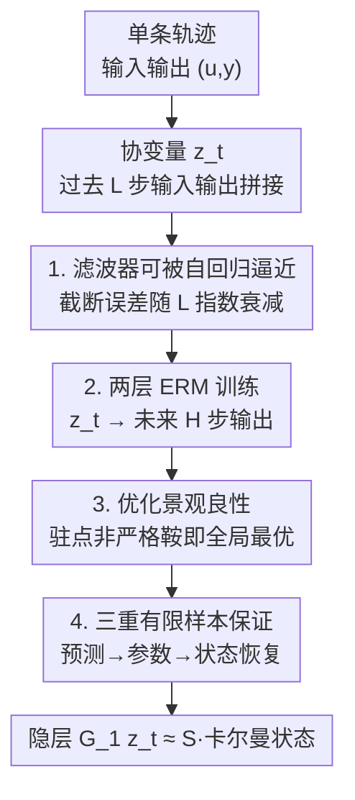

# Two-Layer Linear Auto-Regressive Models Estimate Latent States

**会议**: ICML2026  
**arXiv**: [2606.12691](https://arxiv.org/abs/2606.12691)  
**代码**: 待确认  
**领域**: 学习理论 / 系统辨识 / 自回归模型  
**关键词**: 自回归模型, 卡尔曼滤波, 潜在状态恢复, 有限样本保证, 非凸优化景观

## 一句话总结
本文从理论上证明：在部分可观测线性动力系统的数据上用经验风险最小化训练一个**两层线性自回归模型**，其隐层激活会自发地（在相似变换意义下）逼近最优卡尔曼滤波器给出的潜在状态估计——模型从未被告知系统参数或状态，却"端到端"地学会了滤波，并给出了预测、参数与状态恢复三重有限样本保证。

## 研究背景与动机

**领域现状**：自回归模型（从 LLM 到机器人世界模型）已成为处理序列数据的通用工具，核心范式都是"给定历史预测下一个元素"。一个长期悬而未决的问题是：这些模型在做好预测的同时，是否真的学到了数据背后的潜在机制？经验证据是混杂的——有研究显示 LLM 能在棋谱里表示棋盘状态，也有研究显示它会混淆"合法走法集合相同"的不同状态。

**现有痛点**：在有严格理论的那一侧，系统辨识领域研究"从输入输出数据能辨识出系统的哪些性质"已有几十年。近十年它被用统计学习的视角重写，给出了部分可观测线性系统的有限样本理论。但这些工作几乎都走"先学一个（线性）自回归模型、再用经典分解（如 Ho-Kalman 分解、核范数正则）从中抠出潜在状态"的两步路线。这种"显式去搜索潜在状态 / 引入专用正则"的做法，和深度学习里主流的端到端训练范式格格不入。

**核心矛盾**：经典控制理论擅长把"可观测量"和"潜在状态"联系起来，但靠的是 estimate-then-decompose 的特制流程；深度学习靠端到端梯度训练，但缺乏"它到底有没有学到潜在状态"的理论保证。两条线长期分裂。

**本文目标**：把动力系统理论的视角和标准的端到端深度学习训练统一起来。具体地，只给定系统 (3.1) 的**单条**输入输出轨迹 $\{(u_t,y_t)\}$，在不显式学习系统矩阵 $A,B,C$ 和噪声协方差的前提下，**直接**学出最优滤波器，并证明潜在状态会出现在模型的内部激活里。

**切入角度**：作者注意到卡尔曼滤波器的预测式 $\hat{x}_{t+1}=\bar{A}\hat{x}_t+Bu_t+Fy_t$ 可以被展开成对**过去 $L$ 步输入输出**的线性函数，而这恰好就是一个浅层自回归模型的形态。于是"学滤波器"可以被改写成"训练一个线性两层网络"，潜在状态自然落在中间那一层。

**核心 idea**：用一个隐维度 $h$ 的两层线性自回归网络 $G_2G_1\bar{z}_t$ 去拟合"未来 $H$ 步输出"，则第一层 $G_1\bar{z}_t$ 在相似变换下就等于卡尔曼滤波的状态估计——把"潜在状态恢复"从一道额外的分解工序，变成训练自带的副产品。

## 方法详解

### 整体框架
论文研究的对象是一个部分可观测线性动力系统：$x_{t+1}=Ax_t+Bu_t+w_t$，$y_t=Cx_t+v_t$，其中 $x_t$ 是看不见的潜在状态，只有输入 $u_t$ 和输出 $y_t$ 可观测。目标是只用一条轨迹直接学出卡尔曼滤波器，并把潜在状态读出来。整条理论沿"把滤波器改写成自回归模型 → 证明优化景观良性 → 给出有限样本统计保证 → 推出状态恢复"四步推进。

具体地，对选定的历史长度 $L$，把过去 $L$ 步输出和输入拼成协变量 $\bar{z}_t=[y_{t-1}^\top\cdots y_{t-L}^\top\ u_{t-1}^\top\cdots u_{t-L}^\top]^\top\in\mathbb{R}^{\bar{d}_z}$（$\bar{d}_z=(m+p)L$）；对未来视界 $H$，预测目标是 $y_{t:t+H-1}\in\mathbb{R}^{\bar{d}_y}$（$\bar{d}_y=mH$）。模型就是两层线性映射 $f(\bar{z})=G_2G_1\bar{z}$，隐维度为 $h$，权重带 Frobenius 范数上界 $c_0$（等价于权重衰减正则）。训练用平方损失做经验风险最小化：

$$\mathcal{L}_R(G_1,G_2)=\frac{1}{2T}\sum_{t=1}^T\|y_{t:t+H-1}-G_2G_1\bar{z}_t\|_{\ell_2}^2.$$

求解时先对隐维度 $h$ 做架构搜索，再对每个 $h$ 用梯度下降优化 $(G_1,G_2)$。下面四个关键设计对应上述四步推进。

### 关键设计

**1. 把卡尔曼滤波器写成有界截断误差的自回归逼近：让"潜在状态"可由有限历史线性表示**

第一步要回答的痛点是：滤波器是一个无限递归（依赖全部历史），凭什么用固定窗口 $L$ 的自回归就能逼近？作者把预测式滤波器 (3.2) 反复展开，得到 $\hat{x}_t=\mathcal{C}\bar{z}_t+\bar{A}^L\hat{x}_{t-L}$，其中 $\mathcal{C}$ 是由滤波器闭环矩阵 $\bar{A}=A-FC$ 与卡尔曼增益 $F$、输入矩阵 $B$ 堆出的"扩展可控性矩阵"。关键在于：只要系统满足可观测、可镇定（Assumption 2），滤波器闭环就是稳定的 $\rho(\bar{A})<1$，于是残差项 $\bar{A}^L\hat{x}_{t-L}$ 随 $L$ 几何衰减。Proposition 1 给出 $\|\hat{x}_t-\mathcal{C}\bar{z}_t\|_{\ell_2}^2\le C_\rho^2\rho^{2L}\|\Sigma[\hat{x}_t]\|(n+\log(1/\delta))$，因此取 $L\gtrsim\beta\log(T)/(1-\rho)$ 就能把截断误差压到任意小。这一步把"无限记忆的最优滤波器"安全地落到"有限窗口的线性模型"上，是后面一切的地基。同理未来输出可写成 $y_{t:t+H-1}=\mathcal{O}\mathcal{C}\bar{z}_t+\mathcal{O}\bar{A}^L\hat{x}_{t-L}+\xi_t$，其中 $\mathcal{O}$ 是扩展可观测性矩阵，$\xi_t$ 把未来输入与未来新息当作噪声——这正好对上两层网络 $G_2G_1$ 应学到的目标 $\mathcal{O}\mathcal{C}$。

**2. 证明非凸优化景观是良性的：让朴素梯度下降也能落到全局最优**

第二个痛点是 ERM (3.6) 在 $(G_1,G_2)$ 上是非凸的（两个矩阵相乘），梯度下降凭什么不卡在坏的局部极小？作者证明（Proposition 2）：当数据由真实系统 (3.1) 生成、且 $L$ 与轨迹长度 $T$ 取得足够大时，损失景观满足两条"好性质"——**任何局部极小都是全局极小，任何鞍点都是严格鞍点**（即 Hessian 最小特征值严格为负）。这意味着没有"平坦的坏鞍"困住优化。该结论借助 Ziemann 等人刻画非凸辨识全局最优的统计工具，并依赖输入输出训练数据的持续激励性质（persistence of excitation）。作者也诚实指出一个 caveat：严格鞍 + 局部即全局通常能保证（扰动）梯度下降收敛，但那套结果是为**无约束**问题证的，而本文带范数约束，把它扩到约束情形（如投影梯度）仍是 open problem，只在实验上观察到一阶方法表现良好。

**3. 三重有限样本统计保证：从预测误差一路推到参数误差**

光有景观良性还不够，要的是"训练数据有限时误差到底多大"。作者给出递进的两条 bound。Theorem 2（样本内预测误差）：在全局最优 $(\hat{G}_1,\hat{G}_2)$ 处，$\frac{1}{T}\sum_t\|(\hat{G}_2\hat{G}_1-\mathcal{O}\mathcal{C})\bar{z}_t\|_{\ell_2}^2\lesssim\frac{\|\Sigma[\xi_1]\|H}{T}(r(\bar{d}_y+\bar{d}_z)\log(T\Lambda)+\log\frac{T}{\delta})$，即学到的映射逼近"已知动力学才能给出的" $\mathcal{O}\mathcal{C}$，速率为 $\tilde{O}(1/T)$，且对轨迹长度 $T$ 与函数类维度 $r(\bar{d}_y+\bar{d}_z)$ 几乎是最优依赖。这一步技术核心是把无闭式解的预测误差，上界成函数类 Gaussian 复杂度的自归一化版本，从而能处理相关数据。Theorem 3（参数估计误差）进一步把样本内结论推广到未见数据：只要协变量 $\bar{z}_t$ 能持续激励 Hankel 矩阵 $\mathcal{H}=\mathcal{O}\mathcal{C}$ 的所有模态（论文证明 $\lambda_{\min}(\sum_t\bar{z}_t\bar{z}_t^\top)\gtrsim\lambda_{\min}(\Sigma[\bar{z}_L])T$ 在 Assumption 下成立），就得到 $\|\hat{G}_2\hat{G}_1-\mathcal{O}\mathcal{C}\|_F^2$ 的近最优泛化界。

**4. 潜在状态恢复（相似变换意义下）：把"学好滤波器"翻译成"读出潜在状态"**

前面只保证了模型**输出**逼近真值，但本文真正想要的是"隐层 = 潜在状态"。Theorem 4 在 $\mathcal{O}$ 列满秩、$\mathcal{C}$ 行满秩且满足鲁棒性条件 $2\|\hat{G}_2\hat{G}_1-\mathcal{O}\mathcal{C}\|_F\le\sigma_n$ 时，证明存在相似变换 $S$ 使得 $\|\hat{x}_t-S\hat{G}_1\bar{z}_t\|_{\ell_2}^2$ 以 $\tilde{O}(1/T)$ 速率趋于 0——也就是隐层激活 $\hat{G}_1\bar{z}_t$ 在 $S$ 下就是卡尔曼状态估计。这里"相似变换"不是漏洞而是本质：从纯输入输出数据出发，潜在状态本就只能恢复到相似变换的等价类（Remark 1），因为 $(A,B,C)$ 与 $(SAS^{-1},SB,CS^{-1})$ 产生完全相同的输入输出统计。值得强调的是，经典 Ho-Kalman 路线要靠对 Hankel 矩阵做 SVD 才能拿到这种鲁棒性保证，而本文的自回归模型**不需要任何额外分解步骤**。这里还揭示一个 trade-off：$H$ 必须 $\ge n$ 才能让 $\mathcal{O}$ 列满秩从而可恢复状态，但 $H$ 太大又会因 $\|\Sigma[\xi_1]\|$ 随 $H$ 多项式增长而让误差界变松。

### 损失函数 / 训练策略
训练目标即平方损失 ERM (3.6)，外层对隐维度 $h\le r$ 做网格搜索、内层对 $(G_1,G_2)$ 做梯度下降。范数约束 $\max\{\|G_1\|_F^2,\|G_2\|_F^2\}\le c_0$ 在实现上等价于权重衰减：实验用 Adam、weight decay $10^{-3}$ 替代显式投影，学习率指数衰减。这与深度学习常见的"线性激活 + weight decay"训练完全对应。

## 实验关键数据

实验目的不是刷指标，而是**验证理论**：两层线性网络的隐层是否真的对齐卡尔曼状态。用合成随机系统（$n=4,p=2,m=3$，$\rho(A)=1$ 边缘稳定）与 ControlGym 的两个真实环境（水下航行器 umv，$n=8$；飞行器 ac6，$n=10$）。

### 主实验：架构搜索发现隐维度自动等于真实状态维
固定 $L=10,H=5,T_{\text{train}}=10^4$，对隐维度 $h\in\{1,\dots,10\}$ 各跑 $N=10$ 条轨迹，报告最小训练损失的均值±标准差。

| 隐维度 $h$ | 训练损失 (mean ± std) | 说明 |
|-----------|----------------------|------|
| 1 | 309.60 ± 167.99 | 严重欠参数化，损失爆炸 |
| 2 | 0.666 ± 0.047 | 跨过临界，损失骤降 |
| 3 | 0.720 ± 0.057 | — |
| **4** | **0.618 ± 0.041** | **最低，恰等于真实状态维 $n=4$** |
| 5–10 | 0.62–0.69 | 过参数化，无进一步收益 |

关键现象：$h=1$ 欠参数化损失高达 309，而最小训练损失出现在 $h=4=n$，说明模型自动"发现"了真实潜在状态维度。

### 潜在状态恢复：隐层激活与卡尔曼状态高度对齐
把 $h$ 设为状态维 $n$，拟合线性映射 $\hat{S}$ 后，用 $R^2$ 衡量 $\hat{S}\hat{G}_1\bar{z}_t$ 与卡尔曼预测 $\hat{x}_t$ 的逐坐标一致性。

| 系统 | $H$ | 平均 $R^2$ | 说明 |
|------|-----|-----------|------|
| Random ($n=4$) | 1 | 0.999 | 四个坐标 $R^2$ 均 ≥0.998 |
| Random ($n=4$) | 5 | 0.998 | 多步预测仍近乎完美对齐 |
| umv ($n=8$) | 1 | （论文 Table 2 报告，趋势一致高） | 真实控制系统同样对齐 |
| ac6 ($n=10$) | 1 | （同上） | — |

### 关键发现
- 隐维度网格搜索的最优值自发收敛到真实状态维 $n$，无需任何关于 $n$ 的先验，呼应"模型自动表示潜在状态"。
- 合成系统上潜在状态恢复的 $R^2$ 接近 1.000，且 $H=1$ 与 $H=5$ 都成立，说明对齐不依赖特定视界。
- 实验用 Adam（一阶方法）就能稳定收敛到良好解，间接支持 Proposition 2 关于景观良性的理论（尽管约束情形的收敛证明仍 open）。

## 亮点与洞察
- **"潜在状态是训练副产品"这一视角很漂亮**：它把控制理论里需要专门 SVD/分解才能拿到的潜在状态，证明为标准端到端训练隐层的自然产物，弥合了系统辨识与深度学习两套范式。
- **相似变换被当作"特性"而非"缺陷"处理**：作者清楚地用 Remark 1 说明从 I/O 数据出发本就只能恢复到相似变换等价类，因此理论里出现 $S$ 是 unavoidable 的正确结论，而非松弛。
- **三重保证层层递进、各司其职**：预测误差（样本内）→ 参数误差（泛化）→ 状态恢复（语义），逻辑链条干净，且每一步都标了所需的 $L,T$ 量级，可迁移到其他"先把递归滤波器自回归化、再分析两层网络"的问题。
- **隐维度自动等于状态维**这个实验现象，给"用训练损失反推系统阶数"提供了一个轻量做法。

## 局限与展望
- **线性 + 高斯**：理论与实验都局限于线性动力系统、高斯噪声。卡尔曼滤波在此是最优线性滤波器，结论能否推广到非线性系统 / 非高斯噪声、乃至真实 Transformer 自回归，是最大的开口。
- **约束优化的收敛仍未证**：Proposition 2 的良性景观保证收敛的标准结果是为无约束问题写的，本文带范数约束，扩到投影梯度等约束算法仍是 open problem，目前只有经验支撑。
- **计算代价更高**：作者自承自回归逼近比真正的卡尔曼滤波参数更多、内存更大——它复现的是滤波器的输入输出行为，而非其紧凑计算结构。
- **$H$ 的 trade-off**：$H<n$ 无法恢复状态，$H$ 过大又让误差界变松；如何自适应选 $H$ 未深入。
- 仅在 ControlGym 两个系统上验证真实数据，规模较小。

## 相关工作与启发
- **vs Ho-Kalman / 核范数正则的 estimate-then-decompose 路线 [OO19, OO21, SOF22]**：他们先学线性自回归模型、再用经典分解抠出状态空间参数；本文不分离两步，状态估计直接出现在两层线性模型的激活里，且无需额外 SVD 即有鲁棒性保证。
- **vs Tsiamis & Pappas [TP19]**：同样关注卡尔曼滤波而非参数估计、同样做最小二乘自回归、同样给非渐近分析；区别在于他们走主流的 estimate-then-decompose，本文提出并分析一个**非凸**学习流程。
- **vs Goel & Bartlett [GB24]、Du 等 [DBOO23]**：他们证明自回归 Transformer 能逼近卡尔曼滤波 / 跨多个线性系统泛化；本文用更简洁的两层线性模型，并把重点放在**状态估计**而非控制，给出完整有限样本恢复保证。
- **vs 政策梯度学滤波器增益 [USP+22, FTA25]**：那一系在控制语境下分析自回归策略的良性景观；本文借鉴良性景观思路，但目标是状态估计而非控制。

## 评分
- 新颖性: ⭐⭐⭐⭐⭐ 首次把"端到端训练的两层线性网络隐层 = 卡尔曼状态"严格证出，统一了系统辨识与深度学习两套范式。
- 实验充分度: ⭐⭐⭐⭐ 合成 + ControlGym 验证了核心理论预测（隐维度=状态维、$R^2\approx1$），但规模小、纯验证性。
- 写作质量: ⭐⭐⭐⭐⭐ 四步推进逻辑清晰，假设与 caveat（相似变换、约束收敛 open）都交代得很诚实。
- 价值: ⭐⭐⭐⭐ 为"自回归模型是否学到潜在机制"提供了可证明的理想化范例，对理解表示学习有概念价值，但线性假设限制了直接落地。

<!-- RELATED:START -->

## 相关论文

- [\[ICML 2026\] A Perturbation Approach to Unconstrained Linear Bandits](a_perturbation_approach_to_unconstrained_linear_bandits.md)
- [\[ICLR 2026\] Epistemic Uncertainty Quantification To Improve Decisions From Black-Box Models](../../ICLR2026/learning_theory/epistemic_uncertainty_quantification_to_improve_decisions_from_black-box_models.md)
- [\[ICLR 2026\] Expressive Power of Implicit Models: Rich Equilibria and Test-Time Scaling](../../ICLR2026/learning_theory/expressive_power_of_implicit_models_rich_equilibria_and_test-time_scaling.md)
- [\[ICLR 2026\] A Sharp KL Convergence Analysis for Diffusion Models under Minimal Assumptions](../../ICLR2026/learning_theory/a_sharp_kl_convergence_analysis_for_diffusion_models_under_minimal_assumptions.md)
- [\[ICLR 2026\] A New Approach to Controlling Linear Dynamical Systems](../../ICLR2026/learning_theory/a_new_approach_to_controlling_linear_dynamical_systems.md)

<!-- RELATED:END -->
