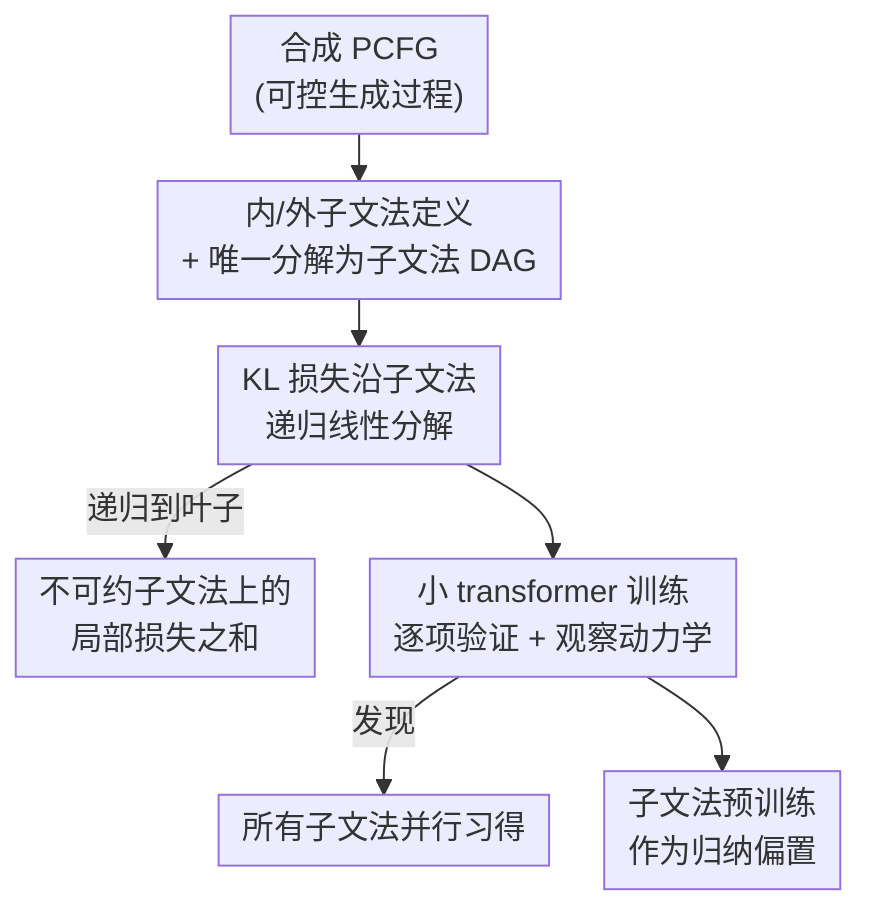

# Unraveling Syntax: Language Modeling and the Substructure of Grammars

**会议**: ICML 2026  
**arXiv**: [2510.02524](https://arxiv.org/abs/2510.02524)  
**代码**: https://github.com/laschulz/pcfg-transformer-learning  
**领域**: 学习理论 / 语言模型学习动力学 / 形式语言  
**关键词**: 上下文无关文法, PCFG, 子文法, 损失分解, 并行学习

## 一句话总结
本文为「语言模型损失」和「上下文无关文法（CFG）的子结构」建立了一套基础定理，证明语言建模的 KL 散度可以沿子文法层级递归地线性分解；并通过在合成 PCFG 上训练小 transformer 发现：模型是**并行**地学习所有子文法的（不像儿童先掌握简单结构），而 PCFG 子文法预训练只对相对文法很小的模型有帮助，但能稳定地让内部表示更贴合文法的子结构。

## 研究背景与动机
**领域现状**：理解 LLM「为什么这么强」的一条路线，是退回到完全可控的合成设定——用上下文无关文法（CFG / PCFG）当作语言的代理，在小文法上训练小模型，从而能精确地探查模型学到了哪些规则、文法大小如何影响学习等。CFG 几乎能刻画自然语言句法、编程语言、算术等绝大多数我们关心的领域，因此是一个有语言学动机又数学干净的实验台。

**现有痛点**：作者指出两件事一直没被认真研究。其一，已有工作大多分析**训练好的**模型的静态表示与推理逻辑，而很少研究模型**习得语言的动力学过程**——比如模型是否像儿童那样先掌握简单子结构、再进入复杂句法。其二，已有研究把 CFG 当成一个整体，**忽略了 CFG 作为数学对象本身具有子结构**，可以分解成「子文法」。在研究多项式、XOR、模计数等抽象函数类学习时，「学习如何与函数类的子结构（如组成多项式的单项式）互动」一直是核心议题，但 CFG 这边却没有对应的工具。

**核心矛盾**：要研究「学习动力学 × 子结构」，首先得有一个**正确的子文法定义**，并把它和语言建模的损失严格地连接起来——否则「模型先学了哪部分」这种话就只是直觉，无法量化。

**本文目标**：(1) 定义 CFG 的子文法；(2) 证明语言建模损失与子文法结构之间的基础关系；(3) 实证研究子文法结构如何影响训练动力学，以及能否被用来改进优化。

**切入角度**：作者从「损失 = KL 散度」这一等式出发（$\mathcal{L}(\theta)=D_{\mathrm{KL}}(P\|Q_\theta)+H(P)$，熵 $H(P)$ 与 $\theta$ 无关），把注意力集中在 KL 散度上；再利用 PCFG 生成过程的递归性 + 自回归模型的链式分解，发现 KL 散度天然沿子文法结构「拆账」。

**核心 idea**：用「内子文法 / 外子文法」两种新定义刻画 CFG 的子结构，并证明语言建模 KL 损失沿这套子结构**递归线性分解**——把一个看似整体的损失，还原成一组「不可约子文法」上的局部损失之和。

## 方法详解
本文是一篇「理论 + 受控实验」的论文：先给定义、再证定理、最后用小 transformer 在合成 PCFG 上把定理「画出来」。方法的核心不是一个 pipeline，而是三块内容：子文法的定义、损失分解定理、以及围绕这些定理设计的实验探针。下面按这个逻辑组织。

### 整体框架
整体上，作者要回答三个递进的问题——**怎么定义子结构 → 损失和子结构是什么关系 → 这个关系能不能用来改进训练**——并用同一套合成实验台串起来：手工设计一小批覆盖「因子化子文法、共享子结构、层级递归、深层嵌套依赖」的 PCFG，在缩小版 nanoGPT 上训练，因为对生成过程有精确访问，所以能逐项验证理论。

### 关键设计

**1. 内子文法与外子文法：给 CFG 的「子结构」两种正确定义**

要谈「损失沿子结构分解」，先得说清楚子结构是什么。作者提出两种互补的子文法。**内子文法（inner subgrammar）**对应 CFG 推导树的子树：取非终结符集合 $\mathcal{N}'\subseteq\mathcal{N}$，把所有展开 $\mathcal{N}'$ 中符号的规则都收进来，权重做重归一化，使每个 $A\in\mathcal{N}'$ 满足 $\sum_{(A\to\alpha)\in\mathcal{P}'}\mathcal{W}'(A\to\alpha)=1$；若它不含起始符 $S$ 就叫「真子文法」。**外子文法（outer subgrammar）**则对应「语言的简化版」：保留 $S$ 在内的部分规则子集 $\mathcal{P}'\subseteq\mathcal{P}$（至少含一条左部为 $S$ 的规则），外子文法生成的每个串都是原文法的合法串。直观上，内子文法是 CFG 内在的组合性子块，外子文法是「更简单的一门语言」。作者进一步证明 **每个 PCFG 都能唯一分解成一个内子文法的层级 DAG（带自环）**（定理 4.1），每个节点由一组非终结符标记——这套 DAG 恰好对应 Gruska 经典 CFG 理论里的「文法层级」。

**2. KL 损失沿子文法的递归线性分解：本文最核心的定理**

这是全文的支柱。设 PCFG $G$ 有顶层子文法 $A_1,\dots,A_k$，$Q_\theta$ 是自回归语言模型。作者先在最简单的情形 $S\to\alpha A\beta$（$\alpha,\beta$ 是固定终结串、$A$ 是真子文法）展开 KL，利用 $P_G$ 的子文法结构 + $Q_\theta$ 的自回归链式分解，把 $D_{\mathrm{KL}}(P_G\|Q)$ 拆成「前缀 $\alpha$ + 子文法 $A$ + 后缀 $\beta$」三段「受限 KL 散度」之和。一般地（定理 4.3）：

$$D_{\mathrm{KL}}(P_G\|Q_\theta)=\sum_{i=1}^{k}D_{\mathrm{KL}}(P_G\|Q_\theta)_{A_i}+\sum_{\alpha\in C}D_{\mathrm{KL}}(P_G\|Q_\theta)_{\alpha}$$

其中 $D_{\mathrm{KL}}(\cdot)_{A}$ 是把 KL「限制」到子文法 $A$（对所有能开启 $A$ 的上下文取平均），$C$ 是 $S$ 展开里的固定终结子串集。若把 $G$ 改写成 $S$ 只映到非终结符串，右边那项就消失（推论 4.4）。关键在于：这个递归**对任意子文法都成立**，反复应用就一路展开到 DAG 的所有叶子，得到「不可约子文法上的局部损失之和」。这意味着「整体损失」从来不是黑箱，而是子结构上局部损失的线性叠加——这正是后面所有动力学观察的理论根基。

**3. 上下文不敏感假设 + 递归爆炸：让分解变干净，并刻画递归的代价**

定理 4.3 里的「受限 KL」带着上下文条件，不够漂亮。作者引入一个**上下文不敏感（context-insensitive）**假设：若模型对子文法 $A_i$ 在任意可行上下文下给出相同的条件分布，则递归项退化成干净的 KL 散度（推论 4.5）：$D_{\mathrm{KL}}(P_G\|Q_\theta)=\sum_i p_i\,D_{\mathrm{KL}}(P_{A_i}\|Q_\theta(A_i))$，$p_i$ 是 $A_i$ 在展开 $S$ 时出现的概率。作者强调这个假设虽强，但实验中「统计意义上」常近似成立（只有前缀极深时才失效，而这种串本就稀有）。进一步，针对**递归**（$S$ 出现在展开 $S$ 自身的规则里），定理 4.6 给出「期望递归」下的闭式：

$$D_{\mathrm{KL}}(P_G\|Q_\theta)=\frac{\sum_{i=1}^{k}D_{\mathrm{KL}}(P_{A_i}\|Q_\theta(A_i))}{1-\mathbb{E}[R]}$$

$R$ 是单次展开 $S$ 时 $S$ 出现的次数。这条公式点出递归的代价：$\mathbb{E}[R]$ 越接近 1，分母越小，散度越「爆炸」；若 $\mathbb{E}[R]\ge1$，PCFG 采样过程在期望意义下永不终止，散度无界。它相当于递归分解的「基例」，把「深层递归为什么难」量化成了一个简单的分母。

**4. 并行学习的充分条件：把「为什么并行」收进一个独立性假设**

实验里跳出来的最反直觉现象是：模型**并行**地降低所有子文法的损失，而非先简后繁。作者指出，损失的线性分解本身并不阻止并行学习，但也不强制——可以构造病态场景让模型按序优化。于是作者给出一个充分条件（推论 4.7）：若对子文法 $A_i$ 做一步梯度更新 $\delta=\nabla_\theta(-D_{\mathrm{KL}}(P_G\|Q_\theta)_{A_i})$ 不会损害其它子文法 $A_j$（$j\ne i$）的表现，即更新后 $D_{\mathrm{KL}}(\cdot)_{A_j}$ 不增，那么梯度下降就会**并行**学习所有子文法。这个「子文法间不互相干扰」的独立性条件，把经验现象归约成一个清晰的数学假设，也指明了后续要去验证/弱化的对象。

### 损失函数 / 训练策略
训练目标就是标准的最大似然 / 等价的 KL 最小化。实验用缩小版 nanoGPT（如 2 层、4 层、2 头的 decoder-only transformer），在一小批手工 PCFG（含 ABC 文法、嵌套括号、类 Python 文法、算术表达式等）上训练。子文法预训练实验中，模型先在子文法串上训 $y$ 个 epoch、再在全文法上训 $x-y$ 个 epoch，与「从头训 $x$ 个 epoch」在**相同总 epoch、总句数**下对比，用 CKA / 余弦相似度跨 30 个随机种子度量表示对齐。

## 实验关键数据

### 核心理论结果一览

| 结果 | 陈述（简化） | 含义 |
|------|------|------|
| 定理 4.1 | 每个 PCFG 唯一分解为内子文法层级 DAG | 给「子结构」一个良定义的坐标系 |
| 定理 4.3 | $D_{\mathrm{KL}}=\sum_i D_{\mathrm{KL},A_i}+\sum_\alpha D_{\mathrm{KL},\alpha}$ | KL 损失沿子文法递归线性分解 |
| 推论 4.5 | 上下文不敏感时 $D_{\mathrm{KL}}=\sum_i p_i D_{\mathrm{KL}}(P_{A_i}\|Q_\theta)$ | 递归项退化为干净 KL，按概率加权 |
| 定理 4.6 | $D_{\mathrm{KL}}=\frac{\sum_i D_{\mathrm{KL}}(P_{A_i}\|Q_\theta)}{1-\mathbb{E}[R]}$ | 递归代价：$\mathbb{E}[R]\to1$ 散度爆炸，$\ge1$ 采样不终止 |
| 推论 4.7 | 子文法间梯度更新互不损害则并行学习 | 把「并行学习」归约成独立性假设 |

### 主实验：损失分解与并行学习
在多种子文法结构的合成 PCFG 上训练小 transformer，逐项画出 KL 散度随训练的变化，验证「整体 KL = 各子文法局部 KL 之和」在**所有训练阶段**都成立（图 1–2），覆盖深度 4 的内子文法 DAG、外子文法、以及概率 $<100\%$ 出现的子文法（各项按出现概率 $p$ 加权后正好相加）。对定理 4.6，用两规则文法 $S\to x\,(p),\ S\to(S\text{ and }S)\,(1-p)$ 验证：$\mathbb{E}[R]=2(1-p)$，KL $\propto C/(2p-1)$，当 $p\to0.5$ 时散度按反比非线性爆炸。所有图里都跳出同一现象——**子文法被并行习得**。

### 子文法预训练对内部表示的影响（CKA，类 Python PCFG）
表格为跨种子（30 seeds，435 对）的平均线性 CKA 相似度（0–1，越高越对齐），预训练后再训 45 epoch：

| 配置 | 2 层 Attn（预训 10 ep） | 2 层 Attn（预训 20 ep） | 4 层 Attn（预训 10 ep） |
|------|------|------|------|
| 全文法串·从头训 | 0.258 | 0.249 | 0.249 |
| 全文法串·带预训练 | 0.281（+8.9%） | 0.303（+21.7%） | 0.323（+8.3%） |
| 子文法串·从头训 | 0.298 | 0.288 | 0.295 |
| 子文法串·带预训练 | 0.339（+13.8%） | 0.348（+20.8%） | 0.347（+10.7%） |

令人意外的是：**少花几个 epoch 去单独训子文法，反而让模型进入一个跨种子更「对齐」的权重子空间**——不仅子文法串的表示更一致（说明预训练学到的子结构没被全文法训练「擦掉」），连全文法串的表示也更对齐（而这些模型在全文法上反而训得更少）。MLP 层几乎不变，效应集中在 attention 层。

### 关键发现
- **并行学习是训练方法+架构的性质**，不是语言任务本身决定的；损失线性分解保证了「没有东西阻止并行」，但并行与否取决于优化是否满足推论 4.7 的独立性。
- **子文法预训练只对「相对文法很小」的模型提升最终损失**：2 层 transformer 上有效、4 层上消失；大模型无论是否预训练都能到更低损失。存在一个「最优预训练窗口」——太少不足以注入归纳偏置，太多会过度专门化、损害迁移。
- **子文法位置无关紧要**：无论在前缀、中缀还是后缀位置预训练子文法，小 transformer 都能稳定保留其建模性能，暗示预训练把模型摆渡进了一个「子文法被内部表示」的权重子空间，后续全文法训练仍停留在该子空间内。
- **模型困于「深度」而非「长度」**：在嵌套括号文法上，同深度延长上下文 $(a)^i$ 时预测误差始终很低，但沿递归规则加深 $)^i$ 时误差像反对数曲线增长；前置不同（甚至非法）前缀几乎不影响结果，说明模型主要卡在「要补全的子序列的递归深度」。作者还顺手测了前沿模型：GPT-5.1 Instant 在非深算术表达式上 5/5 全对，但深度 7 的单个算术表达式只对 2/5——尽管非深表达式要算的项更多。⚠️ 前沿模型的这组探针属轶事性证据，以原文为准。

## 亮点与洞察
- **把「黑箱损失」翻译成「子结构上的局部损失之和」**：KL 沿子文法递归线性分解，是一个既干净又有力的结果——它让「模型先学了什么、卡在哪」从直觉变成可逐项度量的量，给学习动力学研究提供了坐标系。
- **递归代价的一行刻画**：$1/(1-\mathbb{E}[R])$ 把「为什么深层递归这么难」压缩成一个分母，$\mathbb{E}[R]\to1$ 时散度爆炸、$\ge1$ 时采样不终止，直观又可验证。
- **「并行学习 vs 儿童序列习得」的对照**：模型并行降所有子文法损失，和儿童「先简后繁」的语言习得形成鲜明反差，开启了「何时、为何模型会并行学习」这一新问题。
- **可迁移的思路**：把「函数类子结构 × 学习动力学」的研究范式（原本用于多项式、奇偶、模计数）移植到形式语言上；这套定义和分解还可能推广到树邻接文法、索引文法乃至上下文相关文法。

## 局限与展望
- **并行学习缺完整理论**：只给了推论 4.7 这一个「略显笨重」的充分条件，没说清梯度训练**何时/为何**会产生跨子文法的并行改进；未来需在更弱假设下证明，并实证 RNN/LSTM 等其它架构是否也满足该独立性。
- **实验台受限**：只用一小批合成 PCFG + 缩小版 decoder-only transformer，且**全部无歧义**（每个串唯一解析树）；歧义、外子文法的更复杂分解、文法归纳（grammar induction）等都未涉及。
- **深度失败的根因未定**：第 6 节没区分「深层递归失败」是表示能力上限还是优化障碍；作者猜想存在能正确建模 PCFG 的 2 层 2 头权重，只是梯度下降找不到——类比奇偶/模计数「可表示但难学」的已知结论，但未证明。
- **缺跨语言类的对照**：未在匹配条件下比较正则、（温和）上下文相关语言的学习动力学，因此还无法把「CFG 中深度之难」与其它依赖形式区分开。

## 相关工作与启发
- **vs Cagnetta & Wyart (2024)**: 同样在 PCFG 上训 transformer 关联学习行为与层级结构，但他们的 PCFG 只生成有限支撑语言（无递归）、且只预测最后一个 token，因此观察到「分阶段、不连续」的学习；本文在自回归全序列建模下得到的是**并行**学习——两套结论的调和留作未来工作。
- **vs Allen-Zhu & Li (2023)**: 他们刻画训练好的 transformer 如何在内部状态里实现 CFG 计算、编码重写规则（静态视角）；本文在此之上专门研究**学习动力学**，且是相对子文法的视角。
- **vs 结构化假设类学习（juntas / parities / 模计数）**: 本文把那条「学习 × 函数子结构」的线索迁移到形式语言，CFG 提供了语言学动机更强、递归结构更显式的设定。

## 评分
- 新颖性: ⭐⭐⭐⭐⭐ 首次为「语言建模损失」与「CFG 子文法」建立递归线性分解定理，并发现并行学习现象。
- 实验充分度: ⭐⭐⭐⭐ 合成 PCFG 上逐项验证定理 + CKA 表示分析扎实，但文法/架构覆盖窄、无歧义、无大模型。
- 写作质量: ⭐⭐⭐⭐ 定义—定理—可视化结构清晰，理论与直觉解释到位，部分记号偏密。
- 价值: ⭐⭐⭐⭐⭐ 给 LM 学习动力学研究提供了一套可量化的子结构坐标系，开启「何时并行学习」「深度之难」等新方向。

<!-- RELATED:START -->

## 相关论文

- [\[ICML 2026\] Formalizing Learning from Language Feedback with Provable Guarantees](formalizing_learning_from_language_feedback_with_provable_guarantees.md)
- [\[ICML 2026\] Realizable Bayes-Consistency for General Metric Losses](realizable_bayes-consistency_for_general_metric_losses.md)
- [\[ICML 2026\] Towards Optimal Robustness in Learning-Augmented Paging](towards_optimal_robustness_in_learning-augmented_paging.md)
- [\[ICML 2026\] Revenue Guarantees of No-Swap-Regret Dynamics in First Price Auctions](revenue_guarantees_of_no-swap-regret_dynamics_in_first_price_auctions.md)
- [\[ICML 2026\] Robustness of Mixtures of Experts to Feature Noise](robustness_of_mixtures_of_experts_to_feature_noise.md)

<!-- RELATED:END -->
