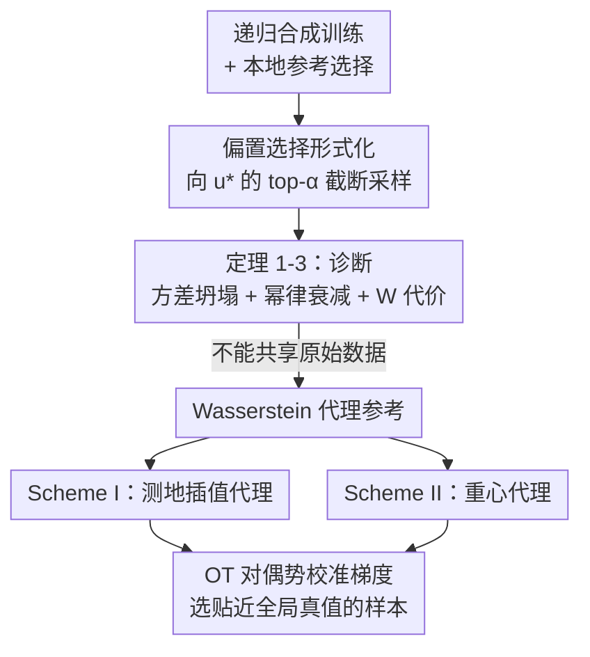

# When Sample Selection Bias Precipitates Model Collapse

**会议**: ICML 2026  
**arXiv**: [2606.13732](https://arxiv.org/abs/2606.13732)  
**代码**: 待确认  
**领域**: 学习理论 / 模型坍塌  
**关键词**: 模型坍塌, 数据选择偏置, 数据孤岛, Wasserstein 几何, 合成数据

## 一句话总结
本文证明在低资源、数据孤岛场景下，被广泛当作「模型坍塌解药」的数据选择反而会加速坍塌——每个验证器只看到目标流形的局部偏置切片，会优先保留贴近本地参考的样本、剪掉全局相关的尾部模式，理论上把方差以幂律速率压成点质量；作者据此提出用多孤岛构造 Wasserstein 代理参考（测地插值 / 重心）在不共享原始数据的前提下做协作选择来缓解。

## 研究背景与动机

**领域现状**：生成模型在自身合成数据上递归训练已成常态，但会引发**模型坍塌**（model collapse）——反复训练侵蚀分布尾部、输出同质化。具体表现为：随代数增加，分布方差收缩、合成分布与真实分布的 Wasserstein 距离发散。社区共识是用**数据选择**（过滤掉低质量合成样本）来稳定递归训练；理想验证器存在时，递归训练甚至能超过只用真实数据的模型。

**现有痛点**：数据选择的可靠性，**关键取决于验证器所用的参考分布**。在低资源数据孤岛（医院联盟、金融机构等隐私受限、原始数据不能汇聚的场景）里，每个验证器只能在全局分布的局部、碎片化、有偏切片上工作。此时被选中的合成数据反映的是验证器有限的本地先验，而非全局多样性。

**核心矛盾**：选择本身变成了「偏置过滤器」——它优先保留贴近本地流形的样本，剪掉全局相关但本地欠表示的尾部模式。于是选择从「防坍塌的护栏」变成「促坍塌的机制」。这与基于人类偏好的数据筛选导致多样性收缩同源，但这里是被环境约束**被动驱动**的，而非主动的偏好策划。

**本文目标**：(Q1) 从理论上刻画孤岛式偏置选择如何加速坍塌、坍塌以什么速率发生、对下游泛化有多大代价；(Q2) 在不能共享原始数据的硬约束下，给出可缓解的初步方案。

**核心 idea**：把偏置选择形式化为「向某个理想目标 $\mathbf{u}^*$ 的 top-$\alpha$ 截断采样」，证明它在 Accumulate 范式下也会把方差压成幂律衰减的点质量；再用 Wasserstein 几何（测地插值、重心）让多个孤岛在不交换原始数据的前提下合成一个「更接近全局真值」的代理参考，把单一偏置参考换成集体参考。

## 方法详解

### 整体框架
本文是「理论诊断 + 几何解法」两段式。前半（第 3 节）在多元高斯框架里给出三个定理，证明孤岛偏置选择会加速坍塌、给出幂律衰减率、并量化下游 Wasserstein 泛化代价；后半（第 4 节）给出补救方案：用 Wasserstein 测地插值（Scheme I）或重心（Scheme II）构造代理参考，让多孤岛协作打分而不共享原始数据，再用基于 OT 对偶势的校准梯度挑出贴近全局真值的样本。

### 关键设计

**1. 把偏置选择形式化为「向理想目标的 top-α 截断采样」**

要分析「本地参考有偏」这件事，先得有个可处理的数学抽象。作者用一个在目标态 $\mathbf{x}=\mathbf{u}^*$ 附近**局部凹**的打分函数 $U(\mathbf{x})$ 刻画选择机制（Assumption 1），它能统一覆盖两类偏置来源：环境约束（被迫只能用本地目标 $\mathbf{u}^*$，如按到真实特征质心/协方差的距离剪枝）与主动偏好策划（Best-of-N 等向偏好目标筛选）。在第 $t$ 代，定义一个包住 $\mathbf{u}^*$ 的高效用邻域 $\mathcal{R}_t$，动态校准为选当前采样分布 top-$\alpha$ 概率质量（$\alpha=n/N$ 是过滤预算）。于是被选数据服从**截断多元正态** $\mathcal{TN}(\bar{\bm\mu}_{t-1},\bar{\bm\Sigma}_{t-1},\mathcal{R}_t)$。这个抽象抓住了各类偏置选择的共同内核：优先保留贴近某个理想态的样本。

**2. 三个定理：证明偏置选择加速坍塌、给出幂律速率与下游代价**

这是全文的理论骨架。**Theorem 1（偏置选择促坍塌）**：在 Accumulate 范式（本应保证稳定、方差不发散）下叠加 top-$\alpha$ 偏置选择后，均值会对齐到目标 $\|\bar{\bm\mu}_t-\mathbf{u}^*\|^2\xrightarrow{a.s.}0$、方差却不可逆地坍缩 $\bar{\bm\Sigma}_t\xrightarrow{a.s.}\mathbf{0}$，Wasserstein-2 距离收敛到 $\|\mathbf{u}^*-\bar{\bm\mu}_0\|^2+\text{Tr}(\bar{\bm\Sigma}_0)$。即「忠于孤岛」被转化成「多样性丧失」。**Theorem 2（坍塌速率）**：把选择标准化到各向同性坐标后，证明方差以**幂律**衰减 $\text{Tr}(\bar{\bm\Sigma}_t)=\mathcal{O}_{a.s.}(t^{-\psi})$，其中 $\psi$ 来自耗散矩阵 $\bm\Psi_{t-1}=\mathbf{I}_d-(\mathbf{B}_{t-1}+\mathbf{a}_{t-1}\mathbf{a}_{t-1}^\top)$ 的谱隙，呈两阶段动态：先快速同质化、后缓慢渐近收敛到 Dirac 点质量。**Theorem 3（Wasserstein 泛化代价）**：在标准 Lipschitz/交叉-Lipschitz 正则条件下，真值流形上的期望风险被界为 $\mathcal{R}_{\mathcal{D}^*}(h_t;g^*)\le 2\ell\epsilon\,\mathbb{W}_p(\mathcal{D}_t,\mathcal{D}^*)+\mathcal{R}_{\mathcal{D}_t}(h_t;g_t)+\mathcal{O}(\ell\delta)$，当模型在本地数据上拟合良好时第二项可忽略，泛化主要被「过滤分布与真值分布的 Wasserstein 距离」主导——这正说明接触全局真值理论上能避免坍塌，但孤岛场景下无法接触，构成困境。

**3. Scheme I — 协作测地插值代理：不共享原始数据也能算选择梯度**

诊断指明出路是「拓宽选择标准，从单一目标 $\mathbf{u}^*$ 扩到多目标」。本方案的核心机制是用 OT 对偶势构造**校准梯度**作打分：对合成集 $\mathcal{P}$ 和参考集 $\mathcal{Q}_k$，Wasserstein 距离的最优对偶势 $f^*$ 就是传输代价对概率质量的次梯度，于是样本得分 $\mathcal{S}_k(x_i)=f^*(x_i)-\frac{1}{N-1}\sum_{j\ne i}f^*(x_j)$；正分表示删掉它能减小总差异、该剪，负分该留。但直接把合成数据 $\mathcal{P}$ 发给各方有隐私泄露风险。作者利用 Wasserstein 测地线性质（Property 3：$\mathbb{W}_p(\mathcal{P},\mathcal{Q})=\mathbb{W}_p(\mathcal{P},\xi^*)+\mathbb{W}_p(\xi^*,\mathcal{Q})$）构造一个落在 $\mathcal{P}$ 与 $\mathcal{Q}_k$ 测地线上的插值代理 $\xi_k^*$，证明 $\nabla_\mathcal{P}\mathbb{W}_p(\mathcal{P},\mathcal{Q}_k)\approx\nabla_\mathcal{P}\mathbb{W}_p(\mathcal{P},\xi_k^*)$，从而用代理就能算出 $\mathcal{S}_k(x_i)$ 而无需触碰真实数据 $\mathcal{Q}_k$。多方打分后，把选择写成**单调子模最大化** $\max_{|\mathcal{I}|\le n}\sum_k g(\sum_{i\in\mathcal{I}}(1-\tilde{\mathcal{S}}_k(x_i)))$（$g$ 取 $\log(1+z)$ 之类凹函数惩罚冗余），贪心算法即享 $(1-1/e)$ 近似保证。缺点是 $\mathcal{P}$ 一变就要重算插值。

**4. Scheme II — 协作 Wasserstein 重心代理：把代理与候选解耦、可复用**

Scheme I 不可扩展（合成池一改就全量重算）。本方案据 Theorem 3「若过滤分布逼近真值则可缓解坍塌」，直接去估计真值的代理——**多方真实分布的 Wasserstein 重心** $\mathcal{Q}^*=\arg\min_{\mathcal{Q}}\sum_k\lambda_k\mathbb{W}_p^p(\mathcal{Q},\mathcal{Q}_k)$。中心服务器迭代：广播当前重心估计 $\xi^{(r)}$，每方算本地分布与之的测地插值 $\xi_k^{(r)}$ 回传，服务器按 $\xi^{(r+1)}=\sum_k \frac{1}{K}\xi_k^{(r)}$ 更新。Theorem 5 证明 Fréchet 方差序列单调不增、收敛到重心。关键优势是**把代理估计与合成候选解耦**：重心只依赖本地真实分布、与合成候选规模 $N$ 无关；一旦得到，给新合成池打分只需一次 Sinkhorn 前向（$\mathcal{O}(LNS)$）。在迭代式合成数据生成里，$\mathcal{P}$ 变化时 Scheme II 可复用重心、Scheme I 必须重算插值——这使得随客户端数 $K$ 增长 Scheme II 在并行设定下几乎保持平坦。

### 损失函数 / 训练策略
本文不训练新生成模型，核心「训练策略」是改造递归训练里的**选择环节**：用 Sinkhorn-based OT 计算对偶势/重心，把单孤岛偏置打分换成多孤岛协作打分。复杂度（Theorem 6）：Scheme I 为 $\mathcal{O}(RL(N+M+S)S+nNK)$，Scheme II 为 $\mathcal{O}(TLMS+LNS)$，二者随 $N,M$ 近线性，Scheme II 随 $K$ 几乎不变。

## 实验关键数据

### 主实验
在 DDPM 上跑 CIFAR-10 / STL-10 / CelebA，采用 Accumulate-Subsample 范式（从 $N=4n$ 候选选 $n$），用 ExDir$(1,0.1)$ 非 IID 划分把真实数据分给 10 方当本地参考，10 代迭代后用 FID（质量）、Precision（保真）、Recall（多样性）评测。

| 方法 | CIFAR-10 FID↓ | CIFAR-10 Recall↑ | STL-10 FID↓ | CelebA FID↓ |
|------|--------------|------------------|-------------|-------------|
| Random | 106 | 0.48 | 95 | 96 |
| K-means | 102 | 0.40 | 89 | 87 |
| CenterMatch | 116 | 0.35 | 111 | 87 |
| CovMatch | 115 | 0.47 | 131 | 92 |
| **Scheme II（重心）** | 85 | 0.57 | 69 | 75 |
| **Scheme I（插值）** | **71** | **0.58** | **65** | **69** |

### 诊断与坍塌动态

| 实验 | 关键发现 | 说明 |
|------|---------|------|
| 多元高斯模拟（Fig 1） | Replace 快速方差耗尽；Accumulate+选择呈幂律衰减 | 实证 Theorem 1/2：先快速坍塌、后渐近拖尾 |
| 单类参考（仅 Airplane，Fig 5 左） | 各类比例随代数迅速向 Airplane 倾斜 | 偏置本地先验导致多样性快速崩溃、同质化 |
| 非 IID vs IID（Fig 5 中/右） | 选择基线在 IID 下能缓解坍塌，非 IID 下竟落后 Random | 偏置参考让「选择」反成促坍塌机制 |

### 关键发现
- **选择基线在非 IID 孤岛下反不如随机选**，这是全文最反直觉、也最有力的实证：本应防坍塌的选择，在偏置参考下加速了坍塌。
- 人脸（CelebA）上各基线表现相对更好，因为人脸数据高度结构化，即便参考有偏，过滤后图像仍保留基本特征——说明偏置选择的危害在「尾部丰富、结构松散」的数据上更致命。
- Scheme I 通常最好但不可扩展（候选变就重算）；Scheme II 略逊一筹却可复用、随客户端数几乎零增长，是工程上的更优解。

## 亮点与洞察
- **把「数据选择是解药」这一共识反转**：在低资源/孤岛/非 IID 下，选择因参考有偏而成为促坍塌机制——这个「护栏变陷阱」的论点配上「非 IID 下选择不如随机」的实证，非常有冲击力。
- **用 Wasserstein 测地线/重心做隐私保护的协作选择**：核心是「从协作学习转向协作评估」——不共享原始数据、不汇聚模型，只共享测地线上的中间插值，把单孤岛偏置参考换成多孤岛集体参考。
- **幂律坍塌率 $\mathcal{O}(t^{-\psi})$ 的两阶段刻画**很有解释力：先快速同质化、后缓慢趋向 Dirac，定量化了「越严格对齐本地目标、耗散越大」的张力。

## 局限与展望
- 理论核心定理（Theorem 1/2）建立在多元高斯/局部凹打分/局部吸引盆假设上，真实高维多模态数据是否仍严格服从幂律坍塌，存疑（⚠️ 以原文为准）。
- 作者自承：若协作代理被多数恶意节点投毒/带偏，选择机制可能强化的是「集体偏置」而非真值，需要治理保证参与方足够多样；对抗攻防被明确划到本文范围之外。
- 方案被定位为「初步缓解」（initial mitigation），主实验局限于图像生成 + DDPM，语言模型等其它模态、更大规模下的有效性尚未验证。

## 相关工作与启发
- **vs 基于人类偏好的数据策划（Ferbach 2024；Wei & Zhang 2025）**：他们刻画偏好优化导致方差消失/偏置放大，本文是同源现象但**被动**由环境约束（孤岛碎片化访问）驱动，且不可用现成的偏好去偏技术缓解，因为偏置是「碎片化访问全局分布」的内在后果。
- **vs CenterMatch / CovMatch / K-means 等选择基线**：它们都向「本地真实特征的质心/协方差」筛选，本文证明这类本地参考选择在非 IID 下反而促坍塌，并用多孤岛重心/插值代理替换单一本地参考。
- **vs 影响函数式对抗策划（Wei & Zhang 2025）**：IF 依赖无穷小扰动的线性近似，本文用离散 Wasserstein 的 LP 对偶（Sensitivity Theorem）让梯度在局部多面体内严格有效，无需重算即可预测重加权对 W 距离的影响。

## 评分
- 新颖性: ⭐⭐⭐⭐⭐ 反转「选择=解药」共识，把孤岛偏置选择会促坍塌讲成定理 + 给出隐私保护协作评估方案，角度新。
- 实验充分度: ⭐⭐⭐⭐ 三数据集 + IID/非 IID 对照 + 高斯模拟 + 复杂度分析，证据较全，但限于图像/DDPM。
- 写作质量: ⭐⭐⭐⭐ 理论—实证—方案三段清晰，Wasserstein 几何铺陈完整，但定理密度高、对读者门槛不低。
- 价值: ⭐⭐⭐⭐ 对隐私受限、低资源的递归合成数据管线给出明确警示与可落地的协作选择方案。

<!-- RELATED:START -->

## 相关论文

- [\[ICML 2026\] Active Learning with Low-Rank Structure for Data Selection](active_learning_with_low-rank_structure_for_data_selection.md)
- [\[NeurIPS 2025\] Sample-Adaptivity Tradeoff in On-Demand Sampling](../../NeurIPS2025/learning_theory/sample-adaptivity_tradeoff_in_on-demand_sampling.md)
- [\[ICML 2026\] Correcting Split Selection in Online Decision Trees via Anytime-Valid Inference](correcting_split_selection_in_online_decision_trees_via_anytime-valid_inference.md)
- [\[ICML 2026\] Optimal Design for Multinomial Logit Model with Applications to Best Assortment Identification](optimal_design_for_multinomial_logit_model_with_applications_to_best_assortment_.md)
- [\[ICML 2026\] Cutting LLM Evaluation Costs with SySRs: A Bandit Algorithm that Provably Exploits Model Similarity](cutting_llm_evaluation_costs_with_sysrs_a_bandit_algorithm_that_provably_exploit.md)

<!-- RELATED:END -->
