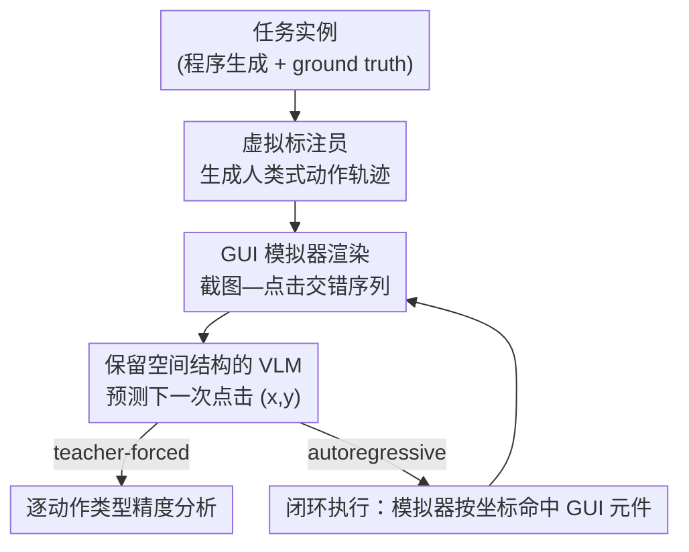

# A Systematic Study of Behavioral Cloning for Scientific Data Annotation

**会议**: ICML2026  
**arXiv**: [2606.07568](https://arxiv.org/abs/2606.07568)  
**代码**: 待确认  
**领域**: LLM Agent / 行为克隆 / GUI 智能体  
**关键词**: 行为克隆, 科学数据标注, GUI 智能体, 合成基准, 线性探针

## 一句话总结
这篇论文搭了一个由 9 个程序化合成标注任务 + 虚拟标注员组成的受控框架，系统研究「行为克隆」（让 VLM 直接模仿人类在标注界面里点击、导航、撤销的完整操作轨迹）能否替代「直接预测标签」，并通过训练动态、缩放规律、迁移能力和线性探针四个维度，揭示了技能分层涌现、模型比训练数据更少犯错却仍会纠错、多任务预训练才能迁移、以及跨任务共享的「出错」内部表征等一系列发现。

## 研究背景与动机
**领域现状**：科学数据标注（在行为视频里追踪动物、校对神经元三维重建）长期被「最后一公里」问题卡住——即便自动化算法已经把大部分标注做对，人类仍要逐个找出并修正剩余错误。论文举的极端例子是：连接组学里校对一个果蝇脑，即使用上最强的自动分割，仍花了 33 人年。

**现有痛点**：绝大多数 ML 方法把标注当成「数据 → 标签」的直接映射，只优化最终输出精度。但人类标注其实是一段交互式工作流：专家会浏览数据、在界面里点击/编辑、对不确定的地方反复核验、发现错了就撤销重来。这些动作序列里蕴含了「高质量标注是怎么一步步产生的」这种过程性监督信号，而直接预测把它们全扔了。

**核心矛盾**：行为克隆（BC，让模型模仿人类动作）本可以利用这种轨迹监督，在自动驾驶、玩游戏的 agent 上都很成功，但它在科学标注上几乎没人系统研究过——障碍是实践性的：采集行为数据需要插桩界面、没有长程标注会话的标准基准、科学家也不愿从主业里抽时间。结果是 ML 研究者和领域科学家都答不出最基本的问题：让模型学会一套标注流程到底有多难？数据给够了还剩什么挑战？是什么让某些任务比别的更难？

**本文目标**：把上面这些问题变成可量化、可控的实验，回答「BC 在科学标注上学什么、怎么学、瓶颈在哪」。

**切入角度**：既然真实行为数据难采，那就用**合成**。作者程序化生成 9 个标注任务的数据 + 模拟真实人类策略的虚拟标注员，从而能任意放大训练数据量、系统调节任务难度、隔离各个变量去研究失败模式——这是真实数据采集做不到的。

**核心 idea**：把「人类标注会话」（截图与点击交错的序列）当成行为克隆的训练对象，用一个保留空间结构的 VLM 直接预测「下一步点哪里」，并借助合成框架把行为克隆的训练动态、缩放、迁移、内部表征彻底剖开。

## 方法详解

### 整体框架
框架的输入是一段「截图—点击」交错的序列 $(\text{img}_0, \text{click}_0, \text{img}_1, \text{click}_1, \ldots)$，输出是模型在每一步对「下一次点击坐标 $(x,y)$」的预测；闭环评测时这个点击被送回 GUI 模拟器真正执行，再产生下一张截图，如此循环到任务完成。整条管线把三件事拆开来分别控制：**世界里有什么**（带 ground truth 的任务实例）、**人会怎么标它**（动作序列）、**界面怎么渲染**（GUI 截图）。这种解耦让作者能独立调节任务难度、标注行为和错误率。

### 关键设计

**1. 虚拟标注员：把人类标注策略程序化，制造过程性监督**

直接预测之所以丢监督，是因为它只看最终标签；本文反过来把「人是怎么标的」也合成出来。给定一个带 ground truth 的任务实例，虚拟标注员会生成包含四类行为的真实动作序列：**导航**（翻 z 切片、旋转 3D 视角、切换光谱通道）、**放置**（点击放标记点、画多边形、选物体）、**核验**（切换视图或回访之前位置来检查）、以及**犯错与纠正**（按任务设定模拟 10–30% 的放置错误，紧跟一个撤销动作）。关键就在最后这类：训练数据里故意保留「错—撤销」模式，让模型有机会学到错误恢复策略。作者还拿 Colored Dot Tracking 任务对照了 4 位真人标注员，虚拟标注员的导航/放置/纠错率都落在真人区间内，说明这套程序化行为不是凭空捏造。

**2. 画布点击的统一动作空间：一个输出头吃下所有动作类型**

一个动作就是画布坐标 $(x,y)$ 上的一次点击；模拟器拿到坐标后做命中测试，落在哪个 GUI 元件上就触发对应行为（+z、undo、done、某个类别选择器），或记录成一次画布放置。模型只有**单一输出头**——对 $x$ 和 $y$ 各自输出一个独立分布——它涵盖了所有动作类型，模型自己并不能指定动作类型，只能学「该点哪里」。这个设计是刻意的：任何带可点击元件的工具都能直接被包进来，不用改模型结构或训练目标，也让评测变干净（动作类型由坐标决定，逼着模型真正学会空间定位而非投机选类型）。

**3. 保留空间结构的轻量 VLM：让像素级预测在长会话里训得动**

标注要求像素级精确，但现成 VLM 处理长会话会爆显存（论文提到 Qwen3-VL-4B 在 20 帧时就超过 80 GB）。本文用一个冻结的 DINOv2 视觉编码器从每帧抽 patch token、空间池化到 $12\times 9=108$ 个 token，再接一个 transformer 头，用**块因果注意力**处理序列：每帧内部的 patch 之间双向、跨帧之间因果。这样既保住了像素预测必需的空间结构，又把序列压到可训练的规模。作者训了 25M 到 320M 四种尺寸专门研究缩放。

**4. 双模式评测：teacher-forced 拆技能 + autoregressive 测闭环**

为了既能细粒度诊断又能测真实能力，作者用两种评测。**Teacher-forced** 给定 ground-truth 历史、只测下一动作预测精度，好处是没有误差累积，能按动作类型（放置、撤销、done、导航）分别看模型学到了什么。**Autoregressive** 则让模型在 GUI 模拟器里闭环跑：模型从截图预测点击、模拟器通过 JavaScript 接口执行、循环到完成或超时。两者结合才能区分「模型会不会」和「模型用不用」——这正是后面最反直觉发现的关键。

### 损失函数 / 训练策略
训练目标就是对人类动作的最大似然（行为克隆的标准监督），模型对每步的 $x$、$y$ 坐标各自做分类/回归。多任务设置是把 9 个任务的轨迹混在一起联合训练；下游适配则用预训练模型在新任务上少量微调。主多任务实验在 4×A100 上约 2 天，全部缩放与消融加起来约 1 周 4×A100。

## 实验关键数据

### 主实验
作者训练四种尺寸模型，在 9 个任务上联合做行为克隆，并测下游迁移与对比 VLM baseline。

| 评测设置 | 本文 95M BC 模型 | 对比方 | 结论 |
|--------|------|----------|------|
| Colored Dot 放置精度 @5px (teacher-forced) | 97.4% | Gemini 3 Flash 80.0% / Qwen3-VL-32B 25.0% | 小专用模型大幅胜过通用大 VLM |
| 9 任务闭环成功率 (autoregressive) | 多数任务成功 | Gemini 成功 3/9，Qwen 成功 0/9 | 通用 VLM 在闭环长程标注上几乎不行 |
| 新任务 Shape Matching 微调 (500 序列) | 76.6% | 从零训练 7800 序列 → 0% | 多任务预训练带来可迁移表征 |
| 真实 EM 神经元追踪 (H01 人脑皮层) | 95.1% 骨架精度 | — | 微调后达人类级，100% 完成率 |

### 消融实验

| 适配方式 | 准确率 | 说明 |
|------|---------|------|
| 多任务预训练 + 微调 (500 序列) | 76.6% | 在 500 序列就饱和 |
| 从零训练 (7800 序列) | 0% | 数据多 15 倍仍完全失败 |
| 零样本 / 少样本 in-context | ~0% | 上下文示例无法诱导适配 |
| β-DAgger (两个失败任务) | 仍失败 | 说明是任务本身难，而非误差累积 |

### 关键发现
- **技能分层涌现**：GUI 机制（点按钮、放标记）先学会，task-critical 决策（何时撤销、何时 done）后学会；撤销精度涌现最晚但最终逼近 100%，说明模型确实学会了识别并纠正错误。
- **模型比训练数据更少犯错、却仍会纠错**：训练数据里 9.2% 的放置动作含「错—撤销」，但生成时模型只在 1.0% 时犯错、0.7% 用撤销——这是模型「弱化少数类」的已知偏差，等于学会了「跳过犯错—纠正」模式；然而 teacher-forced 下一旦被强行置入错误状态，模型几乎 100% 触发撤销。即模型**会纠错但选择不犯错**。
- **缩放与迁移**：参数大 10× 约带来 3× 的样本效率提升（更大模型更省数据）；等损失下，小模型在决策动作上反而略好，作者猜测小模型被迫压缩信息、学到更抽象可迁移的决策因子。多任务预训练能靠微调迁移，但 in-context learning 完全失败（可能因任务多样性只有 9 个）。
- **共享出错表征**：在残差流 [cls] 位置训线性探针，单任务出错探针 0.92 ROC AUC、9 任务合池 0.87；留一任务交叉验证平均迁移 0.71，8/9 任务高于随机，唯独 3D Exploration 只有 0.29（因为它的错误是分类错而非空间放置错，被编码到相反方向）。说明存在一个部分通用的「哪里不对了」表征，但它特指放置型错误。

## 亮点与洞察
- **用合成数据把行为克隆「拆开看」**：靠程序化任务 + 虚拟标注员，作者能任意放大数据、隔离难度变量，从而研究真实数据根本采集不起的训练动态——这套「合成元 + 受控变量」的研究范式可直接迁移到任何长程交互式任务。
- **「会纠错但不犯错」是最反直觉的发现**：它揭示了最大似然训练的系统盲点——稀有但关键的动作（纠错）被频率压低。这提示用「按动作重要性而非频率加权」的损失，或对关键决策点过采样，可能补上这个短板。
- **画布点击统一动作空间是个好工程抽象**：把所有动作压成「点哪里」，让任何可点击工具零改造接入，并让评测无法靠投机取巧——值得借鉴到通用 GUI agent。
- **从合成迁移到真实 EM 追踪打通了闭环**：微调后在 H01 人脑皮层达 95.1% 骨架精度、C. elegans 89.4%，说明「合成预训练 + 少量真实微调」是务实可行的落地路径。

## 局限与展望
- 缩放结论只在 25M–320M 范围成立、未推到前沿规模，「小模型决策更好」这一发现尤其是 scope-limited 的。
- 动作空间只限画布点击（为通用性刻意如此），排除了键盘快捷键、滚动、徒手描边等某些标注工具依赖的模态。
- 除 DAgger 外没探索基于奖励的 RL，而 reward shaping 可能正好解决稀有动作被低估的问题；in-context learning 完全失败，如何为程序化任务诱导 ICL 仍是开放问题。
- 架构内存开销大、限制了上下文长度，需要更高效的替代方案。

## 相关工作与启发
- **vs 直接预测（flood-filling、追踪算法、姿态估计）**：它们只学「数据→标签」，丢掉了导航/核验/纠错的过程监督；本文学完整标注会话的动作轨迹，能利用这层监督。
- **vs SAM / PseudoClick（交互式分割）**：它们建模单次点击细化、马尔可夫式单图设定；本文建模的是带序列依赖的整段长程标注会话。
- **vs VPT（Minecraft 行为克隆）**：方法论最接近，VPT 把 BC 用在游戏录像上；本文把它适配到科学标注，并用合成数据弥补大规模行为数据集的缺失。
- **vs RLCorrector**：它用强化学习从奖励里学纠错策略；本文从标注轨迹做行为克隆，不依赖奖励设计。

## 评分
- 新颖性: ⭐⭐⭐⭐⭐ 把行为克隆系统引入科学标注，并用合成框架做受控研究，是少有人碰的角度
- 实验充分度: ⭐⭐⭐⭐⭐ 训练动态、缩放、迁移、探针四维度 + 真实 EM 落地，覆盖很全
- 写作质量: ⭐⭐⭐⭐ 发现密度高、逻辑清晰，但图表信息量大、需对照附录
- 价值: ⭐⭐⭐⭐⭐ 给「BC 用于科学标注」立了基准和现实预期，破解了领域的集体行动困境

<!-- RELATED:START -->

## 相关论文

- [\[AAAI 2026\] Towards Trustworthy Multi-Turn LLM Agents via Behavioral Guidance](../../AAAI2026/llm_agent/towards_trustworthy_multi-turn_llm_agents_via_behavioral_guidance.md)
- [\[ICML 2026\] Towards Diverse Scientific Hypothesis Search with Large Language Models](towards_diverse_scientific_hypothesis_search_with_large_language_models.md)
- [\[ICML 2026\] Think Twice Before You Act: Enhancing Agent Behavioral Safety with Thought Correction](think_twice_before_you_act_enhancing_agent_behavioral_safety_with_thought_correc.md)
- [\[ACL 2025\] An Empirical Study on LLM-based Agents for Automated Bug Fixing](../../ACL2025/llm_agent/an_empirical_study_on_llm-based_agents_for_automated_bug_fixing.md)
- [\[ACL 2026\] ImplicitMemBench: Measuring Unconscious Behavioral Adaptation in Large Language Models](../../ACL2026/llm_agent/implicitmembench_measuring_unconscious_behavioral_adaptation_in_large_language_m.md)

<!-- RELATED:END -->
