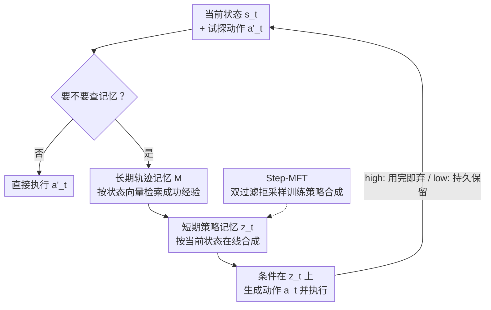

# AdaMEM: Test-Time Adaptive Memory for Language Agents

**会议**: ICML 2026  
**arXiv**: [2606.05684](https://arxiv.org/abs/2606.05684)  
**代码**: https://github.com/yunx-z/AdaMEM  
**领域**: Agent  
**关键词**: 语言智能体, 测试时自适应, 智能体记忆, 策略合成, 拒绝采样微调

## 一句话总结
AdaMEM 把智能体记忆拆成「离线存的长期轨迹记忆 + 在线现合成的短期策略记忆」两层，让智能体在长程任务执行到一半时还能随当前状态动态刷新指导策略，配合一个只保留「真正改变了动作」的策略的微调技术 Step-MFT，在 ALFWorld、WebShop、HotpotQA 上相对静态记忆基线最高拿到 13~17% 的相对提升。

## 研究背景与动机
**领域现状**：让语言智能体「从过去经验里学、并适应新情况」是长期目标。当前主流是 *training-free* 的提示自适应——不更新参数，而是用智能体记忆机制（agent memory）把过去成功轨迹检索出来塞进系统提示，典型如 Synapse（检索整条原始轨迹当 in-context 示例）和 ReasoningBank（把轨迹离线蒸馏成高层策略）。

**现有痛点**：这些系统几乎都只在 **episode 开始那一刻**（$t=0$）检索一次记忆。一旦检索完，整条长程任务里智能体就被钉死在这份「开局指导」上。问题是开局状态往往信息很少（比如 WebShop 的首页就是个空壳），此时检索到的轨迹很可能是噪声；而且随着任务推进、子目标漂移、中途失败，这份静态指导会越来越不对路，却没有任何机制纠偏。论文实测里这种「负迁移」很真实：Synapse / ReasoningBank 在 WebShop 上反而比无记忆的 ReAct 低了 6.0 / 2.8 分。

**核心矛盾**：记忆的「存储」和「抽象」被耦合在了一起——要么存原始轨迹（信息全但冗长、塞多了 context 爆炸），要么离线蒸馏成固定策略（精炼但僵化、不随测试状态变）。两者都无法在 episode 内部、针对当前这一步给出新鲜、具体的指导。

**本文目标**：拆成两个子问题——(1) 怎么让记忆突破「静态一次性检索」的僵化，在推理过程中持续自适应？(2) 怎么高效训练模型去合成那些真正驱动决策的策略？

**核心 idea**：把存储和抽象解耦。长期记忆只负责离线囤原始成功轨迹；短期记忆在测试时**现场、按当前状态合成**一条简短自然语言策略来指导下一个动作，用完即弃或按需保留。再用「策略有没有改变动作」当一个零成本的过程级信号去微调策略生成能力。

## 方法详解

### 整体框架
AdaMEM 的核心是一个**非参数自适应机制**：智能体维护一个静态的原始经验池 $\mathcal{M}$，但在每个关键决策步现场生成一条状态相关的策略 $z_t$ 来引导决策，全程不改模型参数。一次决策的流转是：当前状态 $s_t$ →（智能体先出一个试探动作 $a'_t$ 并判断要不要查记忆）→ 若要，则用 $s_t$ 去长期轨迹记忆里检索相似的成功经验 $\mathcal{E}_{\text{ret}}$ → 把这些经验在线合成为简短策略 $z_t$ → 条件在 $z_t$ 上生成精炼后的真实动作 $a_t$ 并执行。

整套机制有两层记忆 + 两种推理模式 + 一个可选的微调技术。下面分别讲。

### 关键设计

**1. 长期轨迹记忆 $\mathcal{M}$：离线囤原始成功经验，按状态稠密检索**

针对「离线蒸馏成固定策略太僵化」这个痛点，AdaMEM 反其道而行：长期记忆里**不存蒸馏后的策略，只存原始轨迹**，把「抽象」推迟到测试时再做。一条轨迹定义为 $\tau=\{(s_1,a_1,r_1),\dots,(s_T,a_T,r_T)\}$。由于 LLM 智能体任务普遍是稀疏奖励（只在 episode 结尾给成败信号），$\mathcal{M}$ 只收**最终成功**（$r_T=1$）的轨迹。为支持稠密检索，对成功轨迹里的每一步 $t$ 存一个键值对：

$$k_i=\phi(s_t),\quad v_i=(s_t,a_t,\tau_{t+1:T})$$

键是状态嵌入 $\phi(s_t)$（用预训练 embedding 模型），值里不仅有当前状态和动作，还有**通向最终成功的后续整段轨迹** $\tau_{t+1:T}$。这样检索回来的就是「在相似历史状态下，成功决策是怎么一路走下去的」实证示范。这种「存储与抽象解耦」还带来一个意外好处——长期记忆可以由别的模型（甚至别的模型家族）离线构建，而短期策略始终由当前策略模型在线合成，从而支持跨模型泛化（off-policy 设定下 Gemma 用 Qwen 造的记忆库照样涨分）。

**2. 短期策略记忆 $z_t$：在线、按当前状态合成的一次性指导**

光检索回原始轨迹还不够——直接把一堆冗长日志喂给策略，既占 context 又难以对齐当前这一步。AdaMEM 在测试时**不直接用 $\mathcal{M}$**，而是把检索到的经验在线合成为一条简短的自然语言策略 $z_t$，专门给「选下一个动作」当具体指导。关键区别在于：ReasoningBank 的策略是**离线预生成、只基于过去经验**；而 $z_t$ 是**在线生成、显式条件在当前状态 $s_t$ 上**，保证指导贴合测试环境此刻的动态。消融实验印证了这层抽象不可省：去掉短期策略、把检索到的原始日志直接喂给策略，虽然每步 token 从 6.0K 降到 3.8K，但 ALFWorld 成功率从 65.5% 掉到 59.3%——压缩成精炼策略带来的收益盖过了多花的生成开销。

**3. 两种自适应强度：high 每步重生成 vs. low 按需刷新**

策略的「生命周期」天然是一个调节「新鲜度 vs. token 成本」的旋钮，AdaMEM 据此给出两档推理模式。**AdaMEM-high**（高自适应）：每步先出试探动作 $a'_t$ 和一个二元检索决策 $d_{\text{mem}}\in\{\text{yes},\text{no}\}$；若 yes 就检索、合成新策略 $z_t\sim\pi_\theta(z\mid s_t,\mathcal{E}_{\text{ret}})$、生成精炼动作 $a_t\sim\pi_\theta(a\mid s_t,z_t)$，且 $z_t$ **用完即从 context 丢弃**，下一步要指导就得重算。它 token 贵但最大化鲁棒性，永不依赖过期指导。**AdaMEM-low**（低自适应）：把 $z_t$ 当一个**持久状态变量** $z_{\text{curr}}$ 缓存在 context 里跨多步复用，每步预测试探动作和一个刷新决策 $d_{\text{refresh}}$；只有判定 yes（出现明显分布漂移）才检索并合成 $z_{\text{new}}$ 顶替旧策略。它显著省 token，把自适应成本摊薄到「真正需要更新时才付」。两档之间的连续过渡，正是论文宣称的「智能体记忆的新缩放维度」——多花测试时算力（提高刷新频率）能换来单调的性能提升。

**4. Step-MFT：只学「真改了动作」的策略，零成本做过程级信用分配**

纯提示往往合成出空泛、缺乏具体诊断的策略，需要训练来强化「能真正改善决策」的策略生成。难点在训练信号：标准的**结果导向过滤**（只要轨迹成功就认为其上所有策略都对）会把一堆「没起作用的废话策略」也当正样本，信用分配太粗；而精确估计策略优势又需要昂贵的蒙特卡洛 rollout 或专门的过程奖励模型。论文把策略当成高层动作，定义其**策略优势**（Strategy Advantage）为有无策略时成功率之差：

$$A(s,z)=V^{\pi_{\text{mem}}}(s)-V^{\pi_{\text{base}}}(s)$$

其中 $\pi_{\text{mem}}(\cdot)=\pi_\theta(\cdot\mid s,z)$、$\pi_{\text{base}}(\cdot)=\pi_\theta(\cdot\mid s)$。在贪心解码下 $V^\pi(s)=Q(s,\pi(s))$，于是 $A(s,z)=Q(s,a_t)-Q(s,a'_t)$；命题 3.1 由此论证：**若策略没改变动作（$a_t=a'_t$）则优势恒为 0**，因此「动作被改变」是策略优势严格为正的**必要条件**。Step-MFT 就用这个零成本代理做双过滤拒绝采样：(1) 轨迹必须成功 $r=1$；(2) 策略必须改变了智能体动作 $a_t\neq a'_t$（仅靠两个动作串的精确字面比对判断，开销可忽略）。过滤后的「银标」策略 $z^*$ 用标准 SFT 交叉熵训练：

$$\mathcal{L}_{\text{SFT}}=-\mathbb{E}_{(s,\mathcal{E},z^*)\sim\mathcal{D}^*}\big[\log\pi_\theta(z^*\mid s,\mathcal{E})\big]$$

数据用 AdaMEM-high 跑训练集采集（每步都评估瞬时策略，样本最稠密）。这个 filter 偏向精确率：宁可丢掉「baseline 本来也对」的样本，也要保证留下的全是真正驱动了成功决策的策略。微调后的统一模型记作 **AdaMEM-MFT**，策略合成和动作生成共用一个模型，不必额外部署 critic 或独立模型。

### 一个完整示例
以 WebShop 一次购物为例对比静态 vs. 动态记忆：episode 开局是信息贫瘠的首页 $S_0$。静态方法（Synapse/ReasoningBank）此刻就检索一次——但首页没什么可匹配的，于是拿到一堆噪声轨迹并钉死整局，最终比无记忆还低。AdaMEM-low 则先不急：开局直接出试探动作去搜索，等到了信息丰富的**搜索结果页**才触发刷新，用此刻的状态检索出真正相关的成功经验、合成一条「该按什么属性/价格筛选」的策略 $z_{\text{curr}}$，引导接下来几步下单；中途若子目标变了再刷新一次。正是这种「等到状态有信息了再检索、随状态漂移再刷新」，把静态方法的 −6.0 负迁移翻转成了 +2.8 的正收益。

## 实验关键数据

### 主实验
三个 benchmark：ALFWorld（具身家务，seen 140 / unseen 134，成功率%）、WebShop（电商，Task Score 0–100）、HotpotQA（多跳检索问答，跨 episode，成功率%）。骨干：ALFWorld/HotpotQA 用 Qwen3-4B-Instruct-2507，WebShop 用 RL 训练过的 Qwen2.5-7B。下表为 training-free 设定（3 次运行均值），AdaMEM 取 low 档：

| 记忆机制 | ALFWorld seen | ALFWorld unseen | WebShop |
|--------|------|------|------|
| No Memory (ReAct) | 45.2 | 46.8 | 71.4 |
| ReasoningBank（离线策略） | 49.3 | 51.2 | 68.6 |
| Synapse（原始轨迹） | 52.1 | 52.2 | 65.4 |
| **AdaMEM-low** | **54.0** | **58.2** | **74.2** |

HotpotQA（跨 episode 检索，Qwen3-4B）：No Memory 39.7 → Synapse 40.4 → ReasoningBank 40.5 → **AdaMEM 41.1**。在 unseen 泛化场景增益最猛：AdaMEM 比 No Memory 高 +11.4 分、比最强静态法 Synapse 高 +6.0 分，且**无需任何训练**。

### 消融实验
ALFWorld seen，用每步强制刷新的 AdaMEM-max 消除「何时刷新」的方差：

| 配置 | 成功率 | 每步 token | 说明 |
|------|---------|------|------|
| 完整 AdaMEM-max | 65.5 | 6.0K | 长期记忆 + 短期策略抽象 |
| w/o 短期策略记忆 | 59.3 | 3.8K | 直接喂原始日志、不合成策略，掉 6.2 分 |

Step-MFT 过滤策略对比（Fig.5）：WebShop 上仅按 Outcome Success 过滤反而把 AdaMEM-high 从 76.1 拉低到 73.9，而 Outcome+Action Change 的 Step-MFT 稳定 +1.3；ALFWorld 上 Step-MFT 比 AdaMEM-high 高 +5.3（54.5→59.8）。

### 关键发现
- **短期策略抽象是关键**：去掉它虽省 token 但掉 6.2 分；随检索预算 $k$ 从 1→16，AdaMEM 单调涨（54.0%→64.0%，+10），而 Synapse 因原始轨迹堆叠导致 context 溢出反而退化（52.1%→47.8%）。
- **动态时机纠正负迁移**：静态法在 WebShop 因开局检索噪声而低于无记忆基线，AdaMEM 靠中途触发把 −6.0/−2.8 翻成 +2.8。
- **结果级过滤有害**：naive outcome 过滤会把无效策略当正样本，必须叠加「动作改变」这个过程级信号；Step-MFT 也把刷新频率从 34%→36%(ALFWorld)、63%→74%(WebShop)，更敢于触发记忆生成。
- **效率**：合成简短策略而非处理冗长日志，使推理延迟比 Synapse 低 16%；AdaMEM 在「性能 vs. token」上建立了更优的 Pareto 前沿。

## 亮点与洞察
- **存储与抽象解耦**这个分层是真巧妙：既保留了原始轨迹的完整信息（不丢细节），又把「抽象成可执行指导」推迟到测试时按当前状态做（不僵化），还顺手解锁了 off-policy 跨模型记忆共享——一个设计吃下三个好处。
- **用「动作有没有改变」当过程奖励的代理**是全文最 aha 的点：它把「这条策略到底有没有用」这个本来需要昂贵 rollout / PRM 才能估计的过程级信用，化简成两个动作串的字面比对，几乎零成本，还有命题 3.1 的必要性证明兜底。这个思路可迁移到任何「中间产物（CoT/计划/工具调用）是否真正影响了最终决策」的信用分配场景。
- 把「记忆刷新频率」当成一个可连续调节的**测试时缩放维度**，给智能体记忆引入了类似 test-time compute scaling 的视角，low→high→MFT 单调换性能。

## 局限与展望
- 长期记忆只收**最终成功**轨迹（$r_T=1$），失败轨迹里的「该避什么坑」信息被完全丢弃；稀疏奖励、成功率本就很低的任务（如 4B 模型在 WebShop）甚至凑不出足够成功轨迹来填库，这也是 WebShop 不得不换 RL-7B 骨干的原因。
- Step-MFT 用「动作字面不同」判断策略是否起作用，是个偏保守的代理：它会漏掉「策略强化了同一个正确动作的信心」这类有用但没改动作的样本（偏精确率、牺牲召回），也可能被表面措辞不同、实质等价的动作误判。
- 作者把全 memory-augmented RL（用 GRPO 在线优化过程奖励）留作 future work，目前只做了离线 RFT；动态刷新决策本身（何时该 refresh）也还是靠提示判断，没有显式训练。
- 评测均为 text-only，未涉及真实多模态网页/具身环境的噪声。

## 相关工作与启发
- **vs Synapse**：都用原始轨迹做长期记忆，但 Synapse 把整条轨迹原样塞进 context 且只在开局检索一次——$k$ 一大就 context 溢出、还被无关内容干扰；AdaMEM 把检索经验在线压缩成简短策略并按需刷新，既不溢出又能随状态自适应。
- **vs ReasoningBank**：ReasoningBank 可看作 AdaMEM 的「静态特例」，两点僵化——策略离线预生成（非在线按当前状态合成）、检索限于 episode 开局（非中途动态）。AdaMEM 解除这两点，且策略由当前策略模型在线合成，避免了 off-policy 源模型预生成策略与推理智能体能力不匹配的问题。
- **vs MemRL / Agentic Memory 等混合记忆**：那些方法多用 RL 估计记忆效用、优化 inter-episode（跨任务）迁移，缺少 intra-episode（任务内）中途纠偏机制；AdaMEM 正是补上「检索到的先验在探索中途失效时怎么恢复」这一环。

## 评分
- 新颖性: ⭐⭐⭐⭐⭐ 「存储/抽象解耦 + 动作改变作过程奖励代理」组合新颖，且把记忆刷新提升为测试时缩放维度。
- 实验充分度: ⭐⭐⭐⭐ 三 benchmark、on/off-policy、$k$ 缩放、过滤消融都覆盖，但成功率绝对值偏低、骨干较小。
- 写作质量: ⭐⭐⭐⭐⭐ 动机—矛盾—方法逻辑链清晰，命题 3.1 把直觉形式化得干净。
- 价值: ⭐⭐⭐⭐ training-free 即可用、能跨模型共享记忆，对落地长程智能体有直接参考价值。

<!-- RELATED:START -->

## 相关论文

- [\[ICML 2026\] From Player to Master: Enhancing Test-Time Learning of LLM Agents via Reinforcement Learning over Memory](from_player_to_master_enhancing_test-time_learning_of_llm_agents_via_reinforceme.md)
- [\[NeurIPS 2025\] Agentic Plan Caching: Test-Time Memory for Fast and Cost-Efficient LLM Agents](../../NeurIPS2025/llm_agent/agentic_plan_caching_test-time_memory_for_fast_and_cost-efficient_llm_agents.md)
- [\[ACL 2026\] CLAG: Adaptive Memory Organization via Agent-Driven Clustering for Small Language Model Agents](../../ACL2026/llm_agent/clag_adaptive_memory_organization_via_agent-driven_clustering_for_small_language.md)
- [\[AAAI 2026\] Time, Identity and Consciousness in Language Model Agents](../../AAAI2026/llm_agent/time_identity_and_consciousness_in_language_model_agents.md)
- [\[NeurIPS 2025\] AgentTTS: Large Language Model Agent for Test-time Compute-optimal Scaling Strategy in Complex Tasks](../../NeurIPS2025/llm_agent/agenttts_large_language_model_agent_for_testtime_computeopti.md)

<!-- RELATED:END -->
