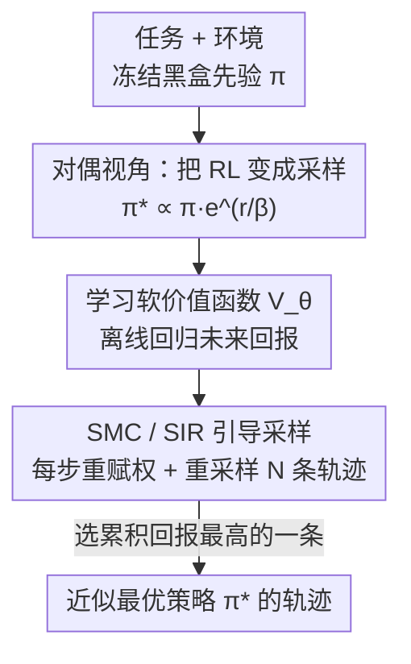

# Agentic Monte Carlo: Simulating Reinforcement Learning for Black-Box Agents

**会议**: ICML2026  
**arXiv**: [2606.05296](https://arxiv.org/abs/2606.05296)  
**代码**: https://github.com/layer6ai-labs/Agentic-Monte-Carlo  
**领域**: Agent / 强化学习 / LLM  
**关键词**: 黑盒 Agent, 序贯蒙特卡洛, 控制即推断, 价值函数, 测试时计算

## 一句话总结
把"对黑盒 LLM Agent 做 RL"重写成"从最优策略后验里采样"，用序贯蒙特卡洛（SMC）配一个轻量价值函数在测试时引导冻结的黑盒模型，不碰任何参数就实现 RL 式优化，在 AgentGym 三个环境上既超过 prompting 基线、又在放大测试时计算后反超需要全参数权限的 GRPO。

## 研究背景与动机
**领域现状**：LLM Agent 主流靠 RL 训练，PPO、GRPO 这类策略梯度方法对开源（白盒）模型非常有效，从数学推理到软件工程都能调出能力。

**现有痛点**：但策略梯度有个硬前提——要拿到模型参数才能算梯度。而今天最强的模型（GPT-5、Gemini 3、Claude 4.6 这类）几乎都只开放 API，是纯黑盒。想优化基于这些专有模型的 Agent，研究者只能退回到 prompt 工程，或者去微调一个更弱的开源替身，两条路都没在真正对目标黑盒模型做 RL。

**核心矛盾**：RL 的优化对象是"策略参数"，而黑盒场景下参数根本不可达。只要还把问题框成"优化参数"，黑盒就是死路。

**本文目标**：在不接触参数、甚至不需要完整 log-probability 的前提下，对黑盒 Agent 实现等价于 KL 正则 RL 的优化。

**切入角度**：作者借用 RL 与贝叶斯推断之间的已知对偶（control-as-inference）。KL 正则 RL 的最优策略其实是一个后验分布——以预训练模型为先验、以"高回报"为似然。既然如此，与其更新先验的参数（做不到），不如直接从后验里**采样**。

**核心 idea**：用"从最优策略后验采样"代替"训练策略参数"，并用序贯蒙特卡洛把这个本来不可解的采样变得可算——黑盒模型只负责出 proposal，一个外挂的小价值函数负责把采样引向高回报区域。

## 方法详解

### 整体框架
AMC（Agentic Monte Carlo）的输入是"任务 + 环境 + 一个冻结的黑盒 LLM 先验策略 $\pi$"，输出是一组近似最优策略 $\pi_*$ 的轨迹（实际用时取累积回报最高的一条）。它先在概念上把 RL 重写成采样问题，再分两步落地：**离线**先用先验自己跑出的轨迹训练一个软价值函数 $V_\theta$；**在线**用 SMC 的序贯重要性重采样（SIR）并行跑 $N$ 条轨迹，每步用 $V_\theta$ 给轨迹算重要性权重，按权重做"剪掉差的、复制好的"重采样，最终得到的加权轨迹集在 $N\to\infty$ 时弱收敛到 $\pi_*$。

### 关键设计

**1. 对偶视角：把"对黑盒做 RL"重写成"从后验采样"**

直接痛点是黑盒无参数可优化。作者引用 Korbak 等人的结论：式 $\pi_*=\arg\max_{\pi_\theta}\mathbb{E}_{\pi_\theta}[r(s_{0:T})]-\beta\,\mathbb{KL}[\pi_\theta\,\|\,\pi]$ 这个 KL 正则 RL 目标，本质上是在做变分推断去逼近一个后验：

$$\pi_*(s_{0:T})\propto \pi(s_{0:T})\,e^{r(s_{0:T})/\beta}.$$

读法很直白——预训练模型给出的轨迹概率 $\pi(s_{0:T})$ 是先验，指数项 $e^{r(s_{0:T})/\beta}$ 是"这条轨迹有多优"的似然，二者相乘并归一就是最优策略。这一步的价值在于换了工具箱：标准做法是训练参数化策略 $\pi_\theta$ 去逼近这个后验（变分推断），而一旦把它看成后验，就能改用蒙特卡洛这类**纯采样**方法，绕开策略优化本身。于是先验是不是黑盒就无所谓了——我们只需要能从先验采样（API 调用就能做到），不需要改它。

**2. 学习软价值函数 $V_\theta$：把"未来回报的期望"变成一次离线回归**

要做重要性采样，得知道每条轨迹"未来还能拿多少回报"，也就是软价值函数 $V(s_t)=\log\mathbb{E}_{\pi(s_{t+1:T}\mid s_t)}[e^{\frac{1}{\beta}\sum_{\tau=t}^{T}r(s_\tau)}]$（它的 log-sum-exp 结构相当于对未来回报取"软最大"，是最大熵 RL 里的标准量）。精确算这个期望要把 Agent 反复模拟到终止步，代价爆炸。作者的办法是**学**：因为先验 $\pi$ 是冻结的，可以先用它采 $M$ 条蒙特卡洛轨迹，再在这些轨迹的状态上回归。具体把价值参数化成 $V_\theta(s_t)=f_\theta(s_t)+r(s_t)$，其中当前奖励 $r(s_t)$ 测试时已知、只需预测未来部分 $f_\theta$。训练时把内层期望用单条轨迹近似（接受一点偏差、用非软的版本当回归目标），损失就是

$$\mathcal{L}(f_\theta)=\frac{1}{P}\sum_{k=1}^{P}\Big\lVert f_\theta(s_{t_k}^{(k)})-\textstyle\sum_{\tau=t_k+1}^{T}r(s_\tau^{(k)})\Big\rVert_2^2.$$

$f_\theta$ 是一个 transformer 加回归头的小模型，从小开源 LLM（如 Llama-3.2-11B、Qwen-2.5-3B）初始化，只微调一个回归头 + LoRA 块。妙处在于：训练价值函数是**离线回归**，比 GRPO 需要的在线 rollout 便宜得多，而且全程不碰黑盒先验。

**3. SMC / SIR 引导采样：用重要性权重剪枝并扩繁轨迹**

有了 $V_\theta$，就能用序贯重要性重采样（bootstrap filter）从后验采样。直接从 $\pi_*$ 采样不可行，于是从可采样的先验 $\pi$ 并行采 $N$ 条轨迹，再用重要性权重 $w_t=\pi_*(s_{0:t})/\pi(s_{0:t})$ 纠偏。关键是作者推出了权重的递归形式，让它只依赖价值函数差与即时奖励、不需要黑盒的 log-prob：

$$w_t=w_{t-1}\cdot e^{\,V(s_t)-V(s_{t-1})+r(s_{t-1})/\beta}.$$

实际跑时把 $V$ 换成学到的 $V_\theta$。在某些（交叉验证选定的）时间步触发重采样：按归一化权重对 $N$ 条轨迹做有放回抽样，**低权重轨迹（差的）更可能被剪掉，高权重轨迹（好的）被复制扩繁**，然后把权重重置为均匀。整套流程让最终轨迹集随 $N$ 增大越来越接近 $\pi_*$。和 SMC（FoA）那种"靠 prompt 让 LLM 自评状态价值"的手工启发式相比，AMC 用的是**从数据里学出来**的价值估计，因此引导更准。

### 损失函数 / 训练策略
价值函数训练用上式的 MSE 回归，训练时固定 $\beta=1$、采样温度事后再调；$f_\theta$ 用回归头 + LoRA 微调，先验策略全程冻结。在线阶段全部超参里最重要的是轨迹数 $N$（实验固定 $N=15$）和重采样时间步（交叉验证选定）。

## 实验关键数据

### 主实验
在 AgentGym 的三个环境（WebShop 电商、SciWorld 科学推理、TextCraft 合成制作）上评测，每个方法跑 $N=15$ 条轨迹、取最高回报那条，三个随机种子取均值。下表汇总三环境上 AMC 对比 prompting 基线的代表结果：

| 环境 | 先验策略 | ReAct（单条） | Best-of-15 | AMC | 说明 |
|------|----------|---------------|------------|-----|------|
| WebShop | Llama-3.2-11B | 0.159 | 0.562 | **0.625** | 也超过 SMC(FoA) 的 0.580 |
| WebShop | GPT-5.1（黑盒） | 0.171 | 0.519 | **0.543** | 11B 价值函数能引导大黑盒 |
| SciWorld | GPT-4.1-mini（黑盒） | 0.250 | 0.616 | **0.673** | |
| SciWorld | GPT-5.1（黑盒） | 0.090 | 0.533 | **0.597** | |
| TextCraft | GPT-4.1-mini（黑盒） | 0.432 | 0.728 | **0.852** | |
| TextCraft | GPT-5.1（黑盒） | 0.691 | **0.889** | 0.790 | 反例：强先验下饱和 |

AMC 在绝大多数 policy–环境组合上稳定超过 Best-of-15 与 SMC(FoA)；尤其值得注意的是用一个 11B 的小价值函数就能引导 GPT-5.1 这种前沿黑盒 Agent 涨分。TextCraft + GPT-5.1 是唯一翻车点：GPT-5.1 在该任务上生成的轨迹又短又高置信，价值函数的训练数据多样性不足，AMC 反而会误剪好轨迹——作者据此总结 AMC 最适合"好但不完美"的 model–task 组合。

### 对比 GRPO 与价值函数消融
和需要全参数权限的 GRPO 头对头（GRPO 视为 oracle 而非普通基线，分数取自 Xi 等人），以及"训练 vs 纯 prompt"的价值函数消融：

| 对比项 | 设置 | 关键结论 |
|--------|------|----------|
| vs GRPO（GPT-5.1 先验） | SciWorld | AMC 仅 $N=5$ 即超过 GRPO，且同预算下 Best-of-N 达不到 |
| vs GRPO（同 Qwen-2.5-3B 骨干） | SciWorld | AMC 放大到 $N=25$ 反超全参微调的 GRPO |
| 硬件成本 | — | AMC 仅用 2×RTX 6000 Ada，GRPO 需 8×A100 |
| 训练 vs prompt（SMC Zero-shot） | WebShop/SciWorld | SMC(Zero-shot) 相对 Best-of-N 提升不稳定（如 0.556 vs 0.562），AMC 一致更高（0.625） |

### 关键发现
- 训练价值函数是必要的：纯 prompt 让预训练 LLM 自评状态价值（SMC Zero-shot）在多数设置上相对 Best-of-N 几乎没有稳定增益，说明"原始预训练知识"不足以做精准的状态价值估计。
- 测试时计算可换权限：放大轨迹数 $N$ 能把无梯度的 AMC 推到反超全参 GRPO，且总体硬件代价低一个量级（双卡桌面 GPU vs 八卡 A100 节点）。
- AMC 的增益在"先验已经接近完美"时会饱和甚至变负（TextCraft+GPT-5.1），因为可改进空间小、价值函数训练数据多样性塌缩。

## 亮点与洞察
- 把"黑盒不能做 RL"这个看似硬约束，通过 control-as-inference 对偶**重新定义掉**了：不优化参数，改从后验采样，黑盒只当 proposal 生成器——这是全文最漂亮的视角转换。
- 价值函数的递归权重式 $w_t=w_{t-1}e^{V(s_t)-V(s_{t-1})+r(s_{t-1})/\beta}$ 只需价值差和即时奖励，完全不依赖黑盒的 log-prob，这正是它能用在纯 API 模型上的技术关键。
- "小价值函数引导大黑盒"是很实用的解耦：算力受限或只能用 API 时，可以拿一个 11B 模型 + LoRA 去操纵 GPT-5.1，把昂贵的训练成本从前沿模型上卸下来。

## 局限与展望
- 作者承认 AMC 对"先验已很强、轨迹高置信低多样性"的任务会失效甚至反向（TextCraft+GPT-5.1），适用边界是"好但不完美"的组合。
- 价值函数用单条轨迹近似内层期望、并取非软目标，引入了已知偏差；重采样时间步靠交叉验证手选，缺乏自适应准则。
- 实验奖励大多来自 benchmark 自带的可计算奖励；当测试时没有可靠奖励、只能靠权重 $w_T$ 选轨迹时，效果是否同样稳健讨论较少。
- 改进方向：自适应重采样准则、对低多样性先验的探索增强（提高价值函数训练数据多样性），以及把价值函数学习从离线回归扩成在线/迭代式。

## 相关工作与启发
- **vs GRPO / PPO（策略梯度 RL）**: 它们直接对策略参数算梯度、需要白盒权限和在线 rollout；AMC 不碰参数、用离线回归 + 测试时采样逼近同一个最优策略 $\pi_*$，代价更低且能用于黑盒，但需要放大 $N$ 才追平。
- **vs SMC for LLMs（Zhao 2024 / Loula 2025 等）**: 这些方法靠访问 LLM 的 logits 来改 proposal 分布，黑盒模型给不了 logits；AMC 专为黑盒设计，且面向有外部环境观测的多步 Agent，而非受限文本生成。
- **vs Fleet of Agents（Klein 2025，SMC FoA）**: FoA 用静态启发式/prompt 当价值函数；AMC 训练一个参数化价值函数，从数据里学最优性，引导质量更高（WebShop 0.625 vs 0.580）。
- **vs Rollout Roulette（Puri 2025，用 PRM 做 SMC）**: 后者用过程奖励模型扩推理时计算；AMC 面向带外部环境观测的交互式 Agent，需要在交互历史上训练 critic，并把 critic 当成控制即推断里的软价值函数代理而非单纯验证器。

## 评分
- 新颖性: ⭐⭐⭐⭐⭐ 用控制即推断把"黑盒做 RL"重写成采样问题，是干净且有冲击力的重构。
- 实验充分度: ⭐⭐⭐⭐ 三环境 + 多种黑盒/开源先验 + GRPO 头对头 + 价值函数消融，但奖励多依赖 benchmark 内置、无奖励场景验证偏弱。
- 写作质量: ⭐⭐⭐⭐⭐ 从对偶到 SMC 到价值函数层层推进，公式与动机衔接清晰。
- 价值: ⭐⭐⭐⭐⭐ 给"只能用 API 的前沿模型"提供了一条可落地、低算力的 RL 式优化路径。

<!-- RELATED:START -->

## 相关论文

- [\[ICML 2026\] Constitutional Black-Box Monitoring for Scheming in LLM Agents](constitutional_black-box_monitoring_for_scheming_in_llm_agents.md)
- [\[ICML 2026\] From Player to Master: Enhancing Test-Time Learning of LLM Agents via Reinforcement Learning over Memory](from_player_to_master_enhancing_test-time_learning_of_llm_agents_via_reinforceme.md)
- [\[ICML 2025\] KBQA-o1: Agentic Knowledge Base Question Answering with Monte Carlo Tree Search](../../ICML2025/llm_agent/kbqa-o1_agentic_knowledge_base_question_answering_with_monte_carlo_tree_search.md)
- [\[ICML 2026\] On Information Self-Locking in Reinforcement Learning for Active Reasoning of LLM Agents](on_information_self-locking_in_reinforcement_learning_for_active_reasoning_of_ll.md)
- [\[ICLR 2026\] ToolTree: Efficient LLM Agent Tool Planning via Dual-Feedback Monte Carlo Tree Search and Bidirectional Pruning](../../ICLR2026/llm_agent/tooltree_efficient_llm_agent_tool_planning_via_dual-feedback_monte_carlo_tree_se.md)

<!-- RELATED:END -->
