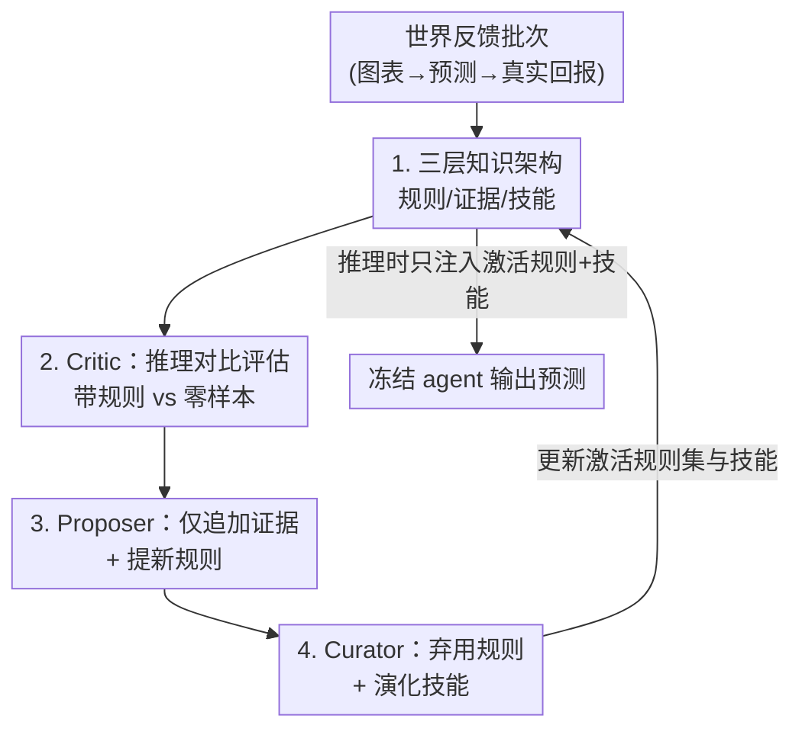

# Closing the Feedback Loop: From Experience Extraction to Insight Governance in Verbal Reinforcement Learning

**会议**: ICML 2026  
**arXiv**: [2606.17591](https://arxiv.org/abs/2606.17591)  
**代码**: 待确认  
**领域**: LLM Agent / Agent Memory  
**关键词**: 言语强化学习, 世界反馈, 知识治理, Agent 记忆, 非平稳环境

## 一句话总结
这篇论文指出训练自由的「言语强化学习」（不更新参数、把经验提炼成规则塞进上下文）在非平稳环境里有个被忽视的「保留-遗忘困境」，提出一套「规则 / 证据 / 技能」三层架构 + critic-proposer-curator 治理回环，让同一批积累的经验从「拉低到零样本基线以下」翻转成「方向准确率 +5.3pp、Sharpe 翻倍」。

## 研究背景与动机

**领域现状**：越来越多 LLM agent 工作把「世界反馈」（市场回报、任务结果、需求预测这类客观信号）当成一等学习信号——不做梯度更新，而是从经验里抽取自然语言规则，注入上下文来改变 agent 行为。Reflexion、ExpeL 这条线就是代表，它的卖点是可解释、模块化、比微调便宜。

**现有痛点**：但在非平稳环境里，积累的经验「帮倒忙」和「帮正忙」一样多。某个 regime 下管用的规则换个 regime 就失效，而真实世界大多非平稳。全存下来——上下文被陈旧、互相矛盾的规则灌满，错误的规则在错误的时刻触发，输出「自信但错」；全删掉——条件复现时（非平稳环境里一定会复现）agent 又得从零学一遍。

**核心矛盾**：作者把这叫**保留-遗忘困境（retention-forgetting dilemma）**，并诊断出现有方法的结构性偏科——它们重金投在「经验抽取」（怎么从经验里产出好规则）上，却严重欠投「洞见治理」（规则存在之后怎么管理它们）。换句话说，大家都在拼命造规则，没人管这些规则该不该被信任。

**本文目标**：要驾驭这个困境，系统必须同时满足四条要求——R1 结果驱动的评估、R2 持久且结构化的证据、R3 非单调的知识生命周期、R4 组合式治理。作者审了一圈训练自由方法（见下方对比表），发现没有一个能同时满足四条。

**切入角度**：每一层的存在都是为了补上一层的失效模式——光有规则，agent 不知道该信哪条；光有「每条规则的证据」，没法处理规则之间的组合冲突；只有让技能在证据之上运作，才能给出有原则的治理。

**核心 idea**：用「规则→证据→技能」三层 + 一个反馈驱动的策展回环，把世界结果重新连回每一层知识，让「治理」（而非「积累经验的数量」）成为 agent 进步还是退化的决定因素。

下表是作者对现有训练自由言语 RL 方法的能力诊断：

| 方法 | R1 评估 | R2 持久证据 | R3 非单调生命周期 | R4 组合治理 |
|------|---------|------------|------------------|------------|
| 反思式累积 (Reflexion) | 部分（轨迹级） | ✗ | ✗ | ✗ |
| 反思式精炼 (ExpeL) | 部分（标量） | ✗（改写即失效） | 部分（就地修改） | ✗ |
| 轨迹归因 tips (Fang 2025) | ✓（因果归因） | ✗（无跨 episode） | 部分（合并） | 部分（LLM 选） |
| Meta-MDP 经验库 (Cai 2025) | ✓（语义 critic） | ✗（合并抹源） | 部分（保留失败） | 部分（三级 top-k） |
| **本文** | ✓（推理对比） | ✓（跨批次） | ✓（弃用不删） | ✓（演化技能） |

## 方法详解

### 整体框架

系统要解决的是：在非平稳的世界反馈下，让一个**冻结参数**的 LLM agent 既不被陈旧规则拖垮、又不在条件复现时把教训忘光。整体怎么转？它把 agent 的「记忆」拆成三层——**规则**记录从世界结果蒸馏出的经验，**证据**记录每条规则跨 episode 的可靠性，**技能**则在证据之上决定该用哪些规则、冲突怎么裁、何时弃权。三层之间由一个 **critic → proposer → curator** 的策展流水线按批次（每批约 16 个样本）连成闭环：critic 把「带规则的推理」和「零样本推理」在同一个已观测结果上对比，判断每条规则是帮了还是害了；proposer 只往每条规则的证据日志里**追加**评估、并为没覆盖到的错误模式提出新规则；curator 读跨规则证据，把持续负面的规则**弃用（不删除）**、并演化出技能。推理时，agent 只拿到「当前激活的规则 + 当前技能」作为额外上下文，参数完全不动。

关键的结构性约束是：证据日志 $\Xi$ 是**仅追加（append-only）**的——即使某条规则被弃用，关于它的证据也不删不改，从而保证所有治理决策都扎根于完整的历史观测。

### 关键设计

**1. 三层知识架构：把「记什么」和「该信什么」拆开**

现有方法的根本问题是把规则、它的可靠性、规则之间的组合全揉在一起，结果一条「3 次验证 5 次被反驳」的规则和一条「5 次验证 3 次被反驳」的规则，如果只记一个「激活/弃用」的二元状态，看起来一模一样。本文把它显式拆成三层：**规则层**——每条规则是一个自然语言陈述，含「在可观测特征上的触发条件 + 一个纠正动作」，规则只弃用、不删除（弃用后停止触发但知识保留，这正是 R3）；**证据层**——每条规则挂一份持久证据日志，结构化记录「哪个 episode、帮了还是害了、在什么条件下」，跨 episode 累积、且在弃用后依然存活（这是 R1+R2）；**技能层**——读跨规则证据，控制哪些规则进入 agent 有限的上下文、冲突怎么裁、何时弃权（R4）。与 Hindsight 用一个标量 confidence 不同，本文保留**完整证据轨迹**：当一条规则被弃用，「为什么被弃用」的证据仍可访问，从而避免重新提出等价规则、并能在条件变化时识别出某条弃用规则可能重新相关。

**2. Critic 的推理对比评估：把「对错」升级成「为什么对/错」**

反思式累积根本不做事后评估（规则一旦存下就再不被检验），反思式精炼只用标量重要性近似。本文的 critic 把**规则增强的推理**与**零样本基线**在同一个已观测结果上对比，问的不是「最终预测对不对」，而是「这条规则如何影响了 agent 的思维链」。这种推理级归因严格比「成功/失败」标量更有信息量——它能把改善或退化归因到具体规则，即便最终预测碰巧对了也能识别出是哪条规则在帮倒忙。形式上，给定新批次经验 $B_k=\{(x_t,a_t,y_t)\}$，评估为 $E_k=\textsc{Critic}(B_k,\mathcal{L}_{k-1},\mathcal{S}_{k-1})$，其中 $\mathcal{L}$、$\mathcal{S}$ 是规则库与技能。

**3. Proposer 的仅追加证据：改写即失效，所以永不改写**

prior work（ExpeL / TF-GRPO）最致命的一点是**就地改写规则**：规则一旦被重写，此前积累的所有评估证据被悄悄作废，必须付出昂贵代价重新评估来重建信心。本文 proposer 把 critic 评估**追加**到每条规则的证据日志、绝不就地修改：$\Xi_k,P_k=\textsc{Proposer}(E_k,\mathcal{L}_{k-1},\Xi_{k-1})$，其中 $\Xi_k$ 把批次 $k$ 的评估并入证据日志、$P_k$ 是新提出的规则。仅追加设计让证据在规则弃用后存活，从而既能解释「为什么弃用」，又能在条件变化、弃用知识重新相关时把它捞回来——这是同时满足 R2 与「有据可依的 R3」的结构性前提。

**4. Curator 的证据接地治理：弃用与技能演化共用同一份证据**

curator 读跨规则证据，**同时**做生命周期与治理两类决策：把持续负面的规则弃用（R3），并演化出编码了优先级排序、冲突裁决、反模式的技能（R4）：$\mathcal{L}_k,\mathcal{S}_k=\textsc{Curator}(\mathcal{L}_{k-1},\mathcal{S}_{k-1},\Xi_k,P_k)$。因为两类决策接地于**同一份持久证据**，它们天然自洽——技能绝不会去优先一条证据明确反对的规则。一个有意思的机制是：那些「被频繁引用、却持续给出错误预测」的规则，恰恰因为引用频繁而积累了足够多的负面证据，**「频繁被引用」本身反而成了删除信号**。这也呼应了 SkillsBench 的经验观察——大而全、无接地的技能集会拉低性能，而本文的技能「按构造就是聚焦的」，因为它们是从积累证据里派生、而非凭空生成。

### 一个完整示例

以金融预测的学习阶段为例走一遍：base agent（Qwen3-VL-235B）看一张 20 天 K 线图，输出方向预测、情景预测、风险参数和思维链；critic / proposer / curator 用 Claude Sonnet 4.6。学习阶段（2013–2016）按每批约 16 个样本处理：每批结束后，critic 拿预测对照真实市场回报，产出「哪条规则帮了、哪条害了、在什么条件下」的言语评估；proposer 把评估追加进对应规则的证据日志，并为没覆盖到的错误模式抽出新规则（每条是「在可观测图表特征上的触发条件 + 纠正动作」）；curator 复查跨规则证据，把持续负面的规则移出激活上下文（但保留其证据日志），并演化技能。例如表 3 里的技能 S3「吸筹后派发」就同时管着激活规则 rule_013/016、从弃用的 rule_005/007 里吸取教训，证据来自第 6、7 批。到推理阶段（2017 测试集），agent 只额外拿到激活规则 + 当前技能，参数不更新。

## 实验关键数据

### 主实验

设定：复用 Cui et al. (2026) 的协议，S&P 500 前 5 大权重股（AAPL/AMZN/FB/GOOGL/MSFT）日线 OHLCV，2013–2016 学习、2017 测试，20 天 K 线输入、5 天预测窗口，报告 5 次评估均值。所有训练自由方法共用同一 base agent，**只在「如何管理积累经验」上不同**。

| 方法 | 方向准确率 | 情景准确率 | 平均回报 | Sharpe | 最大回撤 |
|------|-----------|-----------|---------|--------|---------|
| Zero-shot | 51.2% | 23.8% | 0.16% | 0.53 | 34.5% |
| 反思式累积 | 46.3% | 23.3% | −0.08% | −0.12 | 35.2% |
| 反思式精炼 | 51.1% | 24.7% | 0.14% | 0.36 | 24.4% |
| **本文（全回环）** | **56.5%** | **29.0%** | **0.33%** | **1.00** | **13.0%** |

三个发现直接对应能力诊断表：

| 满足的要求 | 结果 | 解读 |
|-----------|------|------|
| 一个都不满足（反思式累积） | 全面跌破零样本（−4.9pp、Sharpe 转负） | 经验主动帮倒忙——这是困境的「保留」侧 |
| 部分满足（反思式精炼） | 准确率恢复到零样本附近，但风险调整后回报变差（Sharpe 0.36<0.53） | 更好的抽取有帮助，但缺 R2/R4，矛盾规则仍在累积 |
| 全回环（本文） | +5.3pp 方向准确率、Sharpe 近翻倍、最大回撤砍 60% | 只有四条要求全满足才是真正的学习 |

### 关键发现
- **治理 > 经验数量**：同一批积累的经验，因为有没有策展回环，结果可以从「跌破零样本」翻转成「Sharpe 翻倍」——这是全文最核心的实证。
- **持久证据 (R2) 让规则替换更聪明**：新规则不是只从当前批次的错误里提，而是被「前任规则为什么失败」的累积证据塑形，从而避开同样的坑。
- **频繁引用反而是删除信号**：持续给出错误预测的高频规则，正因引用多而攒下足够负面证据被弃用——这是 append-only 证据带来的反直觉好处。
- 规则库演化图显示「累积规则（不治理）」与「弃用后的激活规则（治理）」之间的差距越拉越大，这道豁口就是治理的贡献。

## 亮点与洞察
- **把问题命名清楚就是贡献**：「保留-遗忘困境」+「四条要求 R1–R4」给一团模糊的「agent 记忆该怎么管」提供了一个可诊断、可对照的坐标系，连竞品对比表都能直接画成「缺哪条」。
- **append-only 证据是真正的结构性创新**：大多数前作败在「改写规则即作废证据」，本文坚持只追加、弃用不删，一举把 R2/R3 同时焊死，这个工程取舍很值得迁移到任何带记忆的 agent。
- **评估从「对错」升级到「推理归因」**：拿带规则 vs 零样本的思维链对比，比标量成功率信息量大得多，可迁移到任何需要「定位是哪条上下文在影响输出」的场景（如 RAG 证据归因、prompt 调试）。
- 「频繁被引用反成删除信号」这一点很 aha——它把「热门」与「可靠」解耦，提示我们 agent 记忆里高频未必等于高质。

## 局限与展望
- **只在金融预测单一案例上验证**：作者选金融是因为世界反馈「丰富、客观、有噪、延迟、非平稳」五个特征齐全，但机器人控制、需求预测等其他非平稳域是否同样吃这套治理，论文未给跨域证据。
- **依赖强模型当 critic/curator**：critic/proposer/curator 用的是 Claude Sonnet 4.6，治理质量很可能与这些「裁判模型」的能力强绑定，换小模型当裁判时回环是否还成立存疑。
- **回环本身的算力/延迟成本未充分讨论**：每批都要跑推理对比评估 + 跨规则证据复查，相对纯注入式方法的开销代价论文着墨不多。
- 改进方向：把三层架构接到形式化的 AGM 信念修正（论文已引用 Relevance/Core-Retainment 公设）上，给「弃用不删」一个数学保证；以及在更多非平稳域上做可迁移性验证。

## 相关工作与启发
- **vs 反思式累积 (Reflexion)**：他们从错误里抽言语反馈、追加进上下文，但反馈存下后再不被后续结果检验、所有经验一视同仁；本文用 critic 持续评估 + curator 弃用，正是补上它完全缺失的 R2/R3/R4。
- **vs 反思式精炼 (ExpeL)**：他们加了重要性打分和就地规则修改（部分 R1/R3），但就地改写会作废全部已积累证据；本文坚持 append-only，结构性地避免「改写即失效」。
- **vs Hindsight (Latimer 2025)**：它用 Opinion Network 让信念带演化的标量 confidence，但标量丢掉了结构化证据轨迹（信心从 0.85 掉到 0.55 却说不清是哪些事实导致的）；本文保留完整轨迹，能重构「为什么」。
- **vs Meta-MDP 经验库 (Cai 2025)**：它把经验分 golden/warning 两区、保留失败知识（部分 R3），但分区在入库时固定、且合并相似条目会抹掉来源；本文的弃用是证据驱动、可降级的。
- **vs SkillsBench (Li 2026)**：这是静态评测（技能只注入一次、无跨 episode 反馈），但其「策展技能 +16.2pp、自生成技能 −1.3pp」「聚焦优于全面」的结论，正是本文 R1（质检）和 R4（组合）的经验动机。

## 评分
- 新颖性: ⭐⭐⭐⭐⭐ 「保留-遗忘困境 + R1–R4 + append-only 治理回环」是对 agent 记忆这一块少见的系统性重构，而非又一个 prompt trick
- 实验充分度: ⭐⭐⭐ 翻转效应很有说服力，但只在金融单一案例、5 支股票上验证，跨域证据缺失
- 写作质量: ⭐⭐⭐⭐⭐ 用「每层补上一层失效模式」「治理 vs 数量」两条主线把复杂架构讲得极清晰，对比表一目了然
- 价值: ⭐⭐⭐⭐ 对做 LLM agent 长期记忆/经验复用的人是很实用的设计模板，append-only 证据这一招尤其可直接借用

<!-- RELATED:START -->

## 相关论文

- [\[CVPR 2026\] Learning to Select Visual Tools from Experience](../../CVPR2026/llm_agent/learning_to_select_visual_tools_from_experience.md)
- [\[ICML 2026\] From Player to Master: Enhancing Test-Time Learning of LLM Agents via Reinforcement Learning over Memory](from_player_to_master_enhancing_test-time_learning_of_llm_agents_via_reinforceme.md)
- [\[ICML 2026\] Agentic Monte Carlo: Simulating Reinforcement Learning for Black-Box Agents](agentic_monte_carlo_simulating_reinforcement_learning_for_black-box_agents.md)
- [\[ICML 2026\] On Information Self-Locking in Reinforcement Learning for Active Reasoning of LLM Agents](on_information_self-locking_in_reinforcement_learning_for_active_reasoning_of_ll.md)
- [\[ICML 2026\] Skill-Pro: Learning Reusable Skills from Experience via Non-Parametric PPO for LLM Agents](skill-pro_learning_reusable_skills_from_experience_via_non-parametric_ppo_for_ll.md)

<!-- RELATED:END -->
