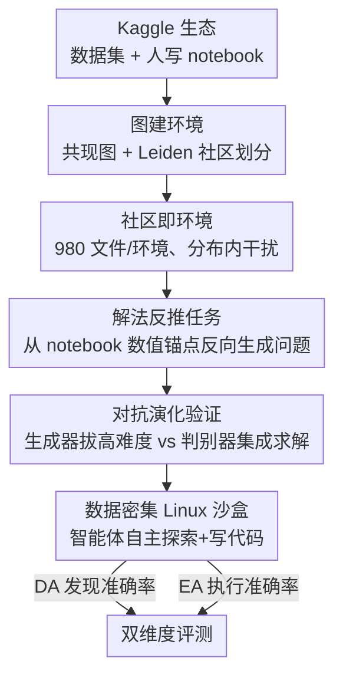

# CoDA-Bench: Can Code Agents Handle Data-Intensive Tasks?

**会议**: ICML2026  
**arXiv**: [2606.15300](https://arxiv.org/abs/2606.15300)  
**代码**: https://github.com/ruc-datalab/CoDA-Bench （数据 https://huggingface.co/datasets/RUC-DataLab/CoDA-Bench ，主页 https://coda-bench.github.io/）  
**领域**: LLM Agent / 代码智能体 / 评测基准  
**关键词**: 代码智能体, 数据密集环境, 评测基准, 数据发现, Kaggle

## 一句话总结
CoDA-Bench 是第一个把"代码智能"和"数据智能"放在同一个数据密集 Linux 沙盒里联合评测的基准——智能体被丢进平均含 980 个文件的 Kaggle 生态环境里，必须先从一堆语义相似的干扰文件中自己找到对的数据、再写代码算出答案；结果连最强的 Mini-SWE-Agent (GPT-5.5) 也只有 61.1% 执行准确率，暴露出当前代码智能体严重缺乏自主数据发现能力。

## 研究背景与动机
**领域现状**：LLM 已经从对话助手进化成能跑复杂工作流的自主智能体，Claude Code、Cursor、Codex CLI 等工具开始扮演"自主工程师"。要把它们放进真实开发场景，就需要严谨的评测。

**现有痛点**：现有基准把"代码"和"数据"两种能力**割裂评测**，与真实开发脱节。代码中心基准（HumanEval、SWE-bench 等）只看代码正确性或仓库级维护，**完全忽略真实场景里海量异构数据带来的挑战**；数据中心基准（DA-Code、DABstep 等）虽然考数据处理，但依赖独立 Python 脚本、**把所有相关文件直接喂给智能体**，跳过了"在 shell 环境里大规模发现并访问数据"这一步。现实里数据从来不会被摆在银盘上端到面前。

**核心矛盾**：真实开发中智能体的价值在于和文件系统里的大规模数据交互——要在目录层级里导航、从上百个候选里认出相关文件、不需用户指定目标就执行正确操作。这需要**双重智能**：代码智能（写出语法正确、逻辑通的程序）和数据智能（在复杂数据地形里定位正确信息源）。但没有任何基准同时考这两者耦合后的表现。

**核心问题**：当前 SOTA 代码智能体能不能**同时**整合代码智能与数据智能来处理数据密集任务？

**构建难点**：随机生成的文件一眼就能和目标数据区分开（不够难），手工策划上百个相关文件又不可扩展。本文的切入点是借 Kaggle 生态——它天然有互相关联的数据集和人写的解题代码，可以低成本造出"语义相似但大多无关"的现实噪声环境。

**核心 idea**：用 Kaggle 数据集的共现图造出含真实分布内干扰的环境，从真实 notebook 的数值结果反推出可验证任务，再用对抗演化把任务推到最难还保持可解。

## 方法详解

### 整体框架
CoDA-Bench 的构建是一条三阶段流水线：先用 Kaggle 数据集的**共现图**划分出语义连贯的社区，每个社区当成一个含上百个分布内干扰文件的评测环境；再从社区对应的真实 Kaggle notebook 里抽取"解法锚点"（确定可复现的数值结果），**反向**生成自然语言问题构成可验证任务；最后用 GAN 式的**对抗演化**把任务难度推到极限同时保证可解。评测时把智能体丢进对应的数据密集 Linux 沙盒，它从根目录出发、只拿到一句自然语言指令，必须自主探索文件、找出相关数据、写代码算答案，按两个指标打分：发现准确率（DA）衡量数据智能，执行准确率（EA）衡量端到端的代码智能。

### 关键设计

**1. 图建环境：用 Kaggle 共现图 + 社区划分造出分布内干扰，让数据发现真有难度**

要让"找数据"成为真实挑战，干扰文件必须和目标数据**话题与结构相似但又无关**（即分布内噪声），否则智能体靠关键词或格式一眼就能过滤掉。作者的做法是借 Kaggle 上 64 万多个公开数据集 + 人写 notebook：分析师写 notebook 时会刻意一起探索话题相关的数据，这种共现天然刻画了"哪些数据该出现在同一现实环境里"。具体把所有数据当节点、构建无向加权图 $G=(\mathcal{D},E,w)$，边权按共现频率定义 $w(d_i,d_k)=\sum_{j=1}^{m}\mathbbm{1}[d_i\in\mathcal{D}_j\land d_k\in\mathcal{D}_j]$（$\mathcal{D}_j$ 是 notebook $n_j$ 引用的数据子集），共现一次即连边。再用 Leiden 算法（分辨率 $\gamma=1.0$）把异构大图切成语义连贯社区。对每个目标数据 $\mathcal{D}^*\subset C_k$，把整个社区 $C_k$ 都放进评测环境，其中 $C_k\setminus\mathcal{D}^*$ 就是话题相似的分布内干扰。这样智能体没法靠表面关键词匹配，必须做细粒度语义推理才能定位数据源。最终每个环境平均含 980.8 个文件、覆盖 CSV/JSON/Parquet/图片/PDF 多格式、体量从 20.3 MB 到 45.4 GB。

**2. 解法反推任务：从 notebook 的"解法锚点"逆向构造可验证问题**

要的是既反映真实需求、又能客观判分的任务。Kaggle notebook 完整记录了解法和数值结果，正好可当任务来源。作者把 notebook 里那些"领域专家认为值得报告"的精确数值结果（统计量、排名、相关性、聚合值等）称作**解法锚点（solution anchor）**——它们在同样数据和计算流程下确定可复现、可验证。锚点识别用静态分析 + 动态验证：先用 LLM 从单元格输出里挑出"可验证且非平凡"的候选锚点，再通过静态数据流分析追溯每个锚点 $a$ 的来源，识别出计算它所需的最小输入文件集 $\mathcal{D}_a$ 和变换序列 $\mathcal{T}_a=\langle\tau_1,\dots,\tau_k\rangle$，重跑这条计算路径、确认结果在数值容差 $\varepsilon=10^{-6}$ 内复现，以此保证答案唯一。然后用 LLM 根据锚点结果和重建的解法路径**反向**生成自然语言问题，要求问题清楚说明目标却不泄露解法路径，再由人工标注复核去掉有歧义或多解的题。这套"从答案倒推问题"的思路既保证了任务正确性，又让任务贴近从业者真正关心的问题。

**3. 对抗演化验证：GAN 式生成器-判别器博弈把任务推到最难且可解**

反推出的初始任务未必够难，而拔高难度又容易引入歧义或信息不足——难度和可解性天生矛盾。作者借鉴 GAN，把任务演化建成生成器 $G$（最大化任务难度）和判别器 $F$（尽力求解）的双人博弈，目标 $\min_G\max_F\mathcal{L}(G,F)=\mathbb{E}_{q\sim G}[\mathbbm{1}[F(q)=a_q]]$；与标准 GAN 不同，$G$ 和 $F$ 都用 SOTA LLM，且把连续参数更新换成离散的任务改写。迭代时为防止对单个 LLM 过拟合，判别器是从模型池随机采样的 $K$ 个模型集成，算求解率 $r^{(t)}=\frac{1}{K}\sum_{k=1}^{K}\mathbbm{1}[F_k(q^{(t)})=a_q]$。求解率高于阈值就说明任务太易，生成器看成功轨迹找加难机会；低于阈值则做诊断分析——若失败源于任务缺陷（措辞歧义、信息缺失、答案非唯一）就修任务，若是真难且仍可解就送人工验证，复核确认可解后该任务才入库。三阶段流水线从 323 个数据社区起步，最终筛出 1,009 个高质量任务，从问题生成到最终入库的总通过率 72.3%。

**4. 双维度指标 DA / EA：把数据发现与代码执行分开度量**

CoDA-Bench 沿两个维度评测。**发现准确率（DA）**衡量数据智能：设 $\mathcal{F}_{\text{used}}^{(t)}$ 是智能体方案中实际访问的文件、$\mathcal{F}_{\text{target}}^{(t)}$ 是真值目标文件，$\text{DA}=\frac{1}{|\mathcal{T}|}\sum_t \mathbbm{1}[\mathcal{F}_{\text{used}}^{(t)}=\mathcal{F}_{\text{target}}^{(t)}]$，即"全部找对所需文件"的任务比例。**执行准确率（EA）**衡量代码智能：$\text{EA}=\frac{1}{|\mathcal{T}|}\sum_t \mathbbm{1}[\text{normalize}(a_t)=\text{normalize}(a_t^*)]$，即归一化（四舍五入、去空白、统一大小写）后答案正确的比例。DA 独立度量数据发现、EA 捕捉"发现+执行"的端到端完成度，两者合起来才完整刻画智能体能力。作者还另切出 **CoDA-Hard**（119 题）：要求至少从大集合里发现 2 个目标文件（数据复杂）且参考解超过 30 行有效代码（代码复杂）。

## 实验关键数据

### 主实验
评测原生 CLI 工具（Claude Code、Codex CLI，官方默认配置）与框架式智能体（OpenHands、Mini-SWE-Agent）。CoDA-Bench 共 1,009 题、CoDA-Hard 119 题。

| 系统 | 模型 | CoDA-Bench DA% | CoDA-Bench EA% | CoDA-Hard EA% | 轮数 | $/任务 |
|------|------|------|------|------|------|------|
| Mini-SWE-agent | GPT-5.5 | 83.0 | **61.1** | **49.6** | 32.5 | ~0.39 |
| OpenHands | GPT-5.5 | 82.1 | 59.7 | 44.5 | 18.1 | ~0.65 |
| Codex CLI | GPT-5.5 | 74.9 | 60.3 | 47.9 | 6.8 | ~1.39 |
| Claude Code | Sonnet-4.6 | 77.9 | 53.8 | 42.9 | 14.7 | 0.11 |
| Claude Code | Opus-4.7 | 77.3 | 51.9 | 45.4 | 16.1 | 0.22 |
| OpenHands | Kimi-K2.6 | 71.5 | 43.8 | 37.0 | 39.4 | ~0.41 |
| OpenHands | DeepSeek-V4-Pro | 75.9 | 49.0 | 36.1 | 35.8 | ~0.15 |

### 分析与消融

| 分析 | 关键现象 | 说明 |
|------|---------|------|
| Oracle vs Community（CoDA-Hard） | Sonnet-4.6 45.4%→73.1%（+27.7），GPT-5.5 44.5%→68.9%（+24.4） | 直接给目标文件路径后大涨，证明数据发现是主要瓶颈 |
| 即便给 Oracle | 平均仅 71.0%，仍有 29% 失败 | 多源整合、语义歧义、多步推理让代码生成本身也难 |
| 信噪比 SNR | Spearman $\rho=0.466$, $p<0.01$ | 低 SNR 社区准确率明显更低——难在区分语义相似干扰，而非文件多 |
| 数据体量 | $\rho=-0.461$, $p<0.01$；>8GB 近乎 0 | 大文件读取造成 I/O 瓶颈 |
| 错误归因（200 例） | GPT-5.5：代码生成 44.0% / 数据发现 33.0%；Kimi-K2.6：数据发现 40.7% / 代码生成 34.7% | 弱模型更多败在找数据，强模型败因转向分析推理 |

### 关键发现
- **数据发现是真瓶颈**：即便最强智能体也在近 20% 任务上找不对文件；给了 Oracle 路径后 EA 暴涨 24–28 个点，直接证明"在上百候选里认出对的数据"是当前智能体的核心短板。
- **错误会沿管线不可逆传播**：一旦探索阶段选错数据文件，后续再怎么改代码、debug 都救不回来——这正是数据智能在数据密集任务里至关重要的原因。
- **框架决定交互效率、模型决定性能上限**：同样 GPT-5.5，Codex CLI 用 6.8 轮拿 60.3% EA，Mini-SWE-agent 用 32.5 轮拿 61.1%，轮数差近 5×；而 Kimi-K2.6 用更多轮（39.4）反而更低（43.8%），说明多交互救不了模型本身的能力上限。
- **模型-框架匹配很重要**：GPT 系在 Mini-SWE-agent 下 EA 比原生 CLI 高 0.8 点，Claude 系反而在原生环境更好（51.9% vs 49.3%）。

## 亮点与洞察
- **第一个联合考代码+数据智能的基准**：把"找数据"这一真实开发里绕不开却被所有基准跳过的环节，第一次纳入评测，且用 DA/EA 把两种能力拆开度量，定位失败到底出在发现还是执行。
- **共现图造分布内干扰是关键巧思**：不靠随机文件（太易）、不靠手工策划（不可扩展），而用 Kaggle notebook 的自然共现 + Leiden 社区，自动造出"语义相似但无关"的现实噪声，让数据发现真有难度。
- **解法反推 + 对抗演化保证了可扩展且可验证**：从 notebook 数值锚点倒推问题，天然有确定可复现的真值答案；再用 GAN 式集成判别器把任务推到难还可解，整套流程可大规模复制。
- **"错误不可逆传播"是值得记的洞察**：数据密集任务里，探索阶段选错数据后下游代码无论怎么调都救不回，提示未来 agent 设计要把数据发现的可靠性放到很高优先级。

## 局限与展望
- **天花板偏低**：最强系统也只 61.1% EA（CoDA-Hard 49.6%），说明基准很难——这是优点，但也意味着短期内难做细粒度区分顶级模型。
- **依赖 Kaggle 生态**：任务和环境都来自 Kaggle，可能偏数据科学/分析场景，未必覆盖所有真实数据密集开发（如生产数据库、流式数据）。
- **判分依赖数值锚点**：答案是确定数值，适合可验证的统计/聚合类任务，但难评测开放式、无唯一答案的分析任务。
- **大体量 I/O 瓶颈**：>8GB 社区近乎全军覆没，部分失败是工程性 I/O 限制而非推理能力，可能掩盖模型真实能力差异。

## 相关工作与启发
- **vs SWE-bench / Terminal-Bench（代码中心）**: 它们假设任务所需数据已备好、显式提供在环境里，只考代码与工程；CoDA-Bench 要求智能体先自己在复杂数据环境里发现有价值信息。
- **vs DA-Code / DABstep / DSBench（数据中心）**: 这些虽考数据科学任务，但所有相关文件都明确给到智能体、且多为相对简单操作；CoDA-Bench 把数据藏在上百个语义相似干扰里、要求在终端真实环境中探索。
- **vs MLE-bench / GAIA（多文件 ≤10）**: 文件规模小、无大规模发现压力；CoDA-Bench 平均 980 文件、最多 8,158，信噪比低至 0.0105，发现压力是数量级之差。

## 评分
- 新颖性: ⭐⭐⭐⭐⭐ 第一个把代码智能与数据发现联合评测的基准，共现图+解法反推+对抗演化的构建组合很新。
- 实验充分度: ⭐⭐⭐⭐⭐ 覆盖原生 CLI 与框架式智能体、多家模型，含 Oracle 消融、SNR/体量/轮数/错误归因多维分析。
- 写作质量: ⭐⭐⭐⭐ 动机与构建流程叙述清晰、图表完整；部分实现细节（对抗阈值、人工复核标准）留在附录。
- 价值: ⭐⭐⭐⭐⭐ 直指真实开发中"数据发现"这一被忽视的核心瓶颈，对自主工程师类智能体的评测与改进很有指导性。

<!-- RELATED:START -->

## 相关论文

- [\[ICML 2026\] Process Reward Agents for Steering Knowledge-Intensive Reasoning](process_reward_agents_for_steering_knowledge-intensive_reasoning.md)
- [\[NeurIPS 2025\] MLRC-Bench: Can Language Agents Solve Machine Learning Research Challenges?](../../NeurIPS2025/llm_agent/mlrc-bench_can_language_agents_solve_machine_learning_research_challenges.md)
- [\[ACL 2025\] REPRO-Bench: Can Agentic AI Systems Assess the Reproducibility of Social Science?](../../ACL2025/llm_agent/repro-bench_can_agentic_ai_systems_assess_the_reproducibility_of_social_science_.md)
- [\[ICML 2026\] ExCyTIn-Bench: Evaluating LLM Agents on Cyber Threat Investigation](excytin-bench_evaluating_llm_agents_on_cyber_threat_investigation.md)
- [\[ACL 2025\] REPRO-Bench: Can Agentic AI Systems Assess the Reproducibility of Social Science Research?](../../ACL2025/llm_agent/repro-bench_can_agentic_ai_systems_assess_the_reproducibility_of_research_claims.md)

<!-- RELATED:END -->
