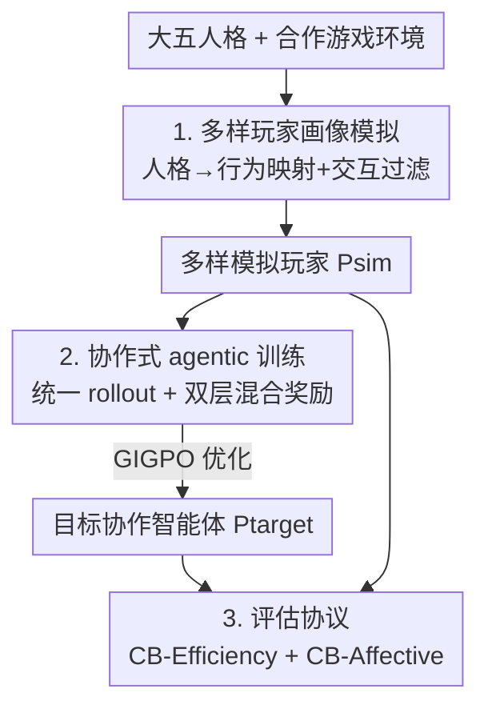

# CollabBench: Benchmarking and Unleashing Collaborative Ability of LLMs with Diverse Players via Proactive Engagement

**会议**: ICML2026  
**arXiv**: [2606.05793](https://arxiv.org/abs/2606.05793)  
**代码**: https://github.com/BW297/CollabBench  
**领域**: LLM Agent / 多智能体协作  
**关键词**: 协作智能体, 合作游戏, 人格模拟, 智能体强化学习, 情感对齐

## 一句话总结
论文提出 CollabBench——一个让 LLM 智能体在合作游戏里与"性格各异的队友"协作的基准与训练框架：用大五人格驱动模拟出多样玩家，用统一 agentic rollout + "效率/情感"双层混合奖励做强化训练，并配一套"效率指标 + 情感指标"的评估协议；训练后的 Qwen2.5-7B 在效率和情感维度分别提升约 19.5% 和 24.4%。

## 研究背景与动机

**领域现状**：LLM 智能体在单体任务（深度检索、数学推理、编码）上已很强，研究重心正转向"与人协作"。但现有人–智能体协作研究大多停留在**对话层任务**（对话、文档编辑、解题），交互弱、与共享情境脱节、缺少落地的行为执行。

**现有痛点**：作者点出三大缺口。**挑战 1**——在游戏环境里用 LLM 模拟性格与行为风格各异的玩家很难：现有角色扮演/用户画像方法依赖预设角色或静态用户数据，抓不住交互游戏里"动作级"的行为。**挑战 2**——如何在强情境（游戏）里释放 LLM 与多样队友的协作能力，几乎没人探索：以往要么提升单体能力、要么搞多智能体架构，很少在 LLM 内部学"协作意识与适应力"。**挑战 3**——现有游戏评估只看效率（最终分数、成功率），忽略了对人–智能体协作至关重要的情感与社交质量。

**核心矛盾**：真实协作要求智能体**同时**兼顾任务效率与情感适应——既高效完成目标，又能感知队友的焦虑/犹豫并给予共情反馈。论文用动机实验佐证：引入多样人格玩家会显著增加任务难度（CWAH 步数 +9.3%、Overcook 分数 −23.1%），且纯效率驱动的交互满足不了多样伙伴的情感需求。

**本文目标**：(1) 造出能稳定模拟多样人格玩家的合作游戏环境；(2) 设计能在 LLM 内部学到"高效 + 情感适应"协作的训练范式；(3) 给出超越效率、含情感维度的评估协议。

**核心 idea**：把"多样玩家模拟 → 协作式 agentic 训练 → 双维评估"串成一条闭环，用大五人格把抽象人格落到可执行行为、用步级情感奖励补上稀疏效率奖励抓不到的协作细节。

## 方法详解

### 整体框架

CollabBench 研究的是一个**异质协作**设定：两个智能体在部分可观测环境里合作达成共享目标 $G=\{g_1,\dots,g_K\}$，一个是表现多样人格的模拟玩家 $P_{\text{sim}}$，另一个是待优化的目标协作智能体 $P_{\text{target}}$。交互轨迹 $\tau=\{t_1,\dots,t_H\}$ 的每一步 $t_i=\{s_i,r_i,c_i,a_i\}$ 含部分观测 $s_i$、内部推理 $r_i$、自然语言沟通 $c_i$、可执行动作 $a_i$。$P_{\text{target}}$ 用两个目标优化——轨迹级效率奖励 $R_e(\tau\mid G)=\text{score}(\tau,G)$ 和步级情感奖励 $R_a(t_i\mid P_{\text{sim}})$，总目标 $R^*\simeq R_e+R_a$ 在任务效率与逐步情感体验间取平衡。

整个框架三大模块串成闭环：**① 多样玩家画像模拟**产出 $P_{\text{sim}}$，**② 协作式 agentic 训练**用这些队友训出 $P_{\text{target}}$，**③ 评估协议**用效率/情感双维度衡量二者交互质量。作者还把两个经典游戏 CWAH 和 Overcooked 扩展成 CWAH-MultiPlayer 和 Cook-MultiPlayer 作为训练/评测场。

### 关键设计

**1. 多样玩家画像模拟：把大五人格落成可执行的游戏行为**

针对挑战 1（模拟多样玩家难），作者设计了一条从人格分布到可执行行为的流水线。**轨迹数据构建**：采用大五人格理论，给每个维度在 prompt 里赋低/中/高水平以覆盖广行为谱，并把每个特质锚定到专家验证的玩法逻辑，让人格差异稳定外化为可观测行为；再用**多个不同 LLM** 实例化这些人格驱动画像、以 ReAct 风格与多样游戏环境交互，产出含推理与动作的轨迹库（推理痕迹对提取高质量行为模式至关重要），借此缓解单一 LLM 的人格偏置、提升多样性。

但纯人格 prompt 生成的轨迹可能"人设与行为不一致"（如低开放性玩家却频繁发消息），所以接一步**高保真画像建模**。先做人格–行为映射：编码文本轨迹片段、对 LLM 嵌入聚类找相似行为模式，每个簇用 LLM 总结其人格特质、推理内容与动作，得到刻画思维模式与动作偏好的统一映射，再过滤冗余映射保多样性。再做**交互式过滤**：把画像当 prompt 驱动玩家智能体跑 ReAct 交互，用一个惩罚式 LLM 裁判按固定时间窗逐段打分，检测两类偏差——人格–推理一致性、推理–动作一致性。每段得分

$$S_\eta=\frac{1}{|\Omega_\eta|}\sum_{i=1}^{|\Omega_\eta|}\Big(5-\alpha_p D_i-\alpha_p^m D_i^m+\alpha_r L_i\Big),$$

其中 $D_i,D_i^m$ 是第 $i$ 局的总/最大偏差惩罚，$L_i$ 是 LLM 推理步数（末项奖励更长推理以遏制偏差累积、保证不同交互长度公平）。最终过滤分 $S_\eta^{\text{ALL}}=\beta S_\eta^{\text{P-R}}+(1-\beta)S_\eta^{\text{R-A}}$，对每个子任务保留 top-$k$ 画像并经专家校验，得到高保真 $P_{\text{sim}}$。

**2. 协作式 agentic 训练：统一 rollout + 效率/情感双层混合奖励**

针对挑战 2（在强情境里学协作），作者设计了 agentic 训练范式。**统一 rollout**：每个交互步用单趟 rollout 同时产出 `<think>`（推理）、`<message>`（沟通）、`<action>`（动作），即便最终动作不发消息也每步都生成 message 以反映沟通推理；与以往分段方式相比，这降低 token 与延迟、促进"沟通与动作联合推理"、并给出可解释的协作意图信号（只有 `<action>` 真正在环境里执行）。

**双层混合奖励**是核心：稀疏的轨迹级效率奖励抓不到逐步的协作细节（沟通意愿、伙伴感知、共情），所以拆成两层。效率奖励 $R_e(\tau\mid G)=\text{score}(\tau,G)$ 是轨迹级稀疏信号；情感奖励 $R_a(t_i\mid P_{\text{sim}})=R_{\text{fmt}}(t_i)+R_{\text{com}}(t_i)+R_{\text{int}}(t_i\mid P_{\text{sim}})$ 是步级密集信号，三项分别为：格式奖励（验证输出结构合法且动作 $a_i\in\mathcal{A}$）、沟通奖励（鼓励落在沟通动作空间 $\mathcal{A}_{\text{com}}$ 的主动对话）、交互性奖励（LLM 裁判按帮助性/可信度/共情对推理、消息、动作打 $[0,1]$ 十档分）。沟通奖励与主观情感评判**交叉校验**沟通的频率与质量，专门防"刷消息但没信息量"的 reward hacking。

**优化**用 GIGPO（GRPO 的变体），做分层优势估计：采样 $N$ 条轨迹，把轨迹级相对优势 $A_T(\tau_n)$（对应效率 $R_e$）与步级优势 $A_S(t_i^{(n)})$（对应情感 $R_a$）合并为

$$A(t_i^{(n)})=A_T(\tau_n)+\omega\cdot A_S(t_i^{(n)}),$$

$\omega$ 权衡全局任务效率与局部情感交互质量，再代入裁剪后的策略目标 $\mathcal{J}(\theta)$ 做更新。论文用全参数 RL、不做 SFT。

**3. 评估协议：效率与情感双维度量协作质量**

针对挑战 3（评估只看效率），作者按组织心理学把协作拆成 Taskwork（操作效率）与 Teamwork（人际交互质量），对应两组指标。**CB-Efficiency**：任务完成步数或最终游戏分、其跨画像标准差（鲁棒性）、每步平均生成 token 数（沟通/计算成本代理）。**CB-Affective**：三个心理学常用子维度——帮助性（输出是否相关、可执行、准确捕捉玩家意图）、可信度（能否可靠解读执行指令、稳定及时响应）、共情（能否感知 $P_{\text{sim}}$ 画像与情绪状态、在困惑/失败时给出支持鼓励），全部由惩罚式 LLM 裁判按 §4.1.2 的段级→轨迹级聚合打分以减小主观偏差。

### 一个完整示例

以 CB-Affective 场景为例：玩家 Bob 的画像是"高焦虑、犹豫、爱发消息"。Bob 发消息"我担心选错浪费时间，你觉得我该怎么办？"——目标智能体 $P_{\text{target}}$ 先在 `<think>` 里识别"队友焦虑需要安抚"，在 `<message>` 里先共情再给具体建议"先去厨房，那里最可能有需要的物品，我去卧室查橱柜，有发现就同步你"，在 `<action>` 里执行 `[walktowards] <bedroom>`。此时格式奖励确认结构合法、沟通奖励奖励这次主动发消息、交互性奖励由 LLM 裁判在帮助性/可信度/共情上给高分；这些步级情感信号叠加到 GIGPO 的步级优势上，引导模型学会"在高焦虑队友面前先安抚再分工"，而不是像默认环境那样冷冰冰下命令。

## 实验关键数据

环境：CWAH-MultiPlayer（5 任务、2 布局、各 15 画像，150 轨迹）与 Cook-MultiPlayer（5 布局、带"发消息"动作、每布局 15 画像，75 轨迹）。模拟玩家用 DeepSeek-V3.1 扮演；基线框架 CWAH 用 CoELA、Cook 用 ProAgent，骨干含 GPT-5.2、DeepSeek-V3.1、Qwen2.5-72B；训练对象是 Qwen2.5-7B-Instruct 训练前后对比，全参数 RL 无 SFT。

### 主结果（训练前后 Qwen2.5-7B，CWAH-MultiPlayer）

| 维度 | 指标 | Base 7B | Trained 7B | 相对提升 |
|------|------|---------|------------|----------|
| 效率 | Step ↓ (Agent1/2) | 84.51 / 90.03 | 71.64 / 63.65 | 15.2% / 29.3% |
| 效率 | Std. ↓ | 33.23 / 31.62 | 25.16 / 22.80 | 24.3% / 27.9% |
| 情感 | Helpfulness ↑ | 1.22 / 1.04 | 1.43 / 1.45 | 17.2% / 39.4% |
| 情感 | Trustfulness ↑ | 2.58 / 2.19 | 3.03 / 3.02 | 17.4% / 37.6% |
| 情感 | Empathy ↑ | 2.50 / 2.30 | 3.33 / 3.02 | 33.5% / 31.5% |

训练后 Qwen2.5-7B 在所有维度一致改善，平均游戏分与情感指标分别提升约 **19.5%** 与 **24.4%**，在效率与情感上取得平衡增益。

### 模型横向对比与消融发现

| 现象 | 表现 | 说明 |
|------|------|------|
| 效率 vs 情感失衡 | 当前 LLM 普遍在帮助性、共情上弱 | 多依赖表层协作策略，对沟通时机与意图敏感度低 |
| 闭源 vs 开源 | GPT-5.2 在多数情感维度领先开源模型 | 游戏分差异不显著，但情感维度差距明显 |
| token ≠ 情感 | 开源模型多生成 token 不转化为情感提升 | 话多≠会协作 |
| 游戏节奏影响 | 慢节奏 CWAH 情感表现优于时间紧的 Cook | 高频交互里时机不当/打断式纠错会破坏体验 |

### 关键发现
- **情感能力是当前 LLM 的短板**：可信度相对高（受指令跟随/对齐训练之益），但帮助性与共情普遍弱，且引入多样人格队友会实打实增加任务难度（CWAH +9.3% 步数、Overcook −23.1% 分）。
- **步级情感奖励是提升关键**：稀疏效率奖励抓不到逐步协作细节，密集的格式/沟通/交互性奖励 + 沟通与情感评判交叉校验，才同时拉高效率与情感、并抑制"刷消息"式 reward hacking。
- **小模型可追平**：训练后的 7B 在情感维度逼近甚至超过更大的基线模型，说明协作能力更多靠"训练范式"而非单纯堆参数。
- 在时间紧迫的 Cook 环境个别效率标准差出现轻微负向（如 −2.2%/−3.1%），提示高频交互下情感与效率的权衡更难。

## 亮点与洞察
- **把"协作"拆成 Taskwork/Teamwork 并配双维评估**，补上了游戏类智能体只看效率的盲区，CB-Affective 的帮助性/可信度/共情三维可直接迁移到其他人–智能体协作评测。
- **统一 `<think>/<message>/<action>` 单趟 rollout** 既省 token 又给出可解释协作意图，是把"沟通"纳入策略学习的轻量做法。
- **双层混合奖励 + 沟通×情感交叉校验** 巧妙堵住了"多发消息骗奖励"的漏洞——这是把主观情感信号引入 RL 时最容易踩的坑。
- 用大五人格 + 聚类映射 + 惩罚式裁判过滤来造"高保真多样玩家"，提供了一条可规模化、可验证一致性的队友模拟流水线。

## 局限与展望
- **重度依赖 LLM 裁判**：情感指标与过滤分都由惩罚式 LLM 裁判给出，存在评判偏置与自我一致性风险，作者用段级聚合缓解但未根除。
- **环境与规模有限**：只在 CWAH/Cook 两类合作游戏、两玩家设定上验证，是否推广到多玩家、开放世界或真实人类队友仍待证。
- **真实人–AI 协作（RQ4）证据偏弱**：主线结果以模拟玩家为主，与真人协作的对比规模有限。
- 高频交互下效率/情感权衡更难（个别负向提升），$\omega$ 等权衡超参的敏感性与跨游戏稳健性需进一步分析。

## 相关工作与启发
- **vs 角色扮演/用户画像模拟（如静态用户数据、预设角色）**：它们抓不住交互游戏里的动作级行为；本文用大五人格锚定玩法逻辑 + 交互过滤，产出可执行、可验证一致性的玩家画像。
- **vs 单体 agentic 训练（VOYAGER / RAGEN / AgentGym-RL）**：那些只提升单智能体能力；本文显式在 LLM 内部学"与多样队友协作"的意识与适应力。
- **vs 协作架构方法（ProAgent / CoELA）**：它们靠专用模块改协调、缺在 LLM 内训练协作、也忽略队友人格多样性；本文把协作能力训进模型权重并系统建模队友异质性。

## 评分
- 新颖性: ⭐⭐⭐⭐ 首个把"多样人格队友 + 情感维度"系统纳入合作游戏基准与训练的工作，组合创新强。
- 实验充分度: ⭐⭐⭐⭐ 多模型横评 + 训练前后消融 + 动机实验扎实，但环境数与真人协作证据有限。
- 写作质量: ⭐⭐⭐⭐ 三挑战→三模块结构清晰，公式与图配合到位。
- 价值: ⭐⭐⭐⭐⭐ 把"会不会协作"从效率拓展到情感，对人–智能体协作训练与评测有明确推动。

<!-- RELATED:START -->

## 相关论文

- [\[ICLR 2026\] The Tool Decathlon: Benchmarking Language Agents for Diverse, Realistic, and Long-Horizon Task Execution](../../ICLR2026/llm_agent/the_tool_decathlon_benchmarking_language_agents_for_diverse_realistic_and_long-h.md)
- [\[AAAI 2026\] LLMTM: Benchmarking and Optimizing LLMs for Temporal Motif Analysis in Dynamic Graphs](../../AAAI2026/llm_agent/llmtm_benchmarking_and_optimizing_llms_for_temporal_motif_analysis_in_dynamic_gr.md)
- [\[ICML 2026\] Towards Diverse Scientific Hypothesis Search with Large Language Models](towards_diverse_scientific_hypothesis_search_with_large_language_models.md)
- [\[ICCV 2025\] UIPro: Unleashing Superior Interaction Capability for GUI Agents](../../ICCV2025/llm_agent/uipro_unleashing_superior_interaction_capability_for_gui_agents.md)
- [\[ICML 2026\] Post-Training LLMs as Better Decision-Making Agents: A Regret-Minimization Approach](post-training_llms_as_better_decision-making_agents_a_regret-minimization_approa.md)

<!-- RELATED:END -->
