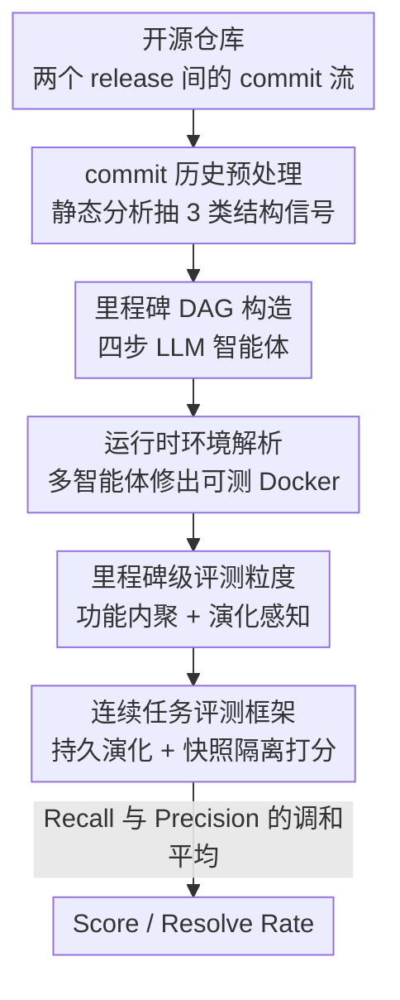

# EvoClaw: Evaluating AI Agents on Continuous Software Evolution

**会议**: ICML2026  
**arXiv**: [2603.13428](https://arxiv.org/abs/2603.13428)  
**代码**: https://github.com/EvoClaw-Bench/EvoClaw （含 DeepCommit 流水线、数据集、榜单 evo-claw.com）  
**领域**: Agent  
**关键词**: 编码智能体、软件演化、长程评测、里程碑 DAG、技术债

## 一句话总结
EvoClaw 提出"里程碑级"的软件演化评测范式：用 DeepCommit 流水线把开源仓库的噪声 commit 历史重建成可执行、可验证的里程碑依赖 DAG，让智能体在同一个持久化代码库上连续完成一串有依赖的开发任务，结果发现 12 个前沿模型在独立任务上能拿 >80% 的分，到连续演化场景却最高只有 38%，暴露出它们在长程维护与抑制错误传播上的根本短板。

## 研究背景与动机
**领域现状**：编码智能体（Claude Code、Codex、Gemini CLI、OpenHands 等）正越来越多地被部署成"长期运行的系统"，需要自主开发、持续迭代一套面向环境的软件。配套的评测基准也从早期的单函数补全（HumanEval）一路演进到 issue 修复（SWE-bench）、再到整仓生成（Commit0、ProgramBench）。

**现有痛点**：但这些基准几乎都把开发当成一个个**互相独立、做完就重置**的快照任务。它们要么对照每一步的 ground-truth 状态打分，要么在干净代码库上孤立地评一道题，完全没有建模软件演化里最关键的东西——**任务之间的时序依赖与技术债的累积**。一个智能体可以靠走捷径让眼前的测试通过，却悄悄埋下债务损害长期可维护性，而这种失败模式在孤立评测里是**隐形**的。

**核心矛盾**：要复现真实演化，任务粒度的选择是个两难。**release 级**太粗：一次发布把上百个相互依赖的 commit 拍平成一次更新，丢掉了驱动演化的细粒度依赖结构；**commit 级**又太细且失衡：很多 commit 是 typo 这类琐碎改动，而线性的 commit 顺序只编码了"提交先后"，会在本不相关的改动之间引入虚假依赖。

**本文目标**：① 找到一个既保留细粒度依赖、又承载连贯功能目标的合适粒度；② 把噪声 commit 历史自动重建成**可编译、可测试**的演化序列；③ 在持久化代码库上连续评测智能体，让跨任务的错误传播变得可测量。

**切入角度**：作者提出在 **milestone（里程碑）级**建模——里程碑是一组"功能上内聚、共同推进某个开发目标"的 commit 集合。里程碑之间的功能依赖天然构成一个有向无环图（DAG），既保留真实的前置约束，又允许独立特性并行推进。

**核心 idea**：用 DeepCommit 这条 agentic 流水线，把原始 git 历史重组成**经过运行时验证的里程碑 DAG**，再用 EvoClaw 让智能体在一个持续演化的代码库上顺着 DAG 完成任务流，用兼顾"新功能完成度"与"回归安全性"的 Score 来衡量长程演化能力。

## 方法详解

### 整体框架
整个工作分两层：**DeepCommit** 负责"造数据"——把一个开源仓库在两个 release tag 之间的 commit 历史，自动重建成可执行的里程碑 DAG；**EvoClaw** 负责"做评测"——把这些 DAG 当作连续任务流，让被测智能体在持久环境里逐个里程碑地演化代码库，并用快照隔离的方式打分。

DeepCommit 本身是三阶段串行 + 全程质量门控的 agentic 流水线：先做静态分析把原始历史结构化（Phase 1），再用 LLM 智能体四步构造里程碑 DAG（Phase 2），最后逐个里程碑解析出可运行的 Docker 测试床（Phase 3）。EvoClaw 则在此之上定义连续评测框架与 Score 指标。

### 关键设计

**1. 里程碑级粒度：在 release 太粗与 commit 太细之间找平衡点**

这是全文的立论基石，直接针对"粒度两难"。作者把里程碑定义为一组"功能内聚、保持依赖约束"的 commit。相比 release，它保留了代码库的细粒度开发依赖与结构演化；相比 commit，它封装的是现实而连贯的功能目标，过滤掉了 typo、hotfix 这类噪声，也避免了线性 commit 顺序带来的虚假依赖。里程碑之间的功能依赖构成 DAG：$M_i$ 只有在它的全部前置里程碑都完成后才被解锁，从而既编码真实的前置约束，又允许互不相关的特性并行展开。为保证里程碑之间规模不至于过于悬殊，流水线以"每里程碑 LoC 的变异系数 $\mathrm{CV}<1.0$"为目标，最终在 EvoClaw 上达到 $\mathrm{CV}=0.96$。

**2. DeepCommit 三阶段重建：把噪声 git 史变成可执行的演化序列**

难点在于"重排+分组 commit"会破坏原生 git 历史——重排后的补丁打上去经常无法编译、收集不到测试，直接威胁基准的可执行性。DeepCommit 用三阶段化解。Phase 1 预处理：把主分支 release 区间建模成线性 commit 序列（贴合最主流的 squash-and-merge 工作流），收集 PR/Issue/Release 元数据，并用静态分析抽出三类结构信号——基于 `git blame` 的 commit 级 DAG（行级文本依赖）、符号级修改（类/函数的增删改）、文件级共改统计（演化耦合）。Phase 2 用四步 LLM 智能体构造里程碑 DAG（见设计 3）。Phase 3 运行时环境解析：由 MainAgent 编排多智能体，为每个里程碑按拓扑序 cherry-pick 其 commit、重建代码状态，EnvAgent 从仓库 CI/CD 生成 Dockerfile 并强制三道硬门——**源码能编译、测试框架能成功收集、补丁引用的测试尽量被纳入**；cherry-pick 冲突就回去修 DAG（补上缺失的跨里程碑依赖边、或把错挂的 commit 挪到正确里程碑）。靠 Claude Opus 4.5 驱动，整条流水线把平均测试收集成功率做到了 **87.1%**。

**3. 四步里程碑 DAG 构造：从离散 commit 里"长"出功能内聚的节点**

把上百个离散 commit 组织成功能内聚的里程碑，需要把结构依赖和代码级推理结合起来。作者用四个带质量门的阶段递进构造：**Seed Discovery**——LLM 智能体结合 commit 语义（commit message、关联讨论）与结构信号（DAG 拓扑，如出度、后代数）挑出"引入一个独立开发主题"的种子 commit，过滤掉装饰性编辑和无下游影响的跟随补丁；**Milestone Consolidation**——并行子智能体以共享文件改动、时间邻近、PR/Issue 引用为线索把种子扩展成里程碑，再由一个协调智能体解决"同一 commit 被多个里程碑认领"的冲突，保证每个 commit 恰属一个里程碑、完整覆盖、无环；**Dependency Inference**——多数依赖边直接来自预处理的行级文本依赖，更微妙的（如不共享 hunk 的调用关系）由智能体用符号级分析与文件共改提出并校验；**Milestone Decompose**——过大的里程碑按功能边界拆成独立子里程碑，过小的并入相邻节点，依赖同步更新以保持合法 DAG。阶段之间还能 fan-out 出多个候选实例，保留最满足下游质量门的那个。

**4. 连续评测框架 + Score 指标：让错误传播可测、让"做功能"与"防回归"都不能偏废**

EvoClaw 的评测框架由三部分组成：**依赖驱动的任务流**（外部 planner 按 DAG 动态解锁里程碑）、**连续演化环境**（每个任务的改动持久保留进下一个任务，迫使智能体维护代码库长期健康）、**快照隔离评测**（"就地开发、隔离评测"——任务完成时把实现状态快照转入隔离容器跑测试，保证打分可复现又不打断开发）。指标上，传统的二值通过率会把"实现新功能"和"保持旧行为"两个目标混为一谈，于是作者把性能拆成两维。Recall 衡量新功能完成度：

$$\text{Recall}_m=\frac{N_{\text{fixed},m}}{N_{\text{required},m}}$$

其中 $N_{\text{required},m}$ 是里程碑 $m$ 的 Fail-to-Pass（F2P，打上 gold patch 后由失败转通过）测试总数，$N_{\text{fixed},m}$ 是智能体真正修好的数量。Precision 衡量修改可靠性，即"测试状态变化里有多少是改进而非回归"：

$$\text{Precision}_m=\frac{N_{\text{fixed},m}+\epsilon}{N_{\text{fixed},m}+N_{\text{broken},m}+\epsilon}$$

$N_{\text{broken},m}$ 是因智能体改动而回归（原本 Pass-to-Pass 却挂掉）的测试数，$\epsilon=1$ 是平滑项。单里程碑得分取两者调和平均 $\text{Score}_m=\frac{2\cdot\text{Precision}_m\cdot\text{Recall}_m}{\text{Precision}_m+\text{Recall}_m}$，最终 Score 是所有里程碑的平均。这样设计保证"只堆功能但到处引入回归"和"只保旧功能但毫无进展"两类智能体都拿低分。此外还报告更严格的 **Resolve Rate**：唯有 F2P 与 P2P 测试全过才算解决一个里程碑。

### 一个完整示例
以一次连续评测为例：planner 先解锁没有前置依赖的里程碑（如 M1、M2），智能体在持久代码库里实现它们；M1、M2 完成并通过后，框架对当前状态打一次快照、转入隔离容器跑 F2P/P2P 测试算 Score，同时 planner 解锁下游的 M3 供智能体继续 fetch。整个过程是"持续且有状态"的开发循环——如果智能体在 M1 里埋了个 latent bug 却让 F2P 过了，这个债务会沿依赖链传到 M3，让后续测试更难全过，从而在 Precision 与 Resolve Rate 上付出代价。EvoClaw 最终含 7 个仓库、98 个验证过的里程碑、109 条里程碑间依赖，覆盖 Go/Rust/Java/TypeScript/Python 五种语言，平均每里程碑改 27.4 个文件、含 17.1 个 F2P 测试与 6,218 个 P2P 回归测试。

## 实验关键数据

### 主实验
作者用 EvoClaw 评了 4 个智能体框架下的 12 个前沿模型，对比"连续 vs 独立"两种设置。核心发现：独立任务上分数普遍 >80%，到连续演化场景骤降至最高 38.03%（Claude Opus 4.6），Resolve Rate 更是低到个位数。

| 框架 / 模型 | Score⋆ (%) | Precision (%) | Recall (%) | Resolve (%) | Cost ($) |
|--------|------|------|------|------|------|
| claude-code / Claude Opus 4.6 | **38.03** | 37.33 | 55.21 | 8.46 | 75.73 |
| claude-code / Claude Opus 4.6（CC 版） | 36.29 | 37.84 | 56.32 | 11.57 | 88.22 |
| codex / GPT 5.3-Codex | 28.88 | 27.81 | 49.70 | 9.58 | 25.01 |
| gemini-cli / Gemini 3 Pro | 24.25 | 25.46 | 32.70 | **13.37** | 114.96 |
| claude-code / Claude Sonnet 4.5 | 15.16 | 18.88 | 28.50 | 5.49 | 27.02 |

（⋆为主指标；不同框架下同名模型因脚手架/上下文管理不同分数有别。一次完整评测用前沿模型约花 $500。）

### 关键发现表

| 现象 | 表现 | 含义 |
|------|------|------|
| 连续 vs 独立 | >80% → ≤38.03% | 长程维护是真瓶颈，孤立评测严重高估能力 |
| Recall vs Precision 不对称 | Recall 近似线性增长、Precision 饱和 | 智能体会"写新功能"，但随系统演化越来越防不住回归 |
| 错误雪球效应 | 未解决的回归累积速度超过修复速度 | 早期 bug 沿依赖链污染下游，最终拖停整个开发 |
| 行为分析 | 主动探索代码库 + 严守测试验证者更能持续演化 | 盲目试错与"不做验证"会加速失败 |

### 关键发现
- **最致命的不是"不会写"，而是"维护不住"**：Recall 随演化线性增长说明局部实现能力还在，但 Precision 饱和说明智能体在系统级一致性维护上失守——长程能力的短板在"防回归"而非"做功能"。
- **错误传播是连续场景独有的杀手**：独立评测里被重置掩盖的技术债，在 EvoClaw 里会沿 DAG 依赖链滚成雪球，这是孤立基准根本测不出的失败模式。
- **数据质量经得起推敲**：100% commit 覆盖、环境诱发错误 ≤0.10%、Pass-to-Fail 翻转率 ≤0.026%、三次重跑过滤 flaky 测试、87.1% 测试收集率，保证"扣分来自智能体代码而非基础设施"。

## 亮点与洞察
- **"里程碑"这个粒度选得很巧**：它在 release 与 commit 两个极端之间精确卡位，既保留了驱动演化的细粒度依赖、又承载连贯的功能语义，还能用 $\mathrm{CV}<1.0$ 把任务规模拉均匀——这是把"软件演化"做成可评测对象的关键一步。
- **把"造数据"也做成 agentic 流水线**：DeepCommit 用静态分析 + LLM 智能体 + 运行时验证三件套，把噪声 git 史变成可执行 DAG，且明确是可随 LLM 进步而 scale 的框架，这套"重建可验证演化轨迹"的思路可迁移到训练数据合成、回归测试套件构造等场景。
- **Recall/Precision 调和平均的评测拆解很有借鉴价值**：用 F2P 测进展、用 P2P 测回归，单一 Score 就能同时惩罚"猛堆功能引回归"和"只求自保不进展"，比二值通过率信息量大得多，适合任何"边改边可能破坏存量"的长程任务。
- **"develop-in-place, evaluate-in-isolation" 的快照隔离设计**：兼顾了连续开发的有状态性与打分的可复现性，是把长程 agent 评测做扎实的工程巧思。

## 局限与展望
- **成本高**：一次完整评测用前沿模型约 $500，DeepCommit 重建还依赖 Claude Opus 4.5 与人类专家在关键决策点的引导，规模化扩张有现实门槛。
- **依赖人在环**：里程碑 DAG 的最终质量、SRS 规格的可解性都要专家复核，自动化程度还不是端到端；逆向工程出的 SRS 是否会泄露实现细节、是否完备，仍需人工把关。
- **覆盖面**：目前 7 仓库 98 里程碑、5 种语言，相对真实开源生态仍是小样本；不同仓库复杂度（9~23 里程碑）差异大，跨仓横向比较结论需谨慎。
- **改进方向**：把人在环的验证进一步自动化、用更便宜的模型驱动 DeepCommit、扩展到更多语言与更长演化区间，以及探究"为什么 Precision 会饱和"的内在机制。

## 相关工作与启发
- **vs SWE-bench / Multi-SWE-bench / SWE-bench Pro**：它们是 commit 级、孤立快照评测，每题在重置代码库上独立打分；EvoClaw 是里程碑级、在持久代码库上连续演化，把跨任务依赖与累积技术债显式建模成可测量量。
- **vs SWE-EVO（release 级）/ Commit0、ProgramBench（整仓生成）**：这些靠"放大单任务 scope"来追求长程，但仍在重置代码库上孤立评一道大题；EvoClaw 用 DAG 把里程碑串成有状态的任务流，让中间进展与错误传播都直接可见。
- **vs SWE-CI / SlopCodeBench（连续 SWE）**：SWE-CI 按原生 commit 顺序串 CI 轮次、且向智能体暴露 ground-truth 测试；EvoClaw 采用更粗、功能内聚的里程碑粒度并组织成 DAG，比零散的 commit 级 CI 更忠实也更灵活地建模连续演化。
- **vs 性能优化类基准（KernelBench 等）**：它们面向"提速"这类闭合目标（如对照专家参考的墙钟时间）；EvoClaw 面对的是开放式的通用功能开发，没有单一参考答案。

## 评分
- 新颖性: ⭐⭐⭐⭐⭐ 首个把"连续软件演化"做成可执行里程碑 DAG 评测的工作，粒度选择与数据重建都有原创性。
- 实验充分度: ⭐⭐⭐⭐⭐ 12 模型 × 4 框架，连续/独立对照 + 行为分析 + 严格的数据质量审计。
- 写作质量: ⭐⭐⭐⭐ 动机层层递进、指标定义清晰；流水线细节多、需配图反复对照。
- 价值: ⭐⭐⭐⭐⭐ 揭示了长程编码智能体被孤立评测严重高估的真实短板，对 agent 评测方向有指引意义。

<!-- RELATED:START -->

## 相关论文

- [\[ICML 2026\] SE-GA: Memory-Augmented Self-Evolution for GUI Agents](se-ga_memory-augmented_self-evolution_for_gui_agents.md)
- [\[ICLR 2026\] OpenAgentSafety: A Comprehensive Framework for Evaluating Real-World AI Agent Safety](../../ICLR2026/llm_agent/openagentsafety_a_comprehensive_framework_for_evaluating_real-world_ai_agent_saf.md)
- [\[ACL 2026\] CoEvolve: Training LLM Agents via Agent-Data Mutual Evolution](../../ACL2026/llm_agent/coevolve_training_llm_agents_via_agent-data_mutual_evolution.md)
- [\[ACL 2026\] WebClipper: Efficient Evolution of Web Agents with Graph-based Trajectory Pruning](../../ACL2026/llm_agent/webclipper_efficient_evolution_of_web_agents_with_graph-based_trajectory_pruning.md)
- [\[ICML 2026\] ExCyTIn-Bench: Evaluating LLM Agents on Cyber Threat Investigation](excytin-bench_evaluating_llm_agents_on_cyber_threat_investigation.md)

<!-- RELATED:END -->
