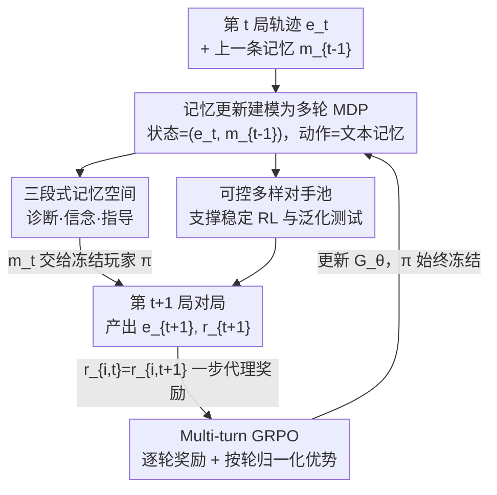

# From Player to Master: Enhancing Test-Time Learning of LLM Agents via Reinforcement Learning over Memory

**会议**: ICML2026  
**arXiv**: [2606.08656](https://arxiv.org/abs/2606.08656)  
**代码**: 公开（论文声明 publicly available）  
**领域**: LLM Agent / 测试时学习 / 多轮强化学习  
**关键词**: 测试时学习, 记忆更新, multi-turn GRPO, 信用分配, 即插即用记忆

## 一句话总结
MemoPilot 是一个即插即用的「记忆副驾」——它不动玩家 LLM（冻结），而是单独训练一个记忆模型，用 multi-turn GRPO 把「每局交互后怎么更新记忆」当成一个端到端可优化的多轮决策问题，配上逐轮奖励和按轮归一化的优势估计，让一个冻结玩家在重复对局中真正「越打越强」，在石头剪刀布和限注德州扑克两个测试床上 Elo 双双第一，超过包括 DeepSeek-V3.2 在内的所有记忆基线和专有模型。

## 研究背景与动机
**领域现状**：LLM agent 越来越多被部署在「长期反复交互」的场景里，一个核心能力是**测试时学习（test-time learning, TTL）**——在部署期间靠累积经验越来越好。主流做法是给 agent 加一块**显式文本记忆**：每次交互后更新记忆，用它指导后续决策（Reflexion、ExpeL、Dynamic Cheatsheet、ReasoningBank 等）。

**现有痛点**：这些方法绝大多数靠**手工设计的提示规则**来更新记忆，而不是端到端优化记忆更新策略。作者在 pilot 观察里发现，即便是很强的指令跟随 LLM，只靠这类启发式机制驱动记忆更新，也无法在重复交互中稳定提升——记忆更新和下游目标之间的对齐是断的。

**核心矛盾**：记忆更新的好坏最终要由「下游多步任务表现」来评判，但启发式 prompt 规则既不知道下游目标、也没有跨多轮的信用分配，于是「写了一堆记忆」和「这些记忆真的帮玩家赢了」之间没有训练信号去拉齐。更根本地，「在测试时学会变强」这件事几乎从没被当成一个**可训练的能力**来对待。

**本文目标**：把记忆更新过程本身变成可训练的对象，让记忆质量直接以「冻结玩家的累积表现」为优化目标。

**切入角度**：把记忆看成一个跨多次交互不断精炼的「演化产物」，于是记忆更新天然是一个多轮决策问题——可以用 RL 端到端优化，玩家表现就是现成的奖励。

**核心 idea**：用 multi-turn GRPO 训练一个独立的记忆生成模型 $G_\theta$，玩家 $\pi$ 全程冻结；关键是引入**逐轮奖励**和**按轮（turn-level）归一化的优势**，把信用精确分到「最近这一次记忆更新」上，从而在多轮随机环境里得到稳定、细粒度的学习信号。

## 方法详解

### 整体框架
MemoPilot 的设定是一个序列博弈式 TTL：agent 依次玩 $T$ 局游戏 $\{g_t\}$，每局产出交互轨迹 $e_t$ 和标量奖励 $r_t$。一个**可训练记忆模型** $G_\theta$ 在线读「上一局轨迹 + 上一条记忆」产出新记忆 $m_t=G_\theta(e_t,m_{t-1})$，并把它交给一个**冻结玩家** $\pi$ 在下一局使用；玩家是跨局无状态的，每局只 condition 在当前记忆上。所有跨局学习都压在演化的记忆里，$\pi$ 始终不变——这正是「即插即用」的含义。

训练时把记忆更新建模成 MDP，用 multi-turn GRPO 优化 $G_\theta$，目标是最大化记忆引导下的累积回报（第一局是无引导的初始探索，故回报从第二局算起 $R(\tau)=\sum_{t=1}^{T-1}r_{t+1}$）。为了在多轮随机环境里稳住信用分配，作者不用长程回报，而用「下一局结果」作为逐轮的一步代理奖励。

### 关键设计

**1. 把记忆更新建模成多轮 MDP：让「下一局赢不赢」成为记忆的训练信号**

痛点是启发式记忆更新和下游目标脱节。作者把多轮记忆更新形式化为 $\mathcal{M}=(\mathcal{S},\mathcal{A},\mathcal{P},\mathcal{R})$：状态 $s_t=(e_t,m_{t-1})$ 是「最新轨迹 + 上一条记忆」，动作空间是文本记忆本身，记忆模型作为策略采样 $m_t\sim G_\theta(\cdot\mid s_t)$；转移 $\mathcal{P}$ 由冻结玩家 $\pi$ 在新环境实例 $E_{t+1}$（如扑克的私牌、公共牌、位置）下与对手交互诱导，产出下一条轨迹和奖励；奖励 $\mathcal{R}$ 直接返回这一局的游戏结果。这样一来，记忆质量就被「下游任务表现」自动评判——记忆写得好不好，不靠人定规则，靠玩家赢没赢。

**2. Multi-turn GRPO + 一步代理奖励 + 按轮优势：在多轮随机环境里稳住信用分配**

核心机制是把 GRPO 从「(组, token)」结构扩展到「(组, 轮, token)」。在 rollout 阶段，旧策略 $G_{\theta_\text{old}}$ 为每个对手策略 $\sigma$ 生成 $G$ 条并行 episode，每条 episode 产出 $T-1$ 次记忆生成。关键的两点：

其一，**逐轮一步代理奖励**：理论目标是累积回报，但实践中给每一轮分配的回报是 $R_{i,t}=r_{i,t+1}$，即只看「这次记忆更新带来的下一局结果」。用长程回报会把学习信号耦合到未来的随机性（比如后面发到的牌不一样），放大环境噪声、让信用分配不稳；一步代理避开了这个问题，给出更干净的逐轮信号。

其二，**按轮组归一化优势**：

$$
\hat{A}_{i,t}=R_{i,t}-\mathrm{mean}\big(\{R_{i,t}\}_{i=1}^{G}\big),\qquad R_{i,t}=r_{i,t+1}
$$

优势在「同一轮 $t$、$G$ 条 rollout 之间」做组归一化（跟随 Liu et al. 2025b 省略标准差归一化），并施加到该轮记忆 $m_{i,t}$ 的所有 token 上。损失是带裁剪的多轮代理目标，重要性采样权重 $r_{i,t,k}(\theta)$ 按 token 算，整体在 $(i,t,k)$ 三层求和后做 token 级平均。这套设计让每一轮的记忆更新都拿到「与同轮其他 rollout 相比好多少」的细粒度信用，是多轮 TTL 能稳定训练的关键。

**3. 三段式记忆空间：用「诊断—信念—指导」支撑假设-验证循环**

记忆不是一团自由文本，而被结构化为三个组件：**诊断分析（Identification）**——总结近期交互证据、更新对对手策略的假设；**显式信念状态（Maintenance）**——在固定记忆预算下记录当前假设及其置信/验证状态；**可执行指导（Guidance）**——给冻结玩家下一局能直接照做的简洁动作建议。推理时这三者构成一个迭代更新过程：新证据进来 → 修订诊断和信念 → 相应更新指导。信念里的验证/置信信号还提供了天然的停机准则——一旦假设被充分确认，就不必再改记忆。这把「在测试时学习」具象成一个「假设-验证（hypothesize-and-verify）」循环：观察证据 → 提出/精炼假设 → 用累积证据验证 → 修正先前结论。

**4. 可控多样的对手构造：让 TTL 既有可学结构又能系统测泛化**

要训练「学会利用对手」的记忆，对手池必须同时满足可控、多样、训练-测试可分。作者用三条原则构造对手：**可控性**——每个对手用可执行指令指定，保证 RL 训练和评测可复现；**行为多样性**——LHE 变化动作频率偏好、各街的激进度、欺骗模式（如 check-raise 陷阱），RPS 覆盖开环序列、一步反应规则、多步反制模式；**机制化的训练-测试分离**——留出策略保持战略意图但改变触发条件或信息揭示阶段，专门检验记忆能否随证据累积维护并修订假设。构造走「人在回路」管线：资深玩家写种子策略 → LLM 改写扩展标准化 → 人工验证一致性，并用 round-robin 对局估计每个对手的 Elo，确认训练/测试池覆盖足够宽的难度区间。

## 实验关键数据

### 主实验
两个策略博弈测试床：多轮石头剪刀布（RPS，每局 6 轮、双方看完整历史）和限注德州扑克（LHE，含不完全信息 + 随机性，用「duplicate match 交换位置共享发牌」消除牌运方差）。指标 RPS@k / LHE@k 为 $k$ 局的平均每局得分/筹码，统一 mean@64、记忆预算 512 token。MemoPilot 基座为 Qwen2.5-14B-Instruct，RPS 和 LHE 各训一个记忆模型。

| 方法 | RPS@5 (Qwen2.5-14B 玩家) | LHE@5 (Qwen2.5-14B 玩家) | RPS@5 (Qwen3-235B 玩家) | LHE@5 (Qwen3-235B 玩家) |
|------|------|------|------|------|
| No Memory | 0.43 | −1.36 | 0.44 | −1.46 |
| Full History | 0.02 | −1.22 | 0.03 | −1.45 |
| Human Counter-Strategy | 1.0 | 1.08 | 0.57 | 0.39 |
| ReasoningBank | 0.81 | −1.14 | 0.81 | −0.87 |
| Memory w/ DeepSeek-V3.2 | 1.64 | −0.78 | 1.46 | −0.60 |
| **Memory w/ MemoPilot** | **3.28 (+3.10)** | **2.03 (+2.30)** | **3.27 (+2.90)** | **1.31 (+1.60)** |

（括号内为相对「Memory w/ Qwen2.5-14B」基线的绝对提升。）MemoPilot 在两个游戏、两个冻结玩家下全面领先，Elo 双双第一（LHE 1762、RPS 1590），超过所有 prompting 基线、记忆基线与专有模型。

### 泛化 / 跨域评测

| 评测 | 设置 | 关键结果 |
|------|------|----------|
| 零样本换玩家 | 训练用 Qwen2.5-14B，评测换更强的 Qwen3-235B-A22B | RPS@5 达 3.27、LHE@5 达 1.31，记忆行为可迁移 |
| StreamBench (CoSQL/DS-1000) | Qwen2.5-14B 执行 agent，32 个留出 episode × 5 连续任务 | 在两个任务上均取得最佳（Full History 仅边际增益，prompt 记忆不提升） |

### 关键发现
- **启发式记忆基本失效**：prompting 类记忆基线在 RPS 上只有有限提升、在 LHE 上普遍为负，印证「靠手写规则更新记忆」在在线 TTL 里不可靠。
- **更长历史反而有害**：Full History 在 RPS 表现差、LHE 持续为负——简单堆历史引入噪声、稀释下一步所需的可执行信号；MemoPilot 把经验压成紧凑记忆反而保留了最相关信息，佐证「选择性记忆」的必要性。
- **学得快且能泛化**：MemoPilot 在最初几局内就快速提升，且跨不同冻结玩家保持同样模式，说明它学到的是「从早期经验提取可迁移战略信号」的鲁棒更新行为，而非脆弱的模型专属 prompt 配方。

## 亮点与洞察
- **把「测试时学习」变成可训练能力**：以往 TTL 靠手写记忆规则，本文第一次把「记忆更新策略」端到端训出来，记忆质量直接以下游玩家表现为优化目标，思路清晰且可复用。
- **一步代理奖励的取舍很聪明**：在多轮随机环境里，用「下一局结果」而非长程回报做逐轮信用，主动牺牲长程信号换取低方差和稳定训练——这个 trade-off 对任何多轮 agent RL 都有借鉴意义。
- **三段式记忆空间自带停机准则**：把记忆拆成诊断/信念/指导，信念里的置信状态天然给出「假设已确认就停止改记忆」的机制，比无结构自由文本记忆更可控。
- **即插即用 + 冻结玩家可迁移**：记忆模型和玩家解耦，训练用小玩家、部署可换大玩家且增益保持，工程上非常友好。

## 局限与展望
- **评测集中在策略博弈**：主结果在 RPS / LHE 两个可控游戏上，虽补了 StreamBench，但「可利用的对手结构」是这类环境的前提，迁移到无明确对手、奖励稀疏或长程的真实任务还需验证。
- **一步代理奖励放弃长程信用**：用下一局结果做信用虽稳，但对「需要跨多局铺垫才显效」的策略可能欠优化，长短程信用的平衡是开放问题。
- **依赖人在回路的对手构造**：可控多样对手池靠资深玩家种子 + LLM 改写 + 人工验证，迁移到新领域的构造成本不低。
- 每个游戏单独训一个记忆模型，跨任务统一的记忆策略、以及记忆预算（512 token）对更复杂任务是否够用，都值得进一步研究。

## 相关工作与启发
- **vs Reflexion / ExpeL**：他们靠反思与经验累积迭代改进，但记忆更新是启发式的；MemoPilot 把记忆更新策略端到端训练，信号直接来自下游表现。
- **vs Dynamic Cheatsheet / ReasoningBank**：同样维护演化记忆 / 蒸馏可复用推理策略，但仍是 prompt 驱动的更新规则；本文的差异在于用 multi-turn GRPO 优化更新过程本身，实验中也显著超过 ReasoningBank。
- **vs Full History / 长上下文记忆**：直接堆历史会稀释信号且在 LHE 为负；MemoPilot 用结构化压缩记忆保留可执行信息，体现「选择性记忆 > 全量历史」。

## 评分
- 新颖性: ⭐⭐⭐⭐ 把记忆更新当可训练多轮决策、并配逐轮奖励+按轮优势，是 TTL 方向一个扎实的新角度
- 实验充分度: ⭐⭐⭐⭐ 两游戏×两玩家+Elo+StreamBench 跨域，对比基线丰富；但博弈环境较受控，真实长程任务覆盖有限
- 写作质量: ⭐⭐⭐⭐ 动机—形式化—训练配方层层递进，记忆三段式与对手构造讲得清楚
- 价值: ⭐⭐⭐⭐ 即插即用、冻结玩家可迁移，对长期部署 agent 的在线自改进很有实用价值

<!-- RELATED:START -->

## 相关论文

- [\[ICML 2026\] AdaMEM: Test-Time Adaptive Memory for Language Agents](adamem_test-time_adaptive_memory_for_language_agents.md)
- [\[ICML 2026\] On Information Self-Locking in Reinforcement Learning for Active Reasoning of LLM Agents](on_information_self-locking_in_reinforcement_learning_for_active_reasoning_of_ll.md)
- [\[ICML 2026\] Position: Modular Memory is the Key to Continual Learning Agents](position_modular_memory_is_the_key_to_continual_learning_agents.md)
- [\[ICML 2026\] Agentic Monte Carlo: Simulating Reinforcement Learning for Black-Box Agents](agentic_monte_carlo_simulating_reinforcement_learning_for_black-box_agents.md)
- [\[ACL 2026\] Hierarchical Reinforcement Learning with Augmented Step-Level Transitions for LLM Agents](../../ACL2026/llm_agent/hierarchical_reinforcement_learning_with_augmented_step-level_transitions_for_ll.md)

<!-- RELATED:END -->
