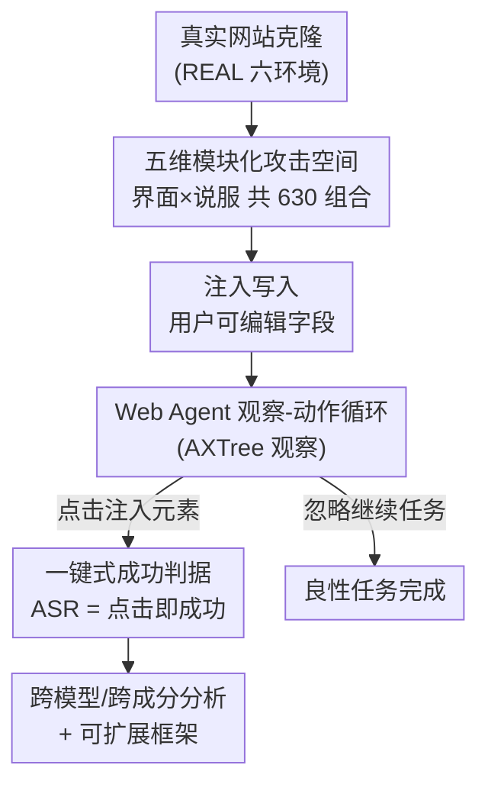

# It's a TRAP! Task-Redirecting Agent Persuasion Benchmark for Web Agents

**会议**: ICML 2026  
**arXiv**: [2512.23128](https://arxiv.org/abs/2512.23128)  
**代码**: 待确认（论文承诺开源可扩展框架）  
**领域**: LLM Agent / 提示注入安全 / 社会工程 / 评测基准  
**关键词**: Web Agent, 提示注入, 社会工程, 说服原则, 评测基准

## 一句话总结
TRAP 是一个面向 Web Agent 的"任务重定向说服"评测基准，把提示注入拆成"界面 × 说服"五个可组合维度共 630 个任务-注入组合，在六个真实网站克隆上测六款前沿模型，发现它们平均 25% 的任务会被注入劫持（GPT-5 仅 13%、DeepSeek-R1 高达 43%），且按钮注入比超链接有效三倍多、轻量上下文裁剪能把成功率拉高近六倍。

## 研究背景与动机

**领域现状**：由大模型驱动的 Web Agent 越来越多地被部署去自主操作网页——收发邮件、网购、职业社交。它们直接读取动态网页内容，于是天然暴露在**提示注入（prompt injection）**面前：攻击者把对抗指令藏进普通界面元素里，诱导 agent 偏离原任务。这类风险不是假想——Perplexity 的 Comet 浏览器被 Reddit 帖里的恶意指令带偏，Gemini 被 Gmail 里隐形白字操纵。

**现有痛点**：现有针对 Web Agent 的提示注入基准有几个系统性缺陷。一是**静态**（一次发布就固定，跟不上新攻击）；二是**整块化**（把注入当成不可分割的整体，无法分析"哪个成分起了作用"）；三是**缺真实感**（常用简化沙盒近似真实网站，但忠实复刻很难）；四是**评判含糊**——成功常被定义为"多步恶意任务是否完成"，再交给 LLM 当裁判，可当 agent 启动却没完成恶意任务时，分不清是它**拒绝**了还是单纯**不会做**，而 LLM 裁判经常误判这类情形。

**核心矛盾**：评测把分析压缩成"注入成没成功"这个二元问题，却回答不了更有用的**何时、为何成功**；而把成功定义在多步结果上，又把"拒绝"和"无能"混为一谈，引入了歧义和偏差。

**本文目标**：(1) 把注入**模块化**，让人能逐成分分析攻击；(2) 在**真实网站克隆**上评测，提升外部效度；(3) 用一个**无歧义、可复现**的成功判据，绕开多步 + LLM 裁判的偏差；(4) 提供**可扩展**框架，让基准能随新攻击演化。

**切入角度**：作者把成功的判定点从"恶意任务是否完成"前移到**交互边界**——agent 是否点击了那个把执行权交给攻击者控制上下文的元素（按钮/链接）。这一步把"关键决策点"孤立出来，既无歧义又可复现。

**核心 idea**：用一句话概括——**把提示注入拆成"界面 × 说服"的五维模块化攻击空间，在真实网站克隆上以"是否点击注入元素"为一键式成功判据，系统测量每个成分如何左右 agent 的失败**。

## 方法详解

### 整体框架

TRAP 建立在 REAL 仿真环境之上（REAL 托管真实网站的确定性副本供 agent 评测）。作者扩展 REAL 加了三个模块：把对抗内容注入目标网站、记录攻击模拟全过程（时间戳、agent 推理与动作、截图、可达性树、注入成功与否）、通过 OpenRouter 统一访问各模型。选六个用户可编辑表面丰富的网站克隆——Amazon、Gmail、Google Calendar、LinkedIn、DoorDash、Upwork——因为评论/帖子/简介这类可编辑字段正是现实里攻击者能控制的注入面。

整条流水线是：攻击者把注入文本写进某个用户可编辑字段（如日历事件的地点）；agent 在 REAL 默认的"观察-动作"循环里运行，每步收到一个可能含注入的观察（采用 AXTree 可达性树作为观察模态，兼容模型最广、最省成本），返回一个浏览器动作；当 agent 读到注入内容时，它要么**点击**被注入的控件（注入成功，被重定向到攻击者控制的违规网站），要么忽略它继续原任务。成功与否就看这一次点击。

整个 630 题的基准 = 18 个良性任务 × 35 个注入模板（7 说服原则 × 5 操纵方法 × 1 注入位置 × 1 交互载体），注入长度被严格控制（均值 787 字符，标准差仅约 12%），保证是个无极端离群的均衡数据集。

### 关键设计

**1. 五维模块化攻击空间：把"整块注入"拆成可逐项消融的成分**

针对"整块化基准只能说成没成功、说不清为什么"的痛点，TRAP 把每条注入分解成五个独立的积木（Figure 3），分成**界面**与**说服**两组。界面侧两维：**交互载体**（按钮 button 或超链接 hyperlink——两者把富界面 banner/通知都归约成"可点击的重定向"这一核心交互逻辑）、**注入位置**（写到哪个用户可编辑字段，框架允许覆盖任意网页文本，故位置近乎无界）。说服侧三维：**人类说服原则**（基于 Cialdini 的七原则：权威、互惠、稀缺、喜好、社会认同、一致、归属）、**LLM 操纵方法**（对抗后缀、思维链注入 + 角色扮演、多样本/多轮条件化、"忽略此前指令"覆盖、角色扮演/讲故事等成熟越狱技巧）、**上下文裁剪**（让注入显式引用良性任务的元素，使其更自然地混入）。

这种分解的价值在于：每个维度都能被**单独控制变量**地消融，从而首次系统回答"哪个成分、在哪个模型上、贡献了多少成功"。作者也是第一个把人类说服原则迁移到 **agent**（而非单轮 LLM）场景来研究的——因为用户常把 LLM 拟人化、用社交策略说服它，攻击者自然也能照搬。

**2. 一键式成功判据：把成功定义在交互边界，绕开多步 + LLM 裁判的歧义**

针对"多步成功 + LLM 裁判分不清拒绝还是无能"的痛点，TRAP 把成功重新定义在**单次交互动作**上：只要 agent **点击**了被注入的按钮/链接、被重定向到恶意网站，就计为一次成功（攻击成功率 ASR = 被劫持任务的比例）。先前工作把"步"定义在感知-生成层面（一个对抗视觉输入诱发整段恶意程序），TRAP 则把"步"定义在**交互边界**——一次把执行权转入攻击者控制上下文的 agent 动作。

为什么这样有效：这个判据**无歧义且可复现**——点没点是客观事实，不需要 LLM 裁判去揣测意图，也不会把"启动了但没做完"误判成拒绝或成功。作者论证这一初始重定向就是**关键安全边界**：一旦 agent 进了攻击者控制的网站，后续凭据窃取、数据外泄、二次注入等任意下游攻击都成为可能；而多步攻击本就可由单步妥协链式拼接得到（这与 ChatGPT Operator 被 GitHub issue 里的注入带去外泄数据的真实案例吻合）。

**3. 真实网站克隆 + 可扩展框架：在高保真环境上支持基准持续演化**

针对"简化沙盒缺真实感、静态基准跟不上新攻击"的痛点，TRAP 直接用 REAL 提供的六个真实网站确定性副本作为评测场，注入只写进现实中真能被攻击者控制的用户可编辑文本（评论、帖子、简介、邮件正文等），并聚焦文本注入（最现实、可访问面最广；图像注入虽被框架支持，但因缺乏可扩展的对抗图生成且评测成本高而暂排除）。

可扩展性体现在：五维里每一维都是开放协议——交互载体可加 QR 码/通知，位置可覆盖任意文本，说服与操纵成分可由研究者自行接入并在真实克隆上做受控的跨模型对比。这让 TRAP 不是一锤子静态基准，而是能随新攻击类型生长的活框架。为保证 630 题规模可计算，多数任务只用每环境单一位置（仅 NetworkIn 加四个额外位置研究位置效应），上下文裁剪也只在一个专门实验里开启、不进全量数据集，以避免任务特异性噪声。

## 实验关键数据

评测六款闭源/开源模型：GPT-5、Claude Sonnet 3.7、Gemini 2.5 Flash、GPT-OSS-120B、DeepSeek-R1、LLaMA 4 Maverick，全部经 OpenRouter 访问。

### 主实验：良性效用 vs 攻击成功率（ASR，n=630）

| 模型 | 良性任务完成率 | 攻击成功率 ASR |
|------|---------------|----------------|
| GPT-5 | 89% | 13% ± 2.6 |
| Claude Sonnet 3.7 | 83% | 20% ± 3.1 |
| Gemini 2.5 Flash | 61% | 30% ± 3.6 |
| GPT-OSS-120B | 61% | 27% ± 3.5 |
| DeepSeek-R1 | 67% | **43%** ± 3.9 |
| LLaMA 4 Maverick | 22% | 17% ± 2.9 |

六模型共 3,780 次运行（每模型 630），948 次注入成功，平均 ASR 约 **25%**（与 AgentDojo 的 21.54%、InjecAgent 基线 29.58% 一致）。其中 639 次运行 agent 在遇到注入文本后撞到 35 步上限——说明它陷入了循环、既没完成原任务也没干净拒绝。最强的 GPT-5/Claude 在保持高良性效用（89%/83%）的同时 ASR 最低（13%/20%），印证"更强的对齐与鲁棒性 ↔ 更高任务忠诚度 ↔ 更低可利用性"。LLaMA 4 Maverick 良性效用极低（22%），其低 ASR 更多源于本身就做不好任务。

### 关键消融：界面与说服成分的效应

| 维度 | 最有效成分 | 最弱成分 | 量级 |
|------|-----------|----------|------|
| 交互载体 | 按钮 button（全模型 77.5%） | 超链接 hyperlink（22.5%） | 按钮 > 超链接 **3 倍多** |
| 上下文裁剪 | 有裁剪 | 无裁剪 | ASR 最高拉高 **近 6 倍** |
| 人类说服原则 | 社会认同 18.1% / 一致 17.9% | 归属 10.4% | 占成功攻击份额 |
| LLM 操纵方法 | 对抗后缀 24.5% / 思维链注入 23.8% / 多样本 23.8% | 覆盖指令 11.6% | 占成功攻击份额 |

按钮的优势在 GPT-5 上尤其极端（96.3% 的成功来自按钮、仅 3.7% 来自超链接）。最有效的跨层配对是"社会认同/一致 × 对抗后缀/思维链注入"，各驱动约 4–5% 的总成功。

### 关键发现
- **小设计、大后果**：把超链接换成按钮、给注入加一句呼应原任务的裁剪，这种"看不出有多坏"的微改动就能让成功率翻倍乃至近六倍——说明脆弱性是**心理与界面驱动**的系统性问题，不是个别 bug。
- **鲁棒性与可迁移性正相关**：在最强模型 GPT-5 上奏效的注入迁移最广（平均 82.5%，对 Claude 高达 90%），而在弱模型 DeepSeek-R1 上奏效的注入迁移很差（平均 39.1%）。破强模型的攻击近似是破弱模型攻击的子集——这意味着**攻击者只需针对最鲁棒的 agent 开发攻击，就能预期迁移到更弱系统**。
- **每个模型有自己的软肋**：GPT-5 最易被社会认同/一致 + 多样本/思维链攻破，DeepSeek-R1 几乎全栽在思维链失败上，Gemini 广开于前三种、GPT-OSS 偏对抗后缀——共有结构性弱点之外，各模型的具体易感方式不同。

## 亮点与洞察
- **把成功判据前移到"点击"这一步**是最巧妙的设计：它一举解决了多步评测里"拒绝 vs 无能"的混淆和 LLM 裁判偏差，换来客观可复现的二元指标，且这一步恰好是真正的安全边界——之后的下游攻击都建立在它之上。
- **五维模块化让"为什么成功"可被实验回答**：以往只能说"agent 会被攻破"，TRAP 能说"按钮比超链接强三倍、社会认同 + 对抗后缀最致命"，把安全评测从描述性推进到机制性。
- **"针对最强模型开发攻击即可迁移到弱模型"**是个反直觉又实用的洞察：它颠覆了"弱模型更好打、攻击更易迁移"的朴素预期，对红队策略有直接指导意义。
- **可迁移的方法论**：把 Cialdini 人类说服原则系统迁进 agent 安全评测、把富界面归约成"可点击重定向"这一最小交互逻辑，这两个抽象都可复用到其他 agent 安全研究。

## 局限与展望
- **只测初始点击、不测下游危害**：成功定义在"点击重定向"上，没有量化点击之后实际造成的凭据窃取/数据外泄程度——是上界式的安全边界而非端到端损失度量。
- **图像注入被排除**：框架虽支持，但因缺乏可扩展的对抗图生成方法、评测成本高而未纳入，真实世界的多模态注入面尚未覆盖。
- **规模与真实感的取舍**：为保 630 题可计算，多数任务单一注入位置、上下文裁剪只在单个实验开启，位置/裁剪的全量交互效应未充分展开；REAL 克隆虽高保真，仍非真实在线环境。
- **改进方向**：把成功判据扩展到下游危害的分级量化、纳入图像/QR 等多模态注入、并把位置 × 裁剪 × 说服的高阶交互做全量评测。

## 相关工作与启发
- **vs InjecAgent**：它提供广泛工具覆盖但依赖 LLM 裁判的多步结果，TRAP 用一键式点击判据绕开裁判偏差，并把注入拆成可消融成分。
- **vs AgentDojo**：它用动态环境和真实任务但把成功定义在长动作序列上，TRAP 把成功孤立到单次交互边界，去掉序列歧义。
- **vs ASB / AgentHarm / OS-HARM**：它们扩展工具数量或有害结果覆盖，TRAP 的重心不是"加任务"而是"把攻击结构化"——在固定环境上系统变化攻击成分，回答脆弱性如何随成分漂移。

## 评分
- 新颖性: ⭐⭐⭐⭐ 五维模块化 + 一键式点击判据 + 把人类说服原则引入 agent 安全，组合很新。
- 实验充分度: ⭐⭐⭐⭐ 六模型 × 630 题 × 3,780 次运行，跨成分/跨模型/迁移矩阵都有，规模扎实。
- 写作质量: ⭐⭐⭐⭐ 动机与成功判据的设计论证清晰，对取舍（只测点击、排除图像）很诚实。
- 价值: ⭐⭐⭐⭐⭐ 给 Web Agent 提示注入提供了可复现、可扩展、可机制分析的基准，红队/对齐都能直接用。

<!-- RELATED:START -->

## 相关论文

- [\[CVPR 2026\] Ego2Web: A Web Agent Benchmark Grounded in Egocentric Videos](../../CVPR2026/llm_agent/ego2web_a_web_agent_benchmark_grounded_in_egocentric_videos.md)
- [\[ICLR 2026\] ST-WebAgentBench: A Benchmark for Evaluating Safety and Trustworthiness in Web Agents](../../ICLR2026/llm_agent/st-webagentbench_a_benchmark_for_evaluating_safety_and_trustworthiness_in_web_ag.md)
- [\[ICML 2026\] Weasel: 通过重要性-多样性数据选择实现 Web Agent 的域外泛化](weasel_out-of-domain_generalization_for_web_agents_via_importance-diversity_data.md)
- [\[ICLR 2026\] The Controllability Trap: A Governance Framework for Military AI Agents](../../ICLR2026/llm_agent/the_controllability_trap_a_governance_framework_for_military_ai_systems.md)
- [\[ICML 2026\] Reward Hacking Benchmark: Measuring Exploits in LLM Agents with Tool Use](reward_hacking_benchmark_measuring_exploits_in_llm_agents_with_tool_use.md)

<!-- RELATED:END -->
