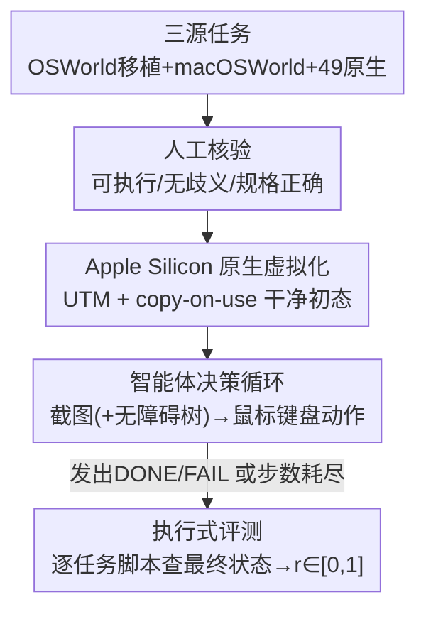

# MacArena: Benchmarking Computer Use Agents on an Online macOS Environment

**会议**: ICML2026  
**arXiv**: [2606.06560](https://arxiv.org/abs/2606.06560)  
**代码**: https://github.com/MacPaw/MacArena  
**领域**: Agent / GUI Agent / 评测基准  
**关键词**: 计算机使用智能体, macOS, GUI Agent, 在线评测, 可验证奖励

## 一句话总结
MacArena 把 OSWorld 移植任务、macOSWorld 任务和 49 个全新 macOS 原生任务（共 421 个、覆盖 50 个应用）统一搬进运行在 Apple Silicon 原生虚拟化框架上的真实 macOS 环境，配上逐任务手写的执行式评测脚本，发现当前 GUI 智能体在 macOS 上普遍比 Linux 掉点、且模型排名在「移植任务」和「macOS 原生任务」之间发生反转——揭示现有 benchmark 的高分更多是「见过这类任务分布」而非真正的跨平台 GUI 能力。

## 研究背景与动机

**领域现状**：计算机使用智能体（Computer-Use Agent，CUA）直接看屏幕截图、用鼠标键盘操作图形界面（GUI），近两年能力飞涨，很大程度上靠 OSWorld 这类标准化在线评测环境推动——它们既是评测尺，也是强化学习的训练场。OSWorld 覆盖 Linux 和 Windows，已成为桌面 GUI 智能体训练与评测的事实标准。

**现有痛点**：macOS 在这套体系里几乎是空白。唯一的 macOS benchmark macOSWorld 只覆盖系统自带应用（Finder、Safari、日历等）这一窄切片，任务更简单、歧义更少，第三方软件几乎不涉及——而第三方软件恰恰是真实 macOS 使用的核心。更致命的是它建在 x86 虚拟机上，和 Apple 2020 年起全面转向的 Apple Silicon 整条产品线硬件不兼容；用云端 EC2 Mac 实例虽技术可行，但成本高到大规模评测和 RL 训练管线根本跑不起。

**核心矛盾**：现有 benchmark 默认「Linux 上 GUI 能力强 = 跨平台 GUI 能力强」，但没人验证过这个假设。macOS 有自己独特的应用约定、复杂的窗口管理、密集的第三方软件，这些 Linux 评测根本没碰过。一个在 OSWorld 上排名靠前的模型，到了陌生的 macOS 原生任务上还行不行，是个开放问题。

**本文目标**：建一个（1）跑在真实 Apple Silicon macOS 上、（2）覆盖大量第三方应用、（3）全部人工核验、（4）能直接对比「同一批任务在 Linux vs macOS」的在线评测基准。

**切入角度**：与其重新造任务，不如把已被社区验证的 OSWorld/macOSWorld 任务移植进真实 macOS 环境，再补一批 macOS 原生任务作为「照妖镜」——专门暴露那些只会模式匹配旧任务分布的模型。

**核心 idea**：用「移植任务测平台漂移、原生任务测真实泛化」的双轨设计，把 GUI 智能体的「平台熟悉度」和「真正的跨平台能力」拆开来量。

## 方法详解

### 整体框架
MacArena 本质是一个评测环境而非一个新模型，它要解决的是「如何在真实 Apple Silicon macOS 上，可复现地、低成本地、覆盖第三方应用地评测 CUA」。整条管线把「智能体决策循环 + 任务定义 + 执行式打分」三件事串起来：智能体在每一步收到当前 macOS 桌面的截图（可选附带无障碍树 accessibility tree），输出一个鼠标/键盘动作，动作在 Apple Silicon 虚拟机里执行、转移环境状态，循环到智能体发出终止动作或步数耗尽；最后由一段确定性的执行式评测脚本检查 macOS 的最终状态（文件内容、应用状态、系统属性、shell 命令输出），给出 $r\in[0,1]$ 的分数。

整个交互被形式化为部分可观测马尔可夫决策过程（POMDP），元组 $(\mathcal{S},\mathcal{O},\mathcal{A},\mathcal{T},\Omega,r,\gamma,\mu_0,\mathcal{G},p_g,\varphi)$：$\mathcal{S}$ 是含后台进程、文件系统等隐藏状态的完整 macOS 状态空间，$\mathcal{O}$ 是智能体能看到的观测（截图 + 无障碍树），$\mathcal{A}$ 是鼠标键盘动作空间，奖励 $r:\mathcal{S}\times\mathcal{A}\times\mathcal{G}\rightarrow[0,1]$ 由任务专属评测脚本在末步给出。

### 关键设计

**1. 三源拼装的 421 任务集：移植测漂移、原生测泛化**

单一来源凑不出既「可对比」又「能暴露泛化短板」的任务集，所以 MacArena 把任务分三路拼。第一路是从 OSWorld 精挑细选移植到 macOS 的 221 个任务——它们和原 OSWorld 任务**完全相同**，唯一变量是操作系统，因此可以直接拿来测「同一批任务从 Linux 搬到 macOS 掉多少分」。第二路是从 macOSWorld 取来的 151 个任务，补齐系统自带应用的覆盖。第三路是作者全新采集的 49 个 macOS 原生任务，分布在 20 个 macOS 应用、5 个类别（文件管理、系统与界面、高级应用、内置应用、生产力），专门针对第三方/非标准应用和 macOS 特有交互模式。这 49 个原生任务是整套设计的「照妖镜」：一个只见过 OSWorld 风格轨迹的模型，在第一路上能靠记忆得分，到第三路就会原形毕露。

**2. Apple Silicon 原生虚拟化 + copy-on-use 干净初态**

macOSWorld 绑死 x86 虚拟机、和现代 Mac 硬件脱节，是它无法被大规模复用的根因。MacArena 改用 UTM（基于 Apple 原生 Virtualization 框架）在 Apple Silicon 上跑虚拟机，从硬件层面对齐真实使用环境，也让 RL 训练管线的成本可控。它维护两个 VM：一个手工配置好、专门满足 OSWorld/macOSWorld 任务的安装/权限/评测前置条件；另一个完全由自动构建脚本生成、服务于 MacArena 自有任务，便于跨 macOS 版本迁移和加新应用。由于 UTM 不原生支持快照回滚，作者采用 **copy-on-use** 策略：每个任务回合开始前先把原始 VM 镜像拷贝成一个临时实例，回合结束即丢弃。这样每次评测都从一个干净、可复现的初始状态出发，避免任务之间互相污染。

**3. 逐任务手写的执行式评测脚本：一对一对应、查真实结果而非过程**

GUI 任务的成功标准千差万别（有的看文件内容、有的看应用状态、有的看系统属性、有的看 shell 输出），用一套通用规则打分必然失真。MacArena 坚持**执行式评测**：智能体发出终止动作后，对应的评测脚本针对最终 VM 状态运行，返回 $[0,1]$ 的分数。每个任务有三个必填字段——`instruction`（自然语言目标）、`pre_command/config`（初始化过程，如下载文件、启动应用、打开文档）、`evaluator`（确定性的验证函数）。它兼容两种格式：OSWorld 格式用结构化配置文件组合预定义评测函数，macOSWorld 格式用 shell 脚本做初始化和评测（更灵活，适合复杂或平台特定逻辑）。关键是 49 个 MacArena 原生任务**各自配一段独立手写的评测脚本**，形成 49 个一对一的评测函数——这种一对一对应正反映了 macOS 应用和任务类型在验证需求上的多样性，也是「全部人工核验、保证每个任务可执行/无歧义/规格正确」这一更高质量信号的来源。

### 损失函数 / 训练策略
本文是评测基准，不训练模型。评测协议固定：每个任务限 15 步、每个模型跑 2 次，主指标为成功率 SR（Success Rate，评测脚本返回正结果的任务百分比）。智能体只通过原始鼠标键盘动作与 VM 交互，每步收到当前桌面截图。

## 实验关键数据

### 主实验
作者评测了 4 个基线智能体：UI-TARS-1.5 7B、Qwen3-VL 2B、Qwen3-VL 4B、OpenAI Computer Use Preview（CUA）。下表为三个子集上的整体成功率（%）：

| 子集 | UI-TARS-1.5 7B | Qwen3-VL 2B | Qwen3-VL 4B | OpenAI CUA |
|------|------|------|------|------|
| OSWorld 子集 | **21.27** | 9.95 | 16.36 | 16.74 |
| macOSWorld 子集 | 24.50 | 15.89 | 39.74 | **52.32** |
| MacArena 原生子集 | 10.20 | 4.08 | 12.24 | **36.73** |
| 全基准整体 | 21.14 | 11.40 | 24.23 | **31.83** |

OpenAI CUA 以 31.83% 的整体成功率领先，但没有任何模型整体超过约 32%——macOS 对当前 GUI 智能体仍是难啃的骨头。

### macOS vs Linux 平台差距
把 OSWorld 子集（macOS，15 步）和官方报告的原版 OSWorld 分数（Ubuntu，15 步）对比，任务集完全相同：

| 模型 | Ubuntu | macOS | Δ |
|------|------|------|------|
| UI-TARS-1.5 7B | 24.5 | 21.27 | −3.23 |
| OpenAI CUA | 26.0 | 16.74 | −9.26 |
| Qwen3-VL 2B | 17.0 | 9.95 | −7.05 |
| Qwen3-VL 4B | 26.2 | 16.36 | −9.84 |

同一批任务搬到 macOS 后全部掉点，差距来自 macOS 在应用外观、键盘快捷键、窗口管理、系统行为上的平台差异，而模型主要在 Linux/Windows 轨迹上训练，没适配过——平台 gap 是真实存在的。

### 关键发现
- **排名反转是最重要的信号**：UI-TARS-1.5 7B 在 OSWorld 子集上压过 OpenAI CUA（21.27% vs 16.74%），但在 MacArena 原生子集上完全反转——OpenAI CUA 拿 36.73%，UI-TARS-1.5 7B 只有 10.2%，反向差距超过 26.5 个百分点。这说明 Linux 设计的任务上的强表现**不会**迁移到全新 macOS 原生任务；UI-TARS 大概率训练时见过 OSWorld 风格轨迹，靠记忆得分，一旦面对真正陌生的 macOS 应用就崩。
- **多应用任务是公认最难**：需要协调 2 个及以上应用的 multi-app 类别在所有模型、所有子集上几乎都接近 0%，跨应用协调对 SOTA 模型仍是开放难题。
- **步数消耗解释难度**：用最强的 OpenAI CUA 统计平均步数，macOSWorld 子集全任务平均 10.92 步、完成任务 8.05 步（最低，说明任务更短更简单，这定量解释了为何模型在 macOSWorld 上分更高）；OSWorld 子集 13.88/11.08 步；MacArena 原生子集最高，13.96/12.69 步。

| 子集 | 平均步数（全部） | 平均步数（仅完成） |
|------|------|------|
| macOSWorld | 10.92 | 8.05 |
| OSWorld | 13.88 | 11.08 |
| MacArena 原生 | 13.96 | 12.69 |

## 亮点与洞察
- **「同任务跨平台」的对照设计很巧**：把 OSWorld 任务原封不动搬到 macOS，唯一变量是 OS，于是「掉 9 个点」这种结论无可辩驳——这是大多数 benchmark 想做却做不到的干净对照。
- **排名反转直接证伪了「benchmark 高分 = 真能力」**：这是全文最有冲击力的洞察。它提醒整个领域：只在现有 benchmark 上刷分的模型，可能只是在模式匹配见过的任务结构，必须用全新环境的原生任务才能照出真实泛化短板。
- **可迁移的工程思路**：copy-on-use 替代不支持的快照回滚、双 VM 分治（一个满足旧 benchmark 前置条件、一个全自动构建）、逐任务一对一手写评测器——这些做法可以直接搬到任何需要「干净初态 + 异构验证」的在线 agent 评测项目。

## 局限与展望
- **任务全靠人工采集，难扩展**：421 个任务全部人工编写核验，费时且限制规模。作者提议用 LLM 合成任务指令（可由应用 schema 或交互日志引导），但生成任务可能歧义、不可行或过于简单，仍需人工校验或自动可行性检查（如验证参考智能体能在限定步数内完成）。
- **缺人类性能基线**：任务虽 100% 人工核验、可完成，但没有人类表现研究，缺一个解读模型结果、衡量剩余提升空间的参照点（OSWorld、macOSWorld 都有）。
- **自己发现的局限**：每模型每任务只跑 2 次、限 15 步，方差和「步数预算是否充足」未充分讨论；4 个基线里只有 2 个有官方 OSWorld 分可对比，平台 gap 的样本偏少；评测脚本逐任务手写虽精准，但也意味着扩展新任务的边际成本始终很高。

## 相关工作与启发
- **vs OSWorld**：OSWorld 是最全面的在线 benchmark，覆盖 Linux/Windows、真实应用、执行式打分，是训练和评测的事实标准；MacArena 直接移植它的任务、补上 macOS 这块空白，并用「同任务跨平台」对照量化平台 gap。
- **vs macOSWorld**：macOSWorld 是唯一的前作 macOS benchmark，但只覆盖自带应用、任务简单、跑在 x86 VM 上；MacArena 在第三方应用覆盖、全人工核验、Apple Silicon 原生三方面都补齐，并指出它的任务更短（步数最少）才是「看起来分高」的真因。
- **vs ScreenSpot / GUIrilla 等离线基准**：那些只测静态截图上的元素定位，测不了序列决策、错误恢复、动态环境反馈；MacArena 是在线交互式评测，测的是「能不能在活环境里真把任务做完」。

## 评分
- 新颖性: ⭐⭐⭐⭐ 不是新模型/新算法，但「真实 Apple Silicon macOS + 同任务跨平台对照 + 排名反转洞察」组合起来是高价值的空白填补。
- 实验充分度: ⭐⭐⭐⭐ 4 个基线 × 三子集 × 20 类别覆盖完整，步数分析有说服力；但每任务仅 2 次、可对比官方分的模型偏少。
- 写作质量: ⭐⭐⭐⭐⭐ 动机清晰、对照设计干净、排名反转的洞察讲得很透。
- 价值: ⭐⭐⭐⭐⭐ 把 macOS 立为一等评测目标，并给整个 GUI agent 领域敲了「benchmark 高分≠真能力」的警钟。

<!-- RELATED:START -->

## 相关论文

- [\[ICLR 2026\] Efficient Agent Training for Computer Use](../../ICLR2026/llm_agent/efficient_agent_training_for_computer_use.md)
- [\[ICLR 2026\] AgentSynth: Scalable Task Generation for Generalist Computer-Use Agents](../../ICLR2026/llm_agent/agentsynth_scalable_task_generation_for_generalist_computer-use_agents.md)
- [\[ICML 2026\] Web Agents Should Use Typed Actions Instead of Click-Based Browsing](web_agents_should_use_typed_actions_instead_of_click-based_browsing.md)
- [\[ICML 2026\] Reward Hacking Benchmark: Measuring Exploits in LLM Agents with Tool Use](reward_hacking_benchmark_measuring_exploits_in_llm_agents_with_tool_use.md)
- [\[ICML 2026\] Persona2Web: Benchmarking Personalized Web Agents for Contextual Reasoning with User History](persona2web_benchmarking_personalized_web_agents_for_contextual_reasoning_with_u.md)

<!-- RELATED:END -->
