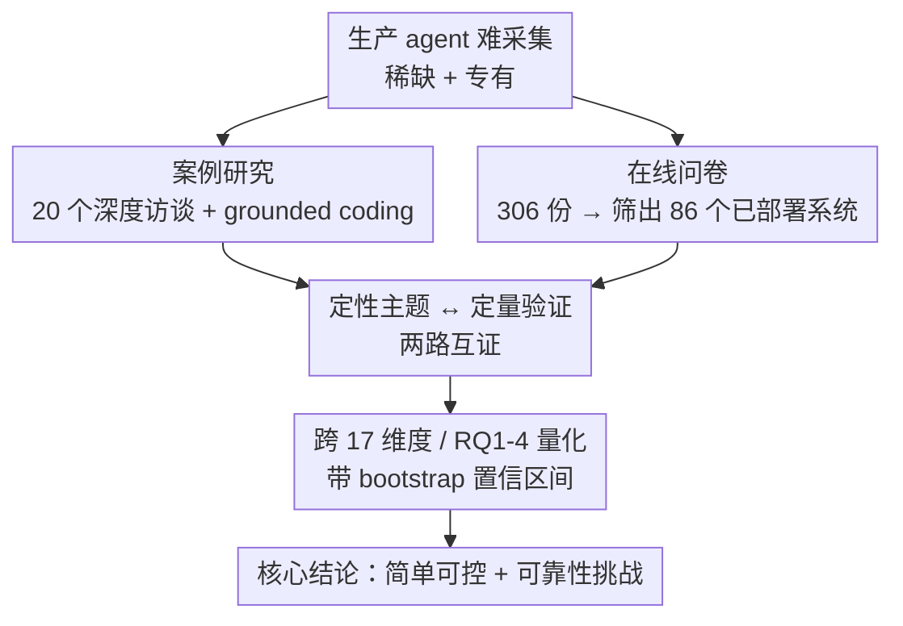

# Measuring Agents in Production

**会议**: ICML 2026  
**arXiv**: [2512.04123](https://arxiv.org/abs/2512.04123)  
**代码**: 待确认  
**领域**: LLM Agent / 实证研究 / 生产部署  
**关键词**: 生产环境 agent, 实证调研, 部署实践, 可靠性, 系统级设计

## 一句话总结
这是第一项系统性研究"生产环境里的 LLM agent 到底是怎么被造出来、怎么被评估的"的实证工作——作者通过 20 个深度访谈案例 + 306 份从业者问卷（筛出 86 个已部署/试点系统）跨 26 个领域收集一手数据，发现生产 agent 普遍走"简单、可控"路线（68% 在人工介入前执行 ≤10 步、70% 直接 prompt 现成模型不做权重微调、74% 主要靠人工评估），而**可靠性**是头号挑战、从业者主要靠系统级设计而非算法/模型层创新来解决它。

## 研究背景与动机

**领域现状**：LLM agent 把基础模型与工具、记忆、推理结合，能自主执行多步任务，研究界对其兴趣浓厚（药物发现、科学发现等），工业界也已经在金融、医疗、教育等关键领域部署。

**现有痛点**：尽管热度很高，大量研究却显示 agent 部署**经常失败或不及预期**。"agent 的潜力"与"现实中的失败"之间存在巨大反差，引出一个根本问题：到底什么因素让 agent 部署成功？但现实是——**生产 agent 怎么造的几乎没有公开信息**，因为成功的真实部署本就稀少、且大多是专有系统，公司不愿透露。

**核心矛盾**：研究界在 benchmark 上不断刷 RL、复杂规划、自主性，而生产界面对的是可靠性、可控性、模型升级脆弱性这些"工程现实"。两者之间缺一座桥——研究者看不到部署现实，从业者的经验又锁在公司内部。

**本文目标**：用一手数据回答四个研究问题——RQ1 agent 的应用场景是什么；RQ2 用了哪些模型/架构/方法；RQ3 怎么评估；RQ4 部署的头号挑战是什么。

**切入角度**：与其综述已发表文献或剖析单个系统，不如**直接向正在造部署级 agent 的从业者要一手数据**，用访谈 + 问卷两路互证。

**核心 idea**：把通常被当作商业机密的部署数据系统性地采集、匿名化、编码、量化，做出第一份"生产 agent 的技术画像"，让研究界看见部署现实与被忽视的研究方向。

## 方法详解

### 整体框架
这是一项**实证研究（measurement study）**，方法本身是一套混合研究设计：两条平行的数据采集流——① 20 个深度案例研究（半结构化访谈）做定性观察；② 306 份公开在线问卷做大规模定量确认——再经人工 grounded coding 把定性主题归类，最后筛出 86 个"已部署/试点"系统作为分析主体，围绕 RQ1–RQ4 跨 17 个设计维度量化。两路数据互为印证：访谈挖深度与"为什么"，问卷验证广度与普遍性。

### 关键设计

**1. 双轨数据采集：深度访谈 + 大规模问卷互证**

单一方法搞不定这个问题——访谈能挖到"为什么这么设计"但样本小、易偏；问卷能上规模但只能拿到结构化勾选。作者用**雪球采样**做 20 个案例：从专业网络里的大厂 agent 团队起步，按应用多样性、组织成熟度、全球覆盖逐步扩展，最终覆盖 5 个行业、从初创到全球企业、用户规模从数百到上百万，每个案例匿名记为 C01、C02……同时设计 47 题问卷（用 Qualtrics 动态分支，按前序回答自适应后续问题以兼顾深挖与完成率），通过 Berkeley RDI 峰会、AI Alliance Meetup、Agentic AI MOOC 及职业网络分发，2025 年 7–10 月收到 306 份有效回复。两路设计的核心是让定性主题（访谈）和定量普遍性（问卷）相互验证。

**2. 严格筛选 + 人工 grounded coding 保证数据可信**

研究面对两大障碍：成功部署稀少、生产系统专有。作者用透明的筛选与编码来对冲偏差。问卷 306 份被**筛到 86 个明确处于生产或试点阶段**的系统（其余完整数据放附录），这 86 个不是小玩具——服务用户从几十到超百万。分析采用 grounded theory 的开放编码：每条访谈笔记由**至少三名研究者独立编码**，分歧通过 peer debriefing 解决；唯一的自由文本题（领域分类）用 LOTUS 做语义聚合得到候选类别、再由三名标注者人工标注（Cohen's $\kappa = 0.636$）。所有分类比较都报告 1000 次 bootstrap 重采样得到的 95% 置信区间。这套设计让"生产 agent 长什么样"的结论建立在可复核的编码流程上，而非个别轶事。

**3. 以"已部署系统"为分析单位，对照研究原型暴露落差**

很多 agent 研究的结论来自 benchmark 上的研究原型，作者刻意把分析锚定在**真实服务用户的 86 个部署系统**，并在多处与研究原型对照（如 Fig.21a 显示研究原型步数远高于生产部署）。这个设计是全文洞见的来源：正因为只看真实部署，才看到生产界系统性地"为可靠性牺牲能力"——研究热衷的高自主性、RL、复杂规划，在部署里被大幅收敛。这种"部署 vs 原型"的对照让论文不是泛泛谈趋势，而是量化出研究与现实之间的具体鸿沟。

### 一个完整示例：一个典型生产 agent 长什么样
把发现串起来看一个代表性部署（综合多个 case）：它服务**内部员工**（52% 的部署面向内部员工），跑在**分钟级延迟容忍**的后台自动化场景（66% 容忍分钟级或更长，因为比人工基线快 10 倍就够），直接 **prompt 一个闭源前沿模型**（如 Claude Sonnet 4 / GPT o3，17/20 案例用闭源）而不做微调（70% 不做权重微调），用**人工撰写或人工+LLM 起草的 prompt**（79%），跑在**预定义结构化工作流**里、在人工介入前执行少于 10 步（68%），由**人在环评估**把关（74%）而非正式 benchmark（75% 干脆不做正式 benchmark，靠 A/B 测试和专家反馈）。整条链路的设计取向高度一致：**用可控性换能力，以换取可靠性和快速迭代**。

## 实验关键数据

### 四个研究问题的核心数字
论文用两路数据回答 RQ1–RQ4，下表汇总最关键的量化发现。

| RQ | 维度 | 关键数字 | 解读 |
|----|------|----------|------|
| RQ1 | 建 agent 动机 | 提升生产力 80%、减少人工工时 72% | 主要追可量化的生产力，风险缓释(12%)等难量化收益少 |
| RQ1 | 服务对象 | 93% 面向人类用户（内部员工 52% / 外部客户 40%） | 人在环监督，先内部部署降风险 |
| RQ1 | 延迟容忍 | 66% 容忍分钟级或更长，17% 无明确限制 | 挑战"ML 系统一味降延迟"的主流目标 |
| RQ2 | 模型选择 | 17/20 用闭源前沿模型；59% 用多模型 | 开源仅在成本/合规约束下采用 |
| RQ2 | 权重微调 | 70%（14/20）不微调、直接 prompt | 微调对模型升级脆弱、维护成本高 |
| RQ2 | prompt 构造 | 79% 人工或人工+LLM，仅 9% 用 prompt 优化器 | 偏好可控可解释、快速迭代 |
| RQ2 | 架构 | 80%（16/20）用结构化工作流，68% 执行 <10 步 | 刻意约束自主性换稳定 |
| RQ2 | 框架 | 85%（17/20）自研而非第三方框架 | 系统成熟后倾向直连 API 自建 |
| RQ3 | 评估方式 | 74% 主要靠人在环评估，75% 不做正式 benchmark | LLM-as-a-judge 仅作补充验证 |
| RQ4 | 头号挑战 | 可靠性（行为长期一致正确） | 其次是评估(benchmark 稀缺)与安全 |

### 关键发现
- **"简单可控"是刻意选择而非能力不足**：从业者默认 prompt 闭源模型，是因为它对模型升级更鲁棒、样本效率更高、开发周期更快——而不是不懂 RL/微调。这是全文最反直觉的结论。
- **模型升级是一等的可靠性风险**：agent 的脚手架、prompt、评估会"锁死"在特定模型行为上，换新模型可能直接搞坏工作流，逼得团队同时跑旧模型（C10）；59% 用多模型部分就源于此运维约束。"更强的模型不保证更好的 agent 表现"。
- **延迟容忍颠覆优化方向**：主流 ML 系统研究死磕降延迟，但生产 agent 多是后台异步自动化（20 个案例中 15 个可异步、部分按小时/夜间批处理），分钟级延迟反而能换质量与可靠性——提示"以速度换正确性"的研究空间。
- **评估是被低估的瓶颈**：benchmark 稀缺 + 反馈延迟让 75% 团队放弃正式 benchmark，可靠性问题因此更难被系统性度量，作者把它列为重要的待研究方向。

## 亮点与洞察
- **第一份生产 agent 的一手技术画像**：把通常专有的部署数据系统化采集并量化，填补了"研究热度 vs 部署现实"之间的信息真空，对研究选题极有参照价值。
- **"系统级设计 > 算法创新"的底层原理**：论文把一堆零散数字收敛成一条主线——从业者靠系统级最佳实践（结构化工作流、人在环、多模型容灾）而非模型/算法进步来获得可靠性，这个结论对研究界"什么才真正有用"是个有力提醒。
- **方法学本身可复用**：双轨互证 + 多人独立 grounded coding + bootstrap 置信区间，是做"软件工程/AI 系统实证研究"的一个扎实模板，可迁移到其他"难采集、专有"的部署研究。

## 局限与展望
- **采样与地域偏差**（作者承认）：案例团队集中在美洲（少量欧洲），问卷受访者偏向作者职业网络；公司是否接受访谈受其政策影响，存在参与偏差。
- **时间快照性**（作者承认）：数据采集窗口为 2025 年 4–11 月，agent 领域演化极快，细粒度模式可能漂移，作者强调把结论当作"定性证据"而非固定的普遍率估计。
- **自我报告而非直接审计**：访谈/问卷依赖从业者陈述，缺少对部署系统的直接代码/行为审计；作者把"直接审计"列为后续工作。
- **样本量在部分维度偏小**：某些细分结论（如延迟敏感团队的微调倾向，仅 4 个有界延迟案例）被作者明确标注为"观察而非普遍率主张"，不宜过度外推。

## 相关工作与启发
- **vs 商业 agent 调研（LangChain 2024 / 咨询报告）**：那些工作从商业可行性、组织就绪度等视角调研，受访对象常是高管；本文聚焦"生产系统"范围、关注工程级技术数据，来自一线开发者。
- **vs 学术综述（agent 架构/评估/安全 survey）**：综述是综合已发表文献，本文是**直接采集一手数据**，看到的是文献里没有的部署细节。
- **vs 单系统研究（各公司公开的单个系统报告）**：单系统报告深入但只覆盖个例，本文报告的是跨多样部署的**共性模式**。

## 评分
- 新颖性: ⭐⭐⭐⭐⭐ 第一份系统性生产 agent 实证研究，填补部署现实的信息空白
- 实验充分度: ⭐⭐⭐⭐ 20 案例 + 306 问卷 + 86 部署系统、多人编码 + bootstrap CI，但地域/网络偏差与时间快照性是硬伤
- 写作质量: ⭐⭐⭐⭐⭐ RQ 结构清晰、每节配 Finding 小结、图表丰富、局限坦诚
- 价值: ⭐⭐⭐⭐⭐ 给研究界提供稀缺的部署一手数据与被忽视的研究方向，参考价值极高

<!-- RELATED:START -->

## 相关论文

- [\[ICML 2026\] Reward Hacking Benchmark: Measuring Exploits in LLM Agents with Tool Use](reward_hacking_benchmark_measuring_exploits_in_llm_agents_with_tool_use.md)
- [\[NeurIPS 2025\] AgentMisalignment: Measuring the Propensity for Misaligned Behaviour in LLM-Based Agents](../../NeurIPS2025/llm_agent/agentmisalignment_measuring_the_propensity_for_misaligned_behaviour_in_llm-based.md)
- [\[ACL 2026\] ImplicitMemBench: Measuring Unconscious Behavioral Adaptation in Large Language Models](../../ACL2026/llm_agent/implicitmembench_measuring_unconscious_behavioral_adaptation_in_large_language_m.md)
- [\[NeurIPS 2025\] EU-Agent-Bench: Measuring Illegal Behavior of LLM Agents Under EU Law](../../NeurIPS2025/llm_agent/eu-agent-bench_measuring_illegal_behavior_of_llm_agents_under_eu_law.md)
- [\[ICML 2026\] LLM Agents Are the Antidote to Walled Gardens](llm_agents_are_the_antidote_to_walled_gardens.md)

<!-- RELATED:END -->
