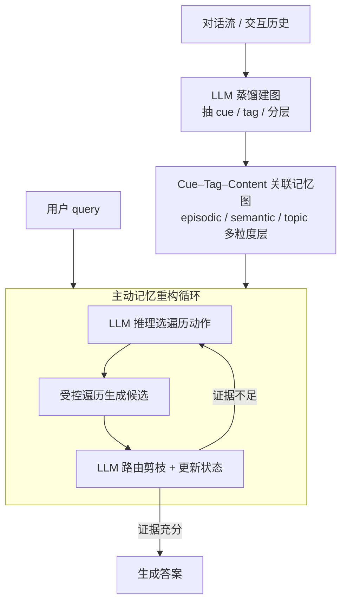

# Memory is Reconstructed, Not Retrieved: Graph Memory for LLM Agents

**会议**: ICML2026  
**arXiv**: [2606.06036](https://arxiv.org/abs/2606.06036)  
**代码**: https://github.com/Ji-shuo/MRAgent  
**领域**: Agent  
**关键词**: LLM 智能体, 长程记忆, 主动记忆重构, 关联记忆图, Cue-Tag-Content

## 一句话总结
MRAgent 把"先检索后推理"的静态记忆范式换成"边推理边重构"，用一个 Cue–Tag–Content 关联记忆图加一套主动重构循环，让智能体根据中间证据动态选择遍历方向、剪掉无关分支，在 LoCoMo / LongMemEval 上相对最强基线最高提升 23%，同时把 token 和耗时大幅压低。

## 研究背景与动机
**领域现状**：LLM 的认知是"参差"的——数学推理很强，但在需要长期记忆的交互助手、决策支持等长程任务上很弱，根因是上下文窗口有限、存不下历史。为缓解这点，主流做法是给智能体挂外部记忆：早期是 RAG（按相似度从非结构化文本/embedding 库里检索），后来引入更结构化的记忆，包括分层存储和知识图谱，显式编码实体和关系以支持更可解释的关系检索。

**现有痛点**：无论相似度检索还是图检索，这些系统的检索都被限死在**固定 top-$k$ 选择或预定义子图遍历**上，没法推断出新的检索线索、也没法根据中间发现的证据调整策略。本质上它们是**被动检索策略**：相似度检索（如 MemoryBank、Mem0）$\pi_\text{sim}(x)=\text{TopK}(\{\text{sim}(x,v)\},k)$ 只按表层相关性捞一堆噪声却找不到正确证据；图检索（如 A-Mem、Zep）$\pi_\text{graph}(x)=\mathcal{V}^\text{sim}\cup\text{Neighbor}(\mathcal{V}^\text{sim})$ 用固定 $n$-hop 邻居扩展，既引入噪声、又要求证据之间本来就有显式图链路。论文用一个例子点破：查"Nate 的电竞比赛"，被动检索只能捞出和电竞直接相关的事件，无法像人那样**通过推理推出关键时间线索"July"**、再顺藤摸瓜找到 Caroline 的相应活动。

**核心矛盾**：被动检索的根本缺陷是**无法在访问记忆的同时做推理**——不能根据中间状态修正策略、会因固定聚合不断累积噪声、还重度依赖预先建好的结构。

**切入角度**：认知神经科学认为人类记忆提取是**主动且关联的重构过程**，由上下文线索触发、经中间表征逐步传播、渐进重建出连贯记忆，而非被动读取存储内容。

**核心 idea**：把 LLM 推理直接嵌进记忆访问，让记忆从"一次性检索"变成"多步主动重构"；并把记忆组织成 Cue–Tag–Content 图，用 tag 作为"线索→内容"之间的语义桥，先选 tag 再取内容，从而在大图上做受控、可剪枝的遍历，避免组合爆炸。

## 方法详解

### 整体框架
MRAgent 分两段。**建图段**：用 LLM 蒸馏把对话流离线组织成一个异构关联图 $\mathcal{M}=(\mathcal{C},\mathcal{V},\mathcal{R})$，其中 Cue（细粒度线索）和 Content（具体记忆内容）是两类节点，二者通过带 Tag 属性的三元组 $(c,g,v)$ 相连；内容又按 episodic / semantic / topic 分成多粒度层。**重构段**：来一个 query，智能体不跑预定义流水线，而是进入一个迭代循环——维护一个重构状态 $\mathcal{S}^{(t)}=(\mathcal{Z}^{(t)},\mathcal{H}^{(t)})$（当前活跃元素集 + 已累积证据），每轮让 LLM 基于已知证据选择遍历动作、执行受控遍历生成候选、再让 LLM 路由剪枝、更新状态，直到累积证据足够回答 query。这样"推理"和"记忆访问"交织进行，既能根据中间证据发现新线索、调整轨迹，又用 tag 这层语义中介把昂贵的内容访问挡在后面、避免无约束扩展导致的组合爆炸。

### 关键设计

**1. Cue–Tag–Content 关联记忆图与多粒度分层：用 tag 当语义桥，把检索拆成两步**

针对被动检索"要么噪声大、要么依赖固定链路"的痛点，MRAgent 把记忆建成异构图而非可检索条目的平铺集合。Cue 是实体、属性等细粒度关键词，Content 是具体记忆项，二者由 Tag 类型化关系 $\mathcal{R}\subseteq\mathcal{C}\times\mathcal{G}\times\mathcal{V}$ 相连。Tag 概括"线索↔内容"的关联，让 LLM 做**两阶段检索**：先选一小撮相关 tag、再在选定 tag 下取内容。形式化为两个映射算子：$\phi_{c\to g}(c)\triangleq\{g\mid(c,g,\cdot)\in\mathcal{R}\}$ 从线索激活候选 tag，$\phi_{(c,g)\to v}(c,g)\triangleq\{v\mid(c,g,v)\in\mathcal{R}\}$ 在线索+tag 条件下取内容。在大图上直接 $n$-hop 扩展会组合爆炸、塞进一堆无关记忆，而 tag 作为显式关联中介让 LLM 能在访问昂贵的 episodic 内容之前就评估、剪掉无关分支。内容侧再分三层：**episodic 层**存事件级记忆、按统一时间线组织以支持时序推理；**semantic 层**存个人属性/偏好/事实等稳定知识、可绕开冗长 episodic 历史直达；**topic 抽象层**汇总跨 episode 的复现模式，支持"先定位主题再下钻 episode"的自顶向下转移 $\phi_{\tau\to e}$。

**2. LLM 蒸馏建图：把对话流自动组织成多粒度关联结构**

记忆图不是手工建的，而是用一条自动蒸馏管线灌进去。输入流先被切成 episodic 单元 $e_i$（每个对应一个具体上下文里的连贯事件），然后用 LLM 组件抽 tag 和 cue：$g_i=F_\text{LLM}^\text{tag}(e_i)$ 产出概括该 episode 关系模式的简短关联 tag，$C_i=F_\text{LLM}^\text{cue}(e_i)$ 抽出实体、属性、显著描述等细粒度线索；$C_i$ 里每个 cue 通过 tag $g_i$ 链到 $e_i$，构成 episodic 层的 Cue–Tag–Episode 关系。Semantic 单元同理抽取，得到跨 episode 持久的稳定知识、用 aspect 级 tag 锚到实体线索；topic 节点则由相关 episode 的共享主题汇总而成、连回其成员 episode。这条分层蒸馏把原始输入流变成"具体事件 / 稳定事实 / 高层主题"三档可按需访问的关联结构，是后续主动重构能高效运行的基础。

**3. 主动记忆重构：状态 + 遍历动作 + 迭代循环，让推理和访问交织**

这是把"被动检索"真正变成"主动重构"的核心。MRAgent 维护显式重构状态 $\mathcal{S}^{(t)}=(\mathcal{Z}^{(t)},\mathcal{H}^{(t)})$，$\mathcal{Z}^{(t)}$ 是下一步遍历的候选活跃集（含 cue/tag/content），$\mathcal{H}^{(t)}$ 是历史累积证据。遍历动作集 $\mathcal{A}=\{\Pi_1,\dots,\Pi_m\}$ 由映射算子诱导，含前向动作 $\Pi_{c\to g}$（从线索激活 tag）、$\Pi_{(c,g)\to v}$（按线索+tag 取内容）和反向动作 $\Pi_{v\to(c,g)}$（让已取内容激活新线索和 tag、从而重定向轨迹）。每轮循环三步：① **LLM 推理选动作** $\mathcal{A}^{(t)}=f_\text{select}(x,\mathcal{H}^{(t)},\mathcal{Z}^{(t)})$，挑出有前景的扩展方向、降噪，并能借累积证据发现新线索；② **受控遍历** $\widetilde{\mathcal{Z}}^{(t+1)}=\bigcup_{a\in\mathcal{A}^{(t)}}\Pi_a(\mathcal{Z}^{(t)})$，只沿 LLM 选中的方向扩展而非穷举；③ **LLM 路由更新状态** $\mathcal{Z}^{(t+1)}=f_\text{route}(x,\mathcal{H}^{(t)},\widetilde{\mathcal{Z}}^{(t+1)})$，挑最相关内容、剪无关分支、把证据并入 $\mathcal{H}^{(t+1)}$，再由一个 LLM 判别器判断证据是否足以回答、否则继续探索。选择性扩展降噪提效，条件于中间证据又让推理轨迹可灵活调整。论文进一步给出理论保证：**主动检索严格强于被动检索**——对任意检索预算 $T\ge 2$，被动假设类严格包含于主动假设类 $\mathcal{H}_\text{passive}^\text{LM}(T)\subsetneq\mathcal{H}_\text{active}^\text{LM}(T)$，直觉是主动检索能学到被动检索能学的一切、反之不行。

### 一个例子：从 query 推出隐含线索
查"Caroline 在 Nate 打电竞比赛时做了什么"。被动相似度检索只会按表层相关性捞一堆"电竞比赛"相关事件，引入大量噪声却找不到 Caroline——因为她的活动和"电竞比赛"在图里并无直接链路。MRAgent 则在循环里先**推理推出关键时间线索"July"**（一个 query 里没明说、需结合证据推出的时间锚点），用它把检索约束从"电竞"转向"7 月发生的事"，反向遍历激活与该时间相关的 cue/tag，最终命中 Caroline 在那段时间的对应活动。这正是被动策略到不了的证据。

## 实验关键数据

### 主实验
LoCoMo（Table 1，按问题类型，指标为 LLM-Judge 分 J，Gemini 基座）：

| 方法（Gemini） | Multi-hop J | Temporal J | Open Domain J | Single-hop J | Overall J ↑ |
|---------------|-------------|------------|---------------|--------------|-------------|
| RAG | 58.16 | 49.22 | 41.67 | 69.20 | 61.30 |
| A-Mem | 53.54 | 49.53 | 33.33 | 61.83 | 55.97 |
| Mem0 | 68.79 | 61.68 | 41.66 | 73.72 | 68.31 |
| **MRAgent** | **75.17** | **80.37** | **68.75** | **90.48** | **84.21** |

MRAgent 把 Overall J 从最强基线 Mem0 的 68.31 提到 84.21（相对 +23.3%），在 Claude 基座上也有 +12.4%；LongMemEval（Table 2）相对最强基线提升约 32%。Temporal / Open Domain 这类需要推理推线索的题型提升尤其大。

### 成本分析与消融
成本（Table 3，LongMemEval 每样本 token 与耗时，Gemini 基座）：

| 方法 | Token 消耗 ↓ | 运行时间(s) ↓ |
|------|-------------|--------------|
| A-Mem | 632k | 1122.23 |
| MemoryOS | 273k | 3135.54 |
| LangMem | 3268k | 1209.57 |
| Mem0 | 245k | 533.29 |
| **MRAgent** | **118k** | 586.11 |

消融（Figure 5，LoCoMo 多跳，Claude 基座）：① 结构上 CE < CTE < CTC（无推理时性能随关联结构变丰富而单调上升，证明 tag 提供有效语义引导）；② 同结构下"带推理"一致优于"仅结构"（证明多步推理与遍历对累积证据、支撑多跳推理至关重要，一次性检索不够）；③ 去掉 semantic 记忆层明显掉点（episodic 存事件细节、semantic 存多跳推理必需的稳定抽象知识，二者互补）。

### 关键发现
- **主动多步推理是首要增益来源**：所有记忆结构下带推理都明显胜过仅结构版，多跳 query 的证据召回在连续步骤里能提升 30%+。
- **效率反而更好**：MRAgent 把 prompt token 压到 118k（A-Mem 632k、LangMem 3268k 的零头），因为它建图阶段轻量、把复杂关系建模延到检索阶段按 query 现做，又用 tag 在访问昂贵 episodic 内容前剪枝。
- **理论与实证一致**：主动检索严格更强的定理，对应实证上 Temporal/Open Domain 这种"需推出隐含线索"的题型增益最大。

## 亮点与洞察
- **把"检索"重定义为"重构"**：认知神经科学里"记忆是重构出来的、不是读出来的"这个隐喻被落成了具体可执行的 state + action + loop，理念到机制的转化很干净。
- **Tag 作为语义中介**是控制图遍历组合爆炸的巧妙开关：先选 tag 再取内容，把昂贵的内容访问挡在剪枝之后，这个"两阶段、先语义后内容"的检索拆分可迁移到任何大规模图检索。
- **反向遍历**（内容激活新线索）让智能体能根据中间发现重定向轨迹，是被动 top-$k$/固定 $n$-hop 做不到的——这正是它在多跳/时序题上拉开差距的关键。
- **效率与效果双赢**而非 trade-off：把重活从建图挪到按需检索，既省 token 又涨分，反直觉但很有说服力。

## 局限与展望
- 作者承认重构成本随探索深度增长，需要很多遍历步的 query 比一次性检索延迟更高——虽然平均 token 更省，但最坏情况的延迟分布值得关注。
- 整套流程重度依赖 LLM 做 cue/tag 抽取、动作选择、路由判别，建图质量和检索质量都受底座 LLM 能力与 prompt 影响，蒸馏出的 tag 是否一致、是否漏抽关键线索存疑（⚠️ 细节以原文附录为准）。
- 主要在对话型长程记忆 benchmark（LoCoMo / LongMemEval）上验证，迁移到工具调用、代码、多模态等其他长程任务的效果尚待检验。

## 相关工作与启发
- **vs Mem0 / MemoryBank（相似度检索）**：他们用固定 top-$k$ 相似度，本文用主动多步重构，区别在"一次性按相似度捞 vs 边推理边按证据走"，本文在 LoCoMo Overall 上 84.21 vs Mem0 68.31。
- **vs A-Mem / Zep（图检索）**：他们用相似度种子 + 固定 $n$-hop 邻居扩展，要求证据有显式链路且易引噪声；本文用 tag 中介 + LLM 路由剪枝，能推出隐含线索、走到无直接链路的证据，且 token 从 632k 降到 118k。
- **vs 认知科学 reconstruction 理论**：本文不是泛泛类比，而是把 cue→engram→渐进重构这套机制对应成 Cue–Tag–Content + 主动循环，并给出主动严格强于被动的可证明结论。

## 评分
- 新颖性: ⭐⭐⭐⭐⭐ "检索即重构"范式 + Cue-Tag-Content 图 + 主动循环，理念和机制都新
- 实验充分度: ⭐⭐⭐⭐ 两个长程 benchmark + 双基座 + 成本/消融/多轮分析，但任务域偏对话
- 写作质量: ⭐⭐⭐⭐⭐ 动机—形式化—理论—实验链条完整，例子点睛
- 价值: ⭐⭐⭐⭐⭐ 效果与效率双赢，对 LLM 智能体长程记忆有实际指导意义

<!-- RELATED:START -->

## 相关论文

- [\[ACL 2026\] MAGMA: A Multi-Graph based Agentic Memory Architecture for AI Agents](../../ACL2026/llm_agent/magma_a_multi-graph_based_agentic_memory_architecture_for_ai_agents.md)
- [\[ACL 2026\] SEARL: Joint Optimization of Policy and Tool Graph Memory for Self-Evolving Agents](../../ACL2026/llm_agent/searl_joint_optimization_of_policy_and_tool_graph_memory_for_self-evolving_agent.md)
- [\[ICML 2026\] Position: Modular Memory is the Key to Continual Learning Agents](position_modular_memory_is_the_key_to_continual_learning_agents.md)
- [\[ICML 2026\] AdaMEM: Test-Time Adaptive Memory for Language Agents](adamem_test-time_adaptive_memory_for_language_agents.md)
- [\[ACL 2026\] PersonaAgent: Bridging Memory and Action for Personalized LLM Agents](../../ACL2026/llm_agent/personaagent_bridging_memory_and_action_for_personalized_llm_agents.md)

<!-- RELATED:END -->
