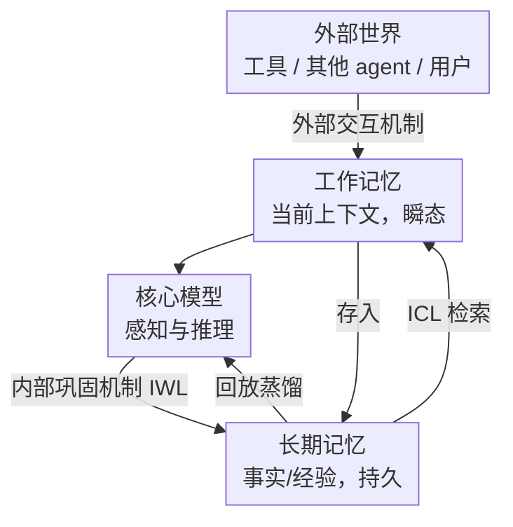

# Position: Modular Memory is the Key to Continual Learning Agents

**会议**: ICML 2026  
**arXiv**: [2603.01761](https://arxiv.org/abs/2603.01761)  
**代码**: 无（立场/路线图论文）  
**领域**: 持续学习 Agent / 记忆架构  
**关键词**: 持续学习, 模块化记忆, 上下文学习, 权重学习, 巩固

## 一句话总结
这是一篇出自 Dagstuhl 持续学习研讨会的立场论文，主张：单纯靠改权重（IWL）会灾难性遗忘、单纯靠塞上下文（ICL）会算力爆炸且基座僵化——真正通往"能持续学习的 agent"的缺失拼图，是用**模块化记忆**把 ICL 的快适应和 IWL 的慢巩固结合起来（核心模型 + 工作记忆 + 长期记忆，外加睡眠式离线巩固）。

## 研究背景与动机
**领域现状**：持续学习（CL）几十年来主要研究 In-Weight Learning（IWL）——不断更新一个单体模型的参数去吸收新知识；而基础模型时代又冒出了 In-Context Learning（ICL）——靠注意力机制把额外信息（原始输入、检索/学习到的 embedding）注入来调制输出，多数 LLM agent 的做法是扩上下文窗口、建记忆系统存交互历史，并假设基座**冻结**。

**现有痛点**：两条路各有死穴。纯 IWL 频繁改权重会**灾难性遗忘**、优化不稳、可塑性下降，是机器学习最难的问题之一；纯 ICL 看似绕开了遗忘，但**过度依赖长上下文会算力爆炸**、性能随上下文增长反而退化，而且冻结的基座无法适应数据分布的根本漂移或不断演变的用户需求。

**核心矛盾**：快速适应（plasticity）和稳定保留（stability）之间的经典张力，被现有范式分别"偏科"地处理了——要么只快不稳（IWL 改权重就忘），要么只存不学（ICL 冻基座就僵）。而且即便是近期把 RAG + 周期微调拼起来的工作，记忆仍是会话局部的、无原则的增长，多模态信息被压成文本摘要造成损失，参数更新还是靠普通 next-token 预测，仍易记忆化和遗忘。

**本文目标（立场）**：把 ICL 和 IWL 的互补优势在一个**模块化记忆架构**下统一起来——预训练核心模型 + 工作记忆（当前上下文）+ 长期记忆（快速适应与知识积累）；长期记忆通过稳定的低频更新被**蒸馏**进核心模型（对抗遗忘），目的不是死记硬背，而是从积累的经验里做更高层的泛化和渐进提升。

**切入角度**：从人脑记忆栈（感觉记忆 / 工作记忆 / 长期记忆，海马快学 + 皮层慢学 + 睡眠回放巩固）和计算机存储层级（寄存器/缓存/DRAM/二级存储 + 写回/淘汰/预取/遥测策略）借鉴——两者都证明"模块化 + 多时间尺度 + 主动管理"能让持续学习既快又稳。

**核心 idea**：用"快（ICL，长期+工作记忆）+ 慢（IWL，核心模型巩固）"双机制 + 三模块记忆，把适应从"改一个单体模型"变成"管一套分工的记忆系统"。

## 方法详解
> 这是立场/路线图论文，"方法"是它提出的**概念框架**，而非可跑的算法。下面按它的框架组件、运行机制、记忆设计空间来组织。

### 整体框架
框架由三个核心组件加一个外部环境构成：**核心模型**（感知与推理，预训练得到、靠巩固精炼）、**工作记忆**（暂存当前交互轮相关信息、容量有限且瞬态）、**长期记忆**（持久存储事实/事件/个性化经验，支持检索、更新、遗忘、巩固），以及可被查询的**外部世界**（工具和其他 agent）。系统在两套机制间切换：**外部交互机制**（环境驱动，响应外界信号、按需从长期记忆检索）和**内部巩固机制**（自驱动，在没有外部刺激时回放长期记忆、把有用信息蒸馏进核心模型——类比睡眠）。两条学习通路并行：长期/工作记忆走 ICL 做快适应（不改核心参数），核心模型走 IWL 在巩固期被稀疏更新。

### 关键设计

**1. ICL × IWL 双学习机制融合：快慢互补而非二选一**

这是全文的立场核心。痛点是现有范式偏科：IWL 改权重快但忘、ICL 塞上下文稳但贵且僵。作者主张把两者绑在一起——**ICL** 不特指"把原始数据当输入塞进去"，而是指注意力机制基于额外 embedding（过往经验、示例、任务信息）逐层调制输出，实现少样本快适应、且不改核心参数；**IWL** 则只在巩固期稀疏地把长期记忆里的信息蒸馏进核心参数，渐进提升能力。因为参数更新"低频 + 有长期记忆托底 + 配合恰当巩固机制"，灾难性遗忘、优化不稳、可塑性丧失这些 IWL 老问题被自然削弱。这正对应人脑：海马快编码、皮层靠回放慢巩固。

**2. 三模块记忆架构：把"快适应"和"慢整合"在结构上分开**

针对"单体模型既要快又要稳"的根本困境，作者用职责分离来破：核心模型只管通用感知/推理/工具调用，可独立于长期记忆运行；工作记忆决定系统当前状态、用外部信号（指令、演示、传感输入）和内部信号（检索到的长期记忆、中间推理迹、隐式规划态）来 condition 核心模型；长期记忆负责跨上下文持久化与积累，支持检索/更新/遗忘/巩固四类操作。这套分工直接来自人脑记忆栈的两条组织原则——**模块化**（不同模块用不同表示格式、访问被主动门控）和**互补性**（快学系统做模式分离的情景表示、慢学系统沉淀结构化可泛化知识）。

**3. 两套运行机制 + 控制策略：交互态与巩固态的睡眠式切换**

光有模块还不够，得规定"何时检索、何时巩固"。外部交互机制下，信号编码进工作记忆 → 控制机制隐式决定处理策略（是否检索长期记忆、给当前输入分配多少算力，如 test-time scaling）→ 必要时检索经验进工作记忆做 grounding → 生成响应，并决定这次交互如何写回长期记忆。内部巩固机制在**积累足够经验后稀疏触发**：模型回放长期记忆、把有用信息蒸馏进核心模型（精炼旧能力、习得新技能），同时长期记忆自身做精炼、压缩、优雅遗忘和重组以暴露可泛化结构。控制策略可由设计者启发式（容量阈值、周期巩固、事件触发）或学习得到，作者明确指出元认知式自主控制是个正交的开放问题。

**4. 记忆设计空间：表示 × 组织功能两个维度的权衡**

最后作者给出设计记忆模块的两条主轴。**表示维度**分槽位式（slot-based，每条记忆独立可寻址：原始数据 / embedding 如激活、KV cache、学习编码）和分布式神经记忆（distributed neural，信息跨共享参数、无离散边界、检索靠前向传播隐式完成）。两者在存储效率、容量、模态、更新速度、干扰风险、选择性遗忘、检索成本、泛化上各有取舍（见下表）。**组织与功能维度**则围绕"何时/存什么、何时/忘什么、何时/怎么检索"展开：更新可由容量阈值/事件信号/学习策略触发，遗忘可按时序（FIFO）、重要性启发（检索频率、累积注意力）或学习策略（预测未来效用）来做，检索从"每次都检索"到基于不确定性或显式检索请求的选择性触发。核心模型巩固则依赖 IWL，作者建议三味药：存压缩编码而非原始轨迹、用稳定/特化/模块化的架构让更新局部化、用鼓励泛化又减遗忘的目标（如 on-policy 蒸馏/RL 被发现比 SFT 更少遗忘、更会泛化）。

### 一个完整示例：一轮交互到一次巩固
设想一个长期在线的个性化助手。某轮用户提问，**外部交互机制**启动：问题编码进工作记忆；控制机制判断这是个需要个人偏好的问题，于是从长期记忆检索出"该用户上周说过偏好简洁回答"的经验注入工作记忆（ICL 快适应，不改任何参数）→ 核心模型据此生成简洁回答 → 系统把"这次交互 + 用户没有进一步追问"的反馈写回长期记忆。如此积累上千轮后，**内部巩固机制**在空闲期触发：模型回放这批长期记忆，把"该用户长期偏好简洁、技术性强"这类稳定模式通过 IWL 蒸馏进核心参数（以后不必每次都检索），同时长期记忆压缩掉冗余情景、优雅遗忘过时偏好。整个过程快路径（ICL）保证即时个性化、慢路径（IWL）保证能力沉淀且低频更新规避遗忘。

## 实验关键数据
> 立场论文无实验，下面整理它对**记忆表示**的对比评估（论文 Sec. 4.1 / 表 1 的 desiderata）和两类学习机制的定位。

### 记忆表示对比（desiderata 评估）

| 记忆类型 | 单条存储 | 容量 | 更新速度 | 干扰风险 | 选择性遗忘 | 泛化 |
|------|------|------|------|------|------|------|
| 槽位·原始数据 | 低（逐字） | 无界（随条数增长） | 快 | 低 | 易（删槽位） | 有限 |
| 槽位·embedding | 中 | 无界 | 快 | 低 | 易 | 隐式（学习编码） |
| 分布式神经记忆 | 高（参数共享） | 有界（受网络规模限） | 慢/快（看更新规则） | 高 | 难（参数纠缠） | 显式（共享参数优化） |

要点：槽位式容量无界、选择性遗忘容易，但检索成本随条数增长、泛化弱；神经记忆存储紧凑、检索 O(1)、泛化强，但干扰高导致遗忘、难做精准删除。没有放之四海皆准的设计，需按场景权衡保真/效率/泛化。

### 两类学习机制定位

| 机制 | 作用模块 | 速度 | 主要风险 | 类脑对应 |
|------|------|------|------|------|
| ICL（上下文学习） | 工作 + 长期记忆 | 快、不改核心参数 | 长上下文算力爆炸 | 海马情景快编码 |
| IWL（权重学习） | 核心模型（巩固期） | 慢、低频稀疏更新 | 遗忘/不稳/失可塑性 | 皮层回放慢巩固 |

### 关键论点
- 缺失拼图不是更强的 ICL 或更强的 IWL，而是**用模块化记忆把两者融合**——这是全文反复强调的立场。
- 人脑（模块化 + 多时间尺度 + 主动门控）和计算机存储（层级 + 显式管理策略 + 遥测）共同指向：把记忆当作被**主动管理的有限资源**，而非隐式无限堆叠的 buffer。
- 巩固应低频触发、存压缩编码、用 on-policy 目标，才能既精炼能力又规避遗忘。

## 亮点与洞察
- **把 CL 难题重新框定为"记忆系统设计"**：不再纠结"怎么让一个单体模型既学新又不忘旧"，而是"怎么分工一套快慢记忆模块"，这个视角转换本身就很有价值。
- **跨学科锚点扎实**：人脑记忆栈和计算机存储层级两个成熟系统都印证"模块化 + 多时间尺度 + 主动管理"，让立场不空泛。
- **ICL 的精确定义**：明确 ICL 指注意力对额外 embedding 的逐层调制（而非"把原始数据当输入"），把模糊的"上下文学习"收敛成可设计的机制。
- **desiderata 表格**：把槽位式 vs 神经记忆的八个属性维度系统列出，是后续设计记忆模块的实用 checklist。
- **睡眠式离线巩固**：把"空闲期回放蒸馏"和人脑睡眠巩固对齐，给"何时做 IWL 更新"一个自然且低干扰的答案。

## 局限与展望
- 作为立场论文，框架是概念性的，没有可跑实现或实验验证，"模块化记忆能解决持续学习"仍是待证的主张。
- 控制策略（何时检索/巩固/遗忘）被坦诚地留作正交开放问题——而这恰恰是系统能否自主运转的关键，元认知学习、长程信用分配、目标设计都还没有答案。
- 多模态记忆的统一表示、跨 agent 的记忆迁移（KV cache 不可跨模型直读、神经记忆需模型合并）等工程难点只给了方向没给方案。
- 巩固频率、容量阈值、遗忘策略的具体取值高度依赖应用，缺乏可操作的默认配方。

## 相关工作与启发
- **vs 传统持续学习（rehearsal / 正则 / 伪回放）**：传统 CL 把记忆当成"缓解训练期遗忘的 buffer"，本文把记忆提升为推理的一等组件，并显式引入 ICL 快路径。
- **vs 纯 ICL 的 LLM agent 记忆系统**：它们冻结基座、只靠外部记忆 + ICL，本文指出这会把遗忘转移到记忆组件（槽位无界增长/激进压缩、神经记忆干扰），主张核心模型也要靠 IWL 低频巩固。
- **vs RAG + 周期微调（如 Liu et al. 2025）**：那类工作记忆是会话局部、无原则增长、多模态被压成文本、靠 next-token 更新仍易遗忘，且离线静态评测；本文要求有原则的跨会话抽象、压缩编码巩固和真·持续学习评测。

## 评分
> ⚠️ 立场论文不打分式评判其"性能"，以下为对其作为研究议程的定性评估。
- 新颖性: ⭐⭐⭐⭐ 融合 ICL/IWL 的模块化记忆框架视角清晰，但单个组件多为既有思想的整合
- 论证充分度: ⭐⭐⭐⭐ 跨人脑/计算机/CL 文献论证扎实，desiderata 表格有用
- 写作质量: ⭐⭐⭐⭐⭐ 结构清楚、概念定义精确、类脑类比贴切
- 价值: ⭐⭐⭐⭐⭐ 给持续学习 agent 指出一条可落地的路线图，议程设置意义大

<!-- RELATED:START -->

## 相关论文

- [\[CVPR 2026\] CGL: Advancing Continual GUI Learning via Reinforcement Fine-Tuning](../../CVPR2026/llm_agent/cgl_advancing_continual_gui_learning_via_reinforcement_fine-tuning.md)
- [\[ICML 2026\] From Player to Master: Enhancing Test-Time Learning of LLM Agents via Reinforcement Learning over Memory](from_player_to_master_enhancing_test-time_learning_of_llm_agents_via_reinforceme.md)
- [\[ICML 2026\] Position: Assistive Agents Need Accessibility Alignment](position_assistive_agents_need_accessibility_alignment.md)
- [\[ACL 2026\] HeLa-Mem: Hebbian Learning and Associative Memory for LLM Agents](../../ACL2026/llm_agent/hela-mem_hebbian_learning_and_associative_memory_for_llm_agents.md)
- [\[ICML 2026\] Position: Agentic AI Orchestration Should Be Bayes-Consistent](position_agentic_ai_orchestration_should_be_bayes-consistent.md)

<!-- RELATED:END -->
