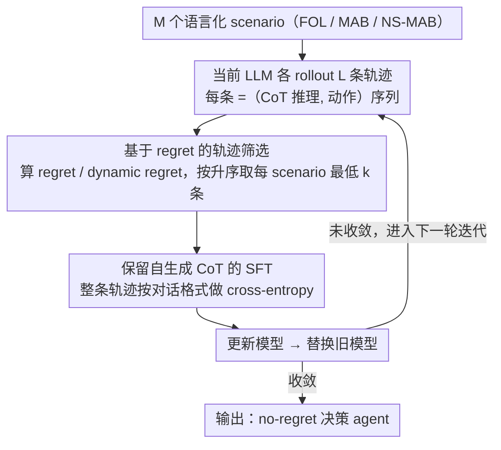

# Post-Training LLMs as Better Decision-Making Agents: A Regret-Minimization Approach

**会议**: ICML 2026  
**arXiv**: [2511.04393](https://arxiv.org/abs/2511.04393)  
**代码**: 暂未公开  
**领域**: LLM Agent / 在线决策 / 后训练  
**关键词**: 后悔最小化、迭代 SFT、在线决策、多臂赌博机、自生成推理

## 一句话总结
作者提出 Iterative RMFT，把 LLM 自己 rollout 出来的决策轨迹按 regret 从低到高排序，挑出最优的 $k$ 条用 SFT 反复微调模型，从而在不依赖任何已知最优算法（如 UCB/FTRL）也不需要人工设计 CoT 模板的前提下，让 LLM 在多臂赌博机、在线学习和非平稳赌博机这三类语言化决策任务上自动涌现出 no-regret 行为和合理的探索-利用平衡。

## 研究背景与动机

**领域现状**：把 LLM 当作决策 agent 部署到多轮交互环境里（推荐、游戏、医疗、运营）已经是一个明显趋势。但 LLM 的预训练目标是 next-token prediction，并没有显式地针对在线决策做优化，所以"为什么 LLM 能做好决策"这件事其实没有理论保证。

**现有痛点**：一系列实证研究表明，未经针对性训练的 LLM 在最基础的在线决策问题上都会出问题：在随机 MAB 上不愿意探索、在对抗在线学习上 regret 线性增长、在非平稳环境里跟不上奖励漂移。换句话说，开箱即用的 LLM 在最经典的"教科书"任务上就已经不是 no-regret learner。

**核心矛盾**：现有的 LLM 后训练方法里，有两条主流路线试图修这个问题：
一条是"算法蒸馏"——把已知最优算法（如 UCB、EXP3）的动作序列当作目标蒸馏给 LLM，但这要求事先知道环境的最优算法，且训练好的模型对动作空间大小、时间长度、奖励分布等问题结构都很敏感，迁移到语言化的新任务时容易失效；另一条是 RL 微调，但用 reward 直接做信号只能解决奖励最大化，并不天然包含探索激励，且无法直接套用到对抗或非平稳设置。

**本文目标**：找到一个既不依赖已知最优算法、也能在语言化决策任务上提升 LLM 决策能力的统一后训练范式，并且要能同时保留和增强 LLM 的 CoT 推理过程。

**切入角度**：作者注意到 regret 是在线决策里一个非常通用的度量——FOL、MAB、NS-MAB 都可以用 regret/dynamic regret 统一刻画——而且只要拿到一条决策轨迹就能事后算出来。既然 LLM 自己 rollout 完轨迹就能算 regret，那 regret 就可以直接当成一个"事后裁判"，用来筛选哪些自生成轨迹值得 SFT。

**核心 idea**：用 regret 作为唯一的轨迹筛选信号，把 LLM 在该 DM 任务上自己生成的低 regret 轨迹反复蒸馏回自身（self-imitation），从而把 no-regret 行为"涌现"出来，而不是硬塞进去。

## 方法详解

### 整体框架
Iterative RMFT 是一个 meta-algorithm：同一套外层循环就能套到 FOL（全信息在线学习）、MAB（多臂赌博机）、NS-MAB（非平稳赌博机）三种在线决策环境上。一次外层迭代里，LLM 在 $M$ 个不同 scenario（语言描述的决策任务）上各 rollout $L$ 条轨迹，每条轨迹由若干 (推理 CoT, 动作) 对组成，全程用自然语言交互；轨迹跑完后算累积 regret，从每个 scenario 里挑 regret 最低的 $k$ 条组成 SFT 数据集 $\mathcal{D}$，用标准 SFT loss 更新模型；新模型替换旧模型进入下一轮，循环至收敛。整个范式的精髓是：训练信号只有 regret 这一个标量，对动作格式、CoT 模板、最优算法都不做任何假设，模型自带的推理也被一并保留并强化。

### 关键设计

**1. 基于 regret 的轨迹筛选：把"评估"和"造数据"用一个标量统一起来**

前面提到 LLM 在最经典的在线决策任务上都不是 no-regret learner，而要修这一点又不想依赖已知最优算法。作者的切入点是：regret 是在线决策的通用度量，只要拿到一条完整轨迹就能事后算出来，那它就可以同时充当"评估指标"和"SFT 数据的筛选器"。具体地，对每个 scenario $i$ rollout 出 $L$ 条轨迹 $C_{1,i}, \dots, C_{L,i}$，每条结束后算 regret——FOL 下用 static regret $\text{Regret}_\mathcal{A}((R_t)_{t\in[T]}, T) = \max_{\pi\in\Pi} \sum_t \langle \pi, R_t\rangle - \sum_t \langle \pi_{\mathcal{A}, t}, R_t\rangle$，MAB 下用期望 regret，NS-MAB 下用 dynamic regret $\text{D-Regret} = \mathbb{E}[\sum_t \max_a r_t(a) - \sum_t r_t(a_{\mathcal{A},t})]$——再按 regret 升序取最低的 $k$ 条进入 $\mathcal{D}$。这样选之所以好用，是因为 regret 不依赖最优算法是否已知、也不依赖动作空间大小或 horizon，天然支持跨任务、跨问题结构的训练；而且筛选发生在轨迹级别而非 token 级别，整条 CoT 被自动保留，避开了 RL 里棘手的 reward-credit-assignment 问题。

**2. 保留自生成 CoT 的 SFT：用模仿自己而不是 RL 来更新模型**

如果像算法蒸馏那样强行规定输出格式、或像 RLFT 那样只拿 reward 当 token-level 信号，模型的自由推理就被压扁了，对抗/非平稳设置下的 regret 也刻画不出来。作者改用最朴素的做法：把入选轨迹按完整对话格式（任务描述 + 历史交互 + 推理 + 动作）当成 SFT 样本，对每个 token 用标准 cross-entropy loss，不引入 reward model、不做 token-level RL、也不强制 CoT 长成某个固定模板。这样一来轨迹里所有自然语言部分（推理 + 动作）都成了监督目标，模型是在"模仿自己最成功的那几次决策"。好处有三：能直接利用闭源 API（如 GPT-4o mini 的 fine-tune 接口）、不约束 CoT 形式、还能让模型自行涌现出新的"算法风格"推理，泛化反而比硬塞模板更强。

**3. 跨环境的 meta-algorithm 实例化：一套信号覆盖 FOL / MAB / NS-MAB**

要证明 regret 信号的普适性，就得让同一套外层循环跑通三类典型环境，差别只在 regret 怎么算和反馈是否完整。FOL 用全信息 reward vector $R_t$ 评估每轮动作；MAB 只有部分反馈 $R_t(a_t)$ 并对随机性取期望；NS-MAB 额外引入 variation budget $V_T = \sum_{t=2}^T \|r_t - r_{t-1}\|_\infty$ 并改用 dynamic regret 作筛选准则。scenario 库是语言化场景（医疗推荐、资源分配、营销等），每个 scenario 每轮都被翻成自然语言对话，agent 输出动作 + CoT，再由程序从输出里 parse 出 $a_t$ 或 $\pi_t \in \Delta(\mathcal{A})$。单一信号能同时覆盖这三种环境，本身就是 regret 通用性最强的经验证据；而且作者在 scenario 维度做了大量随机化（horizon、动作空间、奖励生成、领域 context 全在变），逼着模型学到通用决策策略，而不是记住某个 horizon 下的 lookup table。

### 损失函数 / 训练策略
内层就是普通 SFT：在选出的轨迹 token 上最小化 cross-entropy，不加任何正则；外层迭代次数和每轮的 $k$、$L$、$M$ 都是超参。理论侧作者在单层 attention Transformer 的简化场景下证明，这种"迭代模仿自己最低 regret 轨迹"过程的不动点恰好对应 FTRL 算法，因此 no-regret 行为在该理论模型里是被这套范式诱导出来的，而不是巧合。

## 实验关键数据

### 主实验
覆盖了三类模型：（1）数值输入输出的小 Transformer 作为可控 warm-up；（2）开源 LLM：Phi-3.5-mini、Gemma-2-9b-it、Qwen3-8B；（3）闭源 LLM：GPT-4o mini，通过其 SFT API 做训练。

| 环境 | 模型类型 | 训练前行为 | Iterative RMFT 后 |
|------|----------|-----------|------------------|
| FOL（语言化） | 开源 LLM（Phi-3.5 / Gemma-2-9b / Qwen3-8B） | regret 线性增长，$\hat\beta \approx 1$ | $\hat\beta < 1$、$p_{\text{reg}}$ 显著，呈现 sublinear regret |
| MAB（语言化） | GPT-4o mini | SuffFailFreq 偏高、不愿意探索 | SuffFailFreq 显著下降、MinFrac 上升，探索更均匀 |
| NS-MAB（语言化） | 开源 LLM + GPT-4o mini | dynamic regret 跟不上漂移 | dynamic regret 增速放缓，能在 reward 漂移后切换臂 |
| FOL（数值 Transformer） | 单/多层 attention | 默认初始化无 no-regret 保证 | 训练后 $\hat\beta < 1$，与 FTRL baseline 接近 |

### 消融实验

| 配置 | 关键指标 | 说明 |
|------|---------|------|
| Iterative RMFT（完整） | regret 增长 sublinear；探索-利用平衡 | 完整方法 |
| 仅 1 轮 RMFT（非迭代） | regret 改善但仍接近线性 | 单轮 SFT 不足以"放大"低 regret 行为，迭代是关键 |
| 用 reward（而非 regret）筛选 | 在 FOL/NS-MAB 上 regret 反弹 | 验证 cumulative reward maximization $\neq$ regret minimization，特别是在对抗 / 非平稳设置 |
| 去掉自生成 CoT（只 SFT 动作） | 跨场景泛化能力下降 | 自生成 reasoning 是模型在新场景下保持 no-regret 的关键 |
| 跨任务泛化（训练 FOL，测试 MAB / 改变 horizon、动作数、reward 分布） | 仍能保持 sublinear regret | 说明学到的不是特定 horizon 下的模式，而是更通用的决策策略 |

### 关键发现
- regret 比 reward 更适合作为后训练信号：reward 在随机环境下也许够用，但一旦换到对抗/非平稳设置，cumulative reward maximization 不等价于 regret minimization，模型会退化。
- 自生成 CoT 是泛化的关键来源：训练时强制丢掉 CoT 只 SFT 动作 token，会让模型在 scenario 变化（如改变 reward 描述、领域）时崩盘；保留自生成推理则能跨任务迁移。
- 迭代是必需的：单次 RMFT 只能让 regret 下降一点，多轮迭代会把低 regret 的少数行为模式逐渐放大成模型的默认行为。
- 理论侧给出了一个直觉证据：在单层 attention Transformer 的简化设置里，"模仿自己最低 regret 轨迹"的不动点是 FTRL，说明 no-regret 行为是这套范式的自然吸引子。

## 亮点与洞察
- 把 regret 当成"事后裁判"而不是"训练 loss"，绕开了 regret 在 token-level autoregressive 生成里难以直接 backprop 的难题；这是把经典 online learning 工具迁移到 LLM 训练的一个非常聪明的角度。
- 用 SFT 而不是 RL 让方法天然兼容闭源模型的 fine-tune API（GPT-4o mini），从工程角度大大降低了落地门槛——这是大多数 RLHF/RLFT 类工作做不到的。
- "self-imitation 收敛到 FTRL" 这个理论结果，给"为什么这种 self-distillation 能涌现 no-regret 行为"提供了一个具体的极限性质，而不只是经验观察。
- 思路可迁移：任何能用一个标量度量事后评估完整轨迹的任务（multi-turn 工具调用、code agent、game playing），都可以借鉴"rollout → 按度量排序 → top-$k$ self-SFT → 迭代"的范式，把度量从 regret 替换成任务相关指标即可。

## 局限与展望
- 作者承认 GPT-4o mini 这类闭源模型的训练 API 不能完全控制超参，而且训练成本随 scenario 数和迭代轮数线性增长。
- 理论结果仅限于单层 attention 的简化设置，多层 Transformer 上 self-imitation 是否仍收敛到无 regret 算法是 open question。
- 评测仍以 canonical online DM 任务为主，真正复杂的语言决策（如多步工具使用 + 长上下文）只覆盖了变体 scenario，没有放到端到端 agent benchmark 上。
- 用 regret 排序需要事后能算 regret，这要求要么有 oracle 最优策略、要么有完整 reward feedback；对很多真实场景（如 RLHF 风格的人类偏好反馈）需要先解决"如何定义 regret"的问题。
- 改进思路：把 regret 估计换成 LLM-as-judge 给出的"相对最优策略的差距估计"，可以在没有 oracle 的真实任务上扩展这套范式；或者把 SFT 换成 DPO，对"低 regret 轨迹 vs 高 regret 轨迹"做偏好优化以提高样本效率。

## 相关工作与启发
- **vs Nie et al. 2025 (算法蒸馏)**: 他们把已知最优算法（如 UCB）的动作序列蒸馏给 LLM；本文不依赖任何已知最优算法，靠 regret 自动筛选自生成轨迹，泛化性更好。
- **vs Schmied et al. 2026 (RLFT)**: 都用自生成 CoT，但 RLFT 用 reward 做信号且依赖 UCB 风格的人工 CoT 模板；本文用 regret 做信号、不约束 CoT 格式，能覆盖对抗和非平稳环境。
- **vs Park et al. 2025b (regret-loss)**: 他们直接把 regret 当 loss 反传到数值 Transformer，得到 FTRL；本文把这一思想从"显式优化 regret"扩展到"用 regret 选轨迹再 SFT"，使其适用于语言化输入输出和闭源 LLM。
- **vs 一般 RLHF / RLAIF**: RLHF 的训练目标是 reward maximization 而非 regret minimization，且通常不显式激励探索；本文表明对决策类任务而言，regret 是比 reward 更合适的训练信号。

<!-- RELATED:START -->

## 相关论文

- [\[ACL 2025\] R2D2: Remembering, Replaying and Dynamic Decision Making with a Reflective Agentic Memory](../../ACL2025/llm_agent/r2d2_reflective_agentic_memory.md)
- [\[ACL 2026\] MemSearcher: Training LLMs to Reason, Search and Manage Memory via End-to-End RL](../../ACL2026/llm_agent/memsearcher_training_llms_to_reason_search_and_manage_memory_via_end-to-end_rein.md)
- [\[ICLR 2026\] AgentGym-RL: An Open-Source Framework to Train LLM Agents for Long-Horizon Decision Making via Multi-Turn RL](../../ICLR2026/llm_agent/agentgym-rl_an_open-source_framework_to_train_llm_agents_for_long-horizon_decisi.md)
- [\[ICML 2026\] SafeHarbor: Defining Precise Decision Boundaries via Hierarchical Memory-Augmented Guardrail for LLM Agent Safety](safeharbor_hierarchical_memory-augmented_guardrail_for_llm_agent_safety.md)
- [\[ACL 2025\] LLM Agents Making Agent Tools](../../ACL2025/llm_agent/llm_agents_making_agent_tools.md)

<!-- RELATED:END -->
